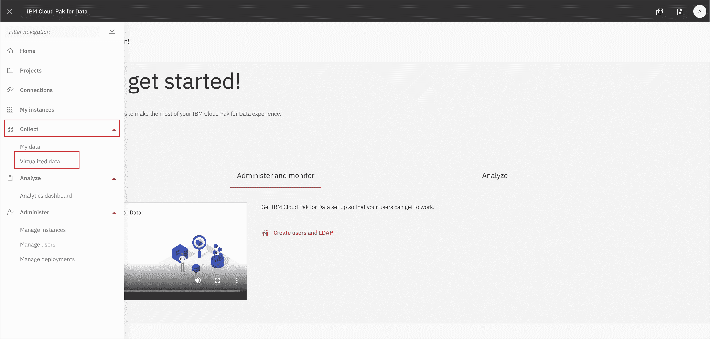

# 利用 Data Virtualization 实现 Db2 Warehouse 数据虚拟化

> 原文：[`developer.ibm.com/zh/tutorials/virtualizing-db2-warehouse-data-with-data-virtualization/`](https://developer.ibm.com/zh/tutorials/virtualizing-db2-warehouse-data-with-data-virtualization/)

**本教程纳入 [IBM Cloud Pak for Data 快速入门学习路径](https://developer.ibm.com/zh/series/cloud-pak-for-data-learning-path/)**。

| 级别 | 主题 | 类型 |
| --- | --- | --- |
| 100 | [IBM Cloud Pak for Data 简介](https://developer.ibm.com/zh/articles/intro-to-cloud-pak-for-data) | 文章 |
| **101** | **[利用 Data Virtualization 实现 Db2 Warehouse 数据虚拟化](https://developer.ibm.com/zh/tutorials/virtualizing-db2-warehouse-data-with-data-virtualization)** | **教程** |
| 201 | [利用 Data Refinery 实现数据可视化](https://developer.ibm.com/zh/tutorials/data-visualization-with-data-refinery) | 教程 |
| 202 | [使用 Watson Knowledge Catalog 查找、准备和理解数据](https://developer.ibm.com/zh/tutorials/find-prepare-and-understand-data-with-watson-knowledge-catalog) | 教程 |
| 301A | [借助内置 Notebook 的 Watson Machine Learning 进行数据分析、建模以及部署](https://developer.ibm.com/zh/patterns/data-analysis-model-building-and-deploying-with-wml) | Pattern |
| 301B | [使用 AutoAI 自动构建模型](https://developer.ibm.com/zh/tutorials/automate-model-building-with-autoai) | 教程 |
| 301C | [使用 IBM SPSS Modeler 快捷构建预测机器学习模型](https://developer.ibm.com/zh/tutorials/build-an-ai-model-visually-with-spss-modeler-flow) | 教程 |
| 401 | [利用 Watson OpenScale 监视模型](https://developer.ibm.com/zh/patterns/watson-openscale-with-watson-machine-learning-engine-on-icp4d) | Pattern |

数十年来，企业一直都在不断尝试通过将数据从不同运作系统复制到中央数据存储区（例如，数据集市、数据仓库和数据湖）进行分析来突破数据孤岛。这种做法不仅成本高昂，还易于出错。大部分企业平均要管理 33 个独立数据源，这些数据源的结构和类型各不相同，并且通常淹没在难以查找和访问的数据孤岛中。

借助 Data Virtualization，您无需进行复制便可查询众多系统上的数据，从而降低了成本。因为您直接在数据源中查询最新数据，故而它还可以简化分析过程的同时使分析时刻保持最新状态且准确无误。

在本教程中，我们将学习如何利用 IBM Cloud Pak for Data 上的 Data Virtualization 实现 Db2 Warehouse 数据虚拟化，以便在多个不同数据源之间执行查询。

## 学习目标

在本教程中，您将学习如何：

*   向 IBM Cloud Pak for Data 添加数据集。
*   向 Data Virtualization 添加数据源。
*   虚拟化数据并创建联合视图。
*   将已虚拟化的数据分配给项目。
*   为用户添加角色并执行管理任务。

## 前提条件

*   [IBM Cloud Pak for Data](https://www.ibm.com/cn-zh/products/cloud-pak-for-data)
*   [IBM Cloud 帐户](https://www.ibm.com/cloud)

## 预估时间

完成本教程大约需要 30-45 分钟。

## 步骤

### 第 1 步：获取数据

下载以下 3 个数据文件：

*   billing.csv
*   customer-service.csv
*   products.csv

### 第 2 步：关于此数据集

用于本教程的数据源原先来自于 Watson Analytics，曾用于 [Kaggle](https://www.kaggle.com/blastchar/telco-customer-churn) 项目，其中包含电信公司客户流失率的相关信息。数据拆分为三个 CSV 文件。

#### **billing.csv**

此文件包含以下属性：

*   客户 ID
*   合同 *(按月、一年、两年)*
*   无纸化记账 *（“是”或“否”）*
*   付款方式 *（银行转账、信用卡、电子支票或邮寄支票）*
*   每月费用 *（美元）*
*   总费用 *（美元）*
*   客户流失率 *（“是”或“否”）*

#### **customer-service.csv**

*   客户 ID
*   性别 *（“男”或“女”）*
*   老年人 *（1 或 0）*
*   配偶 *（“有”或“无”）*
*   家属 *（“有”或“无”）*
*   工作任期 *(1-100)*

#### **products.csv**

*   客户 ID
*   电话服务 *（“有”或“无”）*
*   多重线路 *（“有”、“无”或“无电话服务”）*
*   互联网服务 *（DSL、“光纤”或“无”）*
*   网络安全 *（“有”、“无”或“无网络服务”）*
*   在线备份 *（“有”、“无”或“无网络服务”）*
*   设备保护 *（“有”、“无”或“无网络服务”）*
*   技术支持 *（“有”、“无”或“无网络服务”）*
*   流媒体电视 *（“有”、“无”或“无网络服务”）*
*   流媒体电影 *（“有”、“无”或“无网络服务”）*

### 第 3 步：为 Db2 Warehouse 数据库设置种子

我们将需要一处合适位置来存储数据。对于本教程，我们出于以下几个原因而选择使用 Db2 Warehouse on IBM Cloud：它模拟真实企业数据库；IBM Cloud 提供了一个免费层；我们可以轻松加载数据集。

### 将数据加载到本地 DB2 Warehouse

这些说明介绍了如何将数据加载到 DB2 Warehouse 的本地 Cloud Pak for Data 版本。对于 IBM Cloud 版本，操作步骤基本相同。

单击左上角的 (☰) 汉堡菜单，然后选择 `Collect` -> `My data`：

转到 *Databases* 选项卡，单击 *DB2 Warehouse* 磁贴上的 3 条竖线，然后单击 `Open`：

在 `Menu` 下，选择 `Load` 和 `Load Data`：

选择 `Browse files`：

浏览至此存储库所克隆到的位置，然后浏览至 `data/split/` 并选择 `billing.csv`，最后单击 `Next`。

选择 `NULLIDRA` 模式，然后单击 `+ New table`。在“New Table Name”下，输入“BILLING”，单击 `Create`，然后单击 `Next`。

接受默认值，然后单击 `Next`。单击 `Begin Load`。

对 `products.csv` 和 `customer-service.csv` 重复上述过程，将这些表分别命名为 `PRODUCTS` 和 `CUSTOMERS`。

### 第 4 步：创建新的 IBM Cloud Pak for Data 项目

#### 登录到 IBM Cloud Pak for Data

启动浏览器并浏览至 IBM Cloud Pak for Data 部署

#### 创建一个新项目

转至 (☰) 菜单并单击 *Projects*

![(☰) Menu -> Projects”/>

单击 <em>New project</em>

 **注意**：本部分需要是 `Admin` 用户才有权访问 IBM Cloud Pak for Data 集群。

对于本部分，我们现在将使用 Data Virtualization 工具，从现已作为 IBM Cloud Pak for Data 中的连接公开的 Db2 Warehouse 导入数据。

#### 向 Data Virtualization 添加数据源

要启动 Data Virtualization 工具，请转至 (☰) 菜单并单击 `Collect`，然后单击 *Data Virtualization*。

选择在上一步中生成的数据源，然后单击 *Next*。

新连接将列为 Data Virtualization 的数据源。

#### 开始对数据进行虚拟化

在本部分中，由于现在我们可以访问 Db2 Warehouse 数据，因此可以将这些数据虚拟化到 IBM Cloud Pak for Data 项目中。单击 *Menu* 按钮，并选择 *Virtualize*。

CUSTOMER、`PRODUCT` 和 `BILLING`。选中后，单击 *Add to cart*，然后单击 *View Cart*。

下一个面板会提示用户选择要将数据分配到哪个项目，这里选择您在先前练习中创建的项目。单击 *Virtualize* 以开始此流程。

您将收到已创建虚拟表的通知！在 Data Virtualization 工具中单击 *View my data*，查看新的虚拟化数据。

#### 连接虚拟化数据

现在，我们将**连接**已创建的表，以获取合并数据集。在此处执行操作要比在 Notebook 中更方便，后者必须编写代码才能处理三种不同数据集。单击任意两个表（如 `PRODUCTS` 和 `BILLING`），并单击 *Join view* 按钮。

要连接这两个表，我们需要选取这两个数据集共用的键。这里我们选择将第一个表中的 `customerID` 映射到第二个表中的 `customerID`。单击其中之一，并将其拖到对应项。绘制好连线后，单击 *Join*。

在下一个面板中，我们将为连接后的数据提供一个唯一名称（为遵循 SQL 标准，需要选择一个全大写的名称）。我选择的是 `XXXBILLINGPRODUCTS`（其中 `XXX` 是我的用户 ID，并且*全部大写*）。然后，检查合并后的表，确保所有列都存在，并且只有一个 `customerID` 列。单击 *Next* 以继续。

接下来，我们将选择要将连接的视图分配到哪个项目，这里选择您在先前练习中创建的项目。单击 *Create view* 以开始此流程。

您将收到连接已成功的通知！单击 *View my virtualized data* 以重复此过程，从而获取全部三个表。

**要点** 重复上述步骤，但这次选择连接新连接的视图 (`XXXBILLINGPRODUCTS`) 以及最后一个虚拟化的表 (`CUSTOMERS`)，从而创建包含全部三个表的新连接视图，我们把它命名为 `XXXBILLINGPRODUCTSCUSTOMERS`。切换到我们的项目，其中应显示全部三个虚拟化的表，以及两个连接的表。完成此步骤后再进入下一个部分。

## 授予对虚拟化数据的访问权

为了让其他用户能够访问您刚刚虚拟化的数据，您需要为他们授予访问权。请遵循以下步骤，让这些用户可以看到虚拟化数据。

转至 (☰) 菜单中的 *Data Virtualization*。单击 `Menu` -> `My virtualized data`。

单击您创建的虚拟化数据，然后单击其中一项右侧的 3 个水平点 `...`，然后选择 `Manage access`：

单击 `Specific users` 按钮，然后单击 `+ grant access`：

选择要为其授予访问权的用户，然后单击 `Add`：

#### 为用户分配“Steward”角色。

转至菜单中的 *Data Virtualization* 选项。单击 *Manage users*

单击 *Add user*，并确保所有用户都具有 *Steward* 角色。

### 第 6 步：分配虚拟化数据

#### 将数据分配给您的项目

在菜单中单击 *Collections* -> *Data Virtualization*，您将转至 *My data* 部分。您在此处应看到管理员为您分配的数据。选择可用的数据集，并单击 *Assign* 开始将其导入您的项目。

在此选择您先前创建的项目。

切换到我们的项目，其中应显示全部三个虚拟化的表，以及两个连接的表。完成此步骤后再进入下一个部分。

## 结束语

本教程演示了如何利用 IBM Cloud Pak for Data 上的 Data Virtualization 实现 Db2 Warehouse 数据虚拟化，以便在多个不同数据源之间执行查询。本教程纳入 [IBM Cloud Pak for Data 快速入门学习路径](https://developer.ibm.com/zh/series/cloud-pak-for-data-learning-path/)。要继续学习本系列并了解有关 IBM Cloud Pak for Data 的更多信息，可阅读下一个教程[利用 Data Refinery 实现数据可视化](https://developer.ibm.com/zh/tutorials/data-visualization-with-data-refinery)。