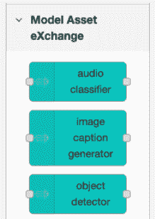
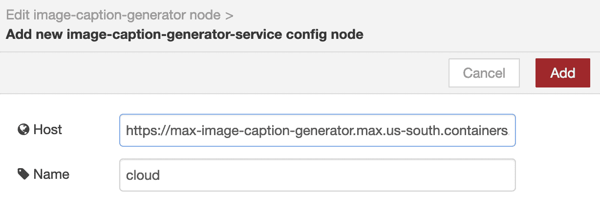

# 在 Node-RED 数据流中利用深度学习模型

> 原文：[`developer.ibm.com/zh/tutorials/learn-how-to-leverage-deep-learning-in-your-node-red-flows/`](https://developer.ibm.com/zh/tutorials/learn-how-to-leverage-deep-learning-in-your-node-red-flows/)

## 学习目标

本介绍性教程阐述了如何在 Node-RED 数据流（flow）中使用 Model Asset Exchange 中的深度学习模型来处理图像、视频、音频或文本数据。

## 前提条件

如果您不熟悉 ModelAssetExchange，请阅读这篇[介绍性文章](https://developer.ibm.com/zh/articles/introduction-to-the-model-asset-exchange-on-ibm-developer/)，其中提供了简明扼要的概述信息。

您可以使用预先配置的演示 Docker 镜像来完成本教程，也可以使用 Node.js 和 Node-Red 的本地安装。

### 使用预先配置的 Docker 镜像

请遵循 [`max-node-red-demo` GitHub 存代码仓库](https://github.com/CODAIT/max-node-red-docker-image) 中的 *Getting Started* 一节中的指示信息来下载并运行预先配置的 Docker 镜像。

### 使用 Node.js 和 Node-RED 的本地安装

确保安装了最新版本的 Node.js 或 Node-RED。您可以从以下位置下载最新版本：

*   [Node.js](https://nodejs.org/en/)
*   [Node-RED](https://nodered.org/docs/getting-started/installation)

已使用 Node.js 版本 10.16 和 Node-Red 版本 0.20.8 以及最新版本的 Chrome 浏览器测试了本教程中的代码。

## 预估时间

完成本教程大约需要 30 分钟。

## 步骤

本教程包括以下步骤：

*   设置
*   导入 Model Asset Exchange 节点
*   探索 Image Caption Generator 节点
*   生成图像标题
*   在数据流中使用多个节点

> 在 `max-node-red-demo` Docker 镜像中，已为您完成了 *设置* 和 *导入 Model Asset Exchange 节点* 步骤。如果您在学习本教程的过程中使用了该镜像，请查看（但不要完成）这些章节中的指示信息。

### 教程设置

1.  打开终端窗口，启动 Node-RED `node-red`，然后通过将浏览器指向所显示的 URL（如 `http://127.0.0.1:1880`）来打开 Node-RED 编辑器。

2.  从 **☰** 菜单中，选择 **Manage palette**。

    

3.  在 *User Settings* 的 *Palette* 选项卡中，选择 **Install**。

4.  搜索 `node-red-contrib-browser-utils` 模块，如果还没有安装该模块，请进行安装。
5.  关闭设置窗口。

    

6.  确认在 *input* 类别中已列出了 *camera* 和 *file inject* 节点。本教程中稍后会使用这些节点。

    

### 导入 Model Asset Exchange 节点

已在 [npm](https://www.npmjs.com/package/node-red-contrib-model-asset-exchange) 中发布了 Model Asset Exchange 节点。

1.  从 **☰** 菜单中，选择 **Manage palette**。
2.  在 *User Settings* 的 *Palette* 选项卡中，选择 **Install**。
3.  搜索 `node-red-contrib-model-asset-exchange` 模块并安装该模块。
4.  关闭设置窗口。

    *Model Asset eXchange* 类别中应该会显示若干个节点。

    

    每个 Model Asset Exchange 节点都会使用深度学习微服务（可在本地环境或云中运行此微服务）的端点。

    

为了使本教程简单明了，您需要将节点与托管的演示微服务实例关联起来。

> [*Model Asset Exchange 入门* 教程](https://developer.ibm.com/zh/tutorials/getting-started-with-the-ibm-code-model-asset-exchange/)概述了如何在本地环境中运行自己的微服务实例。[*在 Red Hat OpenShift 上部署深度学习模型* 教程](https://developer.ibm.com/zh/tutorials/deploy-a-model-asset-exchange-microservice-on-red-hat-openshift/)阐述了如何在云中的 Kubernetes 上部署自己的微服务实例。

### 探索 Image Caption Generator 节点

为了便于说明，您将使用 Image Caption Generator 节点，该节点可分析图像并生成标题。如果您愿意，可以使用其他节点来练习。本教程中介绍的步骤和概念适用于所有节点。

1.  将 **image caption generator** 节点拖动到工作区，然后查看所显示的信息。此节点有一个输入和一个输出（微服务响应）。

2.  双击该节点进行编辑。下面列出了两个节点属性：*service* 和 *method*。

    

3.  编辑 *service* 节点属性，以将该节点与 Image Caption Generator 微服务实例关联起来。

4.  默认情况下，*host* 预先填充了此微服务的托管演示实例的 URL，您可以使用此 URL 来探索其功能。单击 **Add** 以将此演示实例与节点关联起来。

    

    > 切勿将托管的演示微服务实例用于生产工作负载。要使用您自己的微服务实例（本地或云），请输入其 URL（例如，如果您使用 Docker Hub 中预先构建的 Docker 容器在本地计算机上运行服务，则输入 `http://127.0.0.1:5000`）。

5.  Model Asset Exchange 微服务公开了多个端点，这些端点在 *method* 属性下列出。默认情况下，系统会选择 *predict* 方法来分析节点的输入。

    

    > 某些方法接受可选的输入参数（例如阈值）。（Image Caption Generator 没有可选的输入参数。）可以自定义某些方法输出。有关详细信息，请参阅节点的帮助。

6.  从下拉列表中选择 **metadata** 以检索有关该微服务的信息。

    

7.  关闭节点的属性窗口。

8.  将一个 **inject** *input* 节点拖到工作区中，并将其输出连接到 *image caption generator* 节点的输入。

    > 节点名称会自动更改为 *timestamp*。（我们只使用此节点来运行数据流。微服务的 *metadata* 方法不需要任何输入。)

9.  将 **debug** 输出节点拖到工作区中，并将其输入连接到 *image caption generator* 节点的输出。

    已完成的数据流应该类似于下图。

    

10.  部署该数据流。

11.  从 **☰** 菜单中，选择 **View** > **Debug messages** 以打开调试输出视图。

12.  单击 *inject* 节点的按钮以将消息注入该数据流并检查调试输出。如果设置正确，则输出应该如下所示：

    ```
    id: "max-image-caption-generator"
    name: "MAX Image Caption Generator"
    description: "im2txt TensorFlow model trained on MSCOCO"
    type: "Image-to-Text Translation"
    source: "https://developer.ibm.com/exchanges/models/all/max-image-caption-generator/"
    license: "Apache 2.0" 
    ```

您刚刚确认了该节点可以连接到指定的服务。接下来，您将修改该数据流以生成图像标题。

### 生成图像标题

Image Caption Generator 的 `predict` 方法将分析所提供的输入图像并生成图像内容的简要描述。

1.  双击 *image caption generator* 节点以编辑其属性。
2.  将所选的 *method* 从 *metadata* 更改为 **predict**。
3.  将 *inject* 节点替换为 **file inject** 节点（或者替换为 **camera** 节点 – 仅在 Chrome 或 Firefox 中支持此操作），然后将其输出连接到 *image caption generator* 节点。

    

4.  部署该数据流。

5.  单击 **file inject**（或 **camera**）节点按钮以选择图像（或拍照）并检查调试输出，其中应该包含用于描述图像的标题。

    ```
     a man sitting on a bench with a dog . 
    ```

    您可以通过消息对象来访问整个微服务 JSON 响应。

6.  打开 *debug* 节点的属性并将输出更改为 **complete msg object**。

7.  重新部署并重新运行该数据流。
8.  检查输出。消息 `details` 包含一个 `predictions` 数组，此数组包含了生成的标题。

    ```
     {
      "payload": "a man sitting on a bench with a dog .",
      "_msgid": "e8f93edc.7eddd",
      "statusCode": 200,
      ...
      "details": {
         "status": "ok",
         "predictions": [
             {
                 "index": "0",
                 "caption": "a man sitting on a bench with a dog .",
                 "probability": 0.00033009440665662435
             },
             {
                 "index": "1",
                 "caption": "a teddy bear sitting on a bench in a park",
                 "probability": 0.00009953154282018676
             }
         ]
      },
      "topic": "max-image-caption-generator"
     } 
    ```

### 探索其他模型节点

`node-red-contrib-model-asset-exchange` 模块包括几个入门级别的数据流，您可以将这些数据流导入到工作区中。

1.  从 **☰** 菜单中，选择 **Import** > **Examples** > **model asset exchange** > **getting started**。

    

2.  选择其中一个数据流以将其导入到工作区中。

3.  检查预先配置的数据流，然后部署并运行该数据流。

### 在数据流中使用多个节点

到目前为止，您探索的基本数据流都使用了一个深度学习节点。让我们来了解一个更高级的使用场景。

1.  从 **☰** 菜单中，选择 **Import** > **Examples** > **model asset exchange** > **beyond the basics** > **using-multiple-models**。

    

    在这种场景中，输入（图像文件或者用相机拍摄的照片）由 Object Detection 节点进行处理。此节点配置为将输入传递到 Image Caption Generator 节点，该节点会生成供调试节点显示的说明性标题。Object Detection 节点还配置为生成带注释的输入图像，其中针对每个标识对象各包含一个边界框和一个对象标签。

    两个功能节点（*Extract Input Image Data* 和 *Extract Bounding Box Image Data*）将该节点的输出映射到 Image Caption Generator 节点和图像预览节点的输入。

2.  打开 *object-detector* 节点并检查该节点的输出配置。该节点的帮助信息描述了生成的输出以及其他节点如何访问该输出。

    

3.  部署并运行该数据流。调试窗口中应该会显示图像标题，并在画布上显示带注释的图像的预览。

    

    > 如果没有显示带注释的图像，则在输入中未检测到任何对象。

## 结束语

在本教程中，您了解了如何在 Node-RED 数据流中使用 Model Asset Exchange 中的 Image Caption Generator 微服务来生成图像标题。本教程展示了如何执行以下操作：

*   将 `node-red-contrib-model-asset-exchange` 模块导入到面板中
*   使用 *Model Asst eXchange* 类别中的节点创建数据流
*   部署并运行数据流，然后检查生成的输出
*   导入样本数据流
*   自定义节点输出选项

本文翻译自：[Leverage deep learning in your Node-RED flows](https://developer.ibm.com/tutorials/learn-how-to-leverage-deep-learning-in-your-node-red-flows/)（2019-09-12）