# 在数据可视化中使用图形和图表

> 原文：[`developer.ibm.com/zh/tutorials/using-plots-and-charts-in-data-visualization/`](https://developer.ibm.com/zh/tutorials/using-plots-and-charts-in-data-visualization/)

本教程将重点介绍数据可视化的功能、设置、用途和图表的呈现效果。数据可视化提供了各种图表，包括常用的折线图、条形图、饼图、散点图和直方图。数据可视化还包括大量的统计图表，包括箱形图、误差条形图、分位数图、时间图、三维图、评价图和 t-SNE 图。有了这些功能丰富的图表，您完全不必担心如何选择分析。您只需导入数据，数据可视化将自动帮助您选择合适的图表类型。分析完成后，您可以下载当前图表及其属性，以便在下次分析时使用或参考。

## 预估时间

完成本教程大约需要 60 分钟。

## 步骤

### 第 1 步：主屏幕上的选项

在主屏幕上，选择要分析的数据列后，可以直接查看不同的图表，所有所需的数据计算值都显示在图表中供参考。当然，也可以根据您的需求来选择和替换数据。也可以随时选择和调整各种参数。

这里，我们以直方图为例，展示了你如何在不同的参数设置的前提下获得所需的图表。

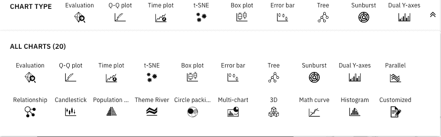 **图 1：Chart 面板**

### 第 2 步：分析可视化

数据视图中的可视化侧重于探索数据特征以获得洞察。使用图表可以借助不同视图和方法来分析数据。

#### 时间序列图

时间序列图解释了时间序列数据（相等间隔时间点的数据值）。此图表显示坐标和极坐标系统中的特征，以提供该系列的概述和分解。

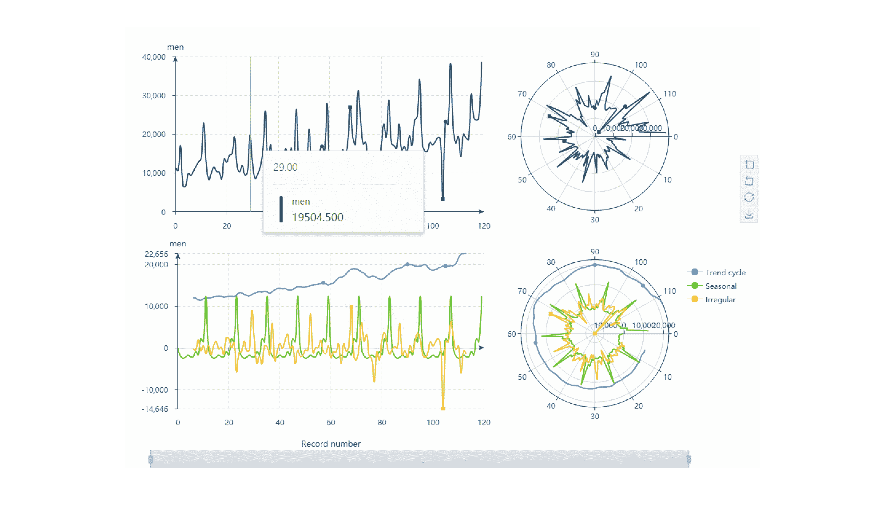 **图 2：时间序列图 – 概述**

单一时间序列可分为三个分量：趋势周期分量、季节分量和不规则分量。转折点是基于趋势周期分量，这一部分代表了长期的变化。离群点是基于代表不规则异常值的不规则分量。

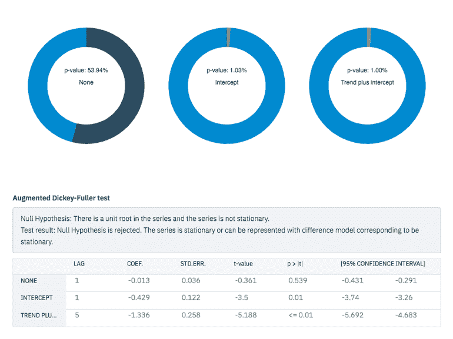 **图 3：时间序列 – ADF 测试**

对时间序列样本中存在单位根的原假设进行 Augmented Dickey-Fuller (ADF) t-statistic 检验。

有三个模型需要检验：

*   类型 1：无截距，无趋势
*   类型 2：截距
*   类型 3：截距加趋势

这三个模型的零假设是：序列中存在单位根，并且序列不是平稳的。 如果 p 值小于 0.05，则意味着拒绝零假设。序列是平稳的或它的行为可以用对应于平稳的差分模型来表示。滞后表示该过程的差异是平稳的。

ACF（自相关函数）和 PACF（偏自相关函数）图给出了时间序列与滞后之间的相关系数和偏相关关系。在这个示例中，ACF 衰减得更慢，而 PACF 在滞后 1 之后显示出明显锐减。特征显示 AR(1) 模型。您会发现它在滞后 12 和 24 有一个显著的峰值。

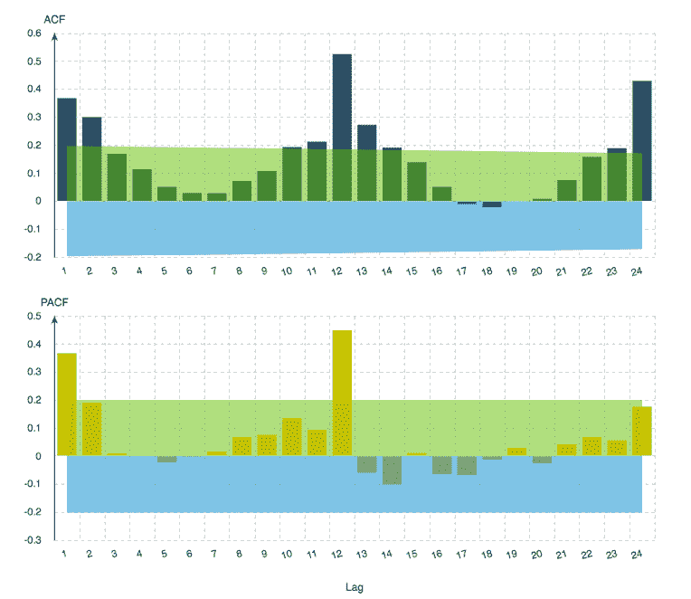 **图 4：时间序列图 – ACF/PACF**

扩展自相关函数 (EACF) 是识别混合 ARMA 模型的有效工具。在某些情况下，同时具有 AR 和 MA 项的“混合”模型可能提供对数据的最佳拟合。

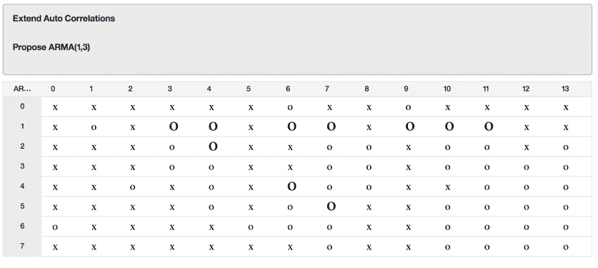 **图 5：时间序列图 – EACF**

您可以看到，有一个“O”构成的三角形，顶点在 (1,1)，这提出了 ARMA(1,1) 模型。

频谱分析用于识别时间序列中的周期行为。在本例中，时间序列中的每个数据点代表一个月。因此，一个年度周期对应于当前数据集中的 12 个周期。因为周期和频率互为倒数，所以周期 12 对应频率 1/12（或 0.083）。因此，“年”分量意味着周期图中在 0.083 处有一个峰值，这似乎与峰值出现在频率略低于 0.1 的位置相一致。

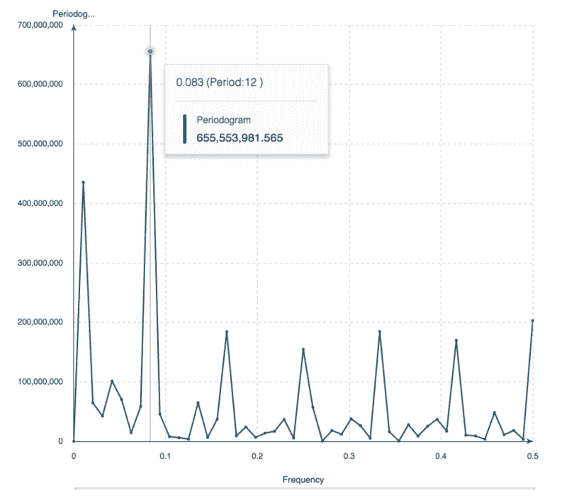 **图 6：时间序列图 – 频谱分析**

#### t-SNE 图表

T 分布随机近邻嵌入 (t-SNE) 是一种高维数据可视化工具。它将数据点之间的相似性转换为联合概率，并尝试以降维来非线性地表示高维数据（通常为二维或三维，以便可视化复杂数据）。您可以使用 t-SNE 输入在降维的数据可视化中创建集群和边缘。

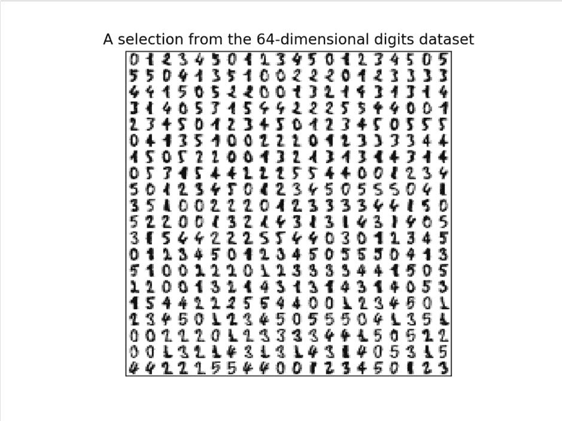 **图 7：t-SNE 图表 – 手写数字**

下面是对手写数字数据集的各种嵌入的说明。样本由 44 位作者撰写，共 1797 张大小为 8×8 图像。每个图像都是手写数字。在数据集中，图像转化为一个长度为 64 的向量。

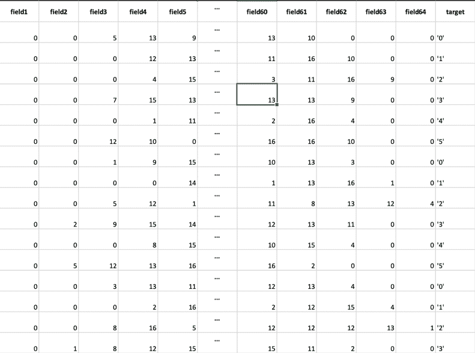 **图 8：t-SNE 图表 – 转化为 64 列数据集的手写数字**

应用 t-SNE 后，数据集将显示如下结果：

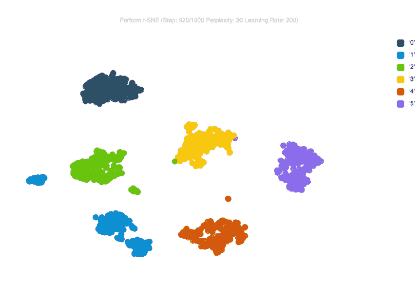 **图 9：t-SNE 图表 – 应用 t-SNE 之后的二维绘图结果**

存储在高维数据集中的不同数字被清楚地分开。

#### 关系图

我们将使用关系图来分析天气数据。关系图通过使用不同类型的线段来显示数据列之间的关系以及这种关系的强度。

#### 在图表列表中选择“Relationship”

单击下拉箭头可将所有支持的列（仅支持离散数据）添加到“Columns”框中。天气数据中有 4 个离散列：LEVEL、KEY_POLLUTANT、WEATHER1 和 WEATHER2。

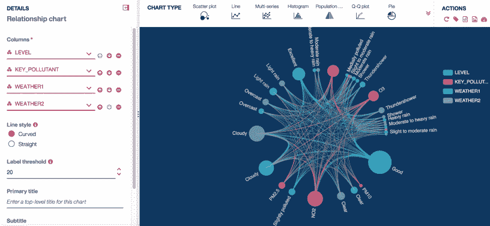 **图 10：关系图 – 天气质量等级与污染物因素的关系**

图中最大的点是 (level.good)，最粗的连线是 (key_pollution.no2)，说明良好的空气质量与 NO2 的数值的关系最密切。将鼠标移动到标记为 (level.good) 的最大绿点上。您将看到与 (level.good) 无关的所有其他值都将被过滤掉。从 (level.good) 开始最粗的一条线是 KEY_POLLUTION.NO2，这意味着空气质量良好，关键污染物很可能是 NO2。

#### 平行图

单击 Parallel 图表，设置如下所示。平行图表显示并比较数据行（称为配置文件），以寻找相似性。每行都是一条线条，行的每一列中的值由该线条上的一个点来表示。在 Columns 中，添加“PM10”、“SO2”、“CO”、“NO2”、“O3_8h”和“WINDSPEED_MEAN”。接下来，对于 Color Map 选项选择“LEVEL”。

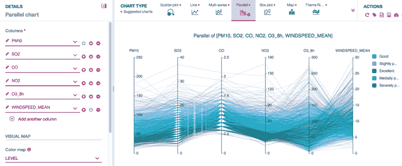 **图 11：平行图**

单击“WINDSPEED_MEAN”轴，按住鼠标左键并移动该轴，在 13 到 30 之间的轴上定义一个过滤器。所有的线条都是绿色或蓝色，这表示当风速高于 13 时，空气质量为良好或优秀。

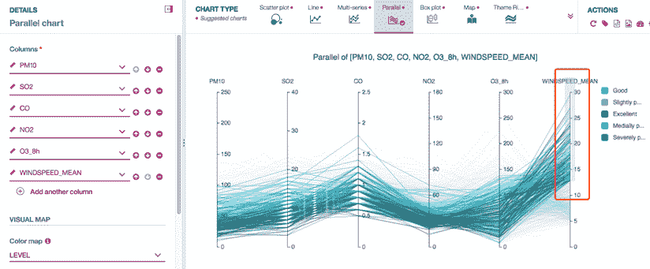 **图 12：平行图 – 离散数据过滤器**

单击过滤器，然后按住鼠标左键并下移过滤器。当风速小于 13 时，各色线条都有。 这意味着当风速较低时，空气质量无法确定。

将颜色映射改为 AQI（连续列）并保留上述所有列。平行图将如下所示。

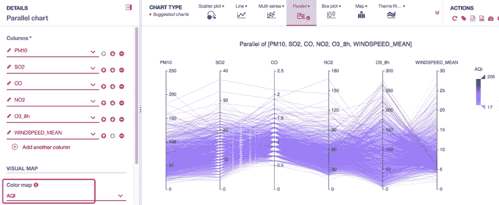 **图 13：平行图 – 连续数据过滤器**

移动鼠标，在 100 到 205 之间的轴上定义过滤器 AQI。会更容易发现，风速较低（0 到 10 之间）时，空气质量较高。

#### 蜡烛图

蜡烛图（K 线图）是一种金融图表，显示证券、金融衍生品或货币的价格走势。可以用一组股票数据来说明蜡烛图。图 32 中显示了每个参数的配置。您可以选择显示开盘价、收盘价、最高价和最低价、交易额以及日均交易量。

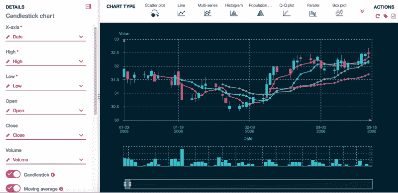 **图 14：蜡烛图**

#### 三维图

此外，数据可视化还对数据图交互进行了详细的优化。三维图通过将每一列绘制为长方体来产生三维效果，从而在三维坐标系中显示数据。三维图可以在坐标系中缩放和移动图形，并显示细节。此外，还对不同纬度的数据进行颜色和透明度处理。

三维可视化更加抢眼，为用户提供不同级别的显示配置项。配置几行数据就可以获得一张图片，如下所示。

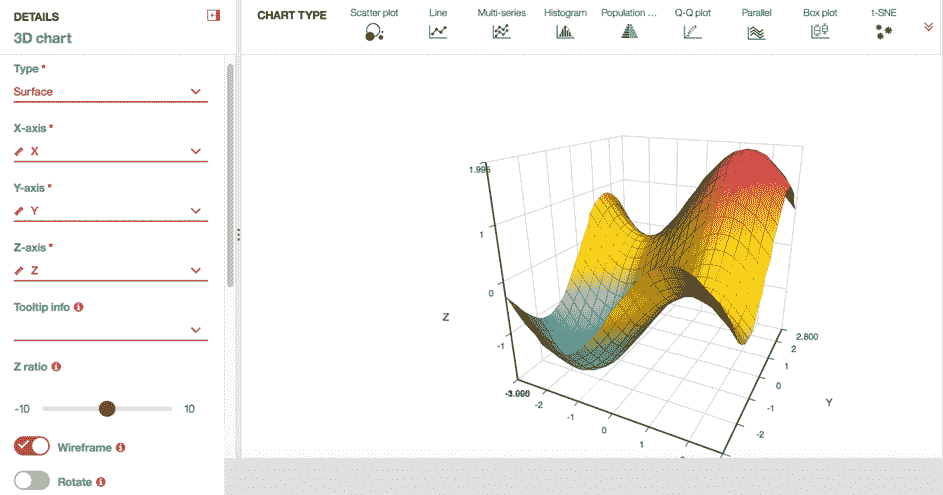 **图 15：三维图 – 曲面图**

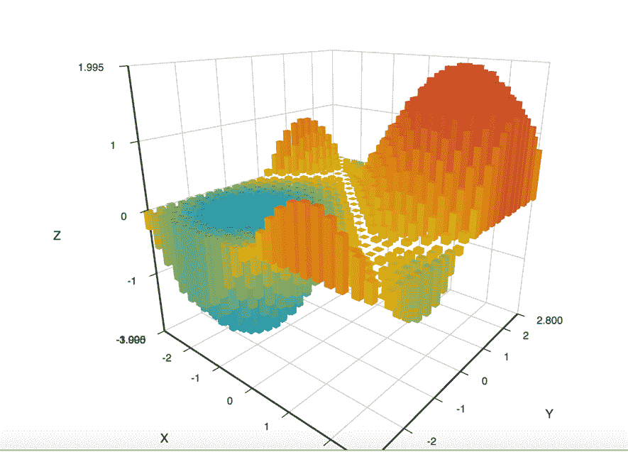 **图 16：三维图 – 条形图**

## 结束语

在本教程中，您深入学习了数据可视化的功能、设置、用途和图表的呈现效果。此外，我们展示了图表库在数据可视化方面的强大功能，其中包含多种图表和相关统计计算。

本文翻译自：[Using plots and charts in data visualization](https://developer.ibm.com/components/cloud-pak-for-data/tutorials/using-plots-and-charts-in-data-visualization)（2019-12-12）。