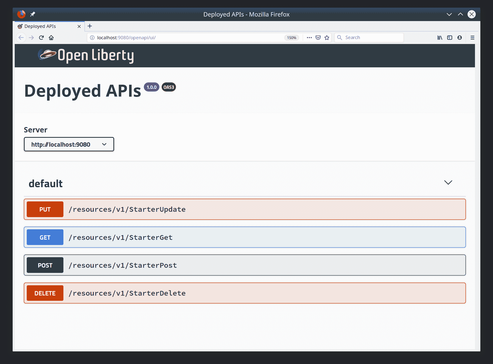
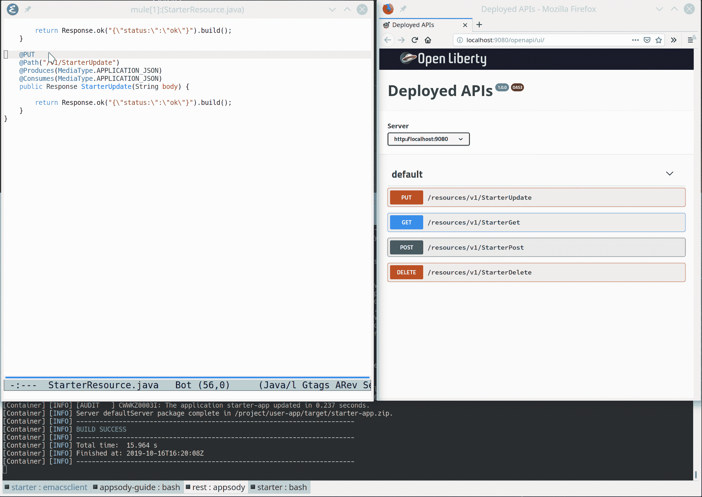

# Archived | 开发自定义 Appsody 模板

> 原文：[`developer.ibm.com/zh/tutorials/develop-custom-appsody-template/`](https://developer.ibm.com/zh/tutorials/develop-custom-appsody-template/)

**本文已归档**

**归档日期：:** 2021-02-25

此内容不再被更新或维护。 内容是按“原样”提供。鉴于技术的快速发展，某些内容，步骤或插图可能已经改变。

[Appsody](https://appsody.dev) 是一个开源项目，可简化云原生应用程序的开发。Appsody 堆栈用于构建一个预先配置的、可供您部署到云环境的 Docker 镜像。这些 Docker 镜像可以包含任意数量的自定义内容，并允许堆栈生成器决定哪些部件是固定的（堆栈镜像），哪些部件可以由应用程序开发者修改或扩展（模板）。

本文为您快速介绍了 Appsody 新模板的创建过程。堆栈架构师通常会在现有堆栈中创建一个模板，以便处理该堆栈的应用程序开发者可以使用该模板快速开发其应用程序。

## 存储库、堆栈和模板

在向您展示如何创建新模板之前，让我们回顾一下 Appsody 的不同部分，包括堆栈、存储库和模板。

Appsody 应用程序包含一个从堆栈创建的 Docker 镜像，并在其中注入模板和应用程序开发者文件。因为 Dockerfile 是堆栈的一部分，所以访问堆栈的应用程序开发者无法修改这些 Dockerfile。但是，在 `appsody init` 过程中，会将模板复制到您的工作目录中。应用程序开发者可以随意对模板中的任何部分进行更改，在 `appsody build` 阶段，这个模板将与堆栈镜像结合使用。 存储库是堆栈及其相应模板的集合。可以从远程源（例如 GitHub）引用存储库，也可以将其存储在本地文件系统中。

> 参阅[创建 Appsody 堆栈](https://www.ibm.com/developerworks/cn/cloud/library/create-appsody-stack/index.html)教程，学习如何创建全新的堆栈。

## Appsody 角色

*   *堆栈架构师*创建堆栈和模板以定义一组技术（及其版本），并选定解决方案以对给定等级应用程序的运行状况进行监控和记录。

*   *应用程序开发者*使用 Appsody 堆栈和模板编写应用程序，而无需了解如何安装或配置所涉及的技术，也无需了解此类技术的任何特定部署需求。

## 第 1 步：克隆 Appsody 存储库

克隆现有的 appsody 存储库：

```
 git clone https://github.com/appsody/stacks.git 
```

这将下载可在本地使用的堆栈和模板的集合。如果在 `incubator/java-microprofile/templates` 中查看 Java MicroProfile 堆栈的内容，就会注意到其中包含一个模板 `default`。（这是 `appsody init` 用于创建应用程序实例的模板。）

```
$ [master] [k|] #  tree incubator/java-microprofile/templates
incubator/java-microprofile/templates                                                                                                                                                               
└── default                                                                                                                                                                                         
    ├── pom.xml                                                                                                                                                                                     
    └── src                                                                                                                                                                                         
        ├── main                                                                                                                                                                                    
        │   ├── java                                                                                                                                                                                
        │   │   └── dev                                                                                                                                                                             
        │   │       └── appsody
        │   │           └── starter
        │   │               ├── health
        │   │               │   ├── StarterLivenessCheck.java
        │   │               │   └── StarterReadinessCheck.java
        │   │               └── StarterApplication.java
        │   ├── liberty
        │   │   └── config
        │   │       └── server.xml
        │   └── webapp
        │       ├── index.html
        │       └── WEB-INF
        │           └── beans.xml
        └── test
            └── java
                └── it
                    └── dev
                        └── appsody
                            └── starter
                                └── HealthEndpointTest.java

18 directories, 8 files 
```

## 第 2 步：添加您的模板代码

以下代码展示了如何添加名为 `rest` 的新模板，该模板包含用于创建、删除和管理资源的最少数量的 REST 端点。在 Appsody 中，应用程序开发者针对其特定用例使用业务逻辑填写模板中的各个部分。您还可以在模板中包含更为复杂的嵌入式逻辑。

该模板的源代码位于此处：[`github.com/ykoyfman/appsody-repo/tree/master/template`](https://github.com/ykoyfman/appsody-repo/tree/master/template)。注意，在此示例中，为了尽可能简短，我并没有包括新模板中的 HealthEndpoint。

```
 @GET
    @Path("/v1/StarterGet")
    @Produces(MediaType.APPLICATION_JSON)
    public Response StarterGet() {

        return Response.ok("{\"status:\":\"ok\"}").build();
    }

    @POST
    @Path("/v1/StarterPost")
    @Produces(MediaType.APPLICATION_JSON)
    @Consumes(MediaType.APPLICATION_JSON)
    public Response StarterPost(String body) {

        return Response.ok("{\"status:\":\"ok\"}").build();         
    } 
```

该示例创建了一个最小的基于 JAX-RS 的 REST API 项目，因此我们只需要在 `src` 树中添加几个文件。在创建新模板后，这是“stacks”目录下的新结构。

我包含了缺省模板中的 `server.xml`，因为这将添加 MicroProfile 3.0 功能，该功能可以 引入 Web 开发所需的许多功能（JAX-RS、OpenAPI、JSON 库等）。

对于这两个模板，以下是目录结构：

```
$ [master|?][k|] #  tree incubator/java-microprofile/templates    
incubator/java-microprofile/templates
├── default
│   ├── pom.xml
│   └── src
│       ├── main
│       │   ├── java
│       │   │   └── dev
│       │   │       └── appsody
│       │   │           └── starter
│       │   │               ├── health
│       │   │               │   ├── StarterLivenessCheck.java
│       │   │               │   └── StarterReadinessCheck.java
│       │   │               └── StarterApplication.java
│       │   ├── liberty
│       │   │   └── config
│       │   │       └── server.xml
│       │   └── webapp
│       │       ├── index.html
│       │       └── WEB-INF
│       │           └── beans.xml
│       └── test
│           └── java
│               └── it
│                   └── dev
│                       └── appsody
│                           └── starter
│                               └── HealthEndpointTest.java
└── rest
    ├── pom.xml
    └── src
        └── main
            ├── java
            │   └── com
            │       └── ibm
            │           └── starter
            │               ├── JAXRSConfiguration.java
            │               └── StarterResource.java
            ├── liberty
            │   └── config
            │       └── server.xml
            ├── resources
            │   └── META-INF
            │       └── persistence.xml
            └── webapp
                └── WEB-INF
                    └── beans.xml

31 directories, 14 files 
```

但是，该模板尚未准备就绪。为此，您必须运行一个 `build` 脚本来重新创建堆栈归档，并将此新堆栈和模板添加到本地存储库中。

## 第 3 步：将新模板添加到本地 Appsody 存储库

创建目录结构和源文件后，使用以下命令利用新模板构建堆栈，并将其添加到本地 Appsody 存储库索引中。注意，应该从 `incubator/java-microprofile` 路径运行：

```
appsody stack package 
```

参阅 [Appsody 产品文档](https://appsody.dev/docs/)，进一步获取详细信息。在构建 过程完成后，将在本地存储库中提供新的堆栈和模板。

## 第 4 步：验证新模板是否可用

现在，您需要验证是否存在新的存储库。上一步已将新堆栈（和新模板）添加到名为 `incubator-index-local` 的本地存储库中。

```
$  [k|] #  appsody list dev.local

REPO                    ID                      VERSION         TEMPLATES         DESCRIPTION                                              
dev.local              java-microprofile       0.2.17          *default, rest    Eclipse MicroProfile on Open Liberty & OpenJ9 using Maven 
```

在接下来的步骤中，我将向您展示如何基于模板创建、运行和修改应用程序。

## 第 5 步：基于新模板创建一个 Appsody 应用程序

您可以将 `appsody init` 命令与适当的参数一起使用（如下所示），以基于此模板创建应用程序。

```
$  [k|] #  appsody init dev.local/java-microprofile rest
Running appsody init...
<..Appsody messages..>
Successfully initialized Appsody project 
```

此时，让我们先运行应用程序以验证其是否正常运行，然后再开始添加代码以针对用例自定义模板。

## 第 6 步：运行应用程序

在应用程序初始化后，您就可以在本地 Docker 容器中运行该应用程序。在此过程中，Appsody 会基于父堆栈 Dockerfile 创建一个 Docker 容器，并将其与模板中的源代码结合使用。在此情况下，java-microprofile 堆栈引入了 Open Liberty 19.x。

```
$  [k|] #  appsody run
Running development environment...
Pulling docker image appsody/java-microprofile:0.2
Running command: docker pull appsody/java-microprofile:0.2
0.2: Pulling from appsody/java-microprofile
5667fdb72017: Pulling fs layer
... many layers ...
Running docker command: docker run --rm -p 7777:7777 -p 9080:9080 -p 9443:9443 --name rest-dev -v /home/yan/.m2/repository:/mvn/repository -v /home/yan/src/adv/appsody/template/rest/src:/project/user-app/src -v /home/yan/src/adv/appsody/template/rest/pom.xml:/project/user-app/pom.xml -v /home/yan/.appsody/appsody-controller:/appsody/appsody-controller -t --entrypoint /appsody/appsody-controller appsody/java-microprofile:0.2 --mode=run
[Container] Running APPSODY_PREP command: ../validate.sh && mvn -B -Dmaven.repo.local=/mvn/repository install -DskipTests
[Container] Installing parent dev.appsody:java-microprofile:0.2.17

<Maven build snipped>

[Container] [INFO] [AUDIT   ] CWWKT0016I: Web application available (default_host): http://a28ea1bb33d3:9080/openapi/ui/
[Container] [INFO] [AUDIT   ] CWWKT0016I: Web application available (default_host): http://a28ea1bb33d3:9080/metrics/
[Container] [INFO] [AUDIT   ] CWWKT0016I: Web application available (default_host): http://a28ea1bb33d3:9080/health/
[Container] [INFO] [AUDIT   ] CWWKT0016I: Web application available (default_host): http://a28ea1bb33d3:9080/ibm/api/
[Container] [INFO] [AUDIT   ] CWWKT0016I: Web application available (default_host): http://a28ea1bb33d3:9080/jwt/
[Container] [INFO] [AUDIT   ] CWWKT0016I: Web application available (default_host): http://a28ea1bb33d3:9080/openapi/
[Container] [INFO] [AUDIT   ] CWWKT0016I: Web application available (default_host): http://a28ea1bb33d3:9080/
[Container] [INFO] [AUDIT   ] CWWKZ0001I: Application starter-app started in 2.777 seconds.
[Container] [INFO] [AUDIT   ] CWWKF0012I: The server installed the following features: [appSecurity-2.0, cdi-2.0, concurrent-1.0, distributedMap-1.0, jaxrs-2.1, jaxrsClient-2.1, jndi-1.0, json-1.0, jsonb-1.0, jsonp-1.1, jwt-1.0, microProfile-3.0, mpConfig-1.3, mpFaultTolerance-2.0, mpHealth-2.0, mpJwt-1.1, mpMetrics-2.0, mpOpenAPI-1.1, mpOpenTracing-1.3, mpRestClient-1.3, opentracing-1.3, servlet-4.0, ssl-1.0].
[Container] [INFO] [AUDIT   ] CWWKF0011I: The defaultServer server is ready to run a smarter planet.The defaultServer server started in 12.150 seconds. 
```

注意，应用程序开发者的代码已在容器内可用：`-v /home/yan/src/adv/appsody/template/rest/src:/project/user-app/src`，因此可以在 Maven 构建过程的后续部分对其进行访问。

该构建会下载堆栈基础镜像 (Open Liberty + Open J9 JVM)，并将基础堆栈容器与模板和自定义代码结合使用。最终，构建将完成，Open Liberty 应用程序服务器将启动，运行 REST Starter 应用。

当 `appsody run` 完成时，检查 `docker ps` 以确保已创建容器。由于 Docker 容器转发了连接到应用程序时所需的端口，因此我们可以立即开始对其进行测试。

```
$ [master|?][k|] #  docker ps
CONTAINER ID        IMAGE                           COMMAND                  CREATED             STATUS              PORTS                                                                    NAMES
5cab68e81425        appsody/java-microprofile:0.2   "/appsody/appsody-co…"   7 minutes ago       Up 7 minutes        0.0.0.0:7777->7777/tcp, 0.0.0.0:9080->9080/tcp, 0.0.0.0:9443->9443/tcp   r2-dev 
```

如果将 Web 浏览器指向 OpenAPI URL [`http://localhost:9080/openapi/ui`](http://localhost:9080/openapi/ui)，您将会看到模板中的 REST 端点可用于测试：



## 第 7 步：修改 Appsody 应用程序

将此类代码放入 Appsody 堆栈模板的好处是，您可以获得 Appsody CLI 和工具的所有功能。我最喜欢的好处之一是 Appsody 守护程序 (`appsody-controller`)，它可以监视源代码目录中的文件更改情况。因此，当您进行更改并保存文件时，Appsody 会重新构建它并重新启动 Docker 容器内的应用程序。

下面的动画显示了对应用程序的简单更改（保存文件时）如何导致应用程序在几秒钟内重新构建并重新启动。

最初，StarterApp 中有四个 REST 端点。在动画中，我通过以下方式添加了第五个 REST 端点 “MyNewAPI”：

1.  复制来自其他端点的信息，并将其粘贴到 CLI 中。
2.  将 “/v1/StarterUpdate” 替换为新 API 的名称：“MyNewAPI”。
3.  保存更改。

在完成代码更改并保存文件后，您就可以看到 Maven 构建已在 Docker 容器内重新运行，并且 Open Liberty 服务器会快速重新加载该应用。在刷新浏览器后，新的（第五个）端点现已可用。



## 结束语

使用 Appsody 可以通过使用预先构建的堆栈和模板，帮助您开始创建云原生应用程序。在本文中，我们向您展示了如何扩展 Appsody 以在现有的技术堆栈中提供新功能。

本文翻译自：[Develop a custom Appsody template](https://developer.ibm.com/tutorials/develop-custom-appsody-template/)（2019-11-06）