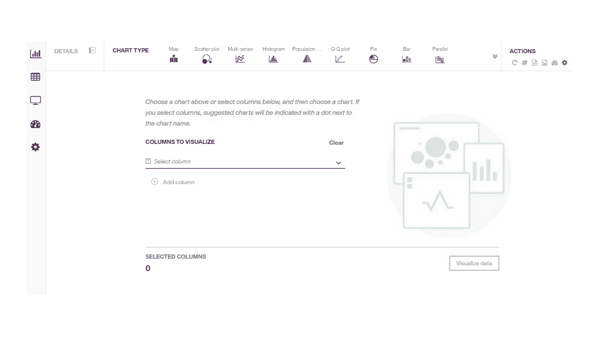
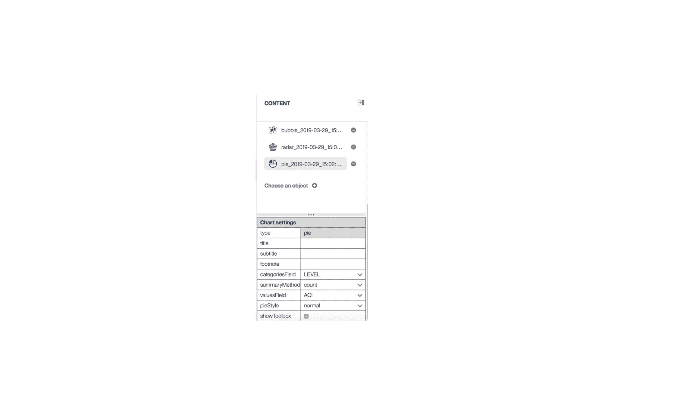
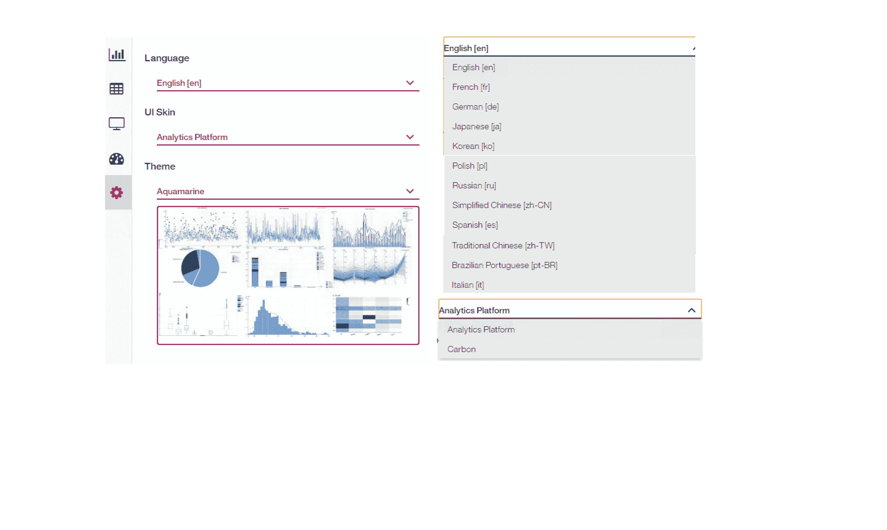

# 使用数据可视化来识别模式、关系和连接

> 原文：[`developer.ibm.com/zh/tutorials/data-visualization-a-powerful-tool-for-visualizing-insight-data-overview/`](https://developer.ibm.com/zh/tutorials/data-visualization-a-powerful-tool-for-visualizing-insight-data-overview/)

数据可视化可以帮助您将数据和指标转换为交互式图表、图形和其他可视化报告。数据可视化还提供了丰富的功能，让您能够通过 SQL 编辑器查看结构化数据并查询数据。此外，通过个性化设置，数据虚拟化可以帮助您从多个角度查看和分析信息和数据，从而做出数据决策并加以应用。数据可视化服务已经扩展到多款 IBM Watson Studio 工具中，包括 IBM SPSS Modeler 和 IBM Data Refinery（均适用于 IBM Cloud 和 IBM Cloud Pak for Data）。

 **图 1：数据可视化的基本结构**

输入信息可以来自设置面板上的 UI 控件，可以由字段推荐，也可以来自图表规范 JSON 脚本。所有输入将通过图表规范提供程序构建有效的图表规范。Data Loader 从数据可视化后端服务获取数据。图表规范和加载的数据将成为 Viz Engine 的输入（需要阐明）。数据可视化构建将根据在浏览器上显示的图表实例来响应事件。

数据可视化后端服务提供了加载数据、计算统计指标以及为大数据生成图像的功能。

## 预估时间

完成本教程大约需要 60 分钟。

## 步骤

### 第 1 步：导航菜单

 **图 2：重新开始页面**

将鼠标悬停在工具的左侧图标上，您将看到导航菜单，如下所示。

 **图 3：导航菜单**

#### Charts

通过图表选项卡，您可以创建高级数据可视化，进而从不同的角度探索数据，并识别数据中的模式、连接和关系。数据可视化提供了 28 种类型的图表，您可以根据需要在不同的图表之间切换。首先，单击 **列可视化** 的向下箭头以选择要使用的列。所有建议的图表都将用红点标明。您可以单击这些图表直接查看对应的图表。

 **图 4：建议的图表**

首先，从选定的图表中单击任何图表。单击 **数据可视化** 按钮，从建议图表列表中的第一个图表开始。根据所选列，可用图表类型按照从相关性最高到相关性最低的顺序排序。如果数据集中没有任何列带有受支持可用于图表类型的数据类型，那么该图表将不可用。如果图表不支持某列的数据类型，则无法为该图表选择该列。

 **图 5：散点图**

单击多系列图表，此时将显示多系列图表。下图说明了您所选择的列（在重新开始页面中）将在每个建议的图表中共享。可以将所有共享的列应用于建议的图表。

 **图 6：多系列图表**

#### 电子表格

电子表格选项卡以表的格式来显示所选数据的只读视图。打开电子表格面板，然后单击电子表格底部的 SQL 编辑器栏以打开 SQL 编辑器。注意：使用关键字 ThisTable 可引用电子表格中的数据集。要编辑数据，可通过 SQL 语句 **SELECT * FROM ThisTable where AQI>200** 来选择 AQI 大于 200 的记录。要运行 SQL，单击 SQL 编辑器右上角的按钮。

 **图 7：SQL 编辑器 1**

将显示大于 200 的列。通过 SQL 语句 **SELECT * ,PM10 – AQI FROM ThisTable** 生成一个值为 PM10 – AQI 的新字段

 **图 8：SQL 编辑器 2**

在最后一个列中，将生成一个名为 PM10 – AQI 的新字段。它的值等于 PM10 的值减去 AQI 的值。当然，用户可以根据自己对 SQL 语句的熟悉程度来自定义他们的数据。

#### 数据审计

数据审计选项卡显示每一列数据的频率和统计信息。打开数据审计面板。有 4 个选项卡：审计、质量、统计和相关系数值。

##### 审计

Audit 选项卡显示每个字段的分布图和基本统计值。

##### 质量

质量选项卡显示每个字段的质量，包括异常值、极值和空值。

##### 统计

统计选项卡对所有字段的统计信息进行分类。

##### 相关系数值

相关系数值选项卡显示每两个字段之间的关系。PM2.5 与 PM10 之间的关联值是 0.963，这表明，当 PM2.5 值较大时，PM10 值也较大。WINDSPEED_MEAN 与 AQI 之间的关联值是 -0.464。因此，它们之间存在负相关。

 **图 9：数据审计 – 相关系数值**

#### 仪表板

仪表板选项卡支持若干预定义的仪表板。 您还可以通过 ACTION 工具栏项目来添加/编辑模板或创建新布局模板。

 **图 10：仪表板**

 **图 11：仪表板中的图表**

#### Action 工具栏项目

##### 编辑布局/离开布局编辑模式

允许您进入或退出布局编辑模式。进入编辑模式后，您可以创建一个小的布局项目，并且可以通过拖动来调整所有项目的大小。

##### 添加新项

允许您添加 1*1 大小的新布局项目。通过拖动右边的角可以调整布局项目的大小。

##### 保存

允许您将编辑布局保存为模板，并覆盖当前选定的模板。注意：无法覆盖预定义的模板。

##### 另存为新模板

您还可以将编辑布局保存为新模板。

##### 删除

允许您删除当前选定的模板。注意：无法删除预定义的模板。

##### 编辑布局单元设置

允许您定义每个单元的宽度和高度像素值。

##### 将模板导出为 JSON 文件

允许您将仪表板中的当前布局和图表保存为 JSON 文件。

##### 仪表板文件导入

允许您通过仪表板 JSON 文件来上载仪表板。

##### 选择保存的图表

这将显示从 Chart 模块中保存的图表列表。可以将每个图表拖动到仪表板布局项目中。

##### 选择对象

这将显示所有可以拖到仪表板布局项中的仪表板对象。包含两种类型的对象：HTML 文本和图像。单击项目的 edit 按钮以编辑对象内容。

##### 图表设置

选择已保存的图表后，将显示图表设置界面以允许您编辑设置。编辑后的图表将根据编辑结果而更改。

 **图 12：仪表板中的图表设置**

#### 首选项

首选项卡允许您设置界面首选项，如语言和外观。数据可视化支持 12 种语言（请参见下图）。如果您需要切换到另一种语言，请选择其中一种语言，然后系统将以您选择的语言来显示界面。 数据可视化提供了 2 套 UI 皮肤和 7 个定义的主题。

 **图 13：首选项**

### 第 2 步：操作

在数据可视化 UI 的右上角，有一些工具图标。

 **图 14：操作工具**

#### 重新开始

允许您从当前图表切换到重新开始页面。

#### 在图表中显示数据标签/值

允许您显示当前图表中的标签或值。

#### 下载图表细节

可以将当前图表作为 JSON 文件下载以保存在计算机上。

#### 图表图像下载

可以将当前图表作为图像下载以保存在计算机上。

#### 保存为仪表板图表

可以将当前图表保存为仪表板图表。

全局可视化首选项允许您设置图表标题，打开/关闭范围滑块、工具箱或其他小工具或更改为不同主题。 除了默认主题之外，数据可视化还提供了 7 种不同的背景主题供选择。

### 第 3 步：后端聚合

为了支持大数据，数据可视化提供了“后端聚合”功能。这些图表可以使用聚合数据来表示，而不是检索所有数据。 例如：要显示天气数据的饼图，只需检索下面的聚合数据。

 **图 15：后端聚合**

 **图 16：后端聚合饼图**

支持后端聚合的图表包括饼图、条形图、箱线图、直方图、气泡图、圆圈填充图、误差条形图、热图、人口金字塔图、雷达图、旭日图、主题河流图和词汇云。

### 第 4 步：自定义规范

所有图表都支持**下载图表细节**功能以保存当前图表规范。可以将图表规范粘贴到自定义图表的 JSON 脚本属性中，并单击**生成图表**按钮以创建图表。

 **图 17：自定义规范**

可以将规范属性更改为它们的期望值。如果指定的属性或值无效，则会显示带有错误消息的空白页。例如，如果在箱线图规范的“seriesFields”属性中设置了无效列名，则无效列错误消息将显示为下图。

 **图 18：包含错误消息的自定义规范**

## 结束语

本教程介绍了数据可视化，并向您展示了每个组件的一些基本操作，还解释了一些常见的图表概念和机制。要了解有关在数据可视化中使用图表的更多信息，请参阅教程[在数据可视化中使用图形和图表](https://developer.ibm.com/technologies/analytics/tutorials/using-plots-and-charts-in-data-visualization)。

本教程翻译自：[Identify patterns, relationships, and connections using data visualization](https://developer.ibm.com/components/cloud-pak-for-data/tutorials/data-visualization-a-powerful-tool-for-visualizing-insight-data-overview)（2019-12-12）。