# 使用 Python 和 scikit-learn 学习分类算法

> 原文：[`developer.ibm.com/zh/tutorials/learn-classification-algorithms-using-python-and-scikit-learn/`](https://developer.ibm.com/zh/tutorials/learn-classification-algorithms-using-python-and-scikit-learn/)

本教程已纳入[面向开发者的机器学习](https://developer.ibm.com/cn/blog/2019/learning-path-machine-learning-for-developers/)这一学习路径。

| 级别 | 主题 | 类型 |
| --- | --- | --- |
| 100 | [机器学习简介](https://www.ibm.com/developerworks/cn/analytics/library/introduction-to-machine-learning/index.html) | 文章 |
| 101 | [使用 Python 和 scikit-learn 构建并测试您的第一个机器学习模型](https://www.ibm.com/developerworks/cn/analytics/library/build-and-test-your-first-machine-learning-model-using-python-and-scikit-learn/index.html) | 教程+Notebook |
| 201 | [使用 Python 和 scikit-learn 学习回归算法](https://www.ibm.com/developerworks/cn/analytics/library/learn-regression-algorithms-using-python-and-scikit-learn/index.html) | 教程+Notebook |
| 202 | [使用 Python 和 scikit-learn 学习分类算法](https://www.ibm.com/developerworks/cn/analytics/library/learn-classification-algorithms-using-python-and-scikit-learn/index.html) | 教程+Notebook |
| 203 | [使用 Python 和 scikit-learn 学习聚类算法](https://www.ibm.com/developerworks/cn/analytics/library/learn-clustering-algorithms-using-python-and-scikit-learn/index.html) | 教程+Notebook |

## 简介

在本教程中，我们将介绍有关解决基于分类的机器学习问题的基础知识，并提供对当前最受欢迎的一些算法的比较研究。

## 设置

1.  注册或登录。

    *   通过从[试用 IBM Watson](https://dataplatform.cloud.ibm.com/registration/stepone?cm_sp=ibmdev-_-developer-tutorials-_-cloudreg) 页面登录到 IBM Cloud 帐户来激活 Watson Studio。
    *   通过从 [`dataplatform.cloud.ibm.com`](https://dataplatform.cloud.ibm.com?cm_sp=ibmdev-_-developer-tutorials-_-cloudreg) 页面登录来访问 Watson Studio。
2.  创建一个空项目。

    *   单击 **Create a project** 或 **New project**。
    *   选择 **Create an empty project**。
    *   指定项目名称。
    *   选择一个现有的 Object Storage 服务实例，或者创建一个新的 Object Storage 服务实例。
    *   单击 **Create**。
3.  添加 Notebook。

    *   单击 **+Add to project**。
    *   单击 **Notebook**。
    *   单击 **From URL**。
    *   提供一个 **Name**。
    *   在 **Select runtime** 下，选择 **Default Python 3.6 Free**。
    *   输入 `https://raw.githubusercontent.com/IBM/ml-learning-path-assets/master/notebooks/classification_with_scikit-learn.ipynb`。
    *   单击 **Create Notebook**。
4.  运行该 Notebook。

    在打开的 Notebook 中，单击 **Run** 以一次运行一个单元。本教程的剩余部分是按照 Notebook 的顺序展开的。

## 概述

当要预测的特征包含不同类别的值时，就要进行分类。其中每一个类别都代表预测值所属的一个范围，因此，类别被称为“分类”。

在本教程中，我们将使用一个数据集，该数据集包含某个在线交易平台的客户信息，其中对给定客户的流失概率进行分类，分为高、中等和低三种概率。 因为上一个[教程](https://www.ibm.com/developerworks/cn/analytics/library/build-and-test-your-first-machine-learning-model-using-python-and-scikit-learn/index.html)介绍了在创建模型之前需要执行的各种预处理步骤，因此在本教程中，我们将跳过这些细节。我们将对不同分类算法进行详细研究，并将这些算法应用于相同的数据集以进行比较。

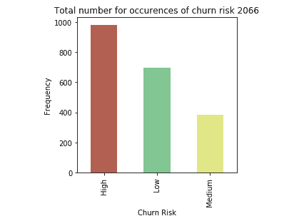

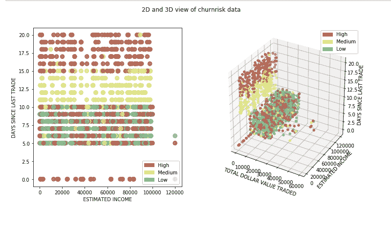

## 分类算法和比较

如前所述，当要预测的特征包含不同类别的值时，就要进行分类。其中每一个类别都代表预测值所属的一个范围。分类算法包括：

*   朴素贝叶斯
*   逻辑回归
*   K 近邻算法
*   (Kernel) SVM
*   决策树
*   集成学习

### 朴素贝叶斯

朴素贝叶斯算法应用贝叶斯定理来计算数据点属于特定类别的概率。根据某些相关值的概率，在事件 *A* 发生的情况下，事件 *B* 的概率计算公式如下所示。

P(B|A) = (P(A|B) * P(B) / P(A))

这种理论被认为是朴素的，因为它假设任何输入特征之间都不存在依赖关系。即使采用这种不正确或朴素的假设，事实也已证明，朴素贝叶斯算法在某些用例（如垃圾邮件过滤器）中效果非常好。

以下代码片段显示了有关如何使用 scikit-learn 中的库来创建和预测朴素贝叶斯模型的示例。

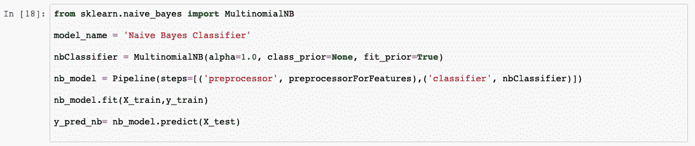

在分析预测的输出列表时，我们会看到该模型的准确率为 69%。同时还显示了实际值和预测值的比较图。

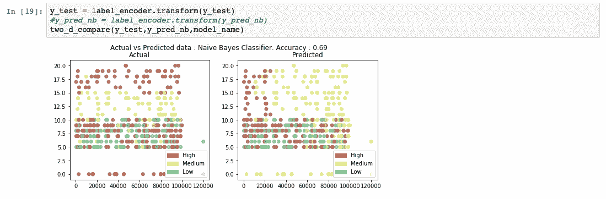

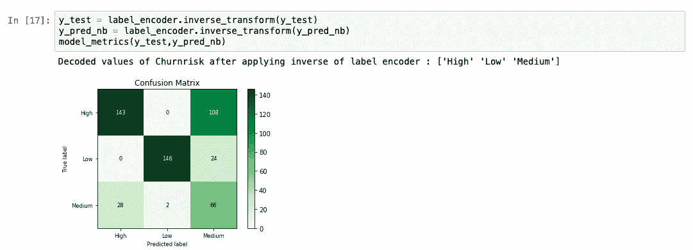

### 逻辑回归

逻辑回归是线性回归算法的扩展。在[使用 Python 和 scikit-learn 学习回归算法](https://www.ibm.com/developerworks/cn/analytics/library/learn-regression-algorithms-using-python-and-scikit-learn/index.html)中详细介绍了线性回归算法。在逻辑回归算法中，我们将预测结果的概率，而不是预测实际的连续值。为此，可将一个*逻辑函数*应用于线性回归的结果。逻辑函数也称为 *sigmoid 函数*。该函数将输出 0 到 1 之间的值。然后，我们根据具体用例来选择一条线。概率值在该线以上的所有数据点都归类到由 1 表示的类别。概率值在该线以下的所有数据点都归类到由 0 表示的类别。

以下代码片段显示了有关如何使用 scikit-learn 中的库来创建和预测逻辑回归模型的示例。

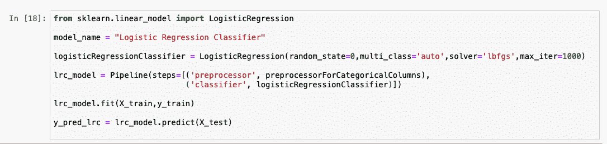

在分析预测的输出列表时，我们会看到该模型的准确率为 92%。同时还显示了实际值和预测值的比较图。

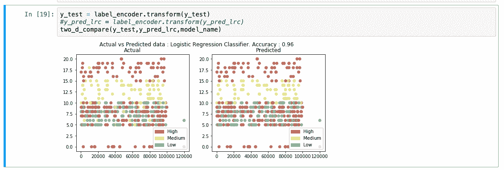

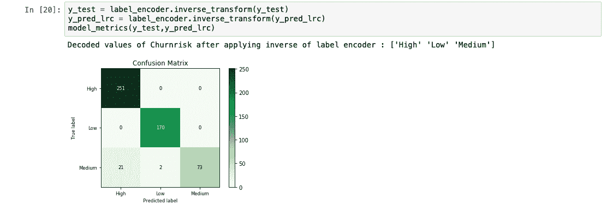

### K 近邻算法

K 近邻算法 (KNN) 背后的总体思路是，根据距离的远近，数据点被认为属于与其共享最多公共点的类别。需要考虑待预测的数据点周围 K 个距离最近的点。这时的这 K 个点已经属于一个类别。所考虑的数据点被认为属于这 K 个点中数量最多的点所属的类别。可使用多种方法来计算点到点之间距离。最受欢迎的计算公式是“欧式距离”(Euclidean Distance)。

以下代码片段显示了有关如何使用 scikit-learn 中的库来创建和预测 KNN 模型的示例。

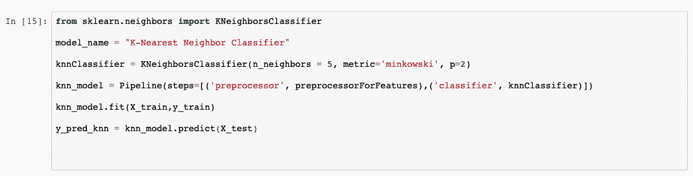

在分析预测的输出列表时，我们会看到该模型的准确率为 89%。同时还显示了实际值和预测值的比较图。

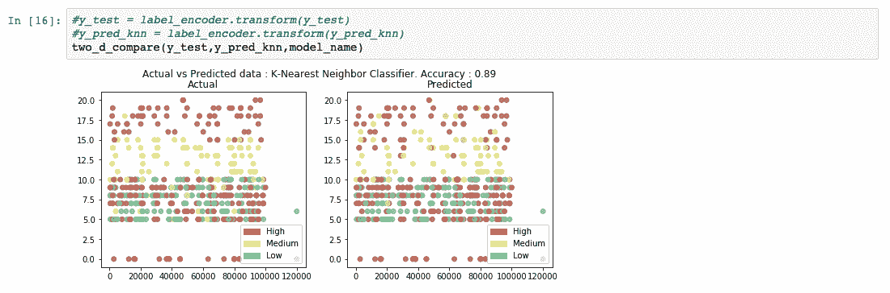

### 支持向量机

支持向量机 (SVM) 算法根据输入的训练数据，输出不同类别之间的最佳分离线。这种分离线在多维环境中被称为“超平面”(hyperplane)。SVM 考虑距离另一个类别非常近的异常点，从而得出这个具有分离作用的超平面。在使用该超平面构造模型后，要预测的任何新点都会检查该值位于超平面的哪一侧。

即使在二维空间中，如果点的分布没有明显区别，那么构造类别之间的这种分离线有时也会非常棘手。同样，当用于描述某个数据点的特征有多个时，那么构造分离线也是一个复杂的过程。对于数据无法线性分离的这些多维空间，我们将其映射到更高维的空间，以便创建这种分离。可通过应用*核函数*来映射到更高维的空间。核函数有多种类型，最常见的就是多项式核函数和高斯径向基函数 (RBF)。获得这个分离平面后，将数据映射回其原始维度。关于该点的预测，只是为了判断该点位于这个平面内部还是外部。

以下代码片段显示了有关如何使用 scikit-learn 中的库来创建和预测 SVM 模型的示例。将 kernel 值设置为“rbf”以生成超平面。

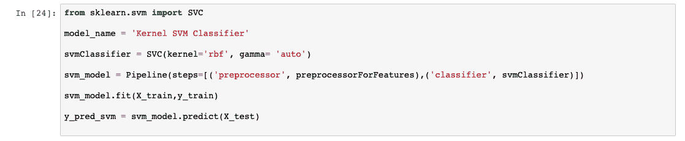

在分析预测的输出列表时，我们会看到该模型的准确率为 95%。同时还显示了实际值和预测值的比较图。 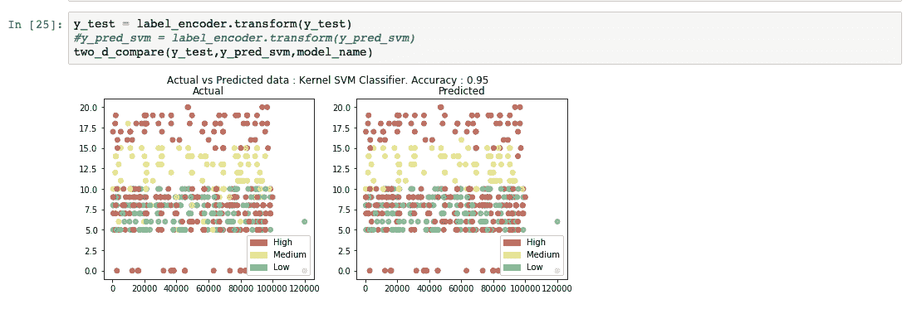

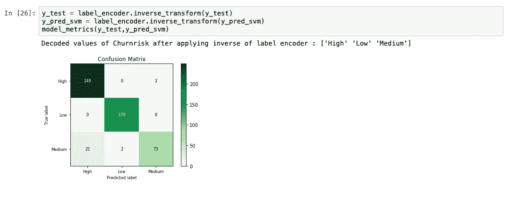

### 决策树

基于决策树的模型使用训练数据来生成用于预测输出的规则。例如，假设问题陈述是“确定今天是否可以打网球”。根据训练数据中的值，模型会形成一个决策树。生成的模型可以使用以下规则构造决策树。

1.  首先，查看“天气预报”列。如果是阴天，则绝对不去。
2.  但如果天气湿热，则不去。
3.  如果是正常的晴天，则去。
4.  如果刮风下雨，则不去。
5.  如果下雨但不刮风，则去。

### 集成学习

集成学习是一种机器学习算法，它将多个算法组合起来以生成更好的模型。如果重复两个或更多个相同算法来实现此目的，则称为*同源集成*算法。如果将不同算法组合起来，则称为*异源集成*算法。在本部分中，我们将探究如何将基于决策树的模型整合到随机森林和梯度提升树中以便获得更高的准确率。

#### 随机森林

决策树算法可以有效地消除在预测输出时不会增加价值的列。在某些情况下，我们甚至可以了解如何通过回溯决策树来得出预测。但是，如果决策树相当庞大且难以解释，那么不会单独执行该算法。此类模型通常称为弱模型。可通过使用从训练数据子集生成的多个此类决策树的平均值来提高模型性能。这种方法被称为*随机森林*分类。

以下代码片段显示了有关如何使用 scikit-learn 中的库来创建和预测随机森林模型的示例。

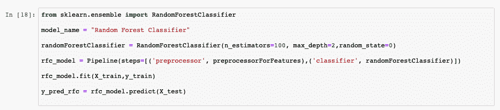

在分析预测的输出列表时，我们会看到该模型的准确率为 91%。同时还显示了实际值和预测值的比较图。

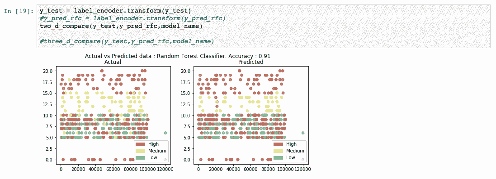

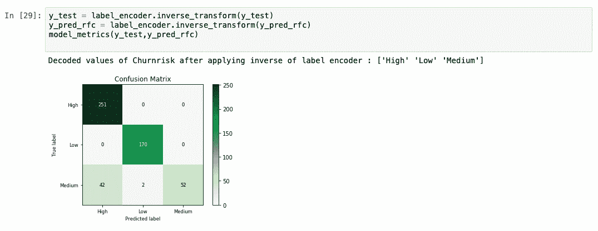

#### 梯度提升树

梯度提升树也是一种集成学习算法。它们基于“提升”方法，此方法根据先前模型的输出来逐个训练模型。

在梯度提升树中，我们会计算先前模型中的误差（也称为*残差*）。现在，我们定义另一个模型，并基于这个残差来训练该模型。生成的模型是先前模型与基于残差进行训练的模型的总和。重复此过程，直到收敛为止。即使梯度提升树执行随机森林模型的效果出色，但由于它们是按顺序构建的，因此计算成本非常昂贵。可使用称为 XGBoost 的特定实现来解决这个问题。本教程并未提供 XGBoost 的详细信息。但是，您可以在[在 Watson Machine Learning Accelerator 中训练 XGboost 模型](https://developer.ibm.com/zh/tutorials/train-xgboost-models-within-watson-ml-accelerator/)教程中找到更多信息。

## 摘要

在本教程中，我们使用相同的数据集，通过多种分类算法进行了预测。本教程中讨论了以下算法：

*   朴素贝叶斯
*   逻辑回归
*   K 近邻算法
*   SVM (Kernel)
*   决策树
*   集成学习

我们可以看到，算法不同，准确率得分也不同。 这并不意味着一种算法始终优于另一种算法。即使某些分类算法的性能始终优于其他分类算法，模型性能通常还会受到用例的影响。在这些算法中，每种算法都能够以不同的方式调整若干超参数，从而获得更高的准确率。在下面的条形图中，我们将不同的分类算法与实际值进行了比较。

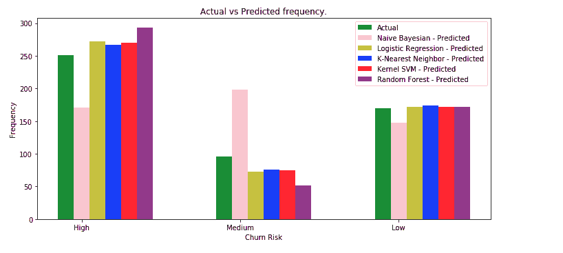

通常，我们发现“中”值的预测准确率较低。造成这种情况的一个原因可能是，“中”值的条目数比“高”值和“低”值的少得多。可通过增加“中”值的条目数或采用多种数据制作技术，进行进一步的测试。

本教程是[面向开发者的机器学习](https://developer.ibm.com/cn/blog/2019/learning-path-machine-learning-for-developers/)学习路径的一部分。在[使用 Python 和 scikit-learn 学习聚类算法](https://www.ibm.com/developerworks/cn/analytics/library/learn-clustering-algorithms-using-python-and-scikit-learn/index.html)学习路径的下一个教程中，您将使用无监督学习来发现数据中的分组和异常点。

本教程翻译自：[Learn classification algorithms using Python and scikit-learn](https://developer.ibm.com/tutorials/learn-classification-algorithms-using-python-and-scikit-learn/)（2019-12-04）