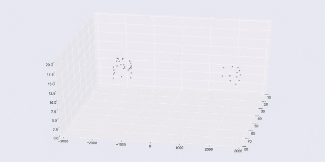
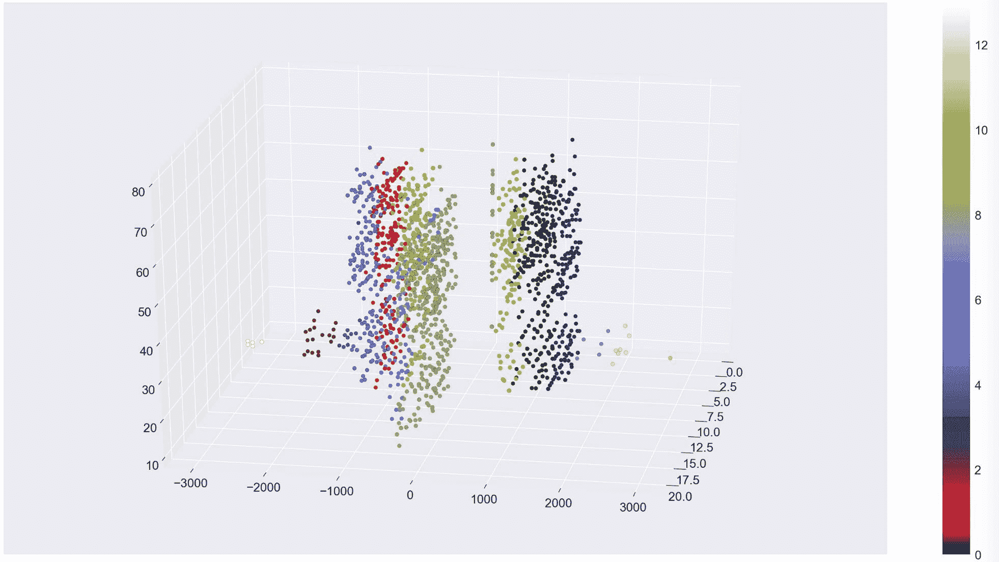

# 使用 Python 和 scikit-learn 学习聚类算法

> 原文：[`developer.ibm.com/zh/tutorials/learn-clustering-algorithms-using-python-and-scikit-learn/`](https://developer.ibm.com/zh/tutorials/learn-clustering-algorithms-using-python-and-scikit-learn/)

本教程已纳入[面向开发者的机器学习](https://developer.ibm.com/zh/series/learning-path-machine-learning-for-developers/)这一学习路径。

| 级别 | 主题 | 类型 |
| --- | --- | --- |
| 100 | [机器学习简介](https://developer.ibm.com/zh/articles/introduction-to-machine-learning/) | 文章 |
| 101 | [使用 Python 和 scikit-learn 构建并测试您的第一个机器学习模型](https://developer.ibm.com/zh/tutorials/build-and-test-your-first-machine-learning-model-using-python-and-scikit-learn/) | 教程+Notebook |
| 201 | [使用 Python 和 scikit-learn 学习回归算法](https://developer.ibm.com/zh/tutorials/learn-regression-algorithms-using-python-and-scikit-learn/) | 教程+Notebook |
| 202 | [使用 Python 和 scikit-learn 学习分类算法](https://developer.ibm.com/zh/tutorials/learn-classification-algorithms-using-python-and-scikit-learn/) | 教程+Notebook |
| 203 | [使用 Python 和 scikit-learn 学习聚类算法](https://developer.ibm.com/zh/tutorials/learn-clustering-algorithms-using-python-and-scikit-learn/) | 教程+Notebook |

## 简介

在本教程中，您将使用无监督学习来发现数据中的分组和异常点。在无监督学习中，没有用于显示期望结果的*真值*(ground truth) 或带标签的数据集。而是获取原始数据并使用各种算法来发现数据集群。如果您想了解无监督学习背后的理论和概念，请阅读[用于数据分类的无监督学习](https://developer.ibm.com/articles/cc-unsupervised-learning-data-classification/)。

在集群变得明显（例如在 3D 图表中）后，您可能想将标签应用于集群。这就是使用无监督学习来发现数据中的隐藏特征的一个示例。如果您不关心集群，而只想了解有关异常点的更多信息，那么可以考虑使用*异常检测*。

值得注意的是，当您尝试可视化数据时，您会倾向于使用二维或三维数据，因为这类数据绘制起来最为容易。但这里使用的方法适用于多维或超多维数据。这类数据更难可视化，但您仍可以测量集群中数据的数学分布，并通过几乎相同的方式使用所发现的分组和异常点。

## 让我们开始吧

我设计的这个教程内容丰富，既适用于临时读者，也适用于实际开发者。如果您自己运行代码，则可以从中获益更多，但如果您没有时间（或者您不擅长编码），我也提供了足够的示例，让您无论如何都能读懂本教程。本教程包含一个用 Python 编写的 Jupyter Notebook。您可以使用 Watson Studio，通过一个免费试用帐户在 IBM Cloud 上运行该 Notebook。

1.  注册或登录。

    *   通过从[试用 IBM Watson](https://dataplatform.cloud.ibm.com/registration/stepone?cm_sp=ibmdev-_-developer-tutorials-_-cloudreg) 页面登录到 IBM Cloud 帐户来激活 Watson Studio。
    *   通过从 [`dataplatform.cloud.ibm.com`](https://dataplatform.cloud.ibm.com?cm_sp=ibmdev-_-developer-tutorials-_-cloudreg) 页面登录来访问 Watson Studio。
2.  创建一个空项目。

    *   单击 **Create a project** 或 **New project**。
    *   选择 **Create an empty project**。
    *   指定项目名称。
    *   选择一个现有的 Object Storage 服务实例，或者创建一个新的 Object Storage 服务实例。
    *   单击 **Create**。
3.  添加 Notebook。

    *   单击 **+Add to project**。
    *   单击 **Notebook**。
    *   单击 **From URL**。
    *   提供一个 **Name**。
    *   在 **Select runtime** 下，选择 **Default Python 3.6 Free**。
    *   输入 `https://raw.githubusercontent.com/IBM/ml-learning-path-assets/master/notebooks/clustering_with_scikit-learn.ipynb` 作为 **Notebook URL**。
    *   单击 **Create Notebook**。
4.  运行该 Notebook。

    在打开的 Notebook 中，单击 **Run** 以一次运行一个单元。本教程的剩余部分是按照 Notebook 的顺序展开的。

### 可视化工具

为了演示预测的集群，我们始终使用颜色来绘制数据集的两三个特征，以便显示集群。对于大多数图表，我们使用 matplotlib 库和 seaborn 数据可视化库来获得样式。在某些情况下，我们还添加了 Plotly 交互式图表。如果想要旋转图表以便从不同角度查看 3-D 集群，这时 Plotly 图表就特别有用。

### scikit-learn

通过各种聚类算法的 scikit-learn 实现，您可以了解到这些算法的一些差异和优缺点。

### 数据集

scikit-learn 提供的数据集有助于说明聚类算法的差异。我们将在需要的地方使用这些数据集，但还会使用客户数据集，以帮助可视化带有实际数据（而非明显形状）的聚类。

使用我们的示例来运行该 Notebook 之后，您应尝试使用自己的数据，以检验您在本教程中所学到的知识，并查看您从自己的数据中了解到的内容。

## 聚类算法的类别

聚类算法可分为以下三个不同类别：

*   基于质心的聚类
*   基于密度的聚类
*   分层聚类

本 Notebook 中使用了如下算法：

| 类别 | 算法 | 描述 |
| --- | --- | --- |
| 基于质心 | k 均值 | 找到预定数量 (k) 个中心点，以根据距中心的距离创建 k 个集群。 |
| 基于质心 | 均值漂移 | 寻找更高密度的区域以确定集群中心。 |
| 基于密度 | DBSCAN | 分离出噪声（稀疏区域中的点），并将密集区域中的数据点分组在一起。 |
| 分层 | 凝聚聚类 | 首先将每个点作为各自的集群，然后合并距离最近的集群，直到达到目标。 |

### k 均值聚类

首先看一下 k 均值聚类。 k 均值通常用作聚类算法的“入门算法”。“k”表示集群（或集群中心）的数量。要使用 k 均值，就必须设置“k”值。这是 k 均值的主要缺点之一。当然，您可以编写一个循环并评估 k 的不同设置，但您会发现其他算法不需要这么做。

第一个示例使用了通过 scikit-learn 的 `make_blobs()` 函数生成的数据集。我们创建了三个离散的 blob。当 k=3 时，k 均值可轻松进行预测。实际上，我们创建了十维超球面！不过，k 均值在处理额外维度时未遇到任何问题。 在 3-D matplotlib（以及 seaborn）图表中显示 blob 时，我们选取了三个维度。

以下代码训练了一个 k 均值模型，并对数据集运行预测。该图表使用颜色显示预测的集群成员，并使用红色 X 显示集群中心。

如果对数据使用了正确的聚类算法，那么预测就会变得很容易。如果您正在运行该 Notebook，那么可随时更改 k 值并重新运行该单元，以了解当 k 不等于 3 时要如何分割或合并 blob。

#### k 均值的工作原理

k 均值首先要在超空间中分配 k (3) 个集群质心种子。您可以从随机点开始，但更明智的做法是使用 scikit-learn 的默认设置。它在点与点之间设置一定的距离，以避免随机落入收敛于某些局部最小值的陷阱。另一个 scikit-learn 默认设置 (`n_init = 10`) 表示，它将使用不同的种子运行十次，从而确保不会因为某些“坏种子”而影响预测。

接着，它将计算每个点与每个集群质心之间的距离，并将每个点分配到距离最近的质心。分配完所有点之后，就可以计算每个点集群的平均值。这些平均值将用作下一次迭代的质心。重复执行此“分配并重新居中”过程，直到不需要明显的重新居中为止。

#### k 均值聚类的限制

如前所述，需要指定“k”值（集群数）。如果您尝试在我们的 blob 示例中使用 3 以外的数字，则必须对 blob 进行分割或合并。

第二个主要限制是，k 均值将点分成球形（或超维中的超球面）。为了说明这一点，本 Notebook 中的下一个示例将使用 scikit-learn 的 `make_moons()` 函数来创建一个二维数据集，该数据集看起来像是两个新月形状，或是一个微笑和一个皱眉（表情符号）。

很显然，从外观上看，数据点构成了两种形状，并且在 k=2 的情况下，您希望看到预测的集群将微笑与皱眉分离开。遗憾的是，您无法使用球形聚类进行分离。

#### k 均值——客户集群案例

为了提供更真实的示例，我们使用了客户数据集中的一部分数据，其中包括客户统计数据、帐户活动和股票交易利润。我们拥有三个以上的维度，但我们只选出三个重要的维度来帮助实现可视化。下图显示了当 k=3 时的结果。我们将使用该图来说明其他一些算法与之比较的情况。掌握了窍门之后，请使用您自己的数据进行尝试。

在某些用例中，集群形状非常有用。例如，聚类通常是图像识别的一部分，其目的是识别形状。然而，在我们的客户示例中，形状可以帮助展示集群的分离度和密度，但真正的目的是识别客户分组，以便可以将这些分组用于业务目的。在我们的示例中，有一个流失风险标签，该标签不包含在用于训练和预测的数据集中。现在，我们将预测的集群与已知的流失风险进行比较，只是为了确定我们是否找到可能感兴趣的客户分组。我们是否在客户分组中发现了隐藏特征或共同特征？

事实证明，这三个集群非常适合分离出低风险客户。高风险集群看起来很有用，但我们需要更多信息，才能确定中等/高风险集群是否有用。在尝试其他一些聚类算法时，我们将使用此外部评估以及散布图来帮助说明差异。

### 均值漂移

均值漂移是另一种基于质心的算法。在某些情况下，您会发现它的工作原理与 k 均值十分相似，但也存在一些明显差异。这些均值漂移差异包括：

*   不需要预定数量的集群
*   寻找密集区域以将其作为集群中心
*   将稀疏区域视为噪声或异常点

#### 均值漂移——客户集群案例

让我们来看看通过均值漂移预测的客户集群。首先，请注意我们不需要指定集群数量，该算法选择了五个集群。无需预定集群数量是件好事。与其强制将数据分为 k 个集群，不如选择与数据匹配的集群数量。

其次，请注意我们使用了非默认的 `cluster_all=False` 参数设置。这样，该算法就可以获取稀疏区域中的数据点，并将其标记为孤立点（集群 -1）。在图表中，左右两侧绿色的稀疏点都是孤立点。动画形式的 matplotlib 图表显示了如何将孤立点分离出来，以便提高剩余集群的净度并确定可能被视为异常点的数据点。

与风险标签进行比较时，无法明确判断这些分组是否比我们最初的三个分组（来自 k 均值）更为有用，但边缘的孤立点和迷你集群不太可能与聚集更密集的客户保持一致，这是合乎情理的。将它们分离开有助于净化我们的分组。

#### 均值漂移——卫星集群案例

由于均值漂移至少要考虑密度，因此您可能认为它处理卫星数据集的效果比 k 均值更好，但实际上，我们必须自定义大量的参数，它才能识别出两个集群。即使这样，您仍会发现，基于质心的方法不能很好地将微笑与皱眉分离开。请注意我们通过 `cluster_all=False` 设置获得的孤立点的长尾。

幸运的是，可以使用基于密度的算法来解决此类问题。

### DBSCAN

DBSCAN 表示“基于密度的带噪声的空间聚类应用算法”。这个名称有些冗长，幸亏可以使用首字母缩写词。很显然，DBSCAN 是一种基于密度的算法。

#### DBSCAN 卫星

让我们来看看 DBSCAN 可以做到基于质心的算法无法做到的哪些事情。下图显示了 DBSCAN 如何将微笑与皱眉分离开，它还发现了标记为异常点的三个点。

这正是我们所期望的结果！但是务必要注意，我们必须自定义 `eps` 参数才能获得期望的结果。DBSCAN 使用密度来自动确定集群，但使用 `eps` 来确定我们认为“密集”的区域。

#### DBSCAN 的工作原理

DBSCAN 的工作原理是将集群定义为密度相连的点的最大集合。需要考虑以下两个参数：`eps` (epsilon) 和 `minimum_samples`。epsilon 是邻域的最大半径，最小样本数是 epsilon 邻域中用于定义集群的最小点数。

这些点分为三类：核心、边界和异常点。核心点在其 epsilon 邻域内的点数（包括其本身）至少等于最小样本数。这些点位于集群内部。边界点在其 epsilon 邻域内的点数少于最小点数，但位于集群可达范围内。也就是说，它位于核心点的邻域内。最后，异常点或噪声点位于集群可达范围外。

#### DBSCAN 的优势

DBSCAN 的优势包括：

*   自动确定集群数量
*   识别异常点（噪声）
*   不限于球形集群

#### 不带噪声的 DBSCAN ——客户集群案例

在本 Notebook 中，我们还使用 DBSCAN 消除了噪声，并获取客户数据集的不同聚类。

### 分层聚类

分层聚类存在两个方向或两种方法。一个是自下而上，另一个是自上而下。对于自下而上，每个点一开始是作为一个单独的集群。接着，将两个最接近的集群合并，以形成一个两点集群。该过程将继续合并最接近的集群，直到您获得包含所有点的单个集群。自上而下正好相反。它从包含所有点的单个集群开始，然后进行分割，直到每个集群都变成一个单独的点。

无论使用哪种方法，分层聚类都会针对 *n* 个数据点生成集群概率树。生成集群概率树后，您可以选择一个层级来获取集群。

#### 凝聚聚类

在本 Notebook 中，我们使用了凝聚聚类的 scikit-learn 实现。凝聚聚类是一种自下而上的分层聚类算法。要选择将成为“答案”的层级，请使用 `n_clusters` 或 `distance_threshold` 参数。我们想避免选择 `n_clusters`（因为不喜欢使用 k 均值），但之后，我们必须不断调整 `distance_threshold` 参数，直到得到所需数量的集群。您可通过调整参数来明显改变结果。

凝聚聚类的一个有趣之处是，您将获得不同大小的集群。我们针对凝聚聚类提供的客户数据演示非常有趣，因为我们最终得到了 14 个形状和大小各异的集群。

而且我们发现，这种算法可以很好地将低风险客户与高风险客户分离开。似乎不必增加集群的数量，但却有助于我们更详细地区分客户分组。最小的集群看似不太重要，但却有助于净化其他客户分组。

## 用例

本部分提供了一些无监督学习的用例。

### 推荐器

聚类客户可用于构建推荐器，这些推荐器可以：

*   提供客户可能会喜欢的优惠券
*   推荐客户应该会喜欢的电影
*   识别高风险客户

### 发现隐藏特征

对集群进行分析并发现它们表现出特定行为之后，就可以将其用于标记数据，就好像拥有了另一个特征一样。我们有一些带有流失风险标签的数据，但在选出最佳算法后，我们可以开始将所有客户标记为：低风险、高风险或中等/高风险。

另一个不错的例子是，使用电影推荐器集群，然后将某个人标记为“浪漫喜剧”爱好者。

隐藏特征的概念是，在了解分组的行为之后，您便会发掘出一些新的特征，这些特征有助于推断客户信息。它们不是观察到的特征，而是预测或推断出的特征。您仍可以通过几乎相同的方式使用这些特征（即，输入到监督学习模型中），但只具有一定的准确率。

请注意，我们讨论的并不是标注客户，而是在分析数据点。有时候，这些数据点碰巧是关于客户的。下一个示例更能证明这一点。

### 异常检测

我们试图指出识别异常点的好处，因为消除噪声有助于净化集群，而且异常检测是一个很好的用例

如本文所述，您可以使用聚类来识别异常点。该策略可用于识别应进行进一步调查的异常行为，例如：

*   异常的购买（信用卡欺诈）
*   异常的网络流量（拒绝服务攻击）

### 计算机视觉

聚类算法可用于图像分割、对象跟踪和图像分类。聚类算法以像素属性作为数据点，可帮助识别形状和纹理，并将图像转换为可通过计算机视觉识别的对象。

## 摘要

亏损的客户比盈利的客户更有可能离开。毫无疑问，人人都懂这个道理。这只是一个例子。那么，我们真正学到了什么？希望您已尝试过这些代码，并获得了以下方面的实践经验：

*   Watson Studio
*   Jupyter Notebook
*   Python
*   scikit-learn 聚类
*   scikit-learn 数据集
*   Plotly 交互式图表
*   matplotlib 与 seaborn
*   动画形式的 matplotlib
*   pandas DataFrame

更具体地讲，您学会了以下三种不同的聚类方法：

1.  基于质心的聚类
2.  基于密度的聚类
3.  分层聚类

本教程是[面向开发者的机器学习](https://developer.ibm.com/zh/series/learning-path-machine-learning-for-developers/)学习路径的最后一部分。现在，您应该对机器学习以及有监督学习和无监督学习有了更深入的了解。

本教程翻译自：[Learn clustering algorithms using Python and scikit-learn](https://developer.ibm.com/tutorials/learn-clustering-algorithms-using-python-and-scikit-learn/)（2019-12-04）。