# 使用 Python 和 scikit-learn 学习回归算法

> 原文：[`developer.ibm.com/zh/tutorials/learn-regression-algorithms-using-python-and-scikit-learn/`](https://developer.ibm.com/zh/tutorials/learn-regression-algorithms-using-python-and-scikit-learn/)

本教程已纳入[面向开发者的机器学习](https://developer.ibm.com/cn/blog/2019/learning-path-machine-learning-for-developers/)这一学习路径。

| 级别 | 主题 | 类型 |
| --- | --- | --- |
| 100 | [机器学习简介](https://www.ibm.com/developerworks/cn/analytics/library/introduction-to-machine-learning/index.html) | 文章 |
| 101 | [使用 Python 和 scikit-learn 构建并测试您的第一个机器学习模型](https://www.ibm.com/developerworks/cn/analytics/library/build-and-test-your-first-machine-learning-model-using-python-and-scikit-learn/index.html) | 教程+Notebook |
| 201 | [使用 Python 和 scikit-learn 学习回归算法](https://www.ibm.com/developerworks/cn/analytics/library/learn-regression-algorithms-using-python-and-scikit-learn/index.html) | 教程+Notebook |
| 202 | [使用 Python 和 scikit-learn 学习分类算法](https://www.ibm.com/developerworks/cn/analytics/library/learn-classification-algorithms-using-python-and-scikit-learn/index.html) | 教程+Notebook |
| 203 | [使用 Python 和 scikit-learn 学习聚类算法](https://www.ibm.com/developerworks/cn/analytics/library/learn-clustering-algorithms-using-python-and-scikit-learn/index.html) | 教程+Notebook |

## 简介

在本教程中，我们将介绍解决基于回归的机器学习问题的基础知识，并对当前最流行的一些算法进行比较研究。

## 设置

1.  注册或登录。

    *   从 [Try IBM Watson](https://dataplatform.cloud.ibm.com/registration/stepone?cm_sp=ibmdev-_-developer-tutorials-_-cloudreg) 页面登录到您的 IBM Cloud 帐户来激活 Watson Studio。
    *   在 [`dataplatform.cloud.ibm.com`](https://dataplatform.cloud.ibm.com?cm_sp=ibmdev-_-developer-tutorials-_-cloudreg) 处登录以访问 Watson Studio。
2.  创建一个空白项目。

    *   单击 **Create a project** 或 **New project**。
    *   选择 **Create an empty project**。
    *   为项目提供一个名称。
    *   选择现有的对象存储服务实例或创建一个新实例。
    *   单击 **Create**。
3.  添加 Notebook。

    *   单击 **+Add to project**。
    *   单击 **Notebook**。
    *   单击 **From URL**。
    *   在 **Name** 中输入名称。
    *   在 **Select runtime** 下面，选择 **Default Python 3.6 Free**。
    *   对于 **Notebook URL**，输入 `https://raw.githubusercontent.com/IBM/ml-learning-path-assets/master/notebooks/regression_with_scikit-learn.ipynb`。
    *   单击 **Create Notebook**。
4.  运行该 Notebook。

    在打开的 Notebook 中，单击 **Run** 一次运行一个单元。教程的其余部分遵循 Notebook 的顺序。

## 概述

如果要预测的特征包含连续值，则是回归。回归是指通过分析其他自变量之间的关系来预测一个因变量的过程。有几种已知的算法有助于提升这些关系，以更准确地预测值。

## 关于数据集

在本教程中，我们使用了一个数据集，其中包含购房者在买房前要考虑的各种信息。在给定了所有其他相关信息的情况下，我们利用此数据来分析预测房价的准确性。因为先前的[教程](https://www.ibm.com/developerworks/cn/analytics/library/build-and-test-your-first-machine-learning-model-using-python-and-scikit-learn/index.html)已经介绍了在创建模型之前需要进行的各种预处理步骤，本教程将跳过这些细节。我们将详细研究不同的回归算法，并将其应用于相同的数据集，以便进行比较。

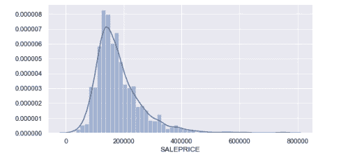

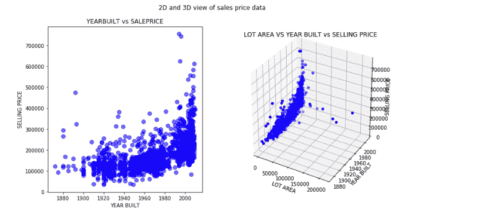

## 回归算法

下面是我们在本教程中讨论的一些流行的回归算法，以及代码示例。

*   线性回归（简单、多元和多项式）
*   决策树回归
*   随机森林树
*   梯度提升树

### 线性回归

当目标和一个或多个预测因子之间存在线性关系时，线性回归模型可预测连续目标。

#### 简单线性回归

这是线性回归的最基本形式，其中要预测的变量只取决于另外一个变量。采用计算直线斜率时通常用到的公式来计算。

y = w[0] + w[1] * x[1]

在前面的等式中，*y* 指的是目标变量，*x[1]* 指的是自变量。*w[1]* 指的是表示 *y* 与 *x[1]* 之间关系的系数，也称为斜率。*w[0]* 是常系数或截距。它指的是 *y* 相对于自变量始终具有的恒定偏移。

下面的代码示例显示如何使用 sklearn 库来计算简单线性回归。

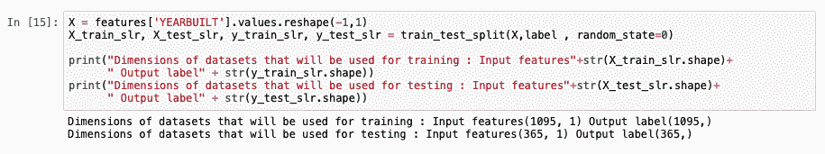

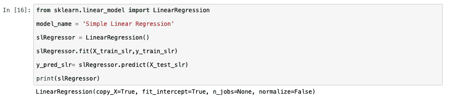

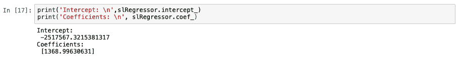

下图显示了模型为测试数据生成的预测值与测试值的实际售价之间的关系。因为简单线性回归假设只依赖于一个变量，所以三维视图在这种背景下没有太多意义。当我们讨论多元线性回归时，这种比较会更有意义。我们还展示了另外两个模型度量图表。

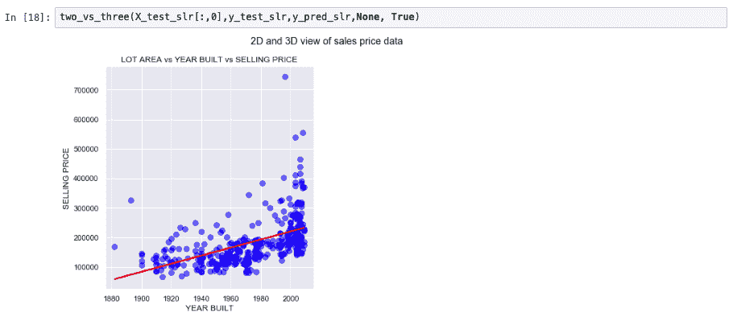

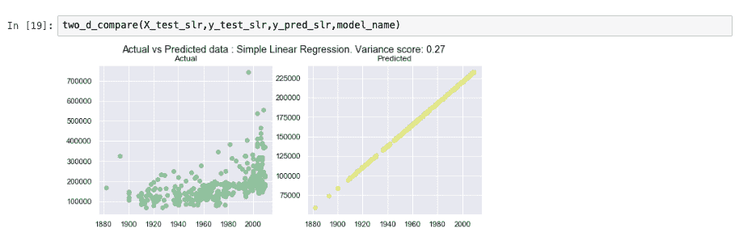

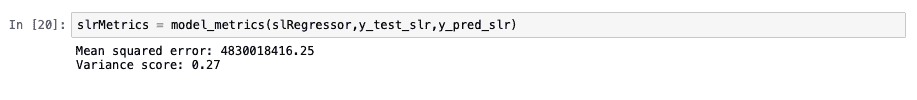

#### 多元线性回归

多元线性回归是简单线性回归的扩展。在此设置中，目标值取决于多个变量。变量的数量取决于用例。通常，该领域的专家会参与确定哪些字段将有助于更准确地预测输出特征。

y = w[0] + w[1] *x[1] + w[2]* x[2] + ….+ w[n] * x[n]

在下面的代码片段中，您会了解如何使用 sklearn 将数据集拆分为测试集和训练集。为了简单起见，我们假设所有的因变量都有助于作出有效的预测。前向选择和后向消除等若干种方法，可用于选择要作出最准确预测所需的最佳列。这些方法的介绍不在本教程讨论范围内。

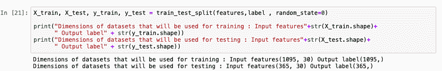

我们使用 sklearn 库开发一个多元线性回归模型。就代码而言，简单线性回归和多元线性回归之间的关键区别在于为拟合模型而包含的列数。

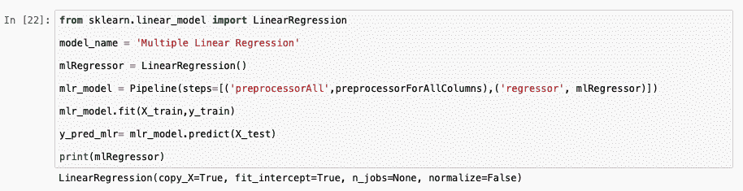

下图显示了以前所开发模型的一些度量。

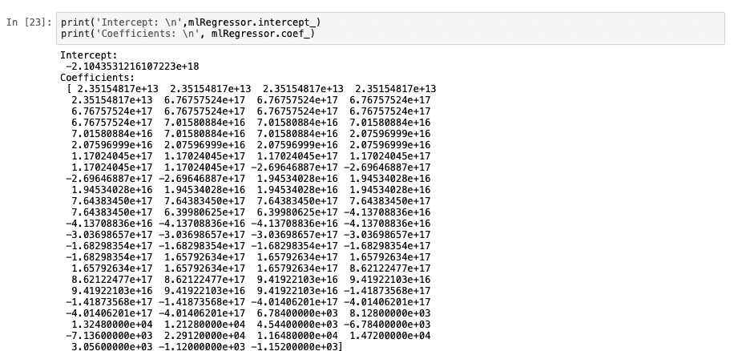

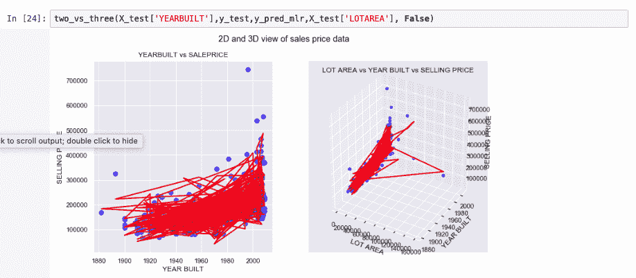

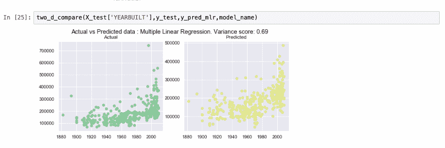

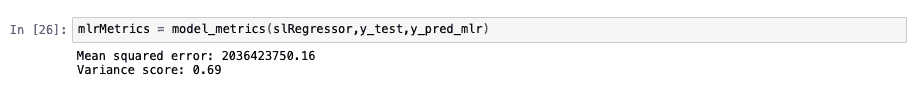

#### 多项式线性回归

简单线性回归生成的预测线通常是一条直线。如果简单线性回归或多元线性回归不能准确拟合数据点，我们就可以使用多项式线性回归。后端使用以下公式生成多项式线性回归。

y = w[0] + w[1] *x[1] + w[2]* x²[1] + ….+ w[n] * x^n[n]

尽管我们在前面的公式中使用了自变量的指数，但是由于系数的线性组合，这种算法不能被认为是非线性的。

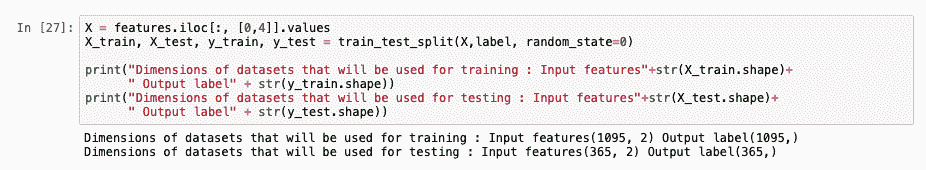

为创建多项式线性回归模型，应对数据进行预处理以创建变量的指数，直至阶数值中提到的数值。在下图中，您看到预处理步骤中的阶数设置为 3，这意味着最多将生成 x³ 个变量。一阶多项式特征与多元线性回归相同。如果在下面的公式中将“degree”的值更改为 1，输出结果就与上一节中创建的模型相同。

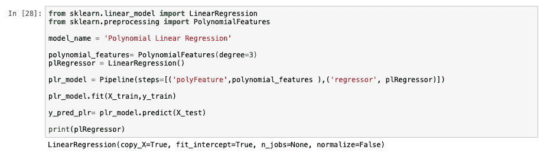

下图显示了一些模型性能度量。三阶多项式线性回归的效率不如多元线性回归。我们可以调整一些参数，看看这个算法能否产生更好的输出，或者可以得出结论：多元线性回归是更适合这个数据集的模型。

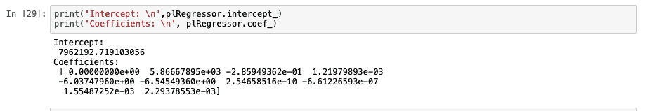

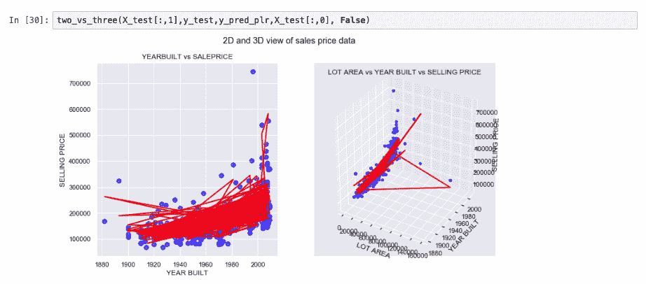

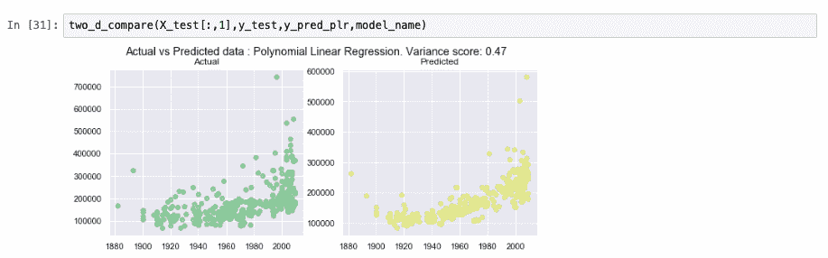

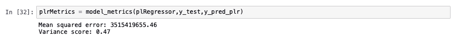

### 决策树

基于决策树的模型通过训练数据构建一组规则来预测结果。为了便于理解，我们将这种算法与通过决策形成的树进行比较。该模型包含一些分支，表示通向结果路径的规则，也就是“叶”。每条预测路径都通向一个包含多个值的叶。同样的原则也适用于分类类型的问题。对于回归类型的问题，最终的预测通常是所属叶中包含的所有值的平均值。

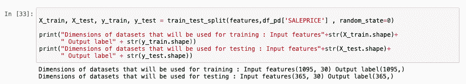

下图显示了使用 sklearn 创建决策树模型的示例。

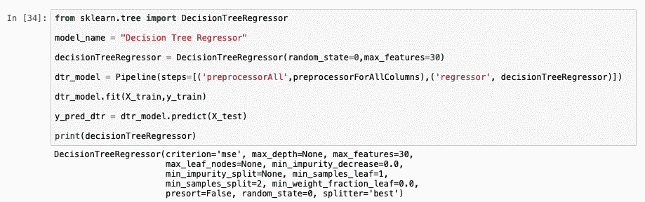

下图中分析了模型性能。

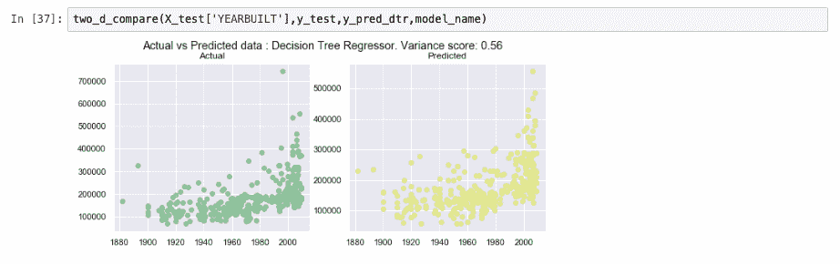

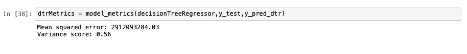

### 集成学习

集成学习是组合弱模型以产生性能更佳模型的算法类型。[使用 Python 和 scikit-learn 学习分类算法](https://www.ibm.com/developerworks/cn/analytics/library/learn-classification-algorithms-using-python-and-scikit-learn/index.html)教程中提供了有关集成学习的更多信息，其中讨论了用于分类的集成学习。

#### 随机森林树

决策树通常被认为是弱模型，因为当数据集相对较大时，决策树的性能通常达不到预期的分数。然而，当几个决策树组合为单个模型时，便可以提供更高的精确度。这种随机森林中的每个决策树都是使用训练数据的子集构建而成的。构成这个随机森林的决策树的数量是一个任意数字，可以调整该数字，查看精确度的变化。当通过产生的这个模型运行要预测的值时，生成的值就是从所有这些单独树中所获值的平均值。

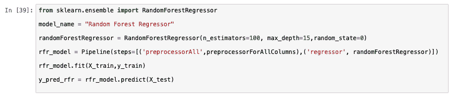

与上一个模型类似，下图显示了使用 sklearn 创建随机森林模型的示例。

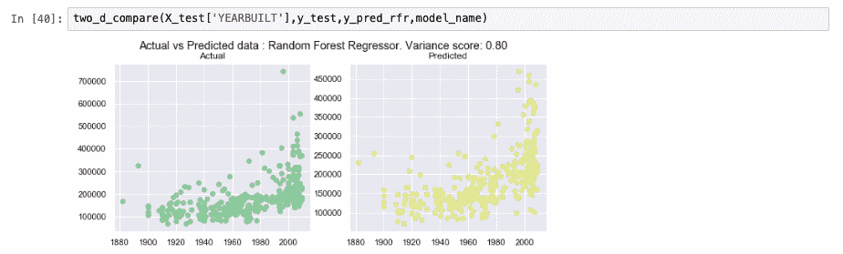

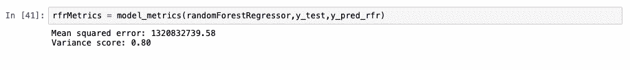

#### 梯度提升树

梯度提升树是通过叠加学习前一个模型的性能来构建的模型。[使用 Python 和 scikit-learn 学习分类算法](https://www.ibm.com/developerworks/cn/analytics/library/learn-classification-algorithms-using-python-and-scikit-learn/index.html)教程中提供了有关梯度提升树的更多详细信息。

## 比较算法

均方误差和 R² 是用于比较不同回归算法的部分常用度量。

通过获取平方误差的平均值来计算均方误差 (MSE)。这里的“误差”是指实际值和预测值之间的差距。MSE 越接近 0，表示模型性能越好。

R² 的计算公式如下：

R² = 1 – (SS[residual] / SS[average] )

其中，SS[residual] 是指实际值和预测值之间差的平方和，SS[average] 是指实际值和平均值之间差的平方和。本质上，R² 的值越接近 1，表示模型越好。如果 R² 的值为负值，则意味着对于任何值，模型性能都不如仅通过训练数据集来预测平均值。

下图比较了不同模型的 MSE 和 R²。

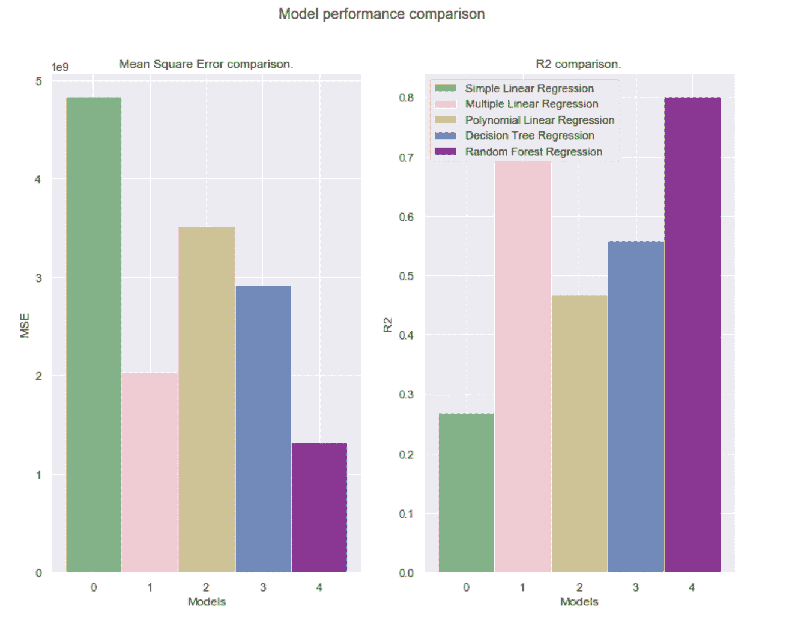

## 结束语

在本教程中，我们提供了回归算法的简要概述，并展示了如何使用 scikit-learn 库实现这些算法。我们还使用 matplot 库使一些结果可视化。本教程已纳入[面向开发者的机器学习](https://developer.ibm.com/cn/blog/2019/learning-path-machine-learning-for-developers/)这一学习路径。

在该学习路径的下一个教程[使用 Python 和 scikit-learn 学习分类算法](https://www.ibm.com/developerworks/cn/analytics/library/learn-classification-algorithms-using-python-and-scikit-learn/index.html)中，您将探索解决基于分类的机器学习问题的基础知识，并对当前最流行的一些算法进行比较研究。

本教程翻译自：[Learn regression algorithms using Python and scikit-learn](https://developer.ibm.com/tutorials/learn-regression-algorithms-using-python-and-scikit-learn/)（2019-12-04）。