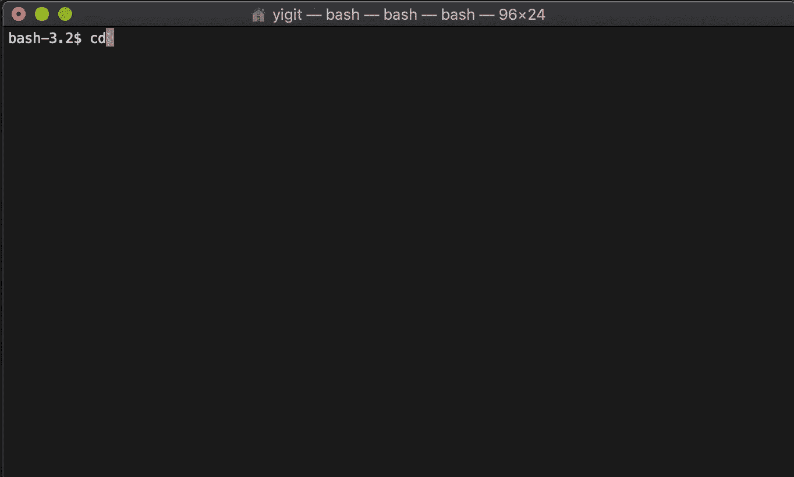

# 使用 CI/CD 流水线在 IBM Cloud 上部署 Vue.js 应用程序

> 原文：[`developer.ibm.com/zh/tutorials/deploy-a-vuejs-application-on-ibm-cloud/`](https://developer.ibm.com/zh/tutorials/deploy-a-vuejs-application-on-ibm-cloud/)

JavaScript 是 Web 开发中应用最广泛的编程语言之一。许多框架和库可以用于加快和简化开发过程。[Vue.js](https://vuejs.org/) 是前端框架的后起之秀，已经被 GitLab、Adobe 和阿里巴巴等领先科技公司用于构建单页应用程序和渐进式 Web 应用程序。

## 学习目标

在本教程中，我将涉及创建、构建和部署 Vue.js 项目等概念。您将学习如何：

*   使用 Vue CLI 创建 Vue.js 项目
*   在 IBM Cloud 上创建工具链
*   将静态 Web 应用程序部署到 Cloud Foundry

## 前提条件

本教程假设您了解 Vue.js 开发的基础知识。要完成本教程中的步骤，您需要：

*   创建一个免费的 [IBM Cloud 帐户](https://cloud.ibm.com/?cm_sp=ibmdev-_-developer-tutorials-_-cloudreg)
*   在系统上安装 [Node.js](https://nodejs.org/en/download/)
*   在系统上安装 [Vue CLI](https://cli.vuejs.org/guide/installation.html)
*   在系统上安装 [Git](https://git-scm.com/downloads)
*   创建一个 [GitHub 帐户](https://github.com/)

## 特色技术

*   [IBM Cloud](https://cloud.ibm.com?cm_sp=ibmdev-_-developer-tutorials-_-cloudreg) 是来自 IBM 的一整套云计算服务，提供平台即服务（PaaS）和基础架构即服务 (IaaS)。
*   [Node.js](https://nodejs.org/en/) 是一个开源的跨平台运行时环境，用于开发服务器端和网络应用程序。
*   [Vue CLI](https://cli.vuejs.org) 是一个全局安装的 npm 包，可在终端中提供 Vue 命令。
*   [Git](https://git-scm.com) 是一个免费的开源分布式版本控制系统，旨在快速有效地处理项目。
*   [GitHub](https://github.com) 是一个分布式版本控制平台，用户可以在此协作或采用开源代码项目。
*   [Cloud Foundry](https://www.ibm.com/cloud/cloud-foundry) 是 IBM Cloud 中一种开源的平台即服务 (PaaS)，使您能够部署和扩展应用，而无需管理服务器。

## 第 1 步：创建 Vue 项目

1.  通过运行以下命令确保正确安装了 Vue CLI：

    ```
     $ vue --version 
    ```

2.  通过命令提示符导航到希望存储项目的目录，并创建一个新的 Vue 项目。

    ```
     $ vue create vue-tutorial 
    ```

    > 注意：您可以通过默认的 [Babel](https://babeljs.io/) 和 [ESLint](https://ESLint.org/) 选择功能，也可以通过 Router、Linter、Vuex 等更多配置手动选择功能。

3.  创建项目后，可以使用以下命令运行项目：

    ```
     $ cd vue-tutorial
     $ npm run serve 
    ```

    

4.  打开您喜欢的浏览器，导航到运行应用程序的 URL；在本例中，运行地址为：`http://localhost:8080`。

    

## 第 2 步：提交更改

既然您已经生成了样板应用程序（也称为模板或主干应用程序），现在就应该对应用程序进行更改，以便根据项目的需求进行个性化处理。

根据项目的规模，应用程序开发可能需要很长时间。您需要一个版本控制系统工具来跟踪项目，查看您所作的更改（以及原因），撤消功能等等。本教程使用两个版本控制系统：Git 和 GitHub。如果您需要复习这些工具，可阅读[了解 Git 的工作原理，而不只是命令](https://www.ibm.com/developerworks/cn/devops/d-learn-workings-git/index.html)教程。

默认情况下，Vue CLI 会初始化项目中的 Git 代码库并进行首次提交。

1.  让我们在主页面中稍作修改，然后进行第二次提交。为此，使用您首选的代码编辑器打开项目，并在 `/src/App.vue` 文件夹下找到该文件。将第 4 行更改为 `<HelloWorld msg="Welcome to Your Vue.js App"/>`。

    > 注意：如果您没有停止终端上的服务进程，则立即可以看到变化。如果您已经停止了此进程，可在项目目录中再次运行 `npm run serve`。

    

2.  返回到现有 CLI 并使用 `Ctrl + C` 组合键停止开发环境，或者打开一个新的 CLI 窗口并切换到您的项目目录。

    ```
     $ git add .
     $ git commit -m "my commit" 
    ```

    

    Git 在计算机上以本地方式运行，但 GitHub 可能是更好的选择，因为您可以将代码库托管在远程服务器中，以免受到本地崩溃的影响。我们将创建一个远程仓库，并将本地提交推送到 GitHub 服务器。

3.  现在需要在 GitHub 上创建一个新的代码库，并添加要将本地代码库推送到的远程仓库的 URL。为此，转到浏览器上的 GitHub 帐户，创建一个新的代码库，进行命名并提供描述。

    

4.  最后，您需要将本地代码库中的更改推送到指定为来源的远程仓库。您可以在创建代码库后立即复制并粘贴 GitHub 提供的命令，也可以使用下面的命令，插入代码库 URL。

    ```
     $ git remote add origin <your_remote_repository_url>
     $ git push -u origin master 
    ```

    

## 第 3 步：将您的项目部署到 IBM Cloud

利用 DevOps 实践，您可以快速调整以适应不断变化的需求，同时仍确保稳定的应用程序部署。本教程遵循 DevOps 策略将您的 Vue 项目部署到 IBM Cloud。

IBM Cloud 中的[工具链](https://cloud.ibm.com/docs/services/ContinuousDelivery?topic=ContinuousDelivery-toolchains_about) 是一组工具集成，可支持开发、部署和运营任务。这里有大量工具链模板，具体取决于您的意图。对于本教程，选择用于 Cloud Foundry 的工具链模板。对于处理持续集成和持续部署的构建、测试、发布和部署步骤的任何工具链来说，[Delivery Pipeline](https://cloud.ibm.com/docs/services/ContinuousDelivery?topic=ContinuousDelivery-deliverypipeline_about) 都是必备组件。

1.  使用您的凭据登录 [IBM Cloud](https://cloud.ibm.com/?cm_sp=ibmdev-_-developer-tutorials-_-cloudreg)，然后在 **Catalog** 中的 **Developer Tools** 部分下找到工具链服务。选择工具链服务后，您将看到众多工具链模板。

2.  从模板列表中选择 **Developer a Cloud Foundry App**。

3.  命名您的工具链服务。
4.  执行以下操作来完成工具集成步骤：

    1.  选择 *GitHub* 作为源提供者。
    2.  授权 IBM Cloud 工具链使用 GitHub。
    3.  将代码库类型设置为 *Existing*。
    4.  指定代码库 URL；这是您在前面步骤中创建的 GitHub 代码库。
    5.  为 Delivery Pipeline 创建 IBM Cloud API 密钥。
    6.  单击 **Create** 以完成此步骤。

        

        > 注意：在创建 Cloud Foundry 应用程序时，您应该正确选择区域（region）、组织（organization）和空间（space）。如果您不确定这些字段要使用的值，可转到 **Manage > Account**，然后选择 **Account resources > Cloud Foundry orgs**。

        完成上述步骤后，应该可以成功创建工具链；但是，在您尝试部署时将会失败，因为您的配置不正确。以下步骤向您展示了如何修正 Delivery Pipeline 中的配置，该流水线有两个独立的阶段：“构建”和“部署”。

        到目前为止，您已经使用 `npm run serve` 命令在本地系统上开发了 Vue 项目。出于生产目的，必须构建您的代码。可以通过运行 `npm run build` 命令来构建代码。

        可将工具链设置为在“构建”阶段构建代码，而不必每次都在开发环境中构建源代码。

5.  要配置“构建”阶段，可选择 Delivery Pipeline 组件，然后单击“构建”阶段齿轮按钮下的 **Configure Stage**。将构建器类型 `simple` 更改为 `npm`，然后在 `npm install` 命令下添加 `npm run build`，并保存这一新配置。

    

    我们将要把 Vue.js 应用程序部署到 Cloud Foundry，这作为 PaaS，用于确保能够以最快速、最简单、最可靠的方式部署云原生应用程序。名为 *manifest.yml* 的文件中设置了 Cloud Foundry 应用程序规范。您可以在 [Cloud Foundry 文档](https://docs.cloudfoundry.org/devguide/deploy-apps/manifest-attributes.html)中找到关于 manifest.yml 属性的更多信息。

6.  您应该在项目的主目录中创建一个 *manifest.yml* 文件，在该目录中设置有关应用程序的基本信息。向工作空间中添加 *manifest.yml* 文件后，提交并推送更改，以便本地和远程仓库均发现添加的文件。由于 GitHub 代码库中的更改触发了“构建”和“部署”阶段开始依次执行任务的流水线，因此将自动启动一个新的流程。如果可以足够快速地将屏幕切换到浏览器，那么您可以看到流水线已在执行它的工作。

    ```
     applications:
     - name: vue-tutorial
         path: ./dist
         buildpack: https://github.com/cloudfoundry/staticfile-buildpack.git
         random-route: true
         memory: 256M    
         env:
         FORCE_HTTPS: true 
    ```

    

    这正是您期望在 CI/CD 流水线结束时看到的情况。

    

## 第 4 步：导航到您的项目

恭喜！您已成功地将前端应用程序部署到 IBM Cloud！现在，我们来看看如何通过浏览器导航到 URL。

在 IBM Cloud Web 控制台中，通过搜索栏搜索您的 Cloud Foundry 应用程序名称，并选择您的应用程序。您可以单击 **Visit App URL**，或者导航到屏幕右上角 Routes 部分中列出的路由。


您的工具链已创建了一个新的 Cloud Foundry 应用程序，并为其分配了一个随机 URL。最后，您的应用程序已在云中运行，可随时与朋友和同事共享！

本文翻译自：[Deploy a Vue.js application on IBM Cloud with a CI/CD pipeline](https://developer.ibm.com/tutorials/deploy-a-vuejs-application-on-ibm-cloud/)（2019-11-21）