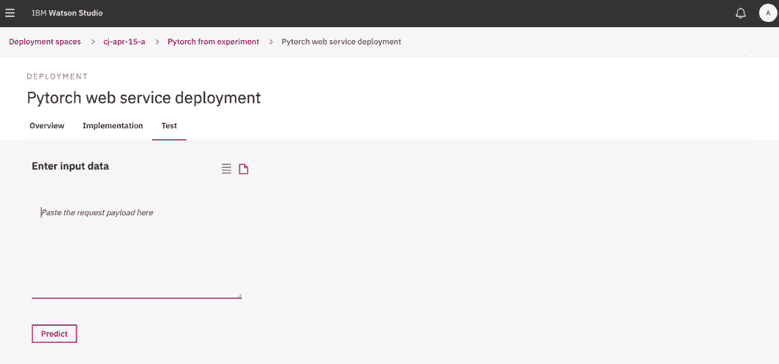

# 深度学习训练：利用 Watson Studio 和 Watson Machine Learning Accelerator 加速您的学习

> 原文：[`developer.ibm.com/zh/tutorials/accelerate-deep-learning-training-with-watson-studio-and-wml-accelerator/`](https://developer.ibm.com/zh/tutorials/accelerate-deep-learning-training-with-watson-studio-and-wml-accelerator/)

Watson Studio Local 现在是 IBM Cloud Pak for Data 的一部分。点击了解更多 [Cloud Pak for Data](https://www.ibm.com/cn-zh/products/cloud-pak-for-data)。

模型训练和超参数搜索是一个迭代过程，可能需要数天、数周甚至数个月时间才能完成。数据科学家可能会花费大量时间来训练模型，从而实现所需的准确性。

IBM® Watson™ Studio Local 2.0.2 和 IBM Watson Machine Learning Accelerator 1.2.0 组成了一个企业 AI 平台，此平台加速了模型训练过程，结合了速度和准确性来驱动价值，并缩短了模型投入市场的时间。模型训练是由 GPU 加速的过程，可以自动扩展，并允许分配更多的可用 GPU。利用我们的企业 AI 平台，数据科学家可以更快速地获取结果，并达到所需的准确性级别。

这些技术按如下方式协同工作：

*   Watson Studio 2.0.2 支持协作开发模型。
*   Watson Machine Learning Accelerator 通过并行自动执行超参数搜索来帮助数据科学家优化训练速度。
*   Watson Machine Learning Accelerator 中的弹性分布式训练功能有助于在多个 GPU 和计算节点之间分配模型训练工作。可以灵活地分配训练工作。这意味着 GPU 是动态分配的，因为可以在用户退出而不终止工作的情况下添加或移除 GPU。由于调度程序会动态分配 GPU，因此您无需将 GPU 拓扑编码到模型中。而弹性分布式训练可处理基于独立系统构建的模型的分配，并使分配对用户可见。

## 学习目标

在本教程中，您将执行以下操作：

1.  安装并配置 Watson Studio 2.0.2、Watson Machine Learning 2.0.2 和 Watson Machine Learning Accelerator 1.2.0
2.  提交单节点深度学习模型以在 Watson Studio 2.0.2 中训练该模型
3.  将此训练加载到 Watson Machine Learning Accelerator
4.  使用弹性分布式训练来运行分布式训练
5.  部署您的深度学习模型

## 安装和配置

要安装并配置 IBM Watson Studio 2.0.2 和 IBM Watson Machine Learning Accelerator，请遵循运行手册中的步骤。

## 创建弹性分布式训练 PyTorch 深度学习实验

在本部分中，您将创建一个用于分析笔迹的深度学习实验。要创建并运行此实验，您必须有权访问以下内容：

*   用于训练和测试该模型的数据集。本教程使用 MNIST 数据集来分析笔迹样本。
*   训练定义，其中包含模型构建代码和有关如何运行该实验的元数据。有关对训练定义文件进行编码的信息，参阅[深度学习程序的编码准则](https://dataplatform.cloud.ibm.com/docs/content/wsj/analyze-data/ml_dlaas_code_guidelines.html)。
*   训练执行命令。此执行命令必须引用 Python 代码，传递训练文件的名称，并可以选择指定指标。

本教程介绍了这些组件，并提供了有关下载这些组件并将其添加到实验中的说明。

### 为实验创建一个项目

要开始本教程，请登录到 Watson Studio 2.0.2 并为实验创建一个项目。

1.  登录到 IBM Watson Studio 2.0.2。 **注意**：用户凭证必须与为 Watson Machine Learning Accelerator 创建的 Watson Machine Learning 用户帐户匹配。 

2.  创建一个新的标准项目。 

3.  输入项目名称和描述。 

4.  单击操作栏中的 **Add to Project**，然后选择 **Experiment**。 

5.  由于您的项目未与 Watson Machine Learning 部署空间关联，因此系统会提示您现在将其关联。您将在部署空间中创建和管理 Watson Machine Learning 部署。 

6.  输入新部署空间的详细信息，然后单击 **Associate**。 

### 定义和训练实验

在关联了部署空间后，您将返回到 New Experiment 页面，您可以在该页面中定义和运行实验。

1.  在 New Experiment 页面中，输入该实验的名称和描述，然后上载样本数据集，如下所示： 

    1.下载 MNIST 数据集。

    1.  将 MNIST 数据集上载到 Watson Machine Learning Accelerator 数据集 NFS 安装点。例如，`/gpfs/dli_data_fs/pytorch-mnist`。
    2.  在 Source files folder 字段中，输入源文件相对于 Watson Machine Learning Accelerator 数据集 NFS 安装点的路径。例如，`/gpfs/dli_data_fs/pytorch-mnist`。
2.  单击 **Add Training Definition** 以创建要在该实验中运行的新训练定义。

3.  确保 New training definition 选项卡处于活动状态。输入该训练定义的名称和（可选）描述。 

4.  单击 browse 按钮并选择训练定义源文件 pytorch_onnx.zip。 

5.  为该训练定义选择框架。

6.  为该训练定义输入执行命令。此执行命令必须引用 Python 代码，传递训练文件的名称，并可以选择指定指标。

7.  在 Compute Configuration 下拉菜单中，选择要用于运行该训练定义的计算配置。如果要将弹性分布式训练与 PyTorch 结合使用，请务必在此处选择 Single GPU 选项。否则，您可以选择任意数量的 GPU。

8.  如果您选择了 Pytorch Framework 和 Single GPU 计算配置，那么可以选择分布式训练类型。要使用分布式训练，请从下拉菜单中选择 **Elastic distributed training**。否则，将该选项保留为 None。如果选择 Elastic distributed trainin，那么可以从 Number of nodes 下拉菜单中选择要用于分布式训练的节点数。节点是 GPU，因此，如果您选择的分布式训练的节点数为 8 ，那么将在 8 个 GPU 之间分配训练工作。

9.  单击 **Create** 以创建训练定义并返回到 New Experiment 页面。

10.  单击 **Create and run** 以创建实验并开始训练过程。 

11.  将转至实验详细信息页面，您可以在该页面中监视训练过程。 

12.  在执行实验期间，您可以比较训练运行以及查看实验详细信息。  

13.  单击训练运行以监视其进度并查看特定于该次运行的详细信息。   

14.  在成功完成训练运行后，您可以从操作菜单中选择 **Save** 以在 Watson Machine Learning 部署空间中创建一个新模型。 

15.  输入模型名称和（可选）描述。 

16.  单击 Successful Model Save 通知中的链接，以在 Watson Studio 界面中查看模型详细信息。 

## 部署深度学习模型

在本部分中，您将部署模型以使其可用。

1.  单击 **Open in deployment space** 以在 Watson Machine Learning 部署空间（可在其中部署模型）中查看该模型。 

2.  单击 **Deployments** 选项卡，然后单击 **Add Deployment** 来为该模型创建新的 Web Service 部署。对于 Web Service 部署，将有效负载文件传递给该模型并立即返回结果。 

3.  输入部署名称和（可选）描述，然后单击 **Save**。 

4.  在创建部署后，通过单击部署列表中的部署链接来查看部署详细信息。   

您的模型现在可以进行评分了。

## 结束语

Watson Studio、Watson Machine Learning 和 Watson Machine Learning Accelerator 共同奠定了企业 AI 平台的坚实基础。这种基础不仅可以帮助数据科学家更快速地获取结果，还可以提高模型的准确性级别。在本教程中，我们演示了数据科学家如何利用 Watson Studio 来协作开发模型，以及如何利用 Watson Machine Learning Accelerator 弹性分布式训练来加速模型训练。有关更多详细信息，参阅 [Watson Studio 2.0.2](https://www.ibm.com/support/knowledgecenter/en/SSHGWL_2.0.0/local/welcome.html) 和 [Watson Machine Learning 1.2.0](https://www.ibm.com/support/knowledgecenter/en/SSFHA8_1.2.0/wmla_overview.html) 文档。

本教程翻译自：[Deep learning training: Accelerate your learning with Watson Studio and Watson Machine Learning Accelerator](https://developer.ibm.com/technologies/data-science/tutorials/accelerate-deep-learning-training-with-watson-studio-and-wml-accelerator)（2019-10-30）。