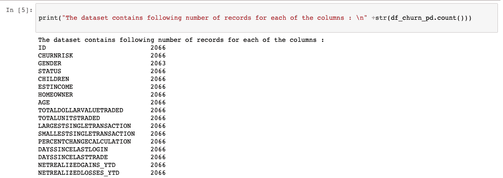

# 使用 Python 和 scikit-learn 构建并测试您的第一个机器学习模型

> 原文：[`developer.ibm.com/zh/tutorials/build-and-test-your-first-machine-learning-model-using-python-and-scikit-learn/`](https://developer.ibm.com/zh/tutorials/build-and-test-your-first-machine-learning-model-using-python-and-scikit-learn/)

本教程已纳入[面向开发者的机器学习](https://developer.ibm.com/cn/blog/2019/learning-path-machine-learning-for-developers/)这一学习路径。

| 级别 | 主题 | 类型 |
| --- | --- | --- |
| 100 | [机器学习简介](https://www.ibm.com/developerworks/cn/analytics/library/introduction-to-machine-learning/index.html) | 文章 |
| 101 | [使用 Python 和 scikit-learn 构建并测试您的第一个机器学习模型](https://www.ibm.com/developerworks/cn/analytics/library/build-and-test-your-first-machine-learning-model-using-python-and-scikit-learn/index.html) | 教程+Notebook |
| 201 | [使用 Python 和 scikit-learn 学习回归算法](https://www.ibm.com/developerworks/cn/analytics/library/learn-regression-algorithms-using-python-and-scikit-learn/index.html) | 教程+Notebook |
| 202 | [使用 Python 和 scikit-learn 学习分类算法](https://www.ibm.com/developerworks/cn/analytics/library/learn-classification-algorithms-using-python-and-scikit-learn/index.html) | 教程+Notebook |
| 203 | [使用 Python 和 scikit-learn 学习聚类算法](https://www.ibm.com/developerworks/cn/analytics/library/learn-clustering-algorithms-using-python-and-scikit-learn/index.html) | 教程+Notebook |

## 简介

在本教程中，我们演示了如何从头到尾完整地创建和运行分类模型的实践示例。本教程包括以下步骤：

*   数据探索
*   数据预处理
*   拆分数据以用于训练和测试
*   准备一个分类模型
*   使用管道组装所有步骤
*   训练模型
*   对模型运行预测
*   评估模型性能并使之可视化

## 设置

本教程包括一个用 Python 编写的 Jupyter Notebook。您可以使用免费试用帐户，通过 Watson Studio 在 IBM Cloud 上运行 Notebook。

1.  注册或登录。

    *   从 [Try IBM Watson](https://dataplatform.cloud.ibm.com/registration/stepone?cm_sp=ibmdev-_-developer-tutorials-_-cloudreg) 页面登录到您的 IBM Cloud 帐户来激活 Watson Studio。
    *   在 [`dataplatform.cloud.ibm.com`](https://dataplatform.cloud.ibm.com?cm_sp=ibmdev-_-developer-tutorials-_-cloudreg) 处登录以访问 Watson Studio。
2.  创建一个空白项目。

    *   单击 **Create a project** 或 **New project**。
    *   选择 **Create an empty project**。
    *   为项目提供一个名称。
    *   选择现有的对象存储服务实例或创建一个新实例。
    *   单击 **Create**。
3.  添加 Notebook。

    *   单击 **+Add to project**。
    *   单击 **Notebook**。
    *   单击 **From URL**。
    *   在 **Name** 中输入名称。
    *   在 **Select runtime** 下面，选择 **Default Python 3.6 Free**。
    *   对于 **Notebook URL**，输入 `https://raw.githubusercontent.com/IBM/ml-learning-path-assets/master/notebooks/classification_start_to_end_with_scikit_learn.ipynb`。
    *   单击 **Create Notebook**。
4.  运行该 Notebook。

    在打开的 Notebook 中，单击 **Run** 一次运行一个单元。教程的其余部分遵循 Notebook 的顺序。

现在您已经设置了 Notebook，让我们继续开发分类模型，使用包含在线交易平台客户信息的数据集来预测客户是否会流失。

## 数据探索

在实际开始机器学习之前，您必须要执行几个步骤。首先，数据科学家必须分析用于运行预测的数据的质量。数据表示出现偏差会导致模型出现偏差。可以通过几种方法来分析数据。在本教程中，我们将进行小限度的数据探索，大致介绍一下所做的工作，然后将进入这个主题的核心内容。

### 关于数据集

在本教程中，我们使用包含在线交易平台客户信息的数据集进行分类，确定给定客户的流失概率将是高、中还是低。这提供了一个很好的例子，供您学习如何从头到尾完整构建分类模型。预测将分为高、中、低三类。现在，我们来深入了解一下数据集。

数据以 .csv 文件的形式提供给我们，并使用 pandas 库导入。我们使用 numpy 和 matplotlib 来获取一些统计数据，并将数据可视化。

我们首先运行几行代码来了解每列的数据类型以及每列中的条目数。

性别列中的计数不匹配情况（见下图）会在数据预处理步骤中进行处理。

我们已经使用 matplotlib 绘制了一个基本的条形图，让您了解数据是如何在不同的输出类之间拆分的。如果我们对代表性的数据不满意，现在是时候获得更多的数据用于训练和测试了。

## 数据预处理

数据预处理是机器学习模型构建过程中的一个重要步骤，因为仅当训练模型的数据良好且准备充分时，模型才能表现出良好的性能。因此，构建模型时，这一步骤会占用大量的时间。

在机器学习中需要执行一些常见的数据预处理步骤，本教程将介绍其中的几个步骤。在 [scikit-learn 数据预处理](https://scikit-learn.org/stable/modules/preprocessing.html) 页面上，可以找到 scikit-learn 提供的预处理选项的完整列表。

我们首先确定那些不会为预测输出增加任何价值的列。虽然其中一些列很容易确定，但通常需要一名这方面的专家来确定其中大部分列。删除这些列有助于降低模型的维数。

必须为每一列自定义所应用的预处理技术。Sklearn 提供了一个名为 ColumnTransformer 的库，这个库允许使用管道将这些技术依次应用于选择性列。

处理数据集时，一个常见的问题就是缺少值。scikit-learn 提供了一种方法，可以使用在其上下文中适用的内容来填充这些空值。我们使用了 Sklearn 提供的 `SimpleImputer` 类，并用列中出现频率最高的值填充了缺少的值。

因为机器学习算法用数字表现出的性能要高于使用字符串，所以我们想要识别包含类别的列，并将这些列转换成数字。我们使用 Sklearn 提供的 `OneHotEncoder` 类。一个热门编码器的想法是创建二元变量，每个变量代表一个类别。这样一来，就消除了只将数字分配给类别而可能出现的任何序数关系。基本上，我们从包含多个类编号的单个列转变为只包含二元类编号的多个列。

识别数据集中的数字列，并将 `StandardScaler` 应用于每一列。这样，每个值都会减去其列的平均值，再除以其标准偏差。

正如前面所讨论的，每种技术均按照需要应用这些技术的列进行分组，并使用 `ColumnTransformer` 进行排队。理想情况下，这是在训练模型之前在管道中运行。然而，为了理解数据将会是什么样子，我们已经将数据转换为一个临时变量。

机器学习算法不能使用简单的文本。我们必须将数据从文本转换为数字。因此，对于每个作为类的字符串，我们分配一个数字形式的标签。例如，在客户流失率数据集中，CHURNRISK 输出标签被分类为高、中或低，并被分配了标签 0、1 或 2。对此，我们使用 Sklearn 提供的 `LabelEncoder` 类。

以上就是应用于数据集的一些常见预处理步骤。您可以在[数据预处理详解](https://developer.ibm.com/zh/articles/data-preprocessing-in-detail/)中获取更多信息。

## 拆分数据以用于训练和测试

在对数据进行预处理之后，下一步是将数据拆分成几部分，用于创建和训练模型以及测试和评估生成的模型。关于训练和测试之间的数据拆分比例，有几种不同的理论。在本教程中，我们使用 98% 的数据进行训练，2% 的数据进行测试。

## 准备一个分类模型

目前有几种分类模型很受欢迎，并且已被证实准确性很高。在本教程中，我们通过初始化 Sklearn 提供的库来应用随机森林分类器。在本学习路径中，我们已经详细介绍和比较了[使用 Python 和 scikit-learn 学习分类算法](https://www.ibm.com/developerworks/cn/analytics/library/learn-classification-algorithms-using-python-and-scikit-learn/index.html)中的各种分类模型。现在，我们将跳过随机森林工作方式的细节，继续创建我们的第一个机器学习模型。

## 使用管道组装步骤

在这个学习路径中，我们使用管道。在机器学习流程中设计数据处理时，管道是一种很便捷的方式。[使用 Python 和 scikit-learn 学习分类算法](https://www.ibm.com/developerworks/cn/analytics/library/learn-classification-algorithms-using-python-and-scikit-learn/index.html)中详细介绍了使用管道背后的理念。下面的代码示例展示了如何使用 sklearn 设置管道。

## 训练模型

创建模型的最后一步称为建模，这里基本上就是训练机器学习算法。在拆分数据步骤中拆分出来的 98% 的数据，用于训练在上一步中初始化的模型。

## 对模型运行预测

模型训练好后，就可以进行一些分析了。在这一步，保留用于测试模型的 2% 的数据用于运行预测。数据被遮住，没有任何输出，并按下图所示进行传递。我们下一步要做的就是收集预测的输出，对照实际结果进行评估。

## 评估模型性能并使之可视化

将应该出现的实际结果与上一步中获得的预测结果进行比较。最终生成了几个评估度量来计算模型的性能。

 

## 结束语

在评估提供满意的分数之前，您需要调整所谓的超参数，通过评估步骤重复数据预处理操作。

在本教程中，我们开发了一个基本的机器学习分类模型。本教程已纳入[面向开发者的机器学习](https://developer.ibm.com/cn/blog/2019/learning-path-machine-learning-for-developers/)这一学习路径。在这一学习路径的下一个教程[使用 Python 和 scikit-learn 学习回归算法](https://www.ibm.com/developerworks/cn/analytics/library/learn-regression-algorithms-using-python-and-scikit-learn/index.html)中，我们将更深入地探讨每种算法是如何得到这些预测结果的。 在本教程中，我们开发了一个基本的机器学习分类模型。本教程已纳入[面向开发者的机器学习](https://developer.ibm.com/cn/blog/2019/learning-path-machine-learning-for-developers/)这一学习路径。在这一学习路径的下一个教程[使用 Python 和 scikit-learn 学习回归算法](https://www.ibm.com/developerworks/cn/analytics/library/learn-regression-algorithms-using-python-and-scikit-learn/index.html)中，我们将更深入地探讨每种算法是如何得到这些预测结果的。

本教程翻译自：[Build and test your first machine learning model using Python and scikit-learn](https://developer.ibm.com/tutorials/build-and-test-your-first-machine-learning-model-using-python-and-scikit-learn/)（2019-12-04）