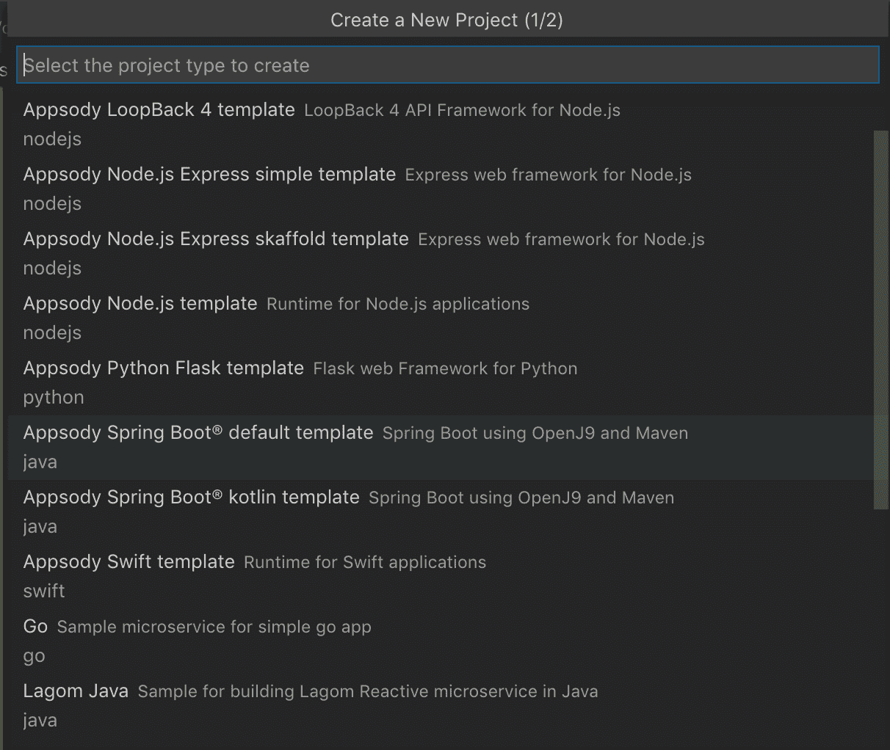
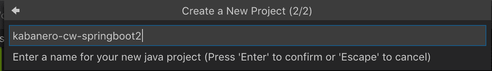
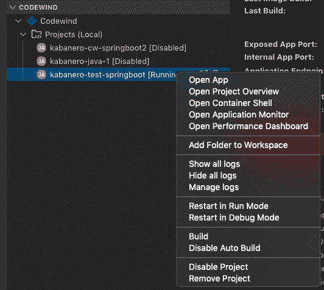

# Archived | 使用 Kabanero、Appsody 和 Codewind 在 Kubernetes 上构建 Spring Boot 应用程序

> 原文：[`developer.ibm.com/zh/tutorials/kabanero-introduction-to-modern-microservices-development-for-kubernetes/`](https://developer.ibm.com/zh/tutorials/kabanero-introduction-to-modern-microservices-development-for-kubernetes/)

**本文已归档**

**归档日期：:** 2021-02-25

此内容不再被更新或维护。 内容是按“原样”提供。鉴于技术的快速发展，某些内容，步骤或插图可能已经改变。

要创建一个现代的云原生应用程序，就必须考虑应用程序的各个方面，从将业务逻辑纳入适当位置的最佳方式，到如何处理灾备能力、可靠性和监控等技术注意事项，皆应有所涉及。此外，在云端或 Kubernetes 集群中运行应用程序时，还必须创建 Dockerfile 和必要的 Kubernetes 资源文件。

身处 DevOps 时代，团队负责在应用程序的整个生命周期内构建和运行这些应用程序，因此选择最佳工具对于帮助减少构建和部署云原生应用程序所需的工作至关重要。IBM 之所以打造全新的开源工具 Kabanero、Appsody 和 Codewind，就是为了让开发者能够更轻松地构建云原生应用程序并将其部署到 Kubernetes。

本文向您介绍了 Kabanero，展示了如何使用它以及 Appsody 和 Codewind 来构建在 Kubernetes 中运行的 Spring Boot 应用程序。

在我们开始这些步骤之前，先快速了解一下这些全新的开源组件：

*   [Kabanero](https://kabanero.io/) 集成了多个知名的开源项目（如 Appsody 和 Codewind）来支持 DevOps，并从基础架构的角度减少所需的工作，支持云原生开发。
*   [Appsody](https://appsody.dev/) 提供预定义的代码堆栈，可最大限度地减少创建项目的初始工作量。Appsody 目前为 Eclipse MicroProfile、Spring Boot、Quarkus、Node.js、Node.js Express 和 Swift 应用程序提供堆栈。更多的堆栈正在开发之中，您也可以自定义现有堆栈或创建新堆栈。在组织或大型开发团队中，使用这些堆栈可以为应用程序结构设置最低标准。
*   [Eclipse Codewind](https://www.eclipse.org/codewind/) 是一个 IDE 扩展，可用于在容器内构建、测试和部署应用程序。由于您可以使用自己心仪的 IDE（目前支持 Eclipse、Eclipse Che 和 VSCode），因此您甚至不必熟悉容器环境。

在本教程中，我使用了以下版本：

*   Knative：V0.7
*   Appsody：V0.4.5
*   Codewind：V0.4.0

## 前提条件

要完成本教程中的步骤，您需要在系统上安装并运行以下工具:

*   Docker
*   Kubernetes [本地安装](https://kubernetes.io/docs/setup/learning-environment/minikube/) 或 [IBM Cloud Kubernetes Service](https://cloud.ibm.com/kubernetes/catalog/cluster?cm_sp=ibmdev-_-developer-tutorials-_-cloudreg)。至少需要 Kubernetes V1.11
*   Knative，参阅[本地安装](https://appsody.dev/docs/) 或 [IBM Cloud](https://cloud.ibm.com/docs/containers?topic=containers-serverless-apps-knative&locale=en#knative-setup) 上的相关说明。
*   Appsody 和 Codewind（将在下文中介绍）

## 安装

我们将 VSCode 与 Codewind 扩展配合使用，并在本地 Kubernetes 集群中运行该示例。您可以对 IBM Cloud Kubernetes Services 或 OpenShift 集群使用相同方法。

*   安装 [Appsody CLI](https://appsody.dev/docs/getting-started/quick-start)
*   从 VSCode 市场安装 Codewind — 只需在市场中搜索“Codewind”。这还将安装一些 Docker 镜像和 [Appsody 插件](https://github.com/eclipse/codewind-appsody-extension)：

```
eclipse/codewind-initialize-amd64                                                                                            0.4.0                  7f31c5b7db69        6 days ago           206MB
codewind-initialize-amd64                                                                                                    0.4.0                  7f31c5b7db69        6 days ago           206MB
codewind-performance-amd64                                                                                                   0.4.0                  09ac0adfa6b5        6 days ago           86.4MB
eclipse/codewind-performance-amd64                                                                                           0.4.0                  09ac0adfa6b5        6 days ago           86.4MB
codewind-pfe-amd64                                                                                                           0.4.0                  224a9df6df08        6 days ago           706MB
eclipse/codewind-pfe-amd64                                                                                                   0.4.0                  224a9df6df08        6 days ago           706MB 
```

## 使用 Appsody 创建 Spring Boot 项目

要创建新的 Spring Boot 项目，可使用 Appsody 中的 `java-spring-boot2` 堆栈。

Appsody 堆栈表示 Kubernetes 应用程序的基础，由基本容器镜像和项目模板组成。项目模板使用基础容器镜像以及提供的运行时和依赖项，因此很容易启动项目。

您可以在[此处](https://github.com/appsody/stacks/releases/latest/download/incubator-index.yaml)查看当前默认堆栈存储库。您还可以添加其他存储库。

为创建一个新项目，我们将使用 Appsody 中的 Spring Boot 2 堆栈。使用 `appsody list` 命令查看可用的堆栈。

```
$ appsody list
Your default repository is now set to appsodyhub

REPO        ID                VERSION   TEMPLATES         DESCRIPTION
*appsodyhub java-microprofile 0.2.14    *default          Eclipse MicroProfile on Open Liberty & OpenJ9 using Maven
*appsodyhub java-spring-boot2 0.3.14    *default, kotlin  Spring Boot using OpenJ9 and Maven
*appsodyhub nodejs            0.2.5     *simple           Runtime for Node.js applications
*appsodyhub nodejs-express    0.2.6     *simple, skaffold Express web framework for Node.js
*appsodyhub nodejs-loopback   0.1.4     *scaffold         LoopBack 4 API Framework for Node.js
*appsodyhub python-flask      0.1.3     *simple           Flask web Framework for Python
*appsodyhub swift             0.1.4     *simple           Runtime for Swift applications 
```

在一个空目录中使用 Spring Boot 2 模板创建一个新项目。为此，使用您选择的堆栈运行 `appsody init` 命令。

```
$ mkdir kabanero-test-springboot2
$ cd kabanero-test-springboot2
$ appsody init java-spring-boot2

Running appsody init...
Downloading java-spring-boot2 template project from https://github.com/appsody/stacks/releases/download/java-spring-boot2-v0.3.14/incubator.java-spring-boot2.v0.3.14.templates.default.tar.gz
Download complete.Extracting files from java-spring-boot2.tar.gz
Setting up the development environment
Running command: docker pull appsody/java-spring-boot2:0.3
Running command: docker run --rm --entrypoint /bin/bash appsody/java-spring-boot2:0.3 -c find /project -type f -name .appsody-init.sh
Extracting project from development environment
Running command: docker create --name my-project-extract -v /Users/haddouti/codewind-workspace/kabanero-test-springboot2/.:/project/user-app -v /Users/haddouti/.m2/repository:/mvn/repository appsody/java-spring-boot2:0.3
Running command: docker cp my-project-extract:/project /Users/haddouti/.appsody/extract/kabanero-test-springboot2
Running command: docker rm my-project-extract -f
Project extracted to /Users/haddouti/codewind-workspace/kabanero-test-springboot2/.appsody_init
Running command: ./.appsody-init.sh
Successfully initialized Appsody project

$ ls -la
total 24
drwxr-xr-x  7 haddouti  staff   224 Sep 25 22:21 .
drwxr-xr-x  8 haddouti  staff   256 Sep 25 22:20 ..
-rw-r--r--  1 haddouti  staff    37 Sep 25 22:21 .appsody-config.yaml
-rw-r--r--  1 haddouti  staff   288 Sep 25 22:21 .gitignore
drwxr-xr-x  4 haddouti  staff   128 Sep 25 22:21 .vscode
-rw-r--r--  1 haddouti  staff  1189 Sep 25 22:21 pom.xml
drwxr-xr-x  4 haddouti  staff   128 Sep 25 22:21 src 
```

结果是一个基于 Spring Boot 2 和 Maven 的工作框架项目，带有 *Health* 和 *Monitoring* 端点。`.appsody-config.yaml` 包含所用 Appsody 堆栈的引用。

```
# cat .appsody-config.yaml
stack: appsody/java-spring-boot2:0.3 
```

Spring Boot 应用程序包含对 [spring-boot2-stack](https://github.com/appsody/stacks/tree/master/incubator/java-spring-boot2) 的依赖项，用于管理依赖项和插件。它还包含 Prometheus、OpenTracing 和 Spring Developer Tool，用于动态重新加载。

以下是 pom.xml 依赖项：

```
<parent><!--required parent POM-->
    <groupId>dev.appsody</groupId>
    <artifactId>spring-boot2-stack</artifactId>
    <version>0.3, 0.4)</version>
    <relativePath/>
  </parent> 
```

如果您在项目目录中使用 `appsody run`，则将构建并运行应用程序，并在 `http://localhost:8080/` 下提供。

![流程图

在内部，Appsody 会创建一个 Docker 镜像并运行容器来构建和测试项目。一旦通过测试，此后就会运行容器。

```
$ docker ps
CONTAINER ID        IMAGE                              COMMAND                  CREATED              STATUS              PORTS                                                                                              NAMES
40e448a63904        appsody/java-spring-boot2:0.3      "/appsody/appsody-co…"   About a minute ago   Up About a minute   0.0.0.0:5005->5005/tcp, 0.0.0.0:8080->8080/tcp, 0.0.0.0:8443->8443/tcp, 0.0.0.0:35729->35729/tcp   kabanero-test-springboot2-dev 
```

要停止应用程序，可使用 `ctrl+c` 组合键或在项目目录中键入 `appsody stop`：

```
$ appsody stop

Stopping development environment
Running command: docker[stop kabanero-test-springboot-dev] 
```

要获得 Docker 容器，可以显式调用 `appsody build`，这会提取所有工件，创建 Dockerfile，并生成 Docker 容器。所有文件都放置在 `$HOME/.appsody/extract/<project-name>/` 中，如以下代码所示：

```
# appsody build

Extracting project from development environment
Running command: docker pull appsody/java-spring-boot2:0.3
Running command: docker create --name kabanero-test-springboot2-extract -v /Users/haddouti/codewind-workspace/kabanero-test-springboot2/.:/project/user-app -v /Users/haddouti/.m2/repository:/mvn/repository appsody/java-spring-boot2:0.3
Running command: docker cp kabanero-test-springboot2-extract:/project /Users/haddouti/.appsody/extract/kabanero-test-springboot2
Running command: docker rm kabanero-test-springboot2-extract -f
Project extracted to /Users/haddouti/.appsody/extract/kabanero-test-springboot2
Running docker command: docker build -t kabanero-test-springboot2 -f /Users/haddouti/.appsody/extract/kabanero-test-springboot2/Dockerfile /Users/haddouti/.appsody/extract/kabanero-test-springboot2
[Docker] Sending build context to Docker daemon  597.5kB
[Docker] Step 1/16 : FROM appsody/java-spring-boot2:0.3 as compile
[Docker]  ---> 4ea7128b4908
[Docker] Step 2/16 : COPY ./project
[Docker]  ---> fba0fb3e1e4d
[Docker] Step 3/16 : WORKDIR /project/user-app
[Docker]  ---> Running in 62b15dd73734
[Docker] Removing intermediate container 62b15dd73734
[Docker]  ---> 83fd7058ad5b
[Docker] Step 4/16 : RUN /project/util/check_version build  && /project/java-spring-boot2-build.sh package
[Docker]  ---> Running in 7e1232e17fb4
[Docker] Installing parent dev.appsody:spring-boot2-stack:0.3.14
[Docker] > mvn install -q -f /project/appsody-boot2-pom.xml
...
[Docker]  ---> Running in 254e0c44af86
[Docker] Removing intermediate container 254e0c44af86
[Docker]  ---> 7b3cf8460bc3
[Docker] Successfully built 7b3cf8460bc3
[Docker] Successfully tagged kabanero-test-springboot2:latest
Built docker image kabanero-test-springboot2

# ll $HOME/.appsody/extract/kabanero-test-springboot2
total 88
-rw-rw-r--  1 haddouti  staff   926B Sep 25 15:20 Dockerfile
-rw-rw-r--  1 haddouti  staff   6.6K Sep 25 15:20 appsody-boot2-pom.xml
-rwxrwxr-x  1 haddouti  staff   4.8K Sep 25 15:19 java-spring-boot2-build.sh
-rw-rw-r--  1 haddouti  staff   628B Sep 25 15:19 mvn-stack-settings.xml
-rwxrwxr-x  1 haddouti  staff   9.8K Sep 25 15:20 mvnw
-rw-rw-r--  1 haddouti  staff   6.5K Sep 25 15:20 mvnw.cmd
drwxr-xr-x  9 haddouti  staff   288B Sep 25 22:25 user-app
drwxrwxr-x  6 haddouti  staff   192B Sep 25 15:20 util

# docker images | grep -i kabanero-test-springboot2
kabanero-test-springboot2                                                                                                    latest                 7b3cf8460bc3        3 minutes ago       400MB 
```

## Codewind 集成

Codewind 包含一个 Appsody 插件，因此您可以用它来管理 Appsody 项目。在 Codewind 视图中，可以添加一个现有项目（应该已经存在于 `$HOME/codewind-workspace/` 中），或者使用可用的 Appsody 模板创建一个新项目。

 

该项目的上下文菜单提供了各种选项，例如在默认浏览器中执行 `Open the App`，对应用程序执行 `restart`，或者通过 `open a shell` 进入 Docker 容器。您还可以从 Docker 容器访问日志文件。



Codewind 集成还支持应用程序运行时的动态重新加载。因此，您对项目所做的任何修改都将重新构建应用程序。

例如，如果您修改 HTML 文件 `kabanero-test-springboot2/src/main/resources/public/index.html`，那么将重新启动 Spring Boot 服务器，并且更改立即可见。

Codewind 可用于处理云原生应用程序，而不必触碰底层 Docker 容器。

## 迁移到云端

要将应用部署到 Kubernetes 集群中，您可以重用创建的 Docker 镜像，也可以将责任转移给 Appsody Operator 或 Knative Serving。在本例中，只使用 `appsody deploy`，它可提取工件，并将 Docker 镜像部署到 Kubernetes 集群中。

根据所使用的堆栈，将使用 Knative Serving 或 Appsody Operator 来管理部署。通常，Knative Serving 是备用的，可以使用 `--knative` 标记强制执行。

首选的 [Appsody Operator](https://operatorhub.io/operator/appsody-operator) 负责应用程序的部署，并执行处理路由、高可用性和持久性卷管理这些活动。

Appsody 会创建一个可供部署的清单文件，如下所示:

```
apiVersion: appsody.dev/v1beta1
kind: AppsodyApplication
metadata:
  name: kabanero-test-springboot2
spec:
  # Add fields here
  version: 1.0.0
  applicationImage: dev.local/kabanero-test-springboot2
  stack: java-spring-boot2
  service:
    type: NodePort
    port: 8080
    annotations:
      prometheus.io/scrape: 'true'
      prometheus.io/path: '/actuator/prometheus'
  readinessProbe:
    failureThreshold: 12
    httpGet:
      path: /actuator/health
      port: 8080
    initialDelaySeconds: 5
    periodSeconds: 2
  livenessProbe:
    failureThreshold: 12
    httpGet:
      path: /actuator/liveness
      port: 8080
    initialDelaySeconds: 5
    periodSeconds: 2
  expose: true
  # In case Knative is used, is the next line enabled
  #createKnativeService: true 
```

这将与我们的应用程序一起生成一个运行的 pod：

```
# kubect get pods
NAME                                          READY   STATUS    RESTARTS   AGE
appsody-operator-859b97bb98-kwpz4             1/1     Running   0          2m41s
kabanero-test-springboot-595c4cc494-rwh5z     1/1     Running   0          64s 
```

如果使用 Knative Serving 进行部署，则将创建以下资源：

*   服务、部署和 ReplicaSet
*   Knative Service (service.serving.knative.dev)：整个生命周期和资源对象创建的常规管理
*   Knative Revision (revision.serving.knative.dev)：代码和配置的快照
*   Knative Route (route.serving.knative.dev)：将网络端点映射到修订
*   Knative Configuration (configuration.serving.knative.dev)：维护部署的所需状态
*   以及 PodAutoscaling 和 Image Caching 的其他多种内部 Knative 资源。

```
# kubectl get serving
NAME                                                  URL                                                         LATESTCREATED                   LATESTREADY                     READY   REASON
service.serving.knative.dev/kabanero-test-springboot  http://kabanero-test-springboot.default.9.145.41.194.nip.io kabanero-test-springboot-4mvb4  kabanero-test-springboot-4mvb4  True

NAME                                                  URL                                                         READY   REASON
route.serving.knative.dev/kabanero-test-springboot    http://kabanero-test-springboot.default.9.145.41.194.nip.io True

NAME                                                          SERVICE NAME                    GENERATION   READY   REASON
revision.serving.knative.dev/kabanero-test-springboot-4mvb4   kabanero-test-springboot-4mvb4  1            True

NAME                                                        LATESTCREATED                   LATESTREADY                     READY   REASON
configuration.serving.knative.dev/kabanero-test-springboot  kabanero-test-springboot-4mvb4  kabanero-test-springboot-4mvb4  True 
```

有关更多详情，可阅读 [Knative Serving 文档](https://knative.dev/docs/serving/)。

要删除应用程序和所有 Kubernetes 资源，可使用以下命令： `appsody deploy delete`。

## 结束语

Kabanero 是迅速变化的新生云原生环境中的一个新工具。在本文中，您了解了 Kabanero 如何与其他流行的开源项目（Knative、Istio、Tekton 等）相集成，以及如何即取即用地处理配置、安装和其他基础架构活动。通过提供的抽象，它可以更好地将应用程序逻辑与使用的基础架构进行分离。

随着支持的 Appsody 堆栈不断增长，将能够创建和管理更多更统一的云原生应用程序。

详细了解 [Kabanero Enterpirse](https://cloud.ibm.com/docs/cloud-pak-applications?topic=cloud-pak-applications-about#kabanero-enterprise)，这是一个面向企业且全面受支持的 Kabanero 实现。

本文翻译自：[Use Kabanero, Appsody, and Codewind to build a Spring Boot application on Kubernetes](https://developer.ibm.com/tutorials/kabanero-introduction-to-modern-microservices-development-for-kubernetes/)（2019-10-15）