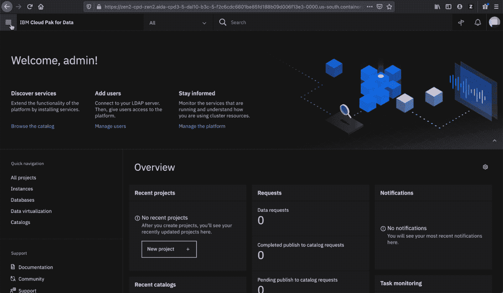
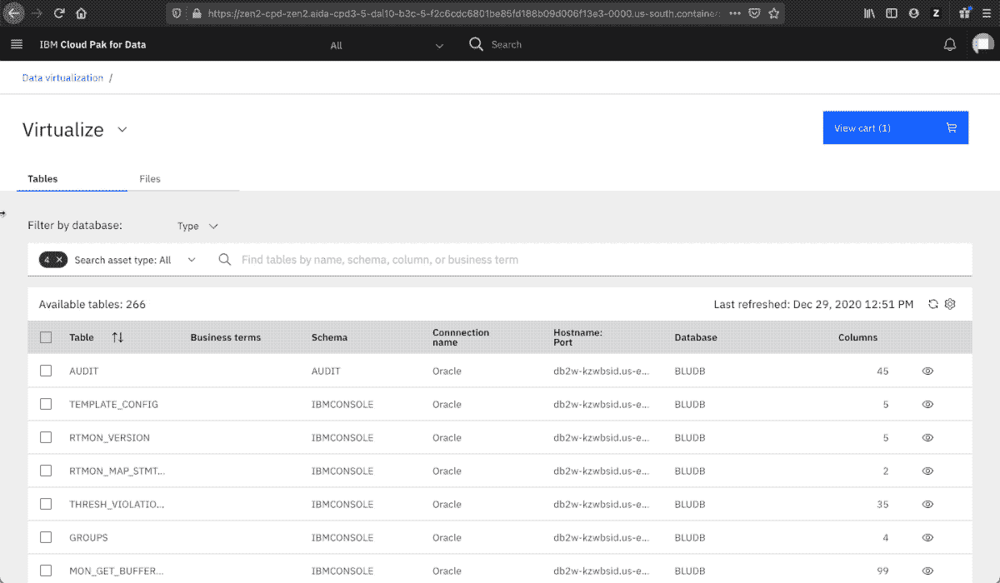
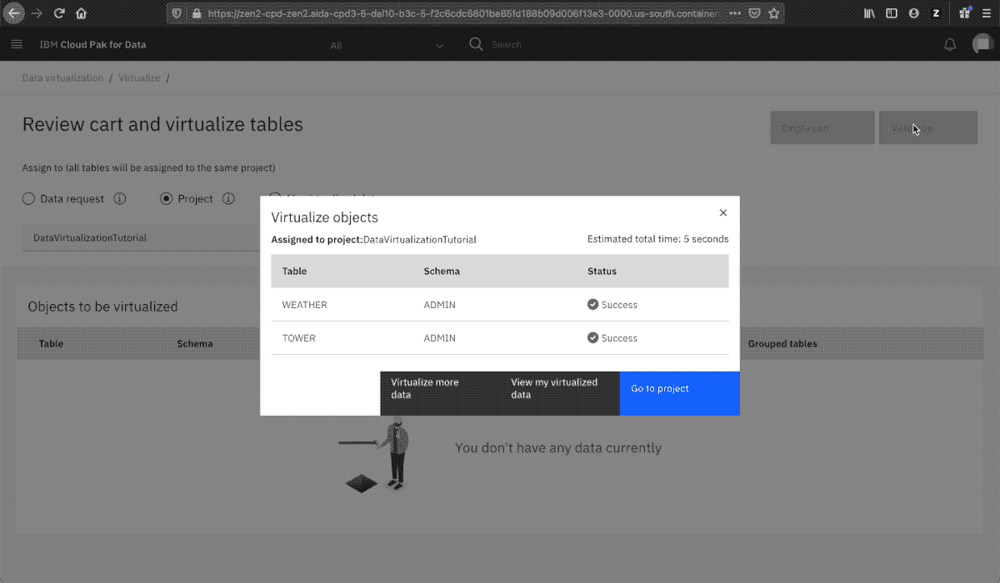
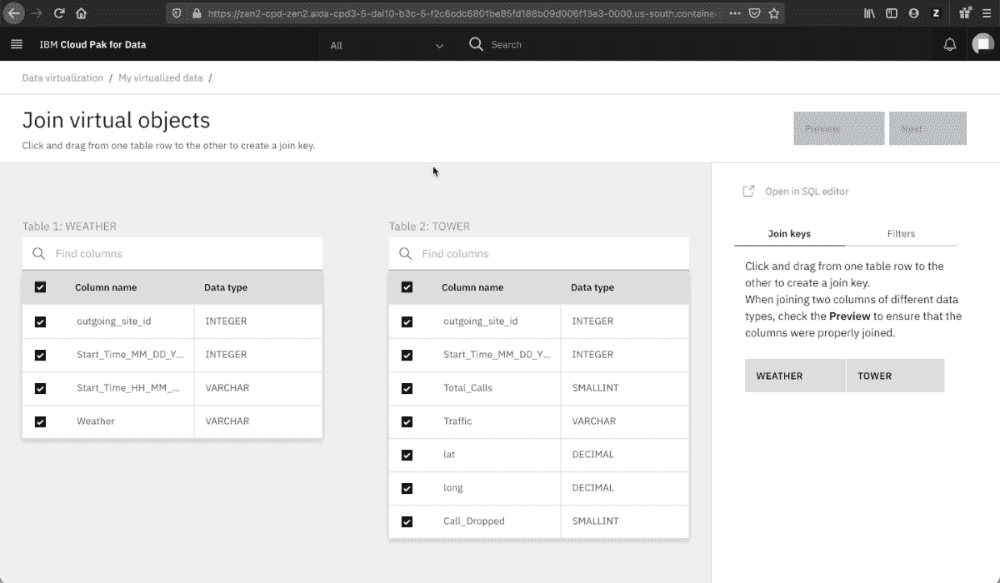
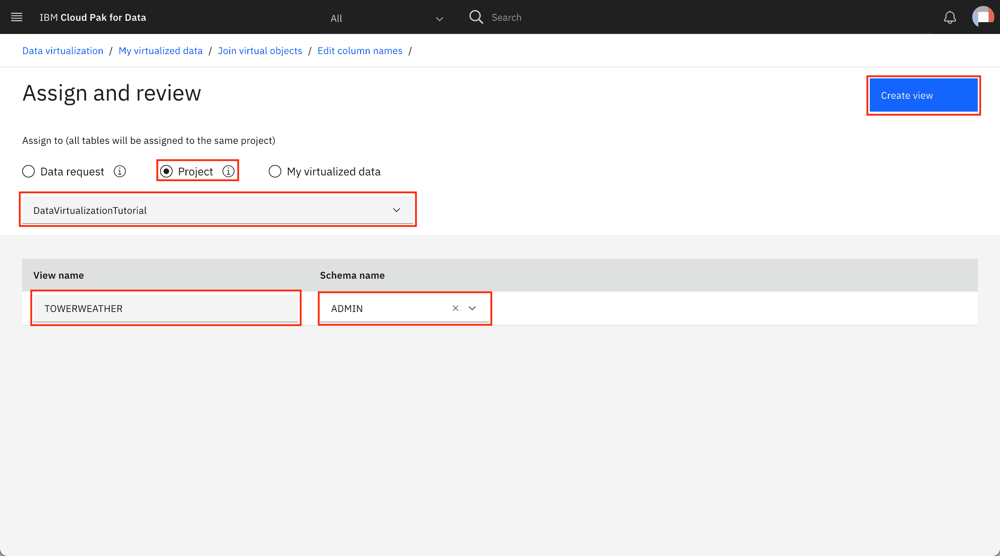
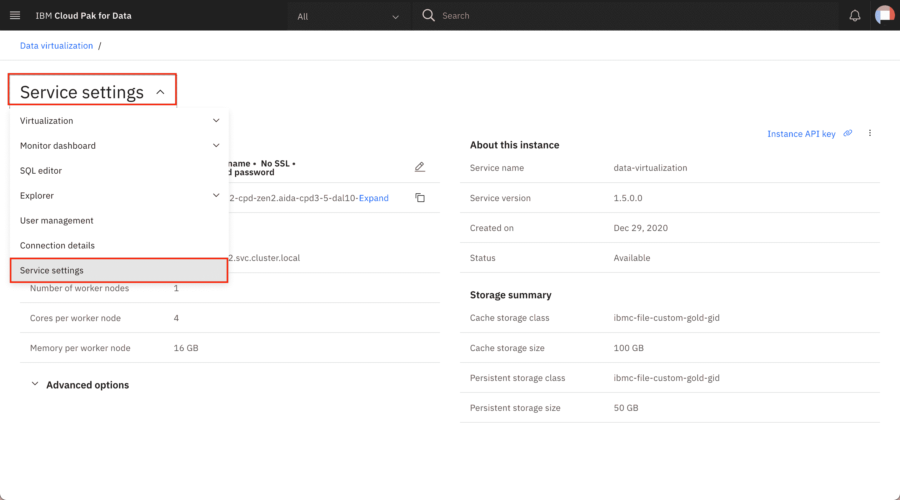
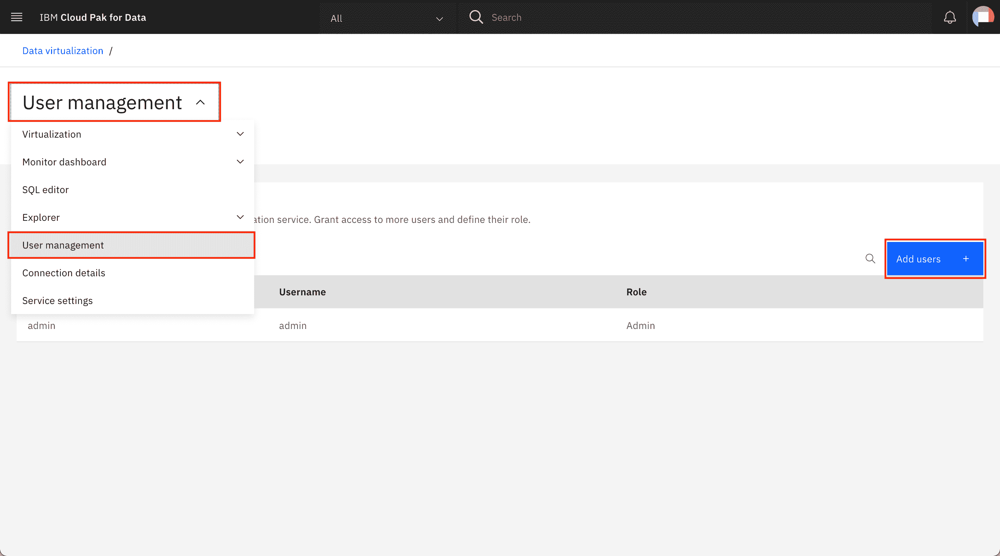
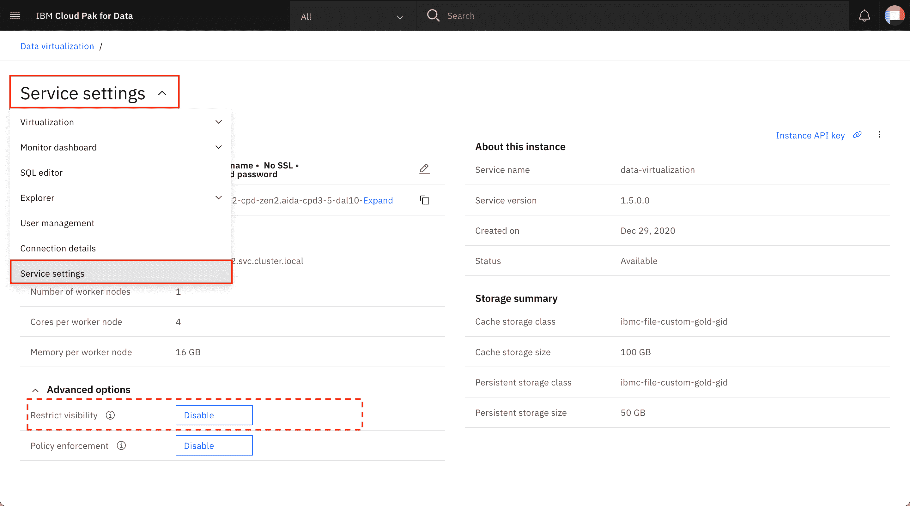

# 将多个分布式数据源作为一体进行查询：用于数据分析的数据虚拟化

> 原文：[`developer.ibm.com/zh/tutorials/query-across-distributed-data-sources-as-one-data-virtualization-for-data-analytics/`](https://developer.ibm.com/zh/tutorials/query-across-distributed-data-sources-as-one-data-virtualization-for-data-analytics/)

## 简介

本教程是使用 IBM Cloud Pak for Data、Data Virtualization、Watson OpenScale 和 Cognos Analyics 探索电信呼叫中断预测的系列教程的一部分。

| 级别 | 主题 | 类型 |
| --- | --- | --- |
| 101 | [在 IBM Cloud Pak for Data 上的 Cognos Analytics 中构建仪表板](https://www.ibm.com/developerworks/cn/analytics/library/build-dashboards-in-cognos-analytics-on-ibm-cloud-pak-for-data//index.html) | 教程 |
| 201 | [在 IBM Cloud Pak for Data 中使用 Watson OpenScale 监视机器学习模型](https://developer.ibm.com/cn/patterns/monitor-and-deploy-open-source-ml-models-with-wml-and-watson-openscale-on-icp4d) | Pattern |
| **201** | **[将多个分布式数据源作为一体进行查询：用于数据分析的数据虚拟化](https://www.ibm.com/developerworks/cn/analytics/library/query-across-distributed-data-sources-as-one-data-virtualization-for-data-analytics/index.html)** | **教程** |
| 301 | [使用 IBM Cloud Pak for Data 预测、管理和监视手机信号塔的呼叫中断](https://developer.ibm.com/cn/patterns/predict-manage-and-monitor-the-call-drops-of-cell-tower-using-cloud-pack-for-data/) | Pattern |

越来越多的大型企业需要对多个数据源执行有针对性的数据分析。将来自多个来源的数据整合在一起是一项艰巨的任务。数据虚拟化是一种现代化的数据整合方法。与需要复制数据的 ETL 解决方案不同，数据虚拟化会将数据留在源系统中，只是向数据使用者显示所有数据的整合视图。当业务用户深入研究报告时，数据虚拟化将从底层源系统中实时访存数据。数据虚拟化证明，连接到数据远胜于收集数据。

数据可以保存在多个数据集市中。而且，IBM Cloud Pak for Data 中的数据虚拟化可以无缝地进行数据整合。数据虚拟化可以连接到保存在任何位置的数据，并提供查看、访问、处理和分析数据的能力，而无需知道或了解数据的物理格式和位置。数据虚拟化会创建一些虚拟表来合并来自不同数据源的数据，并允许针对生成的虚拟表运行查询。

在本教程中，我们将演示如何使用 Amazon Web Services 上托管的 Oracle 数据库以及 IBM Cloud Db2 Warehouse 和 IBM Db2 on Cloud，针对各种数据源实现数据虚拟化。

## 学习目标

在完成本教程后，您将学会：

1.  数据虚拟化的概念。
2.  如何通过多个环境（Amazon Web Services、Azure、IBM Cloud 或本地）上托管的数据库来创建连接。
3.  如何通过合并来创建视图并将数据发布到当前项目。

## 前提条件

*   [已启用“数据虚拟化”附加组件的 IBM Cloud Pak for Data](https://docs-icpdata.mybluemix.net/docs/content/SSQNUZ_current/com.ibm.icpdata.doc/dv/install-dv-add-on.html)

*   两个或更多个数据库源。**注意：**在本教程中，我们将使用以下内容进行演示：

    *   [AWS Oracle 数据库](https://ap-south-1.console.aws.amazon.com/rds/home?region=ap-south-1#)

    *   [IBM Db2 on Cloud](https://cloud.ibm.com/catalog/services/db2?cm_sp=ibmdev-_-developer-tutorials-_-cloudreg)

## 预估时间

完成本教程大约需要 30 分钟。

## 步骤

### 第 1 步：为您的 IBM Cloud Pak for Data 实例添加数据连接

*   从您的 IBM Cloud Pak for Data 实例中，转至 `Virtualize Data` 选项卡。单击左上方的 `navigation menu > Collect Data > Virtualize Data`。
*   单击 `Add`，并为您的 IBM Cloud Pak for Data 实例添加一个新的数据库连接。

### 第 2 步：在 IBM Cloud Pak for Data 中将数据库连接添加为数据源

*   输入所需的连接名称，然后选择 `Connection Type`。在本教程中，我们使用 AWS 上的 Oracle 数据库和 Db2 on IBM Cloud 进行演示。

*   在选择数据库之后，输入该数据库的必需连接信息：Host、Port、Username 和 Password。

*   输入数据库凭证

*   单击 `Test Connection`。在成功之后，单击 `Save` 以保存该连接。

*   对另一个数据库重复以上步骤。在此例中为 Db2 on Cloud。

### 第 3 步：对数据进行虚拟化

*   选择要进行虚拟化的表。将根据来源对这些表进行过滤。例如，Oracle 数据库或 IBM 数据库。选中表名称对应的框，然后单击 `Add to Cart`。

*   在将表添加到购物车之后，单击 `View Cart`。将表分配给当前的工作项目，然后单击 `Virtualize`。

### 第 4 步：合并已虚拟化的数据

*   在对数据进行虚拟化之后，单击 `View My Data`。
*   您的数据将添加到 `My Data` 部分中，您的所有本地/已虚拟化的数据都位于此部分中。
*   通过选中表名称对应的框，从虚拟化列表中选择所需的表。然后，单击 `Join View`。

*   接下来，将为您提供 2 个表的模式视图。您可以通过拖放操作来表示主键和外键关系。然后单击 `Preview` 以查看合并方式。

**注意：**

1.  确保将主键拖到外键（仅限此方向），从而使合并生效。
2.  如果您想合并两个以上的表或执行其他类型的合并，请单击 `SQL Editor` 并编写 SQL 查询。唯一的要求是必须对查询中引用的数据进行虚拟化。

### 第 5 步：将视图分配给内部数据库和项目

*   在查看 `Preview` 之后，您可以保存通过单击 `Join` 来创建的视图。
*   为所创建的视图命名，单击 `next`，然后选择要在其中发布该视图的内部数据库模式。
*   将所创建的视图分配给您的项目，然后单击 `Create View`。

*   要访问已创建的虚拟化表，请转至 `Menu > Service Details`。您可以使用此页面中的凭证来访问 IBM Cloud Pak for Data 实例中的所有已合并的虚拟化视图。

**注意：**在分配给项目之前，请确保已创建一个新项目。

## 故障排除

*   如果用户登录无法访问数据虚拟化：转至 `Menu > Manage Users`。

*   单击 `Add User`，然后选择当前的用户登录详细信息。

*   如果无法预览合并结果或者未获取任何数据：
*   转至 `Menu > Service Details`
*   在 `Virtual object access control` 部分下，单击 `Disable`。

## 摘要

数据科学项目的典型流程始于对来自各种来源的数据进行汇总和挖掘。通过本教程，您可以为数据科学项目实现无缝的数据虚拟化，然后继续完成后续步骤。IBM Cloud Pak for Data 的数据虚拟化功能的主要优势是，能够无缝地合并来自任何数据源的数据库，从而提供一个简单易用的整合平台。

本文翻译自：[Query across distributed data sources as one: Data virtualization for data analytics](https://developer.ibm.com/technologies/analytics/tutorials/query-across-distributed-data-sources-as-one-data-virtualization-for-data-analytics)（2019-10-14）