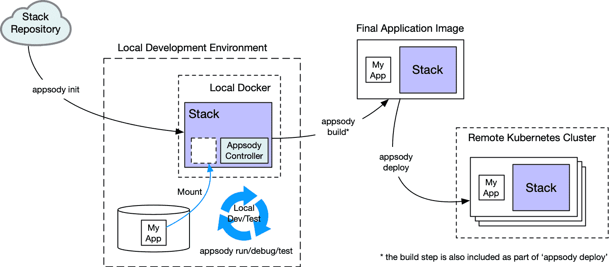

# Archived | 创建新的 Appsody 堆栈

> 原文：[`developer.ibm.com/zh/tutorials/create-appsody-stack/`](https://developer.ibm.com/zh/tutorials/create-appsody-stack/)

**本文已归档**

**归档日期：:** 2021-02-25

此内容不再被更新或维护。 内容是按“原样”提供。鉴于技术的快速发展，某些内容，步骤或插图可能已经改变。

[Appsody](https://appsody.dev) 是一个开源项目，可以简化云原生应用程序开发。Appsody 的主要组件是*堆栈*，它是包含一组预配置技术和配置的 Docker 镜像，可直接部署到云环境中。

堆栈支持*应用程序开发者*集中精力编写应用程序代码，而无需担心底层技术组件以及如何构建应用程序并将其部署到 Kubernetes 环境中。现已有多种公共堆栈可用，但*堆栈架构设计师*还可以为其自己的企业构建代表公司使用的技术和版本集的堆栈，也可以为选定的解决方案构建堆栈用于监视、日志记录、运行状况检查等。

本教程将指导您完成创建全新 Appsody 堆栈的步骤。了解作为堆栈架构设计师如何支持应用程序开发者根据您的堆栈来运行、构建和部署应用程序。

> 不确定是否需要创建新堆栈？阅读[自定义 Appsody 堆栈](http://www.ibm.com/developerworks/cn/cloud/library/create-appsody-stack/index.html)，了解您是否需要构建新堆栈、修改现有堆栈或者使用模板。

## 前提条件

开始执行本教材中的步骤前，您需要了解 Appsody 是什么及其如何工作。查看 [Appsody 文档](https://appsody.dev/docs/stacks/stacks-overview)，并阅读 Appsody 简介博客帖子，以了解相关基础知识。

要在本地工作站上构建和测试堆栈，请完成以下步骤：

*   [安装 Appsody CLI](https://appsody.dev/docs/getting-started/installation)。本教程需要 CLI V0.4.10 或更高版本。
*   [安装 Docker](https://docs.docker.com/get-started/)。本地 Docker 环境（如 Docker Desktop for Mac）也适用。

为了将应用程序部署到 Kubernetes 服务，您还需要具有集群访问权。

## 堆栈在开发流程中的角色

开发者使用堆栈来简化需要一组特定技术或开发模式的应用程序构建过程。虽然有多种公开可用的堆栈可供选择，但许多企业仍希望构建自己的一组堆栈，以满足他们对开发者构建云原生应用程序的方式的特定要求和标准。

在学习如何创建新的 Appsody 堆栈前，让我们来快速了解一下堆栈的设计需求。堆栈旨在通过快速本地开发模式或者构建并部署模式来为开发者提供支持。

### 快速本地开发模式

在此模式下，堆栈包含开发者在本地机器上构建新应用程序所需的一切，并且应用程序始终在本地容器化的 Docker 环境内运行。从应用程序开发流程开始时就引入容器化（而不是单独在本地机器的用户空间内进行开发）降低了在容器化过程中引入难以察觉的错误的可能性，并且开发者也无需安装其应用程序的核心技术组件。

在此模式下，堆栈需要将特定技术的所有依赖项预先构建到 Docker 镜像中，并且必须利用开发者为自己的代码显式添加的任何依赖项来动态补充这些依赖项。

Appsody 的快速本地开发模式由 Appsody CLI 组成，此 CLI 已根据需要连接到本地 IDE，并且与运行正在开发的应用程序的本地 Docker 容器进行通信。在此模式下，应用程序代码可保存在本地文件系统上，同时安装到 Docker 容器中，这样本地更改即可自动触发应用程序重新启动。

### 构建并部署模式

在此模式下，堆栈支持 Appsody CLI 构建自我容器化的 Docker 镜像，其中包含堆栈中的核心技术、应用程序代码以及这两者依赖项的组合。您可以采用手动方式或编程方式将生成的镜像部署到支持 Docker 镜像的任意平台（例如，本地或公共 Kubernetes 集群）。

下图展示了应用程序开发者如何使用堆栈：



以上开发流程展示了以手动方式部署到 Kubernetes 集群的过程。在更加以生产为主导的环境中，GitOps 可能会触发构建和部署步骤，而 Tekton Pipelines 将驱动部署。[Kabanero 集合](https://github.com/kabanero-io/collections/) 属于 [Cloud Pak for Applications](https://www.ibm.com/cn-zh/cloud/cloud-pak-for-applications) 的一部分，它将 Appsody 堆栈、GitOps 和 Tekton Pipelines 结合在一起，以提供企业就绪解决方案，用于云原生应用程序的开发和部署。

## 堆栈结构

由于单个 Appsody 堆栈即可支持快速的本地开发和构建并部署模式，因此所有堆栈都遵循标准结构。以下结构即表示堆栈的源结构：

```
my-stack
├── README.md
├── stack.yaml
├── image/
|   ├── config/
|   |   └── app-deploy.yaml
|   ├── project/
|   |   ├── [files that provide the technology components of the stack]
|   |   └── Dockerfile
│   ├── Dockerfile-stack
|   └── LICENSE
└── templates/
    ├── my-template-1/
    |       └── [example files as a starter for the application, e.g. "hello world"]
    └── my-template-2/
            └── [example files as a starter for a more complex application] 
```

作为*堆栈架构设计师*，您必须创建以上结构，将其构建到实际堆栈镜像中，以便（以您的堆栈作为其新应用程序基础的）*应用程序开发者*随时使用。作为堆栈架构设计师，您的任务之一是在自己的堆栈中包含一个或多个样本应用程序（称为*模板*），从而帮助应用程序开发者快速入门。

因此，构建堆栈时，将处理上述结构并为该堆栈生成一个 Docker 镜像，其中包含每个模板的 tar 文件，随后所有这些文件都将在本地或公共 Appsody 存储库中存储并进行引用。Appsody CLI 可以访问该存储库以使用此堆栈来启动本地开发。

## 创建一个新堆栈

要创建新堆栈，必须首先搭建上述结构的框架。堆栈分类为 `stable`、`incubating` 或 `experimental`。您可以[通过 Appsody 文档](https://appsody.dev/docs/stacks/stacks-overview)来阅读了解有关这些分类的更多信息。Appsody 实际上为您提供了两个不同的样本堆栈。第一个（位于 `samples/sample-stack` 中）样本堆栈仅提供堆栈结构和文件以供您填充。而第二个样本堆栈（位于 `incubator/starter` 中）也同样提供这些，此外还提供了一个最低限度正常运行的堆栈，可供您进行复制、运行和作为新堆栈的基础对其进行修改。

我们将在本教程中使用此第二个启动器堆栈。为了进一步简化操作，Appsody CLI 支持通过 `appsody stack create` 命令创建新堆栈，作为现有堆栈的副本。

> **注意：**一般情况下，Appsody 始终尝试首先在现有存储库中查找堆栈，然后在本地高速缓存中进行查找。对于正常的堆栈使用，这正是您想要的。但在创建新堆栈过程中，根据定义，现有存储库尚不知晓您的新堆栈。所以，在这种情况下，让 Appsody 首先查找本地高速缓存会更快。您可以通过设置以下环境变量来执行此操作：`export APPSODY_PULL_POLICY=IFNOTPRESENT`。

1.  运行 `appsody stack create` 命令来复制并重命名启动器堆栈，此命令会创建一个子目录，其中包含启动器堆栈。

    ```
     $ cd ~
     $ appsody stack create mystack --copy incubator/starter
     $ cd mystack
     $ ls - al
     total 16
     drwxr-xr-x  6 henrynash  staff  192 21 Oct 00:14 .
     drwxr-xr-x  3 henrynash  staff   96 21 Oct 00:14 ..
     -rw-r--r--  1 henrynash  staff  621 21 Oct 00:14 README.md
     drwxr-xr-x  7 henrynash  staff  224 21 Oct 00:14 image
     -rw-r--r--  1 henrynash  staff  297 21 Oct 00:14 stack.yaml
     drwxr-xr-x  3 henrynash  staff   96 21 Oct 00:14 templates 
    ```

    您复制的启动器样本堆栈并不只是一个框架。它实际上是一个可供构建并运行的堆栈。按设计，它的功能并不多，但它可在您对自己的 Appsody 堆栈构建环境进行更改之前，确保该环境正常运行。

2.  构建新堆栈

    构建（或*打包*）堆栈会创建堆栈镜像（一个 Docker 镜像），此堆栈镜像可供 Appsody CLI 用于使用该堆栈启动项目。在开始操作前，确保已设置 Docker 环境。我们建议设置本地 Docker 环境。

    在您复制的样本堆栈结构内有一个 Docker 文件 (`Dockerfile-stack`)。`appsody stack package` 命令可使用此文件来构建镜像。

    要通过这种方式构建您自己的新堆栈，可在 `stacks/mystack` 目录中输入：

    ```
     $ appsody stack package 
    ```

    这样会运行 Docker 构建，将 `mystack` 安装到本地 Appsody 存储库（名为 `dev.local`）中，并运行一些基本测试来确保此文件格式正确。

    构建完成后，检查此文件在本地存储库中是否可用：

    ```
     $ appsody list dev.local
     REPO             ID       VERSION         TEMPLATES       DESCRIPTION
     dev.local        mystack  0.1.0           *simple         sample stack to help... 
    ```

3.  使样本堆栈正常运行

    到目前为止，您已履行了自己作为堆栈架构设计师的职责，构建并安装了自己的样本堆栈的副本。现在是时候以应用程序开发者身份来试用此堆栈了。

    创建新目录，并利用此新 Appsody 堆栈来将其初始化：

    ```
     $ mkdir ~/test
     $ cd ~/test
     $ appsody init dev.local/mystack 
    ```

    以上代码用于基于 `mystack` 中的默认模板设置了一个应用程序开发文件夹，现在此文件夹可供您检查：

    ```
     $ ls -al
     drwxr-xr-x   6 henrynash  staff   192 14 Sep 19:52 .
     drwxr-xr-x  41 henrynash  staff  1312 14 Sep 19:52 ..
     -rw-r--r--   1 henrynash  staff    27 14 Sep 19:52 .appsody-config.yaml
     drwxr-xr-x   3 henrynash  staff    96 14 Sep 19:52 .vscode
     -rw-r--r--   1 henrynash  staff    26 14 Sep 19:52 hello.sh
     drwxr-xr-x   3 henrynash  staff    96 14 Sep 19:52 tests 
    ```

    `.appsody-config.yaml` 文件指向堆栈，而 `hello.sh` 则是启动器应用程序。启动器应用程序非常简单，仅以一行文本 “Hello from Appsody!” 作为回应。

    使用 `appsody run` 在容器环境中运行启动器应用程序。

    如下所示，简单堆栈在 Docker 环境内运行的容器中成功执行了简单的 hello.sh。

    ```
     $ appsody run
     Running development environment...
     Running command: docker[pull appsody/mystack:0.1]
     Using local cache for image appsody/mystack:0.1
     Running docker command: docker[run --rm -p 8080:8080 --name test20-dev -v /Users/henrynash/codewind-workspace/test20/:/project/userapp -v test20-deps:/project/deps -v /Users/henrynash/.appsody/appsody-controller:/appsody/appsody-controller -t --entrypoint /appsody/appsody-controller appsody/mystack:0.1 --mode=run]
     [Container] Running: /bin/bash /project/userapp/hello.sh
     [Container] Hello from Appsody! 
    ```

## 创建定制堆栈

现在您已完成了环境设置并且您的样本堆栈已正常运行，这样您就能够以一名真正的堆栈架构设计师的身份来修改 `mystack` 以创建您真正想要的堆栈了。

创建新堆栈前，需要考虑几件事：

*   需要在自己的堆栈中安装哪些技术组合？如何确保所有依赖项都已安装？
*   要向使用您的堆栈的应用程序开发者提供何种类型的样本启动器应用程序？
*   如何确保应用程序开发者可以在构建自己的应用程序的过程中安装所需的任何其他依赖项？

在本教程中，我们将向您展示如何创建堆栈以支持应用程序开发者基于 Python HTTP Server 创建并部署应用程序。

我们来回答上述问题：我们将 Python 堆栈配置为使用热门的 Python Web 框架 Flask。我们使用 Python 打包工具 `pipenv` 来安装技术和所有依赖项。对于启动器应用程序，我们将提供一个简单的“Hello World”应用程序，它将以 URL `/hello` 来响应。

让我们来看看需要执行的步骤的概述，然后我们将逐一执行并深入讲解这些步骤。

1.  **修改堆栈镜像的 Docker 文件**： 堆栈实际包含两个 Docker 文件。第一个文件 `Dockerfile-stack` 位于堆栈源结构的 `mystack/image` 目录中。Docker 使用此 `Dockerfile-stack` 文件来构建堆栈本身的镜像以供 Appsody CLI 使用。在此步骤中，您将选择基础镜像，包含用于安装 Flask 的 `pipenv` 命令，完成 Appsody docker 环境变量的相应设置，并设置所需的所有相关端口。
2.  **决定堆栈中组件的架构与开发者的应用程序进行交互的方式**：考虑是否有服务器进程进行控制，或者开发人员的应用程序进行控制。 实际上，如果您编写的是常规 Docker 容器，那么入口点是什么？在这种情况下，由 Flask 应用程序进行控制。为最大程度减少应用程序开发者需要编写的代码量，我们采用的架构支持使用此堆栈的开发者只需提供其应用程序所需的任意 URL 入口点即可。我们将使入口点成为我们作为堆栈一部分提供的服务器代码。
3.  **在模板目录中编写样本 Hello World 应用程序**：正如前文所述，Flask 将管理 Web 环境，并确保使用此堆栈的开发者只需为其公开的任意端点提供代码即可。在这些步骤中，您将创建单个 Python 文件，其中包含您的 `/hello` 端点。使用您的堆栈的应用程序开发者可以利用此文件，将其扩展为包含其实际应用程序中的所有端点。
4.  **修改最终应用程序镜像的 Docker 文件**： Docker 使用位于堆栈源结构的 `mystack/image/project` 目录中的第二个 Docker 文件 (`Dockerfile`) 来构建最终应用程序镜像。此应用程序镜像包含来自堆栈的所有内容以及开发者编写的应用程序。此构建由 Appsody CLI `build` 和 `deploy` 命令来执行。此 Docker 文件负责确保在此最终镜像内安装组合的依赖项。

现在您已经大致了解了这些步骤，接下来我们来详细查看其中每个步骤。

### 修改堆栈镜像的 Docker 文件

您将使用此文件作为要更改的 Docker 文件的基础。此文件已配置多个与样本堆栈结构相符的 Appsody 环境变量，这样您就无需从头开始了。

下一步，让我们对新堆栈所需的 `mystack` 中的 `mystack/image/Dockerfile-stack` 进行更改。

1.  首先，您需要选中基础镜像。

    标准 Docker Python 镜像是一个合格的基础镜像，因此，将当前所选 RedHat 镜像（由文件顶部的 `FROM` 标签定义）替换为：`FROM python:3.7`

2.  修改相应的 Appsody 环境变量

    正如样本堆栈中所示，其中包含大量可能的变量。为了在应用程序中直接运行新堆栈，您只需更改控制 `appsody run` 操作方式的一组三个变量。

    由于样本堆栈不挑剔所采用技术，因此用于应用程序的示例只是一个 shell 脚本。因此，在样本堆栈中，这些变量如下所示：

    ```
     ENV APPSODY_RUN="/bin/bash /project/userapp/hello.sh"
     ENV APPSODY_RUN_ON_CHANGE=$APPSODY_RUN
     ENV APPSODY_RUN_KILL=false 
    ```

    要为堆栈更新这些变量，您需要更新 `APPSODY_RUN` 环境变量，因为在快速本地开发模式下运行时，只要您发出 `appsody run` 命令，Appsody 就会将控制权转交给该变量。通常，此命令即您手动运行自己的主技术服务时，用于执行该服务的任意命令。对于 Flask，此命令为

    ```
     ENV APPSODY_RUN="python -m flask run --host=0.0.0.0 --port=8080" 
    ```

    在快速本地开发模式下，在开发者的应用程序目录中检测到源文件更改时，即可重新启动您的应用程序；它并不会等待 git commit 命令，而是通过直接监控要更改的文件来确认。如果您需要在重新启动时执行任何特殊操作，那么用于重新启动应用程序的命令会保留在其自己的环境变量 (`APPSODY_RUN_ON_CHANGE`) 中。但对于 Flask 无需执行任何特殊操作，因此这部分保持不变。

    您可以使用 `APPSODY_RUN_KILL` 来确定 Appsody 是否需要强制终止当前运行的进程。由于样本堆栈实际上仅运行一次性脚本，因此它设置为 `false`。对于您的新堆栈，您需要 Appsody 终止现有 Flask 进程，因此将其设置为 `true`：

    ```
     ENV APPSODY_RUN_KILL=true 
    ```

    因此我们的 `appsody run` 环境变量现在看上去是这样的：

    ```
     ENV APPSODY_RUN="python -m flask run --host=0.0.0.0 --port=8080"
     ENV APPSODY_RUN_ON_CHANGE=$APPSODY_RUN
     ENV APPSODY_RUN_KILL=true 
    ```

    最后，使用 `APPSODY_WATCH_REGEX` 变量以告知 Appsody 要监控哪些文件，以确认其中是否发生将导致应用程序重新运行的相关更改。

    对于 Python 堆栈，我们可将其设置为以 `.py` 结尾的任意文件。

    ```
     ENV APPSODY_WATCH_REGEX="^.*.py$" 
    ```

    在本教程后面的部分中，我们将回到此处来更新其他环境变量。您可以在 [Appsody 文档](https://appsody.dev/docs/stacks/environment-variables)中找到所有相关参考资料。

3.  确保 Flask 模块和所有依赖项均已安装

    鉴于环境变量已设置完成，您需要确保 Flask 模块和所有依赖项均已安装。在我们的示例中，我们使用 `pipenv` 来帮助构建依赖项列表，然后使用 `pip` 来将这些依赖项安装到依赖项目录中。随后，我们设置 Python 路径以提取这些依赖项。

    如果您不熟悉 Python 中的依赖项，无须担心。这里的学习重点是您需要在 Docker 文件中提供一些代码，以便用于安装您所需的任意技术组件及其依赖项。

    最后一步是将入口点（即我们在下一步中编写的服务器代码）告诉 Flask。

    要执行上述所有操作，可将以下内容添加到 `Dockerfile-stack` 中，通常可将其置于文件末尾的 `WORKDIR` 之后：

    ```
     RUN pip install pipenv
     RUN pipenv install flask
     RUN pipenv lock -r > requirements.txt
     RUN python -m pip install -r requirements.txt -t /project/deps
     ENV PYTHONPATH=/project/deps
     ENV FLASK_APP=/project/server/__init__.py 
    ```

保存对 `Dockerfile-stack` 的更改。

### 提供将支持开发者应用程序的架构的服务器端

现在您的 Docker 文件已修复，您需要提供以上引用的服务器入口点。为清楚起见，最好使用 `mystack/project` 目录的子目录来保存您的服务器代码。在该子目录中，创建包含服务器的文件。例如，将当前目录设置为 `mystack`：

```
$ mkdir project/server
$ cat <<EOF > project/server/__init__.py
from flask import Flask

app = Flask(__name__)

from userapp import *
EOF 
```

此代码将启动 Flask 应用程序 (`app`) 然后导入用户编写的任意 Python 文件，使其成为服务器的一部分。服务器端要做的就是这些！

### 在模板目录中编写样本 Hello World 应用程序

现在可以创建一个仅响应单一 URL 端点的样本应用程序了。堆栈可以有任意数量的模板（每个模板在 `templates` 中均表示为一个目录）。这些模板可以表示开发者可以使用特定堆栈构建的不同类型的应用程序。

您复制的样本堆栈具有一个名为 `simple` 的模板。正如您首次运行样本堆栈时所见，在此模板中包含一个简单的“应用程序”，即 `hello.sh` 脚本。

对于我们的自定义脚本，我们在 `mystack/templates/simple` 目录中创建一个简单的 Python 应用程序：

```
$ cat <<EOF > templates/simple/__init__.py
from server import app

@app.route('/hello')
def HelloWorld():
    return 'Hello from Appsody!'
EOF 
```

### 构建和运行新堆栈

现在，您已经获得了新的 Python/Flask 堆栈所需的最低限度支持。现在让我们来试一试吧。

1.  作为堆栈架构设计师，您可以在 `stacks/mystack` 目录中使用与之前相同的堆栈打包命令来构建自己的样本堆栈镜像：

    ```
     $ appsody stack package 
    ```

    成功完成构建后，就可以运行了。

2.  现在，作为使用堆栈的应用程序开发者，创建新目录并使用 Appsody 重新初始化。例如：

    ```
     $ mkdir ~/myapp
     $ cd ~/myapp
     $ appsody init dev.local/mystack 
    ```

    这样您应该就可以看到自己的新 Hello World 了！Python 应用程序已安装：

    ```
     $ ls -al
     drwxr-xr-x   9 henrynash  staff   288 16 Sep 0:22 .
     drwxr-xr-x  43 henrynash  staff  1376 16 Sep 0:00 ..
     -rw-r--r--   1 henrynash  staff    27 16 Sep 0:00 .appsody-config.yaml
     drwxr-xr-x   3 henrynash  staff    96 16 Sep 0:00 .vscode
     -rw-r--r--   1 henrynash  staff    96 16 Sep 00:00 __init__.py
     -rw-r--r--   1 henrynash  staff    26 16 Sep 00:00 hello.sh
     drwxr-xr-x   3 henrynash  staff    96 16 Sep 0:00 tests 
    ```

    > **注意**：原始 `hello.sh` 仍在，因为尚未从堆栈中将其删除，并且由于我们尚未在 Flask 服务器的 `TEST` 和 `DEBUG` 选项中连接，这不要紧，因为这些工具仍会引用它。添加上述内容后，即可移除 `hello.sh`。

3.  现在，使用 `appsody run` 运行您的应用和堆栈：

    ```
     $ appsody run
     Running development environment...
     Using local cache for image appsody/mystack:0.1
     Running docker command: docker[run --rm -p 8080:8080 --name myapp-dev -v /Users/henrynash/codewind-workspace/myapp.   /:/project/userapp -v myapp-deps:/project/deps -v /Users/henrynash/.appsody/appsody-controller:/appsody/appsody-controller -t     --entrypoint /appsody/appsody-controller appsody/mystack:0.1 --mode=run]
     [Container] Running: python -m flask run --host=0.0.0.0 --port=8080
     [Container]  * Serving Flask app "/project/server/__init__.py"
     [Container]  * Environment: production
     [Container]    WARNING: This is a development server.Do not use it in a production deployment.
     [Container]    Use a production WSGI server instead.
     [Container]  * Debug mode: off
     [Container]  * Running on http://0.0.0.0:8080/ (Press CTRL+C to quit) 
    ```

    可以看到，现在 Flask 正在运行应用程序。如果您访问已发布的端点，就会得到如下响应：

    ```
     $ curl http://0.0.0.0:8080/hello
     Hello from Appsody! 
    ```

4.  如果您对自己的 hello world 应用程序执行了更改，那么还会注意到 Appsody 将重新启动服务器。例如，如果编辑 `myapp` 目录中的 `__init__.py` 以将 `/hello` URL 的消息响应更改为“Hello again from Appsody!”，然后保存此文件。您应该可以看到 Flask 服务器自动重新启动。如果再次访问该端点，那么应该就可以看到更新后的消息：

    ```
     $ curl http://0.0.0.0:8080/hello
     Hello again from Appsody! 
    ```

您的新堆栈现在正在快速本地开发模式下运行。使用您的堆栈的开发者现在可以构建其自己的应用程序，并且他们的更改将实时反映在其容器内以供测试。

鉴于基本堆栈已正常运行，接下来让我们利用实现完整解决方案所需的更改扩充堆栈，即：

*   支持快速本地开发模式的 TEST 和 DEBUG 阶段
*   支持包含来自开发者应用程序的依赖项
*   支持 appsody 构建和部署
*   作为本教程的后续提供未来改进建议

## 添加对快速本地开发模式的 DEBUG 和 TEST 阶段的支持

您已经为 `appsody run` 配置了环境变量。现在您需要为 `appsody debug` 和 `appsody test` 填充等效变量。

### 支持 DEBUG 阶段

类似于 `run` 模式的三个变量，针对 `debug` 模式同样存在等效的变量。在样本堆栈中，这些变量如下所示：

```
ENV APPSODY_DEBUG="echo -n \"Debugging \"; /bin/bash /project/userapp/hello.sh"
ENV APPSODY_DEBUG_ON_CHANGE=$APPSODY_DEBUG
ENV APPSODY_DEBUG_KILL=false 
```

对于 Flask 堆栈，让我们以调试模式启动 Flask，这将为我们提供额外的错误诊断功能。为此：

1.  将 FLASK_ENV 环境变量设置为 development。
2.  您无需对 APPSODY_DEBUG_ON_CHANGE 进行任何更改（与 `run` 的情况类似）。
3.  将 APPSODY_DEBUG_KILL 设置为 true。

完成上述更改后，三个调试变量应如下所示：

```
ENV APPSODY_DEBUG="FLASK_ENV=development python -m flask run --host=0.0.0.0 --port=8080"
ENV APPSODY_DEBUG_ON_CHANGE=$APPSODY_DEBUG
ENV APPSODY_DEBUG_KILL=true 
```

现在，您应该从 `stacks/mystack` 目录重新构建堆栈：

```
$ appsody stack package 
```

现在，运行 `appsody debug`，这样即可看到 Flask 以调试程序模式启动：

```
$ cd ~myapp
$ appsody debug
Running debug environment
Using local cache for image appsody/mystack:0.1
Running docker command: docker[run --rm -p 8080:8080 --name myapp-dev -v /Users/henrynash/codewind-workspace/myapp/:/project/userapp -v myapp-deps:/project/deps -v /Users/henrynash/.appsody/appsody-controller:/appsody/appsody-controller -t --entrypoint /appsody/appsody-controller appsody/mystack:0.1 --mode=debug]
[Container] Running: FLASK_ENV=development python -m flask run --host=0.0.0.0 --port=8080
[Container]  * Serving Flask app "/project/server/__init__.py" (lazy loading)
[Container]  * Environment: development
[Container]  * Debug mode: on
[Container]  * Running on http://0.0.0.0:8080/ (Press CTRL+C to quit)
[Container]  * Restarting with stat
[Container]  * Debugger is active!
[Container]  * Debugger PIN: 131-015-677 
```

如果要查看 Flask 调试程序模式的实际运行，可以在 `myapp` 的 `__init__.py` 中引入一个错误，然后从浏览器访问端点 [`0.0.0.0:8080/hello`](http://0.0.0.0:8080/hello)。这样即可看到显示的调试程序信息。

### 支持 TEST 阶段

Appsody 的 `test` 模式支持执行开发者为其应用程序编写的单元测试。实际测试特定于堆栈，并且通常启动单元测试框架（例如，Python 中的 `unittest`）。我们将使用此步骤来编写简单的功能测试，以访问 `/hello` 端点并检查返回的数据。

我们将通过在 `mystack/templates/simple/tests` 目录中创建文件来执行此操作。例如，从 `mystack` 目录中执行以下操作：

```
$ cat <<EOF > templates/simple/tests/test.py
from server import app
import unittest

class ServerTestCase(unittest.TestCase):

    def setUp(self):
        # create a test client
        self.app = app.test_client()
        self.app.testing = True

    def test_hello_endpoint(self):
        result = self.app.get('/hello')
        assert b'Hello' in result.data

if __name__ == '__main__':
    unittest.main()
EOF 
```

现在，我们将更新 `Dockerfile-stack` 中的 `APPSODY_TEST` 变量以运行此单元测试：

```
ENV APPSODY_TEST="python -m unittest discover -s /project/userapp/tests -p *.py"
ENV APPSODY_TEST_ON_CHANGE=$APPSODY_TEST
ENV APPSODY_TEST_KILL=true 
```

如果您重新构建堆栈、创建新应用程序目录（删除原目录），重新初始化并运行 `appsody test`，那么运行测试后您将看到 Flask 服务器正常运行：

```
$ cd ~
$ rm -r myapp
$ mkdir myapp
$ cd myapp
$ appsody init dev.local/mystack
$ appsody test
Running test environment
Using local cache for image appsody/mystack:0.1
Running docker command: docker[run --rm -p 8080:8080 --name myapp-dev -v /Users/henrynash/codewind-workspace/myapp/:/project/userapp -v myapp-deps:/project/deps -v /Users/henrynash/.appsody/appsody-controller:/appsody/appsody-controller -t --entrypoint /appsody/appsody-controller appsody/mystack:0.1 --mode=test]
[Container] Running command:  python -m unittest discover -s /project/userapp/tests -p *.py
[Container] .
[Container] ----------------------------------------------------------------------
[Container] Ran 1 test in 0.006s
[Container]
[Container] OK 
```

由于我们也设置了 `APPSODY_TEST_ON_CHANGE`，所以每次更改一个文件时，测试都会重新运行。您可以看到如何使用此类设置来操作测试定义优先 (test-definition-first) 的方法。

## 添加对包含来自开发者应用程序的依赖项的支持

应用程序开发者需要为其代码添加其他依赖项，并且在 Appsody 运行时自动包含这些依赖项，而无需实际对堆栈本身进行修改。

`APPSODY_PREP` Docker 变量旨在支持堆栈开发者为应用程序开发者提供路径，用于添加他们的依赖项。Appsody 先执行该变量，然后再执行其他任一命令（例如，`APPSODY_RUN`、`APPSODY_DEBUG` 或 `APPSODY_TEST`）。您需要编写一系列命令，以便针对开发者应用程序将所有新依赖项都添加到 `APPSODY_PREP` 中。

> **注意**：`APPSODY_PREP` 原先称为 `APPSODY_INSTALL`，该名称现已弃用（您可能会在旧堆栈中看到此名称）。

就像您先前添加到 Dockerfile 堆栈中的依赖项包含代码一样，您实际使用的依赖项管理系统特定于堆栈（例如，对于 Java，使用 `maven`）。

对于 Python，我们将继续使用 `pipenv`。对于 `pipenv`，您可以在命令行上为其提供一个程序包，或者它将在当前目录中查找 `Pipfile`。`Pipfile` 会列示需要安装的程序包及其所有依赖项。

```
ENV APPSODY_PREP="cd /project/userapp; pipenv lock -r > requirements.txt; python -m pip install --upgrade -r requirements.txt -t /project/deps" 
```

以上代码行支持应用程序开发者在其应用程序目录中提供一个 `Pipfile`，而 `pipenv` 会将这些依赖项添加到 `/project/deps`（针对堆栈本身中的所有组件已填充此目录，参阅本教程前文）中的一组程序包内。因此，每次运行 Appsody 时，它都会执行以上检查以确认是否已添加任何新依赖项。

更新 `APPSODY_PREP` 命令后，需要重新构建堆栈，此堆栈现已准备就绪，可将开发者应用程序中定义的任何依赖项添加到其中。

让我们来试一试此功能。作为示例，我们将在应用程序代码中演示一些精妙的操作，其中将使用一个专家库，即 Python 程序包 `dateutil`（默认情况下，python 不随附此程序包）。首先，在 `myapp` 目录中更新您的 hello world 样本代码以供使用。例如：

```
from server import app
from datetime import *
from dateutil.relativedelta import *

@app.route('/hello')
def HelloWorld():
    lastFriday = date.today() + relativedelta(day=31, weekday=FR(-1))
    return 'Hello from Appsody, last Friday of this month is: ' + str(lastFriday) 
```

如果执行以上操作（无需重新构建堆栈）并尝试 `appsody run`，那么它将失败（因为尚未安装 `dateutil`）。

因此，在 `myapp` 中添加 `Pipfile`，以添加此依赖项：

```
$ cat <<EOF > Pipfile
[[source]]
name = "pypi"
url = "https://pypi.org/simple"
verify_ssl = true

[packages]
python-dateutil = "*"
EOF 
```

执行 `appsody run` 时，服务器应显示为正常运行。如果现在访问 `/hello` 端点，应可看到如下结果：

```
$ curl http://0.0.0.0:8080/hello
Hello from Appsody, last Friday of this month is: 2019-09-27 
```

您已经成功支持开发者将他们自己的程序包和任何依赖项包含到他们的应用程序中，且无需修改堆栈。

谨记，虽然此教程使用 Python 和 pipenv，但您仍需使用适合堆栈的技术基础的程序包来管理工具。但原则是相同的： 支持开发者包含依赖项，并且可供堆栈动态提取这些依赖项，而无需重新构建堆栈。

### 高速缓存已安装的依赖项

有一个可能还不明显的巧妙功能，即 Appsody 提供在两次运行间隙高速缓存所有已安装的依赖项的功能（以加速两次运行期间的循环时间）。Appsody 通过创建 Docker 卷并将该卷安装到由 `appsody run/debug/test` 创建的运行时环境中来实现该功能。Docker 卷独立于任何容器实例。

在我们的样本堆栈中，已通过 `Dockerfile-stack` 中的现有代码行来完成此配置：

```
ENV APPSODY_DEPS=/project/deps 
```

我们添加到 `Dockerfile-stack` 中的 Docker 命令会将其正在安装的所有程序包都放置到 `/project/deps` 中。事件的实际顺序为：

1.  构建堆栈时，您添加到 `Dockerfile-stack` 中的命令会将这组程序包（及其依赖项）写入 `/project/deps`。
2.  运行 `appsody run/debug/test` 时，它会要求 Docker 创建一个名为 `{project_name}-dev` 的卷（例如，对于我们的项目，它名为 `myapp-dev`），并将该卷映射到 `APPSODY_DEPS` 中设置的任何对象。Docker 卷语义表示由于堆栈镜像中已存在 `/project/deps`，因此将使用其内容来初始化该卷。
3.  后续写入 `/project/deps`（即，添加 APPSODY_PREP 中定义的开发者应用程序中创建的任意依赖项）将更新该*卷*（这样其内容即可对后续运行可见），但不会影响 `/project/deps` 的底层堆栈目录。由此，未来的 `appsody build/deploy` 命令可以通过从堆栈镜像访问 `/project/deps` 来单独引用堆栈的依赖项（我们将在下一部分中看到）

## 添加对 appsody 构建和 appsody 部署的支持

有时应用程序开发者希望脱离快速本地开发模式，实际将其完成的应用程序（作为包含其代码和来自堆栈的代码的单一镜像）构建并部署到 Docker/Kubernetes 环境中。要做到这一点，堆栈还需要包含：

*   第二个 Dockerfile，以供 Appsody 用于构建此组合镜像
*   一个部署清单模板，以供 Appsody 用于部署镜像

### 支持 appsody 构建

为支持构建独立最终镜像，您需要向自己的堆栈添加 Dockerfile。在查看此 Dockerfile 的内容前，让我们来详细了解下 Appsody 构建流程的工作方式。

发出 `appsody build` 命令时，它会执行下列操作：

*   将文件系统内容从堆栈镜像提取到本地位置（通常为 `~/.appsody/extract/{project_name}-dev`）
*   在此基础上，将开发者应用程序解压到匹配 `APPSODY_MOUNTS` 的目录中（在此处示例中为 `/project/userapp`）
*   使用 `/project` 中的 Dockerfile，在此解压目录结构上执行 Docker 构建

为便于参考，在完成前两个步骤后并且 Appsody 即将使用 Docker 时，提取的结构如下所示：

```
$ ls -al ~/.appsody/extract/myapp
total 48
drwxr-xr-x  10 henrynash  staff   320 20 Sep 22:55 .
drwxr-xr-x  19 henrynash  staff   608 20 Sep 22:55 ..
-rw-r--r--   1 henrynash  staff    32 13 Sep 17:38 .dockerignore
-rw-r--r--   1 henrynash  staff   578 20 Sep 10:49 Dockerfile
-rw-r--r--   1 henrynash  staff   150 20 Sep 10:50 Pipfile
-rw-r--r--   1 henrynash  staff  4566 20 Sep 10:50 Pipfile.lock
drwxr-xr-x  15 henrynash  staff   480 20 Sep 10:50 deps
-rw-r--r--   1 henrynash  staff   121 20 Sep 10:50 requirements.txt
drwxr-xr-x   3 henrynash  staff    96 16 Sep 14:54 server
drwxr-xr-x   8 henrynash  staff   256 20 Sep 22:55 userapp 
```

谨记，`deps` 目录包含堆栈本身的依赖项（不包括开发者应用程序添加的依赖项），并且应用程序目录（在此处示例中为 `myapp`）的内容位于 `userapp`。

根据上面的内容，显而易见，我们需要在最终应用程序镜像的 Dockerfile 中进行写入。

样本堆栈已包含一个镜像的基础内容（它存在于堆栈源结构的 `mystack/image/project` 中），如下所示：

```
FROM registry.access.redhat.com/ubi7/ubi

WORKDIR /project

COPY ../

EXPOSE 8080

CMD ["/bin/bash",  "/project/userapp/hello.sh"] 
```

将其修改为：

*   添加开发者应用程序所需的所有依赖项（基本上与 `Dockerfile-stack` 中的 `APPSODY_PREP` 中所使用的命令相同）
*   设置 Python 路径和 `FLASK_APP` 变量（同样与 `Dockerfile-stack` 中的过程类似）
*   将控制权直接转交给服务器应用程序。appsody 控制器不包含在最终应用程序镜像中

对 `Dockerfile` 进行的上述更改结果应如下所示：

```
FROM python:3.7

RUN pip install pipenv

WORKDIR /project
COPY ../

WORKDIR /project/userapp
RUN pipenv lock -r > requirements.txt
RUN python -m pip install --upgrade -r requirements.txt -t /project/deps
WORKDIR /project

ENV PYTHONPATH=/project/deps
ENV FLASK_APP=server/__init__.py

EXPOSE 8080
CMD ["python", "-m", "flask", "run", "--host=0.0.0.0", "--port=8080"] 
```

如果您现在利用这些更改重新构建堆栈，然后，以应用程序开发者身份在应用程序目录 (`myapp`) 中执行 `appsody build`，那么最终将构建完成名为 `myapp` 的 Docker 镜像。这是您的独立镜像，其中包含您的应用程序和堆栈！现在让我们来试一试吧。由于这是一个常规镜像，您只需在自己的本地 Docker 环境中运行即可（确保映射已公开的端口），即：

```
$ docker run -p 8080:8080 myapp
Serving Flask app "server/__init__.py"
Environment: production
WARNING: This is a development server.Do not use it in a production deployment.
Use a production WSGI server instead.
Debug mode: off
Running on http://0.0.0.0:8080/ (Press CTRL+C to quit) 
```

就像之前一样，访问所选端点 [`0.0.0.0:8080/hello`](http://0.0.0.0:8080/hello) 即可得到一如既往的响应。现在，您已构建了完整的镜像，您可将其部署到任意 Docker 或 Kubernetes 平台中。

### 支持 appsody 部署

为帮助完成最终部署阶段，Appsody 允许您以堆栈架构设计师的身份提供一份部署清单，以供 Appsody 用作为部署最终应用程序镜像的模板。

默认模板使用 Appsody Operator，如果它不存在，那么 Appsody CLI 会将其安装到 Kubernetes 集群中。Appsody Operator 的详细描述不在此教程讨论范围内，可[阅读其使用指南](https://github.com/appsody/appsody-operator/blob/master/doc/user-guide.md)以获取更多信息。

由于我们使用 Operator，因此实际上部署清单是 Kubernetes 自定义资源 (CR)，类型为 `AppsodyApplication`。样本堆栈的模板（可在 `mystack/image/config/app-deploy.yaml` 中找到）如下所示：

```
apiVersion: appsody.dev/v1beta1
kind: AppsodyApplication
metadata:
  name: APPSODY_PROJECT_NAME
spec:
  version: 1.0.0
  applicationImage: APPSODY_DOCKER_IMAGE
  stack: APPSODY_STACK
  service:
    type: NodePort
    port: APPSODY_PORT
  expose: true 
```

运行 `appsody deploy` 时，Appsody CLI 将 CR 中的各种变量替换为与堆栈相关的实际变量。好消息是，作为堆栈架构设计师，以上样本是有效的，并且适用于我们的新堆栈。

在部署前，您需要暂停并考虑 Appsody Operator 将从何处提取应用程序镜像，并且更重要的是它是否具备执行此操作的凭证。如果您在本地运行自己的 Kubernetes 堆栈和 Docker 环境（例如，Docker Desktop for Mac），那么不会出现任何问题（因为 Docker Desktop Kubernetes 集群有权访问本地 Docker 注册表）。

但如果要部署基于云的集群，那么此集群将无权访问您的本地 Docker 注册表。在此情况下，您需要完成以下两项操作：

*   决定可访问的合适 Docker 注册表（docker.io 是一个显而易见的选择，前提是您拥有相关帐户）。告知部署流程，首先将镜像推送到其中，然后在生成的部署 CR 版本中引用该镜像。
*   如果需要从所选注册表中提取凭证，那么还需要将其添加到部署 CR 中。

#### 运行本地 Docker 实例

如果在本地运行，那么只需在应用程序目录中运行 `appsody deploy` 即可。这样会构建应用程序镜像、将其推送到默认 Docker 注册表，创建最终部署 CR，并将其应用于 Kubernetes 集群。这将生成一个已映射的端口，您可访问该端口以将其用于自己的应用程序，例如：

```
$ appsody deploy
...
...
Deployed project running at http://localhost:32351 
```

#### 使用远程 Docker 注册表

但如果您使用的是远程 Docker 注册表（且无需从中提取凭证），那么您只需将部分选项传递到部署过程中，为其提供与注册表和镜像相同的名称，并指令其首先将您的镜像推送到其中。例如：

```
$ appsody deploy -t docker.io/henrynash/myapp --push 
```

#### 使用需要凭证的远程 Docker 注册表

最后，如果您需要将自己的镜像推送到注册表并且 Appsody Operator 需要凭证才可访问该注册表，那么可以通过修改部署 CR 来提供这些凭证。通常，您应该已将 Secret 存储在包含凭证的集群中，并且可通过向 CR 添加 `pullSecret` 属性来引用此 Secret，Appsody Operator 将在处理 CR 时提取并使用此 Secret。

实际上在部署阶段，Appsody 会将已修改（即已替换）的 CR 存储在应用程序目录中。为支持您在向集群应用 CR 前对此进行修订，您可以要求 Appsody 生成此 CR，但不对其进行部署：

```
$ appsody deploy --generate-only
$ cat app-deploy.yaml
apiVersion: appsody.dev/v1beta1
kind: AppsodyApplication
metadata:
  name: myapp
spec:
  version: 1.0.0
  applicationImage: myapp
  stack: mystack
  service:
    type: NodePort
    port: 8080 
```

`pullSecret` 属性现在应已添加到 `spec` 中，例如：

```
apiVersion: appsody.dev/v1beta1
kind: AppsodyApplication
metadata:
  name: myapp
spec:
  version: 1.0.0
  applicationImage: myapp
  stack: mystack
  service:
    type: NodePort
    port: 8080
  pullSecret: mysecret 
```

添加以上内容后，即可按上述方式运行部署步骤：

```
$ appsody deploy -t docker.io/henrynash/myapp --push 
```

无论您执行任何种类的部署，您的应用程序镜像都应可以正常运行，并且可以通过之前相同方式访问端点来确认其运行情况：

```
$ curl http://localhost:32351/hello
Hello from Appsody, last Friday of this month is: 2019-09-27 
```

祝贺您成功完成了新堆栈的部署和测试！

## 作为本教程的后续提供未来改进建议

鉴于您已创建正常运行的堆栈，您可以通过几项措施来巩固自己的堆栈，以便将其用于生产：

### 添加一些您希望所有应用程序都使用的标准端点

堆栈的强大优势之一就在于您可以实施一些希望利用堆栈构建的所有应用程序都继承的功能。对于提供 HTTP 端点的堆栈而言，这一优势功能常用于实施一些业内标准 URL，例如，`/live`、`/health` 等。通过在堆栈本身内部实施这些 URL，所有应用程序都将自动启用这些端点。比如，要添加 `/live` 活跃度端点，可以修改 `project/server/__init__.py` 文件以包含到该端点的响应，即：

```
from flask import Flask, jsonify

app = Flask(__name__)

from userapp import *

@app.route('/live')
def Liveness():
    state = {"status": "UP"}
    return jsonify(state) 
```

如果完成上述更改，然后仍然使用 `appsody stack package` 将该堆栈重新打包，然后执行 `myapp` 目录中的 `appsody run`，那么即可看到新端点已启用。

```
$ curl http://0.0.0.0:8080/live
{"status":"UP"} 
```

您可以看到，作为堆栈架构设计师，您可以确保开发者使用您的堆栈所创建的所有应用程序都将包含您定义的标准端点。

### 填写 README 文件和其他堆栈标识文件

要发布堆栈时，还有其他一些重要文件需要注意：

1.  `README` 为应用程序开发者提供了有关如何使用堆栈的信息，例如，要监控的端点或已包含的端点运行状况的详细信息，任何特殊调试详细信息等。

2.  应包含 `stack.yaml` 以提供堆栈元数据，例如，所使用的语言、版本、维护人员联系人详细信息等。

3.  应包含 `image/LICENSE` 以指定提供堆栈的许可。

### 确保您的应用程序以最低限度的权限运行

您在本教程中构建的堆栈以 root 身份来运行所有内容。原则上尽可能以刚好够用的权限来运行应用程序。您所选的基础镜像可能随附已根据您的技术创建的用户，或者您可以使用 Docker 命令来添加用户。然后，您可以利用 Docker `USER` 命令，以所选用户的身份运行应用程序。

### 固定组件版本

在本教程中的 Dockerfile 中指定 `flask` 程序包时，我们并未指定任何版本，只是接受了最新版本。虽然这本身并没有错，但是作为堆栈架构设计师，您需要考虑此类未绑定的安装是否会导致问题。

具体来说，构建堆栈（以及处理 `/image/Dockerfile-stack` 内容）的时间与堆栈用于构建应用程序（即处理 `/image/project/Dockerfile` 的时间）之间存在延迟。由于此时间延迟可能长达数月，因此很有可能您在应用程序构建时提取的任何程序包和依赖项都比您构建自己的堆栈时测试的程序包和依赖项更新。

因此，总体上我们建议您将自己的程序包版本固定到已知正常运行的版本。例如，对于我们刚构建的堆栈，最好执行如下设置：`RUN pipenv install flask=="1.1.1"`。

## 结论及后续步骤

正如您在本教程中看到的，Appsody 支持：

*   *堆栈架构设计师*创建堆栈以定义一组技术/版本，并定义选定解决方案用于对给定等级的应用程序的运行状况进行监控和日志记录。
*   *应用程序开发者*开始使用这些堆栈编写应用程序，而无需了解有关如何安装或配置所涉及的技术的相关信息，也无需了解此类技术的任何特定部署需求。

作为堆栈架构设计师，既然您已了解如何创建新堆栈，您可以尝试以自己选择的语言来创建一个新堆栈。如果没有适合您的语言/技术的堆栈，可以考虑向 Appsody 开源项目提交新堆栈。

本文翻译自：[Create a new Appsody stack](https://developer.ibm.com/tutorials/create-appsody-stack/)（2019-10-16）