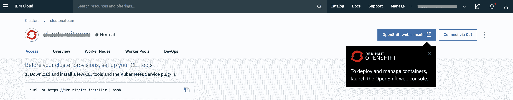
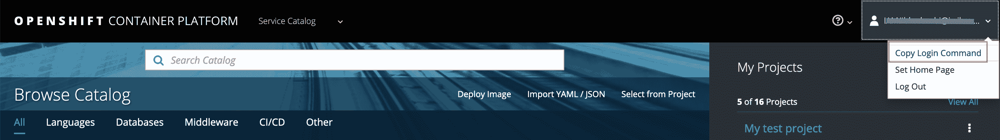
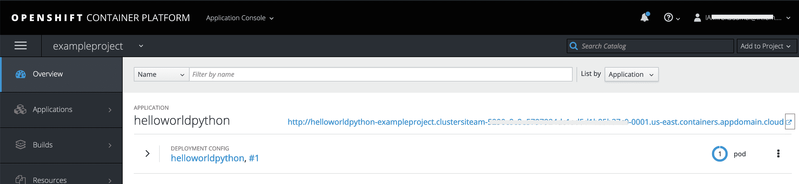
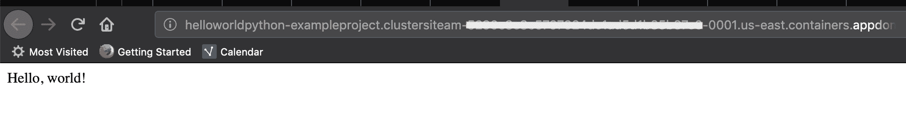
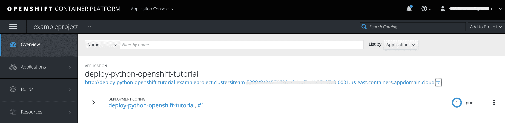
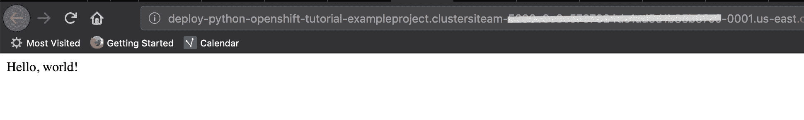
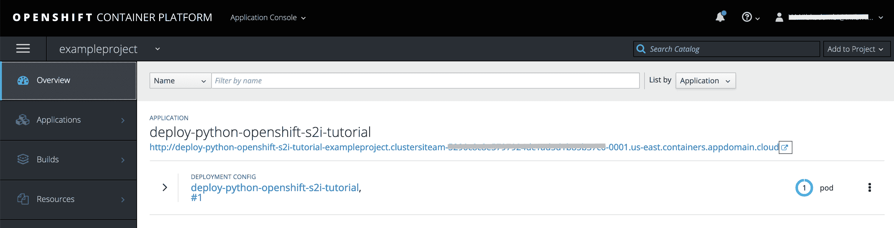
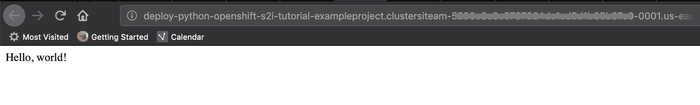

# 将 Python 应用程序部署到 OpenShift 集群的三种方法

> 原文：[`developer.ibm.com/zh/tutorials/deploy-python-app-to-openshift-cluster-source-to-image/`](https://developer.ibm.com/zh/tutorials/deploy-python-app-to-openshift-cluster-source-to-image/)

本教程将向您展示如何将 Python 应用程序部署到云上的 OpenShift 集群。您还可以使用此处描述的方法来部署其他运行时环境上开发的应用程序或微服务。本教程中的示例将使用 Red Hat® OpenShift® on IBM Cloud™

本教程介绍了三个部署场景，它们都会构建应用程序并将其部署到 IBM Cloud 上的 OpenShift 集群：

*   需要将一个现有的 Docker 镜像推送到 IBM Cloud 上的 OpenShift 集群，然后进行部署：在此场景中，现有的 Docker 镜像位于一个专用注册表中。该镜像必须部署在 IBM Cloud 上的 OpenShift 集群中。例如，您可以在应用程序现代化期间以“直接迁移”(lift and shift) 方式使用此部署场景。由于您无权访问源文件，因此未实施任何持续集成或交付机制。

*   有一个含有源文件和 Dockerfile（包含有关如何汇编镜像的说明）的 GitHub 存储库：如果您希望在仅使用所需的依赖项和版本来汇编镜像时具有完全控制权和灵活性，那么此场景适用。由于您可以指定依赖项，因此代码始终与依赖项兼容。在此场景中，您需要维护 Dockerfile，这有时可能是一个复杂的任务。此场景允许持续集成并交付到 OpenShift 集群，这有助于使代码的部署版本保持最新。

*   有一个含有源文件的 GitHub 存储库：在此场景中，您依赖于 OpenShift [Source to Image (S2I) Toolkit](https://github.com/openshift/source-to-image) 来创建 Docker 镜像。OpenShift S2I 使用源文件和构建器镜像来创建新的 Docker 镜像。当使用 `oc new-app ...` 命令并且存储库中不存在 `Dockerfile` 时，将自动检测源代码的语言。在[此处](https://docs.openshift.com/enterprise/3.1/dev_guide/new_app.html#language-detection)指定语言检测规则。根据 [OpenShift 博客](https://blog.openshift.com/create-s2i-builder-image/)，使用 S2I 的优势包括速度、可修补性、用户效率和生态系统。此场景也允许持续集成并交付到 OpenShift 集群，这有助于使代码的部署版本保持最新。

**免费试用 IBM Cloud**

利用 [IBM Cloud Lite](https://cocl.us/IBM_CLOUD_GCG) 快速轻松地构建您的下一个应用程序。您的免费帐户从不过期，而且您会获得 256 MB 的 Cloud Foundry 运行时内存和包含 Kubernetes 集群的 2 GB 存储空间。[了解所有细节](https://developer.ibm.com/dwblog/2017/building-with-ibm-watson/)并确定如何开始。

## 前提条件

您需要一个 [IBM Cloud 帐户](https://cocl.us/IBM_CLOUD_GCG)、[OpenShift CLI](https://www.okd.io/download.html) 和 [Docker](https://www.docker.com/)。

## 预估时间

完成本教程大约需要 30 分钟。

## 第 1 步：创建 OpenShift 集群实例

创建 [OpenShift 集群](https://cloud.ibm.com/kubernetes/catalog/openshiftcluster?cm_sp=ibmdev-_-developer-tutorials-_-cloudreg)的新实例。选择适当的计划，然后单击 **Create**。

## 第 2 步：使用本地注册表中的 Docker 镜像来部署应用程序

位于 [github.com/IBM/deploy-python-openshift-tutorial](https://github.com/IBM/deploy-python-openshift-tutorial) 的含有示例的 GitHub 存储库包含源文件和 Dockerfile。本教程使用这些示例来汇编 Docker 镜像，并稍后将其部署到 OpenShift 集群。

1.  运行以下命令来克隆 [GitHub 存储库](https://github.com/IBM/deploy-python-openshift-tutorial)：

    ```
     $ git clone https://github.com/IBM/deploy-python-openshift-tutorial.git 
    ```

2.  构建需要部署到 OpenShift 集群的应用程序的 Docker 镜像：

    ```
     $ cd deploy-python-openshift-tutorial
     $ docker build -t helloworldpython:latest . 
    ```

3.  打开 OpenShift Web 控制台：

    

4.  使用 CLI 登录到 OpenShift，然后创建一个新项目：

    

    ```
     $ oc login https://c100-e.us-east.containers.cloud.ibm.com:30682 --token=xxxxxxxxxxxxxxx
     $ oc new-project exampleproject 
    ```

5.  为 Docker 注册表创建路由：

    ```
     $ oc project default
     $ oc get svc 
    ```

    输出与下面的示例类似：

    ```
     NAME               TYPE           CLUSTER-IP       EXTERNAL-IP      PORT(S)                      AGE
     docker-registry    ClusterIP      172.21.xxx.xx    <none>           5000/TCP                     18h
     kubernetes         ClusterIP      172.21.x.x       <none>           443/TCP,53/UDP,53/TCP        18h
     myfirstosdeploy    ClusterIP      172.21.xx.xxx    <none>           5000/TCP                     17h
     registry-console   ClusterIP      172.21.xxx.xxx   <none>           9000/TCP                     18h
     router             LoadBalancer   172.21.xx.x      169.47.xxx.xxx   80:31297/TCP,443:30385/TCP   18h 
    ```

6.  运行以下命令来为 Docker 注册表创建路由：

    ```
     $ oc create route reencrypt --service=docker-registry 
    ```

7.  检查“创建路由”操作的详细信息：

    ```
     $ oc get route docker-registry 
    ```

    您会获得与以下示例类似的输出：

    ```
     NAME              HOST/PORT                                                                                                        PATH      SERVICES          PORT       TERMINATION   WILDCARD
     docker-registry   docker-registry-default.clustersiteam-5290cxxxxxxxxxxd1b85xxx-0001.us-east.containers.appdomain.cloud             docker-registry   5000-tcp   reencrypt     None 
    ```

8.  观察注册表 url 的模式 – `docker-registry-default.<cluster_name>-<ID_string>.<region>.containers.appdomain.cloud`。

    > 记录 Docker 注册表 URL。在后续步骤中将需要使用此 URL。

9.  使用 Docker CLI 登录到 Docker 注册表。

    > 注意：使用先前记录的 Docker 注册表 URL。

    ```
     docker login -u $(oc whoami) -p $(oc whoami -t) docker-registry-default.<cluster_name>-<ID_string>.<region>.containers.appdomain.cloud 
    ```

10.  标记 Docker 镜像，如以下示例中所示：

    ```
     docker tag helloworldpython:latest docker-registry-default.<cluster_name>-<ID_string>.<region>.containers.appdomain.cloud/exampleproject/helloworldpython:latest 
    ```

11.  将 Docker 镜像推送到 OpenShift Docker 注册表：

    ```
     docker push docker-registry-default.<cluster_name>-<ID_string>.<region>.containers.appdomain.cloud/exampleproject/helloworldpython 
    ```

12.  将该镜像部署到 OpenShift 并公开路由：

    ```
     $ oc project exampleproject
     $ oc new-app --image-stream=helloworldpython --name=helloworldpython
     $ oc expose svc/helloworldpython 
    ```

13.  在 OpenShift 控制台上单击 `helloworldpython` 应用程序的 **Open Url** 图标：

    

    `Hello, world!` 将显示在浏览器窗口中：

    

## 第 3 步：使用含有源文件和 Dockerfile 的 GitHub 存储库来部署应用程序

此步骤使用相同的 GitHub 存储库 [github.com/IBM/deploy-python-openshift-tutorial](https://github.com/IBM/deploy-python-openshift-tutorial) 进行部署。Dockerfile 包含有关如何汇编镜像的说明。

此步骤中的示例将使用您先前创建的 `exampleproject`。

```
$ oc project exampleproject 
```

运行以下命令来部署应用程序：

```
$ oc new-app https://github.com/IBM/deploy-python-openshift-tutorial
$ oc expose svc/deploy-python-openshift-tutorial 
```

在 OpenShift 控制台上单击 `deploy-python-openshift-tutorial` 应用程序的 **Open Url** 图标。



`Hello, world!` 将显示在浏览器窗口中：



## 第 4 步：使用含有源文件的 GitHub 存储库来部署应用程序

此步骤使用相同的 GitHub 存储库 [github.com/IBM/deploy-python-openshift-tutorial](https://github.com/IBM/deploy-python-openshift-tutorial) 进行部署。在此处，OpenShift S2I 使用构建器镜像及其源文件来创建可部署到 OpenShift 集群的新 Docker 镜像：

```
$ oc new-app https://github.com/IBM/deploy-python-openshift-s2i-tutorial
$ oc expose svc/deploy-python-openshift-s2i-tutorial 
```

在 OpenShift 控制台上单击 `deploy-python-openshift-s2i-tutorial` 应用程序的 **Open Url** 图标：



`Hello, world!` 将显示在浏览器窗口中：



## 结束语

现在，您知道了有三种不同的方法可用于构建应用程序并将其部署到 OpenShift 集群。您可以通过 [Red Hat OpenShift on IBM Cloud](https://cloud.ibm.com/kubernetes/catalog/openshiftcluster?cm_sp=ibmdev-_-developer-tutorials-_-cloudreg) 来尝试自己的部署。

要了解有关 Source-to-Image 的更多信息，可以观看[本视频](https://developer.ibm.com/videos/source-to-image-s2i-openshift/)。

本文翻译自：[Three ways to deploy a Python app into an OpenShift cluster](https://developer.ibm.com/tutorials/deploy-python-app-to-openshift-cluster-source-to-image/)（2019-10-08）