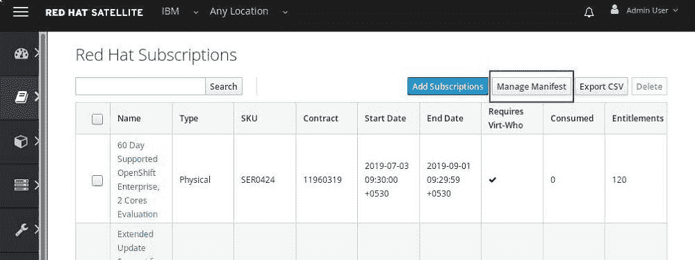
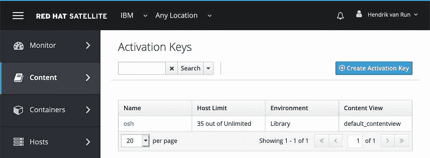
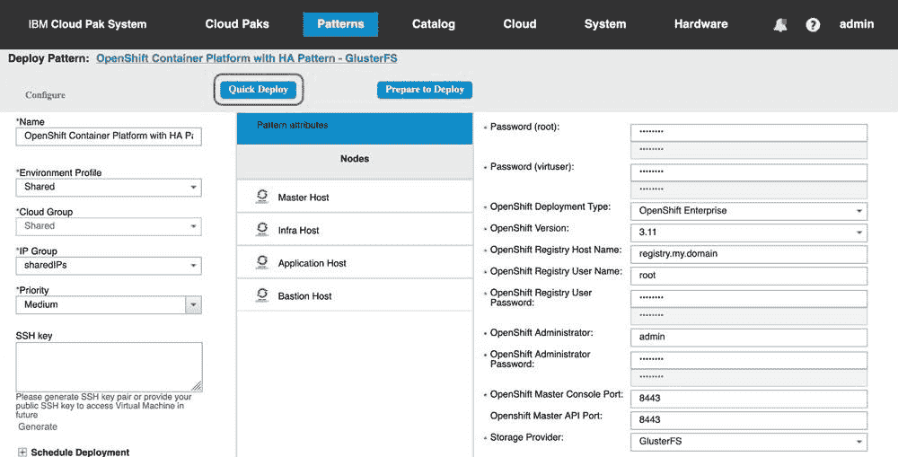

# 利用 IBM Cloud Pak System 加速 Red Hat OpenShift Container Platform 部署

> 原文：[`developer.ibm.com/zh/tutorials/accelerate-your-red-hat-openshift-container-platform-deployment-with-ibm-cloud-pak-system/`](https://developer.ibm.com/zh/tutorials/accelerate-your-red-hat-openshift-container-platform-deployment-with-ibm-cloud-pak-system/)

## 简介

最近发布的 [IBM Cloud Pak System](https://www.ibm.com/cn-zh/cloud/cloudpaksystem) 可帮助您加速实现内部 Kubernetes 平台。它支持自动部署和配置 [Red Hat OpenShift Container Platform](https://www.ibm.com/support/knowledgecenter/en/SSZMMH_2.3.0/doc/iwd/openshift_overview.html) (RHOCP) 和 [IBM Cloud Private](https://www.ibm.com/support/knowledgecenter/en/SSZMMH_2.3.0/doc/iwd/cpc_overview.html)。本教程主要围绕 Red Hat OpenShift Container Platform 展开，而 *[IBM Cloud Private Pattern for IBM PureApplication 入门](https://developer.ibm.com/tutorials/cl-ibm-cloud-private-pattern-for-ibm-pureapplication/)*教程则介绍了有关使用 IBM Cloud Private on Cloud Pak System 的各种真知灼见。

对于 Red Hat OpenShift，重要的是了解目前提供的多种不同产品服务：

*   **OpenShift Online**

    完全托管的公共云产品服务，用于快速部署应用程序。

*   **OpenShift Dedicated**

    完全托管的私有云 OpenShift 集群，托管在 Amazon Web Services (AWS) 上。

*   **OpenShift Container Platform (RHOCP)**

    企业 OpenShift 集群，部署在您自己的内部基础架构上。（RHOCP 原名为 OpenShift Enterprise，自 V3.3 起，其名称发生了更改。）

在 [OpenShift Web 站点](https://www.openshift.com/learn/topics/kubernetes/)上，可以找到有关这些产品服务的更为详细的比较。由于 Cloud Pak System 属于内部设备，因此它仅支持 RHOCP 产品服务。在本教程中，您将学习如何在 Cloud Pak System 上部署 RHOCP。我们编写这些步骤时，假定 Cloud Pak System 无法直接访问互联网，并且使用了 Cloud Pak System 2.3.0.1 固件。

## 预估时间

完成本教程的时间受诸多因素的影响。其中前提条件部分占用了大部分时间。完成此操作后，执行剩余步骤约需要一到两小时。

## 前提条件

必须满足多项前提条件后，才能在 Cloud Pak System 上部署 OpenShift 集群。[IBM Knowledge Center](https://www.ibm.com/support/knowledgecenter/en/SSZMMH_2.3.0/doc/iwd/openshift_sysreqs.html) 为这些前提条件提供了一个良好的起点：

*   IBM Cloud Pak System 2.3.0.0 或更高版本 (W3500/W3550)，或者 IBM PureApplication Platform 2.2.6.0 (W1500/W2500/W3500/W3550)。*已计划在未来发行版中为 IBM PureApplication System W3700 提供支持。*
*   适用于 Red Hat Linux 系统 V7.5 的 IBM 操作系统镜像（Red Hat 基本操作系统镜像），或者您自己的具有 Red Hat Enterprise Linux (RHEL) 7.5 或更高版本的操作系统镜像。
*   Red Hat Satellite 6 服务已连接到外部 Red Hat Satellite Server (RHSS) 或内部 RHSS。
*   在 RHSS 中已启用并已同步对 RHOCP 和 RHEL V7.0 的订阅。*（注意：Cloud Pak System 随附对 RHEL 和 RHSS 的订阅。这不同于对 RHOCP 的订阅，后者不包含在 Cloud Pak System 中。）*

以上前三项前提条件通俗易懂，但我们将在 Red Hat Satellite Server 准备工作部分中为您详细讲解 RHSS 的准确需求。由于我们已假定您在无法直接访问互联网的环境中工作，因此创建 Private Docker Registry 部分将演示如何创建您自己的 Private Docker Registry，以支持脱机安装 OpenShift。

### Red Hat Satellite Server 准备工作

大部分公司都选择将其基于 Intel 的 Cloud Pak System 和 PureApplication Platform 客户端虚拟机 (VM) 与 RHSS 6 相集成。使用 RHEL 6 或 7 部署虚拟机时，它可提供简单明了的流程来执行 RHEL 操作系统的维护。（例如，定期安装安全补丁。）当然，这也显著简化了新 RPM 程序包及其依赖项的安装过程。（例如，只需从 shell 执行 `yum install <package-name>` 即可。）您可将 RHSS 6 部署在 Cloud Pak System 之上，也可以将其与目前已有的 RHSS 相集成。IBM 建议将 RHSS 6.4 或更高版本与 Cloud Pak System 一起使用，[IBM Support](https://www-01.ibm.com/support/docview.wss?uid=ibm10886841) 中详细介绍了其设置方式。

假定您已将 RHSS 6.4 或更高版本部署到位，此时还需要执行其他一些步骤才能将 RHOCP 部署到 Cloud Pak System 上：

**步骤 1.** 激活 OpenShift 订阅代码。

*   登录到 [Red Hat 客户门户](https://access.redhat.com/subscriptions/activate/)，在对应字段中输入订阅激活码，然后单击 **Next**，如图 1 中所示。

    

    *图 1：在 Red Hat 客户门户中激活订阅*

*   选择 **Start a new subscription**（如图 2 中所示），单击 **Next**，然后完成订阅激活流程的剩余操作。*（注意：激活订阅可能需要 30 分钟到 48 小时。如果在此时间范围内未能激活您的订阅，可联系 Red Hat 支持部门。）*

    

    *图 2：在 Red Hat 客户门户中启动新订阅*

*   要更新现有 Red Hat Satellite 清单，可转至 Red Hat 客户门户上的 **[Subscriptions and Allocations](https://access.redhat.com/management/subscription_allocations)**，搜索您现有的 Red Hat Satellite 清单名称，如图 3 中所示。

    *注意：参阅 [IBM Support](https://www-01.ibm.com/support/docview.wss?uid=ibm10886841) 提供的 [How do I create RedHat manifest file and deploy RedHat Satellite Server 6.4_V6_6 _guide](https://www.ibm.com/support/pages/sites/default/files/inline-files/$FILE/How%20do%20I%20create%20RedHat%20manifest%20file%20and%20deploy%20RedHat%20Satellite%20Server%206.4_V6_6.pdf)。*

    

    *图 3：将新激活的 OpenShift 订阅添加到 Red Hat Satellite 清单中。*

*   选择您的清单，并将新激活的 RHOCP 订阅添加到该清单中。

*   现在，您需要在自己的 RHSS 上刷新此清单。为此，以管理员身份登录到您的 RHSS，转至 **Content > Subscriptions**，然后单击 **Manage Manifest**，如图 4 中所示。

    

    *图 4：从 RHSS 管理您的 Red Hat Satellite 清单。*

*   单击 **Refresh**（如图 5 中所示），同步已添加到现有 Satellite 清单的订阅。

    

    *图 5：从 RHSS 刷新您的 Red Hat Satellite 清单。*

    当 RHOCP 订阅与 Red Hat 帐户中的现有 Satellite Server 清单关联并完成同步后，您应该能够在 RHSS 6.x 中的 **Content > Subscriptions** 下看到此 RHOCP 订阅，如图 6 中所示。

    

    *图 6：RHSS 中的 Red Hat OpenShift 订阅。*

**步骤 2.** 现在，您将在 Red Hat Satellite Server 中启用多个 Red Hat 存储库。RHOCP 3.10 和 3.11 分别需要不同的 Red Hat 存储库集合，因此您可以启用自己所需的存储库，也可以直接将五个存储库全都启用。

| 存储库名称 | 存储库标识 | 需要此存储库的 RHOCP |
| --- | --- | --- |
| Red Hat Enterprise Linux 7 Server Extra RPMs | `rhel-7-server-extras-rpms` | 3.10 *和* 3.11 |
| Red Hat OpenShift Container Platform 3.11 (RPMs) | `rhel-7-server-ose-3.11-rpms` | 3.11 |
| Red Hat Ansible Engine 2.6 RPMs for Red Hat Enterprise Linux 7 Server | `rhel-7-server-ansible-2.6-rpms` | 3.11 |
| Red Hat OpenShift Container Platform 3.10 RPMs x86-64 | `rhel-7-server-ose-3.10-rpms` | 3.10 |
| Red Hat Ansible Engine 2.4 RPMs for Red Hat Enterprise Linux 7 Server | `rhel-7-server-ansible-2.4-rpms` | 3.10 |

转至 **Content > Red Hat Repositories**，并搜索 **Available Repositories** 下列出的一个存储库。期望的存储库出现后，单击该存储库旁的加号即可将其展开并启用。（图 7 显示如何对 RHOCP 3.11 (RPM) 存储库执行此操作。）启用后，您应该会看到 **Enabled Repositories** 下已列出该存储库，如图 8 中所示。对所需的每个 Red Hat 存储库重复此步骤。

通过启用这些存储库，RHSS 将从中下载 RPM。


*图 7：在 RHSS 中启用其他 Red Hat 存储库。*


*图 8：在 RHSS 中查看已启用的 Red Hat 存储库。*

**步骤 3.** 转至 **Content > Sync Status**（如图 9 中所示），确认 **Result** 列针对每个存储库显示的状态是否为 `Syncing Complete`，或者确认是否已下载这些存储库。您可能需要触发同步流程，或者安排定期自动执行同步。


*图 9：确认 RHSS 中存储库的同步状态。*

**步骤 4.** 转至 **Content > Content Views**，并找到 `default_contentview`。此视图与在 RHSS 中部署并注册的所有虚拟机都关联。例如，它可确定这些虚拟机可以“看到”哪些 RPM。此视图需要更新以包含新添加的存储库。

选择 **Yum Content** 选项卡。在 Repository Selection 部分下，选择 **Add**。您应该会看到自己在**步骤 2** 中启用的所有 Red Hat 存储库。选中所有存储库并单击 **Add Repositories**，如图 10 所示。完成后，单击 **Publish New Version**。


*图 10：将新的 Red Hat 存储库添加到 RHSS 中的 default_contentview。*

**步骤 5.** 在继续下一步之前，确保您刚更新的 **default_contentview** 页面已与您在 Cloud Pak System 上使用的激活密钥相关联。*（注意：考虑对 RHOCP 使用独立的激活密钥和内容视图。这样即可使您的 RHOCP 订阅仅与 Cloud Pak System 上部署的一小部分虚拟机相关联。）*

浏览至 **Content > Activation Keys**，确认激活密钥已与您的内容视图相关联，如图 11 中所示。



*图 11：`osh` 激活密钥已与 RHSS 中的 `default_contentview` 相关联。*

在 Cloud Pak System 中的 Shared Service Instances 页面上，已部署的 `Red Hat Satellite Six Service` 实例会显示相同的激活密钥，如图 12 中所示。


*图 12：`Red Hat Satellite Six Service` 实例已与 `osh` 激活密钥相关联。*

**步骤 6.** 在已向 RHSS 注册并且已部署的虚拟机中，通过 [`yum` 命令行工具](https://access.redhat.com/solutions/9934)确认每个存储库各有一个 RPM 程序包供您随意使用。下表列出了这些存储库以及每个存储库对应的 RPM。

| 存储库 | RPM |
| --- | --- |
| `rhel-7-server-ose-3.11-rpms` | `atomic-openshift-hyperkube` |
| `rhel-7-server-ansible-2.6-rpms` | `ansible` |
| `rhel-7-server-ose-3.10-rpms` | `atomic-openshift-hyperkube` |
| `rhel-7-server-ansible-2.4-rpms` | `ansible` |
| `rhel-7-server-extras-rpms` | `docker.x86_64` |

默认情况下，在 Cloud Pak System 上部署虚拟机时，仅自动启用 `rhel-7-server-rh-common-rpms` 和 `rhel-7-server-rpms` 存储库。部署 RHOCP 模式时，模式的软件组件会自动启用其他必要的存储库。但在出于测试目的而部署的虚拟机上，必须先手动启用这些存储库，然后才能证明可以从每个存储库安装 RPM。

*   在已部署的虚拟机上启用 Red Hat 存储库。例如，如果您计划部署 RHOCP 3.11，则启用以下三个存储库：

    *   `rhel-7-server-extras-rpms`
    *   `rhel-7-server-ose-3.11-rpms`
    *   `rhel-7-server-ansible-2.6-rpms`

    以 root 用户身份登录时，运行以下命令以启用 `rhel-7-server-extras-rpms` 存储库：

    ```
    -bash-4.2# subscription-manager repos --enable rhel-7-server-extras-rpms 2>/dev/null
    Repository ‘rhel-7-server-extras-rpms’ is enabled for this system. 
    ```

    *（注意：对于 `subscription-manager` 和 `yum` 命令，我们已将 `stderr output` 重定向至 `/dev/null`。通常无需执行此重定向，当存在 `/var/log/rhsm` 目录时，命令行上不会显示任何 `stderr` 输出。)*

*   运行 `yum info <RPM>` 命令以证明此 RPM 可供您随意使用，如下所示。对所需的每个 RPM 重复此命令：

    *   `ansible`
    *   `atomic-openshift-hyperkube`
    *   `docker`

    ```
    -bash-4.2# yum info docker
    Loaded plugins: package_upload, product-id, search-disabled-repos, subscription-manager
    (….output truncated…)
    [id:rhel-7-server-extras-rpms Red Hat Enterprise Linux 7 Server - Extras (RPMs)]
    Available Packages
    Name        : docker
    Arch        : x86_64
    Epoch       : 2
    Version     : 1.13.1
    Release     : 103.git7f2769b.el7
    Size        : 65 M
    Repo        : installed
    From repo   : rhel-7-server-extras-rpms
    Summary     : Automates deployment of containerized applications
    URL         : https://github.com/docker/docker
    License     : ASL 2.0
    Description : Docker is an open-source engine that automates the deployment of any
                : application as a lightweight, portable, self-sufficient container that will
                : run virtually anywhere. 
    ```

*   最后，运行 `yum install <RPM>` 命令以安装此 RPM。这将验证您的 RHSS 是否具有实际 RPM 的本地副本以及所有依赖项。再次对每个 RPM 重复此命令：

    *   `ansible`
    *   `atomic-openshift-hyperkube`
    *   `docker`

    ```
    -bash-4.2# yum install docker 2> /dev/null
    Loaded plugins: enabled_repos_upload, package_upload, product-id, search-
                  : disabled-repos, subscription-manager
    rhel-7-server-extras-rpms                                | 2.0 kB     00:00     
    rhel-7-server-rpms                                       | 2.0 kB     00:00     
    rhel-7-server-satellite-tools-6.4-rpms                   | 2.1 kB     00:00     
    Resolving Dependencies
    --> Running transaction check
    ---> Package docker.x86_64 2:1.13.1-103.git7f2769b.el7 will be installed
    --> Finished Dependency Resolution

    Dependencies Resolved

    ================================================================================
     Package Arch    Version                       Repository                  Size
    ================================================================================
    Installing:
     docker  x86_64  2:1.13.1-103.git7f2769b.el7   rhel-7-server-extras-rpms   18 M

    Transaction Summary
    ================================================================================
    Install  1 Package

    Total download size: 18 M
    Installed size: 65 M
    Is this ok [y/d/N]: y
    Downloading packages:
    docker-1.13.1-103.git7f2769b.el7.x86_64.rpm                |  18 MB   00:00     
    Running transaction check
    Running transaction test
    Transaction test succeeded
    Running transaction
      Installing : 2:docker-1.13.1-103.git7f2769b.el7.x86_64                    1/1
    Uploading Package Profile
      Verifying  : 2:docker-1.13.1-103.git7f2769b.el7.x86_64                    1/1

    Installed:
      docker.x86_64 2:1.13.1-103.git7f2769b.el7                                     

    Complete! 
    ```

您已完成 RHSS 的准备工作，接下来即可部署 RHOCP。

### 创建 Private Docker Registry

要部署 RHOCP，就需要访问包含所需 Docker 镜像的 Docker 注册表。Red Hat 通过 `registry.redhat.io` 提供对这些镜像的访问权，但大部分 Cloud Pak Systems 并不允许部署可直接访问互联网的虚拟机。因此，需要改用 Private Docker Registry，并以适用于 RHOCP 的 Docker 镜像填充此注册表。

### 在 Cloud Pak System 上部署 Private Docker Registry

Cloud Pak System 具有一种[模式](https://www.ibm.com/support/knowledgecenter/en/SSZMMH_2.3.0/doc/iwd/pat_docker_privateregpost21.html)，用于简化 Private Docker Registry 的创建过程。如果您已将 Private Docker Registry 部署到位，可以跳过此步骤，并转至使用 OpenShift Docker 镜像填充 Private Docker Registry 部分。

**步骤 1.** 登录到 IBM Cloud Pak System 后，转至 **Patterns > Virtual System Patterns**，查找名为 Docker Private Registry 的模式，如图 13 中所示。默认情况下，它将部署虚拟机，并将 RHEL 7、Docker V18.06.1-ce 和镜像注册表与 50 GB 的本地存储器一起安装到 `/var/docker-registrystorage` 下。此过程全都可修改，但这不在本教程的讨论范围内。


*图 13：IBM Cloud Pak System 中的 Docker Private Registry 虚拟系统模式。*

**步骤 2.** 完成部署后，登录到此虚拟机以确认 RHEL 和 Docker 的版本。

```
-bash-4.2# docker --version
Docker version 18.06.1-ce, build e68fc7a 
```

同时，验证您是否可从命令行登录到 Docker Private Registry。

```
-bash-4.2# docker login -u root -p passw0rd ipas-pvm-233-035.purescale.raleigh.ibm.com
WARNING! Using --password via the CLI is insecure.Use --password-stdin.
WARNING! Your password will be stored unencrypted in /root/.docker/config.json.
Configure a credential helper to remove this warning.See
https://docs.docker.com/engine/reference/commandline/login/#credentials-store

Login Succeeded 
```

### 使用 OpenShift Docker 镜像填充 Private Docker Registry

我们假定您的 Docker Private Registry 无权访问互联网。因此，您将需要虚拟机/服务器才能使用 RHOCP Docker 镜像来填充自己的 Private Docker Registry。此虚拟机/服务器应满足下列要求：

*   在本地安装 Docker
*   通过互联网访问 Docker 公共注册表，尤其是 `registry.redhat.io`
*   通过网络访问 Docker Private Registry

图 14 展示了如何使用此虚拟机/服务器从 `registry.redhat.io` 提取 Docker 镜像，对其进行标记，然后将其推送到您的 Docker Private Registry `registry.my.domain`。


*图 14：使用 RHOCP Docker 镜像填充 Docker Private Registry。*

以下命令显示了如何从 `registry.redhat.io/openshift3/apb-base:v3.11.104` 推送 RHOCP Docker 镜像，对其进行标记，然后将其推送到您的 Private Docker Registry `registry.my.domain`。

*（注意：RHOCP 由 Ansible 进行安装，它不仅使用主版本的 Docker 镜像，还会使用主次版本。因此，必须对每个 Docker 镜像标记两次，一次使用主版本，另一次使用主次版本。)*

```
$ docker pull registry.redhat.io/openshift3/apb-base:v3.11.104

$ docker tag registry.redhat.io/openshift3/apb-base:v3.11.104 registry.my.domain/openshift3/apb-base:v3.11.104
$ docker tag registry.redhat.io/openshift3/apb-base:v3.11.104 registry.my.domain/openshift3/apb-base:v3.11

$ docker push registry.my.domain/openshift3/apb-base:v3.11.104
$ docker push registry.my.domain/openshift3/apb-base:v3.11 
```

对 RHOCP Docker 镜像完成上述步骤后，您可验证自己能否提取其中一个镜像，如下所示。如果可以，即可继续部署 RHOCP 模式。

```
-bash-4.2# docker login -u root -p ******** registry.my.domain
WARNING! Using --password via the CLI is insecure.Use --password-stdin.
WARNING! Your password will be stored unencrypted in /root/.docker/config.json.
Configure a credential helper to remove this warning.See
https://docs.docker.com/engine/reference/commandline/login/#credentials-store

Login Succeeded

-bash-4.2# docker pull registry.my.domain/openshift3/apb-base:v3.11.104
v3.11.104: Pulling from openshift3/apb-base
256c6fd715f2: Pull complete
aa58f5fa817d: Pull complete
058abc0fb4a1: Pull complete
f125ddfe3974: Pull complete
Digest: sha256:d6b220d5df55dfbb17a2dda41da73167b4a9220bfa2c3fc4714007694db549fc
Status: Downloaded newer image for registry.my.domain/openshift3/apb-base:v3.11.104

-bash-4.2# docker images
REPOSITORY                                                            TAG                 IMAGE ID            CREATED             SIZE
registry.my.domain /openshift3/apb-base       v3.11.104           da232eb5a517        4 months ago        1.2GB 
```

*（注意：如需了解更多背景信息，参阅 [OpenShift 文档](https://docs.openshift.com/container-platform/3.11/install/disconnected_install.html)。）*

## 部署

### 可用 Red Hat OpenShift 拓扑

在部署新 RHOCP 集群前，让我们来简单讨论一下用于引述不同种类节点的术语。

*   **堡垒节点**

    此节点用于触发 RHOCP 的安装。通常，此节点通过使用命令行实用程序与 RHOCP 环境进行交互，因为不建议从主节点执行任何管理活动。

    *IBM Cloud Private 中的等效节点：ICP 引导节点*

*   **主节点**

    这些属于 Kubernetes 主节点，它们是 Kubernetes 集群的大脑。它们运行 OpenShift 主组件，包括 API 服务器和 etcd。主组件负责管理 Kubernetes 集群中的节点，并调度 Pod 以在节点上运行。主节点数量需为奇数（例如，3 或 5），以便保证高可用性，因为 etc 分布式键/值存储需要定额。

    *IBM Cloud Private 中的等效节点：ICP 主节点*

*   **计算节点**

    这些节点属于 Kubernetes 工作节点，运行托管应用程序的 Pod。这些节点运行由 OpenShift 集群最终用户创建的容器。应用程序工作负载分布在 OpenShift 调度程序所确定的计算节点上。为实现高可用性，可在计算节点之间配置应用容器的多个副本。一个 OpenShift 集群至少包含一个计算节点，但支持多个计算节点，以便为该集群上部署的应用容器提供高可用性。

    *IBM Cloud Private 中的等效节点：ICP 工作节点*

*   **基础架构节点**

    这些节点充当代理节点，将传入 HTTP 流量转发到运行应用程序的应用程序节点上的 Pod。同样，Kubernetes 支持多个基础架构节点，以提供高可用性。这些节点可用于运行 RHOCP 组件，如镜像注册表和监控组件，同时还可用于可选组件，如测量和日志记录组件。

    *IBM Cloud Private 中的等效节点：ICP 代理节点*

IBM Cloud Pak System 包含虚拟系统模式，以支持 RHOCP 的两个拓扑，如图 15 中所示。


*图 15：适用于 RHOCP 的 IBM Cloud Pak System 模式。*

#### OpenShift Container Platform Pattern – GlusterFS

此模式用于部署 RHOCP 拓扑，如图 16 中所示。注意，此模式不会部署堡垒节点，因为只从主节点执行安装。


*图 16：`OpenShift Container Platform Pattern - GlusterFS` 模式的对应拓扑。*

#### OpenShift Container Platform with HA Pattern – GlusterFS

此模式用于部署 RHOCP 拓扑，如图 17 中所示。注意，不同于其他模式，此模式使用堡垒节点在其他节点上执行安装。安装完成后，就不再主动使用此虚拟机。


*图 17：`OpenShift Container Platform with HA Pattern - GlusterFS` 模式的对应拓扑。*

如图 17 中所示，GlusterFS 存储器为可选。正如您将在此教程下文中所看到的，您可在部署时选择 GlusterFS 或 Custom。如果选择 Custom，那么将不会配置 GlusterFS，并且将在不使用持久存储提供程序的前提下安装 OpenShift。随后，您即可随意安装并配置自己选择的存储提供程序。有关更多详细信息，可参阅 [OpenShift 文档](https://docs.openshift.com/container-platform/3.11/install_config/persistent_storage/index.html)。

选择 GlusterFS 时，须注意，它将部署在 OpenShift 计算节点上的容器内。因此，它会与您部署的任意容器化应用程序共享相同的节点。另须注意，由于需要定额来确保一致性，GlusterFS 至少需要 3 个节点。如果您后续添加更多计算节点，GlusterFS 仍将坚持使用原先部署的 3 个原始计算节点。

### 部署 Red Hat OpenShift 集群

**步骤 1.** 转至 **Patterns > Virtual System Patterns**，查找名为 `OpenShift Container Platform with HA Pattern – GlusterFS` 的模式。单击部署图标，如图 18 中所示。


*图 18：部署 `OpenShift Container Platform with HA Pattern – GlusterFS` 模式。*

**步骤 2.** 输入或覆盖以下模式属性：

**Password (root)：** *root 用户的密码*

**Password (virtuser)：** *virtuser 用户的密码*

**OpenShift version：** *3.11*

**OpenShift Registry Host Name：** *Docker Private Registry 的标准主机名*

**OpenShift Registry User Name：** *Docker Private Registry 的用户名*

**OpenShift Registry User Password：** *Docker Private Registry 的密码*

**OpenShift Administrator：** *OpenShift 管理员用户的用户名*

**OpenShift Administrator Password:** *OpenShift 管理员用户的密码*

**步骤 3.** 对于其余属性，接受默认值。确保您对面板左侧 **Name**、**Environment Profile**、**Cloud Group**、**IP Group** 和 **Priority** 字段的值感到满意。单击 **Quick Deploy** 以启动部署，如图 19 中所示。



*图 19：开始部署 `OpenShift Container Platform with HA Pattern – GlusterFS` 模式。*

**步骤 4.** 完成后，**Virtual System Instance** 页面应如图 20 中所示。注意，在 **History** 部分中，部署的最终步骤需耗时 50 分钟以上才能完成。


*图 20：已部署的`OpenShift Container Platform with HA Pattern – GlusterFS` 模式实例。*

如果部署失败，您应登录到堡垒节点（`Bastion_Host` 虚拟机）并查看 `/opt/IBM/OCP/logs/ocp.log` 和 `/root/openshift-ansible.log` 日志。例如，如果从专用注册表提取 RHOCP Docker 镜像时出现问题，您将在 `/root/openshift-ansible.log` 中看到如下消息：

```
2019-09-30 22:43:37,536 p=17368 u=root |  Failure summary:

1\. Hosts:    ipas-pvm-233-012.purescale.raleigh.ibm.com, ipas-pvm-233-013.purescale.raleigh.ibm.com, ipas-pvm-233-014.purescale.raleigh.ibm.com, ipas-pvm-233-015.purescale.raleigh.ibm.com, ipas-pvm-233-016.purescale.raleigh.ibm.com, ipas-pvm-233-019.purescale.raleigh.ibm.com, ipas-pvm-233-021.purescale.raleigh.ibm.com
   Play:     OpenShift Health Checks
   Task:     Run health checks (install) - EL
   Message:  One or more checks failed
   Details:  check "docker_image_availability":
             One or more required container images are not available:
                 registry.my.domain/openshift3/ose-deployer:v3.11,
                 registry.my.domain/openshift3/ose-docker- registry:v3.11,
                 registry.my.domain/openshift3/ose-haproxy-router:v3.11,
                 registry.my.domain/openshift3/ose-pod:v3.11,
                 registry.my.domain/openshift3/registry-console:v3.11
             Checked with: skopeo inspect [--tls-verify=false] [--creds=<user>:<pass>] docker://<registry>/<image> 
```

**步骤 5.** 在新部署的虚拟系统实例中，展开 `Bastion_Host` 虚拟机，如图 21 中所示。


*图 21：新部署的 RHOCP 虚拟系统实例的 `Bastion_Host`。*

### 部署后步骤

Red Hat OpenShift Container Platform 环境的基础架构（代理）节点上定义了七条指向 Pod 的路由。登录到三个主节点之一，运行命令 oc get routes –all-namespaces 以获取这些路由。我们将需要此信息来确保访问该环境时使用相应的 DNS 主机名。

```
-bash-4.2# oc version
oc v3.11.98
kubernetes v1.11.0+d4cacc0
features: Basic-Auth GSSAPI Kerberos SPNEGO

Server https://ipas-pvm-233-011.purescale.raleigh.ibm.com:8443
openshift v3.11.98
kubernetes v1.11.0+d4cacc0
-bash-4.2# oc get routes --all-namespaces
NAMESPACE              NAME                HOST/PORT                                                                               PATH      SERVICES            PORT      TERMINATION          WILDCARD
app-storage            heketi-storage      heketi-storage-app-storage.appsipas-pvm-233-011.purescale.raleigh.ibm.com                         heketi-storage      <all>                          None
default                docker-registry     docker-registry-default.appsipas-pvm-233-011.purescale.raleigh.ibm.com                            docker-registry     <all>     passthrough          None
default                registry-console    registry-console-default.appsipas-pvm-233-011.purescale.raleigh.ibm.com                           registry-console    <all>     passthrough          None
openshift-console      console             console.appsipas-pvm-233-011.purescale.raleigh.ibm.com                                            console             https     reencrypt/Redirect   None
openshift-monitoring   alertmanager-main   alertmanager-main-openshift-monitoring.appsipas-pvm-233-011.purescale.raleigh.ibm.com             alertmanager-main   web       reencrypt            None
openshift-monitoring   grafana             grafana-openshift-monitoring.appsipas-pvm-233-011.purescale.raleigh.ibm.com                       grafana             https     reencrypt            None
openshift-monitoring   prometheus-k8s      prometheus-k8s-openshift-monitoring.appsipas-pvm-233-011.purescale.raleigh.ibm.com                prometheus-k8s      web       reencrypt            None 
```

须注意，此处的每条路由都包含一个域名系统 (DNS)，它是由以下几个部分串连而成：

*   `docker-registry-default` 是要路由的 RHOCP 中所运行服务的唯一名称。
*   `.appsipas-pvm-233-011.purescale.raleigh.ibm.com` 是此服务的唯一子域，该子域派生自主虚拟机的标准域名 (FQDN) (`ipas-pvm-233-011.purescale.raleigh.ibm.com`)，并在它之前添加 `.apps`。

为了使用 RHOCP 集群，这七个 DNS 条目必须映射到 RHOCP 集群的三个代理节点上。记住，代理节点会将流量路由到应用程序节点上的 Pod。

通常，使用虚拟 IP 地址来解决将 DNS 条目映射到代理节点上的问题，此虚拟 IP 地址会在三个代理节点之间对请求进行负载均衡。这七个 DNS 条目将指向虚拟 IP 地址，以确保解决方案的高可用性。或者，也可以考虑采用指向虚拟 IP 地址的单一通配符 DNS 条目 `*.appsipas-pvm-233-011.purescale.raleigh.ibm.com`。有关如何配置通配符 DNS 条目的说明，可参阅 [Red Hat OpenShift Container Platform 3.11 文档](https://docs.openshift.com/container-platform/3.11/getting_started/install_openshift.html#install-prerequisites)。

对于本教程，您应将这七个 DNS 条目添加到本地主机文件，并将其指向第一个代理节点。只需将 `<ip_infra1>` 替换为第一个代理节点的实际 IP 地址，并将以下条目包含在本地 `/etc/hosts` 文件（在 Windows 上，将这些条目包含在`C:\Windows\System32\Drivers\etc\hosts` 中）中即可。显然，这会使第一个代理节点成为单一故障点。

```
<ip_infra1>    heketi-storage-app-storage.appsipas-pvm-233-011.purescale.raleigh.ibm.com
<ip_infra1>    docker-registry-default.appsipas-pvm-233-011.purescale.raleigh.ibm.com
<ip_infra1>    registry-console-default.appsipas-pvm-233-011.purescale.raleigh.ibm.com
<ip_infra1>    console.appsipas-pvm-233-011.purescale.raleigh.ibm.com
<ip_infra1>    alertmanager-main-openshift-monitoring.appsipas-pvm-233-011.purescale.raleigh.ibm.com
<ip_infra1>    grafana-openshift-monitoring.appsipas-pvm-233-011.purescale.raleigh.ibm.com
<ip_infra1>    prometheus-k8s-openshift-monitoring.appsipas-pvm-233-011.purescale.raleigh.ibm.com 
```

### 访问 RHOCP 集群

确保正确的 DNS 条目已就位后，您应该就能访问自己的 RHOCP 集群了。

**步骤 1.** 单击 **OpenShift Container Platform Console**，如图 22 中所示。这样即可转至三个主节点之一上的 RHOCP 控制台。*（注意：在 Cloud Pak System 2.3.0.0 中，对于部署的 Red Hat OpenShift 集群存在限制。此控制台链接只能将您转至三个主节点之一，您无法从另两个主节点访问该控制台。在未来发行版中将会解决这一问题。)*


*图 22：OpenShift Container Platform 控制台链接。*

**步骤 2.** 接受所有 TLS 证书警告，因为您的集群配置了自签名证书。使用部署 RHOCP 模式时提供的凭证进行登录，如图 23 中所示。


*图 23：OpenShift Container Platform 控制台链接。*

**步骤 3.** 登录后，会将您重定向至控制台页面，如图 24 中所示。


*图 24：Red Hat OpenShift Container Platform 控制台中的 Service Catalog。*

**步骤 4.** 从该页面顶部下拉菜单中，选择 **Cluster Console**，如图 24 中所示。

**步骤 5.** 在 Cluster Console 中，您可浏览自己的集群拓扑。单击 **Administration > Nodes** 可显示集群的所有节点，如图 25 中所示。须注意，这些节点与 RHOCP 模式中所部署的节点相匹配。


*图 25：Cluster Console 中显示的节点列表。*

## 结束语

学完本教程后，您应该能够快速启动并正常运行自己的 RHOCP 集群。我们希望这能够简化并加速您在 OpenShift 上部署软件的过程，这包括 [IBM Cloud Paks](https://www.ibm.com/cn-zh/cloud/paks) 以及对于您的业务成功至关重要的其他软件。

*下列人员对本教程的编写给予了诸多帮助，本文作者特此鸣谢：Prasad Ganiga、Shajeer Mohammed、Mallanagouda Patil 和 Joe Wigglesworth。*

本文翻译自：[Accelerate your Red Hat OpenShift Container Platform deployment with IBM Cloud Pak System](https://developer.ibm.com/tutorials/accelerate-your-red-hat-openshift-container-platform-deployment-with-ibm-cloud-pak-system/#step-2-populate-the-private-docker-registry-with-openshift-docker-images)（2019-11-08）