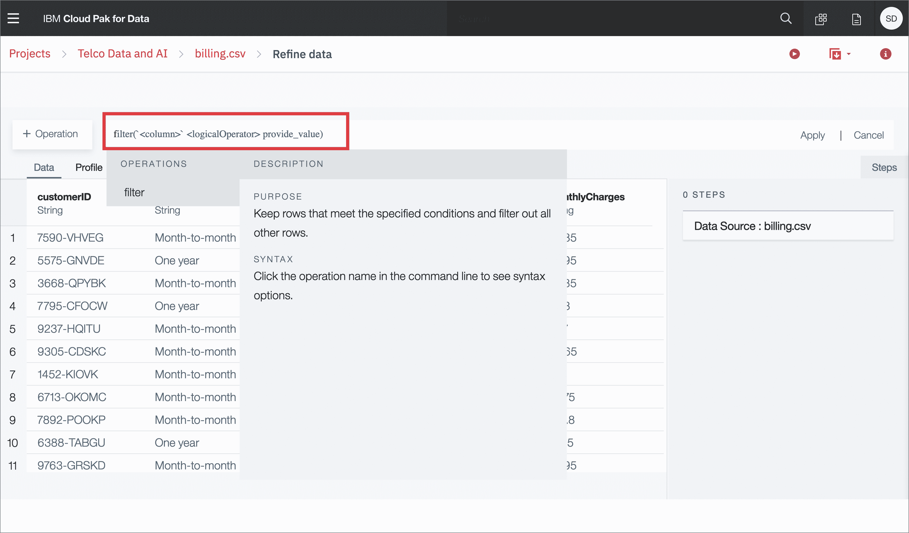
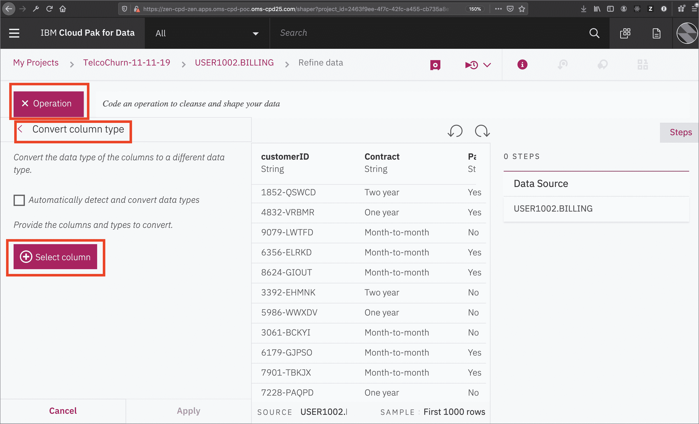

# 利用 Data Refinery 实现数据可视化

> 原文：[`developer.ibm.com/zh/tutorials/data-visualization-with-data-refinery/`](https://developer.ibm.com/zh/tutorials/data-visualization-with-data-refinery/)

**本教程纳入 [IBM Cloud Pak for Data 快速入门学习路径](https://developer.ibm.com/zh/series/cloud-pak-for-data-learning-path/)**。

| 级别 | 主题 | 类型 |
| --- | --- | --- |
| 100 | [IBM Cloud Pak for Data 简介](https://developer.ibm.com/zh/articles/intro-to-cloud-pak-for-data) | 文章 |
| 101 | [利用 Data Virtualization 实现 Db2 Warehouse 数据虚拟化](https://developer.ibm.com/zh/tutorials/virtualizing-db2-warehouse-data-with-data-virtualization) | 教程 |
| **201** | **[利用 Data Refinery 实现数据可视化](https://developer.ibm.com/zh/tutorials/data-visualization-with-data-refinery)** | **教程** |
| 202 | [使用 Watson Knowledge Catalog 查找、准备和理解数据](https://developer.ibm.com/zh/tutorials/find-prepare-and-understand-data-with-watson-knowledge-catalog) | 教程 |
| 301A | [借助内置 Notebook 的 Watson Machine Learning 进行数据分析、建模以及部署](https://developer.ibm.com/zh/patterns/data-analysis-model-building-and-deploying-with-wml) | Pattern |
| 301B | [使用 AutoAI 自动构建模型](https://developer.ibm.com/zh/tutorials/automate-model-building-with-autoai) | 教程 |
| 301C | [使用 IBM SPSS Modeler 快捷构建预测机器学习模型](https://developer.ibm.com/zh/tutorials/build-an-ai-model-visually-with-spss-modeler-flow) | 教程 |
| 401 | [利用 Watson OpenScale 监视模型](https://developer.ibm.com/zh/patterns/watson-openscale-with-watson-machine-learning-engine-on-icp4d) | Pattern |

Data Refinery 属于 IBM Watson 的一部分，它随附有 IBM Watson Studio（位于 IBM Public Cloud 上）和 IBM Watson Knowledge Catalog（使用 IBM Cloud Pak for Data 在内部部署中运行）。它属于自助式数据准备客户端，可供数据科学家、数据工程师和业务分析人员使用。您可以使用它将大量原始数据快速转换为可使用的高质量信息，为分析做好准备。对于整个组织内的人员均可信任的数据，Data Refinery 简化了这些数据的浏览、准备和交付工作。

## 学习目标

完成本教程后，用户将掌握：

*   如何将数据加载到 IBM Cloud Pak for Data 平台以配合 Data Refinery 一起使用。
*   如何通过在命令行中输入 R 代码或者从菜单中选择操作来转换样本数据集。
*   如何使用“数据流”步骤跟踪工作进展。
*   如何利用图表和图形实现数据可视化。

## 前提条件

*   [IBM Cloud Pak for Data](https://www.ibm.com/cn-zh/products/cloud-pak-for-data)

## 预估时间

完成本教程大约需要 45 分钟。

## 步骤

### 第 1 步：将 billing.csv 数据加载到 Data Refinery 中

下载 billing.csv 文件。

在 *Project* 主页上单击 `Data sets`、`+Add Data Set`，然后选中 billing.csv 文件。

单击新添加的 *billing.csv* 文件。

这样即可启动 Data Refinery 并打开数据，如下图所示：

### 第 2 步：提炼数据

我们将从 *Data* 选项卡开始操作。

在命令行中输入 R 代码或者从菜单中选择操作来转换样本数据集。例如，在命令行上输入 *filter*，这样会观察到自动完成功能将提供有关命令语法及使用方式的提示：

或者，将鼠标悬停在操作或函数名上，查看完成命令的描述和详细信息。准备就绪后，单击 Apply 对数据集应用操作。

单击 `+Operation` 按钮：

首先，我们注意到 `TotalCharges` 是一个字符串。但是，由于它代表一个十进制数字，因此我们将这些值转换为十进制。选择操作`Convert Column Type`：

单击 `+ Select column`，然后选择 `Column -> TotalCharges and Type ->Decimal`，选择 dr-convert-string-to-decimal.png 点击 `Apply`:

我们想要确保没有空值，然而 totalcharge 列刚好有一些空值，所以我们需要修复它。点击 `filter` 并且从下拉框中选择 TotalCharges 列，将 Operator Is 设置为 empty，点击 `Apply`：

可以看到，这里只有 3 行 *TotalCharges* 为空值的数据：

直接将这些行从数据集中删除即可。

首先删除你刚添加的过滤条件。您可以从单击页面顶部的撤消箭头的“Steps”部分删除它。

接下来选择 Remove empty rows 操作，选择 TotalCharges 行并单击 `Apply`：

最后，我们可以移除 `CustomerID` 列，因为它对于稍后的机器学习模型训练没有用。选择 Remove 操作，然后选择 Change column selection。 在 Select a column 选择 CustomerID 然后点击 `next` 并选择 `Apply`。

### 第 3 步：使用“数据流”步骤跟踪工作进展

如果我们执行了错误的操作该怎么办？我们可以使用圆形箭头来撤销（或重做）操作：

提炼数据时，IBM Data Refinery 会跟踪数据流中的步骤。您可以修改这些步骤，甚至可以选中某个步骤以返回到数据转换过程中的某一特定时刻。

要查看数据流中已执行的步骤，可单击 *Steps* 按钮。这样将显示您已对数据执行的操作：

您可实时修改这些步骤，并保存以供将来使用。

### 第 4 步：执行数据概要分析

单击 *Profile* 选项卡将显示有关数据的多个直方图概览。

您可通过直方图来深入洞察数据：

*   按月签约的客户数量是签订 2 年期或 1 年期合同的客户数量的两倍。

*   越来越多的客户选择无纸化记账，但仍约有 40% 的客户选择通过邮寄方式接收账单。

*   您可以查看 *MonthlyCharges* 和 *TotalCharges* 的分布情况。

*   在 Churn 列中，可看到大量客户将取消其服务。

### 第 5 步：利用图表和图形实现数据可视化

选择 *Visualizations* 选项卡会显示一个选项，通过该选项可选择要可视化的列。单击下方图像显示 `Click here` 的 *Columns to Visualize* 的空白处，选择 *TotalCharges*，然后在准备就绪后单击 *Visualize data*：

默认情况下，先会看到以直方图形式显示的数据。您可以选择其他图表类型。接下来，我们将单击 `Scatter plot` 来选取散点图：

在散点图中，为 X 轴选择 *TotalCharges*，为 Y 轴选择 *MonthlyCharges*，并为 *Color map* 选择 *Churn*：

向下滚动，为散点图提供一个标题，如果需要，还可以提供子标题。单击 `Actions` 下的齿轮图标，执行 *Start over*、*Download chart details*、*Download chart image* 或 *Global visualization preferences* 等任务：

可以看到，在 *Global visualization preferences* 中，可以对 *Titles*、*Tools*、*Color schemes* 和 *Notifications* 执行各种操作。让我们把 *Color scheme* 设置为 *Vivid*：

现在，所有图表的颜色都将体现此效果：

## 结束语

本教程为您展示了 IBM Cloud Pak for Data 上的 IBM Data Refinery 的一小部分功能。同时还说明了如何通过命令行使用 R 代码来转换数据，对列执行各种操作，例如，更改数据类型、移除空行或删除整列等。接下来，本教程还说明了数据流中的所有步骤均记录在案，因此您可以移除步骤、重复步骤或者编辑单个步骤。本教程还展示了如何快速执行数据概要分析，查看直方图和每列的统计信息。最后，本教程说明了如何创建更深入的可视化效果，并创建散点图映射（TotalCharges 对比 MonthlyCharges），以及通过颜色来突出显示客户流失率结果。

本教程纳入 [IBM Cloud Pak for Data 快速入门学习路径](https://developer.ibm.com/zh/series/cloud-pak-for-data-learning-path/)。要继续学习本系列并了解有关 IBM Cloud Pak for Data 的更多信息，可阅读下一个教程[使用 Watson Knowledge Catalog 查找、准备和理解数据](https://developer.ibm.com/zh/tutorials/find-prepare-and-understand-data-with-watson-knowledge-catalog)。

本文翻译自：[Data visualization with data refinery](https://developer.ibm.com/tutorials/data-visualization-with-data-refinery/)（2019-11-25）。