# 通过 Databases for MongoDB 监视云 Java 微服务的响应时间

> 原文：[`developer.ibm.com/zh/tutorials/check-response-times-for-crud-services-with-mongodb-and-java-liberty/`](https://developer.ibm.com/zh/tutorials/check-response-times-for-crud-services-with-mongodb-and-java-liberty/)

*（2019 年 3 月 21 日）本教程已经进行了更新以反映新的 **Compose for MongoDB** 服务名称 **IBM Cloud to Databases for MongoDB**。*

我的一位客户让我帮助其实现一个简单的仪表板概念，该概念将显示 IBM Dedicated Cloud 上公开的各种数据服务的 CRUD（创建、读取、更新、删除）操作的一系列可用性和响应时间。巧合的是，这也是一个很好的示例，展示了如何在这些数据服务上运用 CRUD 操作，这些服务既可以从本地机器上的 Java Open Liberty 服务器访问，也可以通过 VCAP 配置文件绑定到云中。

本教程将指导您检查 IBM Cloud 上托管的服务的响应时间。这是一个简单工具，还可以展示如何在 Cloudant、IBM Message Hub、MongoDB、Elastic Search 等战略数据源上的 Java 应用程序/微服务中执行基本的 CRUD 操作。

这篇操作技巧文章通过示例展示了如何使用 IBM Cloud 上托管和管理的 **Desatabases for MongoDB**。这里展示的方法是，利用通过访问 CRUD 操作获得的报告，生成一个 JSON 响应文件，并提供访问每个操作所需的时间，以及总操作时间。您将尝试创建的响应文件示例如下所示。

```
{
    "service": "mongodb",
    "operations": [{
            "type": "create",
            "response_time": 30,
            "response_code": 200,
            "desc": {
                "visitor id": "594ddeee34a639002645674d"
            }
        },
        {
            "type": "read",
            "response_time": 25,
            "response_code": 200,
            "desc": {
                "visitor id": "594ddeee34a639002645674d"
            }
        },
        {
            "type": "update",
            "response_time": 49,
            "response_code": 200,
            "desc": {
                "visitor id": "594ddeee34a639002645674d"
            }
        },
        {
            "type": "delete",
            "response_time": 28,
            "response_code": 200,
            "desc": {
                "deleted visitor id": "594ddeee34a639002645674d"
            }
        }
    ],
    "response_code": 200,
    "desc": "operations implemented CRUD/CRUD"
} 
```

## 学习目标

学完本教程后，读者将会了解如何：

*   跟踪服务响应时间
*   在本地和云中运行 Java Open Liberty 服务器
*   将 Java Open Liberty 服务器连接到公开的服务

## 前提条件

**免费试用 IBM Cloud**

利用 [IBM Cloud Lite](https://cocl.us/IBM_CLOUD_GCG) 快速轻松地构建您的下一个应用程序。您的免费帐户从不过期，而且您会获得 256 MB 的 Cloud Foundry 运行时内存和包含 Kubernetes 集群的 2 GB 存储空间。[了解所有细节](https://developer.ibm.com/dwblog/2017/building-with-ibm-watson/)并确定如何开始。

在开始之前，您的机器上需要有以下软件：

*   [Git](https://git-scm.com/)
*   [Cloud Foundry CLI](https://docs.cloudfoundry.org/cf-cli/install-go-cli.html)
*   [Maven](https://maven.apache.org/install.html)

您还需要：

*   一个 [IBM Cloud](https://cocl.us/IBM_CLOUD_GCG) 帐户（请注意，我们将使用非 Lite 版服务）
*   一个 IDE。在本例中，我使用 [Eclipse with IBM Cloud 插件](https://marketplace.eclipse.org/content/ibm-eclipse-tools-ibm-cloud)将应用程序部署到云中。

## 预估时间

若是第一次设置环境，完成整个实验大约需要 20 分钟到 60 分钟。

## 步骤

1

### 克隆样本应用程序

1.  克隆 [`github.com/blumareks/BluemixTestDashboard`](https://github.com/blumareks/BluemixTestDashboard) GitHub 存储库。

    ```
    git clone https://github.com/blumareks/BluemixTestDashboard 
    ```

2.  将目录更改为 MongoDB 样本应用程序所在的目录。为此，请使用以下指令：

    ```
    cd BluemixTestDashboard/GetStartedJavaMongoDb 
    ```

做到这里暂时足够了。我们接下来将在 IBM Cloud 上配置一些资源，然后返回到克隆的存储库。

2

### 创建云服务

1.  登录到 [IBM Cloud](https://cocl.us/IBM_CLOUD_GCG) 控制台。

2.  在 *Catalog* 中搜索 **Databases for MongoDB** 和 **Liberty for Java**。

    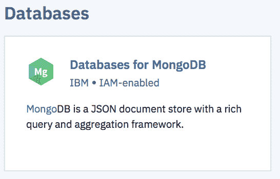 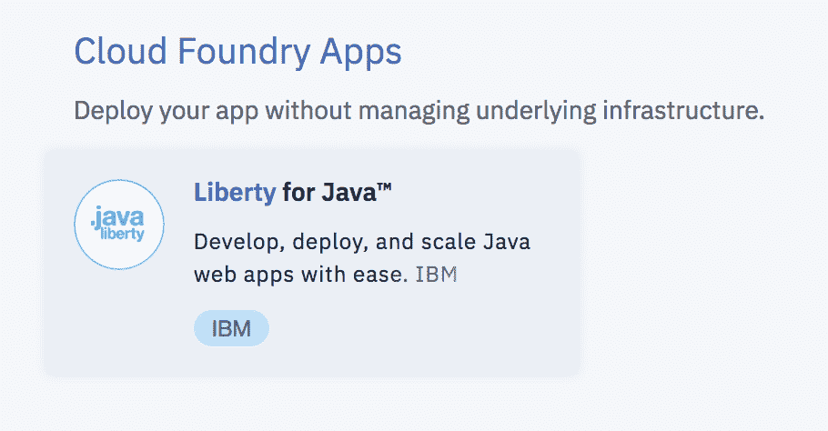

3.  创建 `Liberty for Java` 样本应用程序和 `Databases for MongoDB` 服务。

4.  创建它们后，将 MongoDB 服务与 Liberty for Java 应用程序绑定在一起。

    1.  选择 Liberty for Java 服务的 **Connections** 选项卡，选择 **Create connection** 按钮。

        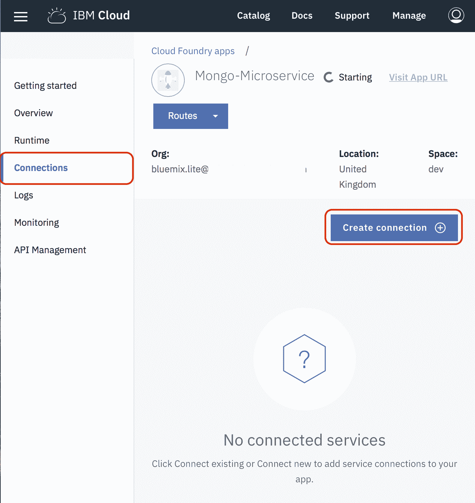

    2.  选择 **Databases for MongoDB** 服务。

        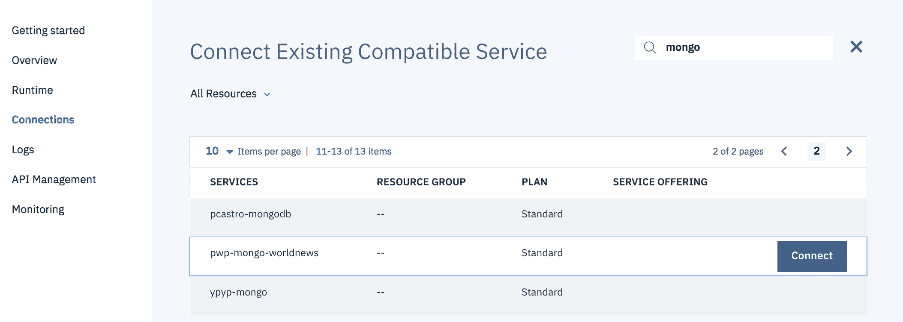

    3.  单击 **Connect** 按钮。

        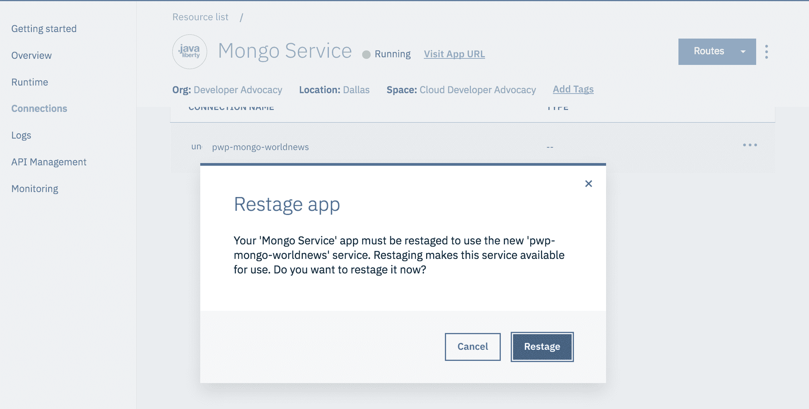

    此操作将会启动 Liberty for Java 服务的重新载入过程。

3

### 将 TLS/SSL 的 JVM 系统属性连接到 Databases for MongoDB

1.  转到 **Databases for MongoDB** 服务中的 **Service Credentials** 选项卡。

2.  从菜单中，选择 **View Credentials**。来自 VCAP 文件的连接凭证如下所示：

    ```
    {
        "connection": {
            "cli": {
                "arguments": [
                    [
                        "-u",
                        "ibm_cloud_[characters removed]",
                        "-p",
                        "[characters removed]",
                        "--ssl",
                        "--sslCAFile",
                        "b226140c-3543-11e9-837a-ae06e730b715",
                        "--authenticationDatabase",
                        "admin",
                        "--host",
                        "replset/4ffb04cb-473b-4895-879e-becf8fb4ac40-0.d7deeff0d58745aba57fa5c84685d5b4.databases.appdomain.cloud:31676,4ffb04cb-473b-4895-879e-becf8fb4ac40-1.d7deeff0d58745aba57fa5c84685d5b4.databases.appdomain.cloud:31676"
                    ]
                ],
                "bin": "mongo",
                "certificate": {
                    "certificate_base64": "[characters removed]",
                    "name": "[characters removed]"
                },
                "composed": [
                    "mongo -u ibm_cloud_[characters removed] -p [characters removed] --ssl --sslCAFile b226140c-3543-11e9-837a-ae06e730b715 --authenticationDatabase admin --host replset/4ffb04cb-473b-4895-879e-becf8fb4ac40-0.d7deeff0d58745aba57fa5c84685d5b4.databases.appdomain.cloud:31676,4ffb04cb-473b-4895-879e-becf8fb4ac40-1.d7deeff0d58745aba57fa5c84685d5b4.databases.appdomain.cloud:31676"
                ],
                "environment": {},
                "type": "cli"
            },
            "mongodb": {
                "authentication": {
                    "method": "direct",
                    "password": "[characters removed]",
                    "username": "ibm_cloud_[characters removed]7"
                },
                "certificate": {
                    "certificate_base64": "[characters removed]",
                    "name": "b226140c-3543-11e9-837a-ae06e730b715"
                },
                "composed": [
                    "mongodb://ibm_cloud_[characters removed]:[characters removed]@4ffb04cb-473b-4895-879e-becf8fb4ac40-0.d7deeff0d58745aba57fa5c84685d5b4.databases.appdomain.cloud:31676/ibmclouddb?authSource=admin",
                    "mongodb://ibm_cloud_[characters removed]:[characters removed]@4ffb04cb-473b-4895-879e-becf8fb4ac40-1.d7deeff0d58745aba57fa5c84685d5b4.databases.appdomain.cloud:31676/ibmclouddb?authSource=admin"
                ],
                "hosts": [{
                        "hostname": "4ffb04cb-473b-4895-879e-becf8fb4ac40-0.d7deeff0d58745aba57fa5c84685d5b4.databases.appdomain.cloud",
                        "port": 31676,
                        "protocol": "mongodb"
                    },
                    {
                        "hostname": "4ffb04cb-473b-4895-879e-becf8fb4ac40-1.d7deeff0d58745aba57fa5c84685d5b4.databases.appdomain.cloud",
                        "port": 31676,
                        "protocol": "mongodb"
                    }
                ],
                "path": "/ibmclouddb",
                "query_options": {
                    "authSource": "admin"
                },
                "scheme": "mongodb",
                "type": "uri"
            }
        },
        "instance_administration_api": {
            "deployment_id": "crn:v1:bluemix:public:databases-for-mongodb:us-south:a/[characters removed]:[characters removed]::",
            "instance_id": "crn:v1:bluemix:public:databases-for-mongodb:us-south:a/[characters removed]:[characters removed]::",
            "root": "https://api.us-south.databases.cloud.ibm.com/v4/ibm"
        }
    } 
    ```

3.  向下滚动，可以注意到该连接已启用 SSL。如果您没有凭证文件，请使用默认设置创建一个凭证文件。复制整个 json。您将需要 `certificate` 的以下部分：

    ```
    {
        "certificate": {
            "certificate_base64": "[characters removed]",
            "name": "b226140c-3543-11e9-837a-ae06e730b715"
        }
    } 
    ```

    `composed` 中的第一个链接：

    ```
    {
        "composed": [
            "mongodb://ibm_cloud_[characters removed]:[characters removed]@4ffb04cb-473b-4895-879e-becf8fb4ac40-0.d7deeff0d58745aba57fa5c84685d5b4.databases.appdomain.cloud:31676/ibmclouddb?authSource=admin",
            "mongodb://ibm_cloud_[characters removed]:[characters removed]@4ffb04cb-473b-4895-879e-becf8fb4ac40-1.d7deeff0d58745aba57fa5c84685d5b4.databases.appdomain.cloud:31676/ibmclouddb?authSource=admin"
        ]
    } 
    ```

    从同一个 `composed` 中，您可以采用辅助 URL 来更新 `hosts`：

    ```
    {
        "hosts": [{
                "hostname": "4ffb04cb-473b-4895-879e-becf8fb4ac40-0.d7deeff0d58745aba57fa5c84685d5b4.databases.appdomain.cloud",
                "port": 31676,
                "protocol": "mongodb"
            },
            {
                "hostname": "4ffb04cb-473b-4895-879e-becf8fb4ac40-1.d7deeff0d58745aba57fa5c84685d5b4.databases.appdomain.cloud",
                "port": 31676,
                "protocol": "mongodb"
            }
        ]
    } 
    ```

    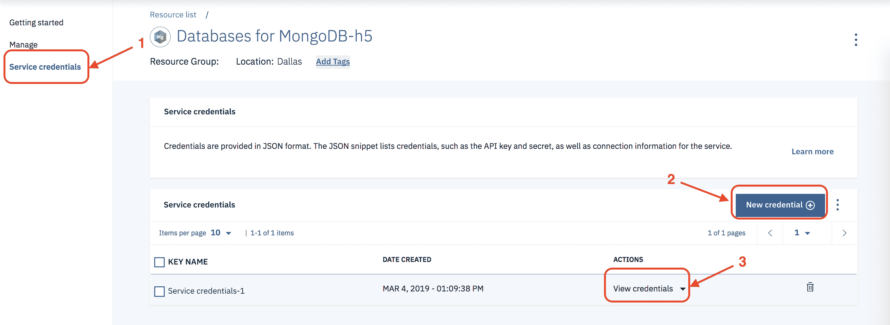

    我们需要在应用程序中设置多个 JVM 系统属性，以确保客户端能验证服务器提供的 TLS/SSL 证书：

    *   `javax.net.ssl.trustStore`：包含签名权威机构证书的信任库路径。
    *   `javax.net.ssl.trustStorePassword`：访问此信任库的密码。

    请注意，此信任库通常是使用 JDK 中提供的 `keytool` 命令行程序创建的。例如：

    ```
    keytool -importcert -trustcacerts -file <path to certificate authority file>  -keystore <path to trust store> -storepass <password> 
    ```

4.  返回到 **Databases for MongoDB** 控制台，获取 **Credentials** 页面上提供的 base64 编码的 SSL 证书。您对需要对证书进行 **base64** 解码。我使用了 [`www.base64decode.org`](https://www.base64decode.org) 服务来实现。在对复制的证书进行解码后，便可以在下一步中使用这个证书。

5.  将 SSL 证书保存到一个文件中：

    ```
    cat > mongodbcert.crt 
    ```

    证书内容应该类似于：

    ```
    -----BEGIN CERTIFICATE-----
    LS0tLS1CRUdJTiBDRVJUSUZJQ0FURS0
    [... removed couple lines ...]
    VSVElGSUNBVEUtLS0tLQo
    -----END CERTIFICATE----- 
    ```

6.  使用 `keytool` 命令为您的系统创建 MongoDB 密钥库。请注意，您可能希望考虑将该密码更改为更合适的密码。

    ```
    keytool -importcert -trustcacerts -file ./mongodbcert.crt -keystore ./mongoKeyStore -storepass aftereight 
    ```

7.  完成上述操作后，将 `mongoKeyStore` 放在克隆的存储库的这个路径中：

    ```
    GetStartedJavaMongoDb/src/main/resources/mongoKeyStore 
    ```

8.  您可能需要对 IBM Cloud 连接中的行进行注释，并将其切换到本地存储，方法是将从 github 中复制的 `MongoDbVisitorStore.java` 文件中取消注释以下行，位置如下：

    ```
    BluemixTestDashboard/GetStartedJavaMongoDb/src/main/java/wasdev/sample/store 
    ```

    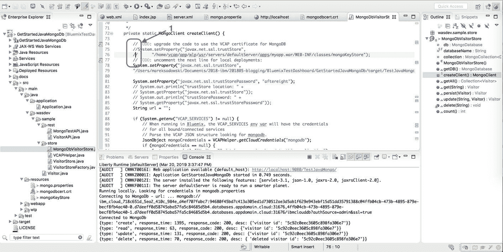

    此外，对于本地 Liberty 和 MongoDB 测试，您需要在本地文件中的以下位置定义 MongoDB URL：`BluemixTestDashboard/GetStartedJavaMongoDb/src/main/resources/mongo.properties`。为此，请使用先前从 JSON 中捕获的元素：

    *   URL
    *   host2 的部分；
    *   在 URL 的末尾添加 `&ssl=true`。

    它应如下所示：

    ```
    mongo_url=mongodb://ibm_cloud_[characters removed]:[characters removed]@4ffb04cb-473b-4895-879e-becf8fb4ac40-0.d7deeff0d58745aba57fa5c84685d5b4.databases.appdomain.cloud:31676,4ffb04cb-473b-4895-879e-becf8fb4ac40-1.d7deeff0d58745aba57fa5c84685d5b4.databases.appdomain.cloud:31676/ibmclouddb?authSource=admin&ssl=true 
    ```

9.  在项目根目录中，在一个终端运行 Maven（运行 `mvn --version` 来确保它已安装)：

    ```
    mvn install 
    ```

    `mvn install` 后的文档将存储在本地的这个位置：

    ```
    /your-path-to-the-target/GetStartedJavaMongoDb/target/TestJavaMongo-1.0-SNAPSHOT/WEB-INF/classes/mongoKeyStore 
    ```

    或者 IBM Cloud 上（在 `cf push` 命令后）：

    ```
    /home/vcap/app/wlp/usr/servers/defaultServer/apps/myapp.war/WEB-INF/classes/mongoKeyStore 
    ```

典型的应用程序还需要设置一些 JVM 系统属性，以确保客户端向 MongoDB 提供一个 TLS/SSL 证书：

*   `javax.net.ssl.keyStore`：包含客户端 TLS/SSL 证书的密钥库路径。
*   `javax.net.ssl.keyStorePassword`：访问此密钥库的密码。

4

### 通过 IBM Cloud 中的 Databases for MongoDB 在本地运行 Open Liberty

为了在本地测试并运行该服务，可能需要在本地服务器上安装 JAXRS-2.0 功能。我将使用 Eclipse IDE 来实现此目的。添加了 JAXRS-2.0 的服务器配置屏幕如下图所示：

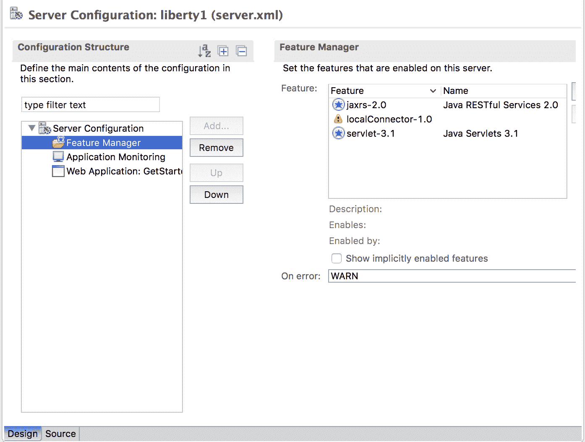

Eclipse IDE 管理的本地 Liberty 服务器的源代码如下所示：

```
<server description="new server">
    <!-- Enable features -->
    <featureManager>
        <feature>localConnector-1.0</feature>
        <feature>servlet-3.1</feature>
        <feature>jaxrs-2.0</feature>
    </featureManager>
    <applicationMonitor updateTrigger="mbean"/>
    <webApplication contextRoot="TestJavaMongo" id="GetStartedJavaMongoDb" location="TestJavaMongo.war" name="GetStartedJavaMongoDb"/>
</server> 
```

使用 `mvn install` 命令构建该项目后，就可以在上面配置的本地服务器上运行它了。

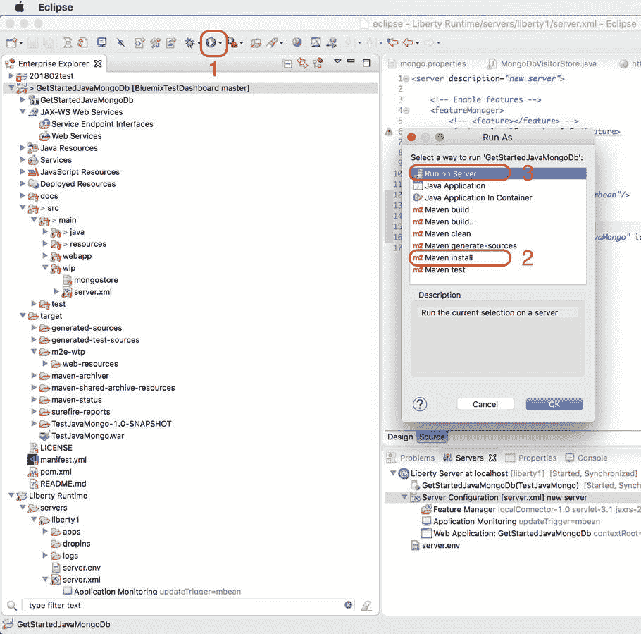

下图显示了在本地调用该服务后的结果：

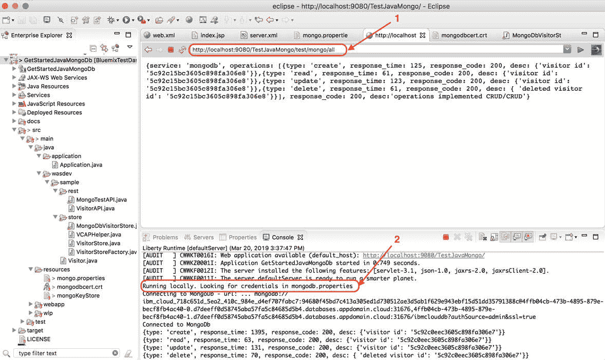

首次调用大约用了 5 秒的往返时间（我们需要创建数据库并远程运行所有内容），此时间不是非常令人印象深刻。但下一步将介绍如何在 IBM Cloud 中运行相同的服务，那时的响应速度至少快 10 倍。以下是我的结果，但请记住，以后的调用会更快，因为我们的服务已经配置好并建立了连接。

```
{
    "service": "mongodb",
    "operations": [{
            "type": "create",
            "response_time": 386,
            "response_code": 200,
            "desc": {
                "visitor id": "5aec8faf17683ad076f4fc58"
            }
        },
        {
            "type": "read",
            "response_time": 303,
            "response_code": 200,
            "desc": {
                "visitor id": "5aec8faf17683ad076f4fc58"
            }
        },
        {
            "type": "update",
            "response_time": 579,
            "response_code": 200,
            "desc": {
                "visitor id": "5aec8faf17683ad076f4fc58"
            }
        },
        {
            "type": "delete",
            "response_time": 164,
            "response_code": 200,
            "desc": {
                "deleted visitor id": "5aec8faf17683ad076f4fc58"
            }
        }
    ],
    "response_code": 200,
    "desc": "operations implemented CRUD/CRUD"
} 
```

5

### 通过 IBM Cloud 中的 Databases for MongoDB 运行 Open Liberty

至少可通过两种方式在云中部署和运行此服务。您可以手动调节 Cloud Foundry 文件并使用 Cloud Foundry CLI 运行它，或者使用适用于 Eclipse 的 IBM Cloud 连接器。在本教程中，我们使用了 Cloud Foundry CLI。

1.  从 IBM Cloud 下载 CLI。

    1.  转到该 Liberty 服务。

    2.  选择 **Getting started** 选项卡。

    3.  下载命令行接口：

        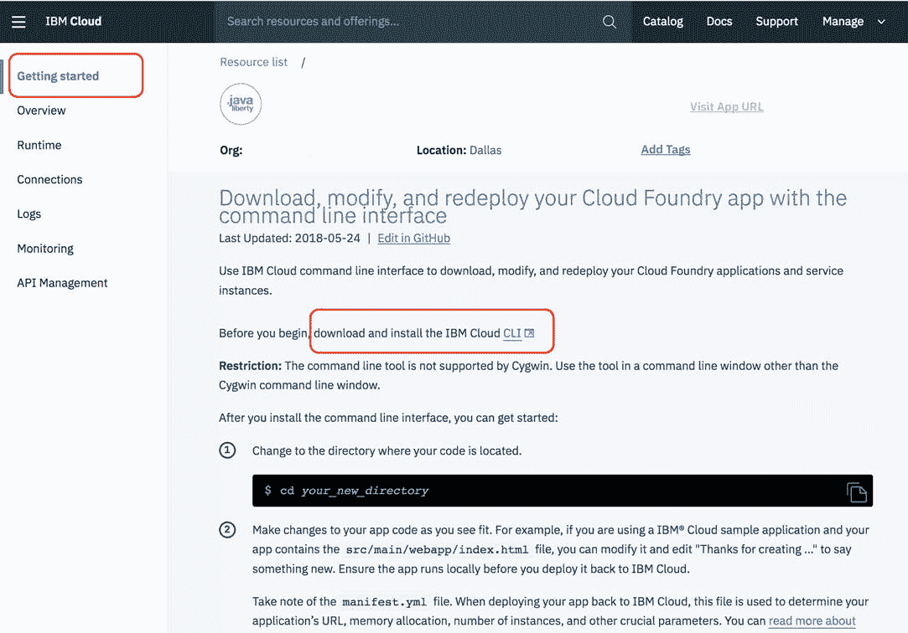

2.  安装 CLI 后，就可以运行 version 命令：

    ```
    ibmcloud --version
    ibmcloud version 0.6.6+d4d59ab5-2018-03-20T07:49:59+00:00 
    ```

3.  设置您的访问点。（请注意，API 访问点取决于云在美国、欧盟、澳大利亚等国所在的位置。）

    ```
    ibmcloud api https://api.<your access point here> 
    ```

4.  登录到服务。（请注意，如果使用联合登录，请使用 `ibmcloud login -sso` 代替。）

    ```
    ibmcloud login -u <your-email> 
    ```

5.  登录后，可以交互式地选择要使用的组织和空间。

    ```
    ibmcloud target --cf 
    ```

6.  现在编辑 Cloud Foundry 配置文件 manifest.yml。该文件应包含应用程序（您的 Liberty 服务）的名称和绑定的 Databases for MongoDB 服务。

    在本例中，该文件如下所示：

    ```
    applications:
     - name: <your service name>
       random-route: true
       path: target/TestJavaMongo.war
       memory: 256M
       instances: 1
       name: test-java-mongodb
       host: test-java-mongodb 
    ```

7.  在 Java 类文件中更新 MongoDB 密钥库在云中的位置：`MongoDbVisitorStore.java`

8.  您现在可以使用 Maven 构建适用于云的应用程序：

    ```
    mvn clean
    mvn install 
    ```

`mvn` 命令成功完成运行后，您就可以将应用程序推送到云了。这将花费几分钟时间，足够喝一杯咖啡了。:-)

```
ibmcloud app push <your service name> 
```

可以考虑查看一下该文档的日志 – 在该服务的仪表板上（参见 **Logs** 选项卡）或在终端使用 CLI：

```
ibmcloud app logs <your service name> 
```

但是注意，CRUD 操作比第一次调用快 100 倍，比来自本地机器的远程调用快 10 倍。

```
{
    "service": "mongodb",
    "operations": [{
            "type": "create",
            "response_time": 12,
            "response_code": 200,
            "desc": {
                "visitor id": "5aecb5b0705978002421614a"
            }
        },
        {
            "type": "read",
            "response_time": 18,
            "response_code": 200,
            "desc": {
                "visitor id": "5aecb5b0705978002421614a"
            }
        },
        {
            "type": "update",
            "response_time": 11,
            "response_code": 200,
            "desc": {
                "visitor id": "5aecb5b0705978002421614a"
            }
        },
        {
            "type": "delete",
            "response_time": 8,
            "response_code": 200,
            "desc": {
                "deleted visitor id": "5aecb5b0705978002421614a"
            }
        }
    ],
    "response_code": 200,
    "desc": "operations implemented CRUD/CRUD"
} 
```

## 结束语

希望您喜欢阅读本教程！我的下一篇教程将介绍如何添加一个应用程序来读取、分析和存储结果。保持关注，可以在 Twitter [@blumareks](https://twitter.com/blumareks) 或 Medium [@blumareks](https://medium.com/@blumareks/) 上关注我，了解更多的更新信息！

本文翻译自：[Monitor response times of cloud Java microservices with Databases for MongoDB](https://developer.ibm.com/tutorials/check-response-times-for-crud-services-with-mongodb-and-java-liberty/)（2019-03-21）