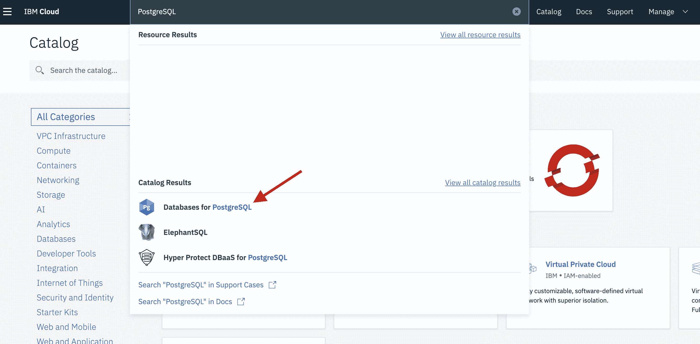
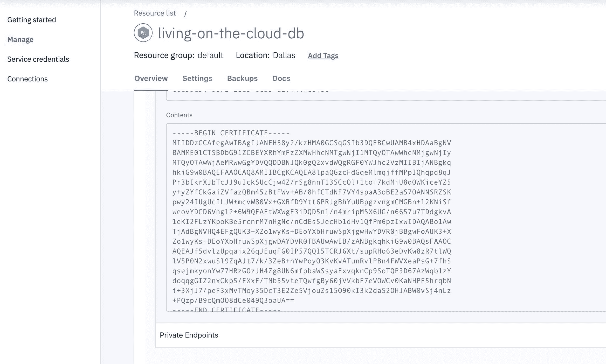
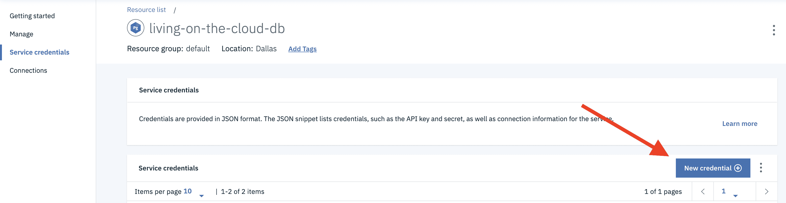
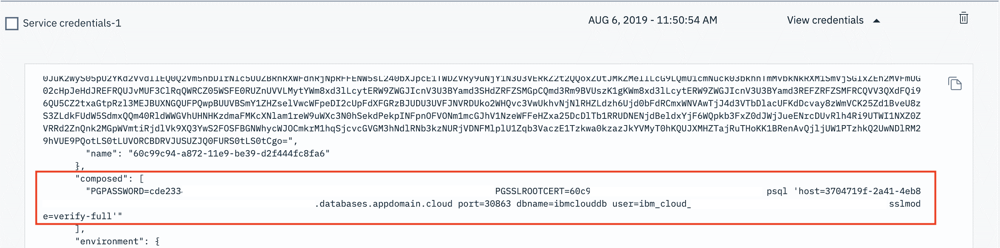

# 云端的生存之道，第 2 单元：将 Spring Boot 应用程序连接到云托管的数据库

> 原文：[`developer.ibm.com/zh/tutorials/living-on-the-cloud-2/`](https://developer.ibm.com/zh/tutorials/living-on-the-cloud-2/)

许多组织都希望迁移到云，因为云平台提供了企业满足其业务需求所需的 “turn key”（一站式/总包/全套）服务和工具。用于描述此概念的一个通用术语是 “undifferentiated heavy lifting”（无差别的繁重工作）。该术语由 Jeff Bezos 于 2006 年首次提出，简而言之，该术语指的是各组织之间完全相同的流程。例如，绝大多数组织都需要一个数据库来存储有价值的业务信息。但是，构建和维护数据库可能既昂贵又困难，而各个组织的基本要求大同小异。通过提供托管、维护、可用性、备份等功能，云平台可以处理数据库的“繁重工作”，从而让组织可以专注于核心业务。

**探索云端的生存之道**

*云端的生存之道*是一个教程和视频系列，专门帮助开发者和操作人员了解如何利用云原生思维方式构建和运行 Spring 应用程序。要查看整个系列，可查看系列概述。

在*云端的生存之道*的这个单元中，了解如何将 Spring Boot 应用程序连接到 [IBM Cloud](https://www.ibm.com/cloud) 上托管的数据库。本教程是以本系列教程中的上一个教程（介绍如何将 Spring Boot 应用程序部署到 Kubernetes 集群）中的应用程序和课程内容为基础。

## 前提条件

*   本系列教程的第 1 部分，因为本教程直接以第 1 部分中的课程内容和完成的操作为基础。
*   一个 [IBM Cloud 帐户](https://cloud.ibm.com/registration?cm_sp=ibmdev-_-developer-tutorials-_-cloudreg)

可以在此 [GitHub 仓库](https://github.com/wkorando/living-on-the-cloud/tree/2-connecting-to-a-database)中找到本教程中使用的代码。

## 云原生数据持久性

[IBM Cloud](https://www.ibm.com/cloud) 提供了许多可[持久存储数据](https://cloud.ibm.com/catalog?search=database&cm_sp=ibmdev-_-developer-tutorials-_-cloudreg)的选项。在本教程中，我们将建立一个 PostgreSQL 数据库来满足我们的数据持久性需求。IBM Cloud 还针对 PostgreSQL 数据库提供了以下两个选项：直接在 IBM Cloud 上托管的[第一方选项](https://cloud.ibm.com/catalog/services/databases-for-postgresql?cm_sp=ibmdev-_-developer-tutorials-_-cloudreg)，以及企业外部托管的第三方选项 [ElephantSQL](https://cloud.ibm.com/catalog/services/elephantsql?cm_sp=ibmdev-_-developer-tutorials-_-cloudreg)。在本系列教程中，我们将使用 IBM 提供的 PostgreSQL 选项；但请注意，只提供了按需付费级别。 如果您仍想免费试用 IBM Cloud，可以使用 ElephantSQL 提供的免费级别“Lite”。虽然在配置方面有一些细微的差别，但您仍然可以使用 ElephantSQL 来完成本教程中的步骤。

1.  如果您尚未登录，请[登录](https://cloud.ibm.com/login?cm_sp=ibmdev-_-developer-tutorials-_-cloudreg)到 IBM Cloud。

2.  登录后，在页面顶部中间的搜索框中搜索 `PostgreSQL`。

3.  选择 **Databases for PostgreSQL** 选项：

    

4.  如果想要继续使用本系列教程中构建的应用程序，请在用于配置数据库的屏幕上，将名称更改为 `living-on-the-cloud-db`。

其余的默认值都适用于我们将在本系列教程中构建的应用程序。务必滚动到页面底部以查看运行 PostgreSQL 实例的成本。您还可以使用成本估算器来查看运行 PostgreSQL 的每月成本。

在本文的后面部分中，我们将使用命令行在数据库上进行一些配置，因此需要下载并安装 `psql` 命令行工具。如果需要，可参阅[下载说明](https://www.postgresql.org/download/)。

需要等待几分钟时间来使 PostgreSQL 数据库准备就绪并完成下载，在此期间，我们来继续更新 `storm-tracker` 应用程序以处理数据库持久性。

## 使用 Spring Data 处理 CRUD

持久存储到数据库以及从数据库中读取数据都是很常见的要求。如上一节中所述，云平台可以处理数据库托管。但是，如何在应用程序自身内部处理与该数据库的通信呢？

许多数据库通信都相对简单：添加新记录、查找记录、更新现有记录以及移除记录。即：创建、读取、更新、删除或 *CRUD* （增删改查）。尽管这些任务相对简单，但要正确执行这些任务，可能需要大量的样板代码：配置数据源、处理连接、映射字段等。简而言之，即使是相对简单的“查找记录”需求，也可能需要开发者投入大量的时间。

幸运的是，这种行为多数都可以用 Spring Data 和 JPA 进行封装，这大大减少了与数据库通信相关的工作量。我们来了解一下如何更新第 1 部分中构建的 **storm-tracker** 应用程序以使用 Spring Data。

1.  更新 **pom.xml** 以添加这些依赖项：

    ```
    <dependency>
        <groupId>org.springframework.boot</groupId>
        <artifactId>spring-boot-starter-data-jpa</artifactId>
    </dependency>
    <dependency>
        <groupId>org.postgresql</groupId>
        <artifactId>postgresql</artifactId>
    </dependency> 
    ```

    *   `spring-boot-starter-data-jpa` 将引入 Spring Data 库以及基础 JPA 和 Hibernate 库，用于处理对象关系映射 (ORM) 和数据库事务行为。
    *   由于我们要连接到 PostgreSQL 数据库，因此需要使用 `postgresql`。
2.  将 `version` 标签更新为 `0.0.2-SNAPSHOT`。稍后将新版本的代码上传到容器注册表时，这一点将很重要：

    ```
    <version>0.0.2-SNAPSHOT</version> 
    ```

3.  更新 **pom.xml** 后，下一步是创建实体模型。由于该服务的名称是 **storm-tracker**，因此我们要创建一个名为 `Storm` 的类，该类将用于存储要跟踪的风暴（storm）记录。

    在 `com.ibm.developer.stormtracker` 下，创建类 `Storm`。运行以下代码，我们将遍历该类中的所有元素。

    ```
    @Entity
    @Table(name = "storms")
    public class Storm {

        @Id
        @GeneratedValue(generator = "storms_id_generator")
        @SequenceGenerator(name = "storms_id_generator", allocationSize = 1, initialValue = 10)
        private long id;
        private String startDate;
        private String endDate;
        private String startLocation;
        private String endLocation;
        private String type;
        private int intensity;

        Storm() {
        }

        public Storm(String startDate, String endDate, String startLocation, String endLocation, String type,
                int intensity) {
            this.startDate = startDate;
            this.endDate = endDate;
            this.startLocation = startLocation;
            this.endLocation = endLocation;
            this.type = type;
            this.intensity = intensity;
        }

        public long getId() {
            return id;
        }

        public String getStartDate() {
            return startDate;
        }

        public String getEndDate() {
            return endDate;
        }

        public String getStartLocation() {
            return startLocation;
        }

        public String getEndLocation() {
            return endLocation;
        }

        public String getType() {
            return type;
        }

        public int getIntensity() {
            return intensity;
        }

    } 
    ```

    *   `@Entity` 将类标记为由 JPA 进行跟踪的实体。

    *   `@Table` 将该实体映射到用于持久存储该实体的表，并且 `name` 字段将定义该表的名称。该注解是可选的；如果未定义表，那么 `Storm` 将映射到表 `Storm`。

    *   `@Id` 将该字段标记为主键。

    *   `@GeneratedValue` 将该字段标记为自动生成其值。`generator` 字段是一个可选字段，用于定义用于生成值的生成器。

    *   `@SequenceGenerator` 将定义可供 `@GeneratedValue` 用于生成值的生成器。基础数据库支持的生成器类型会[有所不同](https://vladmihalcea.com/hibernate-identity-sequence-and-table-sequence-generator/)。

    *   默认情况下，JPA 会将类中的所有字段映射到列，并将 Java 中使用的 camelCase 表示法转换为数据库中通常使用的 snake_case，例如 `startLocation` 将转换为列名 `start_location`。

Spring Data 使用仓库概念来处理数据库交互。Spring Data 提供了多个[预定义的接口](https://docs.spring.io/spring-data/commons/docs/current/api/org/springframework/data/repository/Repository.html)。我们将使用 `CrudRepository<T, ID>` ([javadoc](https://docs.spring.io/spring-data/commons/docs/current/api/org/springframework/data/repository/CrudRepository.html))，它本身具有多个预定义的方法，包括按 id 查找、将实体持久存储到数据库、检索所有实体等等。

通常，预定义的查询不足以满足您的需要，因此 Spring Data 提供了两种用于定义定制查询的机制。对于更复杂的查询，提供了 `@Query`，它允许使用 [JPQL](https://docs.oracle.com/html/E13946_04/ejb3_langref.html) 来定义查询。但对于简单查询，您可以使用 Spring Data 的语义查询引擎。Spring Data 能够通过仓库接口中定义的[方法签名](https://docs.spring.io/spring-data/jpa/docs/current/reference/html/#repositories.query-methods.query-creation)的名称来派生查询。例如，如果我们要按风暴开始的位置查找所有风暴，那么可以通过编写方法签名 `findByStartLocation(String startLocation)` 来实现。

鉴于上述内容，我们使用了一个与下面类似的仓库接口：

```
public interface StormRepo extends CrudRepository<Storm, Long> {
    public Iterable<Storm> findByStartLocation(String type);
} 
```

我们希望能够与该仓库进行交互，因此让我们来更新 `StormTrackerController`。通常，在控制器与仓库类之间存在一个或多个服务类，其中包括业务逻辑、输入验证、合并结果、修改值等功能。 我们还没有这些要求，因此，此时没必要添加服务类。

更新后的控制器类应如下所示：

```
@RestController
@RequestMapping("/api/v1/storms")
public class StormTrackerController {

    private StormRepo repo;

    public StormTrackerController(StormRepo repo) {
        this.repo = repo;
    }

    @GetMapping
    public ResponseEntity<Iterable<Storm>> findAllStorms() {
        return ResponseEntity.ok(repo.findAll());
    }

    @GetMapping("/{stormId}")
    public ResponseEntity<Storm> findById(@PathVariable long stormId) {
        return ResponseEntity.ok(repo.findById(stormId).get());
    }

    @PostMapping
    public ResponseEntity<?> addNewStorm(@RequestBody Storm storm) {
        storm = repo.save(storm);
        return ResponseEntity.created(URI.create("/api/v1/storms/" + storm.getId())).build();
    }
} 
```

该应用程序的最后一步是更新 `application.properties` 文件以定义数据源。但是，由于其中许多属性值取决于我们在后续步骤中执行的一些配置工作，因此我们暂时不执行此步骤。

有关如何使用 Spring Data 的更多信息，请查看其[项目页面](https://spring.io/projects/spring-data)。

## 配置数据库和 Kubernetes 集群

至此，PostgreSQL 数据库应该已经完成初始化，并且应该已在系统上安装了 **psql**。

我们需要执行的第一步是创建用于配置该数据库的凭证。

1.  转至 [IBM Cloud](https://cloud.ibm.com/?cm_sp=ibmdev-_-developer-tutorials-_-cloudreg)（您此时应仍处于登录状态）。

2.  在页面的顶部中心，搜索 `living-on-the-cloud-db`，然后选择所显示的结果。

    这将启动 PostgreSQL 数据库服务仪表板。

    **注意：** 如果无法打开页面，那么可能尚未配置该数据库。在此情况下，请等待几分钟，然后再继续。

3.  向下滚动。在页面底部，您应该会看到一个标记为“**TLS certificate**”的字段，其中包含数据库的自签名证书，我们可以使用该证书在应用程序与数据库之间安全地进行通信。

    

4.  在 `~/.postgresql` 中（如果您使用的是 Windows，那么在 `%APPDATA%\postgresql` 中）创建名为 **root.crt** 的文件。

5.  将“**Contents**”文本字段中的所有内容复制到 **root.crt** 中，然后进行保存。稍后，**psql** 将在连接到 PostgreSQL 数据库时使用此证书。

6.  在屏幕的左侧，选择 **Service credentials** 选项。

7.  我们可以在该“Service credentials”页面中创建新凭证。单击页面右侧的（蓝色）“**New credential**”按钮。

    

    默认值适用；但如果您想要使用一个比“Service credentials-1”更令人难忘的名称，那么可随时进行更改。

8.  创建凭证后，展开 **View credentials**，此时应该会显示 JSON。

9.  查找值 `composed`。

    

10.  打开命令行终端，然后将值复制并粘贴到终端中，**但不要按 Enter 键**。您将要移除 `PGSSLROOTCERT` 值，因为我们之前已将证书添加到 **.postgresql** 文件夹。

11.  移除 `PGSSLROOTCERT` 后，按 Enter 键，并且您应该会登录到数据库。

    我们可以在此处配置数据库。

12.  更新数据库以匹配我们刚刚创建的 **Storm** JPA 实体，并添加几条记录。以下 sql 语句可实现此目的：

    ```
    create sequence storms_id_generator start 10 increment 1;

    create table storms (id int8 not null, end_date varchar(255), end_location varchar(255), intensity int4 not null, start_date varchar(255), start_location varchar(255), type varchar(255), primary key (id));

    insert into storms (id, start_date, end_date, start_location, end_location, type, intensity) values (nextval('storms_id_generator'), '10-10-2018', '10-13-2018', 'Denver, Colorado', 'Kansas City, Missouri', 'Thunderstorm', 2);

    insert into storms (id, start_date, end_date, start_location, end_location, type, intensity) values (nextval('storms_id_generator'), '01-15-2019', '01-17-2019', 'Atlantic Ocean', 'New York City, New York', 'Blizzard', 4); 
    ```

13.  运行完以上所有语句后，可以使用以下命令来注销数据库：

    ```
    \q 
    ```

14.  接下来，使用 CLI 工具登录到 IBM Cloud，并使 **kubectl** 指向您的 Kubernetes 集群。（有关详细说明，请参阅上一个教程。）

15.  登录后，运行以下命令以在 Kubernetes 集群与 PostgreSQL 数据库之间创建绑定：

    ```
    ibmcloud ks cluster-service-bind living-on-the-cloud --service living-on-the-cloud-db --namespace default 
    ```

    该命令将为 PostgreSQL 数据库创建一个新的服务凭证，并将其绑定到 Kubernetes 集群。然后，Kubernetes 会将该绑定存储为密钥。[Kubernetes 密钥](https://kubernetes.io/docs/concepts/configuration/secret/)是在 Kubernetes 集群中存储敏感信息（如数据库凭证）的安全方法。

    *   要查看 Kubernetes 集群存储的所有密钥，可以运行以下命令：

        ```
         kubectl get secrets --namespace=default 
        ```

    *   要获取有关密钥的更多详细信息，可以运行以下命令：

        ```
         kubectl get secret binding-living-on-the-cloud-db -o yaml 
        ```

    *   输出应如下所示：

        ```
         apiVersion: v1
         data:
           binding: <base64 encoded string>
         kind: Secret
         metadata:
           annotations:
             created-by-cluster-service-bind: "true"
             service-instance-id: 'crn:v1:bluemix:public:databases-for-postgresql:us-south:a/****::'
             service-key-id: 6fc0c416-f598-48f4-8d30-918730a910f8
           creationTimestamp: "2019-08-06T22:28:25Z"
           name: binding-living-on-the-cloud-db
           namespace: default
           resourceVersion: "745159"
           selfLink: /api/v1/namespaces/default/secrets/binding-living-on-the-cloud-db
           uid: 81a54292-b899-11e9-82a3-ce58a894cd59 
        ```

        其中一个重要的元素是 `base64 encoded string`。该 `binding` 字段是我们真正感兴趣的字段，因为它包含我们稍后需要的所有连接信息。

        我们可以通过解码来查看该字段的内容：

        ```
         echo <base64 string> | base64 --decode 
        ```

        在终端读取数据可能有点困难，但返回的是一个 JSON 对象，其中包含连接字符串、用户名、密码以及在连接到 PostgreSQL 数据库时所需的其他数据。也可以从我们之前所在的“Service credentials”页面中查看这些信息。

在下一部分中，我们将更新 Kubernetes 部署和 Spring Boot 应用程序以便访问 Kubernetes 密钥。

## 更新 Kubernetes 部署和 Spring Boot 应用程序

Kubernetes 使用 YAML 文件来定义如何在集群中部署和管理应用程序。在上一篇文章中部署 **storm-tracker** 应用程序时，自动生成了一个 YAML 文件。我们将需要更新此 YAML 文件，以便我们的应用程序可以与 PostgreSQL 数据库进行交互。

**注意：** 此时，如果您尚未更新，那么需要转至 **storm-tracker** 应用程序的根目录。

### 更新部署 YAML

1.  从项目根目录中运行以下命令以关闭 **storm-tracker** 的 YAML 文件：

    ```
    kubectl get deployments storm-tracker --namespace=default -o yaml > deployment.yaml 
    ```

2.  在文本编辑器中打开 **deployment.yaml**。它应如下所示：

    ```
    apiVersion: extensions/v1beta1
    kind: Deployment
    metadata:
      annotations:
        deployment.kubernetes.io/revision: "12"
        kubectl.kubernetes.io/last-applied-configuration: |
          {"apiVersion":"extensions/v1beta1","kind":"Deployment","metadata":{"annotations":{},"labels":{"run":"storm-tracker"},"name":"storm-tracker","namespace":"default","selfLink":"/apis/extensions/v1beta1/namespaces/default/deployments/storm-tracker"},"spec":{"progressDeadlineSeconds":600,"replicas":1,"revisionHistoryLimit":10,"selector":{"matchLabels":{"run":"storm-tracker"}},"strategy":{"rollingUpdate":{"maxSurge":"25%","maxUnavailable":"25%"},"type":"RollingUpdate"},"template":{"metadata":{"creationTimestamp":null,"labels":{"run":"storm-tracker"}},"spec":{"containers":[{"args":["--spring.application.json=$(BINDING)"],"env":[{"name":"BINDING","valueFrom":{"secretKeyRef":{"key":"binding","name":"binding-living-on-the-cloud"}}}],"image":"us.icr.io/openj9-demo/storm-tracker:0.0.2-SNAPSHOT","imagePullPolicy":"Always","name":"storm-tracker","resources":{},"terminationMessagePath":"/dev/termination-log","terminationMessagePolicy":"File"}],"dnsPolicy":"ClusterFirst","restartPolicy":"Always","schedulerName":"default-scheduler","securityContext":{},"terminationGracePeriodSeconds":30}}}}
      creationTimestamp: "2019-08-01T22:48:32Z"
      generation: 25
      labels:
        run: storm-tracker
      name: storm-tracker
      namespace: default
      resourceVersion: "1132314"
      selfLink: /apis/extensions/v1beta1/namespaces/default/deployments/storm-tracker
      uid: 7cb6f3c5-b4ae-11e9-9a9f-461265fcff59
    spec:
      progressDeadlineSeconds: 600
      replicas: 1
      revisionHistoryLimit: 10
      selector:
        matchLabels:
          run: storm-tracker
      strategy:
        rollingUpdate:
          maxSurge: 25%
          maxUnavailable: 25%
        type: RollingUpdate
      template:
        metadata:
          creationTimestamp: null
          labels:
            run: storm-tracker
        spec:
          containers:
            image: us.icr.io/openj9-demo/storm-tracker:0.0.1-SNAPSHOT
            imagePullPolicy: Always
            name: storm-tracker
            resources: {}
            terminationMessagePath: /dev/termination-log
            terminationMessagePolicy: File
          dnsPolicy: ClusterFirst
          restartPolicy: Always
          schedulerName: default-scheduler
          securityContext: {}
          terminationGracePeriodSeconds: 30
    status:
      availableReplicas: 1
      conditions:
      - lastTransitionTime: "2019-08-09T16:10:37Z"
        lastUpdateTime: "2019-08-09T16:10:37Z"
        message: Deployment has minimum availability.
        reason: MinimumReplicasAvailable
        status: "True"
        type: Available
      - lastTransitionTime: "2019-08-09T16:10:32Z"
        lastUpdateTime: "2019-08-09T16:10:37Z"
        message: ReplicaSet "storm-tracker-5c99cd9c5f" has successfully progressed.
        reason: NewReplicaSetAvailable
        status: "True"
        type: Progressing
      observedGeneration: 25
      readyReplicas: 1
      replicas: 1
      updatedReplicas: 1 
    ```

    我们需要从此 **deployment.yaml** 中移除大量特定于实例的信息，因为我们需要的是一个可以在将来复用的模板来告知 Kubernetes 如何部署 **storm-tracker**，而不是 **storm-tracker** 当前的快照。

3.  创建精简的 **deployment.yaml** 文件，此文件应如下所示：

    ```
    apiVersion: extensions/v1beta1
    kind: Deployment
    metadata:
      labels:
        run: storm-tracker
      name: storm-tracker
      namespace: default
      selfLink: /apis/extensions/v1beta1/namespaces/default/deployments/storm-tracker
    spec:
      progressDeadlineSeconds: 600
      replicas: 1
      revisionHistoryLimit: 10
      selector:
        matchLabels:
          run: storm-tracker
      strategy:
        rollingUpdate:
          maxSurge: 25%
          maxUnavailable: 25%
        type: RollingUpdate
      template:
        metadata:
          creationTimestamp: null
          labels:
            run: storm-tracker
        spec:
          containers:
          - image: us.icr.io/openj9-demo/storm-tracker:0.0.2-SNAPSHOT
            imagePullPolicy: Always
            name: storm-tracker
            resources: {}
            terminationMessagePath: /dev/termination-log
            terminationMessagePolicy: File
            args: ["--spring.application.json=$(BINDING)"]
            env:
            - name: BINDING
              valueFrom:
                secretKeyRef:
                  name: binding-living-on-the-cloud
                  key: binding
          dnsPolicy: ClusterFirst
          restartPolicy: Always
          schedulerName: default-scheduler
          securityContext: {}
          terminationGracePeriodSeconds: 30 
    ```

    需要关注以下两个重点方面：

    *   `image` 标签：

        ```
         - image: us.icr.io/openj9-demo/storm-tracker:0.0.2-SNAPSHOT 
        ```

        Image 标签已更新为 `0.0.2-SNAPSHOT`，因此，当我们稍后上传新的 docker 镜像时，可以确保使用的是正确的 docker 镜像。此外，通过在每次部署中更改标签版本，我们可以更轻松地跟踪 Kubernetes 集群在特定时间点正在运行的代码。

    *   以下部分始于 `image` 下方的几行：

        ```
         args: ["--spring.application.json=$(BINDING)"]
                env:
                - name: BINDING
                  valueFrom:
                    secretKeyRef:
                      name: binding-living-on-the-cloud-db
                      key: binding 
        ```

        **注意：** 在 YAML 中，空格具有特定含义。本部分具有正确的格式，因此请确保复制所有内容。

        我们来逐步查看 YAML 的这一部分，以便更好地了解所执行的操作：

        *   `args: ["--spring.application.json=$(BINDING)"]`
            在启动 docker 容器时，这会将带引号的元素附加到执行命令上。

        *   `--spring.application.json=`
            使用此属性时，Spring Boot 会自动解析 JSON 对象并将其存储为映射。

        *   `$(BINDING)`
            这是对环境变量 `BINDING` 的引用，当 Kubernetes 集群读取部署文件时，这将替换为该环境变量的值。

        *   `name: BINDING`
            这将为上述项创建环境变量。

        *   `secretKeyRef:`
            这将告知 Kubernetes 该值来自已存储的密钥。

        *   `name: binding-living-on-the-cloud-db`
            这将引用要从中提取值的已存储密钥。

        *   `key: binding`
            这是已存储密钥中要加载的特定字段。如果您之前查看过 `binding-living-on-the-cloud-db` 的内容，那么您会发现 `binding` 是 base64 编码的字符串。Kubernetes 将自动对其进行解码。在此情况下，编码数据是 JSON 对象。

### 更新 application.properties

接下来，我们需要更新 Spring-Boot 应用程序的 `application.properties` 文件。已完成的该文件应如下所示：

```
spring.datasource.url=jdbc:postgresql://${connection.postgres.hosts[0].hostname}:${connection.postgres.hosts[0].port}${connection.postgres.path}?sslmode=${connection.postgres.query_options.sslmode}
spring.datasource.username=${connection.postgres.authentication.username}
spring.datasource.password=${connection.postgres.authentication.password}
spring.datasource.driver-class-name=org.postgresql.Driver
spring.jpa.properties.hibernate.dialect=org.hibernate.dialect.PostgreSQL95Dialect 
```

由于此处需要弄清楚几个问题，所以我们来逐步查看所执行的操作。首先，Spring Boot 在属性解析方面存在一定的[优先顺序](https://docs.spring.io/spring-boot/docs/current/reference/html/spring-boot-features.html#boot-features-external-config)。[此文档](https://docs.spring.io/spring-boot/docs/current/reference/html/spring-boot-features.html#boot-features-external-config)包含完整的列表；但是在这里，将先解析命令行参数和 `spring.application.json`，然后再解析属性文件中的属性。鉴于此行为，我们可以在 `applications.properties` 文件中引用通过这些方法提供的值。

如上所述，Spring Boot 将存储 JSON（作为映射传递给 `spring.application.json`）。在上一部分中，我们还查看了 binding 字段的解码 JSON 内容。在 `application.properties` 中，我们将引用 JSON 中的元素，以填充构造数据源 bean 所需的所有属性。

Spring Boot 可以构造许多 bean，并纯粹通过传入的属性来驱动其他行为。我们将在此处构造一个数据源，但是还可以使用 Spring 属性来构造许多其他 bean 或定义其他行为。[本文档](https://docs.spring.io/spring-boot/docs/current/reference/html/appendix-application-properties.html)介绍了一些最常见的 bean 和行为。

### 更新 Dockerfile

最后一步是更新来自上一个教程的 Dockerfile。

1.  将 **root.crt** 从 `~/.postgresql`/`%APPDATA%\postgresql` 复制到项目目录的根目录中。

2.  在 Dockerfile 中，添加以下两行：

    ```
    RUN mkdir /root/.postgresql/

    COPY root.crt /root/.postgresql/ 
    ```

    已完成的 Dockerfile 应如下所示：

    ```
    FROM adoptopenjdk/openjdk8-openj9:alpine-slim

    COPY target/storm-tracker.jar /

    RUN mkdir /root/.postgresql/

    COPY root.crt /root/.postgresql/

    ENTRYPOINT ["java", "-jar", "storm-tracker.jar" ] 
    ```

    这会将 crt 复制到 docker 镜像中，而该镜像将用于加密应用程序与数据库之间的通信。

    **注意：** 我们创建的 docker 镜像使用的是 Linux，因此，即使您当前正在使用 Windows，在 Dockerfile 中仍会使用 `/root/.postgresql/` 作为路径。

3.  在部署文件、代码和 Dockerfile 全部更新后，我们将构建所有这些项，然后运行以下命令将新的 docker 镜像发送到仓库：

    ```
    mvn package docker:build -Ddocker.username=iamapikey -Ddocker.password=<your api-key> docker:push 
    ```

4.  最后，我们需要使用新的部署信息来更新 Docker。可以执行以下命令来发送之前更新的 **deployment.yaml**：

    ```
    kubectl apply -f deployment.yaml 
    ```

    您会获得与下面类似的响应：

    ```
    deployment.extensions/storm-tracker configured 
    ```

5.  在应用程序启动并连接到数据库时，请等待大约 30 秒。

6.  在等待之后，运行 **curl** 命令，或者通过浏览器转至您的应用程序：curl `http://\<node-ip\>:\<node-port\>/api/v1/storms`。可以在上一个教程中找到有关如何查找 node-ip 和 node-port 的说明。您会获得与下面类似的 JSON 返回结果：

    ```
    [  
       {  
          "id":10,
          "startDate":"10-10-2018",
          "endDate":"10-13-2018",
          "startLocation":"Denver, Colorado",
          "endLocation":"Kansas City, Missouri",
          "type":"Thunderstorm",
          "intensity":2
       },
       {  
          "id":11,
          "startDate":"01-15-2019",
          "endDate":"01-17-2019",
          "startLocation":"Atlantic Ocean",
          "endLocation":"New York City, New York",
          "type":"Blizzard",
          "intensity":4
       }
    ] 
    ```

## 结束语

以往，配置和设置像数据库这样的服务可能需要数周时间，甚至更长的时间。通过使用云平台，组织可以在一个下午就建立数据库并将应用程序连接到该数据库。如引言中所述，这极大地提升了组织的敏捷性，让组织及其开发者可以专注于核心业务目标。

您在本练习中可能已经注意到一个问题，即，需要手动与 Kubernetes 进行大量交互。 尽管在这种小规模练习中这不算什么大问题，而且这对熟悉 Kubernetes 和 kubectl 很有用，但这在实际应用程序中会成为无法衡量的问题。在本系列教程的下一个教程中，我们将研究如何设置流水线以自动完成构建、测试和部署应用程序的过程。

可以在我的 [GitHub 代码仓库](https://github.com/wkorando/living-on-the-cloud/tree/2-connecting-to-a-database)中找到本教程中使用的代码。

本文翻译自：[Living on the cloud, Unit 2: Connect a Spring Boot application to a cloud-hosted databaes](https://developer.ibm.com/tutorials/living-on-the-cloud-2/)（2019-10-09）