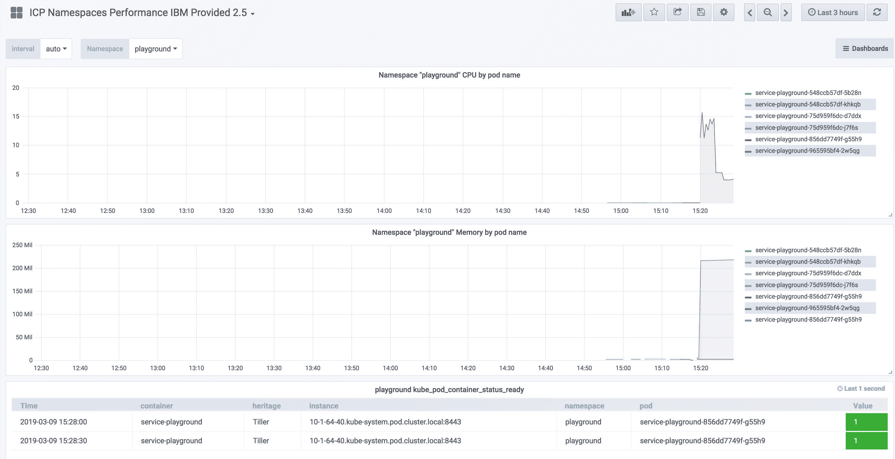

# 在 Kubernetes 中使用 Prometheus 和 Spring Boot 监控您的应用

> 原文：[`developer.ibm.com/zh/tutorials/monitoring-kubernetes-prometheus/`](https://developer.ibm.com/zh/tutorials/monitoring-kubernetes-prometheus/)

监控在任何 DevOps 项目中都不可或缺，它可用于了解您的应用程序是否可用以及您是否满足服务级别协议要求。首先将配置并公开相关应用程序的信息。本教程展示了如何使用 Kubernetes 和 Spring Boot 将应用程序指标集成到 Prometheus 中。

当团队承担起制作一款高效应用程序的任务后，您需要持续掌握应用程序状态和底层基础架构概况。您还需要基于各项条件的细化数据。团队需要收集操作系统和系统实际情况（如，CPU 和内存使用情况以及存储耗用量）等各项指标。此外，如果您希望主动监控应用程序和基础架构，那么应用程序相关指标（请求数量或特定业务用例的使用情况）对于妥善管理许多服务级别协议 (SLA) 就显得尤为重要了。

[Prometheus](https://prometheus.io/) 是一个领先的开源监控系统，它为处理大量指标数据提供了有效的途径。通过强大的查询语言，您可以直观显示数据并管理警报。Prometheus 支持各种集成，包括与 [Grafana](https://grafana.com/) 集成以提供可视化仪表板，或者与 PageDuty 和 Slack 集成以提供警报通知。基于简单文本的指标格式是 Prometheus 的主要优势之一。受支持的产品列表[非常丰富](https://prometheus.io/docs/instrumenting/exporters/)，包括数据库产品、服务器应用程序、Kubernetes 和 Java 虚拟机。

本教程展示了如何在 IBM Cloud 环境中使用 Docker 和 Helm 来处理 Spring Boot 应用程序的监控问题。IBM Cloud Kubernetes Service 包含了 Prometheus 安装。最终生成的受监控应用程序考量了多项标准指标（包括自定义应用程序指标），使用了诸如 Prometheus 和 IBM Cloud Monitoring with Sysdig 之类的监控工具。

## 前提条件

**免费试用 IBM Cloud**

利用 [IBM Cloud Lite](https://cocl.us/IBM_CLOUD_GCG) 快速轻松地构建您的下一个应用程序。您的免费帐户从不过期，而且您会获得 256 MB 的 Cloud Foundry 运行时内存和包含 Kubernetes 集群的 2 GB 存储空间。[了解所有细节](https://www.ibm.com/cloud/blog/announcements/introducing-ibm-cloud-lite-account-2)并确定如何开始。

在学习本教程之前，您需要设置以下环境：

*   云和 Kubernetes 环境，如 [IBM Cloud Kubernetes Service](https://cloud.ibm.com/docs/containers?topic=containers-getting-started&cm_sp=ibmdev-_-developer-tutorials-_-cloudreg)。
*   将 [Prometheus](https://prometheus.io/) 安装在 kube-system 名称空间中。
*   [Spring Boot](https://spring.io/projects/spring-boot) 之类的应用程序。
*   用于部署应用程序的 [Helm 模板](https://helm.sh/)。

## 预估时间

完成本教程大约需要 30 分钟。

## 为 Spring Boot 应用程序配置 Prometheus

IBM Cloud 随附的 Prometheus 功能包含以下要求与假设：

*   只能以 `prometheus.io/scrape: true` 形式提取含指定注解的服务或 pod。

*   指标的默认路径为 `/metrics`，但您可通过注解 `prometheus.io/path` 对其进行更改。

*   Pod 的默认端口为 `9102`，但您可以通过 `prometheus.io/port` 进行调整。

参阅以下来自 `ConfigMap` 的 Prometheus 配置：

```
$ kubectl describe cm monitoring-prometheus
...
  # Scrape config for service endpoints.
  #
  # The relabeling allows the actual service scrape endpoint to be configured
  # via the following annotations:
  #
  # * `prometheus.io/scrape`: Only scrape services that have a value of `true`
  # * `prometheus.io/scheme`: If the metrics endpoint is secured then you will need
  # to set this to `https` & most likely set the `tls_config` of the scrape config.
  # * `prometheus.io/path`: If the metrics path is not `/metrics` override this.
  # * `prometheus.io/port`: If the metrics are exposed on a different port to the
  # service then set this appropriately.
  - job_name: 'kubernetes-service-endpoints'
...
  # Example scrape config for pods
  #
  # The relabeling allows the actual pod scrape endpoint to be configured via the
  # following annotations:
  #
  # * `prometheus.io/scrape`: Only scrape pods that have a value of `true`
  # * `prometheus.io/path`: If the metrics path is not `/metrics` override this.
  # * `prometheus.io/port`: Scrape the pod on the indicated port instead of the default of `9102`.
  - job_name: 'kubernetes-pods'
... 
```

默认假设和配置不适用于 Spring Boot 应用程序中的最佳实践。但是，您可以使用以下注解稍作调整。

1.  在 Spring Boot 应用中启用 Prometheus。

    为 Spring Boot 添加更多依赖项，使该应用程序准备好通过新端点公开 Prometheus 指标：`/actuator/prometheus`。

    以下示例显示了含 Prometheus 依赖项的 Spring Boot `2.x pom.xml` 文件：

    ```
     <dependency>
       <groupId>org.springframework.boot</groupId>
       <artifactId>spring-boot-starter-actuator</artifactId>
     </dependency>

     <!-- Prometheus Support with Micrometer -->
     <dependency>
       <groupId>io.micrometer</groupId>
       <artifactId>micrometer-core</artifactId>
     </dependency>

     <dependency>
       <groupId>io.micrometer</groupId>
       <artifactId>micrometer-registry-prometheus</artifactId>
     </dependency> 
    ```

    启动后，可以访问位于 `localhost:8080/actuator/prometheus` 的新端点。

    参阅以下来自 Prometheus 端点的示例：

    ```
     # HELP tomcat_global_received_bytes_total
     # TYPE tomcat_global_received_bytes_total counter
     tomcat_global_received_bytes_total{name="http-nio-8080",} 0.0
     # HELP tomcat_sessions_rejected_sessions_total
     # TYPE tomcat_sessions_rejected_sessions_total counter
     tomcat_sessions_rejected_sessions_total 0.0
     # HELP jvm_threads_states_threads The current number of threads having NEW state
     # TYPE jvm_threads_states_threads gauge
     jvm_threads_states_threads{state="runnable",} 7.0
     jvm_threads_states_threads{state="blocked",} 0.0
     jvm_threads_states_threads{state="waiting",} 12.0
     jvm_threads_states_threads{state="timed-waiting",} 4.0
     jvm_threads_states_threads{state="new",} 0.0
     jvm_threads_states_threads{state="terminated",} 0.0
     # HELP logback_events_total Number of error level events that made it to the logs
     # TYPE logback_events_total counter
     logback_events_total{level="warn",} 0.0
     logback_events_total{level="debug",} 0.0
     logback_events_total{level="error",} 0.0
     logback_events_total{level="trace",} 0.0
     logback_events_total{level="info",} 11.0
     # HELP jvm_gc_pause_seconds Time spent in GC pause
     # TYPE jvm_gc_pause_seconds summary
     jvm_gc_pause_seconds_count{action="end of major GC",cause="Metadata GC Threshold",} 1.0
     jvm_gc_pause_seconds_sum{action="end of major GC",cause="Metadata GC Threshold",} 0.046
     jvm_gc_pause_seconds_count{action="end of minor GC",cause="Metadata GC Threshold",} 1.0
     ... 
    ```

2.  调整 Helm 模板以供 Prometheus 识别。

    在 Spring Boot 2.x 中，上下文路径 `/actuator` 下的任何监控端点和端口都不满足 Prometheus 的期望。可通过为服务资源设置所描述的注解进行调整。

    调整 Helm 服务模板以添加注解，用于注册要从 Prometheus 抓取的应用程序：

    ```
     {{- with .Values.service.annotations }}
       annotations:
     {{ toYaml .| indent 4 }}
     {{- end }} 
    ```

    对应的 `values.yaml` 文件如以下示例所示：

    ```
     service:
       type: ClusterIP
       port: 80
       # Monitoring: Adjust Prometheus configuration
       annotations:
         prometheus.io/scrape: 'true'
         prometheus.io/path: '/actuator/prometheus'
         prometheus.io/port: 8080
     ... 
    ```

    另一种端口定义方法是使用 `filter.by.port.name: 'true'` 注解，并以 `metric` 作为前缀为端口命名。此更改使 Prometheus 能够从正确的端口收集指标数据。

    ```
     apiVersion: v1
           kind: Service
           metadata:
             annotations:
               prometheus.io/scrape: 'true'
               filter.by.port.name: 'true'
             name: service-playground-service
           spec:
             ports:
             - name: metricsPrometheus
               targetPort: 8099
               port: 8099
               protocol: TCP
             - name: generalPort
               targetPort: 8443
               port: 8443
               protocol: TCP 
    ```

    使用 `--dry-run --debug` 运行安装命令以验证当前 Helm 模板，服务器会呈现 Helm 模板并返回生成的清单文件：

    ```
     $ helm install --dry-run --debug ./service-playground 
    ```

    通过使用经过修改的服务资源来部署应用程序，向 Prometheus 注册此应用程序，并立即开始收集指标数据。

## 创建自定义指标

在 Spring Boot 中集成 Prometheus 库可生成基本指标集合。如果需要自定义指标，您可以创建自己的指标。

通过名称和标签来唯一标识这些指标。标签支持按维度展示相同指标的多个视图。通常支持以下基本指标：

*   `Counter`：单一指标，表示计数。

*   `Timer`：短期延迟和事件出现频率的指标（至少包含总计和计数信息）。

*   `Gauge`：表示当前值（例如，集合大小）的指标。

以下代码清单显示了 Spring Boot REST 端点的计数器集成信息。它包含 Spring Boot 的 Java 片段，外加计量表和 Prometheus 支持（含两个计数器）：

```
@RestController
@RequestMapping("/data/v1")
public class DataRest {

  // Metric Counter to collect the amount of Echo calls
    private Counter reqEchoCounter;

  // Metric Counter to collect the amount of Timestamp calls
    private Counter reqTimestampCounter;

    public DataRest(final MeterRegistry registry) {

    // Register the Countere with a metric named and different tags
        reqEchoCounter = registry.counter("data_rest", "usecase", "echo");
        reqTimestampCounter = registry.counter("data_rest", "usecase", "timestamp");
    }

    @ApiOperation(value = "Delivers the given string back; like an Echo service.", response = String.class)
    @GetMapping("/echo/{val}")
    public String simpleEcho(@PathVariable(value = "val") String val) {

        reqEchoCounter.increment();
        return String.format("Data: {%s}", val);
    }

    @ApiOperation(value = "Delivers the given string with the current timestamp (long) back; like an Echo service.", response = String.class)
    @GetMapping("/timestamp/{val}")
    public String simpleEchoWithTimestamp(@PathVariable(value = "val") String val) {

        reqTimestampCounter.increment();
        return String.format("Data: %d - {%s}", System.currentTimeMillis(), val);
    }
} 
```

以下代码清单显示了带有两个新计数器的 Prometheus 端点的结果：

```
# HELP data_rest_total
# TYPE data_rest_total counter
data_rest_total{usecase="echo",} 10.0
data_rest_total{usecase="timestamp",} 0.0
... 
```

## 验证收集的数据

要验证收集的数据，可使用 Grafana 仪表板或者直接使用 Prometheus 用户界面：

*   Grafana 仪表板：`https://<your cloud installation>:8443/grafana/`
*   Prometheus：`https://<your cloud installation>:8443/prometheus/`

在云安装中，预配置的 Grafana 仪表板可以显示集群中每个名称空间的概述，如以下截屏中所示： 

在 Prometheus Graph（如以下截屏中所示）中，会自动添加新指标 `data_rest(_total)`。 

指标可视化（如以下截屏中所示）可帮助您更清楚地了解指标的进度和当前状态： 

默认情况下，在 Kibana 中还会收集日志文件，如以下截屏中所示： 

## 集成 IBM Cloud

IBM Cloud 包含各种服务和集成，例如，使用 LogDNA 和 Sysdig 进行的日志记录和监控集成。本教程简单介绍了 IBM Cloud Monitoring with Sysdig。它包含了通过外部 Linux 机器，为 Kubernetes 集群中的各种工作负载监控和定义警报与仪表板的功能。

Sysdig 代理可从任意 Kubernetes 节点收集指标，并将其发送至 Monitoring with Sysdig 实例。通过集中监控各项内容，您可以更加直观地查看和调查数据。

1.  安装 Sysdig 代理。

    您需要在自己的所有集群节点上安装 Sysdig 代理。在 IBM Cloud 仪表板中创建 Sysdig 实例后，配置 Sysdig 访问令牌。收集所需的信息：

    *   单击 **Observability**。
    *   在 Monitoring 下，单击 **IBM Cloud Monitoring with Sysdig** 实例。
    *   右键单击并选择 **Display key**。记下安装 Sysdig 代理时要使用的值。

        在 Kubernetes 集群中运行以下命令来安装代理：

        ```
        $ export SYSDIG_ACCESS_KEY=c23c1ee6-....
        $ export COLLECTOR_ENDPOINT=ingest.eu-de.monitoring.cloud.ibm.com
        $ export TAG_DATA=region:eu-de,env:test

        $ curl -sL https://raw.githubusercontent.com/draios/sysdig-cloud-scripts/master/agent_deploy/IBMCloud-Kubernetes-Service/install-agent-k8s.sh | bash -s -- -a $SYSDIG_ACCESS_KEY -c $COLLECTOR_ENDPOINT -t $TAG_DATA -ac 'sysdig_capture_enabled: false'

        Detecting operating system
        Downloading Sysdig cluster role yaml
        Downloading Sysdig config map yaml
        Downloading Sysdig daemonset v2 yaml
        Creating namespace: ibm-observe
        Creating sysdig-agent serviceaccount in namespace: ibm-observe
        Creating sysdig-agent clusterrole and binding clusterrole.rbac.authorization.k8s.io/sysdig-agent created
        Creating sysdig-agent secret using the ACCESS_KEY provided
        Retrieving the IKS Cluster ID and Cluster Name
        Setting cluster name as mycluster
        Setting ibm.containers-kubernetes.cluster.id bkqb1e4f0nrponecah6g
        Updating agent configmap and applying to cluster
        Setting tags
        Setting collector endpoint
        Adding additional configuration to dragent.yaml
        Enabling Prometheus
        configmap/sysdig-agent created
        Deploying the sysdig agent
        daemonset.extensions/sysdig-agent created

        $ kubectl get pods -n ibm-observe
        NAME                 READY   STATUS    RESTARTS   AGE
        sysdig-agent-k6f44   1/1     Running   0          98s 
        ```

2.  验证使用 Sysdig 收集的数据。

    指标显示在位于 [cloud.ibm.com/observe/monitoring](https://cloud.ibm.com/observe/monitoring?cm_sp=ibmdev-_-developer-tutorials-_-cloudreg) 的 Sysdig 仪表板中：

    

    Prometheus 指标整合在仪表板中，如以下截屏中所示：

    

    此外，您还可看到自己创建的应用程序指标，如以下截屏中所示：

    

3.  对任何问题进行故障诊断。

    如果 Prometheus 指标不可见，可验证在 Sysdig 仪表板中是否已启用 Prometheus 集成。此外，还需检查是否正确设置了注解。

    参阅以下 Kubernetes 资源，以便使用 Prometheus 注解进行部署：

    ```
     spec:
     selector:
     matchLabels:
       app: service-playground
     replicas: 1
     template:
     metadata:
       annotations:
         prometheus.io/scrape: 'true'
         prometheus.io/path: '/actuator/prometheus'
         prometheus.io/port: '8080' 
    ```

    参阅 [IBM Cloud Monitoring 文档](https://cloud.ibm.com/docs/services/Monitoring-with-Sysdig?topic=Sysdig-about)以获取更多相关信息。

## 结束语

本教程描述了如何配置应用程序，以提供从 Prometheus 自动收集的指标。只需少量工作，您即可在自己的应用程序中实现更高的透明度，并发掘相关洞察。这些调整应成为您的应用程序中不可或缺的一部分。在 Spring Boot 生态系统中，Prometheus 只是多个[受支持监控系统](https://docs.spring.io/spring-boot/docs/current/reference/html/production-ready-metrics.html)之一。如果您使用 IBM Cloud，默认情况下可以集成 Prometheus、AlertManager、Grafana 和 Kibana，并执行初始步骤，进而更准确地理解应用程序洞察。集成 Sysdig 可以简化洞察，这是实现集中应用程序监控的关键要素。

通过 GitHub 上的 [Hafid-Haddouti/service-playground](https://github.ibm.com/Hafid-Haddouti/service-playground)，可获取用于演示此配置的 Spring Boot 应用程序的示例。

本文翻译自：[Monitoring your apps in Kubernetes with Prometheus and Spring Boot](https://developer.ibm.com/tutorials/monitoring-kubernetes-prometheus/)（2019-09-03）