# 构建简单的地震监控系统

> 原文：[`developer.ibm.com/zh/tutorials/simple-earthquake-monitoring-system-using-nodered/`](https://developer.ibm.com/zh/tutorials/simple-earthquake-monitoring-system-using-nodered/)

在本教程中，您将熟悉 Node-RED、其节点及其基于流程的编程模型。您将了解如何通过安装其他节点、配合外部库一起使用以及创建仪表板来扩展 Node-RED。通过本教程，您将构建一个应用程序来分析地震相关数据和天气数据，了解世界各地发生地震的时间和地点。

[Node-RED](https://nodered.org/) 是基于可视化流程的开源编程工具，不仅用于连接物联网 (IoT) 组件，还可集成整套服务 API（包括 IBM Cloud 提供的 API）。Node-RED 中的节点可执行特定的功能，该功能通常可以最大程度减少构建给定应用程序所需的编码量。 如果您从未使用过 Node-RED，可以先从观看这段简短的视频教程开始：“创建您的首个 Node-RED 流程”。

由于本教程旨在探索 Node-RED 的节点和功能，因此可能并未提供开发本应用程序的最佳方式。此外，值得注意的是，此处提供的应用程序是在不允许购买和使用 [Weather Company Data](https://cloud.ibm.com/catalog/services/weather-company-data?cm_sp=ibmdev-_-developer-tutorials-_-cloudreg) for IBM Cloud 服务的国家或地区内开发的。您所在国家或地区可能会允许使用 Weather Company Data 服务，所以我鼓励各位了解一下该项服务以备不时之需。

在本教程中，您将创建简化的地震监控系统。此应用程序具有两个主要组件：

*   一项 *Web 服务*，它使用来自美国地质勘探局地震灾害计划的[实时 GeoJSON 订阅源](https://earthquake.usgs.gov/earthquakes/feed/v1.0/geojson.php)来显示每小时的地震信息。根据给定地震点的位置坐标（经度和纬度），使用 [OpenWeatherMap](https://home.openweathermap.org/) 检索当前天气状况。

*   一个*仪表板*，用于将通过 Web 服务组件检索到的地震点显示在世界地图上，这些地震点的详细信息也会被保存在 Cloudant 数据库中。此外，还会显示最新的地震相关推文以及每个地区发生地震的频率。

让我们开始吧！

## 学习目标

学完本教程后，您将掌握如何：

*   创建在 IBM Cloud 上运行的 Node-RED Starter 应用程序。
*   安装并使用 [Node-RED 库](https://flows.nodered.org/)中提供的节点。
*   向 **function** 节点提供外部程序包或模块。
*   使用 **Dashboard** 节点。
*   保护在 Node-RED Starter 应用程序中创建的 Web API。

## 前提条件

*   如果您还没有 [IBM Cloud](https://cloud.ibm.com?cm_sp=ibmdev-_-developer-tutorials-_-cloudreg) **lite** 帐户，创建该帐户。
*   在 [**OpenWeatherMap**](https://home.openweathermap.org) 上创建一个帐户以检索 API 密钥
*   在 [**Twitter**](https://twitter.com/) 上创建一个帐户并[创建 Twitter 应用程序](http://apps.twitter.com/)

## 预估时间

完成本教程（包括前提条件）需耗时约 1 小时。

1

## 创建 Node-RED Starter 应用程序

1.  登录到 [IBM Cloud](https://cloud.ibm.com?cm_sp=ibmdev-_-developer-tutorials-_-cloudreg) 帐户。
2.  打开 IBM Cloud [目录](https://cloud.ibm.com/catalog?cm_sp=ibmdev-_-developer-tutorials-_-cloudreg)。
3.  选择 [**Starter Kits**](https://cloud.ibm.com/catalog?category=starterkits?cm_sp=ibmdev-_-developer-tutorials-_-cloudreg) 类别，然后单击 [**Node-RED Starter**](https://cloud.ibm.com/catalog/starters/node-red-starter?cm_sp=ibmdev-_-developer-tutorials-_-cloudreg)。
4.  为应用输入一个唯一名称。此名称也用作为主机名。如果使用 lite 帐户，将使用相应的值预填充 Region、Organization 和 Space 字段。
5.  在 **Selected Plan** 部分中，针对 Cloudant 数据库，选择 **Lite** 选项。
6.  单击 **Create** 按钮。

    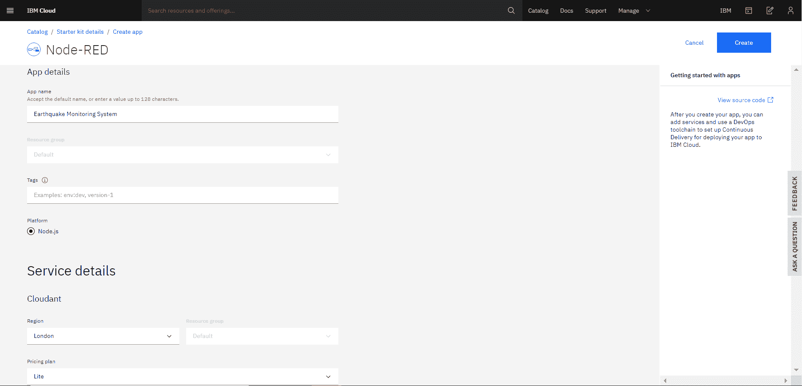

7.  当应用程序状态更改为 `Running` 后，单击 **Visit App URL**。

8.  遵照说明访问 *Node-RED 流程编辑器*。我鼓励您保护自己的 Node-RED 流程编辑器的安全，确保只有授权用户才能进行访问。

    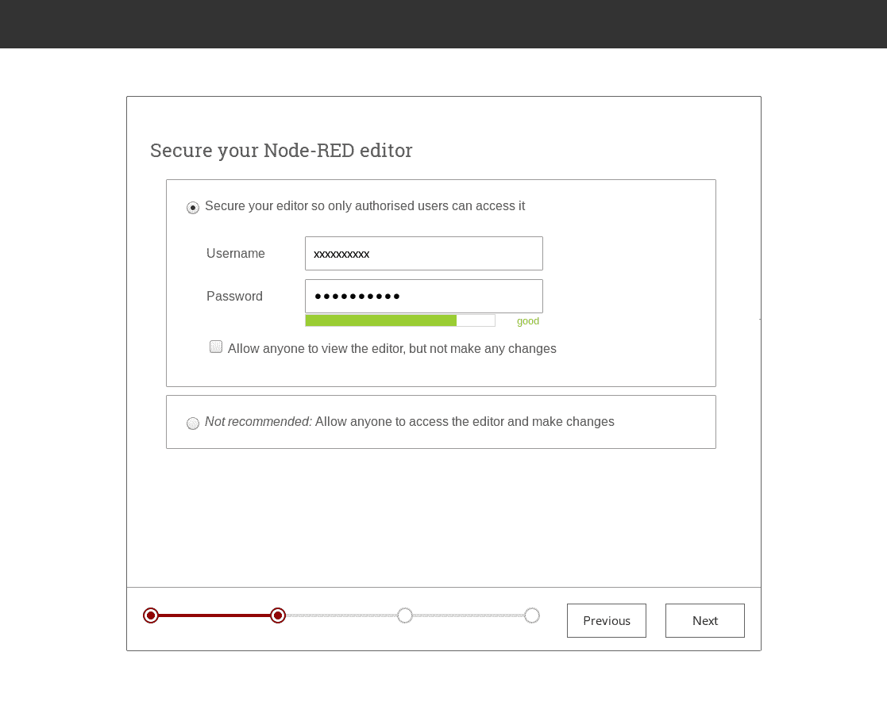

9.  单击 **Go to your Node-RED flow editor**。这样会在 Node-RED 流程编辑器中打开一个名为 `Flow 1` 的新流程。如果您采取了措施来保护 Node-RED 流程编辑器的安全，那么系统将先要求您输入刚设置的**用户名**和**密码**。

2

## 开发应用程序

我们的地震监控系统应用程序具有两个主要组件：

*   *Web 服务*组件
*   *仪表板*组件

下面介绍了在 Node-RED 应用中创建这两个组件的步骤。我鼓励您遵循这些步骤来了解如何使用 Node-RED 来轻松创建应用。

您还可以导入本教程中说明的两个流程。首先，将 flows.json 文件的内容下载或复制到剪贴板。然后，转至 Node-RED 编辑器中的汉堡菜单，选择 **Import > Clipboard**。接着，将内容粘贴到对话框中，并单击 **Import**。如果选择了下载文件，务必选中 **select a file to import**，然后单击 **Import**。您仍将需要遵循本教程中的步骤来配置所有节点，并为 **function** 节点提供程序包。

2a

### 创建 Web 服务

1.  双击含流程名称的选项卡，并将其命名为 `Earthquake Details`。
2.  单击汉堡菜单，然后单击 **Manage palette**。查找 **node-red-node-openweathermap**，在您的面板中安装这些额外的节点。

    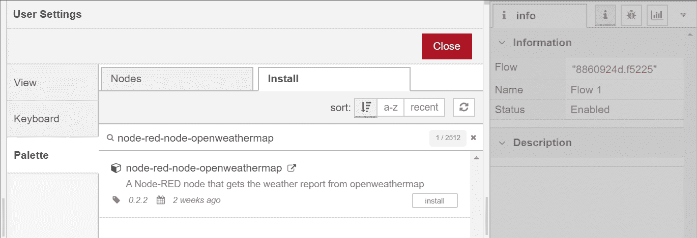

3.  将 **HTTP input** 节点添加到流程中。

4.  双击该节点进行编辑。将方法设置为 `GET`，并将 URL 设置为 `/earthquakeinfo-hr`。
5.  添加 **HTTP response** 节点，并将其连接到先前添加的 **HTTP input** 节点。本小节中引入的所有其他节点都将添加到 **HTTP input** 节点与 **HTTP response** 节点之间。
6.  添加 **HTTP request** 节点并将 *URL* 设置为 `https://earthquake.usgs.gov/earthquakes/feed/v1.0/summary/all_hour.geojson`，将 *Method* 设置为 **GET**，同时将 *Return* 设置为 **a parsed JSON object**。这样将允许抽取最近一小时内发生的所有地震数据。将此节点命名为 `Get Earthquake Info from USGS`。

    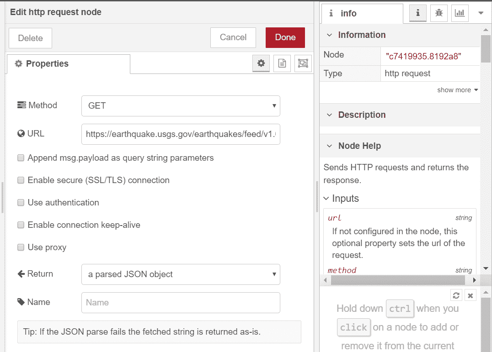

7.  添加 **change** 节点。双击此节点进行修改。将此节点命名为 `Set Earthquake Info`。在 **Rules** 部分中，对以下 JSONata 表达式添加*删除* `msg.topic`、`msg.headers`、`msg.statusCode`、`msg.responseUrl` 和 `msg.redirectList` 的规则以及*设置* `msg.payload` 的规则。

    ```
    payload.features.{
       "type":properties.type,
       "magnitude": properties.mag,
       "location": properties.place,
       "longitude":geometry.coordinates[0],
       "latitude":geometry.coordinates[1],
       "depth":geometry.coordinates[2],
       "timestamp": $fromMillis(
           properties.time,
           '[H01]:[m01]:[s01] [z]',
           '+0400'
       ),
       "source": properties.net
    } 
    ```

8.  添加 **split** 节点，用于根据地点将地震信息点拆分为不同消息。

9.  添加 **change** 节点，将经度和纬度设置为适当的属性，这些属性将输入到 **openweathermap** 节点中。在 **Rules** 部分中，将 `msg.details` *设置*为 `msg.payload`，将 `msg.location.lon` *设置*为 `msg.payload.longitude`，并将 `msg.location.lat` *设置*为 `msg.payload.latitude`。将此节点命名为 `Set Lon & Lat`。

    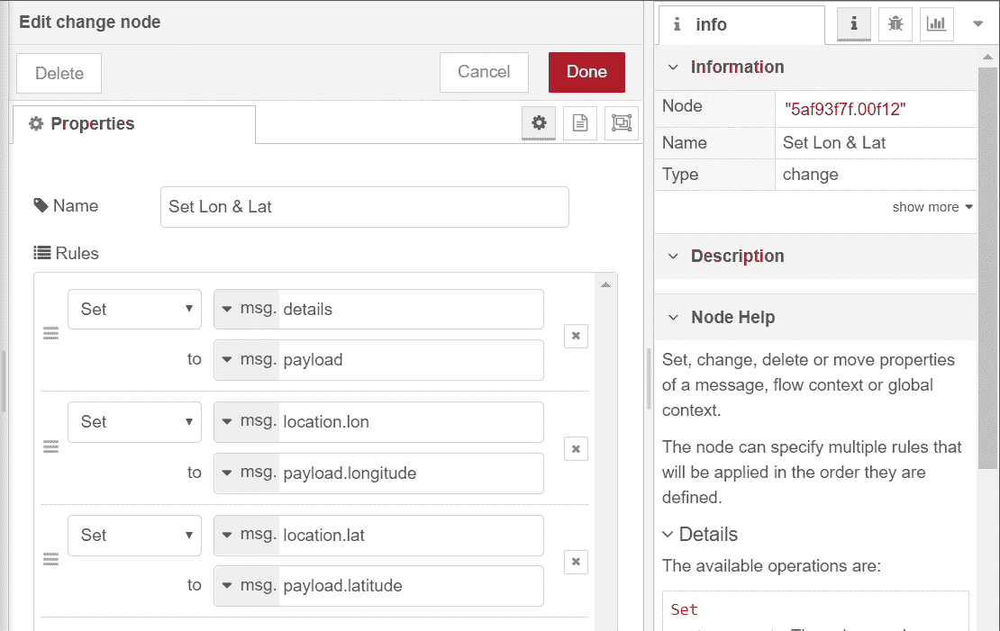

10.  添加 **openwethermap** 节点，以便将来自 [OpenWeatherMap 站点](https://home.openweathermap.org/api_keys)的 API 密钥添加到其中。（使用您创建的帐户登录到该站点。）

11.  添加另一个 **change** 节点，以便将 `msg.payload` *设置*为 JSONata 表达式的输出，用于对消息进行正确格式化。将此节点命名为 `Add Weather Data`。JSONata 表达式如下所示。

    ```
     msg.{
       "name": parts.index,
       "Place": details.place,
       "Location":details.location,
       "Country":location.country,
       "mag":details.magnitude,
       "Source":details.source,
       "Timestamp":details.timestamp,
       "lon": location.lon,
       "lat":location.lat,
       "Type":details.type,
       "Temperature":data.main.temp & ' Kelvin',
       "Pressure":data.main.pressure & ' hPa',
       "Humidity":data.main.humidity & ' %',
       "Wind Speed":data.wind.speed & ' meter(s)/sec',
       "Wind Direction":data.wind.deg & ' degree(s)',
       "Cloud Coverage":data.clouds.all & ' %',
       "icon":'earthquake',
       "intensity":details.magnitude / 10
    } 
    ```

12.  单击 **Deploy** 以使所有更改生效。

#### 添加 **countryjs** 程序包

完成 *Web 服务*组件的内容之前，您需要向 **function** 节点提供 [**countryjs**](https://www.npmjs.com/package/countryjs) 程序包，这样将使我们能够根据地震点来设置相应的国家和地区。

1.  返回到您已创建的 IBM Cloud 应用程序。
2.  单击 **Overview**。 在 **Continuous delivery** 部分中，单击 **Enable**。

    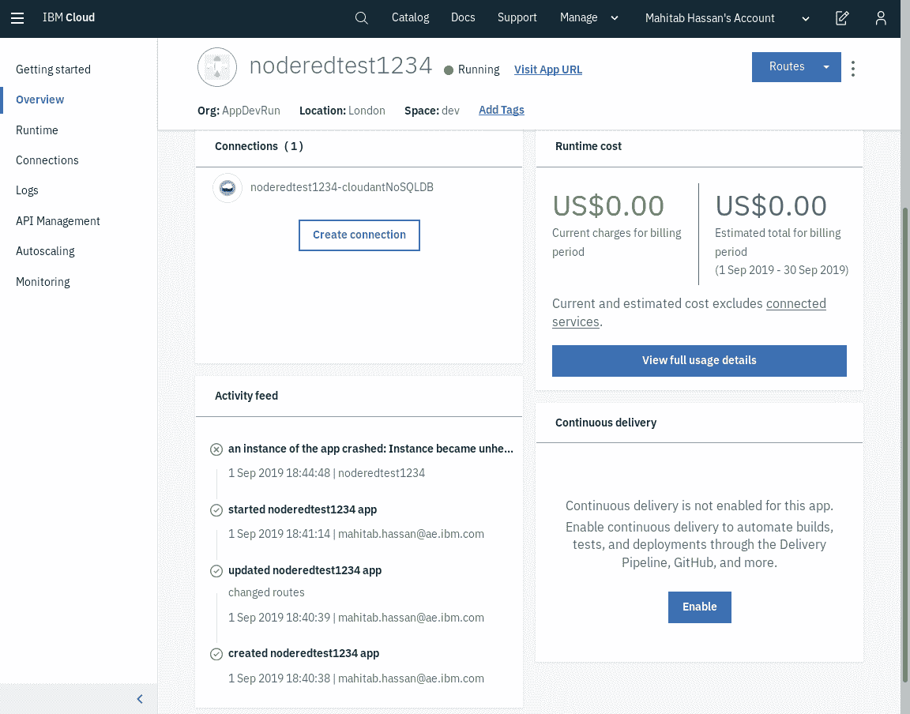

3.  确认所有预填充的详细信息。然后，在 **Tool Integrations** 下，选择 **Delivery Pipeline**，接着单击 **Create+** 以生成 IBM Cloud API 密钥。

4.  在页面底部，单击 **Create** 按钮。

    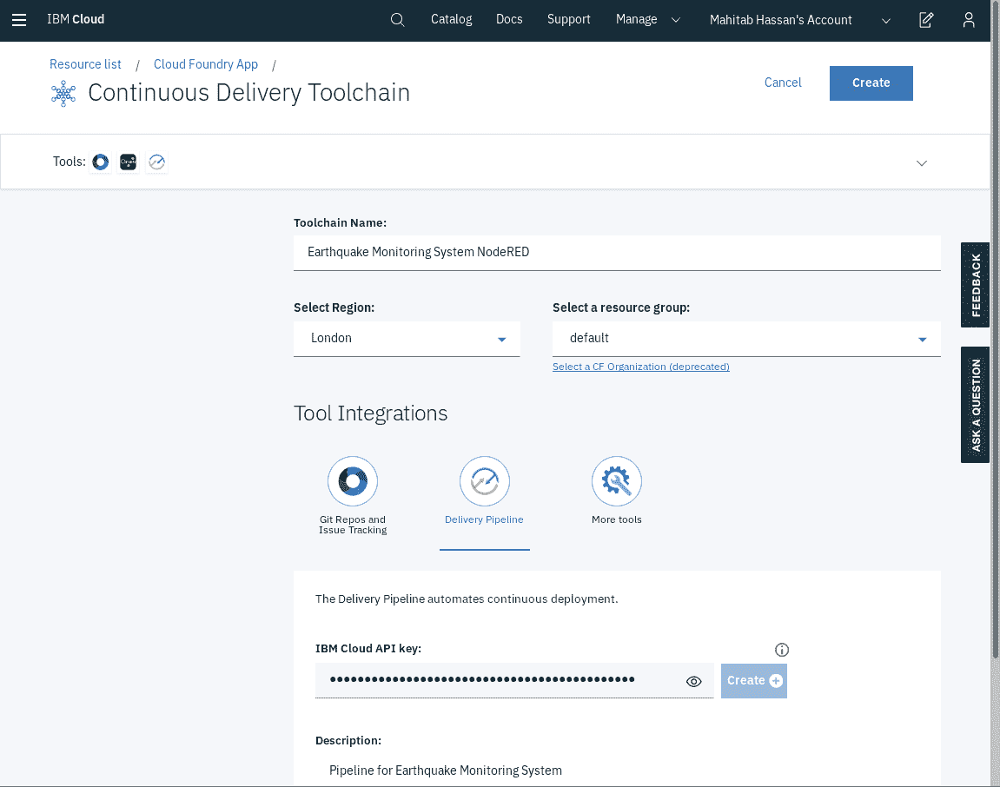

5.  现在，您需要配置文件，向 **function** 节点提供 countryjs 程序包。 在 Toolchains 窗口中，执行以下任一步骤：

    *   通过 **Git** 操作克隆存储库，并在本地对文件进行编辑。
    *   打开 Eclipse Orion Web IDE 以在 IBM Cloud 中编辑文件。

    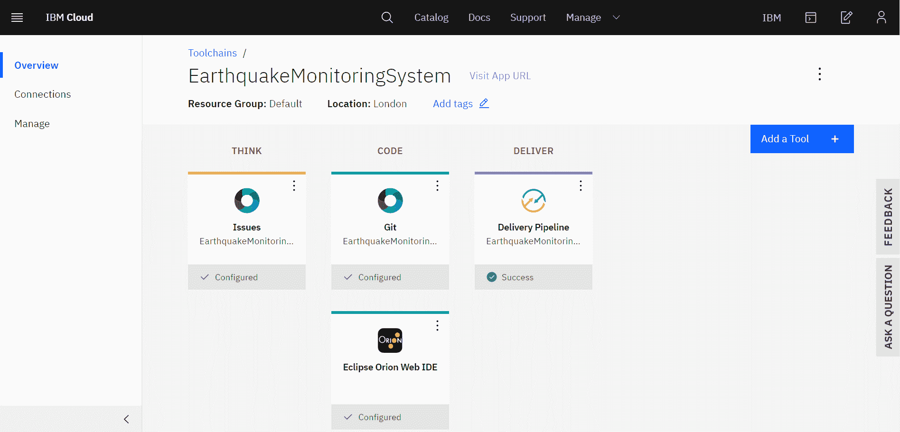

6.  编辑 `bluemix-settings.js` 文件。

    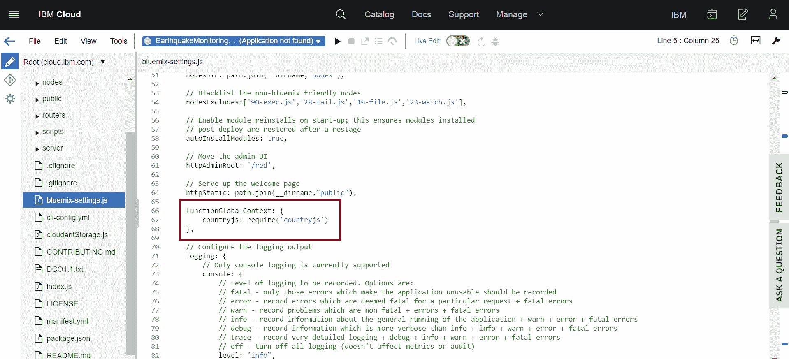

7.  查找 `functionGlobalContext` 对象定义，并添加 `countryjs`。

    ```
     functionGlobalContext: {
         countryjs:require('countryjs')
     }, 
    ```

1.编辑 `package.json` 文件，并将 `countryjs` 定义为依赖项。

```
```
"dependencies": {
    ...,
    "countryjs":"1.8.0"
},
``` 
```

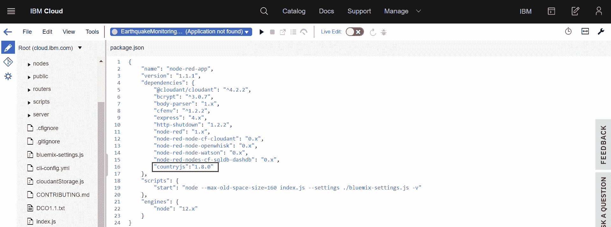

1.  使用 Git 来落实并推送所有更改。

2.  返回到应用程序，等待应用程序完成部署。您可以通过观察 **Delivery Pipeline** 卡来检查进度。

    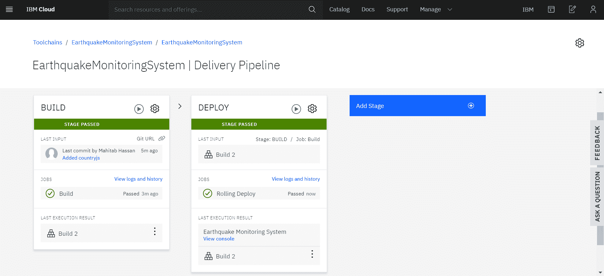

#### 完成 Web 服务

1.  在先前添加的 **change** 节点后添加 **function** 节点。 将此 function 节点命名为 `Set Region & Country using countryjs`。将以下 javascript 代码添加到此节点。

    ```
    var countryjs = global.get('countryjs');

    msg.payload.Country = countryjs.name(msg.location.country)
    msg.payload.Region = countryjs.region(msg.location.country)

    return msg; 
    ```

2.  添加 **change** 节点以移除任何冗余属性。在 **Rules** 部分中，添加规则以*删除* `msg.details`、`msg.location`、`msg.data`、`msg.title` 和 `msg.description`。将此节点命名为 `Remove Unnecessary Properties`。

    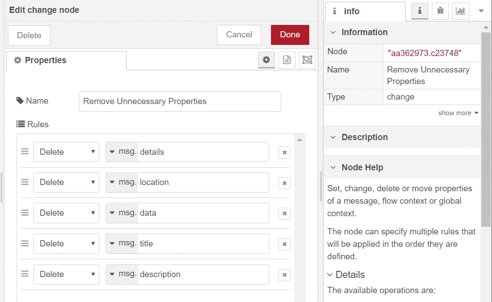

3.  添加 **join** 节点以将先前拆分的消息重新合并为一条消息，提交 HTTP 请求时将返回这条消息。

4.  添加 **change** 节点并将其命名为 `Set Headers`。在 **Rules** 部分中，添加规则以将 `msg.headers` *设置*为 `{ "Content-Type": "application/JSON" }`，用于定义将采用 JSON 格式返回提交至 *Web 服务* 的 HTTP 请求。
5.  清理流程后，流程应如下所示。

    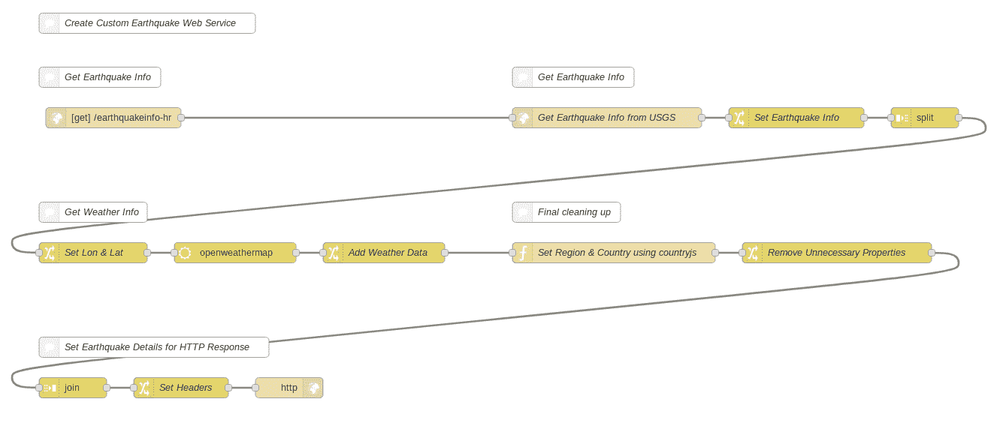

6.  单击 **Deploy** 以使所有更改生效。

2b

### 创建仪表板

既然您已创建了 *Web 服务*组件，现在就可以创建仪表板组件了。

#### 在仪表板中将相似的窗口小部件分组在一起

1.  添加新流程并将其命名为 `Dashboard`。
2.  转至 **Manage palette**，并安装 **node-red-contrib-web-worldmap** 和 **node-red-dashboard** 程序包。**node-red-contrib-web-worldmap** 用于创建地图，其中根据最近 1 小时内发生地震的地点绘制出了各个地震点。**node-red-dashboard** 用于显示最新的地震相关推文和每个地区的地震频率。
3.  转至 **Node information** 和 **Debug messages** 选项卡旁添加的 **Dashboard** 选项卡。这里包含三个子选项卡：**Layout**、**Site** 和 **Theme**。这三个子选项卡都用于更改 UI 外观。
4.  在 **Layout** 下，单击 **+tab** 以创建选项卡，这样可以模仿 UI 中的页面。如下图所示，对其进行编辑，然后单击 **Update**。

    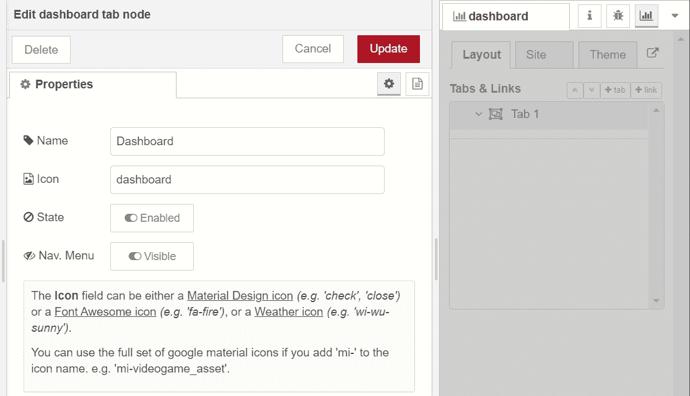

5.  单击 **+group** 向该选项卡添加一个组，用于将相似的窗口小部件整理到一起。您总共需要添加三个组：一个用于 *Map*，一个用于 *Latest tweet*，另一个用于 *Earthquake Frequency*。添加 **dashboard** 节点时，会将它们添加到其中一个组中。

    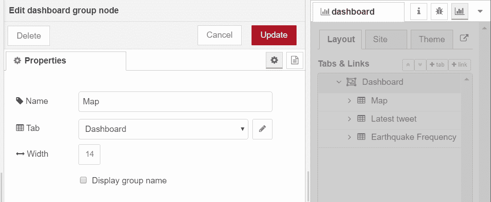

#### 定义仪表板流程

1.  在仪表板流程编辑区域内，添加 **inject** 节点，该节点将在每次部署完成后的 *0.1* 秒后使用空的 JSON 对象 (`{}`) 注入一次有效负载。
2.  添加 Node-RED **template** 节点，并添加以下 HTML 代码，这段代码反映了 `/worldmap` 端点中的所有更改。将此节点命名为 `Display`。

    ```
     <iframe src="/worldmap" height=670 width=670></iframe> 
    ```

3.  添加 Dashboard **template** 节点，并按如下方式进行编辑。将此节点命名为 `Map`。

    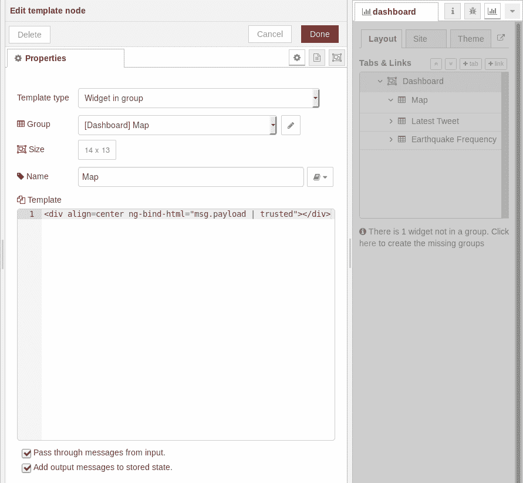

4.  添加 **inject** 节点，该节点将在部署完成 *5* 秒后以及每隔 *60* 分钟使用空的 JSON 对象 (`{}`) 注入有效负载。

    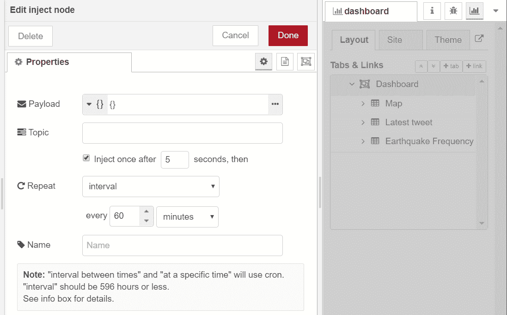

5.  将 **inject** 节点连接到将调用先前创建的 Web 服务的 **HTTP request** 节点。返回的数据将通过 *worldmap* 端点显示在地图上，存储在 Cloudant 数据库中，并通过分析来绘制每个地区的地震频率图。确保编辑 **HTTP request** 节点，并将 <*APPURL*> 替换为 Node-RED 应用程序的 URL，同时将 *Return* 设置为 **a parsed JSON object**。将此节点命名为 `Get Earthquake Info`。

    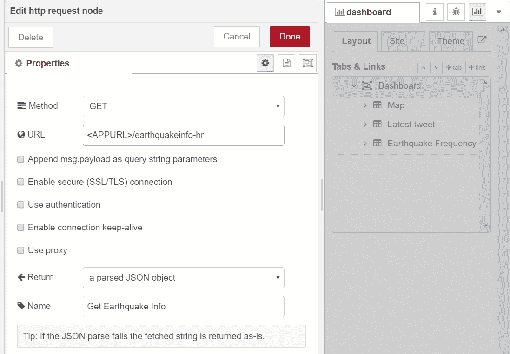

6.  将 **split** 节点连接到 **HTTP request** 节点，这将拆分返回的输出以绘制表示地点的各个点。保留节点配置作为缺省值。 此外，将 **split** 节点连接到 **worldmap** 节点，以在 Web 地图上绘制每个点并按如下方式编辑节点。

    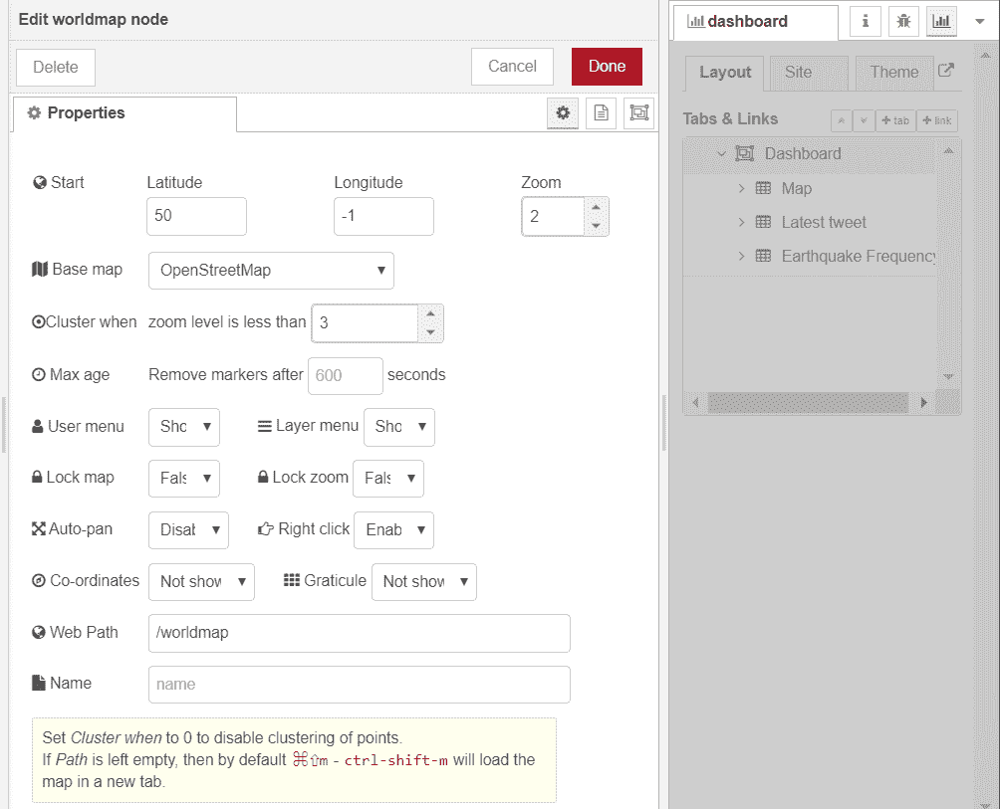

7.  由于之前提到过将存储这些点，因此可将 **cloudant out** 节点连接到先前添加的 **HTTP request** 节点，并按如下方式进行配置。

    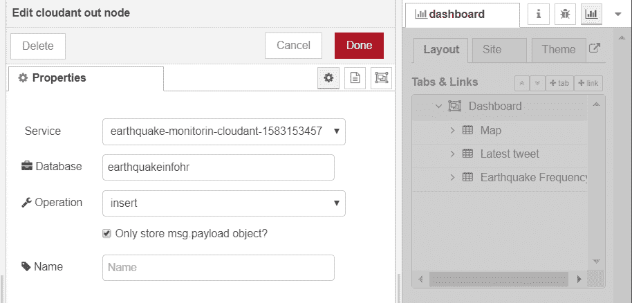

8.  现在，为了绘制出折线图来观察每个地区的地震频率，将 **change** 节点添加到 **HTTP request** 节点以过滤出地区名称。添加规则以将 `msg.payload` *设置*为 JSONata 表达式 `payload.Region`。将此节点命名为 `Filter Regions`。

    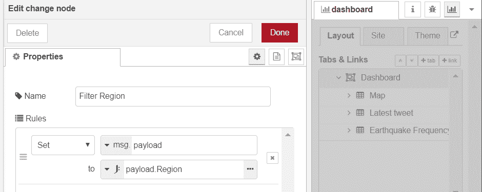

9.  将 **function** 节点连接到 **change** 节点，这将计算当前每个地区中发生的地震数量。在 **function** 节点中添加以下 javascript 代码。将此节点命名为 `Count`。

    ```
    var arr = msg.payload;

    var counts = {};
    for (var i = 0; i < arr.length; i++) {
        counts[arr[i]] = 1 + (counts[arr[i]] || 0);
    }

    msg.payload = counts;

    return msg; 
    ```

10.  添加另一个 **function** 节点，这将计算实际频率并以可输入到 Dashboard **chart** 节点的格式来生成数据。然后，将从该 function 节点输出的数量修改为 `5`。将此节点命名为 `Earthquake Frequency`。使用以下 javascript 代码。

    ```
    msg1 = {topic:"Africa", payload:msg.payload.Africa};
    msg2 = {topic:"Americas", payload:msg.payload.Americas};
    msg3 = {topic:"Asia", payload:msg.payload.Asia};
    msg4 = {topic:"Europe", payload:msg.payload.Europe};
    msg5 = {topic:"Oceania", payload:msg.payload.Oceania};

    return [msg1, msg2, msg3, msg4, msg5]; 
    ```

11.  将先前步骤中添加的 **function** 节点的 5 个输出连接到 Dashboard **chart** 节点。

12.  编辑 **chart** 节点，并按如下方式设置节点属性。

    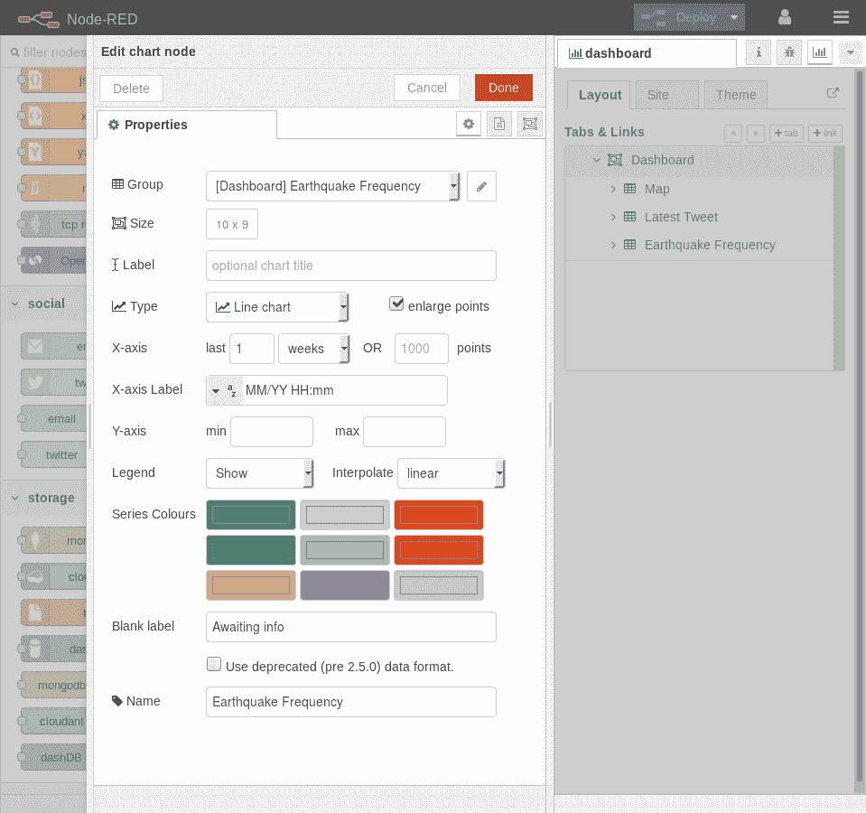

13.  添加 **twitter in** 节点，并将其配置为添加 **new twitter-credentials config node**。遵循提及的步骤获取使用者密钥以及访问令牌和密钥。

14.  在 **all public tweets** 中搜索 *earthquake magnitude, earthquake hits*。

    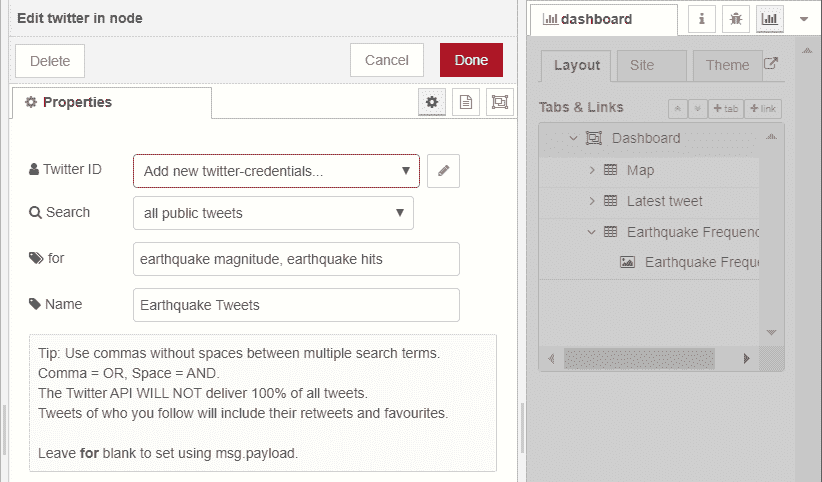

15.  将 **twitter in** 节点连接到 Dashboard **text** 节点，并按如下方式对其进行配置。

    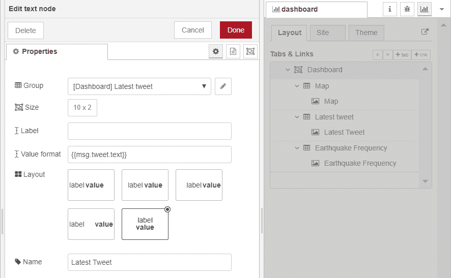

清理并组织节点之后，流程将如下所示。

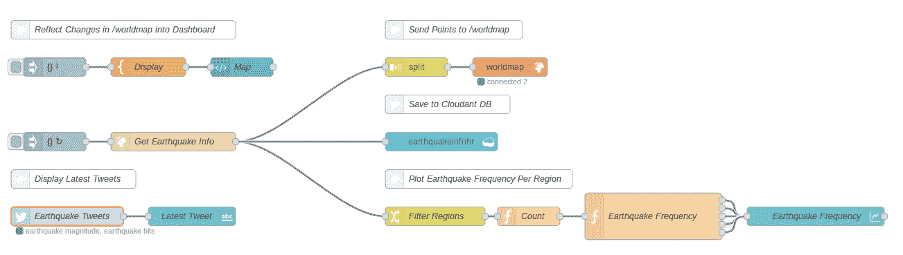

如果您转至 `_APPURL_/ui` 或者单击箭头图标打开仪表板，将会看到类似如下截屏的结果：

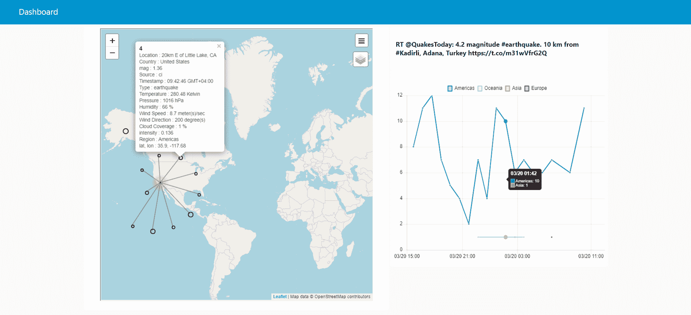

3

## 保护 Web API 安全

虽然并非必要操作，但最好应保护 Web 服务安全。 我强烈鼓励您保护自己的 Web API 的安全。

1.  返回到应用程序的 **Overview** 页面，滚动到页面末尾，找到 **Continuous delivery** 部分。
2.  单击 **View toolchain**
3.  单击 **Eclipse Orion Web IDE** 以打开在线编辑器。
4.  在编辑器中的 *Edit* 下，转至 **bluemix-setting.js** 文件。
5.  查找 **functionGlobalContext** 对象的定义。
6.  在先前添加的 **functionGlobalContext** 对象前添加以下 javascript 片段，使用可用于保护 API 的基本认证方法为 API 定义用户名和密码。

    ```
     httpNodeAuth:{
         user: "apiUser"
         pass: ""
     } 
    ```

7.  转至流程编辑器，并通过 **Manage pallete** 安装 **bcrypt** 节点，使用 *bcrypt* 获取密码。

8.  在同样的流程中，添加 **inject** 节点并将其连接到 **bycrypt** 节点，后者将连接到 **debug** 节点。

    

9.  **inject** 将在 **bcrypt** 节点中包含类型为 **string** 的密码（确保 **Action** 设置为 **Encrypt**）。

10.  注入密码后，复制 **debug** 节点的输出并返回到 *bluemix-setting.js*，以将其添加到 `pass`（表示基本认证期间的 API 密码）。
11.  转至编辑器中的 *Git*，落实并推送所有更改。
12.  返回到 **IBM Cloud Dashboard**，并转至应用程序，等待应用程序完成部署。您可以通过观察 **Delivery Pipeline** 来检查进度。
13.  再次返回到 Node-RED 流程编辑器来确保 API 安全。
14.  转至 **HTTP** response 节点，启用 **Use authentication**。对于 Type，选择 **basic authentication**，输入您已定义的用户名和密码（密码并非 **bcrypt** 节点的输出，而是注入到 **bcrypt** 节点的字符串）。

    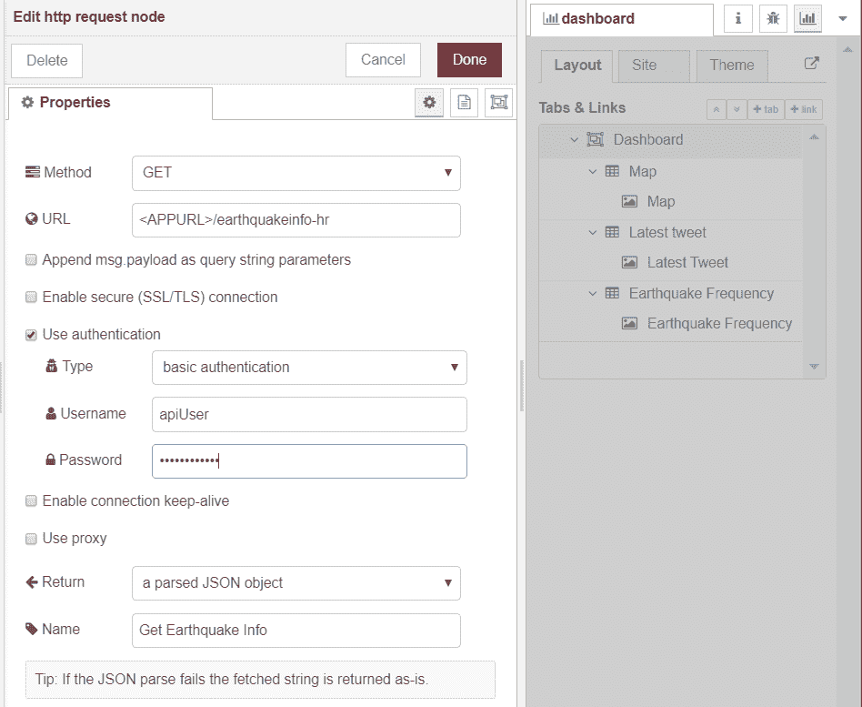

15.  **部署**更改。

基本认证将应用于您在自己的应用程序中定义的所有 API。

## 后续行动

既然您已成功实施并部署了用于监控不同地区地震情况的应用程序，接下来便可以探索其他不同的可用节点，包括 **IBM Watson** 节点。 尤其可以试试以下教程： “利用 Node-RED 和 Watson AI 服务，构建通用口语翻译器。”

本文翻译自：[Build a simple earthquake monitoring system](https://developer.ibm.com/tutorials/simple-earthquake-monitoring-system-using-nodered/)（2019-9-1）。