# 生成机器学习模型管道，为问题选择最佳模型

> 原文：[`developer.ibm.com/zh/tutorials/generate-machine-learning-model-pipelines-to-choose-the-best-model-for-your-problem-autoai/`](https://developer.ibm.com/zh/tutorials/generate-machine-learning-model-pipelines-to-choose-the-best-model-for-your-problem-autoai/)

毫无疑问，人们都期望为我们生活的方方面面带来便利的人工智能，也能够加快自身的发展进程。构建更佳的模型离不开更复杂、更耗时且成本更高的 AI 程序，这就需要具备多方面的专业知识，从清理数据到特征工程，从设计架构到参数优化等等。要简化此过程并大幅缩短时间和减少工作量，您就必须自动执行这些工作负载。出于为 AI 创建 AI 的目的，IBM 在 Watson™ Studio 中引入了一项名为 [AutoAI](https://dataplatform.cloud.ibm.com/docs/content/wsj/analyze-data/autoai-overview.html) 的服务。

AutoAI 作为一项服务，可自动执行机器学习任务，减轻数据科学家背负的重担。它可自动准备数据进行建模，为问题选择最佳算法，并为训练模型创建管道。

## 学习目标

**免费试用 IBM Cloud**

利用 [IBM Cloud Lite](https://cocl.us/IBM_CLOUD_GCG) 快速轻松地构建您的下一个应用程序。您的免费帐户从不过期，而且您会获得 256 MB 的 Cloud Foundry 运行时内存和包含 Kubernetes 集群的 2 GB 存储空间。[了解所有细节](https://www.ibm.com/cloud/blog/announcements/introducing-ibm-cloud-lite-account-2)并确定如何开始。

本教程通过一个用例介绍了 AutoAI 服务的优势，帮助您深刻理解如何在不使用任何代码的情况下处理回归和分类问题，以及如何使用此服务完成特征工程、模型选择、超参数调优等任务。本教程还包含了在管道中选择最佳模型以及如何部署和使用这些模型的详细信息。

## 前提条件

要学习本教程，您必须：

*   注册一个 [IBM Cloud 帐户](https://cocl.us/IBM_CLOUD_GCG)。（可使用 IBM Cloud Lite 帐户完成本教程。）
*   创建 Cloud Object Storage 服务实例。
*   创建 Watson Studio 服务实例。
*   创建 Watson Machine Learning 服务实例。
*   具备机器学习算法的基本知识。

## 预计花费时间

本教程大约需要 20 分钟才能完成，这包括 AutoAI 中的训练过程。

## 步骤

在创建 IBM Cloud Lite 帐户并登录后，您可以执行以下步骤。

### 第 1 步： 创建所需服务实例

#### Object Storage

为存储数据，您需要一个稍后与项目链接的存储服务。 为此，可在 [IBM Cloud Catalog](https://cloud.ibm.com/catalog?search=object%20storage&category=storage?cm_sp=ibmdev-_-developer-tutorials-_-cloudreg) 中搜索 Storage，或者转至同一个页面上左侧菜单中的 Storage 选项卡，然后单击 **Object Storage** 服务。

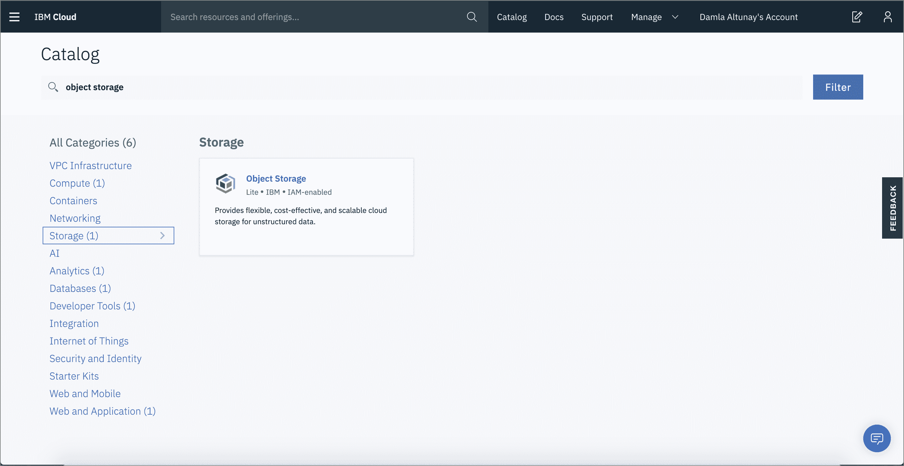

（可选）您可以命名此服务实例，然后单击 **Create**。

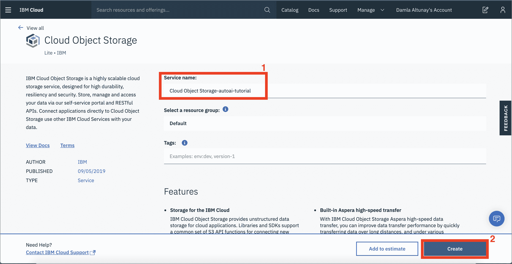

#### Watson Studio

1.  在 [IBM Cloud Catalog](https://cloud.ibm.com/catalog?search=studio?cm_sp=ibmdev-_-developer-tutorials-_-cloudreg), 中搜索 Watson Studio，然后单击 **Watson Studio** 服务磁贴。

    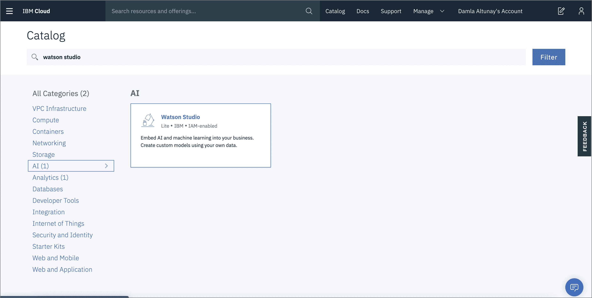

2.  与 Object Storage 服务一样，您也可以对自己的服务加以命名，然后单击 **Create**。

    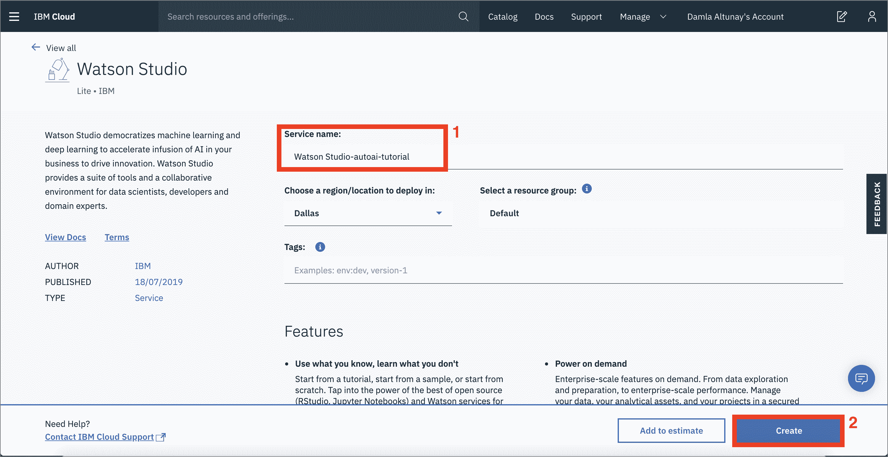

3.  在配置 Watson Studio 服务后，单击 **Get Started** 或转至 [Watson Studio](https://dataplatform.cloud.ibm.com/?cm_sp=ibmdev-_-developer-tutorials-_-cloudreg) 平台，然后使用您的 IBM Cloud 帐户登录。

    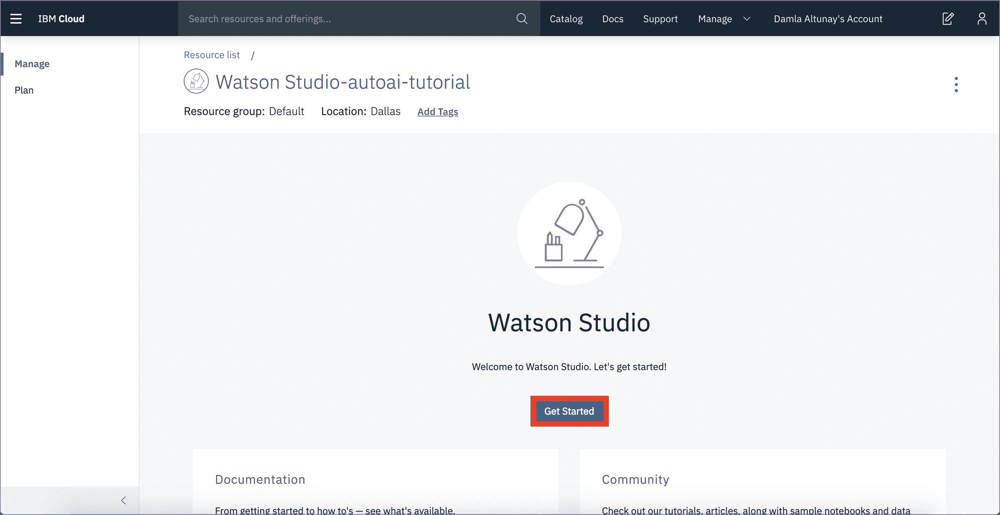

4.  查看入门教程，了解有关 Watson Studio 的更多信息。

### 第 2 步： 使用 AutoAI 训练模型

Watson Studio 是一个集成平台，旨在组织您的项目资产，如数据集、协作者、模型和 Notebook。您将使用 Watson Studio 创建一个项目，在该项目中使用 AutoAI 训练模型，然后部署此训练的模型。

#### 创建 Watson Studio 项目

1.  单击 **Create a Project**。

    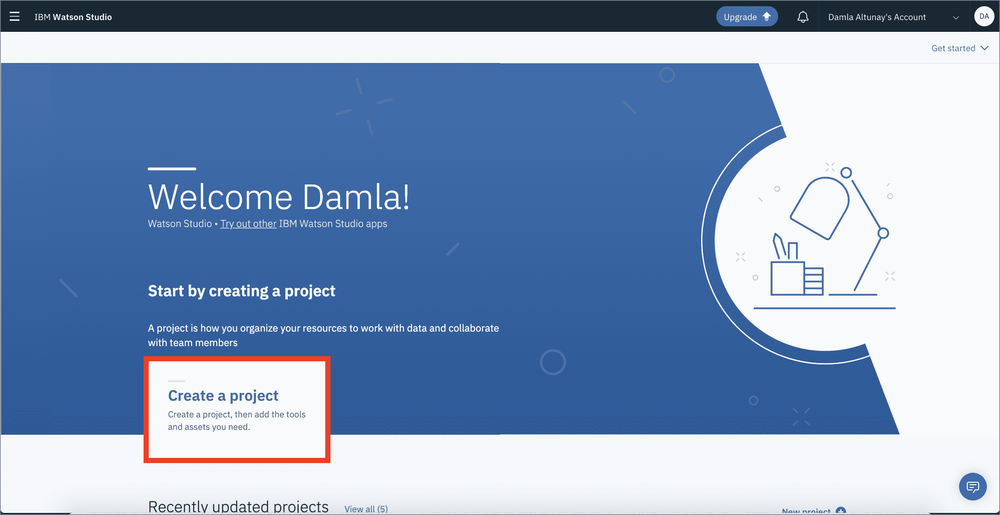

2.  选择 **Create an empty project**。

    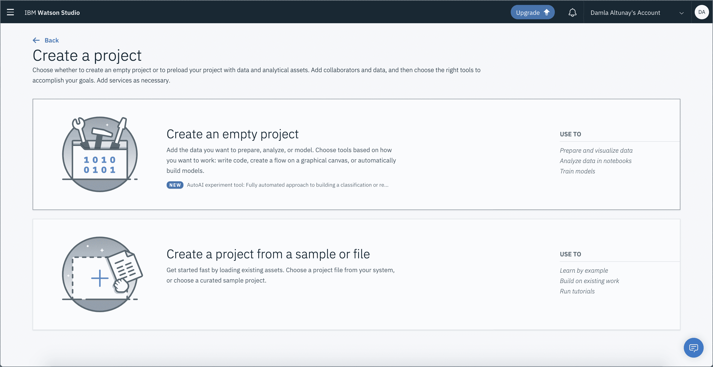

3.  为您的项目命名。如果您拥有 Cloud Lite 帐户，那么会自动选择您在上一步中创建的 Object Storage 服务。否则，从下拉菜单中选择一项服务。

    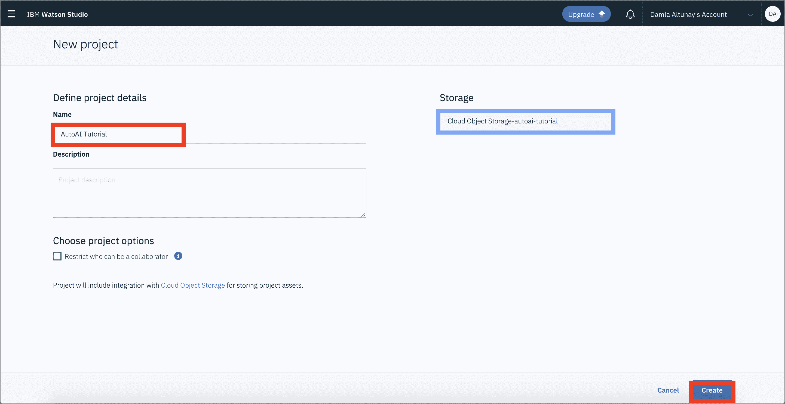

4.  这将打开数据资产页面，此处可存储和组织您的项目资产。通过单击 **Assets** 栏，可以从左侧界面装入您的数据集。

5.  上载 german_credit_data.csv 数据集。

    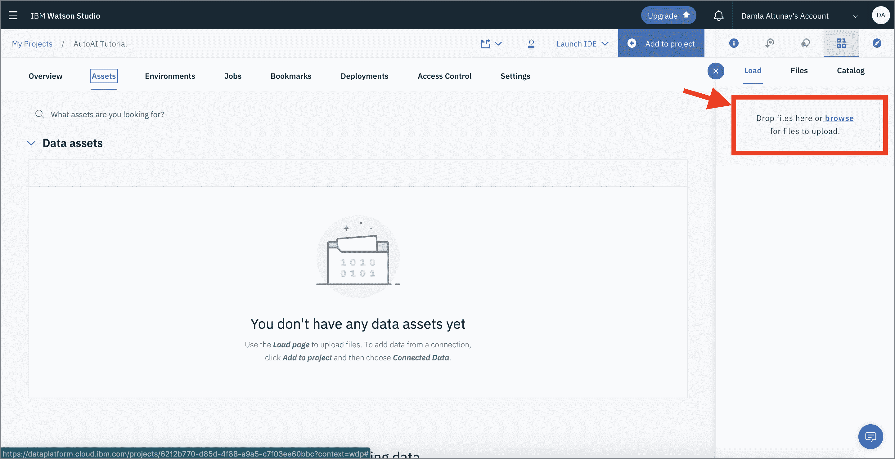

#### 设置 AutoAI 环境并生成管道

1.  要开始体验 AutoAI，可单击顶部的 **Add to Project**，然后选择 **AutoAI**。

    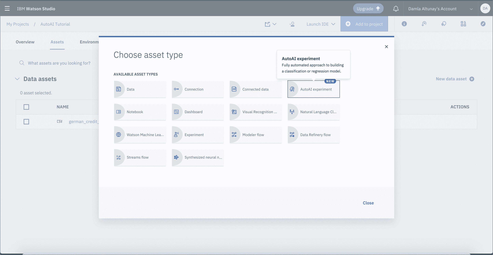

2.  为您的服务命名。

    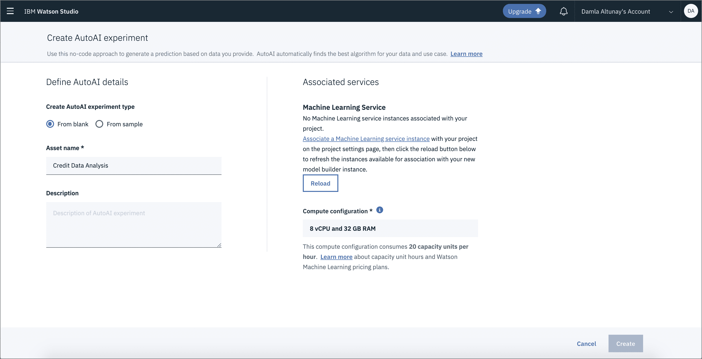

3.  要关联 **Watson Machine Learning** 实例，可单击给定链接。如果具有现成实例，可从现有选项卡中选择该实例。否则，就通过 New 选项卡创建一个新实例。

    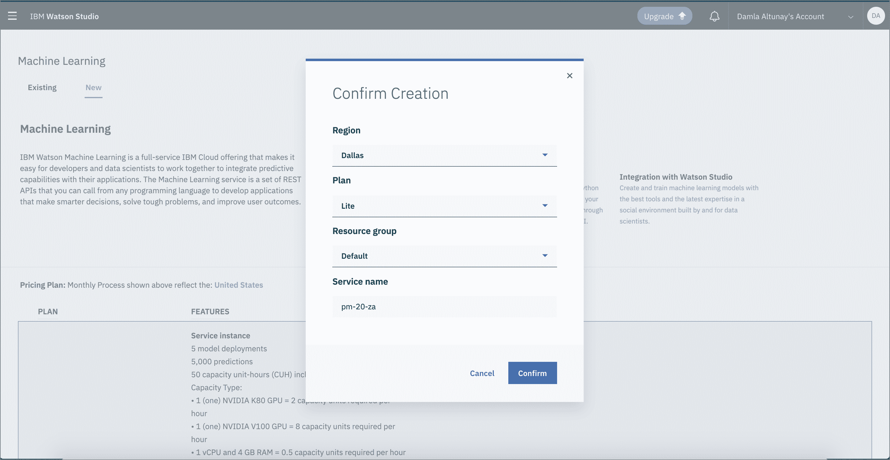

4.  在配置 Watson Machine Learning 实例后，会将您重定向到同一个页面。单击 **Reload**，然后单击 **Create**。

#### 关于数据集的信息

对于银行而言，要想实现风险最小化和利润最大化，就需要一些基本规则。其中一个必要条件就是，在与客户的任何互动中，他们都需要最大限度地减少损失，例如，向客户发放贷款。该数据集的目的是，通过考虑申请人的人口统计和社会经济概况，预测客户是否有能力偿还贷款。

*   如果申请人信用良好（即，偿还贷款概率很大），那么不批准此人的贷款申请会导致银行业务损失。
*   如果申请人的信用较差（即，偿还贷款概率很小），那么批准此人的贷款申请会导致银行遭受财务损失。
*   该数据集由 1,000 个贷款申请人的数据点组成，每个数据点有 20 个变量：7 个是数字变量，13 个是分类变量。我并不打算详细介绍此数据集的变量。您可以查看所有详细信息（`https://archive.ics.uci.edu/ml/datasets/Statlog+%28German+Credit+Data%29`）。

#### 设置 AutoAI 实例

使用以下步骤设置 AutoAI 实例。

1.  选择您的数据集（您可以从本地系统上载它，也可以从项目中选择它）。
2.  设置列以预测 **Result**。
3.  将优化后的指标更改为 **ROC AUC**（ROC 曲线下面积）。
4.  将要考虑的性能最高的算法数设置为 3 个。默认情况下，AutoAI 选择性能最高的 2 个算法，但是您可以将数字从 1 更改为 4。

    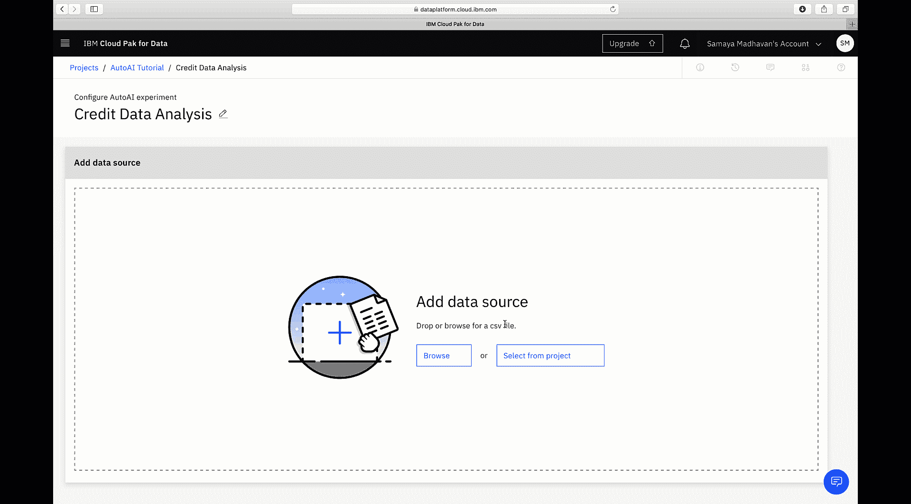

#### AutoAI 管道

完成前面的过程之后，就可以开始实验了。

经过数据预处理后，AutoAI 会确定执行效果最好的三种算法，对于这三种算法，AutoAI 都会生成以下 4 条管道。

*   自动化模型选择（管道 1）
*   超参数优化（管道 2）
*   自动化特征工程（管道 3）
*   超参数优化（管道 4）

通过这种方式，AutoAI 总共生成了 12 个管道，您可以查看、比较和另存为模型。

#### 可视化管道

当 AutoAI 生成模型时，有两个不同的视图，您可以通过这些视图可视化创建这些管道的进度。它们是进度图和关系图，如下图所示。您会看到 AutoAI 选择了 XGB，随机森林和决策树分类器作为此用例的性能最高的算法。

下图为关系图，显示了这些管道之间的关系映射。将鼠标悬停在地图上以查看更多信息。

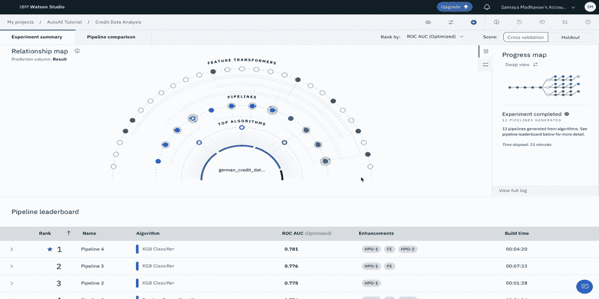

下图为进度图，显示了总体上创建的 12 条管道的顺序和详细信息。

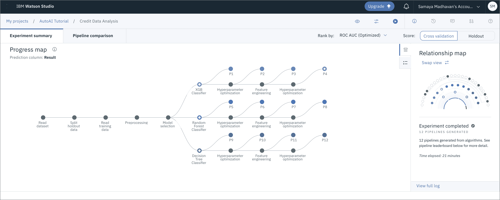

下图为管道排行榜的视图，其中包含所有 12 个管道的详细信息以及高级指标。我们推断，两组超参数优化和特征工程的 XGB 分类器已经生成了可能的最佳模型。这是序列中的第四个管道。

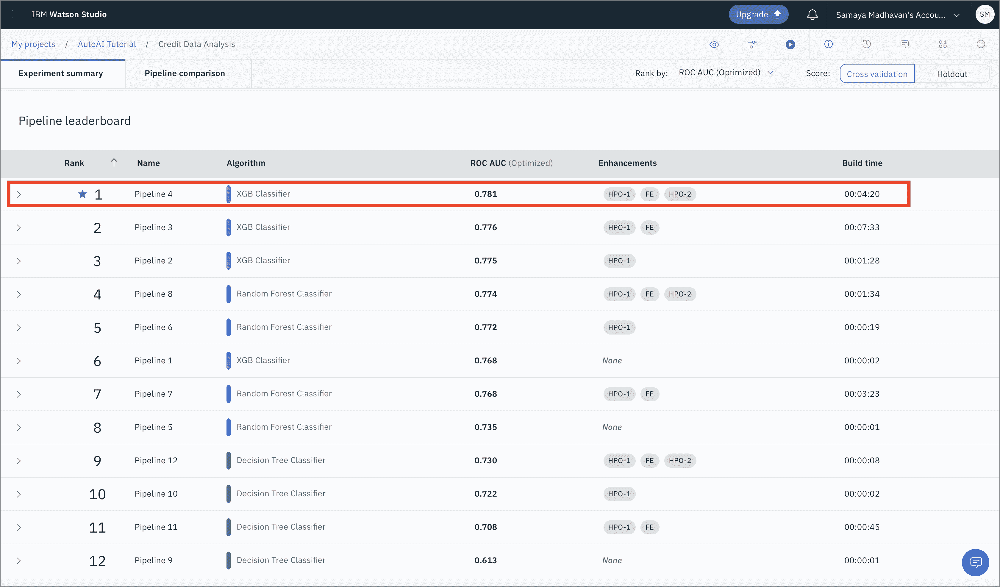

AutoAI 还提供了一种可视化的方法，可以根据不同的度量标准来比较这些模型的执行情况。


下一步是通过查看指标来选择能够提供最佳结果的模型。在本例中，管道 3 使用“Area under the ROC Curve (ROC AUC)”指标给出了最佳结果。您可以通过单击排行榜中的相应管道来查看详细结果。另外，您可以通过单击排行榜或管道页面中的 **Save as**，然后选择 **Model** 来保存模型管道。您只需要简单地保存那个给我们带来最好结果的模型。

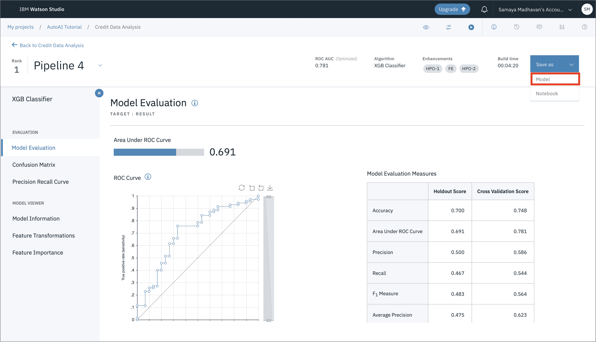

将打开一个窗口，请求输入模型名称、描述（可选）等。在填写完字段后，单击 **Save**。

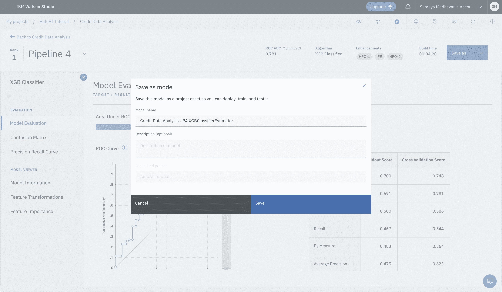

您会收到一条通知，表明您的模型已保存到项目中。单击 **View in project**。

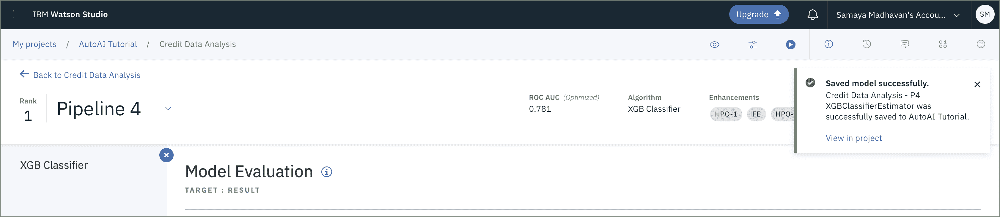

#### 部署和测试模型

1.  要使模型为部署做好准备，单击 **Deployments** 选项卡和 **Add Deployment**。

    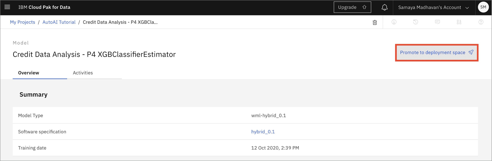

2.  参阅以下视频，了解后续步骤。

    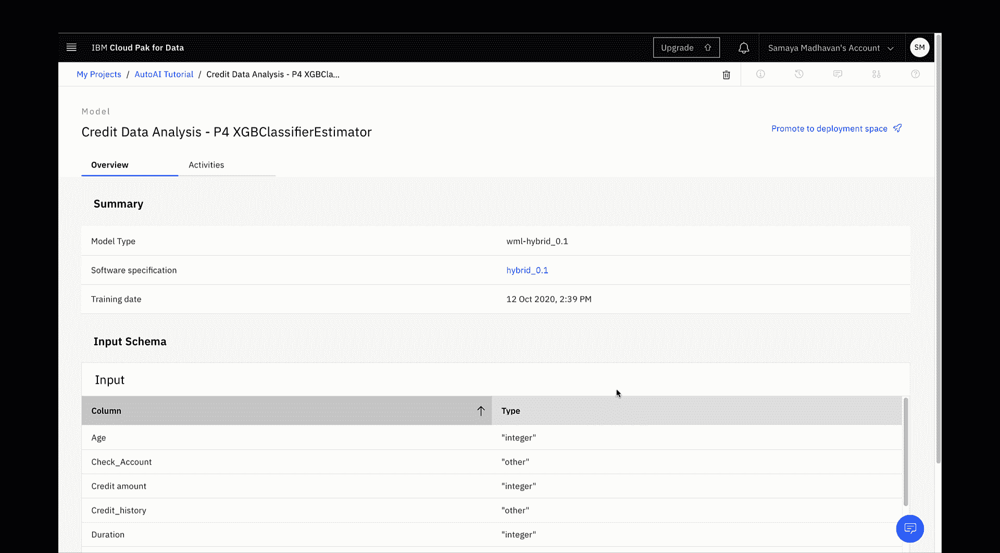

3.  现在，您可以通过部署后提供的界面测试模型。您可以采用 JSON 格式提供输入，也可以在界面上给定的字段中输入详细信息。

    *   使用 JSON 格式输入 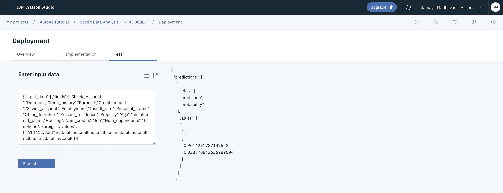

    *   在字段中输入 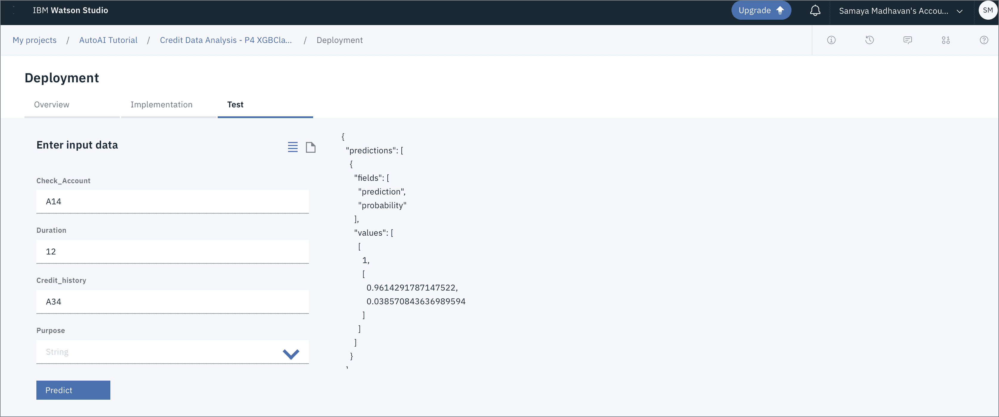

    ```
    Input data:
    {"input_data": [{"fields": ["Check_Account ", "Duration", "Credit_history", "Purpose", "Credit amount ", "Saving_account", "Employment", "Install_rate", "Personal_status", "Other_debrotors", "Present_residence", "Property", "Age", "Installment_plant", "Housing", "Num_credits", "Job", "Num_dependents", "Telephone", "Foreign"],
                                  "values": [["A14", "48", "A34", "A43", "3573", "A65", "A75", "4", "A93", "A101","1","A121","47","A143","A152","1","A173","1","A192","A201"]]}]} 
    ```

4.  您还可以通过进行 API 调用在应用程序中使用已部署的模型。要显示用例，可从 Notebook 调用您的模型。为此，返回至 Project Assets 页面，单击 **Add to project**，然后选择 **Notebook**。

    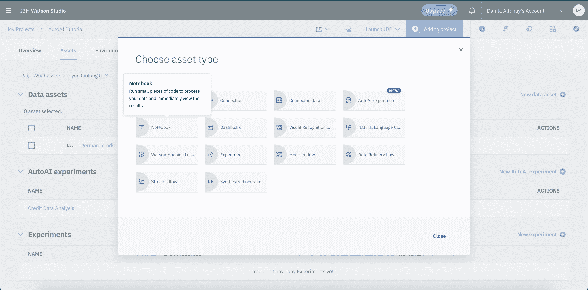

    您可以采用三种方法来创建 Notebook：

    *   创建空白 Notebook。
    *   从本地设备导入 Notebook 文件 (.ipynb)。
    *   从 URL 导入 Notebook。

        在本演示中，您将从 Test WML model.ipynb 上传 Notebook。

        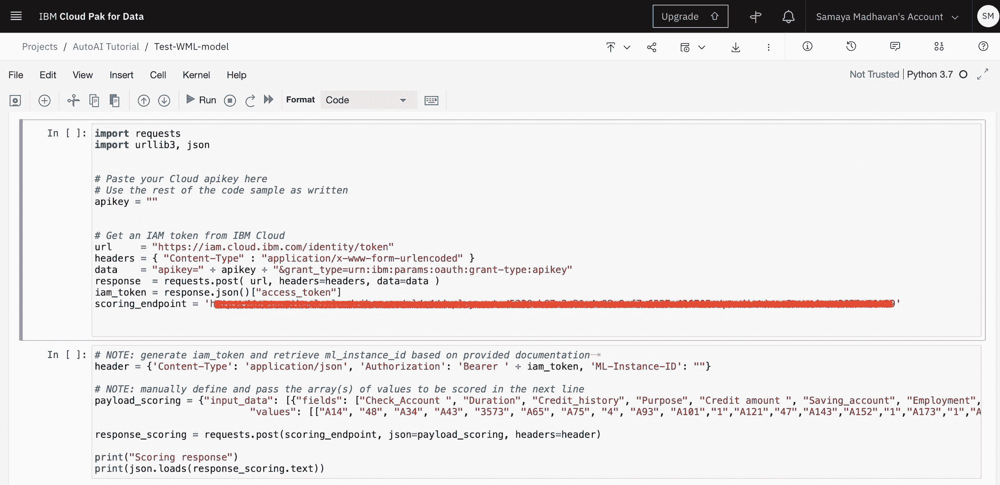

5.  在第一个单元中，输入您的 Watson Machine Learning API 密钥。在此单元的末尾，为您提供来自 IBM Cloud 的访问令牌。第二个单元用来调用模型并进行预测。

    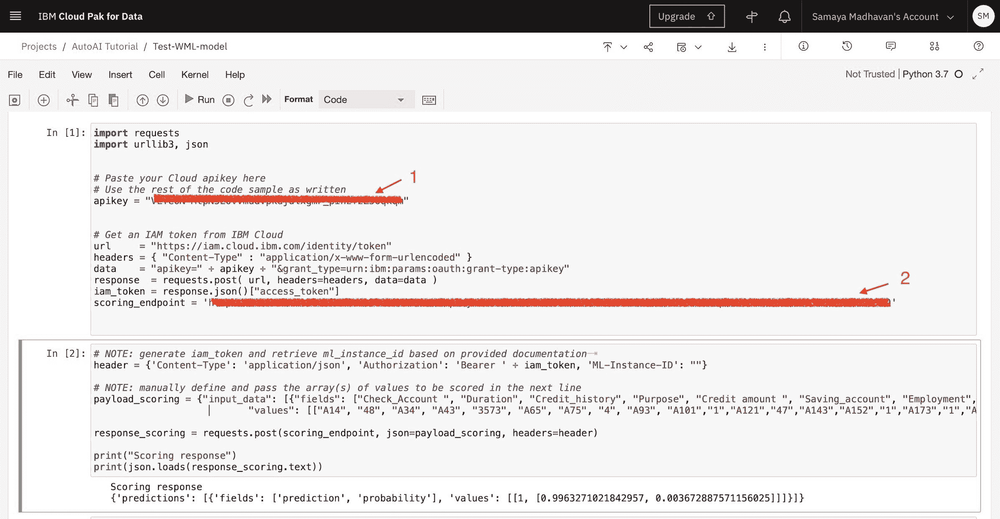

## 结束语

在本教程中，我们介绍了如何使用 AutoAI Watson 服务训练您的模型。在此训练过程中，您学习了如何部署和测试模型。您还了解了如何通过 Notebook 为已部署的模型进行 API 调用。

本文翻译自：[Generate machine learning model pipelines to choose the best model for your problem](https://developer.ibm.com/tutorials/generate-machine-learning-model-pipelines-to-choose-the-best-model-for-your-problem-autoai/)（2019-08-19）