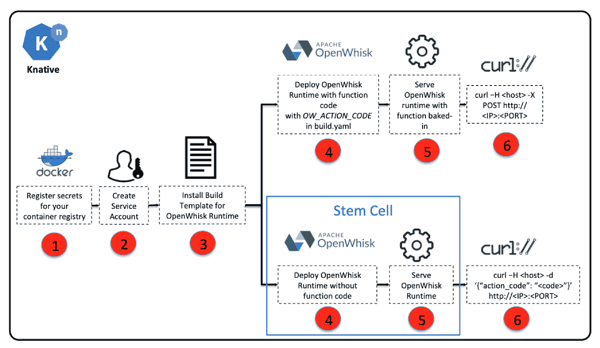

# 在 Kubernetes 集群上的托管 Knative 中运行 OpenWhisk 操作

> 原文：[`developer.ibm.com/zh/tutorials/openwhisk-actions-managed-knative-kubernetes-cluster/`](https://developer.ibm.com/zh/tutorials/openwhisk-actions-managed-knative-kubernetes-cluster/)

OpenWhisk 社区开始对 OpenWhisk 运行时环境（特别是 Node.js）进行原型设计，因此可以在 Knative 上部署和运行 OpenWhisk 操作。您可以在我的[博客文章](https://medium.com/openwhisk/how-to-run-openwhisk-actions-on-knative-95fcaf655a9e)中了解有关使用 Docker for Desktop 和 Minikube 运行 OpenWhisk 操作的更多信息。

此外，[Doug Davis](https://www.ibm.com/blogs/bluemix/author/dugus-ibm-com/) 于 2019 年初宣布了 IBM Cloud Kubernetes Service 上的托管 Knative。他解释了[如何在 Kubernetes 集群中启用托管 Knative 附加组件](https://www.ibm.com/blogs/bluemix/2019/02/announcing-managed-knative-on-ibm-cloud-kubernetes-service-experimental/)。

本教程展示了如何尝试使用 IBM Cloud Kubernetes Service，以了解它与其他环境的不同之处。”

## 学习目标

**免费试用 IBM Cloud**

利用 [IBM Cloud Lite](https://cocl.us/IBM_CLOUD_GCG) 快速轻松地构建您的下一个应用程序。您的免费帐户从不过期，而且您会获得 256 MB 的 Cloud Foundry 运行时内存和包含 Kubernetes 集群的 2 GB 存储空间。[了解所有细节](https://www.ibm.com/cloud/blog/announcements/introducing-ibm-cloud-lite-account-2)并确定如何开始。

了解如何在 Kubernetes 集群上的托管 Knative 中运行 OpenWhisk 操作利用免费的 IBM Cloud Kubernetes Service 尝试示例。

## 预估时间

在安装和配置必备软件之后，本教程大约需要 10 到 15 分钟。

## 前提条件

*   在单区域/多区域中使用 IBM Cloud Kubernetes Service V1.12.7 创建标准的 Kubernetes 集群，其中包含 4 个核心、16 GB RAM 和 3 个工作节点。（在创建标准群集时，您可以随意享用午餐！）

*   配置 [IBM Cloud CLI](https://cloud.ibm.com/docs/cli/reference/ibmcloud?topic=cloud-cli-ibmcloud-cli#ibmcloud-cli)。使用以下命令为您的集群下载 kubeconfig 文件：

    ```
     ibmcloud ks cluster-config <cluster-name> 
    ```

*   配置 `kubectl` 以访问 IBM Cloud Kubernetes Service 中的集群。

    您可以使用以下命令进行验证：

    ```
     kubectl cluster-info 
    ```

*   启用 Knative 附加组件：

    ```
     ibmcloud ks cluster-addon-enable knative <cluster-name> 
    ```

    （现在是喝咖啡的好时机！）

*   验证 `istio-system`、`knative-build`、`knative-serving`、`knative-eventing` 和 `knative-monitoring` 下的所有 Pod 都处于 `Running` 状态。

    ```
     kubectl get pods --all-namespaces
      NAMESPACE            NAME                                            READY   STATUS              RESTARTS   AGE
      istio-system         cluster-local-gateway-6d8585d55d-jmmwn          1/1     Running             0          79s
      ...
      knative-build        build-controller-865d99747c-lj9sh               1/1     Running             0          109s
      ...
      knative-eventing     eventing-controller-64bf9bbf79-ccq5p            2/2     Running             0          79s
      ...
      knative-monitoring   elasticsearch-logging-0                         1/1     Running             0          108s
      ...
      knative-serving      activator-58fb6bdff4-5tsjh                      0/2     PodInitializing     0          78s
      ...
      knative-sources      controller-manager-0                            1/1     Running             0          106s 
    ```

## 步骤

完成以下六个步骤，便能在 Knative 上构建和提供 OpenWhisk 操作：



### 第 1 步：在 Knative 上为您的容器注册表注册 Secret

Knative 需要访问容器注册表，才能推送本地构建的容器镜像。此处的示例使用 Docker Hub，但您可以通过在 `annotation` 下更改注册表名称来使用您选择的任何注册表。

将 `DOCKERHUB_USERNAME_BASE64_ENCODED` 和 `DOCKERHUB_PASSWORD_BASE64_ENCODED` 替换为您的 Docker Hub 用户名和密码之后，将此文件保存为 `docker-secret.yaml`。

```
apiVersion: v1
kind: Secret
metadata:
    name: dockerhub-user-pass
    annotations:
        build.knative.dev/docker-0: https://index.docker.io/v1/
type: kubernetes.io/basic-auth
data:
    # use `echo -n "username" | base64 -b 0` to generate this value
    username: ${DOCKERHUB_USERNAME_BASE64_ENCODED}
    # use `echo -n "password" | base64 -b 0` to generate this value
    password: ${DOCKERHUB_PASSWORD_BASE64_ENCODED} 
```

针对 Docker Hub 应用 Secret 资源清单：

```
 $ kubectl apply -f docker-secret.yaml
secret/dockerhub-user-pass created 
```

验证秘密是否存在：

```
$ kubectl get secret dockerhub-user-pass
NAME                    TYPE                                  DATA      AGE
dockerhub-user-pass     kubernetes.io/basic-auth              2       21s 
```

### 第 2 步：为 Knative 构建创建服务帐户

创建一个服务帐户，以将构建过程与您在步骤 1 中创建的注册表 Secret 相关联，以便 Knative 构建系统可以使用这些凭据将容器镜像推送到注册表。

```
apiVersion: v1
kind: ServiceAccount
metadata:
    name: openwhisk-runtime-builder
secrets:
    - name: dockerhub-user-pass 
```

```
$ kubectl apply -f service-account.yaml
serviceaccount/openwhisk-runtime-builder created 
```

验证服务帐户是否存在：

```
$ kubectl get serviceaccount/openwhisk-runtime-builder
NAME                        SECRETS   AGE
openwhisk-runtime-builder   2         3m46s 
```

### 第 3 步：安装 Node.js 运行时环境的构建模板

部署 OpenWhisk 构建模板：

```
$ kubectl apply -f https://raw.githubusercontent.com/apache/incubator-openwhisk-runtime-nodejs/master/core/nodejsActionBase/buildtemplate.yaml
buildtemplate.build.knative.dev/openwhisk-nodejs-runtime created 
```

验证构建模板是否存在：

```
$ kubectl get buildtemplate openwhisk-nodejs-runtime
NAME                       AGE
openwhisk-nodejs-runtime   2m 
```

### 第 4 步：使用 Hello World 操作代码来部署 Node.js 运行时环境

通过将 `DOCKER_USERNAME` 替换为您的用户名，将构建文件配置为指向您的 Docker Hub 存储库：

```
apiVersion: build.knative.dev/v1alpha1
kind: Build
metadata:
  name: nodejs-10-helloworld-with-params
spec:
  serviceAccountName: openwhisk-runtime-builder
  source:
    git:
      url: "https://github.com/apache/incubator-openwhisk-runtime-nodejs.git"
      revision: "master"
  template:
    name: openwhisk-nodejs-runtime
    arguments:
      - name: TARGET_IMAGE_NAME
        value: "docker.io/${DOCKER_USERNAME}/nodejs-10-helloworld-with-params"
      - name: DOCKERFILE
        value: "./core/nodejs10Action/knative/Dockerfile"
      - name: OW_ACTION_NAME
        value: "nodejs-helloworld-with-params"
      - name: OW_ACTION_CODE
        value: "function main(params) { return { payload: 'Hello ' + params.name + ' from ' + params.place +  '!'}; }" 
```

使用以下操作代码来部署 Node.js 运行时环境：

```
$ kubectl apply -f build.yaml
build.build.knative.dev/nodejs-10-helloworld-with-params created 
```

验证构建 pod 是否存在：

```
$ kubectl get build.build.knative.dev/nodejs-10-helloworld-with-params
NAME                              SUCCEEDED   REASON   STARTTIME   COMPLETIONTIME
nodejs-10-helloworld-with-params   True                 8m 
```

### 第 5 步：将 Node.js 运行时环境作为 Knative 服务提供

现在，您已经使用其中包含的 `helloworld` 函数构建了 OpenWhisk Node.js 运行时镜像，您可以将该镜像部署为 Knative 服务。

配置服务模板，使其指向从中提取 OpenWhisk 运行时环境（在步骤 4 中构建）的 Docker Hub 存储库。替换 `${DOCKER_USERNAME}` 并创建 `service.yaml`：

```
apiVersion: serving.knative.dev/v1alpha1
kind: Service
metadata:
  name: nodejs-helloworld-with-params
  namespace: default
spec:
  runLatest:
    configuration:
      revisionTemplate:
        spec:
          container:
            image: docker.io/${DOCKER_USERNAME}/nodejs-10-helloworld-with-params 
```

部署运行时环境：

```
 $ kubectl apply -f service.yaml
service.serving.knative.dev/nodejs-helloworld-with-params created 
```

### 第 6 步：运行 Hello World 操作

此步骤与在 IBM Kubernetes 或 Docker 上使用 `JSON` 有效负载运行 Knative 服务的方式不同：

```
{
  "activation": {
    "namespace": "default",
    "action_name": "nodejs-helloworld-with-params",
    "api_host": "",
    "api_key": "",
    "activation_id": "",
    "deadline": "4102498800000"
  },
  "value": {
    "name" : "Jill",
    "place" : "OK"
  }
} 
```

```
kubectl get ksvc nodejs-helloworld-with-params
NAME                            DOMAIN                                                                                  LATESTCREATED                         LATESTREADY                           READY   REASON
nodejs-helloworld-with-params   nodejs-helloworld-with-params.default.<cluster-name>.<region>.containers.appdomain.cloud   nodejs-helloworld-with-params-f2w4p   nodejs-helloworld-with-params-f2w4p   True
curl nodejs-helloworld-with-params.default.<cluster-name>.<region>.containers.appdomain.cloud -H "Content-Type: application/json" -d '@params.json'
{"payload":"Hello Jill from OK!"} 
```

太棒啦！您已经在 IBM Cloud Kubernetes Service 上的 Knative 中运行了 `hello world` 操作。

## 结束语

本示例可以帮助您了解如何在 Kubernetes 集群上的托管 Knative 中运行 OpenWhisk 操作我在免费的 IBM Cloud Kubernetes 集群上安装 Knative 时遇到了内存限制。在生产环境中，您可能需要计划更多的内存。

在 [IBM Cloud Kubernetes Service](https://cloud.ibm.com/kubernetes/catalog/cluster?cm_sp=ibmdev-_-developer-tutorials-_-cloudreg) 上亲身体验一番吧。

本文翻译自：[Run OpenWhisk actions on managed Knative on a Kubernetes cluster](https://developer.ibm.com/tutorials/openwhisk-actions-managed-knative-kubernetes-cluster/)（2019-05-20）