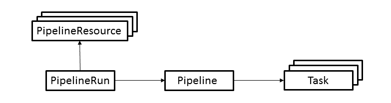

# Archived | 使用 Tekton Pipelines 部署 Knative 应用程序

> 原文：[`developer.ibm.com/zh/tutorials/knative-build-app-development-with-tekton/`](https://developer.ibm.com/zh/tutorials/knative-build-app-development-with-tekton/)

**本文已归档**

**归档日期：:** 2020-04-27

此内容不再被更新或维护。 内容是按“原样”提供。鉴于技术的快速发展，某些内容，步骤或插图可能已经改变。

Tekton Pipelines 是一个开源项目，可在 Kubernetes 集群中配置和运行持续集成和持续交付（也称为 CI/CD）流水线。在本教程中，您将学习以下概念和技能：

*   [Tekton Pipelines](https://tekton.dev/) 项目中使用的基本概念
*   示例：创建一个流水线来构建和部署 [Knative](https://github.com/knative/) 应用程序
*   示例：运行流水线，检查其状态以及排查问题

## 前提条件

在开始学习本教程之前，您必须搭建一个安装了 Knative 和 Tekton 的 Kubernetes 环境。本教程使用 IBM Cloud Kubernetes Service 作为环境：

*   [安装 CLI 以管理集群](https://cloud.ibm.com/docs/containers?topic=containers-cs_cli_install#cs_cli_install_steps)

*   [在 IBM Cloud Kubernetes Service 中创建一个标准 Kubernetes 集群](https://cloud.ibm.com/docs/containers?topic=containers-clusters#clusters_ui_standard)

*   [在 IBM Cloud Container Registry 中创建一个私有容器注册表](https://cloud.ibm.com/docs/services/Registry?topic=registry-registry_setup_cli_namespace#registry_setup_cli_namespace)

*   [在集群中安装 Knative](https://cloud.ibm.com/docs/containers?topic=containers-knative_tutorial#knative_setup)

*   [在集群中安装 Tekton Pipelines](https://github.com/tektoncd/pipeline/blob/master/docs/install.md#adding-the-tekton-pipelines)

## 预估时间

本教程大约需要一个小时，包括安装和相关配置。

## 第 1 步：了解 Tekton Pipeline 概念

Tekton 以[自定义资源](https://kubernetes.io/docs/concepts/extend-kubernetes/api-extension/custom-resources/)的形式提供了一组 Kubernetes 扩展，用于定义流水线。

下图显示了本教程中使用的资源。箭头描述了从一种资源到另一种资源的引用。



本教程使用了以下资源：

*   **PipelineResource** 定义了一个对象，该对象是流水线的输入（例如 git 存储库）或输出（例如 docker 镜像）。
*   **PipelineRun** 定义了流水线的执行。它引用要运行的 **Pipeline** 以及要用作输入和输出的 **PipelineResources**。
*   **Pipeline** 定义了构成流水线的 **Tasks**。
*   **Task** 定义了一组构建步骤，如编译代码、运行测试以及构建和部署镜像。

本教程中的示例演示部分将详细介绍每种资源。

## 第 2 步：创建示例流水线

本节将展示如何在 Tekton 中构建处理以下操作的流水线：

*   通过源文件构建 Docker 镜像并将其推送到您的私有容器注册表
*   在 Kubernetes 集群中将镜像作为 Knative 服务部署

您应该将此项目克隆到您的工作站，因为您首先需要编辑一些 yaml 文件才能将这些文件应用于您的集群。

```
git clone https://github.com/IBM/tekton-tutorial 
```

从头开始。首先，定义构建和部署镜像所需的任务资源， 然后定义引用任务的流水线资源，最后创建运行流水线所需的 `PipelineRun` 和 `PipelineResource` 资源。

您创建一个任务来构建镜像并将其推送到容器注册表。参阅以下 Tekton 任务，该任务将构建 Docker 镜像并将其推送到容器注册表。完整的注册表可以在 [tekton/tasks/source-to-image.yaml](https://github.com/IBM/tekton-tutorial/blob/master/tekton/tasks/source-to-image.yaml) 找到。

```
apiVersion: tekton.dev/v1alpha1
kind: Task
metadata:
  name: source-to-image
spec:
  inputs:
    resources:
      - name: git-source
        type: git
    params:
      - name: pathToContext
        description: The path to the build context, used by Kaniko - within the workspace
        default: .
      - name: pathToDockerFile
        description: The path to the dockerfile to build (relative to the context)
        default: Dockerfile
      - name: imageUrl
        description: Url of image repository
      - name: imageTag
        description: Tag to apply to the built image
        default: "latest"
  steps:
    - name: build-and-push
      image: gcr.io/kaniko-project/executor
      command:
        - /kaniko/executor
      args:
        - --dockerfile=${inputs.params.pathToDockerFile}
        - --destination=${inputs.params.imageUrl}:${inputs.params.imageTag}
        - --context=/workspace/git-source/${inputs.params.pathToContext} 
```

一个 Tekton 任务可能需要一个或多个步骤。每个步骤都定义一个要运行的镜像以执行该步骤的功能。本任务中有一个步骤使用 [kaniko](https://github.com/GoogleContainerTools/kaniko) 项目从源代码构建 Docker 镜像，然后将其推送到注册表。

该任务需要 `git` 类型的输入资源，该资源定义了源代码的位置。 `git` 源代码将克隆到路径为 `/workspace/git-source` 的本地卷中，其中 `git-source` 来自我们为资源指定的名称。（注意，资源只是任务的抽象参数。）

在本教程的后面，您将看到如何将其绑定到 `PipelineResources` 资源，后者定义了所使用的实际资源。该任务可在不同的 Git 存储库中重复使用。

Tekton 任务也可以有输入参数。参数有助于提高任务的可重用性。

本任务接受以下参数：

*   指向 git 源代码中 Docker 构建上下文的路径
*   指向构建上下文中 Dockerfile 的路径
*   应在其中存储镜像的镜像存储库的 URL
*   要应用于已构建镜像的镜像标签

您可能想知道这个任务如何对镜像存储库进行身份验证，以获取推送镜像的权限。本教程中的后续步骤将介绍上述身份验证。请继续阅读。

要创建任务，将以下文件应用于集群：

```
kubectl apply -f tekton/tasks/source-to-image.yaml 
```

## 第 3 步：创建一个任务来将镜像部署到 Kubernetes 集群

以下 Tekton 任务会将 Docker 镜像部署到 Kubernetes 集群。[tekton/tasks/deploy-using-kubectl.yaml](https://github.com/IBM/tekton-tutorial/blob/master/tekton/tasks/deploy-using-kubectl.yaml) 中提供了完整的 YAMLL 文件。

```
apiVersion: tekton.dev/v1alpha1
kind: Task
metadata:
  name: deploy-using-kubectl
spec:
  inputs:
    resources:
      - name: git-source
        type: git
    params:
      - name: pathToYamlFile
        description: The path to the yaml file to deploy within the git source
      - name: imageUrl
        description: Url of image repository
      - name: imageTag
        description: Tag of the images to be used.
        default: "latest"
  steps:
    - name: update-yaml
      image: alpine
      command: ["sed"]
      args:
        - "-i"
        - "-e"
        - "s;__IMAGE__;${inputs.params.imageUrl}:${inputs.params.imageTag};g"
        - "/workspace/git-source/${inputs.params.pathToYamlFile}"
    - name: run-kubectl
      image: lachlanevenson/k8s-kubectl
      command: ["kubectl"]
      args:
        - "apply"
        - "-f"
        - "/workspace/git-source/${inputs.params.pathToYamlFile}" 
```

要创建一个任务来将镜像部署到 Kubernetes 集群，可分两步进行：

1.  首先，在 Alpine Linux 容器中运行 `sed`，以使用由 source-to-image 任务生成的镜像来更新用于部署的 YAML 文件。在必须进行更新的位置，YAML 文件必须具有一个 `__IMAGE__` 字符串。

2.  然后，使用 Lachlan Evenson 流行的 `k8s-kubectl` 容器镜像来运行 `kubectl`，以将 YAML 文件应用于正在运行流水线的集群。像 source-to-image 任务一样，此任务使用输入 `PipelineResource` 和参数以便尽可能重复使用任务。

如果您想知道任务如何对集群进行身份验证，以获取应用 YAML 文件中的资源的权限，那么继续阅读。本教程中的后续步骤将介绍上述身份验证。

要创建任务，将以下文件应用于集群：

```
kubectl apply -f tekton/tasks/deploy-using-kubectl.yaml 
```

## 第 4 步：创建流水线

以下 Tekton 流水线会运行前面描述的两个任务。[tekton/pipeline/build-and-deploy-pipeline.yaml](https://github.com/IBM/tekton-tutorial/blob/master/tekton/pipeline/build-and-deploy-pipeline.yaml) 中提供了完整的 YAML 文件。

```
apiVersion: tekton.dev/v1alpha1
kind: Pipeline
metadata:
  name: build-and-deploy-pipeline
spec:
  resources:
    - name: git-source
      type: git
  params:
    - name: pathToContext
      description: The path to the build context, used by Kaniko - within the workspace
      default: src
    - name: pathToYamlFile
      description: The path to the yaml file to deploy within the git source
    - name: imageUrl
      description: Url of image repository
    - name: imageTag
      description: Tag to apply to the built image
  tasks:
  - name: source-to-image
    taskRef:
      name: source-to-image
    params:
      - name: pathToContext
        value: "${params.pathToContext}"
      - name: imageUrl
        value: "${params.imageUrl}"
      - name: imageTag
        value: "${params.imageTag}"
    resources:
      inputs:
        - name: git-source
          resource: git-source
  - name: deploy-to-cluster
    taskRef:
      name: deploy-using-kubectl
    runAfter:
      - source-to-image
    params:
      - name: pathToYamlFile
        value:  "${params.pathToYamlFile}"
      - name: imageUrl
        value: "${params.imageUrl}"
      - name: imageTag
        value: "${params.imageTag}"
    resources:
      inputs:
        - name: git-source
          resource: git-source 
```

Tekton Pipeline 资源列出了要运行的任务，并提供了每个任务所需的输入和输出资源以及输入参数。必须将所有资源作为流水线的输入或输出进行公开。流水线不能将资源绑定到实际的 `PipelineResource`。但是，您可以选择是将任务的输入参数作为流水线输入参数公开，直接设置值，还是接受任务的默认值（对于可选参数）。

例如，该流水线从 source-to-image 任务公开 `pathToContext` 参数，但不公开 `pathToDockerFile` 参数，并允许其在任务中成为默认设置。

可以使用 `runAfter` 关键字来表示任务之间的依赖关系。该关键字指定任务必须在完成任务列表中的某一项任务之后才能运行。

在此示例中，该流水线指定 `deploy-using-kubectl` 任务必须在 `source-to-image` 任务之后运行。Tekton 将对任务执行进行排序以满足这种依赖关系。

您也可以使用 `from` 关键字来表示任务之间的依赖关系。本教程没有使用这个关键字，但是您可以在 [Tekton 文档](https://github.com/tektoncd/pipeline/blob/master/docs/pipelines.md#from)中阅读详细内容。

要创建流水线，将以下文件应用于集群：

```
kubectl apply -f tekton/pipeline/build-and-deploy-pipeline.yaml 
```

## 第 5 步：创建 PipelineRun 和 PipelineResources

您定义了用于构建和部署镜像的可重用流水线和任务资源。现在该研究一下如何使用实际的输入资源和参数来运行流水线。

以下 Tekton `PipelineRun` 资源将会运行您在上一步中定义的流水线。[tekton/run/picalc-pipeline-run.yaml](https://github.com/IBM/tekton-tutorial/blob/master/tekton/run/picalc-pipeline-run.yaml) 中提供了完整的 YAML 文件。

```
apiVersion: tekton.dev/v1alpha1
kind: PipelineRun
metadata:
  generateName: picalc-pr-
spec:
  pipelineRef:
    name: build-and-deploy-pipeline
  resources:
    - name: git-source
      resourceRef:
        name: picalc-git
  params:
    - name: pathToYamlFile
      value: "knative/picalc.yaml"
    - name: imageUrl
      value: <REGISTRY>/<NAMESPACE>/picalc
    - name: imageTag
      value: "1.0"
  trigger:
    type: manual
  serviceAccount: pipeline-account 
```

尽管这个文件很小，但内容却很丰富：

*   `PipelineRun` 资源没有固定名称。每次创建时，该资源都会使用 `generateName` 生成一个名称。为什么？特定的 `PipelineRun` 资源仅执行流水线一次。如果要再次运行流水线，无法通过修改现有的 `PipelineRun` 资源来请求重新运行流水线。相反，必须创建另一个 `PipelineRun` 资源。每次创建 `PipelineRun` 时，可以使用 `name` 为其分配一个唯一名称，但使用 `generateName` 会方便很多。

*   `Pipeline` 资源在 `pipelineRef` 关键字下面标识。

*   流水线所需的 Git 资源绑定到名为 `picalc-git` 的特定 `PipelineResources`。您将在接下来的步骤中对其进行定义。

*   流水线公开的参数将会设置为特定值。

*   指定了一个名为 `pipeline-account` 的服务帐户，以提供成功运行流水线所需的凭据。您将在本教程的下一部分中定义此服务帐户。

您必须编辑此文件，以将 `<REGISTRY>` 和 `<NAMESPACE>` 的值替换为您的私有容器注册表的信息。要找到 `<REGISTRY>` 的值，输入 `ibmcloud cr region` 命令。要查找 `<NAMESPACE>` 的值，输入 `ibmcloud cr namespace-list` 命令。

以下针对 `picalc-git` 的 Tekton `PipelineResource` 定义了 Git 源代码。[tekton/resources/picalc-git.yaml](https://github.com/IBM/tekton-tutorial/blob/master/tekton/resources/picalc-git.yaml) 中提供了完整的 YAML 文件。

```
apiVersion: tekton.dev/v1alpha1
kind: PipelineResource
metadata:
  name: picalc-git
spec:
  type: git
  params:
    - name: revision
      value: master
    - name: url
      value: https://github.com/IBM/tekton-tutorial 
```

此示例的源代码是一个[计算 pi 的近似值的 go 程序](https://github.com/IBM/tekton-tutorial/blob/master/src/picalc.go)。源代码包含一个 [Dockerfile](https://github.com/IBM/tekton-tutorial/blob/master/src/Dockerfile)，负责运行测试，编译代码以及构建用于执行的镜像。

现在，您可以将 `PipelineResource` 文件应用于集群。暂时不要应用 `PipelineRun` 文件，因为您仍然需要为集群定义服务帐户。

```
kubectl apply -f tekton/pipeline/tekton/resources/picalc-git.yaml 
```

## 第 6 步：定义服务帐户

运行流水线之前的最后一步是设置服务帐户，以便流水线可以访问受保护的资源。服务帐户将包含用于身份验证的凭据的 Secret 与 RBAC 相关资源绑定在一起，以获得创建和修改特定 Kubernetes 资源的权限。

首先，通过创建注册表令牌或 IBM Cloud Identity and Access Management (IAM) API 密钥，对私有容器注册表进行编程访问。 [此处](https://cloud.ibm.com/docs/services/Registry?topic=registry-registry_access#registry_access)介绍了创建令牌或 API 秘钥的过程。

在获得令牌或 API 秘钥之后，可以创建以下 Secret：

```
kubectl create secret generic ibm-cr-push-secret --type="kubernetes.io/basic-auth" --from-literal=username=<USER> --from-literal-password=<TOKEN/APIKEY>
kubectl annotate secret ibm-cr-push-secret tekton.dev/docker-0=<REGISTRY> 
```

其中

*   `<USER>` 是 `token`（如果您使用令牌）或 `iamapikey`（如果您使用 API 秘钥）
*   `<TOKEN/APIKEY>` 是您创建的令牌或 API 密钥
*   `<REGISTRY>` 是您的容器注册表的 URL，例如 `us.icr.io` 或 `registry.ng.bluemix.net`

现在，您可以使用以下 YAML 文件创建服务帐户。[tekton/pipeline-account.yaml](https://github.com/IBM/tekton-tutorial/blob/master/tekton/pipeline-account.yaml) 中提供了完整的 YAML 文件。

```
apiVersion: v1
kind: ServiceAccount
metadata:
  name: pipeline-account
secrets:
- name: ibm-cr-push-secret

---

apiVersion: v1
kind: Secret
metadata:
  name: kube-api-secret
  annotations:
    kubernetes.io/service-account.name: pipeline-account
type: kubernetes.io/service-account-token

---

kind: Role
apiVersion: rbac.authorization.k8s.io/v1
metadata:
  name: pipeline-role
rules:
- apiGroups: ["serving.knative.dev"]
  resources: ["services"]
  verbs: ["get", "create", "update", "patch"]

---

apiVersion: rbac.authorization.k8s.io/v1
kind: RoleBinding
metadata:
  name: pipeline-role-binding
roleRef:
  apiGroup: rbac.authorization.k8s.io
  kind: Role
  name: pipeline-role
subjects:
- kind: ServiceAccount
  name: pipeline-account 
```

此 YAML 将创建以下 Kubernetes 资源：

*   一个名为 `pipeline-account` 的 `ServiceAccount`。您之前看到的 `PipelineRun` 使用此名称来引用帐户。服务帐户引用 `ibm-cr-push-secret` Secret，以便流水线在推送容器镜像时对私有容器注册表进行身份验证。
*   一个名为 `kube-api-secret` 的 `Secret`，其中包含用于访问 Kubernetes API 的 API 凭据（由 Kubernetes 生成）。`kube-api-secret` 允许流水线使用 `kubectl` 与集群通信。
*   一个名为 `pipeline-role` 的 `Role` 和一个名为 `pipeline-role-binding` 的 `RoleBinding`，它们提供基于资源的访问控制权限，这正是流水线创建和修改 Knative 服务所需要的。

要创建服务帐户和相关资源，将以下文件应用于集群：

```
kubectl apply -f tekton/pipeline-account.yaml 
```

## 第 7 步：运行流水线

现在一切就绪，可以运行流水线了：

```
kubectl create -f tekton/run/picalc-pipeline-run.yaml 
```

注意，本教程步骤使用 `create` 而不是 `apply`。如上所述，`PipelineRun` 资源只能运行流水线一次，因此每次您要运行流水线时都需要创建一个新的 `PipelineRun` 资源。

然后 `kubectl` 通过为 `PipelineRun` 资源生成名称进行响应：

```
pipelinerun.tekton.dev/picalc-pr-db6p6 created 
```

您可以使用 `kubectl describe` 命令检查流水线的状态：

```
kubectl describe pipelinerun picalc-pr-db6p6 
```

如果在创建 `PipelineRun` 之后相对较快地输入命令，则可能会看到类似于以下示例的输出：

```
Name:         picalc-pr-db6p6
Namespace:    default
Labels:       tekton.dev/pipeline=build-and-deploy-pipeline
Annotations:  <none>
API Version:  tekton.dev/v1alpha1
Kind:         PipelineRun
Metadata:
  Creation Timestamp:  2019-04-15T14:29:23Z
  Generate Name:       picalc-pr-
  Generation:          1
  Resource Version:    3893390
  Self Link:           /apis/tekton.dev/v1alpha1/namespaces/default/pipelineruns/picalc-pr-db6p6
  UID:                 dd207211-5f8a-11e9-b66d-8eb09a9ab3eb
Spec:
  Status:  
  Params:
    Name:   pathToYamlFile
    Value:  knative/picalc.yaml
    Name:   imageUrl
    Value:  registry.ng.bluemix.net/mynamespace/picalc
    Name:   imageTag
    Value:  1.3
  Pipeline Ref:
    Name:  build-and-deploy-pipeline
  Resources:
    Name:  git-source
    Resource Ref:
      Name:         picalc-git
  Service Account:  pipeline-account
  Trigger:
    Type:  manual
Status:
  Conditions:
    Last Transition Time:  2019-04-15T14:29:23Z
    Message:               Not all Tasks in the Pipeline have finished executing
    Reason:                Running
    Status:                Unknown
    Type:                  Succeeded
  Start Time:              2019-04-15T14:29:23Z
  Task Runs:
    Picalc - Pr - Db 6 P 6 - Source - To - Image - Kczdb:
      Pipeline Task Name:  source-to-image
      Status:
        Conditions:
          Last Transition Time:  2019-04-15T14:29:28Z
          Reason:                Building
          Status:                Unknown
          Type:                  Succeeded
        Pod Name:                picalc-pr-db6p6-source-to-image-kczdb-pod-7b4e7c
        Start Time:              2019-04-15T14:29:23Z
        Steps:
          Running:
            Started At:  2019-04-15T14:29:26Z
          Terminated:
            Container ID:  containerd://b8f770e2b57d59c2bce76c63713d0b0a33f3fd02a14bad6b96978012060a436a
            Exit Code:     0
            Finished At:   2019-04-15T14:29:26Z
            Reason:        Completed
            Started At:    2019-04-15T14:29:26Z
          Terminated:
            Container ID:  containerd://a637b1cb5d83b1ad2aa0dbecd962bb70b0452900189f611e404c0c9515262443
            Exit Code:     0
            Finished At:   2019-04-15T14:29:26Z
            Reason:        Completed
            Started At:    2019-04-15T14:29:26Z
Events:                    <none> 
```

注意 `Not all Tasks in the Pipeline have finished executing`。重新运行命令以检查状态。如果流水线成功运行，则总体状态最终应类似于以下示例：

```
Status:
  Conditions:
    Last Transition Time:  2019-04-15T14:30:46Z
    Message:               All Tasks have completed executing
    Reason:                Succeeded
    Status:                True
    Type:                  Succeeded
  Start Time:              2019-04-15T14:29:23Z 
```

检查已部署的 Knative 服务的状态。应该已经准备就绪，如以下示例所示：

```
$ kubectl get ksvc picalc
NAME      DOMAIN                                                          LATESTCREATED   LATESTREADY    READY     REASON
picalc    picalc.default.mycluster6.us-south.containers.appdomain.cloud   picalc-00001    picalc-00001   True 
```

您可以在响应中使用 URL，以便向服务发出 curl 命令：

```
$ curl picalc.default.mycluster6.us-south.containers.appdomain.cloud?iterations=20000000
3.1415926036 
```

如果流水线未成功运行，则总体状态可能类似于以下示例：

```
Status:
  Conditions:
    Last Transition Time:  2019-04-15T14:30:46Z
    Message:               TaskRun picalc-pr-db6p6-deploy-to-cluster-7h8pm has failed
    Reason:                Failed
    Status:                False
    Type:                  Succeeded
  Start Time:              2019-04-15T14:29:23Z 
```

然后，在任务运行状态下，您应该会找到一条类似于以下示例的消息，告知您如何从失败的构建步骤中获取日志。查看日志以找出问题的原因。

```
build step "build-step-deploy-using-kubectl" exited with code 1 (image: "docker.io/library/alpine@sha256:28ef97b8686a0b5399129e9b763d5b7e5ff03576aa5580d6f4182a49c5fe1913"); for logs run: kubectl -n default logs picalc-pr-db6p6-deploy-to-cluster-7h8pm-pod-582c73 -c build-step-deploy-using-kubectl 
```

## 提示

将 `PipelineResource` 定义为一个任务的输出，而且同时将其定义为另一个任务的输入时，需要小心。

例如，本教程可能使用了 [image PipelineResource](https://github.com/tektoncd/pipeline/blob/master/docs/resources.md#image-resource) 来定义 `source-to-image` 任务的输出镜像和以及 `deploy-using-kubectl` 任务的输入镜像。

此方法将导致 Tekton [创建一个 PersistentVolumeClaim 以在任务之间共享数据](https://github.com/tektoncd/pipeline/blob/master/docs/developers/README.md#how-are-resources-shared-between-tasks)。此 Tekton Pipeline 功能在本文发表时尚未完全实现，因此本教程中没有使用。

## 结束语

Tekton 提供了简单易学的功能，可用于构建在 Kubernetes 上运行的 CI/CD 流水线。

本教程介绍了一些基础知识，可帮助您开始构建自己的流水线。Tekton 还有更多功能可供您使用，并且计划在即将发布的版本中提供更多功能。马上利用 [IBM Cloud Kubernetes Service](https://cloud.ibm.com/kubernetes/catalog/cluster) 亲身体验一番吧。

本文翻译自：[Deploy a Knative application using Tekton Pipelines](https://developer.ibm.com/tutorials/knative-build-app-development-with-tekton/)（2019-06-05）