# 在 Red Hat OpenShift 上部署深度学习模型

> 原文：[`developer.ibm.com/zh/tutorials/deploy-a-model-asset-exchange-microservice-on-red-hat-openshift/`](https://developer.ibm.com/zh/tutorials/deploy-a-model-asset-exchange-microservice-on-red-hat-openshift/)

## 学习目标

通过完成本入门教程，您将学习如何在 Red Hat OpenShift 上[通过 Model Asset Exchange 部署深度学习微服务](https://developer.ibm.com/zh/series/create-model-asset-exchange/)。

在完成本教程后，您将了解如何使用 OpenShift Web 控制台或 OpenShift Container Platform 命令行界面 (CLI) 来执行以下操作：

*   创建一个新项目
*   在 Docker Hub 上通过公共容器镜像部署模型服务式微服务
*   创建一条用于向公众公开微服务的连接

## 前提条件

**免费试用 IBM Cloud**

利用 [IBM Cloud Lite](https://cocl.us/IBM_CLOUD_GCG) 快速轻松地构建您的下一个应用程序。您的免费帐户从不过期，而且您会获得 256 MB 的 Cloud Foundry 运行时内存和包含 Kubernetes 集群的 2 GB 存储空间。[了解所有细节](https://www.ibm.com/cloud/blog/announcements/introducing-ibm-cloud-lite-account-2)并确定如何开始。

要学习本教程，您必须：

*   具备 [IBM Cloud 帐户](https://cocl.us/IBM_CLOUD_GCG)或 [Red Hat 帐户](https://www.openshift.com)
*   安装了 [Red Hat OpenShift Container Platform CLI](https://cloud.ibm.com/docs/openshift?topic=openshift-openshift-cli)（可选，只有在您需要完成本教程的第二部分时才必须安装）

本教程是在 IBM Cloud 上使用 Red Hat OpenShift V3.11 创建的。如果使用 Red Hat OpenShift Online（在撰写本文时使用的是 V3）来完成本教程，您会注意到一些 GUI 差异。

## 预估时间

完成本教程大约需要 30 分钟。其中包括以下教程模块：

*   **教程设置**
*   **在 Red Hat OpenShift 上部署深度学习模型服务式微服务**
    *   使用 OpenShift Web 控制台部署
    *   使用 OpenShift Platform CLI 部署

## 教程设置

要完成本教程，您必须有权访问小型的单节点 OpenShift 集群。

### 配置 Red Hat OpenShift 集群

如果您无权访问现有集群，请[在 IBM Cloud 上配置一个集群](https://cloud.ibm.com/kubernetes/catalog/openshiftcluster?cm_sp=ibmdev-_-developer-tutorials-_-cloudreg)或者在 [openshift.com](https://www.openshift.com/trial/) 上配置一个集群。

> 您可以在 openshift.com 上使用免费入门层来完成本教程。但请注意，RAM 限制为 2 GiB，对于资源密集型模型，这不一定够用。

在本教程中，操作说明和截图引用的是名为 `os-max-test-cluster` 的集群。必要时，可将此名称替换为您集群的名称。

您已准备好开始本教程。

## 在 Red Hat OpenShift 上部署深度学习模型服务式微服务

在本教程中，您将使用 OpenShift Web 控制台或 OpenShift Container Platform CLI，在 Red Hat OpenShift 上通过 [Model Asset Exchange](https://developer.ibm.com/exchanges/models/) 来部署模型服务式微服务。您可以完成这两部分，也可以只完成一部分。

### 使用 OpenShift Web 控制台部署

在本教程的此部分（第一部分）中，将部署 [MAX-Object-Detector](https://developer.ibm.com/exchanges/models/all/max-object-detector/) 模型服务式微服务，此微服务可用于识别图片中的对象，如该[演示](https://github.com/IBM/MAX-Object-Detector/blob/master/demo.ipynb)中所示。

1.  打开 OpenShift Web 控制台。

    1.  在 Web 浏览器中，打开 [IBM Cloud 上的 Kubernetes 集群页面](https://cloud.ibm.com/kubernetes/clusters?cm_sp=ibmdev-_-developer-tutorials-_-cloudreg)。
    2.  找到您的 OpenShift 集群条目 `os-max-test-cluster`。
    3.  从 **…** 下拉菜单中选择 **OpenShift web console**。 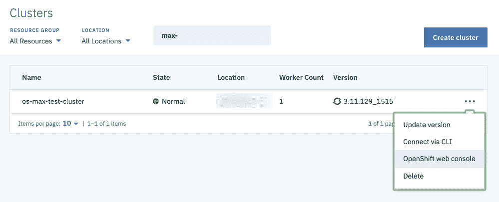

        这将显示目录浏览器。

2.  从下拉菜单中选择 **Application console**。这将显示您的项目列表。在 OpenShift 中使用项目来组织相关资源。

    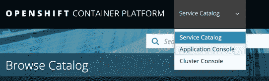

3.  创建一个新项目，并为其指定名称（如 `max-deployments`）、显示名称和可选描述。
4.  打开该项目。

### 部署微服务 Docker 镜像

您可以部署公共或专用注册表中托管的 Docker 镜像。MAX-Object-Detector Docker 镜像 `codait/max-object-detector` 是在 [Docker Hub](https://hub.docker.com/r/codait/max-object-detector) 中托管。

1.  在项目概述页面上，选择 **Deploy Image**。

    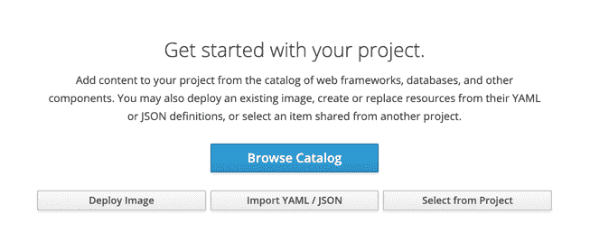

    > 如果您的概述页面看起来与此不同（例如，可能是因为您正在使用包含应用程序的现有项目），请使用菜单栏中的 **Add to Project** 下拉菜单，并选择 **Deploy Image**。

2.  选择要部署的模型服务式 Docker 镜像。

    1.  选中 **Image Name** 单选按钮以选择公共或专用存储库作为源。
    2.  输入 `codait/max-object-detector` 作为*镜像名称或提取规范*（或者输入 [Docker Hub 上的存储库](https://hub.docker.com/r/codait/)中的另一个模型服务式 Docker 镜像的名称）。

        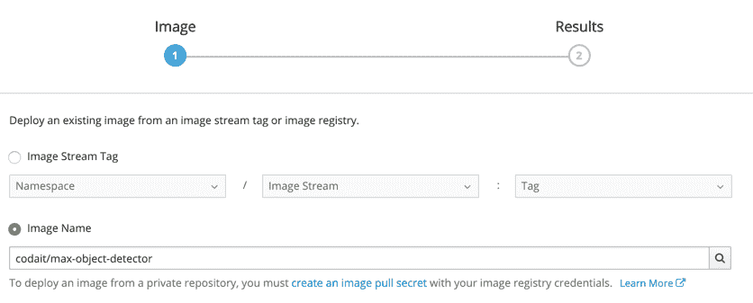

    3.  单击镜像名称旁边的放大镜（或者按 Enter 键）以加载 Docker 镜像的元数据。
3.  查看所选 Docker 镜像的部署配置。

    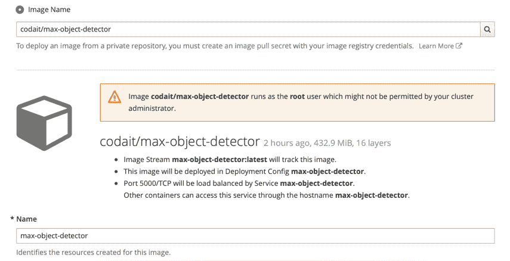

    将使用 Docker 镜像的名称来预填充 *Name* 字段。OpenShift 使用此名称来识别在部署应用程序时创建的资源。

    > 如果追加、修改或删除了一些字符，您会注意到这一更改对于所生成的镜像流名称、部署配置名称、服务名称和主机名称的影响。（但在本教程中，该名称将保留原样！）

    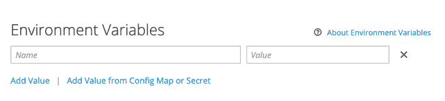

    您可以通过设置环境变量来定制大多数模型服务式微服务的行为。例如，您可通过将部署配置中的 `CORS_ENABLE` 变量设置为 `true` 来启用[跨源资源共享](https://developer.mozilla.org/en-US/docs/Web/HTTP/CORS)支持。参阅模型文档，获取特定于模型的环境设置。

4.  **部署** Docker 镜像。

5.  关闭窗口，然后打开 **Overview** 选项卡（如果默认情况下未选择此选项卡）。这将显示 Object Detector 模型服务式微服务的部署配置。

    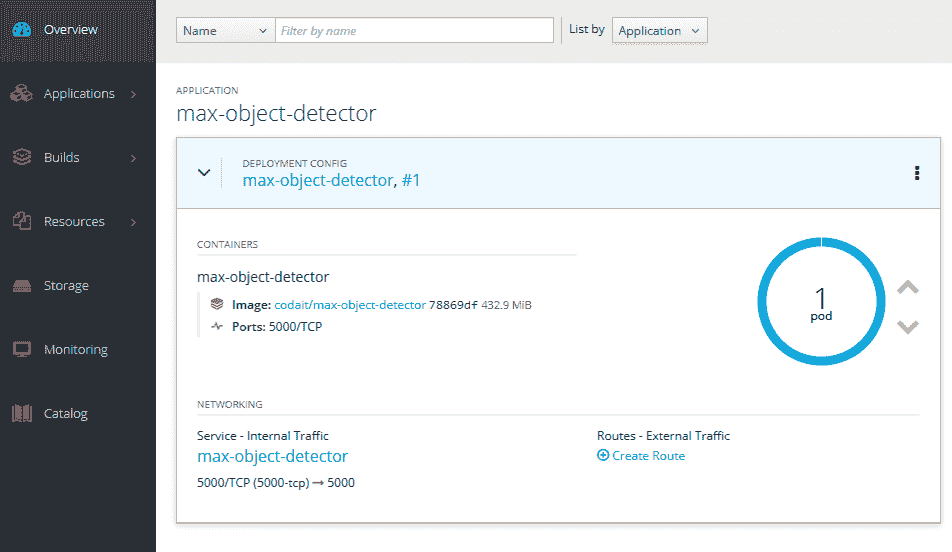

    默认情况下，只会启动该微服务的一个实例。您可以通过增加正在运行的 pod 的目标数量来手动扩展部署（“运行更多微服务实例以同时处理更多请求”）。您还可以通过单击部署配置名称，然后选择*配置*和*添加自动扩展器*来启用自动扩展（“必要时可运行多达 X 个实例”）。

在部署微服务后，它仅在集群内部（在端口 5000 处）可见。要向公众公开，您必须创建一条连接。

### 创建连接

当您在 OpenShift 中[创建连接](https://docs.openshift.com/container-platform/3.11/dev_guide/routes.html)时，您可以选择公开不安全连接或安全连接。由于模型服务式微服务通过 HTTP 进行通信，因此您可以将路由器配置为公开不安全的 HTTP 连接（这是您在本教程中将要执行的操作），或者公开安全的 HTTP 连接，OpenShift 路由器会自动终止该连接。

1.  选择 NETWORKING 部分下的 **Create Route**。
2.  查看配置设置。如果将主机名留空，那么默认情况下会在生成的 URL 中公开不安全的 HTTP 连接。 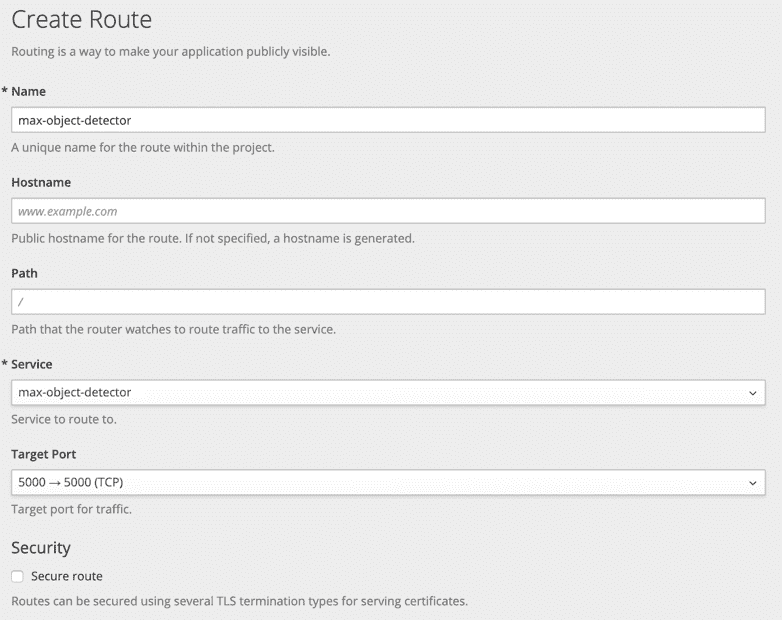

    > 要配置安全的 HTTP 连接，可选择 *Secure route*，将 *TLS Termination* 设置为 *Edge*，并将 *Insecure Traffic* 设置为 *None*。您可以指定自己的 TLS 证书或者使用路由器的默认证书。

3.  **创建**连接。完成该操作后，将显示已部署模型服务式微服务的公共 URL。 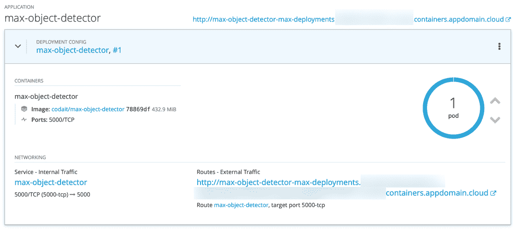

    > 如果显示的错误指示路由器拒绝了请求，请缩短连接名称。所生成 URL（通过合并连接名称、项目名称、集群名称和路由器域来生成）的最大长度可能超出了最大限制 63 个字符。

4.  打开显示的 URL，以验证是否可以访问微服务的 OpenAPI 规范端点。

    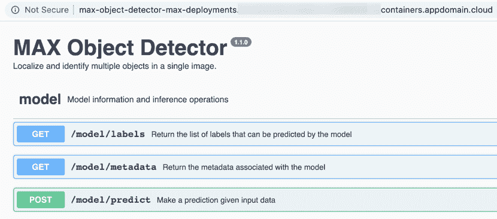

5.  如果您一直使用 Object Detector 来学习本教程，那么可通过将 `/app` 追加到浏览器中显示的 URL 后面来打开嵌入式样本应用程序，并可通过提交镜像来测试已部署的服务。

    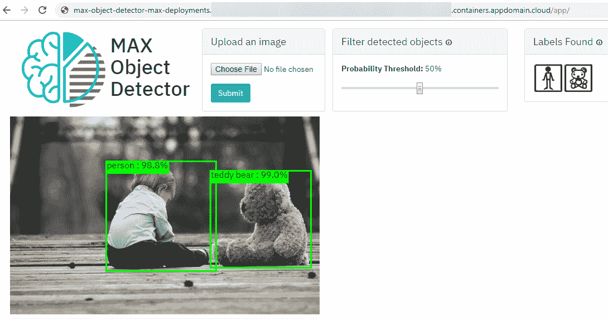

跳至教程摘要或者查看下一部分中的操作说明，了解如何使用命令行界面来部署模型服务式微服务。

### 使用 CLI 部署

您可以使用 OpenShift Container Platform CLI (`oc`) 来部署和管理应用程序。 使用 CLI 在集群中部署微服务之前，您必须先登录。

1.  打开 OpenShift Web 控制台并复制 login 命令。

    1.  在 Web 浏览器中，打开 [IBM Cloud 上的 Kubernetes 集群页面](https://cloud.ibm.com/kubernetes/clusters?cm_sp=ibmdev-_-developer-tutorials-_-cloudreg)。
    2.  找到您的 OpenShift 集群条目 `os-max-test-cluster`。
    3.  从 **…** 下拉菜单中选择 **OpenShift web console**。

        

        这将显示目录浏览器。

    4.  从头像下拉列表中选择 **Copy Login Command**。

        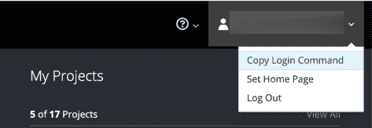

    > 不要分享 login 命令。它包含一个令牌，此令牌可授权访问您帐户中的资源。

2.  使用 OpenShift CLI 登录到您的集群。

    1.  打开终端窗口。
    2.  粘贴所复制的 login 命令。

        ```
        oc login https://...--token=... 
        ```

    > 提示：要了解有关命令的更多信息，请运行 `oc <command> --help`，例如，`oc login --help`。

3.  使用诸如 `max-deployments-cli` 之类的名称来新建一个项目。OpenShift 使用项目来组织相关资源。

    ```
    oc new-project max-deployments-cli 
    ```

    > 您可以使用 `oc projects` 列出现有项目，或者使用 `oc project <project-name>` 在项目之间进行切换。

### 部署 Docker 镜像

您可以部署公共或专用注册表中托管的 Docker 镜像。在教程的此部分中，部署 [MAX-Image-Caption-Generator](https://developer.ibm.com/exchanges/models/all/max-image-caption-generator/) 模型服务式微服务，此微服务可用于以句子形式描述图片内容，如[此演示](http://max-image-caption-generator-web-app.codait-prod-41208c73af8fca213512856c7a09db52-0000.us-east.containers.appdomain.cloud/)中所示。

1.  验证您是否可以访问 [Docker Hub 上的 `codait/max-image-caption-generator` Docker 镜像](https://hub.docker.com/r/codait/max-image-caption-generator)。

    ```
    oc new-app --search codait/max-image-caption-generator 
    ```

    输出应如下所示：

    ```
     Docker images (oc new-app --docker-image=<docker-image> [--code=<source>])
     -----
     codait/max-image-caption-generator
     Registry: Docker Hub
     Tags:     latest 
    ```

2.  部署 Docker 镜像。

    ```
    oc new-app codait/max-image-caption-generator 
    ```

    查看输出，并注意默认情况下使用镜像名称 `max-image-caption-generator` 来命名所生成的资源，例如，镜像流、部署配置、服务和主机。

    ```
    --> Found Docker image ...(... days old) from Docker Hub for "codait/max-image-caption-generator"

     * An image stream tag will be created as "max-image-caption-generator:latest" that will track this image
     * This image will be deployed in deployment config "max-image-caption-generator"
     * Port 5000/tcp will be load balanced by service "max-image-caption-generator"
       * Other containers can access this service through the hostname "max-image-caption-generator"
     * WARNING: Image "codait/max-image-caption-generator" runs as the 'root' user which may not be permitted by your cluster administrator

    --> Creating resources ...
     imagestream.image.openshift.io "max-image-caption-generator" created
     deploymentconfig.apps.openshift.io "max-image-caption-generator" created
     service "max-image-caption-generator" created
    --> Success
    ...
    Run 'oc status' to view your app. 
    ```

    > 您可以通过在部署镜像时提供 `--name <my-custom-name>` 参数来更改默认值。

3.  您可以通过设置环境变量来定制大多数模型服务式微服务的行为。例如，您可以通过将部署配置中的 `CORS_ENABLE` 变量设置为 `true` 来启用[跨源资源共享](https://developer.mozilla.org/en-US/docs/Web/HTTP/CORS)支持：

    ```
    oc set env deploymentconfig max-image-caption-generator CORS_ENABLE=true 
    ```

    参阅模型文档，获取特定于模型的环境设置。

4.  查询部署状态。

    ```
    oc status 
    ```

    请注意，在部署后，有一个微服务实例正在运行，并且它仅在集群内部（在端口 5000 处）可见。

    ```
    In project max-deployments-cli on server https://...

    svc/max-image-caption-generator - ...:5000
      dc/max-image-caption-generator deploys istag/max-image-caption-generator:latest
        deployment #1 deployed 15 minutes ago - 1 pod 
    ```

    > 您可以通过增加正在运行的 pod 的目标数量来手动扩展部署 (`oc scale --replicas=2 deploymentconfig max-image-caption-generator`)，或者[配置自动扩展](https://docs.openshift.com/container-platform/3.11/dev_guide/pod_autoscaling.html)。

    要向公众公开此服务，您必须创建一条连接。

### 创建连接

当您在 OpenShift 中[创建连接](https://docs.openshift.com/container-platform/3.11/dev_guide/routes.html)时，您可以选择公开不安全连接或安全连接。由于模型服务式微服务通过 HTTP 进行通信，因此您可以将路由器配置为公开不安全的 HTTP 连接（这是您在本教程中将要执行的操作），或者公开安全的 HTTP 连接，OpenShift 路由器会自动终止该连接。

1.  为该服务创建连接。

    ```
    oc expose service max-image-caption-generator 
    ```

2.  检索该微服务的公共 URL。

    ```
    oc get route max-image-caption-generator 
    ```

    在 `HOST/PORT` 列下，将显示生成的主机名。

    ```
    NAME                          HOST/PORT                                                          ...     
    max-image-caption-generator   max-image-caption-generator-max-deployments-cli...appdomain.cloud  ... 
    ```

    > 如果 `HOST/PORT` 显示为 `InvalidHost`，表示生成的主机名无效。当长度超过最大限制 63 个字符时，通常会发生这种情况。要解决此问题，请缩短连接名称。例如，要缩短 `max-image-caption-generator` 服务的连接名称，请依次运行 `oc expose service max-image-caption-generator --name <shorter-route-name>` 和 `oc get route <shorter-route-name>`，以检索公共 URL。

3.  在 Web 浏览器中打开显示的 URL 以验证微服务是否可以访问。

    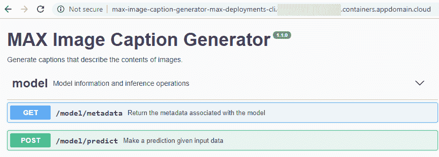

4.  验证 `/model/predict` 端点是否返回了所选图片的期望结果。

    注意：对于某些计算密集型模型，如果使用路由器的默认配置，那么对 `/model/predict` 端点的调用可能会导致 [HTTP 错误 504（网关超时）](https://developer.mozilla.org/en-US/docs/Web/HTTP/Status/504)。要解决此问题，请通过运行 `oc annotate route <router-name> --overwrite haproxy.router.openshift.io/timeout=<number-of-seconds>s` 来增加路由器的超时值。

## 结束语

在本教程中，您了解了如何使用 OpenShift Web 控制台或 OpenShift Container Platform CLI 来执行以下操作：

*   创建一个新项目
*   在 Docker Hub 上通过公共容器镜像部署模型服务式微服务
*   创建一条用于向公众公开微服务的连接

要了解有关 Model Asset Exchange 的更多信息，以及如何使用 Node-RED 或 JavaScript 中部署的模型服务式微服务，查看[学习路径：Model Asset Exchange 简介](https://developer.ibm.com/zh/series/create-model-asset-exchange/)和这些 [pen](https://codepen.io/collection/DzdpJM/)。

如果您想了解有关 Red Hat OpenShift 的更多信息，可能会发现以下资源非常有用：

*   [IBM Cloud 上的 Red Hat OpenShift 入门](https://cloud.ibm.com/docs/openshift?topic=openshift-getting-started)
*   [OpenShift 学习门户网站](https://learn.openshift.com)
*   [OpenShift Container Platform CLI 参考](https://docs.openshift.com/container-platform/3.11/cli_reference/index.html)

本文翻译自：[Deploy deep learning models on Red Hat OpenShift](https://developer.ibm.com/tutorials/deploy-a-model-asset-exchange-microservice-on-red-hat-openshift/#deploy-using-the-openshift-web-console)（2019-08-16）