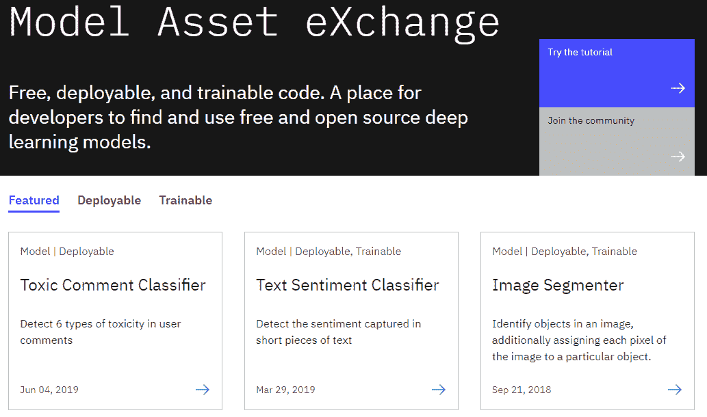
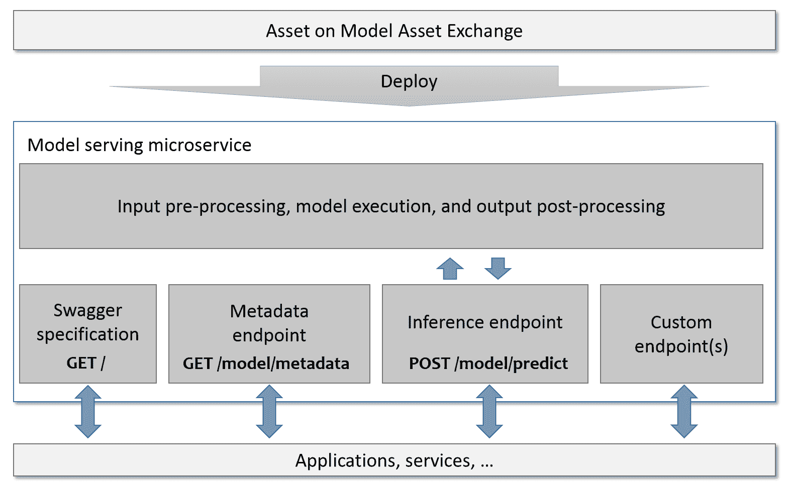
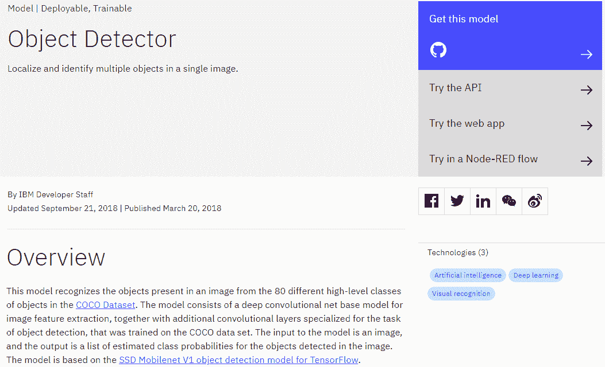
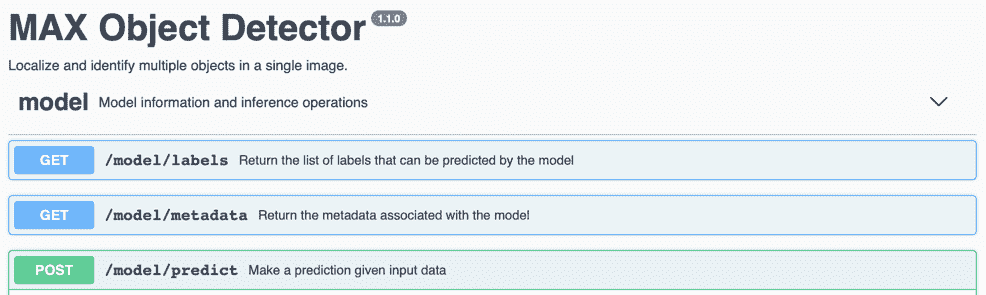
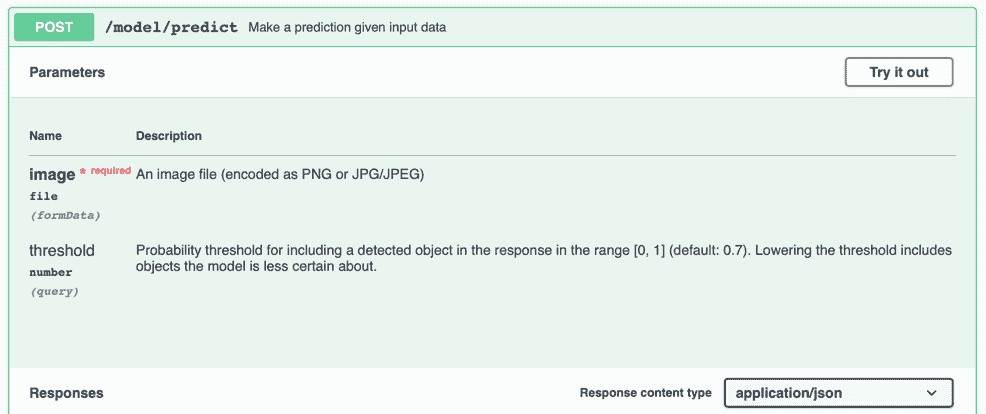
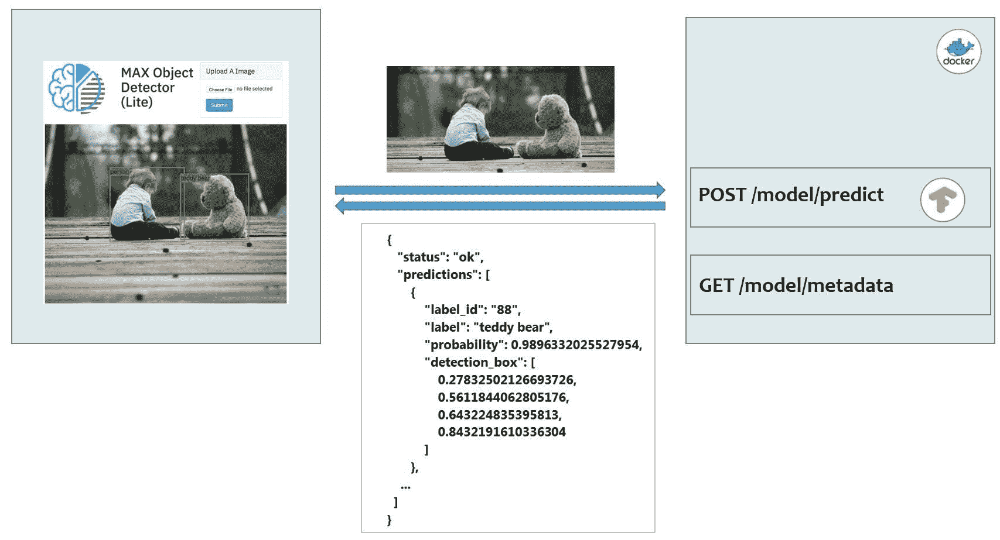
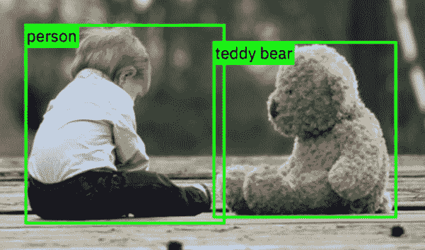
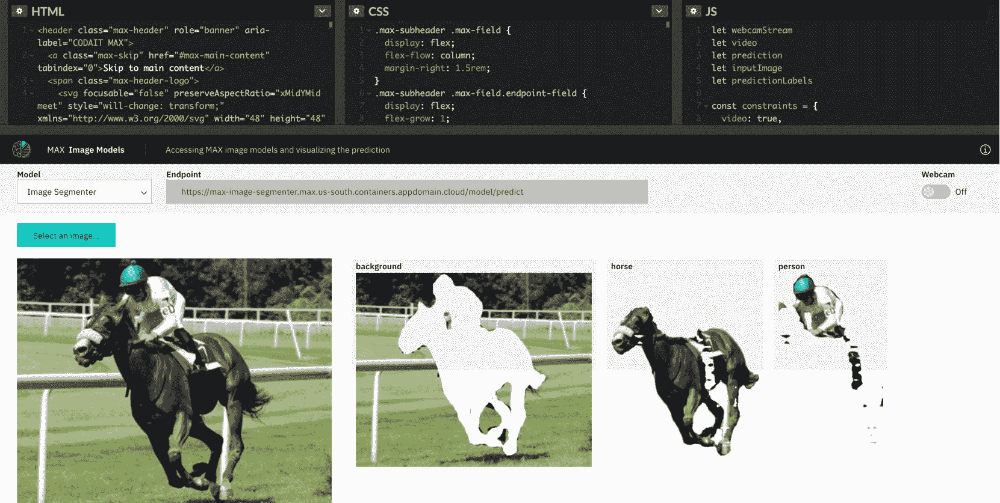

# Model Asset Exchange 入门

> 原文：[`developer.ibm.com/zh/tutorials/getting-started-with-the-ibm-code-model-asset-exchange/`](https://developer.ibm.com/zh/tutorials/getting-started-with-the-ibm-code-model-asset-exchange/)

IBM Developer 上的 [Model Asset eXchange](https://developer.ibm.com/exchanges/models/) (MAX) 可供您在其中查找和使用免费开源深度学习模型，用于文本、图像、音频和视频处理。经过组织的列表包含*可部署*的模型，您可将其作为微服务在本地运行或者在云端的 Docker 或 Kubernetes 上运行，此外还包含了*可训练*的模型，您可在其中使用自己的数据来训练模型。



## 学习目标

完成此入门教程后，您将了解如何部署模型微服务，并在基本 Web 应用程序中使用此微服务。

如果您有兴趣学习如何在云中的 Red Hat OpenShift 容器平台上部署模型服务微服务，请参阅[本教程](https://developer.ibm.com/zh/tutorials/deploy-a-model-asset-exchange-microservice-on-red-hat-openshift/)。

## 前提条件

**免费试用 IBM Cloud**

利用 [IBM Cloud Lite](https://cocl.us/IBM_CLOUD_GCG) 快速轻松地构建您的下一个应用程序。您的免费帐户从不过期，而且您会获得 256 MB 的 Cloud Foundry 运行时内存和包含 Kubernetes 集群的 2 GB 存储空间。[了解所有细节](https://www.ibm.com/cloud/blog/announcements/introducing-ibm-cloud-lite-account-2)并确定如何开始。

*   [Docker Desktop](https://www.docker.com/products/docker-desktop) 或 [Docker Community Edition](https://store.docker.com/search?type=edition&offering=community)
*   [Git](https://git-scm.com/downloads)
*   [Node.js](https://nodejs.org/en/) 或 [Python](https://www.python.org/)

## 预估时间

完成本教程大约需要 60 分钟。教程模块包括：

*   **设置**
*   **模块 1：在 Docker 上运行深度学习微服务**
    *   使用预构建的 Docker 镜像运行微服务
    *   使用定制的 Docker 镜像运行微服务
*   **模块 2：使用深度学习微服务**
    *   定制样本 Node.js 或 Python Web 应用以使用微服务

# 教程设置

1.  确保已安装并运行 Docker。

2.  如果要完成本教程的模块 2（而不只是查看解决方案），需确保已安装 [Node.js](https://nodejs.org/en/) 或 [Python](https://www.python.org/)。

您已准备好开始本教程。

# 在 Docker 上运行 MAX 模型资产

可部署的 MAX 模型资产实现可在 Docker 或 Kubernetes 上运行的微服务。



在此模块中，您将学习如何：

*   使用来自 Docker Hub 的预构建 Docker 镜像在 Docker 上运行模型微服务
*   使用定制的 Docker 镜像在 Docker 上运行模型微服务
*   探索模型微服务

如果只想在本地环境中探索 MAX 模型微服务的功能，可从 [Docker Hub](https://hub.docker.com/u/codait/) 中提取对应的 Docker 镜像来运行此微服务。

## 运行预构建的 Docker 镜像

预构建的 Docker 镜像使您不必在机器上安装任何其他软件（Docker 除外），即可便捷地探索模型微服务。但是，由于该镜像为预构建镜像，您无法定制微服务或复查其实现。

1.  打开 [Object Detector 模型页面](https://developer.ibm.com/exchanges/models/all/max-object-detector/)。

    

    > 注：您可单击 *Try the API* 按钮来探索部分模型的模型服务 API。

2.  查找相关说明，部署来自 Docker Hub 的预构建 Docker 镜像，并在终端窗口中执行列出的 [`docker run`](https://docs.docker.com/engine/reference/commandline/run/) 命令，以在本地机器上启动微服务。

    ```
    docker run -it -p 5000:5000 codait/max-object-detector 
    ```

    > 启动容器并且服务可用后，会显示一条状态消息，指示可用于访问此服务的 URL。

3.  在 Web 浏览器中打开显示的 URL，例如，`http://0.0.0.0:5000`，访问微服务的 [OpenAPI 规范](https://swagger.io/resources/open-api/)。

4.  探索微服务端点。 对象检测器微服务公开了三个模型端点：



每个运行中的微服务至少都会公开以下三个端点：

*   `GET /` – 返回微服务的 [Swagger](https://swagger.io/) 规范。
*   `GET /model/metadata` – 返回有关微服务所服务模型的信息，例如，名称、描述和许可证。
*   `POST /model/predict` – 给定提供的输入数据的情况下，返回预测结果。支持的输入数据类型和格式因模型而异。参阅服务的 Swagger 端点描述以获取详细信息。

    一些微服务提供了其他端点，例如对象检测器的 `GET /model/labels` 端点，该端点标识模型可以在图像中检测到的对象（例如 `_cat_`，`_dog_`）。

    最重要的端点是预测端点。每当调用它时，微服务都会处理：

*   将输入（例如，图像、文本或声音文件）变换为可供深度学习模型使用的格式。

*   调用在其中实现模型的深度学习框架 API
*   过滤模型输出并将其变换为应用程序友好的格式

    > 检查输入和输出，您会注意到预测端点隐藏了实现细节，例如正在使用的模型和在其中实现模型的深度学习框架。

1.  试用预测端点。您可通过从 Swagger UI 调用模型的 `POST /model/predict` 端点，或者使用任意 API 客户端发送请求来试用模型的预测功能。您可在模型的 GitHub 存储库中找到特定于模型的样本输入。

    

    适用于 Object Detector 模型且基于 curl 的简单示例请求如下所示：

    ```
    curl -F "image=@samples/dog-human.jpg" -XPOST http://localhost:5000/model/predict 
    ```

    预测结果通常以 JSON 格式返回。

    ```
     {
      "status": "ok",
      "predictions": [
        {
           "label_id": "1",
           "label": "person",
           "probability": 0.944034993648529,
           "detection_box": [
               0.1242099404335022,
               0.12507188320159912,
               0.8423267006874084,
               0.5974075794219971
           ]
         },
       ... 
    ```

2.  停止微服务。

    1.  使用 [`docker ps`](https://docs.docker.com/engine/reference/commandline/ps/) 命令列出运行中的容器。

        ```
        docker ps 
        ```

    2.  记下相应镜像的 *CONTAINER ID*。

        ```
        CONTAINER ID   IMAGE
        53...          codait/max-object-detector 
        ```

    3.  运行 [`docker stop`](https://docs.docker.com/engine/reference/commandline/stop/) 命令以停止微服务，指定上一步中的 *CONTAINER ID*。

        ```
        docker stop 53... 
        ```

        预先构建的 Docker 镜像是无需任何编码即可开始使用模型服务微服务的便捷方法。但是，有时您可能需要自定义服务以满足您的应用程序的特定需求。

## 运行可定制的 Docker 镜像

您可以查看 Docker 镜像内容（例如，为模型提供服务的代码实现）或通过克隆模型资产的 GitHub 存储库来定制 Docker 镜像。

1.  在 [Object Detector 模型页面](https://developer.ibm.com/exchanges/models/all/max-object-detector/)上，单击**获取此模型**以浏览至模型的 [GitHub 存储库](https://github.com/IBM/MAX-Object-Detector#run-locally)。

2.  遵循相关说明构建模型。构建过程通常包含两个步骤：

    *   将源代码克隆到本地机器。
    *   构建 Docker 镜像。

        要构建 Object Detector Docker 镜像，在终端窗口中运行以下命令：

        ```
        git clone https://github.com/IBM/MAX-Object-Detector.git
        cd MAX-Object-Detector 
        ```

        为模型提供服务的代码通常在 Python 中使用 [Flask](http://flask.pocoo.org/) 和深度学习框架库（如，[TensorFlow](http://tensorflow.org/) 或 [PyTorch](https://pytorch.org/)）来实现。

        > 应注意，此服务的使用者无需知晓所使用的具体深度学习框架，因为服务 API 与框架无关。

        准备好构建镜像后，运行 [docker build](https://docs.docker.com/engine/reference/commandline/build/) 命令：

        ```
        docker build -t max-object-detector . 
        ```

        构建过程中，将下载所需依赖项。

        > 应注意，根据正在构建的镜像，该过程可能需要一些时间才能完成。

        构建过程完成后，即可部署。

3.  在终端窗口中运行列出的 [`docker run`](https://docs.docker.com/engine/reference/commandline/run/) 命令，以启动微服务：

    ```
    docker run -it -p 5000:5000 max-object-detector 
    ```

    启动容器并且服务可用后，会显示一条状态消息，指示可用于访问此服务的 URL。

4.  在 Web 浏览器中打开显示的 URL，例如，`http://0.0.0.0:5000/`。

5.  不要停止容器，并且也不要终止终端窗口。您将在下一个模块中使用此容器。

## 模块 1 总结

在此模块中，您完成了以下操作：

*   使用来自 Docker Hub 的预构建 Docker 镜像在 Docker 上运行了模型微服务
*   使用定制的 Docker 镜像在 Docker 上运行了模型微服务
*   探索了为模型提供服务的微服务

在下一个模块中，您将学习如何使用来自 Node.js 或 Python Web 应用程序的模型微服务。

# 使用深度学习微服务

目前，您已在本地环境中的 Docker 上部署了为模型提供服务的微服务，并且已浏览了该服务的 API 端点。在此模块中，您将学习如何：

*   调用模型微服务的预测端点
*   使用简单的 Web 应用程序来处理结果并使之可视化

以下图表展示了样本 Web 应用程序（左侧）与 Object Detector 为模型提供服务的微服务之间的数据流：



## 设置

1.  在终端窗口中执行以下命令，确保模型微服务正在运行。

    ```
    curl -i http://localhost:5000/model/metadata 
    ```

    如果此命令返回错误，启动微服务：

    ```
    docker run -it -p 5000:5000 codait/max-object-detector 
    ```

在本教程的准备工作中，我们创建了简单的 Node.js 和 Python Web 应用程序存根，您将通过添加必要代码来调用模型微服务的预测端点，以及对结果进行处理并使之可视化，将这些存根补充完整。

接下来继续介绍适用于您的编程语言的说明：

*   Node.js
*   Python

## 通过 Node.js 来使用此微服务

1.  在终端窗口中克隆 Node.js 样本应用程序存储库 `https://github.com/IBM/max-tutorial-app-nodejs`。

    ```
    git clone https://github.com/IBM/max-tutorial-app-nodejs
    cd max-tutorial-app-nodejs 
    ```

    注：如果要查看已完成的样本应用程序（而不是完成以下步骤），在终端窗口中运行 `git checkout solution` 以检出 `solution` 分支。

2.  在您喜欢的编辑器中打开 static/index.html、static/js/webapp.js 和 app.js 文件。

    *   static/index.html 会实现一个简单的 Web UI，使用户能够从其本地文件系统中选择 PNG/JPG 图像。
    *   static/js/webapp.js 包含的 JavaScript 代码可调用模型微服务的预测端点 /model/predict，解析结果，并围绕检测到的对象绘制含注解的边框。
    *   app.js 可实现基于 [Express](https://expressjs.com) 的简单 Web 服务器，提供静态应用程序内容（网页、JavaScript、样式表等），并将请求重定向至模型微服务。
3.  在 static/js/webapp.js 文件中：

    1.  找到 `TODO R1` 并复查预测请求有效负载。您所使用的模型需要一个 PNG/JPG 编码的*图像*文件作为输入，并且接受阈值作为可选输入。此*阈值*充当过滤器，从结果集中移除已检测到的模型不太确定的对象。在此样本应用程序中，为便于演示，我们将使用一个较低的值来覆盖默认值 (0.7)。
    2.  找到 `TODO T1`，并将 `**TODO**` 占位符替换为您的微服务的预测端点 /model/predict。
    3.  找到 `TODO T2`，并将 `**TODO**` 占位符替换为您的微服务的预测请求方法 `POST`。
    4.  保存更改。

        注：应记住，您始终可通过在 Web 浏览器中打开微服务 URL（例如，`http://localhost:5000/`），查看受支持模型端点的 Swagger 规范。

4.  安装必备软件，并启动该应用程序。

    ```
     npm install
     npm start 
    ```

5.  在 Web 浏览器中打开 `http://localhost:8090/`。

    *   在 Safari 中：在 *Web Inspector*中打开*网络*选项卡（MacOS：<选项><命令>*）。*
    *   在 Google Chrome 中：在*开发者工具*中打开*网络* 选项卡（MacOS：<选项><命令>*）。*
    *   在 Mozilla Firefox 中：在 *Web 开发者工具*中打开*网络* 选项卡（MacOS：<选项><命令>*）。*
6.  从 assets/ 目录中选择样本图像（或您在自己的机器上存储的任何其他 PNG/JPG 图像），并单击 **Detect Objects**。

    如果您已正确定义端点 URL 和请求方法，那么将显示一条消息，指示尚未检测到任何对象。这是预期行为，因为您尚未定制处理微服务响应的代码。

7.  在浏览器的*网络*选项卡中，检测预测请求的响应。它看起来应类似以下代码：

    ```
     {
       "status": "ok",
       "predictions": [
           {
               "label_id": "88",
               "label": "teddy bear",
               "probability": 0.9896332025527954,
               "detection_box": [
                   0.27832502126693726,
                   0.5611844062805176,
                   0.643224835395813,
                   0.8432191610336304
               ]
           },
           {
               "label_id": "1",
               "label": "person",
               "probability": 0.9879012107849121,
               "detection_box": [
                   0.24251864850521088,
                   0.26926863193511963,
                   0.6558930277824402,
                   0.5768759846687317
               ]
           }
       ]
     } 
    ```

`predictions` 数组针对每个检测到的对象包含一个条目，用于识别：

*   对象 `label`（例如，*person*、*dog* 或 *cat*）
*   检测到的对象表示指定标签的置信度 (`probability`)（1 = 高置信度，0 = 低置信度）
*   包围所检测到对象的矩形坐标（y_1、x_1、y_2 和 x_2）

*   在 static/js/webapp.js 文件中：

    1.找到 `TODO T3`，并将 `**TODO**` 占位符替换为 `predictions`。 1.保存更改。

*   在 Web 浏览器中重新装入 `http://localhost:8090/`，并尝试重新检测对象。

    应用程序应显示围绕所检测到对象的边框和标签。

    

### 附加代码示例

您可以在此 [CodePen 库](https://codepen.io/collection/DzdpJM/)中找到其他 JavaScript Web 应用程序示例，其中一些已启用网络摄像头，例如此图像分割演示：



这些示例说明了如何

*   将音频片段发送到音频分类器模型
*   将图像发送到图像分析模型（例如 Object Detector、Image Caption Generator、Image Segmenter）
*   将视频帧发送到图像分析模型
*   使用 [@codait/max-vis npm 包](https://www.npmjs.com/package/@codait/max-vis) 可视化图像预测结果（批注图像、覆盖图像或从图像中提取）

    > Code pens 利用 MAX 模型服务微服务的托管评估实例，不需要本地服务部署。

### 启用 CORS 支持

模型服务微服务支持[跨域资源共享（CORS）](https://developer.mozilla.org/en-US/docs/Web/HTTP/CORS)，但默认情况下处于禁用状态。要启用 CORS，请在启动 Docker 容器时将环境变量 CORS_ENABLE 设置为 true。

```
docker run -it -p 5000:5000 -e CORS_ENABLE=true codait/max-object-detector 
```

## 通过 Python 来使用此微服务

1.  在终端窗口中克隆 Python 样本应用程序存储库 `https://github.com/IBM/max-tutorial-app-python`。

    ```
     git clone https://github.com/IBM/max-tutorial-app-python.git
     cd max-tutorial-app-python 
    ```

    > 如果要查看已完成的样本应用程序（而不是完成以下步骤），在终端窗口中运行 `git checkout solution` 以检出 `solution` 分支。

2.  在您喜欢的编辑器中打开 app.py 文件。

    应用程序可实现基于 [Flask](http://flask.pocoo.org) 的简单 Web 服务器，提供静态应用程序内容（网页、样式表等），并调用模型微服务的预测端点。

3.  在 app.py 文件中：

    1.  找到 `TODO R1` 并复查预测请求有效负载。您所使用的模型需要一个 PNG/JPG 编码的*图像*文件作为输入，并且接受*阈值*作为可选输入。此阈值充当过滤器，从结果集中移除已检测到的模型不太确定的对象。在此样本应用程序中，为便于演示，我们将使用一个较低的值来覆盖默认值 (0.7)。
    2.  找到 `TODO T1`，并将 `**TODO**` 占位符替换为您的微服务的预测端点 /model/predict。
    3.  保存更改。

        > 应记住，您始终可通过在 Web 浏览器中打开微服务 URL（例如，`http://localhost:5000/`），查看受支持模型端点的 Swagger 规范。

4.  安装必备软件，并在终端窗口中启动该应用程序。

    ```
     pip install -r requirements.txt
     python app.py 
    ```

5.  在 Web 浏览器中打开 `http://localhost:8090/`。

6.  从 assets/ 目录中选择样本图像（或您在自己的机器上存储的任何其他 PNG/JPG 图像），并单击 **Detect Objects**。

    如果您已正确定义端点 URL 和请求方法，那么将显示一条消息，指示尚未检测到任何对象。这是预期行为，因为您尚未定制处理微服务响应的代码。

7.  检验应用程序的调试输出。输出应类似如下：

    ```
    {
     "status": "ok",
     "predictions": [
         {
             "label_id": "88",
             "label": "teddy bear",
             "probability": 0.9896332025527954,
             "detection_box": [
                 0.27832502126693726,
                 0.5611844062805176,
                 0.643224835395813,
                 0.8432191610336304
             ]
         },
         {
             "label_id": "1",
             "label": "person",
             "probability": 0.9879012107849121,
             "detection_box": [
                 0.24251864850521088,
                 0.26926863193511963,
                 0.6558930277824402,
                 0.5768759846687317
             ]
         }
     ]
    } 
    ```

`predictions` 数组针对每个检测到的对象包含一个条目，用于识别：

*   对象 `label`（例如，*person*、*dog* 或 *cat*）
*   检测到的对象表示指定标签的置信度 (`probability`)（1 = 高置信度，0 = 低置信度）
*   包围所检测到对象的矩形坐标（y_1、x_1、y_2 和 x_2）

*   在 app.py 文件中：

    1.  找到 `TODO T2`，取消注释下一行，并将 `**TODO**` 占位符替换为 `predictions`。
    2.  保存更改。
*   在 Web 浏览器中重新装入 `http://localhost:8090/`，并尝试重新检测对象。

    应用程序应显示围绕所检测到对象的边框和标签。

    

## 模块 2 总结

在此模块中，您完成了以下操作：

*   添加了用于调用深度学习模型预测端点的代码
*   处理了响应并使之可视化

## 结束语

在此教程中，您学会了如何部署模型微服务，并在基本 Web 应用程序中使用此微服务。它解释了您如何设置自己的环境，并运行和使用微服务。

本文翻译自：[Get started with the Model Asset Exchange](https://developer.ibm.com/tutorials/getting-started-with-the-ibm-code-model-asset-exchange/)（2019-09-16）