# 使用 Watson Machine Learning Accelerator 和 Snap ML 加速基于树的模型训练

> 原文：[`developer.ibm.com/zh/tutorials/accelerate-random-forest-model-training-with-watson-ml-accelerator/`](https://developer.ibm.com/zh/tutorials/accelerate-random-forest-model-training-with-watson-ml-accelerator/)

## 简介

在许多企业的日常业务中，机器学习 (ML) 所扮演的角色已变得越来越重要。企业正逐渐认识到自身因自动化而降低运行成本，因提升生产力而增加收入，不仅如此，用于防范安全隐患和规避法规风险的举措甚至也越发具有价值。确定适合特定应用程序的 ML 模型后，通常需要利用不同的超参数值对其进行微调（多次训练），直至它达到期望的预测准确率等级。快速训练 ML 模型的能力不仅可以节省宝贵的资源使用时间，从而节省成本，同时还可以提升生产力，因为模型可用于服务客户，并提升对于迅速变化环境的适应能力。

我们将演示如何训练随机森林模型，这是一个热门 ML 模型，比 scikit-learn 快 2.0 倍，后者是当今数据科学家普遍使用的开源 ML 库。我们使用名为 Snap Machine Learning 或 Snap ML 的新型库来进行 ML 训练，从而实现此结果。Snap ML 库提供了 GPU 加速和分布式计算功能，可加速 ML 模型训练并支持高效处理大型数据集。我们将演示如何在 Watson™ Machine Learning Accelerator 平台中部署 Snap ML，此平台是 IBM 为管理整个 ML/DL 项目流程而提供的。

我们选择展示来自金融服务行业的应用程序，即信用违约风险预测。这是向客户提供贷款的各家银行或贷款机构中关键的应用程序。它可捕获有关客户过往财务活动的数据，进而确定贷款申请者偿还贷款的可能性。ML 可用于提升贷款申请处理效率，并通过避免信誉较低的客户帮助贷款机构提升利润。

## 学习目标

在本教程中，我们将基于信用违约风险数据集来训练随机森林模型，以处理二元分类财务任务：预测信贷申请人是否将会违约。该数据集使用 1.1 GB 的信用数据，其中每个示例都是以特征来描述的信用，例如，信用历史记录、交易金额、帐户类型、状态等。此数据集包含 1000 万个示例和 18 个特征。我们将解释如何配置 WMLA 以运行 Jupyter Notebook，并在其中使用 Snap ML 来加速随机森林模型训练。

本教程包含两部分：

第 1 部分：安装和配置

*   下载 Anaconda 安装程序
*   将 Anaconda 安装程序导入 WLMA
*   部署新配置的 Anaconda 分发版
*   使用新部署的 Anaconda 创建 Conda 环境
*   创建 Notebook 环境
*   为 Notebook 创建 Spark 实例组 (SIG)
*   创建 Notebook 服务器并上传 Notebook，用于运行 Snap ML

第 2 部分：为信用违约风险预测运行随机森林模型（Snap ML 对比 scikit-learn）

## 前提条件

本教程需要访问 GPU 加速的 IBM Power Systems AC922 型或 S822LC 型服务器。除获取服务器外，还有多种方法可访问 PowerAI 开发者门户网站上列出的 Power Systems 服务器。

## 第 1 部分：安装和配置

### 0\. 下载、安装和配置 IBM Watson Machine Learning Accelerator Evaluation

1.  从 [IBM 软件存储库](https://www.ibm.com/support/knowledgecenter/en/SSFHA8_1.2.1/wmla_evaluation.html)下载 IBM Watson Machine Learning Accelerator Evaluation 软件。下载需占用 4.9GB 空间，并且需要 IBM ID。
2.  使用 IBM Knowledge Center 或 OpenPOWER Power-Up User Guide 中的说明来安装并配置 Watson Machine Learning Accelerator。

### 1\. 下载 Anaconda 安装程序

将以下脚本下载至您的工作站。您可以使用 wget 或[浏览器](https://repo.continuum.io/archive/Anaconda3-2018.12-Linux-ppc64le.sh)下载选项来获取 URL。

```
wget https://repo.continuum.io/archive/Anaconda3-2018.12-Linux-ppc64le.sh 
```

### 2\. 将 Anaconda 安装程序导入 WLMA

1.  使用 Spectrum Conductor 管理控制台打开 Spark Anaconda Management 面板：**Workload > Spark > Anaconda Management**。

    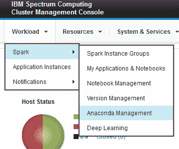

2.  单击 **Add** 添加新的 Anaconda，并填写详细信息。

    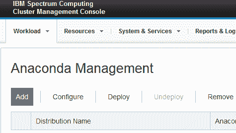 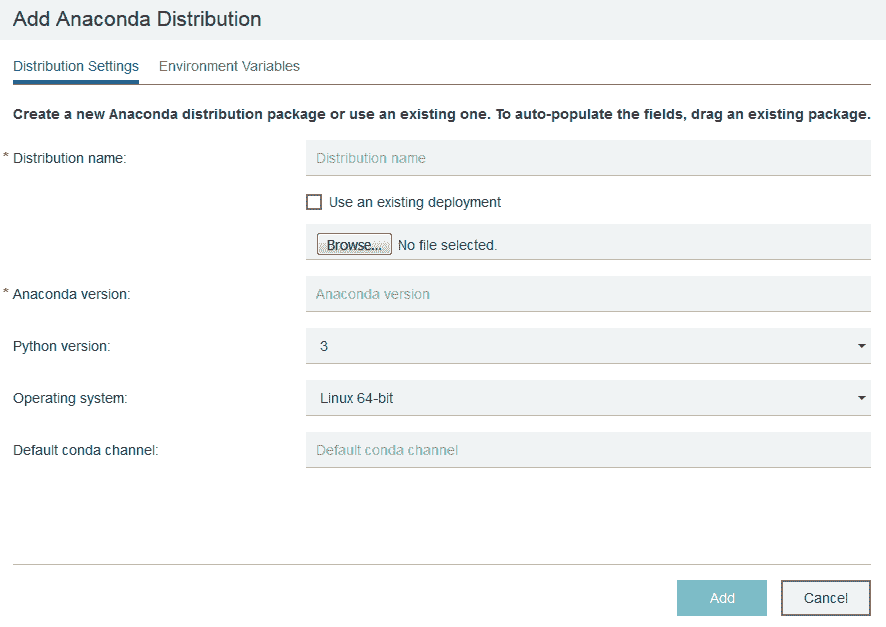

    a. Distribution name：Anaconda-2018

    b. 使用 “Browse” 查找并选择任务 1 中下载的 Anaconda 安装程序

    c. Anaconda version：2018.12

    d. Python version：3

    e. Operating system：Linux on Power 64-bit Little Endian (LE)

在步骤 b) 中选择 Anaconda 安装程序后，会自动填充 c)、d) 和 e) 中的字段。

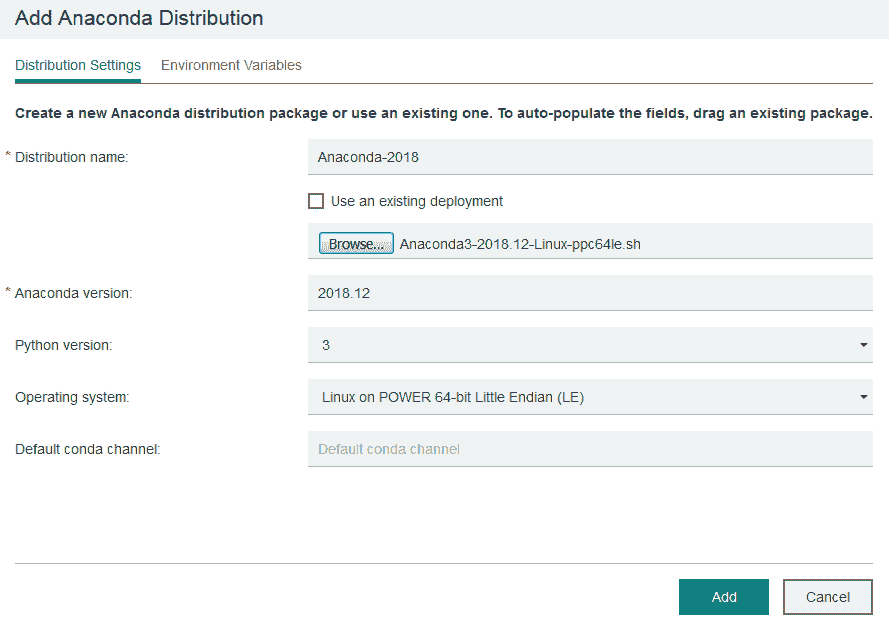

1.  单击 **Add** 以开始上传 Anaconda。根据网络速度，上传并解压缩分发包可能需要几分钟时间。

### 3\. 部署新配置的 Anaconda 分发版

1.  在所有计算节点上，在本地磁盘空间中为 Anaconda 部署创建目录。在此示例中，本地磁盘空间为 /localhome/egoadmin，SIG 中使用的执行用户为 egoadmin。您的本地磁盘空间和执行用户可能有所不同。

```
mkdir -p /localhome/egoadmin/anaconda
chown egoadmin:egoadmin /localhome/egoadmin/anaconda 
```

1.  选择任务 2 中创建的 Anaconda 分发版，并单击 **Deploy**。

    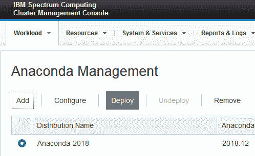

2.  填写所需信息。从 Deployment Settings 字段开始。

    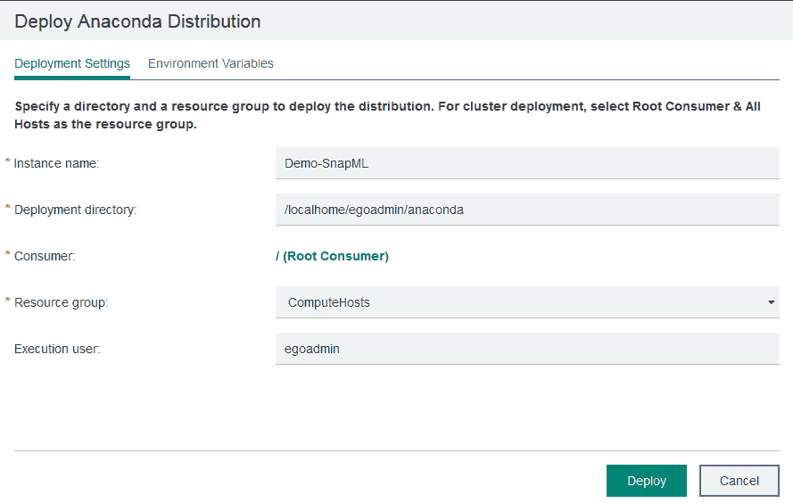

部署目录与任务 3.1 中创建的目录相匹配。此示例中的使用者为 Root Consumer。在您的示例中，使用者可能有所不同。

1.  单击 **Environment Variables** 选项卡并添加 PATH 和 IBM_POWERAI_LICENSE_ACCEPT)，然后单击 **Deploy**。这样就会部署 Anaconda 分发版。根据网络速度，部署可能需要几分钟。部署成功后，用户应看到如下内容：

    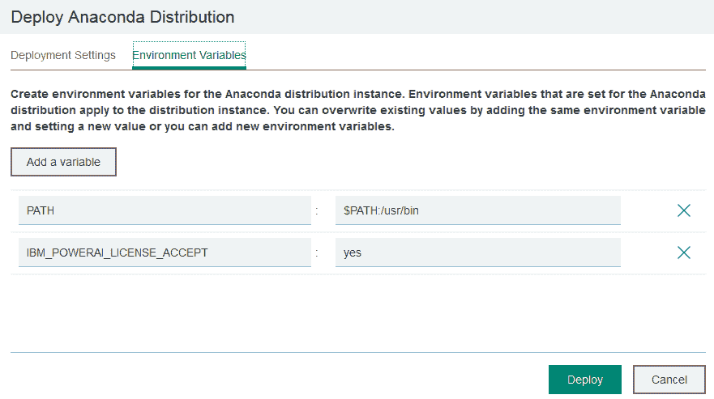

如果部署失败，应检查日志文件。确保您的部署目录位于计算节点的本地磁盘（而非共享磁盘）上（任务 3.1）。

### 4\. 使用新部署的 Anaconda 创建 Conda 环境

1.  在您的工作站上使用以下内容（注意表格）下载或创建 powerai16.yml 文件。这是用于创建 Anaconda 环境的 YAML 文件。如果您没有支持 YAML 的编辑器，可考虑通过将内容粘贴到 YAML 在线验证工具中，验证文件格式是否有效。

```
name: powerai16
channels:
  - https://public.dhe.ibm.com/ibmdl/export/pub/software/server/ibm-ai/conda/linux-ppc64le/
  - defaults
dependencies:
  - conda=4.5.12
  - jupyter
  - tornado=5.1.1
  - sparkmagic
  - numpy
  - numba
  - openblas
  - pandas
  - python=3.6.8
  - keras
  - matplotlib
  - scikit-learn
  - scipy
  - cuml
  - cudf
  - powerai=1.6.1
  - cudatoolkit-dev
  - pai4sk=1.4.0
  - pip:
    - sparkmagic 
```

如果要包含其他 Conda 和 pip 程序包，可将其添加到 YAML 文件的依赖项和 pip 列表中。

1.  选择任务 3 中创建的 Anaconda 分发版。单击 **Add** 以添加 Conda 环境。

    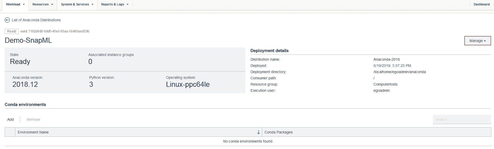 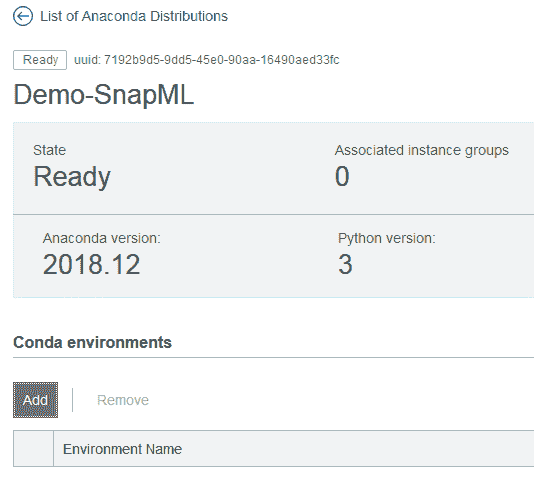

现在将会创建 Conda 环境。它使用超过 200 个程序包创建环境。如果添加失败，那么检查日志，验证 YAML 文件格式是否正确。解决问题后，重试添加操作。此操作可能需要几分钟时间才能完成。成功完成后，用户应会看到以下内容（例如，在计算主机上已安装 236 个 Conda 包）：

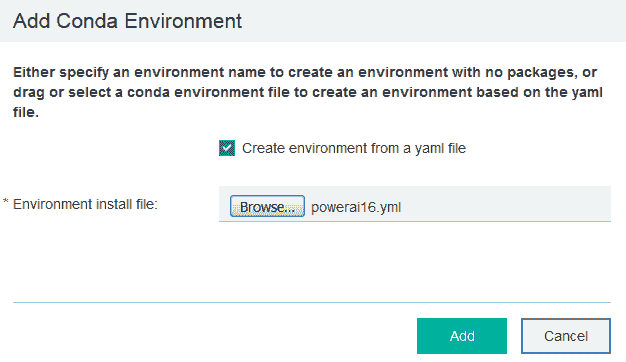

注：本教程中使用的 YAML 文件会创建含 236 个包的 Conda 环境。并非所有包都是运行 Snap ML 与 Scikit-learn 对比演示所必需的。但是，我们会尽可能包含更多程序包，以便用户也可以将此环境复用于其他 ML 任务。

### 5\. 创建 Notebook 环境

1.  我们使用 IBM Spectrum Conductor 提供的 Notebook。使用 Spectrum Conductor 管理控制台打开 Spark Notebook Management 面板。Workload -> Spark -> Notebook Management。

    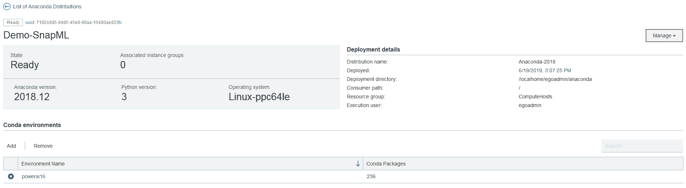

2.  注意一下名为 Jupyter V5.4.0 的 Notebook。如果您将其选中并单击 **Configure**，那么就可以查看此 Notebook 的设置：Notebook 包名称、所使用的脚本、使用的 SSL 和必需的 Anaconda。

    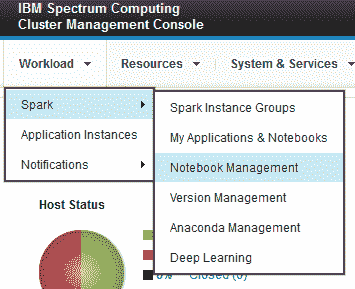

当前，由于存在名为 faiss 的 RAPIDS 包依赖项，我们需要为标准 Jupyter 5.4.0 Notebook 的 deploy.sh 脚本应用一个补丁。将此 Notebook 下载至工作站，通过单击 **Browse** 并选择已安装补丁的 Notebook 来替换 Conductor 随附的 Notebook，然后单击 **Update Notebook**。

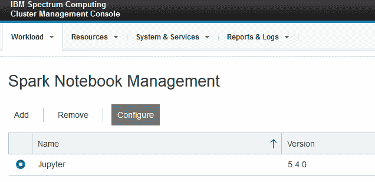

### 6\. 为 Notebook 创建 SIG

1.  在任一节点上，在共享文件系统中创建将存储执行用户数据的目录。在以下示例中，共享磁盘空间为 /home/egoadmin，SIG 的执行用户为 egoadmin。您的共享磁盘空间和执行用户可能有所不同。

    ```
    mkdir -p /home/egoadmin/notebook-snapml
    chown egoadmin:egoadmin /home/egoadmin/notebook-snapml 
    ```

2.  创建新的 SIG，并包含已添加的 Notebook：Workload > Spark > Spark Instance Groups。

    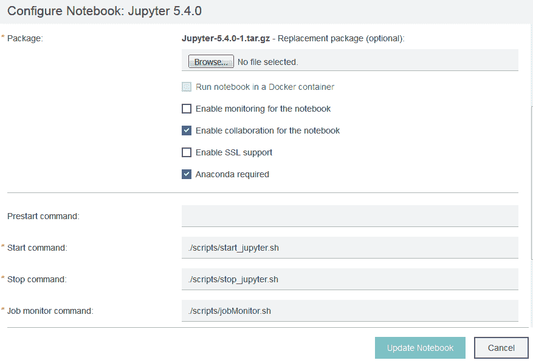

3.  单击 **New** 为任务 5 中新添加的 Notebook 创建新的 SIG。

    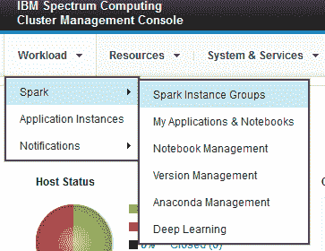

4.  使用以下值填写信息： a. Instance group name：Notebook-SnapML b. Deployment directory：/localhome/egoadmin/notebook-snapml（本地磁盘文件夹） c. Spark version：使用可用的最新版本。

    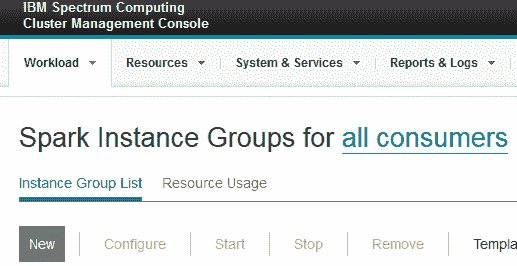

5.  选择 Jupyter 5.4.0 Notebook 并设置以下属性： a. base data directory：/home/egoadmin/notebook-snapml（在任务 6.1 中创建） b. 选择任务 3.5 中创建的 Anaconda 分发版实例 c. 选择任务 4 中创建的 Conda 环境

    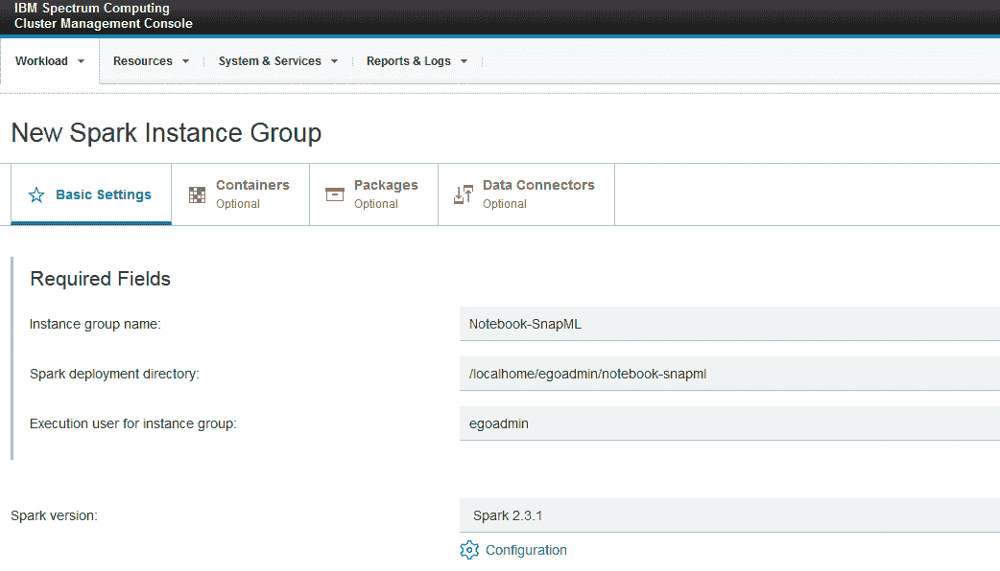

6.  向下滚动并单击 Consumers 部分的 Spark Instance Group。此过程会自动创建我们需要更改的使用者（在此示例中，即 /Notebook-SnapML）：

    

7.  向下滚动直至您找到建议的标准使用者名称（在此示例中，即 /Notebook-SnapML），并单击 **X** 以将其删除：

    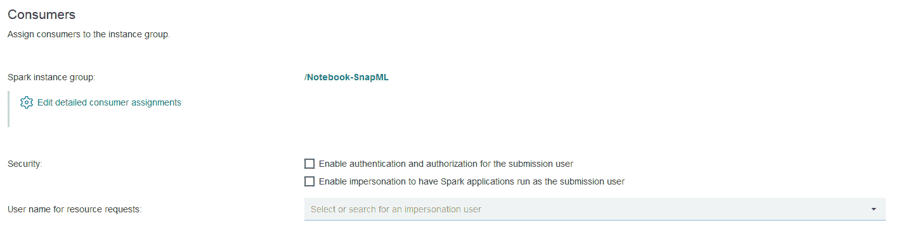

8.  在此示例中，我们将选择 Root Consumer，并创建新的 SIG Notebook-SnapML 作为子项。对于您而言，新 SIG 可能需要设置为不同使用者的子项。单击 **Create > Select**。

    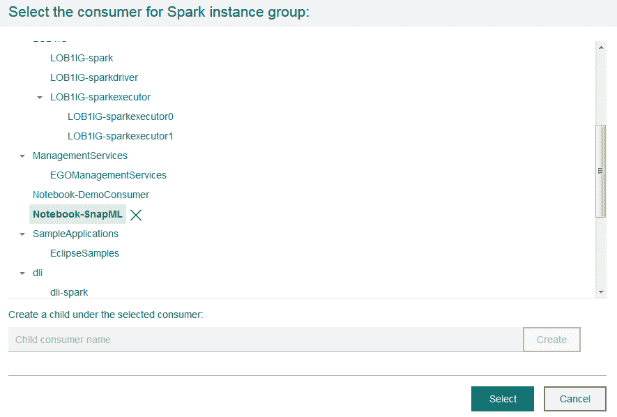

9.  向下滚动至 Resource Groups and Plans 部分，为 Spark Executors (GPU slots) 选择 GPUHosts 资源组。请勿更改其他字段。

    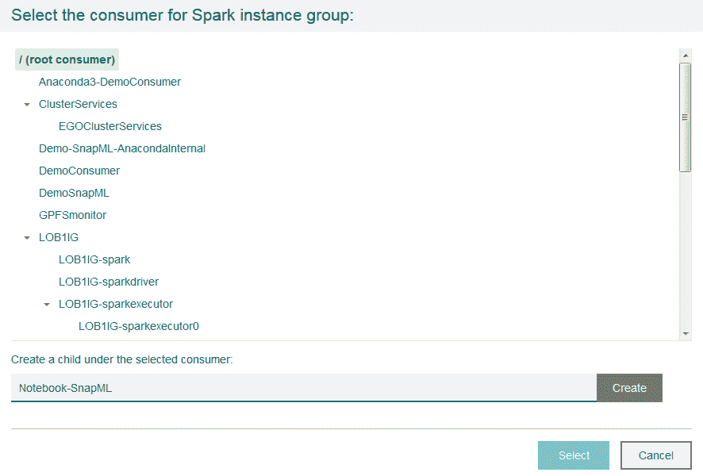

10.  单击页面底部的 **Create and Deploy Instance Group**。观察新创建的实例组 Notebook-SnapML 的部署过程。

    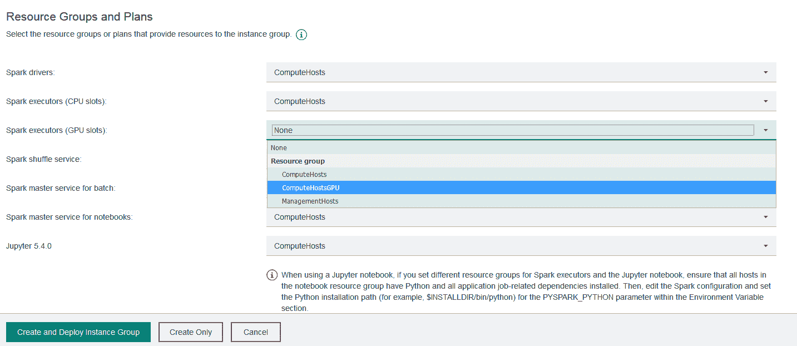

11.  部署完成后，单击 **Start** 来启动 SIG。

    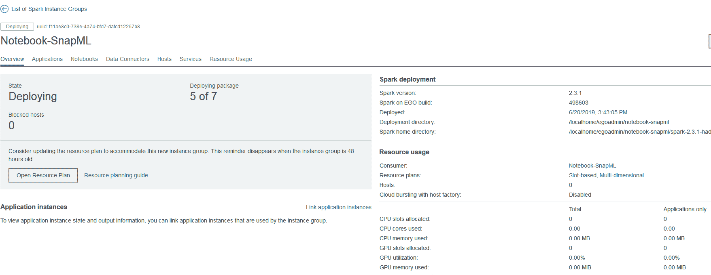 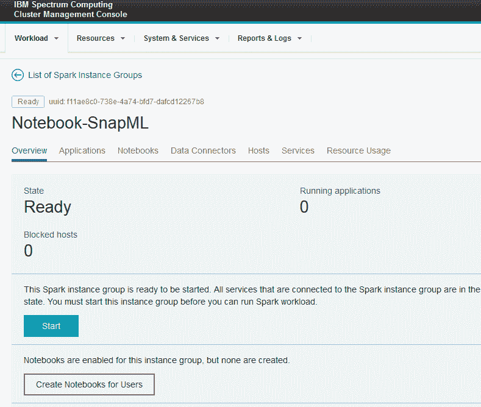 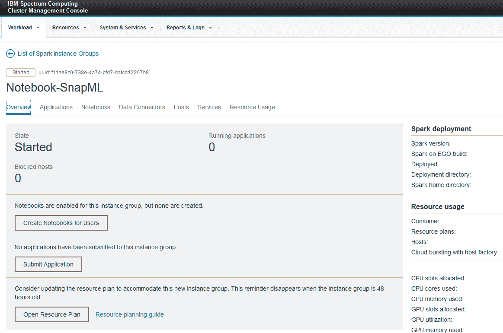

### 7\. 创建 Notebook 服务器并上传 Notebook，用于运行 Snap ML

1.  启动 SIG 后，转至 Notebook 选项卡，单击 **Create Notebooks for Users**。

    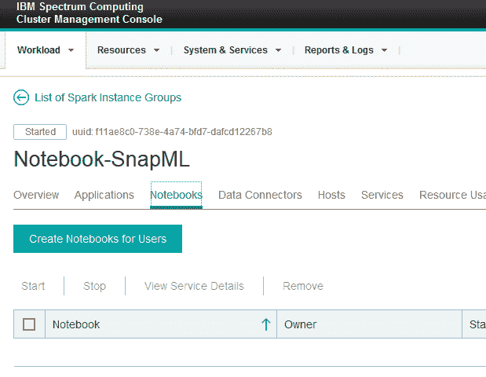

2.  选择相应的用户，然后单击 **Create**。

    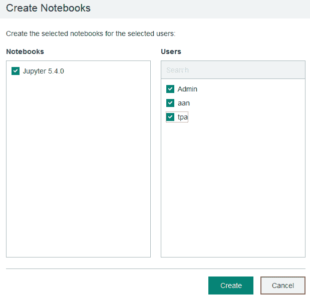

3.  创建 Notebook 后，刷新屏幕以查看 My Notebooks。单击它即可显示为此 SIG 创建的 Notebook 服务器列表。选择 Jupyter 5.4.0 Notebook 以显示 Notebook 服务器 URL。

    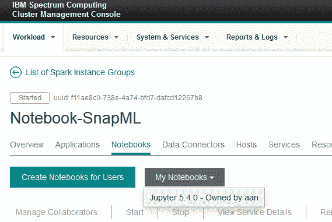

使用您的凭证登录 Notebook 服务器。

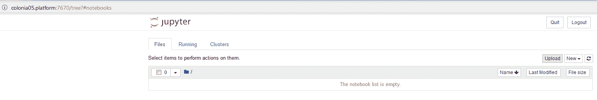

下载 tutorial-snap-ml-credit-risk-rf-notebook，单击 **Upload** 将其上传到 Notebook 服务器。指定要上传的 Notebook 后，必须再次单击 **Upload**。

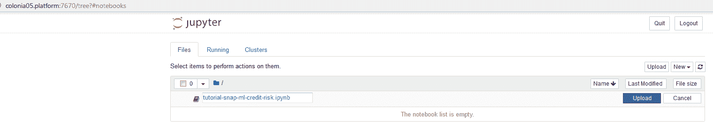

## 第 2 部分：为信用违约风险预测运行随机森林模型（Snap ML 对比 scikit-learn）

任务 7 中上传的 Notebook 会下载信用风险数据集，对其进行预处理（例如，处理分类特征），将其拆分为两个数据集（训练数据集和检验数据集），在 CPU 上使用 Snap ML 训练随机森林模型，并在检验数据集上评估经过训练的模型性能。在 Notebook 中，我们还使用 scikit-learn 训练了一个随机森林模型，以比较 Snap ML 与热门的开源 ML 库 scikit-learn 的训练时间和预测准确率。

Snap ML 在训练数据集上训练的随机森林模型使用了 700 万个示例和 51 个特征，耗时约 120 秒，使用了 40 个 CPU 线程，而 scikit-learn 需要近 230 秒完成模型训练，准确率与 Snap ML 相近。正如结果所示，在训练用于预测信用违约风险的随机森林模型方面，Snap ML 的速度快了近 2 倍。

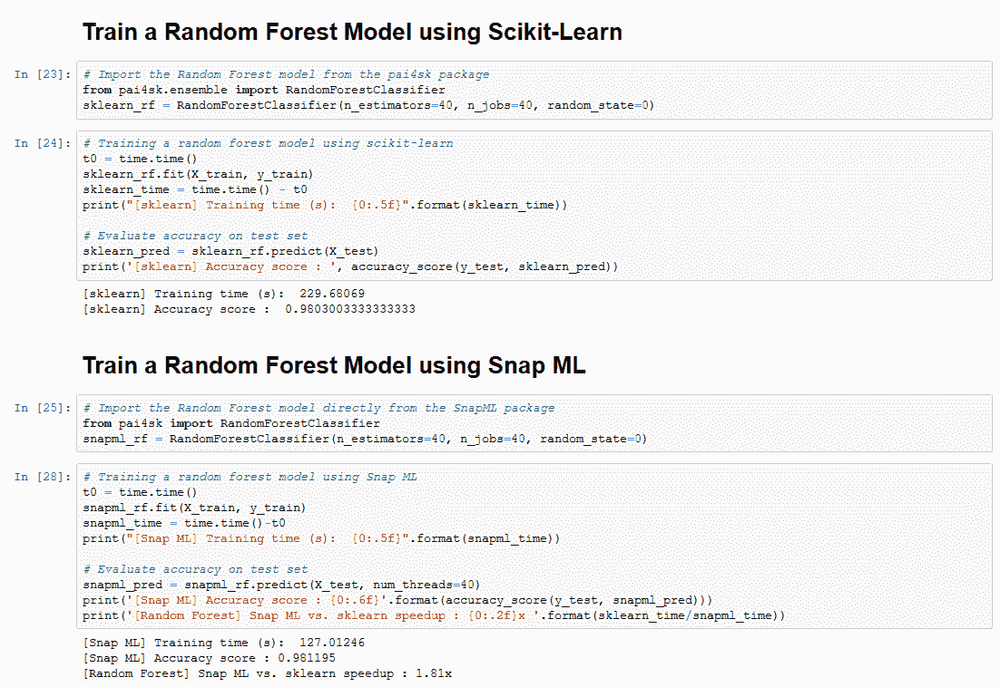

## 结束语

Snap ML 库可加速 ML 模型训练。 在本教程中，我们训练了一个随机森林分类器来预测信用违约风险。这是一个与金融公司密切相关的应用程序。Snap ML 通过将执行时间从约 230 秒（使用 scikit-learn）缩短到约 120 秒，将此 ML 训练工作负载加速近两倍。

本文翻译自：[Accelerate tree-based model training with Watson Machine Learning Accelerator and Snap ML](https://developer.ibm.com/tutorials/accelerate-random-forest-model-training-with-watson-ml-accelerator/)(2019-07-18)。