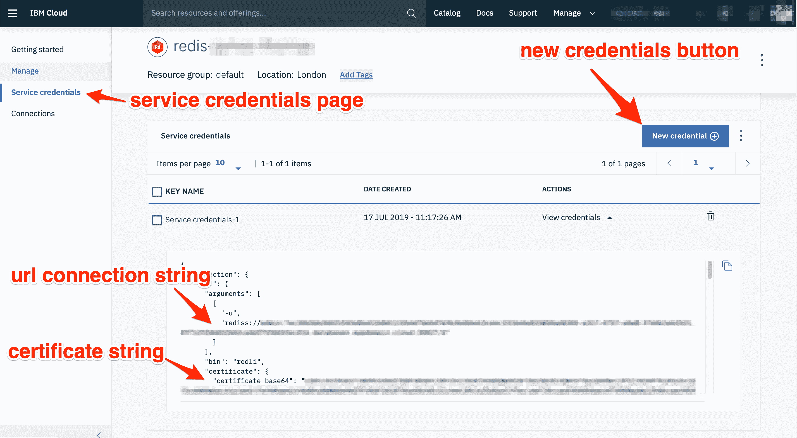

# 使用云端无服务器功能来处理区块链事件

> 原文：[`developer.ibm.com/zh/tutorials/process-blockchain-events-using-serverless-cloud-functions/`](https://developer.ibm.com/zh/tutorials/process-blockchain-events-using-serverless-cloud-functions/)

本教程展示了如何使用 IBM Cloud 上的无服务器功能来处理区块链事件。通过 [IBM Cloud Functions](https://www.ibm.com/cloud/functions) ([Apache OpenWhisk](https://openwhisk.apache.org/)) 上运行的 Node.js 功能来检索由 [IBM Blockchain Platform](https://www.ibm.com/cloud/blockchain-platform) ([Hyperledger Fabric](https://www.hyperledger.org/projects/fabric)) 生成的事件。该功能将连接到 [cron 事件计时器](https://cloud.ibm.com/docs/openwhisk?topic=cloud-functions-pkg_alarms)，该计时器会定期自动调用该功能来处理全新的区块链事件。

区块链事件处理是无服务器云平台的完美用例。此用例并不是让有状态的应用程序闲置等待事件发生，而是仅在事件可供处理时才执行无服务器功能。相比于传统基础架构，这可以提高利用率，减轻操作负担，并最终降低应用程序成本。

## 学习目标

在本教程中，您将学习如何：

*   设置无服务器功能以处理区块链事件
*   为 IBM Cloud Blockchain Platform 和 IBM Cloud Databases for Redis 配置服务凭证
*   将无服务器功能连接到警报事件源

## 前提条件

**免费试用 IBM Cloud**

利用 [IBM Cloud Lite](https://cocl.us/IBM_CLOUD_GCG) 快速轻松地构建您的下一个应用程序。您的免费帐户从不过期，而且您会获得 256 MB 的 Cloud Foundry 运行时内存和包含 Kubernetes 集群的 2 GB 存储空间。[了解所有细节](https://www.ibm.com/cloud/blog/announcements/introducing-ibm-cloud-lite-account-2)并确定如何开始。

在开始之前，您需要满足以下前提条件：

*   [一个 IBM Cloud 帐户](https://cocl.us/IBM_CLOUD_GCG)
*   已安装 [IBM Cloud CLI](https://cloud.ibm.com/docs/cli/reference/bluemix_cli?topic=cloud-cli-install-ibmcloud-cli)
*   已安装 [IBM Cloud Functions CLI 插件](https://cloud.ibm.com/openwhisk/learn/cli?cm_sp=ibmdev-_-developer-tutorials-_-cloudreg)
*   一个 [IBM Blockchain Platform](https://cloud.ibm.com/catalog/services/blockchain-platform?cm_sp=ibmdev-_-developer-tutorials-_-cloudreg) 实例，其中包含已安装且已实例化的智能合约
*   已配置 [IBM Cloud Redis](https://cloud.ibm.com/catalog/services/databases-for-redis?cm_sp=ibmdev-_-developer-tutorials-_-cloudreg) 实例
*   已安装 [Git CLI 客户端](https://git-scm.com/downloads)
*   已安装 [Docker](https://www.docker.com/get-started)

## 预估时间

完成本教程大约需要 15 分钟。

## 步骤

您将完成以下步骤：

1.  在演示存储库中检索示例无服务器项目
2.  为 IBM Blockchain Platform 和 Redis 实例创建服务凭证
3.  为 IBM Cloud Functions 创建部署包
4.  创建 IBM Cloud Functions 操作以处理区块链事件
5.  手动测试区块链事件处理操作
6.  将操作连接到警报触发器事件提要

1

### 在演示存储库中检索示例无服务器项目

使用 Git CLI（或 GitHub Web UI）下载示例无服务器项目的源文件：

`git clone https://github.com/IBM/blockchain-events-cloud-functions`

进入项目文件夹：

`cd openwhisk-eventhub`

此演示项目包含一个 TypeScript 源文件 (`src/index.ts`)，用于处理来自 IBM Blockchain Platform 实例的新区块链事件。与平台交互所需的服务凭证作为 JSON 文件存储在 `credentials` 文件夹中。在 `scripts/deploy.sh` 中还有一个自动部署脚本，此脚本可用于部署该项目。

2

### 为 IBM Blockchain Platform 和 Redis 实例创建服务凭证

无服务器功能需要适用于 IBM Blockchain Platform 和 Redis 的认证凭证。Blockchain Platform 实例用于通过客户端库来检索区块链事件。Redis 用于在无服务器功能调用之间存储已处理的区块标识。遵循有关如何从这些服务实例检索凭证的步骤指示信息进行操作。

#### 为 IBM Blockchain Platform 创建服务凭证

1.  从 [IBM Cloud 资源列表](https://cloud.ibm.com/resources?cm_sp=ibmdev-_-developer-tutorials-_-cloudreg)浏览至要使用的区块链实例。
2.  获取 `ConnectionProfile.json`。应根据[已实例化的智能合约](https://cloud.ibm.com/docs/services/blockchain/howto?)从 IBM Blockchain Platform 2.0 UI 内的 **Smart contracts** 选项卡中下载此文件。
3.  获取 `OrgUser.json`。可根据给定的[注册身份](https://cloud.ibm.com/docs/services/blockchain/howto?topic=blockchain-ibp-console-identities)从 IBM Blockchain Platform 2.0 UI 中生成/下载此文件。

#### 为 IBM Cloud Redis 实例创建服务凭证

1.  从 [IBM Cloud 资源列表](https://cloud.ibm.com/resources?cm_sp=ibmdev-_-developer-tutorials-_-cloudreg)浏览至要使用的 Redis 实例。
2.  从实例仪表板中打开“Service Credentials”页面。
3.  单击 **New credential** 按钮。
4.  单击模态对话框上的 **Add** 按钮以创建新凭证。
5.  单击服务凭证表中的 **View Credentials** 下拉图标以显示凭证详细信息。

##### 图 1\. 创建服务凭证



表中显示的 JSON 对象包含无服务器功能所需的所有连接详细信息。您需要提取连接 URL 字符串和要存储在 `credentials` 文件夹中的 TLS 证书。

1.  从服务凭证 JSON 对象中的 `connection.rediss.composed` 值复制 Redis 连接字符串（以 `rediss://` 前缀开头）。
2.  将此字符串作为 `url` 值保存在 `credentials/redis.json` 文件中。
3.  从服务凭证 JSON 对象中的 `connection.rediss.certificate.certificate_base64` 值复制 Redis 连接证书字符串（以 `rediss://` 前缀开头）。
4.  将此字符串作为 `cert` 值保存在 `credentials/redis.json` 文件中。

3

### 为 IBM Cloud Functions 创建部署包

IBM Cloud Functions 操作使用外部库来与 Blockchain Platform 进行交互。需要为运行时平台编译其他库，并将这些库包含在部署包归档中。用于此操作的 TypeScript 源文件也需要在部署之前编译为 JavaScript 文件。

1.  安装开发依赖项并运行构建脚本，以便通过 TypeScript 源文件生成 JavaScript：

    `npm install && npm run build`

2.  移除开发依赖项：

    `rm node_modules`

3.  使用 IBM Cloud Function 运行时 Docker 镜像安装生产依赖项：

    `docker run -it -v $PWD:/nodejsAction openwhisk/action-nodejs-v10 npm install --production`

    **注意：**需要安装 Docker 运行时镜像中的 NPM 库的原因是 `fabric-network` NPM 库具有本机依赖项。需要为正确的平台架构（而不是开发环境）编译这些外部依赖项。本机依赖项是在 `npm install` 过程中构建的。

4.  通过操作源和外部依赖项来创建操作部署包：

    `zip -r action.zip dist/ node_modules/ package.json`

5.  通过包含凭证参数的部署包来创建 IBM Cloud Functions 操作：

    ```
    ibmcloud wsk action update blockchain -p credentials "$(< ./credentials/OrgUser.json)" \
     -p connectionProfile "$(< ./credentials/ConnectionProfile.json)" \
     -p redis "$(< ./credentials/redis.json)" --kind nodejs:10 action.zip 
    ```

**注意：**可使用部署脚本 (`scripts/deploy.sh`) 以通过 NPM 命令 `npm deploy` 来自动执行这些步骤。

4

### 创建 IBM Cloud Functions 操作以处理区块链事件

通过包含凭证参数的部署包来创建 IBM Cloud Functions 操作：

```
ibmcloud wsk action update blockchain -p credentials "$(< ./credentials/OrgUser.json)" \
  -p connectionProfile "$(< ./credentials/ConnectionProfile.json)" \
  -p redis "$(< ./credentials/redis.json)" --kind nodejs:10 action.zip 
```

列出 IBM Cloud Functions 操作以验证是否正确部署了该操作：

`ibmcloud wsk action list`

这应返回以下列表，其中显示了 `blockchain` 操作：

```
actions
/<USER_NAMESPACE>/blockchain                       private nodejs:10 
```

5

### 手动测试区块链事件处理操作

调用此操作以处理所有先前事件。此操作具有两个（可选）参数：`startBlock` 和 `endBlock`。如果未指定其中任一参数，那么默认设置为 `0` 和区块链上当前编号最高的区块。

`ibmcloud wsk action invoke blockchain -r`

```
{
    "blockEventsProcessed": [1, 2, 3...],
    "startBlock": 1
    "endBlock": 100,
} 
```

随后，在操作响应中会返回已处理事件的区块编号。已处理的最高区块编号会存储在 Redis 中（使用 `connectionProfile.name` 属性作为键）。这样，在执行下一次操作调用时，该值将用作 `startBlock` 值，以确保事件仅处理一次。

再次调用此操作应该不会返回任何新处理的事件：

`ibmcloud wsk action invoke blockchain -r`

6

### 将操作连接到警报触发器事件提要

使用警报提要来创建要每分钟调用一次的新触发器：

`ibmcloud wsk trigger create once-a-min --feed /whisk.system/alarms/interval -p minutes 1`

创建新的规则以将操作绑定到触发器：

`ibmcloud wsk rule create process-blockchain-events once-a-min blockchain`

监视 IBM Cloud Functions 的激活日志，以查看要调用的操作：

`ibmcloud wsk activation poll`

此操作将继续无限触发，直至移除此规则和/或触发器为止。它会处理所有新的区块链事件，而无需执行其他手动步骤。您可通过查看操作日志或者查看 Redis 键（用于存储最后处理的区块编号）来检查处理状态。

## 结束语

本教程展示了如何使用 IBM Cloud 上的无服务器功能来处理区块链事件。

您已创建一个 Node.js 无服务器功能，当调用该功能时，它会处理区块链上的所有新事件。该功能已与所有必需的外部库和依赖项一起部署到 IBM Cloud Functions 上。该功能使用 Redis 在调用之间持久存储已处理的区块编号。

随后，该功能连接到警报触发器提要。触发器提要已配置为每分钟自动调用该功能一次。这样，该功能可处理所有新事件，而无需执行其他手动步骤，也不需要让空闲基础架构等待事件发生。

想要进一步了解云端区块链和无服务器的更多信息？欢迎访问 IBM Developer 上的[区块链](https://developer.ibm.com/zh/technologies/blockchain/)和[无服务器](https://developer.ibm.com/zh/technologies/serverless/)技术中心。

本文翻译自：[Process blockchain events using serverless functions on the cloud](https://developer.ibm.com/tutorials/process-blockchain-events-using-serverless-cloud-functions/)（2019-08-19）