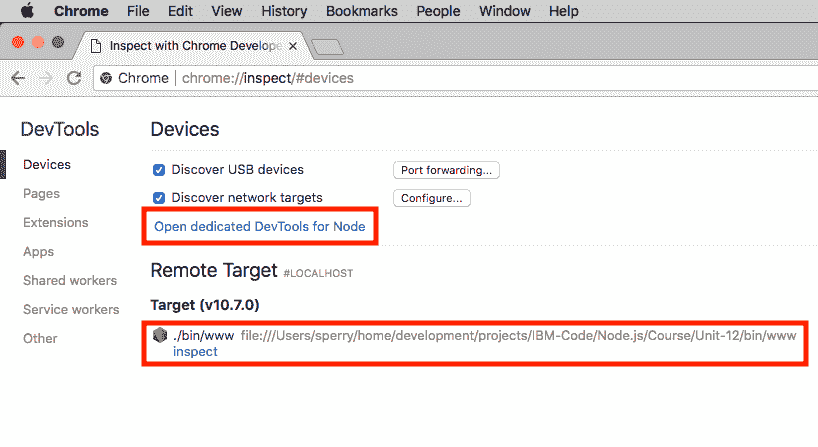
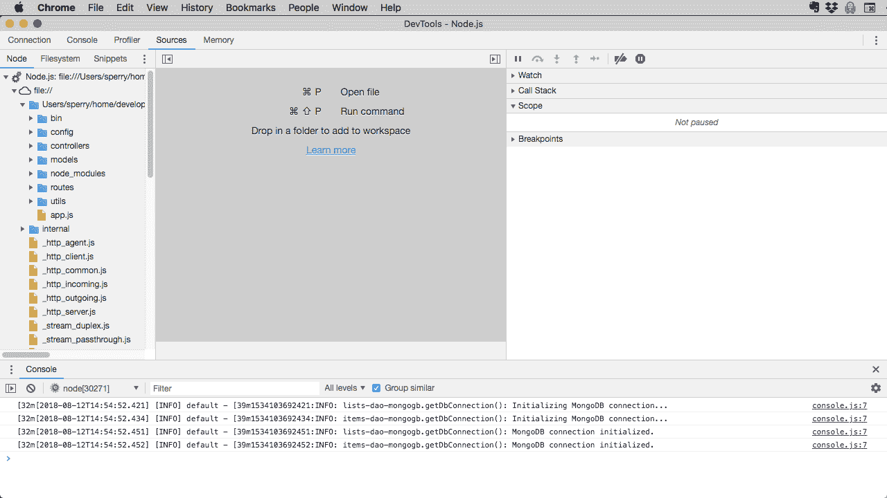

# 调试 Node.js 应用程序并进行概要分析

> 原文：[`developer.ibm.com/zh/tutorials/learn-nodejs-debugging-and-profiling-node-applications/`](https://developer.ibm.com/zh/tutorials/learn-nodejs-debugging-and-profiling-node-applications/)

Node.js 代码中的错误很难发现和修复。通常，您可以通过简单研究代码来发现并修复错误。这样做可以快速提升代码质量。您还可以使用 log 语句进行*事后调查*，运行一些代码，并研究控制台输出（或日志文件），以查看它的实际执行方式。但是对于一些类型的错误（最糟糕的错误），您就需要从源代码中查找问题。

在本单元中，我将向您介绍*源代码级调试*，您可以在运行的程序中暂停执行，查明代码究竟发生了什么。

代码中的错误全部消除后，您会希望对其进行优化以提升性能和可扩展性。作为一名专业的 Node 开发者，一定要知道如何使用概要分析器来优化代码，这一点很重要。

本单元将向您介绍四个用于调试 Node 应用程序并进行概要分析的工具：

*   [Node 调试客户端](https://nodejs.org/dist/latest-v10.x/docs/api/debugger.html)
*   [Chrome DevTools](https://developers.google.com/web/tools/chrome-devtools/)
*   [VSCode 调试器](https://code.visualstudio.com/docs/editor/debugging)
*   [clinic](https://clinicjs.org)

##### Node.js 学习路径

本教程已纳入 Node.js 学习路径。各单元之间相辅相成，查看 Node.js 学习路径概述，以便从头开始学习。

## 源代码级调试

作为练习，我们将对“购物清单”应用程序的 `rest-controller` 模块中的 `create()` 方法进行调试。我们将对每个工具使用相同的调试流程：

1.  启动调试器。
2.  设置*断点*，它会告诉程序在哪里冻结执行。
3.  使用内部命令导航代码。
4.  检查冻结程序中的变量值。
5.  创建*监视表达式* 来监视断点上的变量。
6.  更改所选变量的值，以改进程序的运行方式。

须注意，我们将在此练习中对[第 12 单元](https://www.ibm.com/developerworks/cn/opensource/os-tutorials-learn-nodejs-mongodb/index.html)的“购物清单”应用程序进行调试。

## 获取代码

您在此学习路径中跟随其中示例一起进行操作所需的代码可在我的 GitHub 存储库中找到。

[获取代码](https://github.com/jstevenperry/IBM-Developer/tree/master/Node.js/Course)

## 调试器 #1：Node 调试客户端

[Node 调试客户端](https://nodejs.org/dist/latest-v10.x/docs/api/debugger.html)是 Node.js 附带的基于文本的调试器，因此无需额外安装。这个工具还超级好用。

### 运行 Node 调试客户端

运行 Node 调试客户端的命令为：`node inspect node_module`。

要开始调试“购物清单”应用程序，可打开终端窗口并导航至 `Unit-12` 目录，确保 `mongod` 正在运行（在单独的终端窗口中运行 `npm run start-mongod`），然后运行 `node inspect ./www/bin`。

输出类似如下：

```
Ix:~/src/projects/IBM-Developer/Node.js/Course/Unit-12 sperry$ node inspect ./bin/www
< Debugger listening on ws://127.0.0.1:9229/90e7bfa4-c775-45ab-acd9-d60773f0c319
< For help, see: https://nodejs.org/en/docs/inspector
< Debugger attached.
Break on start in bin/www:1
> 1 (function (exports, require, module, __filename, __dirname) {
  2 /*
  3    Copyright 2018 Makoto Consulting Group, Inc.
debug> 
```

在上面的输出中，调试客户端在程序的第一行代码处停止，并发出 `debug>` 提示符。

输入 `c`（或 `cont` 表示继续）让程序完成初始化。完整输出类似如下：

```
Ix:~/src/projects/IBM-Developer/Node.js/Course/Unit-12 sperry$ node inspect ./bin/www
< Debugger listening on ws://127.0.0.1:9229/90e7bfa4-c775-45ab-acd9-d60773f0c319
< For help, see: https://nodejs.org/en/docs/inspector
< Debugger attached.
Break on start in bin/www:1
> 1 (function (exports, require, module, __filename, __dirname) {
  2 /*
  3    Copyright 2018 Makoto Consulting Group, Inc.
debug> c
< [2018-08-11T10:38:06.077] [INFO] default - 1534001886077:INFO: lists-dao-mongogb.getDbConnection(): Initializing MongoDB connection...
< [2018-08-11T10:38:06.091] [INFO] default - 1534001886091:INFO: items-dao-mongogb.getDbConnection(): Initializing MongoDB connection...
< (node:20580) DeprecationWarning: current URL string parser is deprecated, and will be removed in a future version.To use the new parser, pass option { useNewUrlParser: true } to MongoClient.connect.
< [2018-08-11T10:38:06.110] [INFO] default - 1534001886110:INFO: lists-dao-mongogb.getDbConnection(): MongoDB connection initialized.
< [2018-08-11T10:38:06.111] [INFO] default - 1534001886111:INFO: items-dao-mongogb.getDbConnection(): MongoDB connection initialized.
debug> 
```

### 为 Node 调试客户端设置断点

接下来，我们将设置一个断点，这样我们就可以看到 `rest-controller` 模块中的 `create()` 方法发生了什么。

可通过两种方式设置断点。第一种是我推荐使用的方法，即通过 `debug>` 提示符使用 `setBreakpoint` 函数：`setBreakpoint(module_file_name, line_number)`。下面显示了如何在示例应用程序的 `rest-controller` 模块中的第 57 行上设置断点：

```
debug> setBreakpoint('rest-controller.js', 57);
 52  * @param {Object} next - the next middleware function in the req/res cycle
 53  */
 54 function create(req, res, next) {
 55     let requestBody = req.body;
 56
>57     listsDao.create(requestBody.description).then((result) => {
 58         utils.writeServerJsonResponse(res, result.data, result.statusCode);
 59     }).catch((err) => {
 60         next(err);
 61     });
 62 }
debug> 
```

须注意，调试客户端在断点两侧展示了 5 行代码供参考。

当执行到 `rest-controller.js` 中的第 57 行时，程序将冻结。

另一种设置断点的方法（我不建议这样做）是在您想让调试器冻结之前在代码行上使用 `debugger;` 语句：

```
function create(req, res, next) {
    let requestBody = req.body;
    debugger;
    listsDao.create(requestBody.description).then((result) => {
        utils.writeServerJsonResponse(res, result.data, result.statusCode);
    }).catch((err) => {
        next(err);
    });
} 
```

如果使用 `debugger` 语句，就需要在设置断点之后重新启动 Node，这就是我不建议使用这一方法的原因。通过使用 `setBreakpoint` 函数，您可以在运行的程序中设置断点，而无需重新启动。我推荐使用 `setBreakpoint` 函数（或 `sb`）来设置断点。

#### 调试启动代码

使用 `debug>` 提示符，您可以在任何时候在程序中设置断点，包括当 Node 调试客户端首次启动并在第一行代码上停止时：

```
Ix:~/src/projects/IBM-Developer/Node.js/Course/Unit-12 sperry$ node inspect ./bin/www
< Debugger listening on ws://127.0.0.1:9229/90e7bfa4-c775-45ab-acd9-d60773f0c319
< For help, see: https://nodejs.org/en/docs/inspector
< Debugger attached.
Break on start in bin/www:1
> 1 (function (exports, require, module, __filename, __dirname) {
  2 /*
  3    Copyright 2018 Makoto Consulting Group, Inc.
debug> sb('rest-controller.js', 57)
Warning: script 'rest-controller.js' was not loaded yet.
debug> 
```

因为程序已在第一行代码上冻结，所以尚未加载 `rest-controller` 模块。这就是为什么会看到警告信息的原因：`Warning: script 'rest-controller.js' was not loaded yet.`

不过，不要担心：调试器只是告诉您可能永远不会使用断点。（它不能确定，因为还没有加载 `rest-controller` 模块。）

在此处设置断点可以调试*启动代码*，该代码在程序加载模块和执行其他初始化时运行。这对调试数据库连接问题很有用。此外，还可以让程序加载，并在程序达到稳定状态后在 `debug>` 提示符处设置断点。

#### 查看和删除断点

当您需要查看所设置断点的列表时，只需在 `debug>` 提示符处输入`breakpoints` 即可：

```
debug> breakpoints
#0 controllers/rest-controller.js:57 
```

要删除断点，可使用 `clearBreakpoint()` 函数（或简写为 `cb`）：

`debug> cb('rest-controller.js', 57)`

### 导航代码

您已经看到了命令 `c`，它告诉调试器继续（或恢复）执行。 表 1 总结了用于在调试器中执行应用程序代码的其他命令。

| 命令 | 简写 | 描述 |
| --- | --- | --- |
| `cont` | `c` | 继续：恢复程序执行。 |
| `next` | `n` | 下一个（有时称为*单步执行*）：执行当前代码行，并在下一行处停止。 |
| `step` | `s` | 单步进入：单步*进入*当前代码行。如果是函数调用，调试器将在函数的第一行处停止。如果不是，它的行为类似于 `next`。 |
| `out` | `o` | 单步退出：单步退出当前函数，转至调用堆栈中的前一行代码。当前函数中的其余代码照常执行。 |
| `pause` | 无 | 暂停：在出现第一次机会时暂停程序执行。 |

如果您以前使用过源代码级调试器，那么应该很熟悉这些命令：

*   使用 `step` 单步*进入*函数调用。
*   使用 `out` 单步*退出*函数调用。
*   使用 `next` 执行当前代码行（如果是函数调用，则单步*执行*），并在当前函数中的下一行代码处停止。

`pause` 命令可让 Node 在能够处理命令后立即暂停：

```
Ix:~/src/projects/IBM-Developer/Node.js/Course/Unit-12 sperry$ node inspect ./bin/www
< Debugger listening on ws://127.0.0.1:9229/b74206cd-7d21-49ae-9e8b-f9b13eeec42d
< For help, see: https://nodejs.org/en/docs/inspector
< Debugger attached.
Break on start in bin/www:1
> 1 (function (exports, require, module, __filename, __dirname) {
  2 /*
  3    Copyright 2018 Makoto Consulting Group, Inc.
debug> setBreakpoint('rest-controller.js', 57)
Warning: script 'rest-controller.js' was not loaded yet.
debug> c
< [2018-08-11T10:55:16.055] [INFO] default - 1534002916055:INFO: lists-dao-mongogb.getDbConnection(): Initializing MongoDB connection...
< [2018-08-11T10:55:16.069] [INFO] default - 1534002916069:INFO: items-dao-mongogb.getDbConnection(): Initializing MongoDB connection...
< (node:20689) DeprecationWarning: current URL string parser is deprecated, and will be removed in a future version.To use the new parser, pass option { useNewUrlParser: true } to MongoClient.connect.
< [2018-08-11T10:55:16.087] [INFO] default - 1534002916087:INFO: lists-dao-mongogb.getDbConnection(): MongoDB connection initialized.
< [2018-08-11T10:55:16.088] [INFO] default - 1534002916088:INFO: items-dao-mongogb.getDbConnection(): MongoDB connection initialized.
**debug> pause**
break in timers.js:209
 207 }
 208
>209 function processTimers(now) {
 210   if (this.owner)
 211     return unrefdHandle(this.owner, now);
debug> 
```

#### 获取更多上下文 (`lists(n)`)

默认情况下，调试客户端会围绕断点提供两行上下文（共五行）。如果您需要更多上下文，可以使用 `lists(n)` 命令要求调试客户端提供 `n` 行上下文（共 `2n+1` 行）。例如，在 `debug>` 提示符处输入 `list(5)` 要求调试客户端给出 5 行上下文：

```
debug> list(5)
 52  * @param {Object} next - the next middleware function in the req/res cycle
 53  */
 54 function create(req, res, next) {
 55     let requestBody = req.body;
 56
>57     listsDao.create(requestBody.description).then((result) => {
 58         utils.writeServerJsonResponse(res, result.data, result.statusCode);
 59     }).catch((err) => {
 60         next(err);
 61     });
 62 } 
```

### 检查 Node 调试客户端中的变量值

当 Node 调试客户端在断点处停止时，您可以检查代码中的变量值。为此，您需要输入[第 3 单元](https://www.ibm.com/developerworks/cn/opensource/os-learn-nodejs-tour-node/index.html)中介绍的 Read-Eval-Print-Loop (REPL)，然后让 REPL 计算您想要查看的变量的值。

首先，确保应用程序已经启动，并在 `rest-controller.js` 中的第 57 行上设置断点。现在，打开浏览器并转至“购物清单”应用程序 UI [`localhost:3000`](http://localhost:3000)。单击 **New Shopping List** 链接，输入 `Test Shopping List` 的描述，然后单击 **Create** 按钮。

执行将在 `rest-controller.js` 中的第 57 行处中断，您已经在此处设置了断点。

要查看 `requestBody` 变量的值，可输入 REPL 并键入 `requestBody`，然后按**回车键**：

```
break in controllers/rest-controller.js:57
 52  * @param {Object} next - the next middleware function in the req/res cycle
 53  */
 54 function create(req, res, next) {
 55     let requestBody = req.body;
 56
>57     listsDao.create(requestBody.description).then((result) => {
 58         utils.writeServerJsonResponse(res, result.data, result.statusCode);
 59     }).catch((err) => {
 60         next(err);
 61     });
 62 }
debug> repl
Press Ctrl + C to leave debug repl
> requestBody
{ description: ‘Test Description' }
> 
```

您可以使用 REPL 来计算[此范围内的](https://en.wikipedia.org/wiki/Scope_(computer_science))任何变量的值。

要退出 REPL，可按 **Ctrl+`c`** 组合键。

输入 `c` 指示正在运行的程序继续运行，并创建新的购物清单。

### 为 Node 调试客户端创建监视表达式

正如您所看到的，检查变量值需要几个步骤：

1.  输入 REPL。
2.  计算变量的值。
3.  退出 REPL。
4.  继续运行程序。
5.  在每次程序中断时重复以上步骤。

如果您知道自己将在同一行代码处反复中断，那么就没有必要每次都重复这些步骤。相反，您可以设置*监视表达式*。

例如，假设您希望当调试器在 `rest-controller.js` 的第 57 行中断时查看 `requestBody`、`req.body`、`req.params` 和 `req.path` HTTP 请求属性。在此示例中，您会在 `debug>` 提示符处逐个输入这些属性。

继续并退出调试器，然后使用 `node inspect ./bin/www` 命令重新启动。当调试器在第一行处停止时，输入：

```
debug> watch('requestBody')
debug> watch('req.body')
debug> watch('req.params')
debug> watch('req.path') 
```

现在转至应用程序的主屏幕并单击 **New Shopping List** 链接。创建一个名为 `Sponge Bob`（或者其他您喜欢的名字）的购物清单，然后单击 **Create**。程序将在 `create()` 函数中调用 DAO 的行上中断。输出看起来应类似如下：

```
break in controllers/rest-controller.js:57
Watchers:
  0: requestBody = { description: ‘Sponge Bob' }
  1: req.body = { description: ‘Sponge Bob' }
  2: req.params = {  }
  3: req.path = '/lists'

 52  * @param {Object} next - the next middleware function in the req/res cycle
 53  */
 54 function create(req, res, next) {
 55     let requestBody = req.body;
 56
>57     listsDao.create(requestBody.description).then((result) => {
 58         utils.writeServerJsonResponse(res, result.data, result.statusCode);
 59     }).catch((err) => {
 60         next(err);
 61     });
 62 }
debug> 
```

每次程序中断时，您所有的监视表达式（称为*监视者*）都会在代码之前显示出来。 （其他任何超出范围的监视表达式都将导致 `ReferenceError`。）

```
debug> watch('no_such_variable')
break in controllers/rest-controller.js:57
Watchers:
  0: requestBody = { description: ‘Foo' }
  1: req.body = { description: ‘Foo' }
  2: req.params = {  }
  3: req.path = '/lists'
  4: no_such_variable =
    ReferenceError: no_such_variable is not defined
        at eval (eval at create (/Users/sperry/home/development/projects/IBM-Developer/Node.js/Course/Unit-12/controllers/rest-controller.js:57:5), <anonymous>:1:1)
        at create (/Users/sperry/home/development/projects/IBM-Developer/Node.js/Course/Unit-12/controllers/rest-controller.js:57:5)
        at Layer.handle [as handle_request] (/Users/sperry/home/development/projects/IBM-Developer/Node.js/Course/Unit-12/node_modules/express/lib/router/layer.js:95:5)
        at next (/Users/sperry/home/development/projects/IBM-Developer/Node.js/Course/Unit-12/node_modules/express/lib/router/route.js:137:13)
        at Route.dispatch (/Users/sperry/home/development/projects/IBM-Developer/Node.js/Course/Unit-12/node_modules/express/lib/router/route.js:112:3)
        at Layer.handle [as handle_request] (/Users/sperry/home/development/projects/IBM-Developer/Node.js/Course/Unit-12/node_modules/express/lib/router/layer.js:95:5)
        at /Users/sperry/home/development/projects/IBM-Developer/Node.js/Course/Unit-12/node_modules/express/lib/router/index.js:281:22
        at Function.process_params (/Users/sperry/home/development/projects/IBM-Developer/Node.js/Course/Unit-12/node_modules/express/lib/router/index.js:335:12)
        at next (/Users/sperry/home/development/projects/IBM-Developer/Node.js/Course/Unit-12/node_modules/express/lib/router/index.js:275:10)
        at Function.handle (/Users/sperry/home/development/projects/IBM-Developer/Node.js/Course/Unit-12/node_modules/express/lib/router/index.js:174:3)

 52  * @param {Object} next - the next middleware function in the req/res cycle
 53  */
 54 function create(req, res, next) {
 55     let requestBody = req.body;
 56
>57     listsDao.create(requestBody.description).then((result) => {
 58         utils.writeServerJsonResponse(res, result.data, result.statusCode);
 59     }).catch((err) => {
 60         next(err);
 61     });
 62 }
debug> 
```

### 更改 Node 调试器客户端中的变量值

由于调试器在 `rest-controller.js` 的第 57 行处停止，因此您的下一个任务是将在 UI 中输入的值从 `Sponge Bob` 改为 `Patrick`（或者任何您喜欢的名字）。为此，您将输入 REPL 并进行分配。输出类似如下（这是截取的部分输出，让您能够大致有所了解）：

```
debug> c
debug> watch('req.body')
debug> watch('req.params')
debug> watch('req.path')
break in controllers/rest-controller.js:57
Watchers:
  0: req.body = { description: ‘Sponge Bob' }
  1: req.params = {  }
  2: req.path = '/lists'

 52  * @param {Object} next - the next middleware function in the req/res cycle
 53  */
 54 function create(req, res, next) {
 55     let requestBody = req.body;
 56
>57     listsDao.create(requestBody.description).then((result) => {
 58         utils.writeServerJsonResponse(res, result.data, result.statusCode);
 59     }).catch((err) => {
 60         next(err);
 61     });
 62 }
debug> repl
Press Ctrl + C to leave debug repl
> requestBody.description = 'Patrick'
‘Patrick'
debug> c 
```

在您更改 REPL 中的描述之后且在调用 `listsDao`（实际创建购物清单）之前，将会重置购物清单的名称，在本例中重置为 `Patrick`：

*图 1\. “购物清单”应用程序显示了调试器中修改的描述变量*


以上就是对 Node 调试客户端的简要介绍。可查看[文档](https://nodejs.org/dist/latest-v10.x/docs/api/debugger.html)以了解关于此工具的更多信息。

## 调试器 #2：Chrome DevTools

Node.js 使用 Chrome V8 引擎来运行 JavaScript 代码，因此 [Chrome DevTools](https://developers.google.com/web/tools/chrome-devtools/) 也被融入 Node 完全在意料之中。

我们将使用 Chrome DevTools，执行使用 Node 调试客户端时所执行的相同过程。须注意，您的计算机上必须已经安装了 [Chrome 浏览器](https://www.google.com/chrome/)才能使用 Chrome DevTools。

### 运行 Chrome DevTools

要设置 Node 应用程序来使用 Chrome DevTools，只需在启动应用程序时将 `--inspect` 标志传递给 Node：`node --inspect node_module`。

现在导航至 `Unit-12` 目录，然后确保 `mongod` 正在运行 (`npm run start-mongod`)。在单独的终端窗口中运行 `node --inspect ./www/bin`。输出将类似如下：

```
Ix:~/src/projects/IBM-Developer/Node.js/Course/Unit-12 sperry$ node --inspect ./bin/www
Debugger listening on ws://127.0.0.1:9229/47508047-5864-4192-b05a-fbb3a914a352
For help, see: https://nodejs.org/en/docs/inspector
[2018-08-12T14:40:41.061] [INFO] default - 1534102841060:INFO: lists-dao-mongogb.getDbConnection(): Initializing MongoDB connection...
[2018-08-12T14:40:41.074] [INFO] default - 1534102841074:INFO: items-dao-mongogb.getDbConnection(): Initializing MongoDB connection...
(node:30100) DeprecationWarning: current URL string parser is deprecated, and will be removed in a future version.To use the new parser, pass option { useNewUrlParser: true } to MongoClient.connect.
[2018-08-12T14:40:41.092] [INFO] default - 1534102841092:INFO: lists-dao-mongogb.getDbConnection(): MongoDB connection initialized.
[2018-08-12T14:40:41.093] [INFO] default - 1534102841093:INFO: items-dao-mongogb.getDbConnection(): MongoDB connection initialized. 
```

出于[安全原因](https://nodejs.org/en/docs/guides/debugging-getting-started/#security-implications)，调试器默认监听 IP 地址 `127.0.0.1` 和端口 `9229`。

要访问 DevTools UI，可打开 Chrome 并在地址栏中输入 `about:inspect`。您将看到如图 2 所示的屏幕。

*图 2\. 访问 Chrome DevTools UI*



要打开 DevTools UI，单击 **Open dedicated DevTools for Node** 或者 **`inspect`** 链接。您将看到如图 3 所示的屏幕。

*图 3\. Chrome DevTools UI*



### 在 Chrome DevTools 中设置断点

在 DevTools 控制台的左下角，单击 **Sources** 选项卡，然后单击 **Node** 选项卡。在该选项卡下，展开树的 `file://` 节点来查看源代码。

继续展开源代码树，直到看到 `controllers` 目录。打开 `rest-controller.js`，它将出现在 UI 中间的编辑器窗口中。

要设置断点，向下滚动到第 57 行并单击行号槽。在编辑器窗口中，断点会显示为一个小箭头。它还显示在 UI 右下角的 **Breakpoints** 面板中，如图 4 所示。

*图 4\. 在 DevTools UI 中设置断点*


要取消设置断点，可再次单击行号槽，这就起到切换的作用。

### 在 Chrome DevTools 中导航应用程序代码

Chrome DevTools 提供了与 Node 调试器客户端相同的基本导航，但它在调试器上以一组按钮的方式呈现。它们位于 UI 的右上角，如图 5 所示。

*图 5\. DevTools 调试器导航按钮*


这些按钮从左到右依次为：

*   Pause/Resume (**F8**)：暂停或恢复程序执行。
*   Step over (**F10**)：执行当前代码行，并在同一代码块中的下一行处停止。
*   Step into (**F11**)：单步进入当前代码行，并在该行内的下一行代码处停止。
*   Step out (**Shift + F11**)：单步退出当前函数，转至调用堆栈中的前一行代码。
*   Stop (**F9**)：执行当前代码行，并在下一行处停止。

### 在 Chrome DevTools 中检查变量值

当 DevTools 在断点处停止时，您可以检查变量值。为此，可以查看调试器的 Scope 面板。

打开浏览器，前往“购物清单”应用程序 [`localhost:3000`](http://localhost:3000)，然后单击 **New Shopping List** 链接。输入描述 `Another Test List`，并单击 **Create**。

执行会在 `rest-controller.js` 的第 57 行处中断。现在，假设您想查看 `req.body` 对象的值。为此，展开后跟 `req` 变量的 Scope 选项卡。

*图 6\. 在 DevTools UI 中检查 `req.body.description` 变量*


检查完 `req` 变量后，单击 **resume** 按钮（或 **F8**），让程序创建新购物清单。

### 在 Chrome DevTools 中创建监视表达式

在 Scope 窗格中定位变量可能会非常耗费，特别是因为您所需的变量并不总是位于列表的顶端。如果您知道自己将反复在同一个断点处停止，那么就有必要在要检查的变量上放置一个监视表达式。

要添加监视表达式，可展开 Watch 窗格并单击右上角的加号 (**+**) 按钮。

对于此示例，输入 `requestBody` 并按**回车键**。 继续添加 `req.params` 和 `req.path`。

当程序运行时，新监视表达式显示为 `<not available>`，因为变量不在作用域中。但当程序在 `rest-controller.js` 中的第 57 行处中断时，变量将在作用域内，它们的值将显示出来。

要测试这一点，可创建一个新购物清单并将其命名为 `Yet Another List`，然后单击 **Create** 按钮。当程序在您设置的断点处停止时，您应该会在 DevTools UI 中看到自己的监视表达式。（注意，您将需要展开监视表达式才能看到全部内容。）

*图 7\. DevTools UI 中的监视表达式*


### 在 Chrome DevTools 中更改变量值

要修改变量的值，可在 Scope 面板或 Watch 面板中双击该值，为其指定新值，然后按**回车键**。

修改 `requestBody.description` 属性，给它一个新的值 `NOT Yet Another List`，然后按**回车键**。接着单击 **resume** 按钮或 **F8**。

此列表将*不*显示 `Yet Another List`（最初在购物清单 UI 中设置的值），而显示刚刚分配的值，如图 8 所示。

*图 8\. 显示修改后描述变量的“购物清单”应用程序*


要了解有关 Chrome DevTools 的更多信息，可查看[文档](https://developers.google.com/web/tools/chrome-devtools/)。

## 调试器 #3：VSCode

我在第 6 单元中简要介绍过 VSCode，所以您应该对这个调试工具有一些了解。对于 VSCode，我们将采用其他两个工具所使用的相同源代码级调试过程。这一次，我还将向您展示如何设置多个启动配置。

设置具有多个配置的启动程序，可以帮助更轻松地调试同一项目中的多个程序。这对于“购物清单”应用程序项目非常方便，该项目由三个程序组成：

*   数据加载器（`./utils/load-mongodb.js`）
*   功能测试 (`./test/test-rest-services.js`)
*   “购物清单”应用程序 (`./bin/www`)

### 设置启动程序

要设置具有多个配置的启动程序，可单击 VSCode IDE 左侧的 **Debug** 选项卡。

启动配置存储在（相对于工作空间的）`.vscode/launch.json` 文件中。我们将为“购物清单”应用程序项目中为每个程序创建一个启动配置，先从功能测试程序开始。

展开 *run* 按钮旁边的下拉列表，如图 9 中所示的三角形。

*图 9\. 添加新启动配置*


从下拉列表中选择 **Add Configuration…** 选项。VSCode 会创建 `launch.json` 文件，并在编辑器中打开该文件。

将 `launch.json` 中的样板代码替换为：

```
{
    "version": "0.2.0",
    “configurations": [        {
            "type": “node",
            “request": “launch",
            "name": “Functional Tests",
            “program": “${workspaceFolder}/node_modules/mocha/bin/_mocha",
            “args": [
                “-u",
                “tdd",
                “--timeout",
                “999999",
                “--colors",
                “${workspaceFolder}/test/test-rest-services"
            ],
            “internalConsoleOptions": “openOnSessionStart"
        }
} 
```

保存更改。您现在应该可以看到已经选择了 `Run Mocha Tests` 选项。（列表中的第一个条目始终是默认选项。）

*   Node.js 程序的配置 `type` 始终是 `node`。
*   `name` 应该是您可以在下拉列表中认出来的描述性名称。
*   `program` 是要运行的 Node 程序的工作空间相对路径。

在本例中，路径没有直接指向功能测试 (`./test/test-rest-services`)，而是指向 Mocha.js 主模块。在这个模块上，您会在[此处](https://gist.github.com/yoavniran/1e3b0162e1545055429e#flags)提供一些文档化的参数，包括要运行的 Mocha 测试。

要运行 Mocha 测试，只需选择 `Functional Tests` 并单击三角形图标来运行此程序。测试的输出会显示在 VSCode 的调试控制台中，如图 10 所示。

*图 10\. 在 VSCode 调试器中运行功能测试启动程序产生的输出*


#### 运行 Mocha 测试

如果您尝试直接使用 Node 运行 Mocha 测试（而不是运行 `npm test` 脚本)，那么可能看到过这样的错误：

```
Ix:~/src/projects/IBM-Developer/Node.js/Course/Unit-12 sperry$ node ./test/test-rest-services.js
/Users/sperry/home/development/projects/IBM-Developer/Node.js/Course/Unit-12/test/test-rest-services.js:65
before(function(done) {
^

TypeError: before is not a function
.
. 
```

之所以出错，是因为 Mocha 应该使用 `mocha` 模块运行，而不是直接从 Node 运行。VSCode 知道这一点。

#### 完成启动程序

功能测试启动配置将有助于调试“购物清单”应用程序的功能测试。接下来，我们将为数据加载器程序和“购物清单”应用程序本身添加配置。

首先，单击启动下拉列表并选择 **Add Configuration**，然后从悬浮的下拉菜单中选择 `{} Node.js: Launch Program`。将整个代码块替换为：

```
 {
            "type": “node",
            “request": “launch",
            "name": “Data Loader",
            “program": “${workspaceFolder}/utils/load-mongodb.js"
        } 
```

按照相同的过程为“购物清单”应用程序添加一个启动程序：选择 **Add Configuration**，然后选择 `{} Node.js: Launch Program`。将代码替换为：

```
 {
          "type": “node",
          “request": “launch",
          "name": “Run Shopping List",
          “program": “${workspaceFolder}/bin/www"
      } 
```

已完成的 `launch.json` 文件应该如清单 1 所示。

**清单 1\. 完整的 VSCode 启动配置 (`launch.json`)**

```
{
    "version": "0.2.0",
    “configurations": [
        {
            "type": “node",
            “request": “launch",
            "name": “Functional Tests",
            “program": “${workspaceFolder}/node_modules/mocha/bin/_mocha",
            “args": [
                “-u",
                “tdd",
                “--timeout",
                “999999",
                “--colors",
                “${workspaceFolder}/test/test-rest-services"
            ],
            “internalConsoleOptions": “openOnSessionStart"
        },
        {
            "type": “node",
            “request": “launch",
            "name": “Data Loader",
            “program": “${workspaceFolder}/utils/load-mongodb.js"
        },
        {
            "type": “node",
            “request": “launch",
            "name": “Run Shopping List",
            “program": “${workspaceFolder}/bin/www"
      },
  ]
} 
```

我们已经设置了一个带有三个程序配置的启动程序。接下来，我们将执行常见的源代码级调试过程。

### 在 VSCode 中设置断点

打开 `rest-controller.js`，然后单击源代码左侧的行号槽来设置断点，断点将显示为一个小点。

*图 11\. 在 VSCode 中设置断点*


要移除断点，可单击行号槽，这就起到切换的作用。

### 在 VSCode 中导航代码

VSCode 提供常见的导航选项，您现在应该对此非常熟悉：

*图 12\. VSCode 调试器导航按钮*


从左至右依次为：

*   Pause/Resume (**F5**)
*   Step over (**F10**)
*   Step into (**F11**)
*   Step out (**Shift+F11**)
*   Restart (**Shift+Cmd+F5**)
*   Stop (**Shift+F5**)

### 在 VSCode 中检查变量值

如果您仍然在上一节的终端窗口中运行“购物清单”应用程序，应立即将其关闭 (**Ctrl+c**) 以避免端口冲突。

接下来，选择 **Run Shopping List** 启动配置来启动调试器。

在 UI 中创建一个新的购物清单，并将其命名为 `Foo`。

当调试器在断点处停止时，您可以在 IDE 左上角附近的 VARIABLES 窗格中看到变量值。

*图 13\. VSCode 调试器选项卡中的 VARIABLES 和 WATCH 窗格*


### 在 VSCode 中创建监视表达式

要创建监视表达式，单击 WATCH 窗格中的加号按钮 (**+**)，输入您想要监视的表达式并按 **Enter**。

现在，每当调试器在断点处停止时，作用域内所有表达式的值都将显示在 WATCH 窗格中。（参见图 13。）

### 在 VSCode 中更改变量值

在 VSCode 中，您必须在 VARIABLES 窗格中更改活跃变量的值。

找到 `requestBody` 属性，将其展开，双击它的 `description` 属性。将此属性更改为 `bar` 并按 **回车键**。按 **F5** 指示调试器继续执行。

要了解有关使用 VSCode 进行调试的更多信息，务必查看其[文档](https://code.visualstudio.com/docs/editor/debugging)。

## 性能概要分析

即使您的代码没有错误并且运行正常，性能可能仍然是个问题。作为专业的 Node 开发者，您需要知道如何对代码进行概要分析以发现“热点”，这样就可以对其进行调优以获得最佳性能。

在[第 4 单元](https://www.ibm.com/developerworks/cn/opensource/os-tutorials-learn-nodejs-node-basic-concepts/index.html)中，您已经学习了如何运行 V8 概要分析程序。虽然 V8 并不是用户友好型工具，但是它是 Node 的现成工具之一，所以我们要熟悉它，这一点很重要。幸运的是，Node 生态系统还包括许多其他概要分析程序。 在选择概要分析程序时，注意这些重要特性：

*   **易于设置**： 应该能够通过一些快速 `npm install` 来完成设置。您还应该能够使用简单的命令或传递给 Node 运行时的标志来启动概要分析程序。

*   **与您选择的负载测试工具集成**： 负载测试是决定应用程序性能的最为重要的方面，因此应确保您的概要分析程序与这些工具中的一个或多个很好地集成。我个人比较喜欢 [Apache Bench](https://httpd.apache.org/docs/2.4/programs/ab.html) 和 [loadtest](https://www.npmjs.com/package/loadtest)。

*   **图形输出**：您已经见过了 [V8 概要分析程序](https://nodejs.org/en/docs/guides/simple-profiling/)，这种输出不适合心理承受力弱的人。良好的概要分析程序应该提供可视化工具（如图表和图形）来帮助您发现性能瓶颈。

Node 生态系统包含很多概要分析实用程序，我鼓励您探索适合自己的选项。在本单元，我将向您介绍 [clinic](https://www.npmjs.com/package/clinic)。

### 设置

我建议全局安装 `clinic`。打开终端窗口并输入以下命令：

`npm install -g clinic`

要验证安装，可运行 `clinic` 和 `-v` 选项，您应该可以看到类似如下的输出：

```
Ix:~/src/projects/IBM-Developer/Node.js/Course/Unit-12 sperry$ clinic -v
v1.0.3 
```

接下来运行 `clinic`，并使用它对“购物清单”应用程序进行概要分析。

### 对应用程序进行概要分析和负载测试 (`clinic doctor`)

作为概要分析实用程序，`clinic` “打包”了一个 Node 进程，用于收集有关其运行方式的信息。这个实用程序包含许多概要分析工具，我将向您展示其中的两个：

*   [clinic doctor](https://clinicjs.org/doctor) 用于诊断 Node 应用程序性能问题并提出建议。
*   [clinic bubbleprof](https://clinicjs.org/bubbleprof) 用于分析 Node 应用程序中的异步延迟，并生成可视化的延迟气泡图。

首先，从 `Unit-12` 目录运行 `clinic doctor -- node ./bin/www`（确保 `mongod` 正在运行，否则 Node 将崩溃）：

```
Ix:~/src/projects/IBM-Developer/Node.js/Course/Unit-12 sperry$ clinic doctor -- node ./bin/www
[2018-08-13T08:36:04.519] [INFO] default - 1534167364519:INFO: lists-dao-mongogb.getDbConnection(): Initializing MongoDB connection...
[2018-08-13T08:36:04.532] [INFO] default - 1534167364532:INFO: items-dao-mongogb.getDbConnection(): Initializing MongoDB connection...
[2018-08-13T08:36:04.550] [INFO] default - 1534167364550:INFO: lists-dao-mongogb.getDbConnection(): MongoDB connection initialized.
[2018-08-13T08:36:04.552] [INFO] default - 1534167364552:INFO: items-dao-mongogb.getDbConnection(): MongoDB connection initialized. 
```

接下来，使用 Apache Bench 对应用程序进行压力测试。在本例中，我们对购物清单的商品搜索 REST 服务进行压力测试：

```
Ix:~ sperry$ ab -n 100 -c 10 -m GET 'http://localhost:3000/rest/items?description=free%20range'
This is ApacheBench, Version 2.3 <$Revision: 1826891 $>
Copyright 1996 Adam Twiss, Zeus Technology Ltd, http://www.zeustech.net/
Licensed to The Apache Software Foundation, https://www.apache.org/

Benchmarking localhost (be patient).....done

Server Software:
Server Hostname:        localhost
Server Port:            3000

Document Path:          /rest/items?description=free%20range
Document Length:        2901 bytes

Concurrency Level:      10
Time taken for tests:   4.414 seconds
Complete requests:      100
Failed requests:        0
Total transferred:      311100 bytes
HTML transferred:       290100 bytes
Requests per second:    22.66 [#/sec] (mean)
Time per request:       441.401 [ms] (mean)
Time per request:       44.140 [ms] (mean, across all concurrent requests)
Transfer rate:          68.83 [Kbytes/sec] received

Connection Times (ms)
              min  mean[+/-sd] median   max
Connect:        0    0   0.0      0       0
Processing:   155  405  72.1    415     519
Waiting:      155  405  72.1    415     519
Total:        156  406  72.0    415     519

Percentage of the requests served within a certain time (ms)
  50%    415
  66%    431
  75%    452
  80%    459
  90%    484
  95%    504
  98%    519
  99%    519
 100%    519 (longest request) 
```

在停止运行 `clinic doctor` 进程时， 该实用程序将分析输出并在浏览器中打开它。

*图 14\. Clinic doctor HTML 输出*


正如您所看到的，`clinic doctor` 已经检测到一个潜在的 CPU 问题，我们稍后将讨论这个问题。

您可能还注意到在 CPU 使用之前有一个延迟，然后“活动句柄”计数开始上升。这是因为我们启动了 `clinic doctor`，几秒之后又运行了 Apache Bench。

您可以使用 `--on-port` 选项来集成这两个工具。只要应用程序开始侦听端口，就启动 `clinic doctor`，指示它运行 Apache Bench（或其他负载测试工具）：

```
clinic doctor --on-port="ab -n 100 -c 10 -m GET 'http://localhost:3000/rest/items?description=free%20range'" -- node ./bin/www 
```

一旦负载测试工具完成，`clinic doctor` 就会分析数据，为您提供更纯粹的性能样本。以下是控制台输出：

```
Ix:~/src/projects/IBM-Developer/Node.js/Course/Unit-12 sperry$ clinic doctor --on-port="ab -n 100 -c 10 -m GET 'http://localhost:3000/rest/items?description=free%20range'" -- node ./bin/www
[2018-08-13T08:54:42.589] [INFO] default - 1534168482589:INFO: lists-dao-mongogb.getDbConnection(): Initializing MongoDB connection...
[2018-08-13T08:54:42.601] [INFO] default - 1534168482601:INFO: items-dao-mongogb.getDbConnection(): Initializing MongoDB connection...
[2018-08-13T08:54:42.629] [INFO] default - 1534168482629:INFO: items-dao-mongogb.getDbConnection(): MongoDB connection initialized.
[2018-08-13T08:54:42.630] [INFO] default - 1534168482630:INFO: lists-dao-mongogb.getDbConnection(): MongoDB connection initialized.
This is ApacheBench, Version 2.3 <$Revision: 1826891 $>
Copyright 1996 Adam Twiss, Zeus Technology Ltd, http://www.zeustech.net/
Licensed to The Apache Software Foundation, https://www.apache.org/

Benchmarking localhost (be patient).....done

Server Software:
Server Hostname:        localhost
Server Port:            3000

Document Path:          /rest/items?description=free%20range
Document Length:        2901 bytes

Concurrency Level:      10
Time taken for tests:   4.347 seconds
Complete requests:      100
Failed requests:        0
Total transferred:      311100 bytes
HTML transferred:       290100 bytes
Requests per second:    23.00 [#/sec] (mean)
Time per request:       434.716 [ms] (mean)
Time per request:       43.472 [ms] (mean, across all concurrent requests)
Transfer rate:          69.89 [Kbytes/sec] received

Connection Times (ms)
              min  mean[+/-sd] median   max
Connect:        0    0   0.1      0       1
Processing:   170  406  67.5    417     511
Waiting:      169  405  67.5    417     511
Total:        170  406  67.5    417     511

Percentage of the requests served within a certain time (ms)
  50%    417
  66%    442
  75%    447
  80%    456
  90%    486
  95%    499
  98%    509
  99%    511
 100%    511 (longest request)
Analysing data
Generated HTML file is 2107.clinic-doctor.html
You can use this command to upload it:
clinic upload 2107.clinic-doctor 
```

`clinic doctor` 生成的 HTML 会自动加载到您的默认浏览器中（我的默认浏览器是 Chrome）：

*图 15\. 与 Apache bench 集成后的 HTML 输出*


这一次，输出只包含负载测试数据。

### 分析输出 (`clinic bubbleprof`)

未经分析的数据用处不大。 例如，图 15 中的 CPU 图看起来与我们期望的差不多，但是 `clinic doctor` 显示存在一个潜在的 CPU 使用问题。那么我们现在要做什么？

很幸运，我们可以求助于 [bubbleprof](https://www.nearform.com/blog/introducing-clinic-bubbleprof-a-unique-way-to-visualise-node-js-code/)。 您可以使用此实用程序（或类似的实用程序）以可视化方式呈现异步操作中的延迟。

要使用 `bubbleprof`，可将 `doctor` 子命令更改为 `bubbleprof`，然后使用以下命令再次运行负载测试：

```
clinic bubbleprof --on-port="ab -n 100 -c 10 -m GET 'http://localhost:3000/rest/items?description=free%20range'" -- node ./bin/www 
```

`bubbleprof` 分析器将运行并生成一个图形，如图 16 所示（注意， 此截屏来自 [ClinicJS.org](https://clinicjs.org/bubbleprof/) 上的 `bubbleprof` 概要分析演示）。

*图 16\. `bubbleprof` 的图形输出*


该可视化工具显示三个气泡，您可以使用这些气泡来查找代码中的性能瓶颈：

*   进行概要分析的应用程序（在本例中是 Userland）
*   第三方依赖关系
*   Node 核心

以上就是这个快速演示的全部内容，我鼓励您通过下面的概要分析练习和视频来巩固所学到的知识。

### 概要分析练习

在这个练习中，对 `Unit-11` 代码运行 `clinic` 概要分析程序。将此概要文件与 `Unit-12` 中的代码进行比较，看看能否发现任何差异。

1.  第 11 单元和第 12 单元中“购物清单”应用程序版本之间的主要区别是什么?
2.  在运行功能测试时，您是否发现了任何潜在的性能问题？（提示：运行功能测试，看看 Mocha 围绕 `GET /rest/items?description=Free Range` 测试会显示什么内容。）
3.  您怎样才能提高 MongoDB 的性能？（提示：查看 `Unit-11/scripts/item.sql` 来寻找线索。）

很抱歉，这部分并没有给出答案。

## 结束语

在本单元中，您学习了如何进行源代码级调试，在单纯研究代码和检查日志不能满足需求时，可以使用这一技术。源代码级调试可能很乏味，但它是无可替代的。

您必须了解用于源代码级调试的三种不同工具：

*   Node 调试器客户端
*   Chrome DevTools
*   VSCode

调试只是代码质量等式的一半，所以我还向您展示了良好的性能分析器应具备的特性。然后，使用 `clinic` 及其工具 `doctor` 和 `bubbleprof` 进行了快速负载测试，并浏览了分析演示。

现在，您应该对如何使用源代码级调试器有了不错的认识。您还应该知道概要分析工具应具备的特性。观看下面的视频，获得更多的分步指导：

*   设置 VSCode 进行源代码级调试。
*   使用 `clinic` 及其工具来查找性能瓶颈。

## 视频

[https://cdnapisec.kaltura.com/p/1773841/sp/177384100/embedIframeJs/uiconf_id/39954662/partner_id/1773841?iframeembed=true&playerId=kplayer&entry_id=0_d2b77j1o&flashvars[streamerType]=auto](https://cdnapisec.kaltura.com/p/1773841/sp/177384100/embedIframeJs/uiconf_id/39954662/partner_id/1773841?iframeembed=true&playerId=kplayer&entry_id=0_d2b77j1o&flashvars[streamerType]=auto)

本文翻译自：[Debugging and profiling Node.js applications](https://developer.ibm.com/tutorials/learn-nodejs-debugging-and-profiling-node-applications/)(2019-02-20)