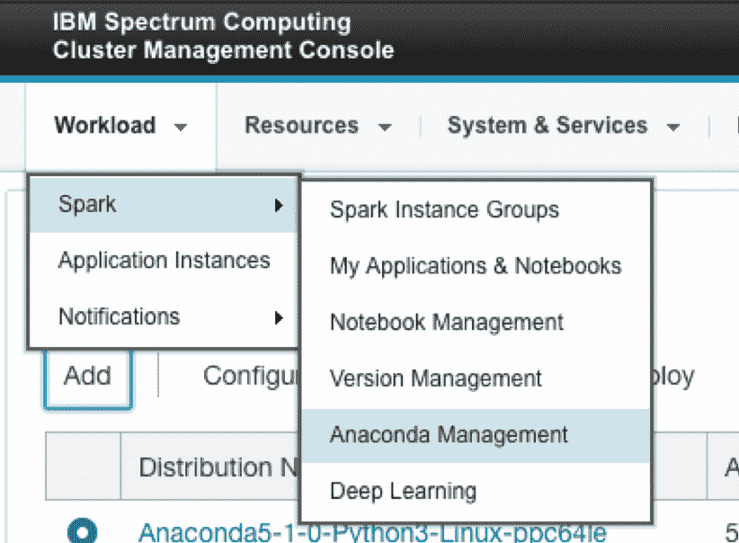
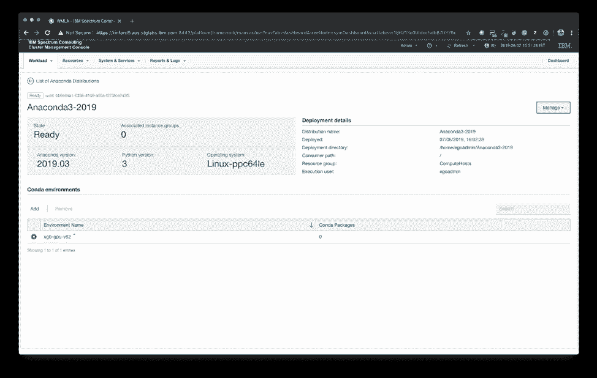
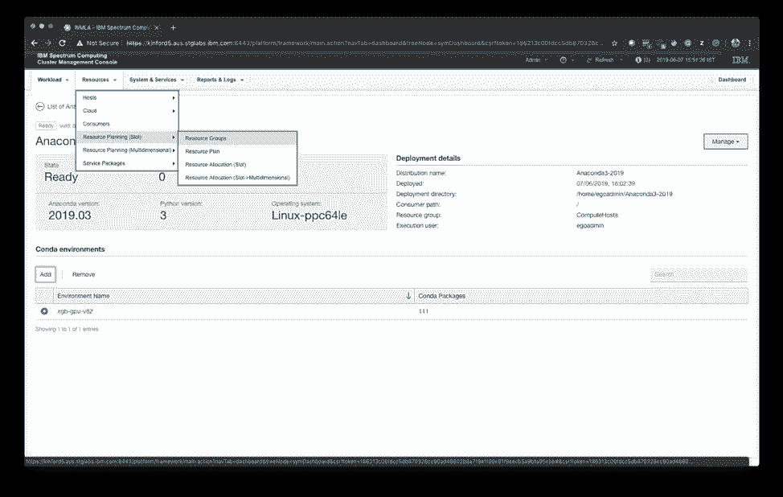

# 在 Watson Machine Learning Accelerator 中训练 XGboost 模型

> 原文：[`developer.ibm.com/zh/tutorials/train-xgboost-models-within-watson-ml-accelerator/`](https://developer.ibm.com/zh/tutorials/train-xgboost-models-within-watson-ml-accelerator/)

IBM Watson® Machine Learning Accelerator 是一种软件解决方案，它将 Watson Community Edition、IBM Spectrum Conductor® 和 IBM Spectrum Conductor Deep Learning Impact 捆绑在一起，由 IBM 为包括开源机器学习和深度学习框架在内的整个堆栈提供支持。Watson Machine Learning Accelerator 为数据科学家提供了端到端的机器学习和深度学习平台。这包含完整的生命周期管理，从安装和配置到数据摄取和准备，再到训练模型的构建、优化和分配，以及将模型移至生产环境。在您要将自己的机器学习和深度学习环境扩展为包含多个计算节点时，Watson Machine Learning Accelerator 即可大显身手。现在甚至有免费评估版本可供使用。参阅入门教程中的前提条件：
[使用 Watson Machine Learning Accelerator 对图像进行分类](https://developer.ibm.com/zh/tutorials/use-computer-vision-with-dli-watson-machine-learning-accelerator/)。

XGBoost 是经过优化的分布式梯度推进库，高效、灵活且可移植。它根据梯度推进框架来实施机器学习算法。XGBoost 可提供并行树状结构推进（也称为 GBDT 或 GBM），有助于快速准确地解决许多数据科学问题。XGBoost 是在此 [GitHub 代码库](https://github.com/dmlc/xgboost)中维护的，在 Watson Machine Learning Community Edition 1.6.1 中提供了 V0.82 版本。

## 学习目标

这是 [IBM Watson Machine Learning Accelerator 教育系列](https://developer.ibm.com/zh/series/learn-watson-machine-learning-accelerator/)的第五个教程。完成本教程后，您将掌握如何：

*   下载 Anaconda 安装程序
*   将 Anaconda 安装程序导入 Watson Machine Learning Accelerator 并创建 Conda 环境
*   创建 Jupyter Notebook 环境
*   通过使用 Conda 环境的 Notebook 创建 Adpache Spark 实例组
*   启动 Notebook 服务器并上传 Notebook，以使用 CPU 或 GPU 训练 XGBoost 模型

## 预估时间

本端到端教程需耗时约 2 小时，包括大约 30 分钟的模型训练、安装和配置，以及通过 GUI 完成的模型驱动。

## 前提条件

本教程需要访问 GPU 加速的 IBM Power System AC922 型服务器。除获取服务器外，还有多种方法可访问 [PowerAI 开发者门户](https://developer.ibm.com/linuxonpower/deep-learning-powerai/try-powerai/)中的 Power System 服务器。

## 步骤

### 第 1 步. 下载、安装和配置 IBM Watson Machine Learning Accelerator Evaluation

1.  从 IBM 软件存储库下载 IBM Watson Machine Learning Accelerator Evaluation 软件。下载需占用 4.9GB 空间，并且需要 IBM ID。

2.  按照 [IBM Knowledge Center](https://www.ibm.com/support/knowledgecenter/en/SSFHA8) 或 [OpenPOWER Power-Up User Guide](https://power-up.readthedocs.io/en/latest/Running-paie.html) 中的具体说明来安装并配置 IBM Watson Machine Learning Accelerator。

### 第 2 步. 配置操作系统用户

1.  在操作系统级别，以 root 用户身份在所有节点上为操作系统执行用户创建操作系统组和用户：

    1.  `groupadd egoadmin`
    2.  `useradd -g egoadmin -m egoadmin`
2.  在所有节点上创建的用户/组的 GID 和 UID *必须*相同。

### 第 3 步： 导入 Anaconda 安装程序并创建 Conda 环境

1.  使用 Spectrum Conductor 管理控制台打开 Spark Anaconda 管理面板。

    

2.  单击 **Add** 以创建新的 Anaconda 分发版。

    

3.  下载 [Anaconda 2019.03 安装程序](https://repo.continuum.io/archive/Anaconda3-2019.03-Linux-ppc64le.sh)。

4.  填写 Anaconda 的详细信息，然后单击 **Add**。

    *   您可以选择分发版名称。此处所选名称为 Anaconda3-2019。
    *   使用 **Choose file** 来查找并选中下载的 Anaconda 安装程序。
    *   在上传 Anaconda 安装程序时，将使用相应的值来自动填充 Anaconda version、Python version 和 Operating system 字段。在此例中，这些值为：

        *   Anaconda version: 2019.03
        *   Python version: 3
        *   Operating system: Linux on Power 64-bit Little Endian (LE)

        

5.  单击 **Add** 以开始上传 Anaconda。上传时间因网速而异。

    

6.  下图显示了成功添加 Anaconda 分发版后的屏幕。单击 **Close**。

    

7.  选中新添加的 Anaconda 分发版，然后选择 **Deploy**。

    

8.  在 **Deployment Settings** 选项卡上，提供以下信息：

    *   Instance name: Anaconda3-2019
    *   Deployment directory: /home/egoadmin/Anaconda3-2019
    *   Consumer: / (Root Consumer)
    *   Resource group: ComputeHosts
    *   Execution user: egoadmin

        完成下一步前，请勿单击 **Deploy**。

        

9.  在 **Environment Variables** 选项卡上，提供以下信息：

    *   PATH: `$PATH:/usr/bin`
    *   IBM_POWERAI_LICENSE_ACCEPT: yes

        

10.  单击 **Deploy**。

    

11.  单击 **Continue to Anaconda Distribution Instance** 时，可以观察部署状态。部署完成后，您会看到在 IBM Watson Machine Learning Accelerator 集群的所有计算主机中都已创建 /home/egoadmin/Anaconda3-2019 目录。

    

12.  下载 xgb.yml 文件。此文件包含 IBM Watson Machine Learning Community Edition Conda 程序包通道、用于 XGBoost 的基于 Python 的 GPU 程序包所需的程序包，以及在 IBM Watson Machine Learning Accelerator 中正常运行 Jupyter Notebook 环境所需的其他程序包。

    ```
     name: py-xgb-gpu
     channels:
       - https://public.dhe.ibm.com/ibmdl/export/pub/software/server/ibm-ai/conda/
       - defaults
     dependencies:
       - conda
       - jupyter
       - tornado=5.1.1
       - python=3.6.8
       - pyyaml
       - py-xgboost-gpu 
    ```

13.  单击 **Add** 以创建新的 Conda 环境。

    

14.  选择已下载的 YML 文件，然后单击 **Add**。如果文件格式存在任何错误，将显示错误消息。

    

15.  下一个屏幕会显示已成功提交添加 Conda 环境的请求。单击 **Close**。

    

16.  观察环境的创建过程。具体的持续时间根据新 Anaconda 环境内需要安装的 Conda 程序包和依赖项列表而异。

    

它使用约 91 个程序包创建环境。如果存在错误，可检查主机中的日志 – 在此例中，日志位于所有主机上的以下目录中：/home/egoadmin/Anaconda3-2019/operationlogs。


### 第 4 步： 创建 Notebook 环境

1.  选择 **Resource Groups** 部分。

    

2.  选择 **Create a Resource Group**。

    

3.  创建新的 GPU 资源组，名为 `rg-gpus`。

    *   在 Advanced formula 中输入 `ngpus`，并针对资源选择方法选择 **Static**。
    *   选择要包含在此新资源组中的所有成员主机。

        

4.  选择 **Workload > Spark > Spark Instance Groups**，以创建新的 SIG 并在 SIG 中启用 Jupyter Notebook。

5.  单击 **Create a Spark Instance Group**。

    

6.  填入以下值：

    *   Instance Group name: xgb-sig
    *   Deployment directory: /home/egoadmin/xgb-sig
    *   Execution user for instance group: egoadmin
    *   Spark Version: Spark 2.3.3

        

7.  选择 Jupyter 5.4.0 Notebook 并设置以下属性：

    1.  为您在步骤 2 中创建的实例名称选择 Anaconda 分发版实例 – 在此例中，即 Anaconda3-2019。
    2.  此外，选择步骤 2 中创建的 Conda 环境。
    3.  您还可以为基本数据目录提供自定义路径。此处已保留为空，以便选择默认值 `{DEPLOY_DIR_OF_SIG}/{NOTEBOOK_NAME}-{NOTEBOOK_VERSION}`，以供 SIG 在其中指定 Spark 实例组的名称。在此例中，由于 `DEPLOY_DIR_OF_SIG` 为 `/home/egoadmin/xgb-sig` 并且 `NOTEBOOK_NAME}-{NOTEBOOK_VERSION}` 为 `Jupyter-5.4.0`，在主机上创建的基本数据目录为 `/home/egoadmin/xgb-sig/Jupyter-5.4.0`。

        

8.  向下滚动并为 Jupyter 5.4.0 选择 **rg-gpus** 资源组。请勿更改其他任何设置。单击 **Create and Deploy Instance Group**。

    

9.  观察您的实例组是否已部署。

    

10.  单击 **Continue to Instance Group** 以查看 SIG 部署状态。

    

11.  部署完成后，单击 **Start** 来启动 SIG。

    

12.  您将观察到已开始 SIG 处理过程。

    

13.  很快，您就应看到 SIG 已启动。

    

### 第 5 步： 为用户创建 Jupyter Notebook 服务器并上传 Notebook 以训练 XGBoost 模型

1.  启动 SIG 后，转至 Notebook 选项卡并单击 **Create Notebooks for Users**。

    

2.  选择用户，然后单击 **Create**。

    

3.  创建 Notebook 后，您应在屏幕上看到创建成功消息。

    

4.  单击屏幕顶部面板上的刷新按钮以查看 My Notebooks。

    

5.  单击 **My Notebooks** 下拉列表以显示为此 SIG 创建的 Notebook 服务器列表。单击 **My Notebooks > Jupyter 5.4.0 – Owned by Admin**。

    

6.  这样会打开 Jupyter 登录页面。提供管理员登录凭证，然后单击 **Log in**。

    

### 第 6 步： 测试 XGBoost 安装

1.  创建新的 Python 3 Notebook。

    

2.  在其中导入 XGBoost 并检查其版本。

    

3.  下载 XGBoost Notebook 示例。

4.  单击 **Upload** 以上传上一步中下载的 XGBoost Notebook 示例。

    

5.  选中 xgboots-demo.ipynb 文件，然后单击 **Upload**。

    

6.  单击 Notebook 以将其打开并执行单元。

7.  下一个截屏显示的是导入所需 Python 模块（包括 XGBoost）的过程。随后，使用 scikit-learn 下载用于训练的覆盖类型数据集（分类）。接着，此数据集将拆分为训练/测试数据集，并转换为 DMatrix 数据格式，这是 XGBoost 使用的内部数据结构。

    

要使用准确性更高的 `num_rounds` 来训练模型，就必须将其增大至更大的值，如 3000，正如[此处](https://github.com/dmlc/xgboost/blob/bf3241368256ddd010d30d98ffc8a0a005f166e9/demo/gpu_acceleration/cover_type.py#L17)所示，但在 CPU 中训练时耗时更长。示例 Notebook 的 `num_rounds` 值已减小到 20，该值较小，便于 CPU 训练在合理的演示时间内完成。您可以尝试为 `num_rounds` 设置更大的值。


下一个屏幕显示了 GPU 上的模型训练以及用于执行此训练的 XGBoost 参数。通过使用 XGBoost 参数，可控制用于训练的 GPU 数量。在此示例中，`'n_gpus':1` 和 `'gpu_id':0` 已指定，即在主机上使用一个 GPU 以及 `device-id 0`。


下一个屏幕显示了在 CPU 上训练相同模型的过程，以及用于在 CPU 上执行此训练的 XGBoost 参数。


我们以 500 次推进迭代提交了另一项训练。`test-merror` 为多类分类误差率。它的计算方式为 `#(wrong cases)/#(all cases)`。我们已显示了第一轮、第 100 轮、200 轮、300 轮、400 轮和 500 轮训练后的 `test-merror` 值。观察此误差随每一轮训练逐渐减少的情况，使用 CPU 的模型准确率与使用 GPU 的模型准确率具有可比性。

但在 CPU 与 GPU 的训练时间之间却存在巨大差距：在 CPU 中训练模型耗时约 949 秒（近 16 分钟），而在 GPU 上不到 49 秒即可完成。

```
[0]test-merror:0.254831
..
[99]test-merror:0.130063
..
[199]test-merror:0.090828
..
[299]test-merror:0.072591
..
[399]test-merror:0.061851
..
[499]test-merror:0.054994
CPU Training Time: 949.3834052085876 seconds

[0]test-merror:0.254804
..
[99]test-merror:0.131302
..
[199]test-merror:0.090752
..
[299]test-merror:0.073623
..
[399]test-merror:0.064446
..
[499]test-merror:0.055069
GPU Training Time: 48.26804542541504 seconds 
```

## 结束语

IBM Watson Machine Learning Accelerator 是卓越的加速 AI 平台，可提升机器学习和深度学习训练的性能和吞吐量。带有 GPU Tesla V100 的 IBM Power Systems AC922 是为支持机器学习和深度学习工作负载而定制的硬件。IBM Watson Machine Learning Accelerator 与 AC922 强强联合可以优化训练性能，相比于在 CPU 上执行 XGBoost 训练，在 GPU 上训练可缩短执行时间，同时也提升了数据科学家的工作效率。

本文翻译自：[Train XGboost models within Watson Machine Learning Accelerator](https://developer.ibm.com/tutorials/train-xgboost-models-within-watson-ml-accelerator/)(2019-07-12)