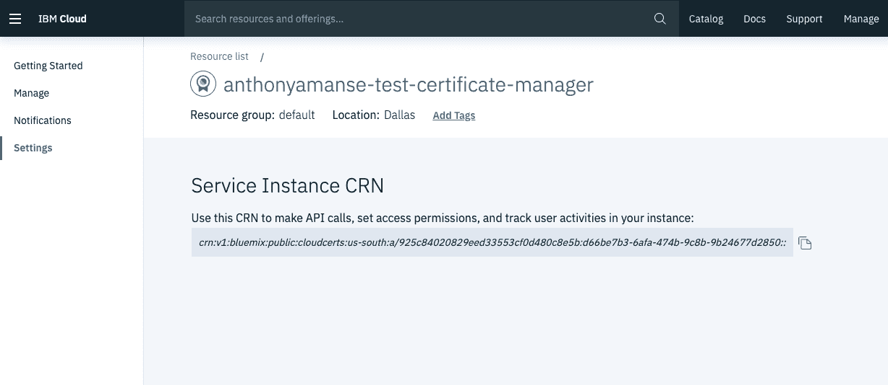
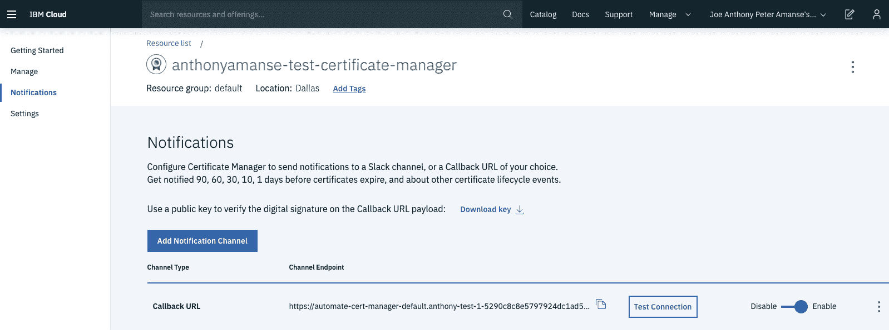
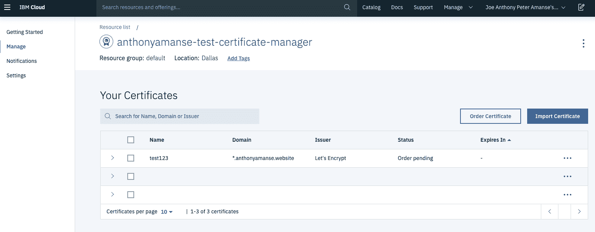

# 自动续订 Web 域的安全证书

> 原文：[`developer.ibm.com/zh/tutorials/automatic-security-certificate-renewal-openshift/`](https://developer.ibm.com/zh/tutorials/automatic-security-certificate-renewal-openshift/)

目前，大多数应用程序都使用 HTTPS。为确保用户与您的应用程序建立安全通信，安全套接字层 (SSL) 或传输层安全性 (TLS) 证书起着不可或缺的作用。当使用其中任何一个证书时，在使用向证书注册的域名的应用程序上启用 HTTPS。然后，对与服务器之间传输的所有数据进行加密。此方法可确保任何人都无法轻易窃听您的动态数据。

使用证书还可以防止应用程序用户客户端和您的服务器之间的通信遭遇中间人攻击。最后，在 Web 应用程序中使用证书可确保没有人能够篡改交换的数据。在这个数字世界中，最重要的安全性最佳实践之一就是确保您的 Web 应用程序使用 TLS 证书，这是一个经过更新的、更安全的 SSL 版本。

但是，现在这些证书将过期并且需要续订。您是否正在寻找某种方法来简化应用的 SSL 或 TLS 证书的续订过程？本教程将介绍如何使用 Red Hat OpenShift on IBM Cloud™ 示例自动为您的应用进行续订。

## 前提条件

在开始之前，您需要[一个免费的 IBM Cloud 帐户](https://cloud.ibm.com/registration?cm_sp=ibmdev-_-developer-tutorials-_-cloudreg)。

## 预估时间

完成本教程大约需要 25 分钟。

## 通过认证中心获取 SSL 或 TLS 证书

您必须通过认证中心 (CA) 才能获取 SSL 或 TLS 证书。认证中心充当受信任的第三方，用于验证证书的请求者是实际所有者并且可以控制域。操作系统和浏览器具有标识为受信任的 CA 列表。然后，URL 旁边会显示绿色锁，指示 Web 应用程序正在使用 HTTPS。

1.  使用 Let’s Encrypt

    [Let’s Encrypt](https://letsencrypt.org/) 是受信任的认证中心之一，提供大多数浏览器都信任的经过域验证的证书。它使用自动证书管理环境 (ACME) 协议进行验证，将发送提问以验证您是否实际控制自己的域名。此服务使用广泛，因为它可以轻松免费地获得证书。

    但是，使用此认证中心的缺点是颁发的证书仅可用 90 天。您必须完成获取新证书的过程。由于证书过期，您可能会面临应用程序中断情况。手动请求证书可能很麻烦，尤其是在您需要多个域的情况下。

    优点则是您可以借助 Let’s Encrypt 的 Certbot 或其他与 Let’s Encrypt 集成的开源软件轻松自动完成此过程。

2.  使用 Certbot 客户端。

    通过 Let’s Encrypt 获取证书的一种简单方法是运行 [Certbot](https://github.com/certbot/certbot) 客户端。每次需要新证书时（例如，当证书过期时），都需要手动运行该客户端。您可以通过编写自己的代码，每隔 90 天运行一次 Certbot 客户端，自动执行此工作。如果您的 DNS 提供者支持 API，那么就更容易，您无需通过 DNS 提供者的网站即可完成提问。可参阅 [Let’s Encrypt 和 Certbot 的入门文档](https://letsencrypt.org/getting-started/)。

## 使用 Kubernetes Ingress 实现自动化

如果您使用 Kubernetes 及其 [Ingress](https://kubernetes.io/docs/concepts/services-networking/ingress/#the-ingress-resource) 资源，则可能已在 Ingress 资源上使用 SSL 或 TLS 证书。如果要使用 Ingress 资源自动配置和续订 Let’s Encrypt 证书，您可以轻松地在 Kubernetes 中部署 cert-manager。Kubernetes 附加组件 [cert-manager](https://github.com/jetstack/cert-manager) 可自动执行在 Ingress 资源中请求和使用证书的过程。

此开源软件可完成您的提问：您无需对 DNS 提供者或应用程序进行任何手动干预。颁发证书后，证书应在您的环境中显示为 Kubernetes 密钥。cert-manager 附加组件也会使其保持最新状态，只要它正在运行。

## 使用 OpenShift 路由实现自动化

如果您使用 OpenShift [路由](https://docs.openshift.com/enterprise/3.0/architecture/core_concepts/routes.html)，请考虑使用 [openshift-acme](https://github.com/tnozicka/openshift-acme)，其运行方式类似于 cert-manager。它通过使用路由自动配置证书，这样可以更轻松地在 OpenShift 路由上请求和附加证书。

由于 cert-manager 和 openshift-acme 都是开源项目，因此您可以查看源代码并对其进行修改，以满足自己的需求。您甚至还可以回馈到相应的上游。

## 使用证书管理器服务

IBM Cloud 包含[证书管理器](https://cloud.ibm.com/catalog/services/certificate-manager?cm_sp=ibmdev-_-developer-tutorials-_-cloudreg)服务，可帮助您管理和部署 SSL 或 TLS 证书。该服务允许您存储证书，并在证书即将过期时向您发送通知。它还允许您直接从 Let’s Encrypt 订购证书，这可以帮助您的应用程序防止因证书过期而中断运行。

优点是您可以使用可用的 API 来自动完成证书的配置或续订过程。如果您已在使用 IBM Cloud [Internet Services](https://cloud.ibm.com/catalog/services/internet-services?cm_sp=ibmdev-_-developer-tutorials-_-cloudreg) 作为 DNS 提供者，那么可以通过证书管理器服务使用 Let’s Encrypt 轻松地订购证书。对于其他 DNS 提供者，您需要设置自己的回调 URL 服务，以接收 Let’s Encrypt 发送的提问。

证书管理器实例使用您为“需要证书域验证”和“已发布所订购证书”等事件设置的回调 URL。

### 在 Red Hat OpenShift on IBM Cloud 中进行部署的示例

OpenShift 是可部署回调服务的一个示例。以下示例使用在 OpenShift 中部署应用程序的 Source-to-Image 策略。OpenShift 直接从 GitHub 存储库中提取，然后直接在平台中进行构建和部署。

本部分中的样本应用程序使用 Godaddy 作为其 DNS 提供者，因为可以免费使用其 API。当您已经广泛使用 OpenShift 来部署应用程序时，在 OpenShift 中进行部署才有意义。

1.  要开始部署，就需要创建 IBM Cloud 证书管理器实例。如果您的 DNS 提供者不是 Godaddy，则需要修改代码以使用 DNS 提供者 API（修改 DNS 记录，例如，添加和删除域中的 TXT 记录）。

2.  克隆 [automate-cert-manager](https://github.com/IBM/automate-cert-manager) 存储库。从证书管理器仪表板中获取您的证书管理器 CRN，使用您自己的值修改 `openshift-auto-cert.env.template`，然后将其重命名为 `openshift-auto-cert.env`。您的 CRN 将进入 `ALLOWED_CM` 值，如下面的截屏所示：

    

    示例 `openshift-auto-cert.env`：

    ```
     GODADDY_KEY=keysample
     GODADDY_SECRET=secretsample
     GODADDY_DOMAIN=anthonyamanse.space
     CM_REGION=us-south
     ALLOWED_CM=crn:v1:bluemix:public:cloudcerts:us-south:a/123:123-456-567:: 
    ```

3.  现在，您可以使用 OpenShift CLI 从命令行部署应用。确保您已登录，并运行以下命令：

    ```
     oc new-app https://github.com/IBM/automate-cert-manager --env-file=openshift-auto-cert.env
     oc expose svc automate-cert-manager 
    ```

4.  要检查构建和部署的状态，可运行 `oc get pods`，您应该会看到类似以下示例的结果：

    ```
     $ oc get pods

     NAME                                READY     STATUS      RESTARTS   AGE
     automate-cert-manager-1-build       0/1       Completed   0          4d
     automate-cert-manager-1-xs7gm       1/1       Running     0          4d 
    ```

5.  您必须对回调 URL 的公开路由启用 HTTPS，才能使用证书管理器。编辑路由：

    ```
     $ oc edit routes automate-cert-manager 
    ```

6.  在键 `spec:` 下添加 `tls:, terminate: edge` 行，如以下示例所示（缩进对于 yaml 文件很重要）：

    ```
     spec:
       tls:
         termination: edge 
    ```

7.  获取路由：

    ```
     oc get routes
     NAME                    HOST/PORT                                                                                                               PATH      SERVICES                PORT               TERMINATION   WILDCARD
     automate-cert-manager   automate-cert-manager-default.anthony-test-1-5290c8c8e5797924dc1ad5d1b85b37c0-0001.us-east.containers.appdomain.cloud             automate-cert-manager   8080-tcp           edge          None 
    ```

8.  现在，您可以将路由放在证书管理器实例的回调 URL `https://<your-route>/callback` 中，如以下截屏所示：

    

9.  尝试通过证书管理器仪表板订购证书。状态应从 `Order Pending` 更改为 `Valid`。然后，您可以通过仪表板下载证书。您还可以使用证书管理器 API 来获取更多自动化功能，以便访存证书，并将其放置在任何所需使用位置（例如，在负载均衡器中）。下面的截屏给出了一个示例：

    

### 在 IBM Cloud Functions 中进行部署的示例

您可能更愿意保持低成本并使用无服务器架构。由于无需担心应用程序背后的基础架构，因此可以节省时间。本部分中的这一示例使用 [IBM Cloud Functions](https://cloud.ibm.com/functions?cm_sp=ibmdev-_-developer-tutorials-_-cloudreg) 作为无服务器平台。

1.  克隆您在先前部分中使用的存储库，并修改 `openwhisk-auto-cert.json.template`。

2.  在 Cloud Functions 中进行部署：

    ```
     $ ic fn action create callback-gd actions/callback-gd.js -P openwhisk-auto-cert.json --web true
     ok: created action callback-gd

     $ ic fn action get callback-gd -r
     ok: got action callback-gd
     https://us-south.functions.cloud.ibm.com/api/v1/web/QWERTY/default/callback-gd 
    ```

3.  使用来自 `ic fn action get callback-gd -r` 的 URL 作为证书管理器实例的回调 URL。然后，您可以像先前部分那样继续订购新证书。

## 结束语

由于当今的数据传输量十分庞大，在应用程序中使用 SSL 或 TLS 证书非常重要，尤其是在应用程序的用户交换个人信息的情况下。因为 HTTPS 所能提供的安全性，此安全通信会令您的用户更加满意。

此外，还要考虑其他认证中心颁发的证书将在 90 天后过期。与 Let’s Encrypt 的域验证 (DV) 相比，他们提供了其他验证方法，如组织验证 (OV) 和扩展验证 (EV)。

对于您的用户，确保其他人无法访问其数据，并检查他们使用的应用程序是否启用了 HTTPS。如果要自动完成域的证书续订过程，可从本教程中描述的方法开始。Let’s Encrypt 可以快速颁发证书，而无需额外费用。为您的证书设置良好的自动化可确保您的应用不会因证书过期而中断运行。当您的 DNS 提供者拥有 API 时，您可以通过 Let’s Encrypt 自动完成提问。

既然您已了解如何自动配置和续订 TLS 证书，现在就可以在自己的 Web 应用程序上启用 HTTPS，确保传输中的所有用户数据都已加密。您学习了一些工具，通过这些工具可自动续订 TLS 证书来避免运行中断。在证书管理器之类工具的帮助下，您可以确保所有证书都安全存储。

本文翻译自 ：[Renew security certificates automatically for web domains](https://developer.ibm.com/tutorials/automatic-security-certificate-renewal-openshift/)（2019-08-01）