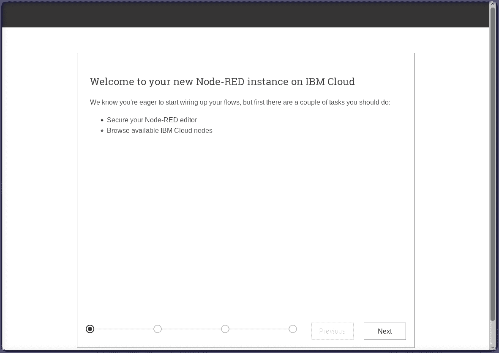

# 利用 Node-RED 和 Watson AI 服务构建通用口语翻译器

> 原文：[`developer.ibm.com/zh/tutorials/build-universal-translator-nodered-watson-ai-services/`](https://developer.ibm.com/zh/tutorials/build-universal-translator-nodered-watson-ai-services/)

在本教程中，您将学习如何通过利用 Node-RED Starter 应用程序与以下 Watson AI 服务连接起来：Speech to Text、Language Translator 和 Text to Speech，从而创建一个通用口语翻译器。**Node-RED Starter** 应用程序包含一个 Node-RED Node.js Web 服务器和一个用于存储 Node-RED 流的 Cloudant 数据库。

## 学习目标

完成本教程后，您将能够：

*   创建在 IBM Cloud 中运行的 Node-RED Starter 应用程序，创建 Watson 服务实例，包括 Watson Speech to Text、Watson Text to Speech 和 Watson Language Translator，并将这些服务与您的 Node-Red 应用连接起来。

*   启动并配置 Node-RED 可视编程编辑器。

*   安装更多的 Node-RED 节点，并创建使用 Watson 服务来创建通用口语翻译器的流。

## 前提条件

可使用 IBM Cloud Lite 帐户完成本教程。

*   创建一个 [IBM Cloud 帐户](https://cloud.ibm.com/registration?cm_sp=ibmdev-_-developer-tutorials-_-cloudreg)
*   登录到 [IBM Cloud](https://cloud.ibm.com/login?cm_sp=ibmdev-_-developer-tutorials-_-cloudreg)

## 预估时间

您可以在大约 15 分钟内学完本教程。

## 第 1 步 – 创建一个 Node-RED Starter 应用程序

按照以下步骤在 IBM Cloud 中创建一个 Node-RED Starter 应用程序。

1.  登录到您的 [IBM Cloud](https://cloud.ibm.com/login?cm_sp=ibmdev-_-developer-tutorials-_-cloudreg) 帐户。

2.  单击 [Catalog](https://cloud.ibm.com/catalog/?cm_sp=ibmdev-_-developer-tutorials-_-cloudreg) (1)。

3.  搜索 **node-red** (2)。

4.  选择 **Starter Kits** 类别 (3)，然后选择 [**Node-RED Starter**](https://cloud.ibm.com/catalog/starters/node-red-starter?cm_sp=ibmdev-_-developer-tutorials-_-cloudreg) (4)。

    

5.  为您的应用程序输入一个**唯一的名称** (5)。这个名称将是**应用程序 URL**的一部分 (6)。 如果该名称不是唯一的，您会收到一条错误消息，并需要输入另一个名称。

6.  **Region** (7)、**Organization** (8) 和 **Space** (9) 字段将使用您的 IBM Cloud 帐户的有效选项进行预先填充。 如果您有一个 Lite 帐户，那么只需接受默认设置。 如果您有一个试用或付费帐户，或者如果您属于其他组织，那么可以选择部署到任何对您可用的地区、组织和空间。

7.  在 Selected Plan 部分，选择 **Lite** (10)。

8.  单击 **Create** 按钮 (11)。

    

该 Node-RED Starter 应用程序将在指定的 IBM Cloud 地区进行配置。这个过程称为 *载入一个应用程序* 。完成此过程可能需要几分钟。

不必等待应用程序配置和启动。您可以继续执行下一步。

## 第 2 步 – 创建 Watson AI 服务实例

您可以将强大的 Watson AI 微服务作为 API 添加到应用程序中。可以通过实例访问这些服务，通过凭证管理实例。 本教程不会介绍如何将凭证密钥复制并粘贴到您的应用中，而是演示如何创建这些微服务，并将其绑定到您的 Cloud Foundry 应用程序。针对这些服务的 Node-RED 节点很容易配置。

IBM Cloud Lite 版中提供所有这三种 Watson AI 服务，这三种服务是构建通用翻译器所必不可少的：

*   Watson Speech to Text
*   Watson Text to Speech
*   Watson Language Translator

*   返回到 IBM Cloud Catalog。搜索 [**speech**](https://cloud.ibm.com/catalog?search=speech&category=ai&cm_sp=ibmdev-_-developer-tutorials-_-cloudreg)，导航到 AI 类别。

    

*   选择 [**Speech to Text**](https://cloud.ibm.com/catalog/services/speech-to-text?cm_sp=ibmdev-_-developer-tutorials-_-cloudreg)，然后单击 **Create** 按钮。

    

*   返回到 IBM Cloud Catalog 中的 AI 类别，并选择 [**Text to Speech**](https://cloud.ibm.com/catalog/services/text-to-speech?cm_sp=ibmdev-_-developer-tutorials-_-cloudreg)，然后单击 **Create** 按钮。

    

*   返回到 IBM Cloud Catalog，搜索 [**translator**](https://cloud.ibm.com/catalog?search=translator&category=ai&cm_sp=ibmdev-_-developer-tutorials-_-cloudreg)，导航到 AI 类别。

    

*   选择 [**Language Translator**](https://cloud.ibm.com/catalog/services/language-translator?cm_sp=ibmdev-_-developer-tutorials-_-cloudreg)，然后单击 **Create** 按钮。

    

## 第 3 步 – 将 Watson AI 服务连接到 Node-RED Starter 应用程序

在这一步中，您将新创建的 Watson AI 服务连接到 Node-RED Starter 应用程序。

1.  返回到 [IBM Cloud 仪表板](https://cloud.ibm.com/resources?groups=cf-application&cm_sp=ibmdev-_-developer-tutorials-_-cloudreg)，导航到 Cloud Foundry Apps 部分。

    

2.  选择您的 nodered-universal-translator 应用程序。 这样会打开 **Applications Details**。

    

3.  从左侧导航菜单中选择 **Connections**。

4.  单击 **Create connection** 按钮。

    

5.  搜索您在上一步中创建的 Watson 服务，将鼠标悬停在 **Speech to Text** 上，然后单击 **Connect** 按钮。

    

6.  单击 **Connect** 按钮，以便自动生成绑定凭证。

    

    现在**请勿重新载入**该应用程序。 单击 **Cancel** 按钮。在连接完所有这三种 Watson AI 服务实例后，您可以重新载入一次应用程序。

    

    再次单击 **Create Connection** 按钮。

    

7.  搜索 **speech** 服务，将鼠标悬停在 **Text to Speech** 服务上，然后单击 **Connect** 按钮。

    

8.  单击 **Connect** 按钮，以便自动生成绑定凭证。

    记住**切勿**单击 **Restage** 按钮。

    再次单击 **Create Connection** 按钮。

    

9.  搜索 **language translator** 服务，将鼠标悬停在 Language Translator 服务上，然后单击 **Connect** 按钮。

    

10.  单击 **Connect** 按钮，以便自动生成绑定凭证。 现在，您可以单击 **Restage** 按钮了。

    

现在，将重新载入并重新启动 Cloud Foundry 应用程序。

## 第 4 步 – 启动 Node-RED 应用程序并打开 Node-RED 可视编程编辑器

Node-RED 是一个开源 Node.js 应用程序，它提供了一个可视编程编辑器，可以轻松地将流连接在一起。

首次启动 Node-RED 应用程序时，Node-RED 会帮您设置和配置可视编程编辑器。

1.  在绿色的 **Running** 图标出现后，单击 **View App URL** 链接。

    

    这样会在 Node-RED 首页中打开一个新的浏览器选项卡。

2.  使用设置向导，通过用户名和密码保护您的编辑器，然后浏览和添加更多节点。如果忘记了用户名和密码，您可以在 Cloudant DB 中重置这些凭证，或通过设置 IBM Cloud 环境变量来重置。单击 **Finish** 按钮继续后面的操作

    

3.  单击 **Go to your Node-RED flow editor** 按钮启动 Node-RED 流编辑器。

    

4.  单击右上角的 Person 图标，然后使用您的新用户名和密码凭证进行**登录**。

    

    Node-RED 可视编程编辑器会打开一个默认流。左侧是一个**节点面板**，您可以将其拖动到流上。可以**将节点连在一起**来创建程序。

    

## 第 5 步 – 安装更多的 Node-RED 节点

我们构建的通用翻译器需要一个录制消息的麦克风，还需要能够播放翻译的音频。 幸运的是，可以将一些节点添加到 Node-RED 面板中，从而增加这些功能。

1.  单击 Node-RED 菜单，选择 **Manage Palette**

    

2.  选择 **Install** 选项卡，搜索 **browser-utils**。找到 *node-red-contrib-browser-utils* 节点，然后单击 **Install** 按钮。

    

3.  搜索 **play-audio**，找到 *node-red-contrib-play-audio* 节点，然后单击 **Install** 按钮。

    

## 第 6 步 – 为通用翻译器构建流

Node-RED 允许您将节点从左侧面板拖放到流画布上，并将其连接在一起来创建程序。

在 Node-RED 中创建流既快速又简单。 但是，如果您只想将流导入到 Node-RED 应用程序中，就可以[从我的 GitHub 存储库获取代码](https://github.com/johnwalicki/NodeRED-Starter-Universal-Translator/blob/master/flows/NodeRED-UniversalTranslator-flow.json)。

### Speech-to-Text 流

首先，我们来构建 Speech-to-Text 流。

1.  单击一个 `microphone` 节点并将其拖动到流中。

2.  单击一个 `Speech to Text` 节点并将其拖动到流中。双击该节点，然后选择 US English。

3.  单击一个 `debug` 节点并将其拖动到流中。双击该节点，使其输出 `msg.transcription`。

4.  如以下截屏所示，将这些节点连接在一起。

5.  单击红色的 **Deploy** 按钮。

6.  选择 `microphone` 节点左侧的选项卡，并允许您的浏览器访问笔记本电脑上的麦克风。

7.  录制消息，比如“wow this is so much fun!”

    

### Text-to-Speech 流

现在，我们来构建 Text-to-Speech 流。

1.  单击一个 `Inject` 节点并将其拖动到流中。 双击该节点，将有效负载类型更改为字符串，并输入一条消息。

    

2.  单击一个 `Text to Speech` 节点并将其拖动到流中。 双击该节点，然后选择 US English。

3.  单击一个 `Change` 节点并将其拖动到流中。

    从 Text to Speech 节点返回的音频转录文本将作为原始缓冲区返回，其中包含 `msg.speech` 消息的音频。 `Play-audio` 节点预计会在 msg.payload 上传入该缓冲区，因此 Change 节点将重新分配相关值。

    双击 `Change` 节点，并将 `msg.payload` 分配给 `msg.speech`。

    

4.  单击一个 `play-audio` 节点并将其拖动到流中。

5.  如以下截屏所示，将这些节点连接在一起。

6.  单击红色的 **Deploy** 按钮。

7.  选择 `Inject` 节点左侧的选项卡。 这样将会播放消息的音频。

    

### Language Translater 流

我们的通用翻译器将使用录制的文字作为 `language translator` 节点的输入内容，然后将外语发送到 `Text to Speech` 节点。

1.  单击另一个 `Change` 节点并将其拖动到流中。双击该节点，将 `msg.transcription` 分配给 `msg.transcription`。

    

2.  单击一个 `language translator` 节点并将其拖动到流中。双击该节点，选择 English 作为 **Source**，然后选择 Spanish 作为 **Target**。

    

3.  单击一个 `debug` 节点并将其拖动到流中。

4.  双击 `Text to Speech` 节点，将语言更改为 Spanish，并选择一种声音。

    

5.  如截屏所示，将这些节点连接在一起。

    

6.  单击红色的 **Deploy** 按钮。

## 第 7 步 – 测试通用翻译器！

既然您已构建了通用翻译器，现在就试用一下吧！

1.  选择 `microphone` 节点左侧的选项卡，并允许您的浏览器访问笔记本电脑上的麦克风。

2.  录制一条消息。

3.  您可以在 Node-RED 中的 Debug 选项卡中查看翻译结果。

4.  尝试在各种语言之间切换翻译。

    

## 结束语

恭喜！ 您已在 IBM Cloud 中使用 [Watson 服务](https://cloud.ibm.com/catalog?category=ai&cm_sp=ibmdev-_-developer-tutorials-_-cloudreg)创建了一个 Node-RED Starter 应用程序。

本文翻译自：[Build a spoken universal translator using Node-RED and Watson AI services](https://developer.ibm.com/tutorials/build-universal-translator-nodered-watson-ai-services/)（2019-04-02）