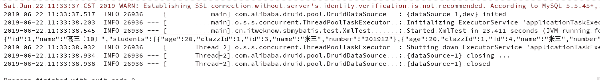
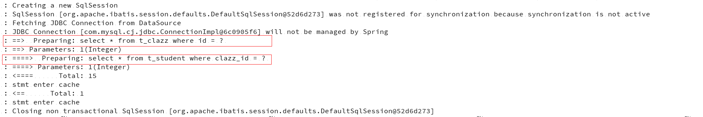
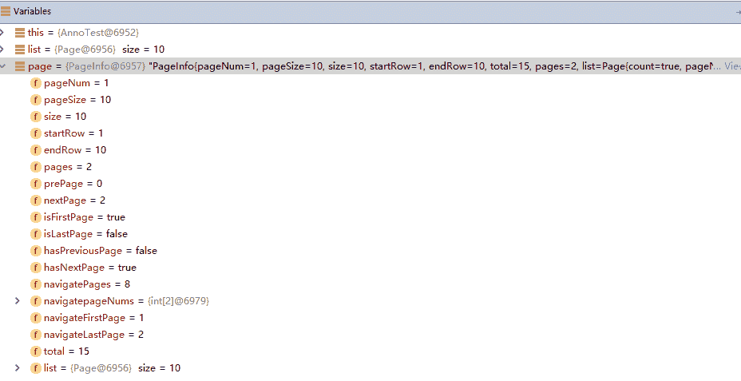

# Spring Boot 项目整合 MyBatis 连接数据库

> 原文：[`developer.ibm.com/zh/tutorials/j-spring-boot-integrate-with-mybatis/`](https://developer.ibm.com/zh/tutorials/j-spring-boot-integrate-with-mybatis/)

在我们日常的开发过程中，肯定不可避免的会使用到数据库以及 SQL 语句。比如，刚开始学习 Java 的时候可能会遇到 JDBC，它是连接 Java 和数据库的桥梁，我们可以使用 JDBC 来建立与数据库之间的连接并且执行相应的 SQL 语句。虽然 JDBC 的执行效率很高，但是其开发效率比较低。正是如此，市面上出现了一大批 ORM（对象关系映射）框架，例如 Hibernate，iBATIS 以及本文将要介绍的 MyBatis。

## MyBatis 简介

MyBatis 是一款优秀的持久层框架，它支持定制化 SQL、存储过程以及高级映射。它避免了几乎所有的 JDBC 代码和手动设置参数以及获取结果集。因为 MyBatis 可以使用简单的 XML 或注解来配置和映射原生信息，将接口和 Java 的 POJOs (Plain Old Java Objects，普通的 Java 对象)映射成数据库中的记录。

通俗地说，MyBatis 就是我们使用 Java 程序操作数据库时的一种工具，可以简化我们使用 JDBC 时的很多操作，而且还简化了数据库记录与 POJO 之间的映射方式。

### 为什么要使用 MyBatis

前文提到过，目前市面上 有很多的 ORM 框架，例如 Hibernate，iBATIS 以及 Spring 全家桶的 Spring Data JPA。那么我们为什么要使用 MyBatis 呢？因为使用 MyBatis 有以下优势：

1.  可以简化我们操作数据库的步骤。
2.  相对 Hibernate 来说学习成本较低，Hibernate 还需要学习其 HQL 查询规范。
3.  使用相对广泛。

## 前提条件

本文将使用开源的数据库连接池 [DBCP](https://github.com/apache/commons-dbcp)（DataBase Connection Pool）连接 MySQL 数据库，并在此基础上整合 MyBatis 以及 MyBatis Plus，进而讲解如何使用 MyBatis 和 MyBatis Plus 操作数据库。所以在开始本教程的阅读之前，需要如下准备：

1.  一个 Spring Boot 的 Web 项目，你可以通过 [Spring Initializr 页面](https://start.spring.io/) 生成一个空的 Spring Boot 项目，当然也可以下载 [springboot-pom.xml 文件](https://github.com/ganchaoyang/spring-tutorial/blob/master/resources/springboot-pom.xml) ，然后使用 Maven 构建一个 Spring Boot 项目。
2.  安装 MySQL 数据库或者一台 MySQL 服务器。

## 使用 DBCP 连接池

DBCP 数据库连接池是 Apache 上的一个 Java 连接池项目，也是 Tomcat 使用的连接池组件。由于建立数据库连接是一种非常耗时、耗资源的行为，所以通过连接池预先同数据库建立一些连接，放在内存中，应用程序需要建立数据库连接时直接到连接池中申请一个就行，使用完毕后再归还到连接池中。

### 添加相关依赖

这一步很简单，只需要在 `pom.xml` 中添加清单 1 的内容即可。

**清单 1\. 添加相关依赖**

```
<!--连接驱动-->
<dependency>
    <groupId>mysql</groupId>
    <artifactId>mysql-connector-java</artifactId>
    <version>6.0.6</version>
    <scope>runtime</scope>
</dependency>

<dependency>
    <groupId>org.apache.commons</groupId>
    <artifactId>commons-dbcp2</artifactId>
   <version>2.5.0</version>
< /dependency> 
```

### 配置数据源

添加好依赖后，我们需要做的就是配置我们的数据源。首先我们需要在配置文件中添加数据源相关的配置项的值，下面清单代码只给出了部分项，完整内容可以查看 [本文源码](https://github.com/ganchaoyang/spring-tutorial/tree/master/sb-mybatis) ：

**清单 2\. 数据源配置文件配置项**

```
# 基本属性
spring:
  datasource:
    dbcp2:
      url: jdbc:mysql://localhost:3306/spring_tutorial?serverTimezone=GMT%2B8amp;characterEncoding=utf-8
      username: root
      password: 123456
      driver-class-name: com.mysql.jdbc.Driver 
```

添加好配置项后，我们在 `cn.itweknow.sb-mybatis.config` 包下新建了 `DataSourceConfiguration` 类，它是数据源的配置类，其内容如下，可以看到在这个类里面我们配置了数据源。

**清单 3\. 数据源配置**

```
@Configuration
@ConditionalOnProperty(name = "spring.datasource.dbcp2.url", matchIfMissing = false)
@MapperScan(value = { "cn.itweknow.sbmybatis.mapper" }, sqlSessionFactoryRef = "sqlSessionFactory")
public class DataSourceConfiguration {

    @Bean(name = "dataSource")
    @ConfigurationProperties(prefix = "spring.datasource.dbcp2")
    public DataSource dataSource() {
        return new BasicDataSource();
    }

} 
```

到这一步，如果我们能够正常启动项目就意味着我们的连接池配置成功了。

## 集成 MyBatis

下面我们来了解如何在 Spring Boot 项目中配置 MyBatis。只需要三大步骤就可以完成这个配置。第一步是添加依赖包，第二步是配置数据库事务和会话工厂，最后一步就是配置 Mapper 的路径。

### 添加 MyBatis 相关依赖包

我们只需要在 pom.xml 文件的 `<dependencies>` 标签下添加如下内容即可。

**清单 4\. 添加 MyBatis 依赖包**

```
<!--mybatis-->
<dependency>
    <groupId>org.mybatis.spring.boot</groupId>
    <artifactId>mybatis-spring-boot-starter</artifactId>
    <version>1.3.2</version>
</dependency> 
```

### 配置数据库事务和会话工厂

**清单 5\. 配置数据库事务和会话工厂**

```
@Bean(name = "transactionManager")
public DataSourceTransactionManager dbOneTransactionManager(
            @Qualifier("dataSource") DataSource dataSource) {
   return new DataSourceTransactionManager(dataSource);
}

@Bean(name = "sqlSessionFactory")
@ConditionalOnMissingBean(name = "sqlSessionFactory")
public SqlSessionFactory dbOneSqlSessionFactory(@Qualifier("dataSource") DataSource dataSource) throws Exception {
   final SqlSessionFactoryBean sessionFactory = new SqlSessionFactoryBean();
   sessionFactory.setDataSource(dataSource);
   return sessionFactory.getObject();
} 
```

在 `DataSourceConfiguration` 类中添加上面的代码块，我们就配置了一个事务管理器和一个会话工厂。

### 配置 Mapper 路径

1.  首先指定 `*Mapper.java` 的扫描路径（即存放 `*Mapper.java` 的包地址）。我们可以通过在 `DataSourceConfiguration` 类或者 `SbMybatisApplication` 类上添加 `@MapperScan` 注解来指定扫描路径：

    **清单 6\. 配置 `*Mapper.java` 扫描路径**

    ```
    @MapperScan(value = { "cn.itweknow.sbaop.db.mapper" }, sqlSessionFactoryRef = "sqlSessionFactory")
    public class DataSourceConfiguration {
    ...
    } 
    ```

2.  通过会话工厂指定指定 `*Mapper.xml` 的路径。修改 `SqlSessionFactory` 的 `Bean` 创建方法如下所示：

    **清单 7\. 配置 `*Mapper.xml` 扫描路径**

    ```
    @Bean(name = "sqlSessionFactory")
    @ConditionalOnMissingBean(name = "sqlSessionFactory")
    public SqlSessionFactory dbOneSqlSessionFactory(@Qualifier("dataSource") DataSource dataSource)throws Exception {
       final SqlSessionFactoryBean sessionFactory = new SqlSessionFactoryBean();
       sessionFactory.setDataSource(dataSource);
       sessionFactory.setMapperLocations(new PathMatchingResourcePatternResolver()
                    .getResources("classpath:sqlmap/*Mapper.xml"));
       return sessionFactory.getObject();
    } 
    ```

至此，我们的 MyBatis 和 Spring Boot 就整合完成了。下面的章节将介绍具体如何使用 MyBatis 了。MyBatis 一共提供了两种使用方式，一种是基于 XML 配置 的方式，一种是基于注解的方式。我们将分别从这两个方面来了解如何使用 MyBatis。

## 基于 XML 方式使用 MyBatis

### 准备工作

我们将通过一个具体的场景来讲解如何使用 MyBatis 进行数据库操作：定义一个学生实体和班级实体，并创建对应的数据库表，然后使用 MyBatis 对其进行增、删、改、查操作。学生类的全路径为 `cn.itweknow.sbmybatis.model.dao.Student` ，班级类的全路径为 `cn.itweknow.sbmybatis.model.dao.Clazz` ，相对应的数据库表结构[点击这里](https://github.com/ganchaoyang/spring-tutorial/blob/master/sb-mybatis/spring_tutorial.sql) 获取。

### 创建 Mapper 类及 XML 文件

创建好对应的实体类后，我们还需要为其创建对应的 `Mapper.java` 和 `Mapper.xml` 文件，需要注意的是这两类文件需要放到前面配置数据源时指定的路径下，在本例中 `Mapper.java` 文件是放在 `cn.itweknow.sbmybatis.mapper` 包下，而 `Mapper.xml` 则是放在 `resources/sqlmap` 目录下。

#### 创建 `StudentMapper.java` 文件

**清单 8\. `StudentMapper.java` 类**

```
public interface StudentMapper {
    int insert(Student student);
    int updateIgnoreNullById(@Param("student") Student student);
    Student selectById(@Param("id") int id);
    int deleteById(@Param("id") int id);
} 
```

在 `StudentMapper.java` 类中我们定义了新增，更新（忽略空值），根据 `id` 查询学生，根据 `id` 删除学生四个方法，覆盖了简单的 `CURD （Create、Update、Retrieve、Delete` v 操作，但是这四个只是方法的定义，那么具体实现呢？与我们平常所接触到的 `interface` 不一样的是，它的实现不是一个具体的 `Java` 类，而是一个与之对应的 `mapper.xml` 文件，也就是我们接下来要看到的 `StudentMapper.xml` 文件。 `StudentMapper.java` 类中定义的接口会对应 `StudentMapper.xml` 中的一段 `SQL` 语句。

#### 创建 `StudentMapper.xml` 文件

创建一个与 `StudentMapper.java` 类对应的 XML 文件，里面定义了 `StudentMapper.java` 类中定义的 4 个方法的 `SQL` 实现，具体代码如下所示，篇幅的原因，完整的 `XML` 内容可以查看[本文源码](https://github.com/ganchaoyang/spring-tutorial/tree/master/sb-mybatis) 。

**清单 9\. `StudentMapper.xml` 文件**

```
<mapper namespace="cn.itweknow.sbmybatis.mapper.StudentMapper">
  <resultMap id="BaseResultMap" type="cn.itweknow.sbmybatis.model.dao.Student">
    <id column="id" jdbcType="INTEGER" property="id" />
    <result column="name" jdbcType="VARCHAR" property="name" />
    ...
  </resultMap>
  <insert id="insert" parameterType="cn.itweknow.sbmybatis.model.dao.Student" useGeneratedKeys="true" keyProperty="id">
    insert into t_student(name,age,clazz_id,number) values
    (#{name},#{age},#{clazzId},#{number})
  </insert>

  <update id="updateIgnoreNullById">
    update t_student
    <set>
      <if test="student.name != null">
        name = #{student.name}
      </if>
     ...
    </set>
    where id = #{student.id}
  </update>
  <select id="selectById" resultMap="BaseResultMap">
    select * from t_student where id = #{id}
  </select>
  ...
</mapper> 
```

其中 `namespace` 指定了该 `XML` 文件对应的 `java` 类。您可能还发现除了四个方法的定义外，还有一个 `resultMap` 的标签，这个其实定义的是我们 `sql` 查询的字段与实体类之间的映射关系。在 `insert` 方法中，我们使用了 `useGeneratedKeys` 和 `keyProperty` 两个属性，这两个属性的作用主要是将插入后数据的 id，赋值到传进来的实体对象的某个字段， `keyProperty` 就是指定那个字段的名称。

#### 创建 ClazzMapper.java 文件

在 `StudentMapper.java` 中我们定义了简单的增删改查，在下面的代码中我们定义了一个需要多表关联才能实现的方法 ， `selectWithStudentsById` 方法会根据班级 `id` 查询出来该班级的信息以及该班级里的所有学生信息，我们定义了一个 `ClazzExtend` 类来接收查询结果， `ClazzExtend` 类扩展了 `Clazz`,它包含了一个学生集合属性，用来描述班级里的所有学生。

**清单 10\. `ClazzMapper.java` 类**

```
public interface ClazzMapper {
    ClazzExtend selectWithStudentsById(int id);
} 
```

#### 创建 `ClazzMapper.xml` 文件

**清单 11\. `ClazzMapper.xml` 文件**

```
<mapper namespace="cn.itweknow.sbmybatis.mapper.ClazzMapper">
<resultMap id="ClazzExtendMap" type="cn.itweknow.sbmybatis.model.dao.ClazzExtend">
  <id column="id" jdbcType="INTEGER" property="id" />
 <result column="name" jdbcType="VARCHAR" property="name" />
  <collection property="students" ofType="cn.itweknow.sbmybatis.model.dao.Student">
    <result column="sId" property="id"/>
    <result column="sName" property="name"/>
    <result column="sAge" property="age"/>
    <result column="sClazzId" property="clazzId"/>
    <result column="sNumber" property="number"/>
  </collection>
</resultMap>
<select id="selectWithStudentsById" resultMap="ClazzExtendMap">
    select
      c.id as id,
      c.name as name,
      s.id as sId,
      s.name as sName,
      s.age as sAge,
      s.clazz_id as sClazzId,
      s.number as sNumber
    from t_clazz as c
      left join t_student as s on s.clazz_id = c.id
    where c.id = #{id}
  </select>
</mapper> 
```

注意 `resultMap` 和 `StudentMapper.xml` 中的 `resultMap` 有些不一样，多了一个 `collection` 标签，这个标签是用来描述实体类中的集合属性的，MyBatis 会自动将我们 `left join` 后产生的多条数据合成一个数组并返回，是不是很方便？

### 测试代码

这里举例 `ClazzMapper. selectWithStudentsById` 方法的查询测试，其他方法的测试代码类似这里就不列举了，您可以尝试一下自己编写。

**清单 12.测试方法代码**

```
@RunWith(SpringRunner.class)
@SpringBootTest
public class XmlTest {
    @Autowired
    private ClazzMapper clazzMapper;

    @Test
    public void testSelectWithStudentsById() {
        ClazzExtend result = clazzMapper.selectWithStudentsById(1);
        System.out.println(JSON.toJSONString(result));
    }
} 
```

执行以上单元测试后，会发现在控制台输出的结果中既包含班级信息也包含班级下面的学生信息，控制台输出的内容如下所示：

**图 1\. Mapper 方法测试结果**



## 基于注解方式使用 MyBatis

虽然 MyBatis 设计之初是一个 XML 驱动的 ORM 框架，其配置信息都是基于 XML 的，但是从 MyBatis3 开始它基于强大的 Java 语言的配置 API 之上，支持使用注解来配置 SQL 以及查询结果与实体之间的映射关系。那么我们下面就来了解一下如何使用注解来使用 MyBatis。

注意本章节中所使用的表结构和例子与基于 XML 方式使用章节一致。话不多说，我们直接开始。Mapper.java 文件还是需要放在数据源指定的位置，我这里就不重复创建 Mapper 文件了，基于注解配置的代码也直接写在上面创建的 Mapper 文件中。

### 新增语句

**清单 13\. 基于注解的插入数据代码**

```
@Insert("insert into t_student(name,age,clazz_id,number) values " +
            "(#{name},#{age},#{clazzId},#{number})")
@Options(useGeneratedKeys=true, keyProperty="id", keyColumn="id")
int annoInsert(Student student); 
```

### 查询语句

**清单 14\. 基于注解的查询数据代码**

```
@Select("select * from t_student where id = #{id}")
Student annoSelectById(Integer id); 
```

您可能会奇怪，这里没有定义数据库字段和实体类之间的映射关系，MyBatis 是如何将查询结果转换成对象的呢？其实 MyBatis 会默认以下划线转驼峰的方式建立一个映射关系来转换。到这里您可能会问了，在基于注解的方式下如果字段名称和实体类属性名称不符合这个映射规则的话又该如何呢？基于注解配置映射关系将会在多表关联查询 小节中讲解。

### 更新语句

**清单 15\. 基于注解的更新数据代码**

```
@UpdateProvider(type = StudentDAOProvider.class, method = "updateIgnoreNullByPrimaryKey")
int annoUpdateIgnoreNullById(@Param("student") Student student); 
```

int annoUpdateIgnoreNullById(@Param(“student”) Student student);

您应该会发现 Update 方法和前面有些不同，我们指定了一个 `type` 和一个 `method` 属性，这是为什么呢？因为我们在更新的时候需要去判断该字段是否为空来决定是否更新该字段的内容，在 XML 的配置方式中我们可以通过 `<if></if>` 标签实现。那么通过注解呢？我们只能通过一个 Provider 类来动态生成 SQL 语句，下面的内容就是 `StudentDAOProvider.class` 的内容：

**清单 16\. StudentDAOProvider 的内容**

```
public class StudentDAOProvider {
    public String updateIgnoreNullByPrimaryKey(Map<String, Object> map) throws Exception {
        Student student = (Student) map.get("student");
        if (student == null || student.getId() == null) {
            throw new Exception("the primaryKey can not be null.");
        }
        // 拼装 sql 语句
        StringBuilder updateStrSb = new StringBuilder("update t_student set ");
        StringBuilder setStrSb = new StringBuilder();
        if (student.getName() != null) {
            setStrSb.append("name = #{student.name},");
        }
        if (student.getNumber() != null) {
            setStrSb.append("number = #{student.number},");
        }
        if (student.getAge() != null) {
            setStrSb.append("age = #{student.age},");
        }
        if (student.getClazzId() != null) {
            setStrSb.append("clazz_id = #{student.clazzId},");
        }

        if (setStrSb.length() > 0) {
            updateStrSb.append(setStrSb.substring(0, setStrSb.length()-1)).append(" where id = #{student.id}");
        } else {
            throw new Exception("none element to update.");
        }
        return updateStrSb.toString();
    }

} 
```

### 删除语句

**清单 17\. 基于注解的删除数据代码**

```
@Delete("delete from t_student where id = #{id}")
int annoDeleteById(Integer id); 
```

### 多表关联查询

多表关联查询的例子和基于 XML 的例子相同，我们也是根据班级 id 查询班级信息以及该班级下所有的学生信息。基于注解的一对多的关联查询方式会比较繁琐，下面是具体的实现步骤。

1.  首先在 `StudentMapper.java` 中定义一个根据班级 id 查询学生集合的方法。

    **清单 18\. 根据班级 id 查询学生的代码**

    ```
    @Select("select * from t_student where clazz_id = #{clazzId}")
    List<Student> findByClazzId(Integer clazzId); 
    ```

2.  然后再在 `ClazzMapper.java` 中定义复杂查询的方法，如下所示：

    **清单 19\. 多表关联查询的代码**

    ```
    @Select("select * from t_clazz where id = #{id}")
        @Results(id = "link", value = {
                @Result(column = "id", property = "id"),
                @Result(column = "name", property = "name"),
                @Result(property = "students", column = "id", javaType = List.class,
                        many = @Many(fetchType = FetchType.EAGER, select = "cn.itweknow.sbmybatis.mapper.StudentMapper.findByClazzId"))
    })
    ClazzExtend annoSelectWithStudentsById(Integer id); 
    ```

    可以看到我们在基于注解的方式下可以通过 `@Result` 来制定查询结果与实体之间的映射关系。你可能还注意到查询班级中所有学生的属性实际上是指定了 `StudentMapper` 中的 `findByClazzId` 的方法来实现的， `many=@Many` 是指的这是一个一对多的查询，如果是一对一的查询的话可以使用 `one=@One` 。 `select` 则指定了这个一对多查询的具体方法，可能看到这里您会有一个疑问：这个复杂查询时使用的关联表查询还是分成了两个查询语句查询来得到结果的呢？那我们就一起来看一下吧：我们修改一下日志级别为 `debug` ，这样可以将 MyBatis 实际执行的 SQL 语句打印出来，如下图所示。

    **图 2\. 基于注解复杂查询的 SQL 打印**

    

    很明显可以看出来，是分成了两个 SQL 来查询的，这样如果关联表很多的话可能会导致查询效率比较低，可见复杂 SQL 的查询还是 XML 的方式好使一些。

## XML 与注解的优劣对比

上面分别介绍了基于 XML 和注解两种方式来使用 MyBatis，那么到底使用哪种方式好呢？其实这个也需要看实际使用场景，比如说注解适合使用在一些简单查询的场景，而 XML 则在复杂查询的时候表现更佳。下面分别列举一下使用 XML 和注解的优劣之处供大家参考。

### XML 的优劣点

优点：

*   排版能力强，特别是复杂 SQL 的排版，看起来更加清晰明了。
*   动态 SQL，在编写动态 SQL 的时候不得不说 XML 确实比注解要强，注解还需要单独定义一个 `Provider` 类来提供生成的 SQL。

缺点：

*   需要将 `Mapper.xml` 与 `Mapper.java` 类准确对应，容易出错。
*   查找一个接口对应的 SQL 语句不方便，还需要先找到对应的 XML 文件。

### 注解的优劣点

优点：

*   SQL 查找方便，SQL 直接放在接口上方的注解上，可以很容易找到。

缺点：

*   SQL 排版效果不好，复杂的 SQL 很难看明白其查询逻辑。
*   对多表关联查询的支持度不好。
*   对动态 SQL 的支持不好，还需要单独提供生成 SQL 的 Java 方法。
*   多表关联查询时，实际上是分成了多条 SQL 查询，如果关联比较多时可能会造成查询的效率比较低。

## MyBatis 分页查询

在实际的开发过程中，我们可能会经常遇到分页查询的场景。如果直接用 SQL 语句的话，MySQL 可以通过 `Limit` 实现，MSSQL 可以通过 TOP 或者 `row_number()` 实现。那么 MyBatis 有没有对分页做支持呢？没有。我们可以通过 `PageHelper` 这个插件来实现这个需求。

### 添加 PagerHelper 依赖

首先添加 PagerHelper 相关的依赖包，在 `pom.xml` 中添加如下内容即可：

**清单 20\. 添加 PageHelper 依赖**

```
<dependency>
      <groupId>com.github.pagehelper</groupId>
      <artifactId>pagehelper</artifactId>
      <version>5.1.10</version>
</dependency> 
```

### 使用方式

1.  首先在 Spring Boot 的配置文件中添加一些配置项：

    **清单 21\. PageHelper 配置项**

    ```
    pagehelper:
        helperDialect: mysql
        reasonable: true 
    ```

    虽然说不同的数据库之间的 SQL 大体相同，但每种数据库都会有自己的方言，比如说不同的数据实现分页使用的关键字就不同，我们可以通过以配置 `helperDialect` 属性来指定分页插件使用哪种方言。 `Reasonable` 是配置是否使用分页合理化参数，默认值为 `false` 。当该参数设置为 `true` 时， `pageNum<=0` 时会查询第一页， `pageNum>pages` （超过总数时），会查询最后一页。默认 `false` 时，直接根据参数进行查询。

2.  为了能够体现分页插件的效果，在使用之前先往 `t_student` 表中插入 15 条数据，然后在 Mapper 层定义一个查询所有学生的方法如下所示。

    **清单 22\. 查询所有学生**

    ```
    @Select("select *from t_student")
    List<Student> findAll(); 
    ```

    注意为了方便贴代码，这个方法的实现我使用的是注解的方式，如果您使用 XML 的配置方式也是完全可以的。

3.  然后通过如下的代码就可以成功的实现分页查询学生列表了。

    **清单 23\. 分页插件的使用**

    ```
    @Test
    public void testSelectPage() {
      //获取第 1 页，10 条内容，默认查询总数 count
      PageHelper.startPage(1, 10);
      //紧跟着的第一个 select 方法会被分页
      List<Student> list = studentMapper.findAll();
      PageInfo page = new PageInfo(list);
      System.out.println(JSON.toJSONString(page));
    } 
    ```

    可以看到实现起来很方便，实际上 PageHelper 在调用 `startPage` 方法的时候会将分页信息保存在 `ThreadLocal` 中，然后对紧跟在 `startPage` 之后的一个查询语句应用分页，PageHelper 会去修改你的查询语句以达到分页的效果。`PageInfo` 里面包含了非常全面的分页属性如总数据条数、页大小、当前页数据等等。

    **图 3\. PageInfo 对象的分页属性**

    

## 结束语

在本教程中，您了解了如何在 Spring Boot 项目中整合 MyBatis，更深一步介绍了如何通过 XML 和注解两种方式使用 MyBatis 以及两种方式的优缺点，最后还了解了如何通过 PageHelper 来实现分页查询。您可以在 GitHub 上找到本教程的[完整实现](https://github.com/ganchaoyang/spring-tutorial/tree/master/sb-mybatis) ，如果您想对本教程做补充的话欢迎发邮件（gancy.programmer@gmail.com）给我或者直接在 GitHub 上提交 Pull Request。