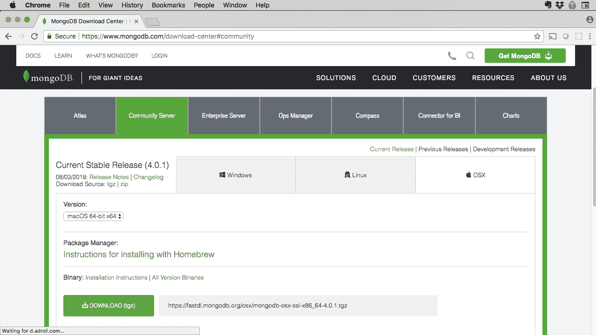

# 在 Node.js 应用中使用 MongoDB

> 原文：[`developer.ibm.com/zh/tutorials/learn-nodejs-mongodb/`](https://developer.ibm.com/zh/tutorials/learn-nodejs-mongodb/)

在本 Node.js 学习路径中，到目前为止，我们已使用关系数据库 SQLite3 作为示例应用程序的数据存储。在本单元中，我们将应用程序转换为使用 MongoDB（这是用于 Node.js 应用程序的最受欢迎的非关系数据库之一）。

*非关系*是指一种可替代关系数据库的数据库类型。下面介绍了[三种类型的非关系数据库](https://en.wikipedia.org/wiki/NoSQL)：

*   [键/值存储](https://en.wikipedia.org/wiki/Key-value_database)：常用示例包括 [Apache Cassandra](https://cassandra.apache.org) 和 [Redis](https://redis.io)。
*   [面向文档](https://en.wikipedia.org/wiki/Document-oriented_database)：常见示例包括 [MongoDB](https://www.mongodb.com) 和 [Cloudant](https://cloud.ibm.com/catalog/services/cloudant?cm_sp=ibmdev-_-developer-tutorials-_-cloudreg)。
*   [图形数据库](https://en.wikipedia.org/wiki/Graph_database)：常见示例为 [Apache Giraph](https://giraph.apache.org)。

##### Databases for MongoDB

试用 IBM Cloud 上提供的 [MongoDB 数据库服务](https://cloud.ibm.com/catalog/services/databases-for-mongodb?cm_sp=ibmdev-_-developer-tutorials-_-cloudreg)。

MongoDB 是一种面向文档的数据库，它使用二进制 JSON 格式（称为 *BSON*）来存储数据。与其他非关系数据库一样，MongoDB 因为对大数据的渴求而流行起来。

在本单元中，您会将 MongoDB 设置为“购物清单”应用程序的数据库，然后使用 MongoDB 执行一系列常见的数据库操作。您将了解通过 SQLite 3 和 MongoDB 执行这些操作有何差别。您还能快速了解 Mongoose，这是一个经常与 MongoDB 一起使用的 Node 包。

完成本单元后，您将准备好从该示例应用程序出发，进一步了解 MongoDB 和 Mongoose。

##### Node.js 学习路径

本教程已纳入 Node.js 学习路径。各单元之间相辅相成，查看 Node.js 学习路径概述，以便从头开始学习。

## 获取代码

您在此学习路径中跟随其中示例一起进行操作所需的代码可在我的 GitHub 存储库中找到。

[获取代码](https://github.com/jstevenperry/IBM-Developer/tree/master/Node.js/Course)

## 关于本教程

在本单元中，我将第 6 单元和第 11 单元中的“购物清单”应用程序转换为使用 MongoDB。此代码位于[本课程的 GitHub 存储库](https://github.com/jstevenperry/IBM-Developer)的 `Node.js/Course/Unit-12` 目录中。

我建议先阅读本资料，并将代码示例提取到您的编辑器中。在大致了解后，即可设置 MongoDB。 如果计划在本地使用 MongoDB（如同我在本单元中的做法），那么您可能需要安装 MongoDB。如果已经远程安装了 MongoDB，那么只需将 `./config/app-settings.js` 中的 `appSettings.mongodb_url` 属性更改为指向远程服务器。

然后，从终端窗口或命令提示符中启动该应用程序：

1.  打开一个终端窗口，浏览至本课程的 GitHub 存储库中的 `Unit-12` 目录。
2.  运行 `npm install` 以通过 npm 注册表安装必需的包。
3.  如果要在本地运行 MongoDB，请在其专属的终端窗口中启动 MongoDB 守护程序：`npm run start-mongod`。
4.  打开另一个终端窗口，浏览至 `Unit-12` 目录，然后向 MongoDB 加载数据：`npm run load-db`（需要几分钟时间来运行该过程）。
5.  启动该应用程序：`npm start`。
6.  让浏览器指向 `http://localhost:3000`，并使用该应用程序。

现在，您可以开始使用本单元中的资料，方法是使用源代码并运行应用程序作为参考。在使用应用程序的过程中，查看能否将 UI 中的屏幕与使用中的模块、页面和其他源工件对应起来，以便了解其工作方式。

### 适用于 Node 的 MongoDB 文档

起初，Node 用户可能觉得 [MongoDB 的文档](https://docs.mongodb.com/manual/tutorial/getting-started/)不好理解。任何特定 API 函数的 API 参考文档都是介绍在 MongoDB Shell 中使用该 API 函数的方式，*而非在 Node 应用程序中使用该 API 函数的方式。*

虽然阅读 MongoDB 文档可了解所有概念，但查看 [MongoDB Node Driver 文档](https://mongodb.github.io/node-mongodb-native/3.1/)可了解特定于 API 的信息。

另外注意，几乎每个 API 函数都接受一个参数，该参数允许您在异步方法完成或函数返回一个 Promise 时指定一个回调。如果您认为正在阅读的是 Node API 文档，而其中没有提及回调或返回的 Promise，那么您阅读的文档不对！

在搜索 Web 时尤其是这样：您找到的许多“解决方案”适用于 MongoDB Shell，但不适用于 Node 代码。您需要添加回调或添加一个 `then()`（用于处理 Promise），从而使这些解决方案适用于 Node。

## 设置 MongoDB

在本单元中，我建议使用未受保护的本地安装，因为这种简便的方法可以帮助您轻松掌握 MongoDB。

可使用多种方式在您的计算机上安装 MongoDB。转至 [MongoDB 社区下载页面](https://www.mongodb.com/download-center#community)，您将看到一个类似图 1 的屏幕。

*图 1\. MongoDB 社区下载页面的截屏*



选择与您的平台对应的选项卡，然后遵循以下相应的指示信息。

### MacOS

对于 MacOS，您有两种选择：

*   使用 tarball（其名称类似于 `mongodb-osx-ssl-x86_64-4.0.1.tgz`）
*   使用 Homebrew（推荐）

如果选择 tarball 路由，请单击 **DOWNLOAD (tgz)** 按钮以开始下载。

如果选择使用 Homebrew（推荐），请进入一个终端窗口，输入 `brew install mongodb`，然后坐等安装完成。如果需要安装 Homebrew，请单击[此处](https://brew.sh)以获取安装指示信息。

您必须完成一些附加步骤，以便正确设置 MongoDB 安装。请参阅 [MongoDB MacOS 安装教程](https://docs.mongodb.com/manual/tutorial/install-mongodb-on-os-x/)以获取这些指示信息。

### Windows

选择 Windows 选项卡，然后单击 **DOWNLOAD (msi)** 以开始下载。

您必须完成一些附加步骤，以便正确设置 MongoDB 安装。参阅 [MongoDB Windows 安装教程](https://docs.mongodb.com/manual/tutorial/install-mongodb-on-windows/)以获取这些指示信息。

### Linux

选择 Linux 选项卡，然后单击 **DOWNLOAD (tgz)** 按钮以开始下载。

您必须完成一些附加步骤，以便正确设置 MongoDB 安装。参阅 [MongoDB Linux 安装教程](https://docs.mongodb.com/manual/administration/install-on-linux/)以获取这些指示信息。

## “购物清单”应用程序

我已将“购物清单”示例应用程序转换为使用 MongoDB，我们将一起来查看这些更改。这实现起来非常简单，您将在应用程序的数据访问对象 (DAO) 实施中找到大多数更改。

*   `lists-dao-mongodb.js` 是适用于 `lists` 集合的 MongoDB 特定的 DAO 实施。
*   `items-dao-mongodb.js` 是适用于 `items` 集合的 MongoDB 特定的 DAO 实施。

在后续章节中，我们将回顾这两个模块中所做的更改。在这之前，我们来花点时间了解从关系范例到面向文档的范例的转变。

### 表与集合

使用 SQL 数据库时的持久性原子单元是*行*。在面向文档的数据库 MongoDB 中，此概念对应于*文档*。 大多数开发者都习惯将应用程序中的持久性原子视为*记录*，因此从行到文档的映射并不是一件容易的事。

如果使用表的话，很多时候会产生不确定性。在 SQL 数据库中，记录将作为数据行存储在表中，而表之间相互关联。在面向文档的存储系统（如 MongoDB）中，这些记录变成*集合*中的文档。尽管集合可以相互关联，但集合比表更独立，并且通常包含嵌入的文档。

您在“购物清单”应用程序中发现的第一个变化可能是*命名*：

*   `item` 表变为 `items` 集合。
*   `brand` 表变为 `brands` 集合。
*   `shopping_list` 表变为 `shoppingLists` 集合。

另外注意，`shopping_list` 及其 `item` 之间不再需要*连接表*。MongoDB 的每个 `shoppingLists` 文档均包含购物清单 `items` 及其文档 ID（当然，引用的是 `items` 的 `ObjectID`，而不是项的副本）的数组。

大体上就是这样。现在，我们来看一些代码。

## 连接到 MongoDB

必须先运行 MongoDB 守护程序（名为 `mongod`），然后才能与之连接。

一旦运行了 MongoDB，就可以很轻松地进行连接。首先，调用 `mongodb.MongoClient.connect()`，并将 URL 传递给 MongoDB 实例。这为异步调用。如果函数调用成功，那么会将一个引用传递给 MongoClient，以供您用于检索要使用的数据库的引用。与大多数数据库管理系统一样，MongoDB 支持同时运行多个数据库。

用于连接到 MongoDB 的代码几乎是样板文件，因此我在 `./utils/utils.js` 中编写了一次该代码。需要此代码的任何数据访问对象 (DAO) 都会调用一个方法，该方法将返回一个 Promise。解析后，该 Promise 将返回一个数据库引用。

清单 1 显示用于连接到 MongoDB 的 `dbConnect()` 函数。

**清单 1\. 来自 `./utils/utils.js` 的 `dbConnect()`**

```
const mongodb = require('mongodb');
.
.
let mongodbClient;
let db;
.
.
function dbConnect() {
    return new Promise((resolve, reject) => {
        if (db) {
            resolve(db);
        } else {
            mongodb.MongoClient.connect(appSettings.mongodb_url, function(err, client) {
                if (err) {
                    logger.error('Error connecting to the MongoDB URL: ' + appSettings.mongodb_url);
                    reject(err);
                }
                mongodbClient = client;
                db = mongodbClient.db(appSettings.mongodb_db_name);
                // Make sure connection closes when Node exits
                process.on('exit', (code) => {
                    dbClose();
                })
                resolve(db);
            });
        }
    });
} 
```

建立连接后，返回给调用者的 Promise 将通过数据库引用进行解析。

另外注意：

*   `dbConnect()` 函数会存储对 `MongoClient` 对象的引用，因此稍后可用于关闭任何打开的数据库连接。
*   已安装 `process.on('exit')` 处理程序，以便在 Node 进程退出时关闭 MongoDB 连接。

要关闭数据库连接，请调用 `utils.dbClose()`，如清单 2 所示。

**清单 2\. 来自 `./utils/utils.js` 的 `dbClose()`**

```
function dbClose() {
    if (mongodbClient && mongodbClient.isConnected()) {
        mongodbClient.close();
    }
} 
```

两个 MongoDB DAO 实施均使用了*可立即调用的函数表达式* [IIFE](https://developer.mozilla.org/en-US/docs/Glossary/IIFE)。这些函数会在加载时初始化与 MongoDB 的连接，从而避免了每个请求的连接和断开连接延迟（请参阅：[MongoDB 建议](https://mongodb.github.io/node-mongodb-native/driver-articles/mongoclient.html#mongoclient-connection-pooling)）。

在清单 3 中，加载模块后会立即使用 IIFE 来连接到 MongoDB。

**清单 3\. 来自 `lists-dao-mongodb.js` 的 IIFE**

```
// MongoDB reference
let db;

// Get a DB connection when this module is loaded
(function getDbConnection() {
    utils.dbConnect().then((database) => {
        db = database;
    }).catch((err) => {
        logger.error('Error while initializing DB: ' + err.message, 'lists-dao-mongogb.getDbConnection()');
    });
})(); 
```

已存储数据库引用，以便 `lists-dao-mongodb` 中的其他方法能够轻松使用。

## 查询 MongoDB 集合

在 MongoDB 中，记录称为“文档”。文档存储在集合中，这与 SQL 表类似。

可使用几种方法从集合中选择数据。

第一种也是最简单的一种方法是选择集合中的所有文档。要执行此操作，请获取对要从中选择数据的集合的引用，然后对 [`find()`](https://mongodb.github.io/node-mongodb-native/3.1/api/Collection.html#find) 函数使用一个空的*查询*对象，用于告知 MongoDB 选择哪些内容。

清单 4 显示来自 `lists-dao-mongodb` 模块的 `fetchAll()` 函数。

**清单 4\. `fetchAll()` 函数将选择数据库中的所有购物清单文档**

```
 01 function fetchAll() {
 02     return new Promise((resolve, reject) => {
 03         let lists = db.collection('shoppingLists');
 04         lists.find({}).toArray((err, documents) => {
 05             if (err) {
 06                 logger.error('Error occurred: ' + err.message, 'fetchAll()');
 07                 reject(err);
 08             } else {
 09                 logger.debug('Raw data: ' + JSON.stringify(documents), 'fetchAll()');
 10                 resolve({ data: JSON.stringify(documents), statusCode: (documents.length > 0) ? 200 : 404 });
 11             }
 12         });
 13     });
 14 } 
```

注意，首先获取对 `shoppingLists` 集合的引用（第 3 行），然后对该引用调用 `find()` 函数（第 4 行）。

传递给 `find()` 的 `query` 参数是一个空的 JSON 对象 (`{}`)，用于告知 MongoDB“选择全部内容”（即“不过滤任何内容”）。MongoDB 返回一个 [`Cursor`](https://mongodb.github.io/node-mongodb-native/3.1/api/Cursor.html)。对 `Cursor` 调用 `toArray()` 会将其转换为数组。如果该操作成功，那么生成的 `documents` 引用（第 4 行中回调的第二个参数）将包含数据库中所有购物清单的 JSON 对象。

##### 有关 Cursor 的更多信息

MongoDB 的 `Cursor` 具有流畅的界面，并且是一个非常通用的对象，可用于转换 MongoDB 操作结果。一定要查看 [MongoDB Node Driver 文档](https://mongodb.github.io/node-mongodb-native/3.1/api/Cursor.html)，以了解有关 `Cursor` 对象的更多信息。

其余的代码看起来与第 6 单元和第 11 单元中的代码类似：JSON 文档将进行*字符串化*（使用 `stringify()`），并且连同反映查询结果的状态码一起返回给调用者。

### MongoDB 的 `find()`（带有 `query`）

选择所有文档很简单，但如果要应用某种过滤器，该怎么办呢？假设您在查找其 `itemDescription` 属性中包含特定词集的所有 `Items`。清单 5 显示如何再次使用 `find()` 函数进行搜索，但这一次使用了 `query`。

**清单 5\. 来自 `items-dao-mongodb` 模块的 `findByDescription()` 函数**

```
 01 function findByDescription(partialDescription) {
 02     return new Promise((resolve, reject) => {
 03         let items = db.collection('items');
 04         let search = `.*${partialDescription}.*`;
 05         items.find({ itemDescription: { $regex: search, $options: 'i' } }).toArray((err, documents) => {
 06             if (err) {
 07                 reject(err);
 08             } else {
 09                 resolve({ data: JSON.stringify(documents), statusCode: (documents.length > 0) ? 200 : 404 });
 10             }
 11         });
 12     });
 13 } 
```

在此示例中，首先获取对集合的引用（第 3 行），然后调用 `find()` 函数（第 5 行）并传递查询，如下所示：

```
{ itemDescription: { $regex: search, $options: 'i' } } 
```

该查询是一个 JSON 对象，表示“使用不区分大小写的正则表达式将 `itemDescription` 属性与搜索字符串 `.*${partialDescription}.*` 进行匹配”。

假设未出现任何错误，包含与查询匹配的文档的 `Cursor` 将转换为数组。然后，会将*字符串化*的 JSON 对象返回给调用者。

### `findOne()` 函数

如果要通过查询查找单个文档，那么可使用 MongoDB 的 `findOne()` 函数，如清单 6 所示。

**清单 6\. `Items-dao-mongodb` 模块中的 `findById()` 函数**

```
function findById(id) {
    return new Promise((resolve, reject) => {
        let items = db.collection('items');
        items.findOne({ _id: new mongodb.ObjectID(id) }).then((document) => {
            if (document) {
                resolve({ data: JSON.stringify(document), statusCode: 200});
            } else {
                let message = 'No document matching id: ' + id + ' could be found!';
                logger.error(message, 'findById()');
                reject(message);
            }
        }).catch((err) => {
            logger.error('Error occurred: ' + err.message, 'findById()');
            reject(err);
        });
    });
} 
```

清单 6 中使用的 `findOne()` 函数将返回一个 Promise。解析后，该 Promise 将返回零个或一个匹配文档。在此例中，如果未找到任何匹配项，那么将拒绝 `findById()` 返回的 Promise。如果该调用成功并且找到了文档，那么该文档将进行字符串化，并连同 HTTP 状态码 200 一起返回给调用者。

## 在 MongoDB 中执行创建和更新操作

“购物清单”应用程序提供了用于创建和更新购物清单及购物清单项的函数，因此，转换到 MongoDB 后也必须提供所有这些功能。在后续章节中，我们将了解 MongoDB 如何执行“购物清单”应用程序中的关键数据库操作。

### 创建新的集合元素

“购物清单”应用程序可以创建新的购物清单。 在 MongoDB 中，`lists-dao-mongodb` 模块中的 `create()` 函数将提供此功能。在清单 7 中，将使用 `create()` 在 `shoppingLists` 集合中创建新元素。

**清单 7\. `lists-dao-mongodb` 模块中的 `create()` 函数**

```
 01 function create(description) {
  02     return new Promise((resolve, reject) => {
  03         let lists = db.collection('shoppingLists');
  04         let listId = mongodb.ObjectId();
  05         let whenCreated = Date.now();
  06         let item = {
  07             _id: listId,
  08             id: listId,
  09             description: description,
  10             whenCreated: whenCreated,
  11             whenUpdated: null
  12         };
  13         lists.insertOne(item, (err, result) => {
  14             if (err) {
  15                 logger.error('Error occurred: ' + err.message, 'create()');
  16                 reject(err);
  17             } else {
  18                 resolve({ data: { createdId: result.insertedId }, statusCode: 201 });
  19             }
  20         });
  21     });
  22 } 
```

获取对 `shoppingLists` 集合的引用（第 3 行）并创建新的 MongoDB `ObjectId`（第 4 行）后，将创建用于表示新购物清单文档的 JSON 对象（第 6-12 行）。然后，对集合调用 `insertOne()` 函数以插入单条记录（第 13 行）。如果成功，那么将解析 Promise 并将数据返回给调用者（第 18 行）。

##### 设置 _id 属性

假设您想知道 `_id` 和 `id`：如果在要插入的文档上未提供 `_id` 属性，那么 MongoDB 将为您创建一个此类属性。为了向后兼容，我希望所提供的 `id` 属性与 `_id` 具有相同的值。在此例中，不能让 MongoDB 自动生成 ID，因为生成的 ID 各不相同，达不到我的要求。我同时提供了这两个属性，并将其设置为相同的值（第 4 行）。

### MongoDB 的 `$lookup`（如同一个连接）

有时，您需要从一个集合中引用另一个集合。

在第 11 单元中，“购物清单”应用程序使用 `shopping_list_item` 表来简化 `shopping_list` 与 `item` 之间的关系。

在此处所示的转换后的应用程序中，`shoppingLists` 集合中的文档包含数组中属于该文档的 `items`。

下面是包含两个项（位于包含所含项的 `ObjectId` 的 `items` 数组中）的原始购物清单文档：

```
{
  "_id": "5b69be197f7eac7bb476b41d",
  "id": "5b69be197f7eac7bb476b41d",
  "description": "My Shopping List",
  "whenCreated": 1533656601372,
  "whenUpdated": null,
  "items": [
    "5b68c8201131e61640f07f5a",
    "5b68c8291131e61640f0831f"
  ]
} 
```

为了将此文档与用于存储 `items` 的 `items` 集合相连接，MongoDB 提供了一个名为 [`aggregate()`](https://mongodb.github.io/node-mongodb-native/3.1/api/Collection.html#aggregate) 的集合函数。此函数允许您创建一个[*聚合管道*](https://docs.mongodb.com/manual/core/aggregation-pipeline/)，用于处理各*阶段*中的数据。在每个阶段，都会进一步转换文档。

“购物清单”应用程序使用 `findByIdWithAllItems()` 函数来执行此连接，并解析购物清单文档中的 `ObjectId` 以检索所引用的 `items` 的详细数据。

**清单 8\. `findByIdWithAllItems()` 函数**

```
 01 function findByIdWithAllItems(id) {
 02     return new Promise((resolve, reject) => {
 03         let lists = db.collection('shoppingLists');
 04         lists.aggregate([
 05             { $unwind: '$items' },
 06             { $match: { _id: new mongodb.ObjectID(id) } },
 07             { $lookup: { from: 'items', localField: 'items', foreignField: '_id', as: 'items'} }
 08         ], (err, cursor) => {
 09             if (err) {
 10                 logger.error('Error occurred: ' + err.message, 'findById()');
 11                 reject(err);
 12             } else {
 13                 cursor.toArray((err, results) => {
 14                     if (err) {
 15                         reject(err);
 16                     } else {
 17                         logger.debug('Raw response: ' + JSON.stringify(results), 'findByIdWithAllItems()');
 18                         resolve({ data: JSON.stringify(results), statusCode: (results) ? 200 : 404  });
 19                     }
 20                 });
 21             }
 22         });
 23     });
 24 } 
```

`aggregate()` 调用（第 4 行）将接受两个参数：

*   [聚合管道阶段](https://docs.mongodb.com/manual/reference/operator/aggregation-pipeline/#alphabetical-listing-of-stages)的数组（第 5-7 行）。
*   向其传递 `Cursor` 的回调函数（第 8 行），可用于处理数据。

管道阶段如下所示：

*   首先，[`$unwind`](https://docs.mongodb.com/manual/reference/operator/aggregation/unwind/#pipe._S_unwind) 阶段用于将 `items` 数组中的每个元素与数组所属的购物清单文档的属性进行配对（实际上是对数据进行去标准化）。
*   然后，[`$match`](https://docs.mongodb.com/manual/reference/operator/aggregation/match/#pipe._S_match) 阶段过滤 `shoppingList` 集合中的文档，以仅保留其 `ObjectId` 与传递给 `findByIdWithAllItems()` 函数的 `id`（即购物清单的 `ObjectId`）相匹配的文档。
*   最后，[$lookup](https://docs.mongodb.com/manual/reference/operator/aggregation/lookup/#pipe._S_lookup) 阶段将 `items` 集合（由 `from` 属性指定）与 `_id` (`foreignField`) 字段上 `items` 数组 (`localField`) 中的每个元素相连接。

将 `Cursor` 转换为数组后，生成的结果是一个解构数组，如下所示：

```
[
  {
    "_id": "5b69be197f7eac7bb476b41d",
    "id": "5b69be197f7eac7bb476b41d",
    "description": "My Shopping List",
    "whenCreated": 1533656601372,
    "whenUpdated": null,
    "items": [
      {
        "_id": "5b68c8201131e61640f07f5a",
        "id": "5b68c8201131e61640f07f5a",
        "upc": "084253240499",
        "itemDescription": "Imagine Broth Free Range Chicken Organic",
        "brandId": "5b68c7e01131e61640f04e41"
      }
    ]
  },
  {
    "_id": "5b69be197f7eac7bb476b41d",
    "id": "5b69be197f7eac7bb476b41d",
    "description": "My Shopping List",
    "whenCreated": 1533656601372,
    "whenUpdated": null,
    "items": [
      {
        "_id": "5b68c8291131e61640f0831f",
        "id": "5b68c8291131e61640f0831f",
        "upc": "858328204491",
        "itemDescription": "Wolfgang Puck Organic Free Range Chicken Soup",
        "brandId": "5b68c7e01131e61640f05476"
      }
    ]
  }
] 
```

现在，调用者具有 `items` 数组，其中每一项都具有 `description`、`upc` 等，并且可在 UI 中显示。

### 更新集合元素

“购物清单”应用程序可以编辑购物清单，因此系统必须能够更新购物清单文档。MongoDB 的 `update()` 函数（位于 `lists-dao-mongodb` 模块中）恰好可以执行这一操作。

**清单 9\. `lists-dao-mongodb` 模块中的 `update()` 函数**

```
01 function update(id, description) {
02     return new Promise((resolve, reject) => {
03         let lists = db.collection('shoppingLists');
04         lists.updateOne({ _id: new mongodb.ObjectID(id) },
05             { $set: { description: description, whenModified: Date.now() } },
06             (err, result) => {
07                 if (err) {
08                     logger.error('Error occurred: ' + err.message, 'update()');
09                     reject(err);
10                 } else {
11                     resolve({ data: { rowsAffected: result.modifiedCount }, statusCode: 200 });
12                 }
13             }
14         );
15     });
16 } 
```

此方法使用 `updateOne()` 函数（第 4 行），该函数将接受 3 个参数：

1.  一个*过滤器*，用于确定要更新的文档。在此例中为其 `_id` 与 `update()` 的 `id` 参数相匹配的文档。
2.  要应用的[更新运算符](https://docs.mongodb.com/manual/reference/operator/update/)（第 5 行）。在此例中为用于告知 MongoDB 要更新哪些字段的 `$set` 运算符，其用途类似于 SQL `UPDATE` 语句中的 `SET`。
3.  用于处理结果的回调函数（第 6 行）。

如果出现错误，那么将记录 `err` 对象并拒绝该 Promise。

如果更新成功，那么 `result` 为 [`updateWriteOpResult`](https://mongodb.github.io/node-mongodb-native/3.1/api/Collection.html#~updateWriteOpResult) 对象，其 `modifiedCount` 属性包含已更新的记录数。（请注意，为确保购物清单架构的控制器层的向后兼容性，此对象将作为 `rowsAffected` 属性返回。）

### 其他操作

DAO 模块还会执行更多操作，这些就留给你们自己去学习和研究。例如 `lists-dao-mongodb.js` 中的 `addItem()` 函数。

**清单 10\. `lists-dao-mongodb` 模块中的 `addItem()` 函数**

```
function addItem(listId, itemId) {
    return new Promise((resolve, reject) => {
        let lists = db.collection('shoppingLists');
        lists.updateOne({ _id: new mongodb.ObjectID(listId) },
            { $push: { items: new mongodb.ObjectID(itemId) }},
            (err, document) => {
                if (err) {
                    logger.error('Error occurred: ' + err.message, 'findById()');
                    reject(err);
                } else {
                    resolve({ data: JSON.stringify(document), statusCode: (document) ? 200 : 404 });
                }
            }
        );
    });
} 
```

此函数使用 [`$push`](https://docs.mongodb.com/manual/reference/operator/update/push/#up._S_push) 来更新数组运算符，以便将 `item` 的 `itemId`（其 `ObjectId`）添加到由 `listId` 指定的购物清单文档中的 `items` 数组。

建议大家学习并熟悉源代码。花时间学习这些操作将非常有必要！

## Mongoose

结束本单元之前，我想快速介绍一下 [Mongoose](https://mongoosejs.com/)，这是一个经常与 MongoDB 一起使用的 Node 包。

Mongoose 是一个对象数据建模 (ODM) 库，它在核心 MongoDB API 之上提供了一个抽象层。简单地说，Mongoose 让您从对象（而非文档）的角度来思考问题，从而简化了 MongoDB 的使用。

如果您之前查看过示例应用程序的 `models` 目录，您可能已经注意到，有几个文件的位置似乎不对：

*   `brand-schema.js` 是 `brand` 文档的 Mongoose 模式定义。
*   `item-schema.js` 是 `item` 文档的 Mongoose 模式定义。
*   `items-dao-mongoose.js` 是用于处理 `items` 集合的特定于 Mongoose 的 DAO 实现。

Mongoose 模式定义（特别是像这些简单的模式定义）非常便于阅读。考虑 `brand` 模式定义：

**清单 11\. `brand` Mongoose 模式定义**

```
const mongoose = require('mongoose');

let Schema = mongoose.Schema;

let brandSchema = new Schema({
    _id: { type: ObjectId, required: true },
    id: { type: ObjectId, required: true },
    description: { type: String, required: true },
    manufacturer: { type: String, required: false },
    address: { type: String, required: false },
    website: { type: String, required: false }
});

module.exports = mongoose.model('Brand', brandSchema); 
```

下面是 `item` 模式：

**清单 12\. `item` Mongoose 模式定义**

```
const mongoose = require('mongoose');

let Schema = mongoose.Schema;

let itemSchema = new Schema({
    _id: { type: Schema.ObjectId, required: true },
    id: { type: Schema.ObjectId, required: true },
    itemDescription: { type: String, required: true },
    upc: { type: String, required: true },
    brandId: { type: Schema.ObjectId, ref: 'Brand', required: true }
});

module.exports = mongoose.model('Item', itemSchema); 
```

如果您有兴趣了解有关 Mongoose 模式定义的更多信息，可参阅[模式文档](https://mongoosejs.com/docs/guide.html)。

我还为 `item-dao` 接口创建了特定于 Mongoose 的 DAO 实现，您可在 `item-dao.js` 中通过一行代码将该接口插入到应用程序中。（我将此步骤留作练习，供你们自行完成。）

如果您对 Mongoose 的内容感兴趣，并想要深入研究，那么可以构建我所提供的 `item` 示例，并将本机 MongoDB `lists` DAO 实现替换为 Mongoose 实现。

无论如何，请一定要查看 Mongoose。它可以让您更轻松地使用 MongoDB。

## 结术语

本单元提供了：

*   对 MongoDB 的简要介绍。
*   针对您的平台本地安装 MongoDB 的指示信息。
*   对“购物清单”应用程序中的 MongoDB 操作的快速介绍。
*   对 Mongoose 的简要介绍（包括代码示例，鼓励您进一步探索）。

请一定要在本单元中使用“购物清单”应用程序，并观看下面的视频以了解 MongoDB API 的更多实际运用。我已经介绍了 MongoDB 的一些关键操作，但还有很多东西需要学习。

## 视频

在下面的视频中，我将展示如何使用 MongoDB 以及如何将“购物清单”应用程序修改为使用 MongoDB。

[https://cdnapisec.kaltura.com/p/1773841/sp/177384100/embedIframeJs/uiconf_id/39954662/partner_id/1773841?iframeembed=true&playerId=kplayer&entry_id=0_yyp8cesi&flashvars[streamerType]=auto](https://cdnapisec.kaltura.com/p/1773841/sp/177384100/embedIframeJs/uiconf_id/39954662/partner_id/1773841?iframeembed=true&playerId=kplayer&entry_id=0_yyp8cesi&flashvars[streamerType]=auto)

本文翻译自：[Use MongoDB with Node.js](https://developer.ibm.com/tutorials/learn-nodejs-mongodb/)（2019-02-01）