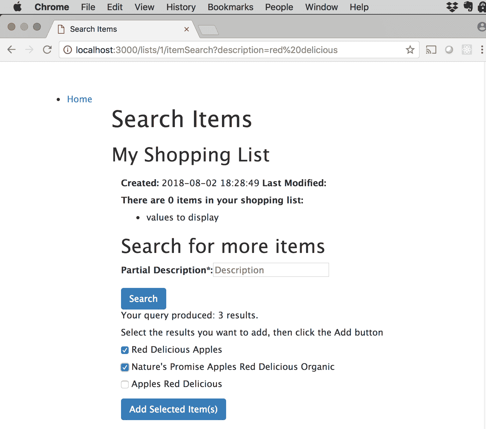

# 在 Node.js 应用程序中使用 ExpressJS

> 原文：[`developer.ibm.com/zh/tutorials/learn-nodejs-expressjs/`](https://developer.ibm.com/zh/tutorials/learn-nodejs-expressjs/)

在 Node.js 学习路径的第 11 部分中，我将向您介绍 ExpressJS。本课程至少需要介绍一个 Web 框架才算完整，我之所以选择 ExpressJS，是因为它是 Node 生态系统中最受欢迎的 Web 框架之一，也是 [Loopback](https://loopback.io/) 和 [krakenjs](http://krakenjs.com) 等其他框架的基础。

##### 初学者工具包：Node.js Web App with Express.js

[本工具包](https://cloud.ibm.com/developer/appservice/create-app?starterKit=ab2263e9-c787-32e6-a9d7-298c20557bbb&cm_sp=ibmdev-_-developer-tutorials-_-cloudreg)使用 Express.js 框架，基于 Node.js 提供一个基本的 Web 服务应用。

Express 设计极简，速度很快，很多贡献都是以它为基础而构建的。作为专业的 Node 开发者，您很可能会用到此框架，所以您应该熟悉它。

## Express 内部

Express 应用程序至少包含以下模块：

*   **中间件**：用于处理 HTTP 请求和响应对象的代码。
*   **路由**：将 URL 路径匹配到函数以进行处理。
*   **视图处理**：基于页面模板和请求数据呈现 HTML 页面。
*   **数据验证和清理**：将请求数据与验证规则进行比较，并确保数据不包含开发性数据。

本教程将向您介绍上述模块。如果您需要更多功能，相关贡献可以扩展该最小核心。

##### Node.js 学习路径

本教程已纳入 Node.js 学习路径。各单元之间相辅相成，查看 Node.js 学习路径概述，以便从头开始学习。

## 关于本教程

我已将第 6 单元中的“购物清单”应用程序转换为使用 Express，并添加了一个 GUI，以便您可以使用浏览器与其进行交互。您将在本课程的 [GitHub 存储库](https://github.com/jstevenperry/IBM-Developer)中找到代码。

我建议您先通读材料，在编辑器中打开代码示例。有了大致了解之后，从终端窗口或命令提示符启动应用程序示例：

1.  导航至 GitHub 存储库本地副本中的 `Unit-11` 目录。
2.  运行 `npm install`，从 npm 注册表安装必要的包。
3.  将数据载入 SQLite3 数据库：`npm run load-db`。
4.  启动应用程序：`npm start`。
5.  在浏览地的地址栏中输入 `http://localhost:3000`。

现在，您可以使用源代码，并以正在运行的应用程序作为参考，开始研究这些材料。在使用应用程序时，查看是否可以将 UI 中的屏幕与模块、页面和其他源工件相匹配，以便了解它们的工作方式。

## “购物清单”应用程序

在本单元中，您将使用来自第 6 单元的“购物清单”应用程序的增强版本。在转换应用程序的前一个版本时，我首先运行 `express-generator` 来创建基本项目结构，然后在此基础上创建新的目录。 清单 1 展示了最终的目录结构。

**清单 1\. 购物清单项目的目录结构**

```
Ix:~/src/projects/IBM-Developer/Node.js/Course/Unit-11 sperry$ tree -d .
.
├── bin
├── config
├── controllers
├── models
├── node_modules
├── public
│   ├── images
│   ├── javascripts
│   └── stylesheets
├── routes
├── scripts
├── test
├── utils
└── views

14 directories 
```

我建议您花一些时间浏览目录，熟悉一下代码。这样做可以帮助您更轻松地完成余下的课程。

在后续各节中，我们将探究 Express 应用程序的核心模块。

## 模块 1：Express 中间件

Express *中间件（middleware）*函数位于 HTTP 服务器和应用程序的业务逻辑之间，可以访问 HTTP 请求和响应对象以进行处理。中间件函数通过 [`use()`](https://expressjs.com/en/4x/api.html#app.use) 函数来安装。

Express 应用程序使用中间件来执行许多与 Web 请求处理相关的函数。通常，一个中间件函数完成一个任务，然后将请求发送给下一个中间件函数进行进一步处理。

Express 核心提供了一些中间件函数，比如用于解析请求主体或处理静态资源。 其他中间件函数通过贡献提供，比如用于 [cookie 解析](https://www.npmjs.com/package/cookie-parser)和 [HTTP 错误处理](https://www.npmjs.com/package/http-errors)。另外，还有用于[路径处理](https://nodejs.org/docs/latest/api/path.html)等的 Node API 包。

我将在下一节中介绍一些中间件，比如您使用 Express `Router` 为自己提供的路由。

**注意**：这个单元中所有源代码的根目录都是 `Node.js/Course/Unit-11/`。所有文件位置和路径都相对于该目录而言。

### Express 应用程序配置

Express 应用程序的入口点是 `./bin/www.js`，它的主要工作是创建 HTTP 服务器。为创建服务器，`./bin/www.js` 使用主要模块中包含的 Express 配置，称为 `app.js` 或 `server.js`。

`./app.js` 中的配置非常简单。为便于描述，我把它分成了几个部分。

根据配置，Express 服务器首先调用 `app` 模块所需的 `require()` 模块。`require()` 模块包含处理路由的本地模块：

```
// require
const path = require('path');
const express = require('express');
const cookieParser = require('cookie-parser');
const createError = require('http-errors');
// local modules
const indexRouter = require('./routes/index');
const listsRouter = require('./routes/lists');
const restRouter = require('./routes/rest'); 
```

接下来，它会创建 Express 应用程序：

```
// Create Express application
const app = express(); 
```

然后调用 [`app.use()`](https://expressjs.com/en/4x/api.html#app.use) 来安装插入请求中间件函数：

```
// middleware
app.use(express.json());
app.use(express.urlencoded({ extended: false }));
app.use(express.static(path.join(__dirname, 'public')));
app.use(cookieParser()); 
```

这段代码使用了以下中间件：

*   请求主体解析：
    *   请求主体 ([`express.json()`](https://expressjs.com/en/4x/api.html#express.json)) 中的 JSON 对象
    *   请求主体 ([`express.urlencoded()`](https://expressjs.com/en/4x/api.html#express.urlencoded)) 中的 [URL 编码参数](https://stackoverflow.com/questions/14551194/how-are-parameters-sent-in-an-http-post-request)
*   访问图像和级联样式表 (CSS) 等静态资源 ([`express.static()`](https://expressjs.com/en/4x/api.html#express.static))
*   Cookie 解析 ([cookie-parser](https://www.npmjs.com/package/cookie-parser))

Express 服务器通过 `app.use()` 设置路径路由，其参数为 (1) 路径和 (2) 对其进行处理的模块：

```
// Path routing
app.use(indexRouter);
app.use('/lists', listsRouter);
app.use('/rest', restRouter); 
```

**注意**：没有路径参数意味着中间件应用于所有路径 (`/`)。

它通过调用 [`app.set`](https://expressjs.com/en/4x/api.html#app.set) 来配置视图引擎：

```
// View engine
app.set('views', path.join(__dirname, 'views'));
app.set('view engine', 'pug'); 
```

最后，安装错误处理中间件：

```
// Error handling
app.use(function(req, res, next) {
  // catch 404 and forward to error handler
  next(createError(404));
});
app.use(function(err, req, res, next) {
  res.locals.message = err.message;
  res.locals.error = req.app.get('env') === 'development' ? err : {};
  res.status(err.status || 500);
  res.render('error');
});

module.exports = app; 
```

**注意**：错误处理中间件使用 [http-errors](https://www.npmjs.com/package/http-errors) 模块。

清单 2 完整展示了 app 模块。

**清单 2\. app.js 中的 Express 应用程序配置**

```
01 // require
02 const path = require('path');
03 const express = require('express');
04 const cookieParser = require('cookie-parser');
05 const createError = require('http-errors');
06
07 // local modules
08 const indexRouter = require('./routes/index');
09 const listsRouter = require('./routes/lists');
10 const restRouter = require('./routes/rest');
11
12 // Create Express application
13 const app = express();
14
15 // Install Middleware
16 app.use(express.json());
17 app.use(express.urlencoded({ extended: false }));
18 app.use(express.static(path.join(__dirname, 'public')));
19 app.use(cookieParser());
20
21 // Path routing
22 app.use(indexRouter);
23 app.use('/lists', listsRouter);
24 app.use('/rest', restRouter);
25
26 // View engine
27 app.set('views', path.join(__dirname, 'views'));
28 app.set('view engine', 'pug');
29
30 // Error handling
31 app.use(function(req, res, next) {
32   // catch 404 and forward to error handler
33   next(createError(404));
34 });
35 app.use(function(err, req, res, next) {
36   res.locals.message = err.message;
37   res.locals.error = req.app.get('env') === 'development' ? err : {};
38   res.status(err.status || 500);
39   res.render('error');
40 });
41
42 module.exports = app; 
```

### 执行中间件链

`app.use()` 调用的顺序很重要，因为中间件形成了一个“链”，这个链会按照您调用 `app.use()` 的顺序来执行。中间件将处理请求并将其重新路由到其他 URL/ 路径/ 等，或者通过调用 Express `next()` 函数将请求传递给链中的下一个链接。

错误处理代码位于链的底部是有充分理由的：如果一个请求已经到达错误处理中间件，这意味着期间没有其他中间件处理过该请求，或者抛出了异常。此时，错误处理程序将会接收它。

##### 关于中间件的更多信息

Express 文档中有一篇关于[使用中间件](https://expressjs.com/en/guide/using-middleware.html)的文档很不错。如果您想了解有关执行中间件链以及如何编写良性中间件的更多信息，可查看这份文档。

## 模块 2：Express 路由

*   **路由（route）**是 URL 的*路径*部分与应用程序中的端点之间的映射，例如 REST 函数中的页面或业务逻辑。

*   **路由（routing）**是将 `GET` 或 `POST` 等方法指定的 HTTP 请求连同 URL 路径映射到回调函数以处理请求的过程。

第 6 单元介绍了“购物清单”应用程序的路由功能，并且您已经通过练习掌握了该功能。用于将 HTTP 方法/路径组合映射到 REST 服务的路由相当简单，一点也谈不上繁琐。在这一单元中，您将了解到 Express 路由是多么简单。

### 路由

在典型的 Express 应用程序中，路由直接位于项目根目录下的 `./routes` 文件夹中。“购物清单”应用程序在 `routes` 目录中包含三个路由定义模块：

*   `index.js` 定义“默认”路由。
*   `rest.js` 包含“购物清单”应用程序提供的 REST 服务的路由定义。
*   `lists.js` 包含“购物清单”应用程序提供的视图相关路由的路由定义。

我们将从 REST 服务路由入手，如表 1 所概述。

**表 1\. “购物清单”应用程序提供的 REST 服务的路由**

| URL 路径 | HTTP 方法 | 路由处理程序 (rest-controller.js) |
| --- | --- | --- |
| `/rest/lists` | GET | `fetchAll()` |
| `/rest/lists` | POST | `create()` |
| `/rest/lists/:listId` | GET | `read()` |
| `/rest/lists/:listId` | PUT | `update()` |
| `/rest/lists/:listId/items` | POST | `addItems()` |
| `/rest/lists/:listId/items` | GET | `fetchAllItems()` |
| `/rest/lists/:listId/items/:itemId` | PUT | `updateItem()` |
| `/rest/lists/:listId/items/:itemId` | DELETE | `removeItem()` |
| `/rest/items` | GET | `itemSearch()` |

在 Express 中可以轻松编写路由代码。在 `require(express)` 后，您可以调用 `express.Router()` 函数来创建路由器。在路由器上，调用与需要处理的 HTTP 方法相匹配的函数，例如，针对 `GET` 请求调用 `router.get()`，针对 `POST` 调用 `router.post()` 等等。

### 路由委托给控制器函数

路由函数采用以下参数：

1.  **路由路径**是请求 URL 的*路径*部分，可以是字符串模式或正则表达式。
2.  **路由处理程序**是处理路由的控制器函数。

“购物清单”应用程序中每个路径的路由都分两个阶段完成。第一个阶段涉及路径的最顶端。

回想一下清单 2 中，路由的最顶端（即 `/rest`）是在 `app.js` 中指定的：

```
const express = require('express');
.
.
// local modules
.
const restRouter = require('./routes/rest');
.
// Path routing
.
.
app.use('/rest', restRouter);
. 
```

通常，路由器的模块名与它用来路由的路径部分相匹配。在此示例中，`/rest` 是路径，所以 `rest.js` 是模块名。

URL 路径与 `/rest` 匹配的所有路由都被转发到 `rest` 路由器以进一步执行路由。 然后路由器会检查路径的其余部分，以确定其最终目标。

这个示例展示了如何结合使用多个路由器来实现路由模块化。“购物清单”应用程序很简单，路径也没那么复杂，所以一对路由器就很好了。复杂的应用程序通常有更长的 URL 和更复杂的路由，因此，如果能够堆叠路由器，那将会非常方便。

每当 `/rest` 路径匹配时，就会调用 `restRouter`（在 `rest` 模块中）来处理路径其余部分的映射。

### 路由清单

现在，让我们来看看“购物清单”应用程序的 `rest.js` 中的 `/lists` 路由。（须注意，我们在本节查看的是清单*路由*；稍后将学习 `lists.js` 模块。）

**清单 3\. `rest.js` 中 `/lists` 的 REST 服务路由**

```
01 const express = require('express');
02
03 // We have no control over stuff like this, so tell eslint to chill
04 const router = express.Router();//eslint-disable-line new-cap
05
06 // The rest controller that handles the requests
07 const restController = require('../controllers/rest-controller');
08
09 // REST service - fetch all shopping lists
10 router.get('/lists', restController.fetchAll);
11 // REST service - create new shopping list
12 router.post('/lists', restController.create);
13 // REST service - fetch shopping list by ID
14 router.get('/lists/:listId', restController.read);
15 // REST service - update the specified list
16 router.put('/lists/:listId', restController.update);
17 // REST service - add an item to the specified shopping list
18 router.post('/lists/:listId/items', restController.addItem);
19 // REST service - fetch all items for the specified shopping list
20 router.get('/lists/:listId/items', restController.fetchAllItems);
21 // REST service - update the specified item for the specified list
22 router.put('/lists/:listId/items/:itemId', restController.updateItem);
23 // REST service - remove the specified item from the specified list
24 router.delete('/lists/:listId/items/:itemId', restController.removeItem);
25 // REST service - search for items
26 router.get('/items', restController.itemSearch);
27
28 module.exports = router; 
```

须注意，在 `rest` 路由器中，您不必再次映射路径的 `/rest` 部分，而只需指定 `/rest` 之后的路径部分。

### 请求匹配

路由器试图在请求 URL 的路径部分和路由中的路径之间找到一个“贪婪”匹配。它将为每个匹配的路由执行回调函数。

思考以下 URL：

```
http://localhost:3000/rest/lists 
```

##### 关于路由的说明

*路由*是路径和 HTTP 方法的唯一组合。如果两个或多个路由与一个入局请求相匹配，那么将执行所有这些路由。“购物清单”应用程序的路由都是唯一的，但是在另一个应用程序中，您可能需要在不同的控制器中处理相同的路由（例如，为了装饰一个请求）。Express 提供此功能。

这个 URL 的*路径*部分本身是模糊的，与上面的两个 `/rest/lists` 路由都匹配（分别是第 10 行和第 12 行）。Express 会查看请求中指定的 HTTP 方法，以确定哪个路由匹配。

如果指定了 `GET` 方法，那么将调用 `restController.fetchAll()`（第 10 行）。如果指定了 `POST`，那么将调用 `restController.create` 函数（第 12 行）。

在如下请求示例中：

*   HTTP 方法：`POST`
*   URL：`http://localhost:3000/rest/lists`

Express 服务器将匹配以下路由：

```
router.post('/lists', restController.create); 
```

### 控制器函数实现 REST 服务

在典型的 Express 应用程序中，路由直接位于项目根目录下的 `./controllers` 文件夹中。

名为 `rest-controller` 的 `rest` 路由器的控制器模块对每个路由都有一个函数。

所有中间件路由函数都有一个类似以下 `create()` 函数的签名：

```
function create(req, res, next) {
    let requestBody = req.body;

    listsDao.create(requestBody.description).then((result) => {
        utils.writeServerJsonResponse(res, result.data, result.statusCode);
    }).catch((err) => {
        next(err);
    });
} 
```

参数为：

*   `req`：Express [`Request`](https://expressjs.com/en/4x/api.html#req) 对象，表示 HTTP 请求。
*   `res`：Express [`Response`](https://expressjs.com/en/4x/api.html#res) 对象，表示 HTTP 响应。
*   `next`：Express 函数，用于将请求传递到链中的下一个中间件。

让我们来了解一下 `create()` 函数。

首先，我们将请求主体作为 JSON 对象进行检索（由 `express.json()` 中间件支持）。作为 `POST` 请求的一部分，调用程序会发送要在请求主体中创建的购物清单的 `description` 属性。`express.json()` 对其进行解析，并在 `req.body.description` 属性中提供。

接下来，我们调用 `listsDao.create` 并传递新购物清单的 `description`。如果成功，我们会调用 `utils.writeServerJsonResponse()`（第 6 单元中的相同函数）向调用程序发送 JSON 对象响应和状态码 200。

如果发生错误，那么我们只将其传递到链中的下一个中间件。如果我们不通过请求，它将永远不会完成，并最终挂起。

## 模块 3：Express 视图

*视图（view）*是应用程序界面，或者用户打开应用时看到的内容。 到目前为止，“购物清单”应用程序一直是 REST 服务的集合，虽然很有用，但对用户来说并不是很精彩。因此，我创建了一个 GUI（图形用户界面），我们将在本节中对此进行探讨。

Express 具有*可插拔视图模板处理架构*，这意味着它使用模板引擎和模板来呈现视图。用户可以与这些视图交互。

Express 支持若干[模板引擎](https://github.com/expressjs/express/wiki#template-engines)。最流行的部分引擎包括：

*   [Pug](https://github.com/pugjs/pug) （前称为 Jade）
*   [EJS](https://github.com/tj/ejs)
*   [React](https://github.com/reactjs/express-react-views)
*   [Handlebars](https://github.com/ericf/express-handlebars)

默认的模板引擎是 Pug，我们将在本单元中加以讨论。

### 创建模板

Pug 应用程序通常定义一个或多个默认*布局*页面，其他页面将在此基础上扩展。

“购物清单”应用程序的布局页面被称为 `layout.pug`，位于 `views` 目录中：

**清单 4\. “购物清单”应用程序的基本布局模板 (`layout.pug`)**

```
doctype html
html(lang='en')
  head
    title= title
    meta(charset='utf-8')
    meta(name='viewport', content='width=device-width, initial-scale=1')
    link(rel="stylesheet", href='https://maxcdn.bootstrapcdn.com/bootstrap/4.1.3/css/bootstrap.min.css')
    script(src='https://maxcdn.bootstrapcdn.com/bootstrap/4.1.3/js/bootstrap.min.js')
    link(rel='stylesheet', href='/stylesheets/style.css')
  body
    div(class='container-fluid')
      div(class='row')
        div(class='col-sm-2')
          block sidebar
            ul(class='sidebar-nav')
              li
                //- Stateless navigation goes here
                a(href='/lists') Home
        div(class='col-sm-10')
          //- Replace individual page content in the block below
          block content
          //- The page footer
          block foot
            //- Render errors in the footer
            if errors
              p
              h3 You have errors:
              ul
                for error in errors
                  li.list-group-item-danger= error.msg 
```

该模板提供[响应式](https://en.wikipedia.org/wiki/Responsive_web_design) GUI，并且也使用 [Bootstrap](https://getbootstrap.com)！

### 视图路由

“购物清单”应用程序中的每个视图都有一个与之关联的路由，总结如下。

**表 2\. “购物清单”应用程序的视图路由**

| URL 路径 | HTTP 方法 | 路由处理程序 (rest-controller.js) |
| --- | --- | --- |
| `/lists` | GET | `fetchAll()` |
| `/lists/create` | GET | `create()` |
| `/lists/:listId` | GET | `read()` |
| `/lists/:listId/update` | GET | `update()` |
| `/lists/:listId/itemSearch` | GET | `itemSearch()` |
| `/lists` | POST | `createList()` |
| `/lists/:listId` | POST | `updateList()` |
| `/lists/:listId/itemSearch` | POST | `addItemsSearch()` |
| `/lists/:listId/addItems` | POST | `addListItems()` |
| `/lists/:listId/items/delete` | POST | `removeItems()` |

### 路由和控制器函数

路由再次委托给控制器函数。回想一下，路由的最顶端（即 `/lists`）是在 `app.js` 中指定的：

```
const express = require('express');
.
.
// local modules
.
const listsRouter = require('./routes/lists');
.
// Path routing
.
.
app.use('/lists', listsRouter);
. 
```

为了提高代码可读性，您应该给路由器模块起一个与它用于路由的路径部分相匹配的名字。在此示例中，`/lists` 是路径，所以 `lists.js` 是模块名。

所有 URL 路径与 `/lists` 相匹配的路由都将被转发到 `/lists` 路由器。路由器将检查路径的其余部分，以确定每个路由的最终目标。

每当 `/lists` 路径匹配时，就会调用 `listsRouter`（在 `lists` 模块中）来映射路径的其余部分。清单 5 展示了 `lists.js` 中的 `/lists` 路由。

**清单 5\. “购物清单”应用程序视图的路由器中间件 (`lists.js`)**

```
01 const express = require('express');
02
03 // We have no control over stuff like this, so tell eslint to chill
04 /* eslint new-cap: 0 */
05 const router = express.Router();
06
07 const listsController = require('../controllers/lists-controller');
08
09 // Pages
10 // Page to display all shopping lists
11 router.get('/', listsController.fetchAll);
12 // Page to create new shopping list
13 router.get('/create', listsController.create);
14 // Page to fetch shopping list by id
15 router.get('/:listId', listsController.read);
16 // Page to update shopping list
17 router.get('/:listId/update', listsController.update);
18 // Page to search for items
19 router.get('/:listId/itemSearch', listsController.itemSearch);
20
21 // REST Calls
22 // Call REST service to create new shopping list
23 router.post('/', listsController.createList);
24 // Call REST service to update shopping list
25 router.post('/:listId', listsController.updateList);
26 // Call REST service to search for Items
27 router.post('/:listId/itemSearch', listsController.addItemsSearch);
28 // Call REST service to add an Item to a shopping list
29 router.post('/:listId/addItems', listsController.addListItems);
30 // Call REST service to remove items (DELETE does not work for HTML forms)
31 router.post('/:listId/items/delete', listsController.removeItems);
32
33 module.exports = router; 
```

注意，您不必再次映射路径的 `/lists` 部分，而只需要指定 `/lists` 之后的路径部分。

### 请求路由匹配

回想一下，路由器将尝试在请求 URL 的路径部分和路由中的路径之间找到贪婪匹配，并为每个匹配的路由执行回调函数。思考下面这个 URL 示例：

```
http://localhost:3000/lists/create 
```

此 URL 的路径部分将匹配上面的两个 `/lists` 路由（分别为第 11 行和第 13 行），但是控制器函数依赖于请求中指定的 HTTP 方法。如果指定了 `GET` 方法，那么将调用 `listsController.fetchAll()`。如果指定了 `POST`，那么将调用 `listsController.create` 函数。

在如下请求示例中：

*   HTTP 方法：`GET`
*   URL：`http://localhost:3000/create`

Express 服务器将匹配以下路由：

```
router.get('/create', listsController.create); 
```

### 呈现 GUI

当我们使用 REST 服务创建购物清单时，调用程序会准备数据并发送它，然后会创建清单。添加 GUI 时，我们需要两个额外的步骤：

1.  呈现用户用于输入数据的 GUI。
2.  验证数据并将其转发给 REST 服务。

下一节将介绍数据验证。现在，我们来看看页面是如何呈现的。

#### 第 1 步：使用控制器函数呈现页面

名为 `lists-controller` 的 `lists` 路由器的控制器模块对每个路由都有一个函数。以下是 `listsController.create()` 函数。

```
function renderCreatePage(req, res, next) {
    // Render the page to create a new shopping list
    res.render('lists-create', { title: ‘Create Shopping List' });
} 
```

该函数调用 Express `res` 响应对象上的 `render()` 函数。它传递页面模板的名称，以及包含页面数据的 JSON 对象。

**注意**: 在典型的 Express 应用程序中，视图直接位于项目根目录下的 `./views` 文件夹中。

包含页面源的 Pug 模板名为 `lists-create.pug`。如清单 6 所示。

**清单 6\. 用于 Create Shopping List 页面的模板 (`lists-create.pug`)**

```
extends layout

block content
  h1= title

  p Enter required fields and click the Save link to create your new shopping list.

  form(method='POST' action='/lists')
    div.form-group
      label(for='description') Description*:
      input(type='text', placeholder='Description' name='description')
    div.form-group

    button.btn.btn-primary(type='submit') Create 
```

考虑到页面功能，您可能想知道这个模板为何如此精简。注意第 1 行：

```
extends layout 
```

此模板扩展了您在清单 4 中看到的名为 `layout.pug` 的模板。`lists-create.pug` 模板提供了扩展该基本布局的功能。

现在看看 Pug 语法。每个 HTML 标记都有一个模仿它的 [Pug 属性](https://pugjs.org/language/attributes.html) 。页面非常简单：它包含用于页面标题的 `h1`，并在 `p` 段落标记中包含一些指令，后跟一个 `form`，允许用户输入要创建的新购物清单的描述。

以下是 Chrome 中显示的页面：

图 1\. Create Shopping List 页面


当用户输入购物清单描述并单击 **Create** 时，包含描述的表单数据将被发布到 `/lists`（扩展为 `http://localhost：3000/lists`）。回想一下为处理这个 URL 而创建的路由（清单 4，第 24 行）：

```
// Call REST service to create new shopping list
router.post('/', listsController.createList); 
```

#### 第 2 步：控制器函数链上的函数调用

一旦用户输入了清单描述，就可以创建购物清单。创建清单需要一系列函数调用，它们执行以下操作：

*   验证和清理数据。
*   处理任何验证错误。
*   调用 REST 服务来创建购物清单。

我们需要不止一个函数来执行所有这些操作。`createList` 函数实际上是一个*函数链*，即一系列函数调用。

**清单 7\. 用于创建新购物清单的函数链 (`createList`)**

```
01 const createList = [
02     // Validate input(s)
03     body('description', 'Description cannot be empty').isLength({ min: 1 }),
04     // Sanitize fields.
05     sanitizeBody('description').trim().escape(),
06     // Check validation results
07     (req, res, next) => {
08         const errors = validationResult(req);
09         if (!errors.isEmpty()) {
10             let errorsArray = errors.array();
11             logger.debug(`Found ${errorsArray.length} errors with the request`);
12             res.render('lists-create', { title: ‘Create Shopping List', data: ‘', errors: errorsArray });
13         } else {
14             logger.debug('Request is error free.Moving on...', 'createList()');
15             next();
16         }
17     },
18     // All is well (if we got this far).Send the request!
19     (req, res, next) => {
20         let requestBody = JSON.stringify(req.body);
21         request('POST', '/rest/lists', requestBody, (err, data) => {
22             if (err) {
23                 next(err);
24             } else {
25                 // Redirect to main /lists page
26                 res.redirect('/lists');
27             }
28         });
29     }
30 ]; 
```

数据在第 3 行和第 5 行进行验证和清理，然后在各自的 `req`/`res`/`next` 回调中计算验证结果（第 7 到 17 行）。

如果请求被视为有效，就会调用 `/rest/lists` REST 服务来创建清单（第 20 到 21 行）。如果发生错误（第 22 行），就会将请求发送至下一个中间件进行处理（第 23 行）。如果请求成功，浏览器将重定向到 `/lists` 路由（第 26 行），该路由会将用户带至主页面。

## 模块 4：数据验证和清理 (express-validator)

数据验证是一个相当棘手的问题，尤其是在 Web 请求的上下文中。幸运的是，[express-validator](https://express-validator.github.io/docs/) 插入到 Express 中，为我们解决了这个问题。

要验证和清理请求主体，就要使用 `require` `body` express-validator，然后告诉 `body` 要验证哪些字段以及如何验证。以下是来自 `lists-controllers.js` 的相关来源：

```
const { body, validationResult } = require('express-validator/check');
('express-validator/filter');
const { sanitizeBody } = require('express-validator/filter');

.
.
    body('description', 'Description cannot be empty').isLength({ min: 1 }),
.
. 
```

验证器的第一个任务是数据验证。它使用上面的规则来验证 JSON 请求中的 `description` 属性，使用 `isLength()` 验证器来确保描述的长度至少为一个字符。此规则确保如果用户未输入描述，他们将看到错误消息 `Description cannot be empty`。

接下来是数据清理，这很重要，因为用户可以在 `description` 字段中输入所需的任何内容。恶意用户可能会尝试使用此字段来利用您的应用程序，例如，通过在字段中输入 JavaScript 代码或 SQL。您可以通过*清理*输入来避免这种情况，删除任何可能有害的字符：

```
 sanitizeBody('description').trim().escape(), 
```

在本例中，您希望删除任意空格，并对所有可能有害的字符进行转义。

##### 有关数据验证和清理的更多信息

查看 express-validator docs 文档，了解关于数据验证和[清理](https://express-validator.github.io/docs/sanitization.html)的更多信息。从[检查 API](https://express-validator.github.io/docs/check-api.html) 开始是一个不错的选择，在这里用于验证请求主体。

### 将错误返回给调用程序

数据验证还有一个步骤，即向用户报告错误。express-validator 再次发挥作用。

使用 express-validator 报告错误有两个步骤：

1.  调用 `validationResult()`。
2.  将包含错误的页面连同消息一起呈现给用户。

回顾清单 7 的第 8 行，注意一下对 `validationResult(req)` 的调用，这里传入了请求对象。从这个调用中，express-validator 返回一个[验证结果](https://express-validator.github.io/docs/validation-result-api.html)。对象被转换为一个数组（第 10 行），并重新呈现原始页面，传递 JSON 数据中的 `errors` 对象（第 12 行）。

如果发生此验证错误，用户将看到以下消息：

图 2\. Create Shopping List 页面上的验证错误


## 运行“购物清单”应用程序

您已经了解了 Express 如何处理“购物清单”应用程序的路由并呈现页面。现在，您有机会运行该应用程序并以用户的方式查看。

要运行该应用程序，须确保代码设置正确，然后打开终端窗口或命令提示符。导航到该代码所在的目录。（如果您需要复习应用程序代码设置方法，可再次访问[第 2 单元](https://www.ibm.com/developerworks/cn/opensource/os-tutorials-learn-nodejs-installing-node-nvm-and-vscode/)。）

运行 `npm install` 来安装需要的所有包。

接下来，通过运行 `npm run load-db` 将数据加载到数据库中（此命令需要几分钟，请耐心等待）。

然后，运行 `npm start` 来启动应用程序。

现在，在浏览器的地址栏中输入 `http://localhost:3000`，您将会看到主界面：

图 3\. “购物清单”应用程序的主界面


创建名为 “My Shopping List” 的新购物清单。输入描述并单击 **Create** 按钮：

图 4\. 创建新购物清单


操作完成后将会回到主界面：

图 5\. 带有新购物清单链接的主界面


单击 “My Shopping List” 来查看您的新清单：

图 6\. 查看新购物清单


若要添加商品，可单击 `Add Item to Shopping List` 链接。在本示例中，我搜索了 “Red Delicious”：

图 7\. 搜索商品并将商品添加至购物清单



选择若干商品，单击 `Add Selected Item(s)` 按钮，它们就会出现在您的清单上了！

图 8\. 包含所选商品的购物清单


## 结束语

在本单元中，您了解了 Express 中间件、路由以及利用 Pug 处理视图模板。您还学习了使用 express-validator 进行数据验证和清理。

应确保获得“购物清单”应用程序的源代码，然后运行并尝试使用。要想了解代码如何运行，除了亲自尝试运行之外，别无他法（欢迎随意引用我的话）。您还可以观看视频，了解购物清单 UI 的实际运用。

## 视频

在本视频中，我会向您展示将 ExpressJS 用于 Web 框架方面的一些改进，其中包括路由，以及用于用户界面的 Pug。

[https://cdnapisec.kaltura.com/p/1773841/sp/177384100/embedIframeJs/uiconf_id/39954662/partner_id/1773841?iframeembed=true&playerId=kplayer&entry_id=0_eqtqpdm3&flashvars[streamerType]=auto](https://cdnapisec.kaltura.com/p/1773841/sp/177384100/embedIframeJs/uiconf_id/39954662/partner_id/1773841?iframeembed=true&playerId=kplayer&entry_id=0_eqtqpdm3&flashvars[streamerType]=auto)

本文翻译自：[Using Express.js for Node applications](https://developer.ibm.com/tutorials/learn-nodejs-expressjs/)（2019-01-17）