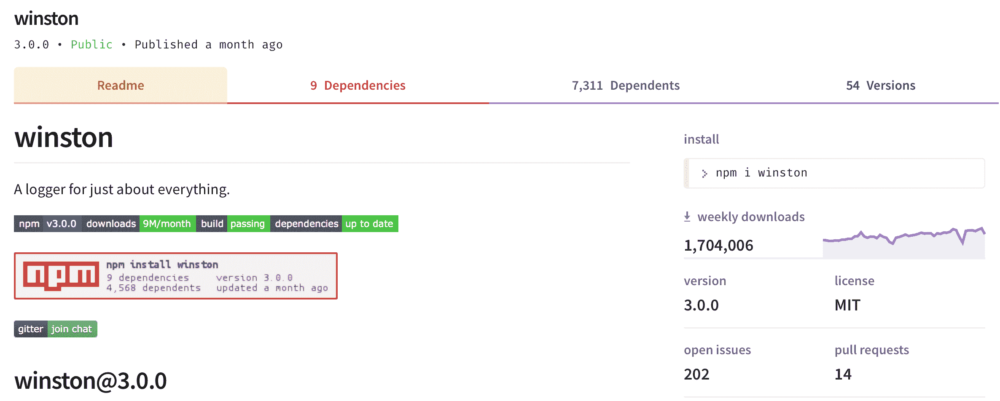

# 使用 Winston 和 Log4js 记录 Node.js 应用程序

> 原文：[`developer.ibm.com/zh/tutorials/learn-nodejs-winston/`](https://developer.ibm.com/zh/tutorials/learn-nodejs-winston/)

运行服务器端应用程序时，会发生很多事件，其中大多数事件都会写入日志文件中。日志文件可能是磁盘上文件的集合，也可能是数据库中的一系列记录。无论是哪一种情况，将诊断信息写入日志的做法都称为*日志记录*。

##### Node.js 学习路径

本教程已纳入 Node.js 学习路径。各单元之间相辅相成，查看 Node.js 学习路径概述，以便从头开始学习。

记录的事件包括：

*   数据库读取记录时记录的状态。
*   应用程序无法连接到数据库的时间。
*   有助于应用程序调试的信息。

日志将告诉我们*发生了什么情况*，当程序员诊断问题时，他们通常会先查看日志。虽然所有事件都会被记录下来，但只有最严重的系统事件才会广播到管理工具。

在本单元中，了解日志记录以及 Node 生态系统中两个最受欢迎的日志工具：[Winston](https://www.npmjs.com/package/winston) 和 [Log4js](https://www.npmjs.com/package/log4js)。

## 日志记录所面临的难题

将诊断信息写入控制台或日志文件并非难事。但困难的是，要在应用程序的整个生命周期内始终如一地这样做。

很遗憾，开发者对日志记录的用途有不同的设想，甚至有些人完全没有意识到日志记录的重要性。如果您多年来一直支持某个应用程序，您可能已经看到了后果：代码的某些部分被详尽记录，而其他部分则完全没有被记录。

当您需要调试应用程序时，不一致的日志记录（无论由何种原因导致）就会成为一个严重的问题。经验丰富的服务器端开发者通常都了解日志记录的价值，而前端开发者通常会忽略日志记录的价值。

## 选择出色的日志包

使用日志记录工具可提高日志记录的质量和一致性，幸运的是，Node 生态系统提供了许多出色的日志包以供您选择。选择的诀窍是您要了解自己的需求。

我的经验是，日志包必须是*可配置的*，这样您就可以进行定制。 其次，我希望获得以下必备功能：

*   应该支持**多个日志通道**，这样您就可以将日志发送到各种目标（控制台、文件、数据库等）。
*   应该支持**灵活配置**，以便支持可编程配置样式和外部配置样式。
*   应该支持**多种日志优先级**，因为某些类型的消息比其他类型的消息更重要。
*   应该支持**不同的日志格式**，这样程序员就可以进行配置和定制。
*   可以识别**多个日志类别**，因为不同的功能区域需要采用不同的方式进行记录。

本单元中介绍的两个日志包不仅具备所有上述功能，而且还具备其他功能。

### Winston

[Winston](https://github.com/winstonjs) 是最受欢迎的日志包之一，每周下载近 200 万次。根据我在第 7 单元中介绍的三部分评分标准（**质量**、**受欢迎程度**和**维护**），Winston 的得分为 81（分别为 98/82/67）。



Winston 易于使用且极受欢迎，如果您是一名专业的 Node 开发者，您很可能会使用到 Winston。

### Log4js

[Log4js](https://github.com/log4js-node/log4js-node) 是另一个受欢迎的日志包，每周下载超过 100 万次，三部分得分为 76（分别为 98/68/67）。


虽然它不像 Winston 那样受欢迎或广受好评，但 Log4js 具备我要从记录器中获得的所有功能。它还具有与 [log4j](https://logging.apache.org/log4j/2.x/) 非常相似的外观，因此，对于从 Java 过渡到 Node.js 的开发者而言，它很受欢迎。

## 日志记录示例

在继续后面的学习之前，我们首先设置一些示例，然后通过这些示例来试用上面的两个记录器。可使用以下两种方法来访问源代码并运行本单元的示例：

1.  浏览至 `Course` 存储库中的 `Unit-10` 目录，然后运行示例。

    [获取代码](https://github.com/jstevenperry/IBM-Developer/tree/master/Node.js/Course)

2.  从一个空目录和一个空 `package.json` 文件开始。然后逐步创建并运行示例。

### 从终端访问源代码

如果选择第一个选项，需打开终端窗口或命令提示符，浏览至 `Course` 存储库中的 `Unit-10` 目录。在我的 Mac 上，完整路径为 `~/src/projects/IBM-Developer/Node.js/Course/Unit-10`。确保至少运行一次该目录中的 `npm install`（但如果您遵循了每一节中的安装说明，那么肯定已经运行过）。

### 逐步创建源代码

如果您希望使用第二个选项，那么需要创建一个如下所示的 `package.json`：

**清单 1\. 用于运行本单元中的示例的 `package.json`**

```
{
  "name": "unit-10",
  "version": "1.0.0",
  "main": "unit-10.js",
  "license": "Apache-2.0",
  "scripts": {
    "lint": "eslint .",
    "lint-fix": "npm run lint -- --fix",
    "pre-run": "npm run lint && mkdir -p logs",
    "example-1": "npm run pre-run && node ./example-1",
    "example-2": "npm run pre-run && node ./example-2",
    "example-3": "npm run pre-run && node ./example-3",
    "example-4": "npm run pre-run && node ./example-4",
    "example-5": "npm run pre-run && node ./example-5",
    "example-6": "npm run pre-run && node ./example-6",
    "example-7": "npm run pre-run && node ./example-7",
    "example-8": "npm run pre-run && node ./example-8",
    "example-9": "npm run pre-run && node ./example-9",
    "example-10": "npm run pre-run && node ./example-10",
    "example-11": "npm run pre-run && node ./example-11",
    "example-12": "npm run pre-run && node ./example-12",
    "example-13": "npm run pre-run && node ./example-13",
    "example-14": "npm run pre-run && node ./example-14",
    "example-15": "npm run pre-run && node ./example-15",
    "example-16": "npm run pre-run && node ./example-16",
    "example-17": "npm run pre-run && node ./example-17"
  },
  "repository": {
    "type": "git",
    "url": "https://github.com/jstevenperry/node-modules"
  },
  "devDependencies": {
    "babel-eslint": "⁸.2.6",
    "eslint": "⁵.2.0",
    "eslint-config-google": "⁰.9.1"
  },
  "eslintConfig": {
    "extends": [
      "eslint:recommended",
      "google"
    ],
    "env": {
      "node": true
    },
    "parserOptions": {
      "ecmaVersion": 6
    },
    "rules": {
      "max-len": [
        2,
        120,
        4,
        {
          "ignoreUrls": true
        }
      ],
      "spaced-comment": 0,
      "no-trailing-spaces": 0,
      "comma-dangle": 0,
      "object-curly-spacing": 0,
      "array-bracket-spacing": 0,
      "no-console": 0
    }
  },
  "eslintIgnore": [
    "node_modules"
  ]
} 
```

现在，运行 `npm install` 来安装 `devDependencies`。

**重要注意事项**：务必将示例保存在 JavaScript 文件中，并且这些文件要与 `package.json` 所在目录中的示例编号相匹配。将 `example-1` 保存在名为 `example-1.js` 的文件中，将 `example-2` 保存在名为 `example-2.js` 的文件中，以此类推。

### 找到 linter

仔细查看清单 1，您可能会注意到，在每个示例运行之前，`npm` 脚本设置为对代码进行静态分析。

```
{
  "name": "unit-10",
  "version": "1.0.0",
.
.
  "scripts": {
    "lint": "eslint .",
    "lint-fix": "npm run lint -- --fix",
    "pre-run": "npm run lint && mkdir -p logs",
    "example-1": "npm run pre-run && node ./example-1",
    "example-2": "npm run pre-run && node ./example-2",
    "example-3": "npm run pre-run && node ./example-3",
    .
    .
  }
.
.
} 
```

在运行任何代码之前，我都会先对代码进行静态分析，以便尽快捕获潜在的错误。我建议大家都养成这种习惯。

## 使用 Winston 进行日志记录

### 安装 Winston

运行 `npm i winston` 命令，安装 Winston。输出应如下所示（您安装的版本可能与我的版本不同）：

```
Ix:~/src/projects/IBM-Developer/Node.js/Course/Unit-10 sperry$ npm i winston
npm WARN unit-10@1.0.0 No description

+ winston@3.0.0
added 194 packages from 214 contributors and audited 380 packages in 4.252s
found 0 vulnerabilities 
```

在后续章节中，我将介绍 Winston 如何实现我在第三方日志包中推荐的各个核心功能。

### Winston 中的多个日志通道（传输）

在 Winston 术语中，日志通道称为*传输*。内置传输的示例包括：

*   [控制台](https://github.com/winstonjs/winston/blob/master/docs/transports.md#console-transport)
*   [文件](https://github.com/winstonjs/winston/blob/master/docs/transports.md#file-transport)
*   [HTTP](https://github.com/winstonjs/winston/blob/master/docs/transports.md#http-transport)

此外，在 Winston 项目外部还会维护一些[传输 contrib 模块](https://github.com/winstonjs/winston/blob/master/docs/transports.md#maintained-by-winston-contributors)。

我将介绍 Winston 如何处理两个最常用的传输：控制台和文件。

### 控制台传输

顾名思义，*控制台传输*用于将记录器输出发送到控制台（*也称为* `stdout`）。您将在记录器配置过程中创建控制台传输，然后调用 `createLogger()` 函数。然后，您将调用其中一个 Winston API 方法来记录消息。

清单 2 显示了用于记录消息的两种方法。

**清单 2\. Winston 控制台传输**

```
const winston = require('winston');

// Logger configuration
const logConfiguration = {
    'transports': [
        new winston.transports.Console()
    ]
};

// Create the logger
const logger = winston.createLogger(logConfiguration);

// Log a message
logger.log({
    message: 'Hello, Winston!',
    level: 'info'
});
// Log a message
logger.info('Hello, Winston!'); 
```

要查看此示例的实际效果，可将以上代码保存到 `example-1.js`，然后运行 `npm run example-1`。运行 `example-1` 后，控制台输出如下所示：

```
Ix:~/src/projects/IBM-Developer/Node.js/Course/Unit-10 sperry$ npm run example-1

> unit-10@1.0.0 example-1 /Users/sperry/home/development/projects/IBM-Developer/Node.js/Course/Unit-10
> npm run pre-run && node ./example-1

> unit-10@1.0.0 pre-run /Users/sperry/home/development/projects/IBM-Developer/Node.js/Course/Unit-10
> npm run lint && mkdir -p logs

> unit-10@1.0.0 lint /Users/sperry/home/development/projects/IBM-Developer/Node.js/Course/Unit-10
> eslint .

{"message":"Hello, Winston!","level":"info"}
{"message":"Hello, Winston!","level":"info"} 
```

### 在控制台中进行日志记录的两种方法

注意以上输出中的最后两行。这两行完全相同，都显示了使用两种不同方法记录 `example-1` 中消息所产生的结果。

使用 Winston API 记录消息的第一种方法是使用 `log()` 函数，在其中将传递一个包含以下两个属性的对象：

*   `message`：要记录的消息文本
*   `level`：消息*级别*，可为以下项之一：
    *   `silly`
    *   `debug`
    *   `verbose`
    *   `info`
    *   `warn`
    *   `error`

暂时不必考虑这些级别，我们将在本单元后面的内容中讨论这些级别。

记录消息的第二种方法是使用与消息级别（`info()`、`warn()` 等）相同的名称来调用 API 函数，然后只传递要记录的消息。

清单 2 显示了用于传递消息的两种方法。接下来，我将使用第二种方法，因为它更加简单。

### 文件传输

文件传输用于将输出发送到您在配置中指定的文件。只需在记录器配置过程中创建文件传输，并通过传递配置对象来调用 `createLogger()` 函数即可。要记录消息，可调用其中一个 Winston API 方法，如下所示：

**清单 3\. Winston 文件传输**

```
const winston = require('winston');

// Logger configuration
const logConfiguration = {
    'transports': [
        new winston.transports.File({
            filename: './logs/example-2.log'
        })
    ]
};

// Create the logger
const logger = winston.createLogger(logConfiguration);

// Log a message
logger.info('Hello, Winston!'); 
```

要查看此示例的实际效果，可将以上代码保存到 `example-2.js`，然后运行 `npm run example-2`。运行 `example-2` 后，控制台输出如下所示：

```
Ix:~/src/projects/IBM-Developer/Node.js/Course/Unit-10 sperry$ npm run example-2
.
.
.
> unit-10@1.0.0 lint /Users/sperry/home/development/projects/IBM-Developer/Node.js/Course/Unit-10
> eslint . 
```

不存在与日志记录相关的控制台输出，因为文件传输会将输出发送到文件（在此例中为 `./logs/example-2.log`）：

```
{"message":"Hello, Winston!","level":"info"} 
```

### 多个 Winston 传输

应用程序经常会将相同的日志输出发送到多个目标（也称为*传输*），如清单 4 所示。

**清单 4\. 同一个配置对象中的多个 Winston 传输**

```
const winston = require('winston');

// Logger configuration
const logConfiguration = {
    transports: [
        new winston.transports.Console({
            level: 'verbose'
        }),
        new winston.transports.File({
            level: 'error',
            filename: './logs/example-3.log'
        })
    ]
};

// Create the logger
const logger = winston.createLogger(logConfiguration);

// Log some messages
logger.silly('Trace message, Winston!');
logger.debug('Debug message, Winston!');
logger.verbose('A bit more info, Winston!');
logger.info('Hello, Winston!');
logger.warn('Heads up, Winston!');
logger.error('Danger, Winston!'); 
```

注意，控制台传输和文件传输都会添加到配置对象中的 `transports` 数组中。

要查看此示例的实际效果，可将以上代码保存到 `example-3.js`，然后运行 `npm run example-3`。运行 `example-3` 后，控制台输出如下所示：

```
Ix:~/src/projects/IBM-Developer/Node.js/Course/Unit-10 sperry$ npm run example-3
.
.
.
{"message":"A bit more info, Winston!","level":"verbose"}
{"message":"Hello, Winston!","level":"info"}
{"message":"Heads up, Winston!","level":"warn"}
{"message":"Danger, Winston!","level":"error"} 
```

控制台传输的 `level` 属性已设置为 `verbose`，因此并非所有日志语句都会出现在控制台输出中。此外，文件传输的 `level` 属性已设置为 `error`，因此只有一个日志语句出现在日志文件中。`./logs/example-3.log` 的内容如下所示：

```
Ix:/tmp/IBM-Developer/Node.js/Course/Unit-10 sperry$ cat logs/example-3.log
{"message":"Danger, Winston!","level":"error"} 
```

您很快就会更深入地了解级别。

### Winston 中的灵活配置

在到目前为止的示例中，Winston 配置对象与使用它的记录器位于同一个模块中，但这不是强制要求。要从记录器中获得的一项功能是能够在使用它的代码外部进行配置。Winston 具备这项功能。

以下列配置为例。

**清单 5\. `./config/app-settings.js` 中的外部配置**

```
const winston = require('winston');

const appSettings = {
    winston: {
        sillyLogConfig: {
            level: 'silly',
            transports: [
                new winston.transports.File({
                    filename: './logs/silly.log'
                }),
                new winston.transports.Console()
            ]
        },
    },
    log4js: {
        traceLogConfig: {
            appenders: {
                fileAppender: { type: 'file', filename: './logs/trace.log'},
                consoleAppender: { type: 'console' }
            },
            categories: {
                default: { appenders: ['fileAppender', 'consoleAppender'], level: 'trace'}
            }
        }
    }
};

module.exports = appSettings; 
```

如果要逐步创建源代码，那么需要创建一个名为 `config` 的目录，该目录是 `package.json` 所在位置的下级目录。然后，您将创建另一个名为 `app-settings.js` 的文件。将这两者粘贴到清单 5 的内容中。

要使用此外部配置，可以像使用任何其他 Node 模块一样使用 `require()`，并将 `sillyLogConfig` 传递给 Winston 的 `createLogger()` 函数，如下所示。

**清单 6\. `./config/app-settings.js` 中的外部配置**

```
const winston = require('winston');

// App settings
const { sillyLogConfig } = require('./config/app-settings').winston;

// Create the logger
const logger = winston.createLogger(sillyLogConfig);

// Log some messages
logger.silly('Trace message, Winston!');
logger.debug('Debug message, Winston!');
logger.verbose('A bit more info, Winston!');
logger.info('Hello, Winston!');
logger.warn('Heads up, Winston!');
logger.error('Danger, Winston!'); 
```

要查看此代码的实际效果，可将以上代码保存到 `example-4.js`，然后运行 `npm run example-4`。

运行 `example-4` 后，控制台输出如下所示：

```
Ix:~/src/projects/IBM-Developer/Node.js/Course/Unit-10 sperry$ npm run example-4
.
.
.
{"message":"Trace message, Winston!","level":"silly"}
{"message":"Debug message, Winston!","level":"debug"}
{"message":"A bit more info, Winston!","level":"verbose"}
{"message":"Hello, Winston!","level":"info"}
{"message":"Heads up, Winston!","level":"warn"}
{"message":"Danger, Winston!","level":"error"} 
```

文件输出将发送到 `./logs/silly.log`，并且与控制台输出类似：

```
Ix:/tmp/IBM-Developer/Node.js/Course/Unit-10 sperry$ cat logs/silly.log
{"message":"Trace message, Winston!","level":"silly"}
{"message":"Debug message, Winston!","level":"debug"}
{"message":"A bit more info, Winston!","level":"verbose"}
{"message":"Hello, Winston!","level":"info"}
{"message":"Heads up, Winston!","level":"warn"}
{"message":"Danger, Winston!","level":"error"} 
```

**注意**：在撰写本文时，Winston 配置对象必须是 JavaScript 对象。例如，您目前无法使用纯 JSON 来配置 Winston。但是，[已发布了此问题](https://github.com/winstonjs/winston/issues/1218)，并且 Winston 正在积极维护中，敬请期待！

### Winston 中的多种日志优先级

要从生产质量日志包中获得的另一项功能是能够支持多种日志优先级（也称为*级别*）。您已经在 `example-3` 和 `example-4` 中看到了这一点。现在，我们将更深入地了解 Winston 对日志级别的支持。

Winston 按照 [RFC5424](https://tools.ietf.org/html/rfc5424) 的设计来定义日志级别，如清单 7 所示。

**清单 7\. Winston 的标准日志级别**

```
const levels = {
  error: 0,
  warn: 1,
  info: 2,
  verbose: 3,
  debug: 4,
  silly: 5
}; 
```

根据这一标准，将按反向数字顺序来定义级别。也就是说，消息越重要，优先级数字就越小。例如，`error` 消息比 `debug` 消息更重要，因此错误消息的优先级数字更小。

在我看来，这种顺序完全是颠倒了。虽然我赞同 Winston 应至少遵循一种标准，但我怀疑 RFC 5424 的日志级别定义是基于预先存在的实现（[linux 内核日志优先级](https://www.linuxtopia.org/online_books/linux_kernel/kernel_configuration/re06.html)），而不是直观地诠释 *优先级* 的含义。

在创建自定义日志级别（我们很快就会这样做）时，这些信息将非常重要。

### 覆盖优先级级别

在清单 8 中，我们将创建一个 Winston 记录器，然后覆盖它的级别，这样我们就可以看到它的所有消息。

**清单 8\. 查看所有可用级别的消息**

```
const winston = require('winston');

// Logger configuration
const logConfiguration = {
    transports: [
        new winston.transports.Console({
            level: 'error'
        })
    ]
};

// Create the logger
const logger = winston.createLogger(logConfiguration);
// Let's see ALL the log levels
logger.transports[0].level = 'silly';

// Log some messages
logger.silly('Trace message, Winston!');
logger.debug('Debug message, Winston!');
logger.verbose('A bit more info, Winston!');
logger.info('Hello, Winston!');
logger.warn('Heads up, Winston!');
logger.error('Danger, Winston!'); 
```

注意，在此例中，只有一个控制台传输。

要查看此示例的实际效果，可将以上代码保存到 `example-5.js`，然后运行 `npm run example-5`。运行 `example-5` 后，控制台输出如下所示：

```
Ix:~/src/projects/IBM-Developer/Node.js/Course/Unit-10 sperry$ npm run example-5
.
.
.
{"message":"Trace message, Winston!","level":"silly"}
{"message":"Debug message, Winston!","level":"debug"}
{"message":"A bit more info, Winston!","level":"verbose"}
{"message":"Hello, Winston!","level":"info"}
{"message":"Heads up, Winston!","level":"warn"}
{"message":"Danger, Winston!","level":"error"} 
```

### 自定义日志级别

正如我所指出，我们可以用自定义日志级别替换 Winston 的标准日志级别，如下所示。

**清单 9\. 在 Winston 中定义自定义日志级别**

```
01 const winston = require('winston');
02
03 // Custom log levels
04 const noteLevels = {
05     values: {
06         doe: 10,
07         ray: 20,
08         me: 30,
09         far: 40,
10         sew: 50,
11         la: 60,
12         tea: 70
13     }
14 };
15
16 // Logger configuration
17 const logConfiguration = {
18     level: 'far',
19     levels: noteLevels.values,
20     transports: [
21         new winston.transports.Console()
22     ]
23 };
24
25 // Create the logger
26 const logger = winston.createLogger(logConfiguration);
27
28 /**
29  *
30  */
31 function doLogging() {
32     // Log some messages
33     logger.tea('Tea, Winston!');
34     logger.la('La, Winston!');
35     logger.sew('Sew, Winston!');
36     logger.far('Far, Winston!');
37     logger.me('Me, Winston!');
38     logger.ray('Ray, Winston!');
39     logger.doe('Doe, Winston!');
40 }
41
42 // Do some logging as the logger was setup
43 logger.doe(`Logging messages, current log level: ${logger.level}`);
44 doLogging();
45
46 // Now modify the level
47 logger.level = 'tea';
48 logger.doe(`Logging messages, current log level: ${logger.level}`);
49 doLogging();
50
51 try {
52     logger.info('The previously used log methods no longer work!');
53 } catch (err) {
54     logger.doe(`${err.message}`);
55 } 
```

要查看此示例的实际效果，可将以上代码保存到 `example-6.js`（我先移除了行号），然后运行 `npm run example-6`。输出如下所示：

```
Ix:~/src/projects/IBM-Developer/Node.js/Course/Unit-10 sperry$ npm run example-6
.
.
.
{"message":"Logging messages, current log level: far","level":"doe"}
{"message":"Far, Winston!","level":"far"}
{"message":"Me, Winston!","level":"me"}
{"message":"Ray, Winston!","level":"ray"}
{"message":"Doe, Winston!","level":"doe"}
{"message":"Logging messages, current log level: tea","level":"doe"}
{"message":"Tea, Winston!","level":"tea"}
{"message":"La, Winston!","level":"la"}
{"message":"Sew, Winston!","level":"sew"}
{"message":"Far, Winston!","level":"far"}
{"message":"Me, Winston!","level":"me"}
{"message":"Ray, Winston!","level":"ray"}
{"message":"Doe, Winston!","level":"doe"}
{"message":"logger.info is not a function","level":"doe"} 
```

#### 关于 Winston 代码的注释

我们来逐行查看上面的代码。

首先，在第 4-14 行中定义自定义级别。

接下来，在第 17-23 行中创建 Winston 配置对象。特别注意第 19 行，在该行中设置了新定义的级别。这些级别将替换清单 7 中所示的默认级别。

另需注意，`doLogging()` 函数（第 31 行）被调用了两次：

*   第一次是在第 44 行中，目的是使用在创建配置对象时设置的日志级别进行日志记录。
*   第二次是在第 49 行中，在日志级别设置为 `tea`（第 47 行）之后，此时将显示所有级别。

最后，当您定义自己的日志级别并使用它们来创建 Winston 配置对象时，默认级别便不再适用。实际上，如果您尝试使用默认级别，那么 Winston 将会报错；参阅第 51-55 行并注意最后一条日志消息：

```
{"message":"logger.info is not a function","level":"doe"} 
```

### 在 Winston 中进行格式化

生产质量记录器应允许您对所记录的消息进行格式化。

在到目前为止的示例中，都采用 JSON 格式记录消息，但是 Winston 提供了许多其他的日志消息格式。下面介绍了其中两种格式：printf 和 splat。

在开始探讨这些格式之前，务必了解 Winston 的*格式框架*。首先要记住的是，Winston 消息是以 info 对象为中心，该对象具有以下两个属性：`level` 和 `message`。

您通过 `createLogger()` 创建的每个记录器实例都有一个 `format` 属性，您可以将此属性设置为要使用的格式化程序类型。Winston 附带了几个内置的格式化程序，您可以组合使用这些格式化程序来处理所需的任何日志消息格式。

### 使用 printf 进行格式化

**清单 10\. 打印样式的格式化**

```
01 const winston = require('winston');
02
03 // The Logger Category (functional area)
04 const CATEGORY = 'example-7';
05
06 // Logger configuration
07 const logConfiguration = {
08     transports: [
09         new winston.transports.Console()
10     ],
11     format: winston.format.combine(
12         winston.format.label({
13             label: CATEGORY
14         }),
15         winston.format.timestamp(),
16         winston.format.printf((info) => {
17             return `${info.timestamp} - ${info.label}:[${info.level}]: ${info.message}`;
18         })
19     )
20 };
21
22 // Create the logger
23 const logger = winston.createLogger(logConfiguration);
24
25 logger.info('Howdy, Winston!'); 
```

此示例中的格式化程序是在第 11-19 行中创建的，它是 Winston 内置的 `label()`（第 12-14 行）、`timestamp()`（第 15 行）和 `printf()`（第 16-18 行）格式化程序的组合形式。

另需注意，第 17 行用于控制所记录的消息：

```
 return `${info.timestamp} - ${info.label}:[${info.level}]: ${info.message}`; 
```

如果与这些字段匹配，那么可以准确地了解消息的计算方式：

*   `info.timestamp` 来自第 15 行。
*   `info.label` 来自第 12-14 行。
*   `info.level` 是 [`info` 对象](https://github.com/winstonjs/logform#info-objects)中的日志级别。
*   `info.message` 是要记录的消息文本（第 25 行）。

要查看此示例的实际效果，可将以上代码保存到 `example-7.js`。首先去掉行号，然后运行 `npm run example-7`。控制台输出如下所示：

```
Ix:~/src/projects/IBM-Developer/Node.js/Course/Unit-10 sperry$ npm run example-7
.
.
.
2018-07-26T01:22:09.087Z - example-7:[info]: Howdy, Winston! 
```

### 使用 splat 和 simple 进行格式化

如果要在调用日志函数时控制格式化权限，那么可以组合使用 `splat` 和 `simple` 格式化程序。

*   `splat()` 根据 Node 的 [`util.format()` 函数](https://nodejs.org/dist/latest-v10.x/docs/api/util.html#util_util_format_format_args)来对 `level.message` 进行格式化。
*   `simple()` 将返回 `level.info` 以及 `level.message`。

**清单 11\. 使用 `splat` 和 `simple` 进行格式化**

```
const winston = require('winston');

// The Logger Category (functional area)
const CATEGORY = 'example-8';

// Logger configuration
const logConfiguration = {
    transports: [
        new winston.transports.Console()
    ],
    format: winston.format.combine(
        winston.format.splat(),
        winston.format.simple()
    )
};

// Create the logger
const logger = winston.createLogger(logConfiguration);

logger.warn('%d - %s: Howdy, Winston!', Date.now(), CATEGORY); 
```

要查看此示例的实际效果，可将以上代码保存到 `example-8.js`，然后运行 `npm run example-8`。控制台输出如下所示：

```
Ix:~/src/projects/IBM-Developer/Node.js/Course/Unit-10 sperry$ npm run example-8
.
.
.
warn: 1532569853985 - example-8: Howdy, Winston! 
```

Winston 还提供了一些其他内置格式化程序，您可通过阅读 [WinstonJS 文档](https://github.com/winstonjs/winston#formats)和 [Winston logform 文档](https://github.com/winstonjs/logform#understanding-formats)来了解这些格式化程序。

**注意**：在此例中，将在 `warn`（即 `level.info` 的值）级别记录消息。[`info` 对象](https://github.com/winstonjs/logform#info-objects)与 [`info` 级别](https://github.com/winstonjs/winston#logging-levels)之间的名称冲突很容易引起混淆，但您在通读了 [`info`对象文档](https://github.com/winstonjs/logform#info-objects)后就会豁然开朗。如果要开始使用 Winston，我建议您花一些时间来通读该文档。

### Winston 中的日志类别

要从 Winston 中获得的最后一项功能是能够根据应用程序的功能区域来对记录器实例进行分段。Winston 通过“容器”这个概念来提供了这项功能。

考虑下面的示例，并注意我已移除了注释来节省空间。

首先，利用一个函数来创建 Winston 配置，如清单 12 所示。

**清单 12\. 创建 Winston 配置**

```
01 const winston = require('winston');
02
03 const DEFAULT_CATEGORY = 'DEFAULT';
04
05 function createLoggerConfig(category) {
06     return {
07         level: 'info',
08         transports: [
09             new winston.transports.Console()
10         ],
11         format: winston.format.combine(
12             winston.format.label({
13                 label: category
14             }),
15             winston.format.timestamp(),
16             winston.format.printf((info) => {
17                 return `${info.timestamp} - ${info.label}:[${info.level}]: ${info.message}`;
18             })
19         )
20     };
21 }
22 winston.loggers.add(DEFAULT_CATEGORY, createLoggerConfig(DEFAULT_CATEGORY));
23
24 module.exports.defaultLogger = winston.loggers.get(DEFAULT_CATEGORY);
25
26 module.exports.createLoggerConfig = createLoggerConfig; 
```

如果要手动创建源代码，需去掉行号，然后将这个清单保存到 `./config/winston-config.js` 中。另外，务必向 `createLoggerConfig()` 函数中添加一个 JSDoc 注释，否则 Linter 将会报错。（如果要避免 Linter 报错，可以禁用 `package.json` 中的静态分析规则，但我将该选项留作读者的练习。)

清单 12 中的模块定义了一个默认类别（第 3 行），并将一个记录器添加到 Winston 的内部 `Container` 存储器中（第 22 行），然后将其导出为 `defaultLogger`（第 24 行）。另外，还导出了 `createLoggerConfig()` 函数（第 5-21 行），因此可以按如下所示来调用该函数：

**清单 13\. 日志类别**

```
01 const winstonConfig = require('./config/winston-config');
02
03 const winston = require('winston');
04
05 let defaultLogger = winstonConfig.defaultLogger;
06 defaultLogger.info('Beginning program execution...');
07
08 const MODULE = 'example-9';
09
10 winston.loggers.add(MODULE, winstonConfig.createLoggerConfig(MODULE));
11 const moduleLogger = winston.loggers.get(MODULE);
12
13 moduleLogger.info('Howdy, Winston!');
14 moduleLogger.warn('WARNING, Winston!');
15 moduleLogger.error('ERROR, Winston!');
16
17 const FOO = 'foo';
18 const BAR = 'bar';
19
20 winston.loggers.add(FOO, winstonConfig.createLoggerConfig(FOO));
21 winston.loggers.add(BAR, winstonConfig.createLoggerConfig(BAR));
22
23 const fooLogger = winston.loggers.get(FOO);
24 fooLogger.info('Howdy, Winston!');
25
26 const barLogger = winston.loggers.get(BAR);
27 barLogger.info('Howdy, Winston!');
28
29 defaultLogger.info('Program terminated.'); 
```

#### 关于代码的注释

在这个简单的示例中执行了很多操作，我们来看一看。

首先，使用默认记录器（第 5-6 行，它是从 `./config/winston-config.js` 导出的）来输出一条消息。

接下来，定义新记录器类别的配置（第 8 行），并将其添加到 Winston 的 Container 存储器中（第 10 行），然后检索一个记录器对象（第 11 行）。此记录器特定于此模块 (`example-9`)，用于记录一些消息。

然后，创建并添加两个新类别配置（第 20-21 行），并采用相同的方式检索它们的记录器实例（第 23 行和第 26 行）。

要查看此示例的实际效果，可将以上代码保存到 `example-9.js`（别忘了先去掉行号），然后运行 `npm run example-9`。控制台输出如下所示：

```
Ix:~/src/projects/IBM-Developer/Node.js/Course/Unit-10 sperry$ npm run example-9
.
.
.
2018-07-26T02:10:19.402Z - DEFAULT:[info]: Beginning program execution...
2018-07-26T02:10:19.404Z - example-9:[info]: Howdy, Winston!
2018-07-26T02:10:19.404Z - example-9:[warn]: WARNING, Winston!
2018-07-26T02:10:19.404Z - example-9:[error]: ERROR, Winston!
2018-07-26T02:10:19.405Z - foo:[info]: Howdy, Winston!
2018-07-26T02:10:19.405Z - bar:[info]: Howdy, Winston!
2018-07-26T02:10:19.405Z - DEFAULT:[info]: Program terminated. 
```

注意，该类别显示为 `label`，因为它就是这样配置的（参阅清单 12 中的第 13 行）。

以上就是对 Winston 的介绍（至少对于本单元来说是这样）。接下来，您将安装并试用 Log4js。

## 使用 Log4js 进行日志记录

### 安装 Log4js

运行 `npm i log4js` 命令，安装 Log4js。输出应如下所示（您安装的版本可能与我的版本不同）：

```
Ix:~/src/projects/IBM-Developer/Node.js/Course/Unit-10 sperry$ npm i log4js
npm WARN unit-10@1.0.0 No description

+ log4js@3.0.2
added 4 packages from 2 contributors and audited 400 packages in 1.916s
found 0 vulnerabilities 
```

在下一节中，我们将了解 Log4js 如何实现要从日志包中获得的所有五个核心功能。

### Log4js 中的多个日志通道（附加程序）

在 Log4js 术语中，日志通道称为*附加程序*。内置附加程序的示例包括：

*   [控制台](https://log4js-node.github.io/log4js-node/console.html)
*   [文件](https://log4js-node.github.io/log4js-node/file.html)
*   [tcp](https://log4js-node.github.io/log4js-node/tcp.html)

要了解更多附加程序，可参阅[列表](https://log4js-node.github.io/log4js-node/appenders.html)。

重申一下，我们将了解两个最常用的附加程序：控制台和文件。

### 控制台附加程序

顾名思义，*控制台附加程序*用于将记录器输出发送到控制台。Log4js 具有一种内置配置，其中包含一个控制台附加程序，因此您不需要显式添加控制台附加程序。通过调用 `getLogger()` 从 Log4js 请求一个记录器实例。确保设置了日志级别，然后通过调用其中一个 Log4js API 方法来记录消息：

**清单 14\. Log4js 控制台附加程序**

```
const log4js = require('log4js');

// Create the logger
const logger = log4js.getLogger();
logger.level = 'info';

// Log a message
logger.info('Hello, log4js!'); 
```

**注意**：默认情况下，日志级别为 `OFF`。您必须设置记录器级别，否则不会记录任何内容。

要查看此示例的实际效果，可将以上代码保存到 `example-10.js`，然后运行 `npm run example-10`。运行 `example-10` 后，输出如下所示：

```
Ix:~/src/projects/IBM-Developer/Node.js/Course/Unit-10 sperry$ npm run example-10
.
.
.
[2018-07-25T22:06:00.154] [INFO] default - Hello, log4js! 
```

### 文件附加程序

文件附加程序用于将输出发送到您在配置中指定的文件。

**清单 15\. Log4js 文件传输**

```
const log4js = require('log4js');

// Logger configuration
log4js.configure({
    appenders: { fileAppender: { type: 'file', filename: './logs/example-11.log' } },
    categories: { default: { appenders: ['fileAppender'], level: 'info' } }
});

// Create the logger
const logger = log4js.getLogger();
logger.level = 'info';

// Log a message
logger.info('Hello, log4js!'); 
```

注意对 `log4js.configure()` 的额外调用，如果要覆盖默认控制台附加程序以添加您自己的控制台附加程序，那么必须进行此调用。

要查看此示例的实际效果，可将以上代码保存到 `example11.js`，然后运行 `npm run example-11`。控制台输出如下所示：

```
Ix:~/src/projects/IBM-Developer/Node.js/Course/Unit-10 sperry$ npm run example-11
.
.
.
> unit-10@1.0.0 lint /Users/sperry/home/development/projects/IBM-Developer/Node.js/Course/Unit-10
> eslint . 
```

不存在与日志记录相关的控制台输出，因为文件附加程序会将输出发送到文件。在此例中，文件为 `./logs/example-11.log`，其内容如下所示：

```
Ix:/tmp/IBM-Developer/Node.js/Course/Unit-10 sperry$ cat logs/example-11.log
[2018-07-26T21:52:29.801] [INFO] default - Hello, log4js! 
```

### 多个传输

应用程序经常会将同一个日志输出发送到多个目标。可以向 Log4js 配置对象添加多个附加程序，如下所示：

**清单 16\. 同一配置中的多个 Log4js 附加程序**

```
const log4js = require('log4js');

// Logger configuration
log4js.configure({
    appenders: {
        fileAppender: { type: 'file', filename: './logs/example-12.log' },
        console: { type: 'console' }
    },
    categories: {
        default: { appenders: ['fileAppender', 'console'], level: 'error' }
    }
});

// Create the logger
const logger = log4js.getLogger();

// Log a message
logger.trace('Trace, log4js!');
logger.debug('Debug, log4js!');
logger.info('Hello, log4js!');
logger.warn('Heads up, log4js!');
logger.error('Danger, log4js!');
logger.fatal('Fatal, log4js!'); 
```

要查看此示例的实际效果，可将以上代码保存到 `example-12.js`，然后运行 `npm run example-12`。控制台输出如下所示：

```
Ix:~/src/projects/IBM-Developer/Node.js/Course/Unit-10 sperry$ npm run example-12
.
.
.
[2018-07-26T21:56:24.196] [ERROR] default - Danger, log4js!
[2018-07-26T21:56:24.201] [FATAL] default - Fatal, log4js! 
```

控制台附加程序的 `level` 属性已设置为 `info`（默认值），因此并非 `example-12` 中的所有日志语句都会出现在控制台输出中。

文件传输的 `level` 属性已设置为 `error`，因此只有一个日志语句出现在日志文件中。`./logs/example-12.log` 的内容类似于控制台输出：

```
Ix:/tmp/IBM-Developer/Node.js/Course/Unit-10 sperry$ cat logs/example-12.log
[2018-07-26T21:56:24.196] [ERROR] default - Danger, log4js!
[2018-07-26T21:56:24.201] [FATAL] default - Fatal, log4js! 
```

### Log4js 中的灵活配置

在到目前为止的示例中，Log4js 配置对象与使用它的记录器位于同一个模块中，但这不是强制要求。与 Winston 一样，Log4js 可以在使用它的代码外部进行配置。

回顾一下清单 5 中 `./config/app-settings.js` 内的以下配置代码片段：

**清单 17\. `./config/app-settings.js` 中的 Log4js 外部配置**

```
const appSettings = {
.
.
    log4js: {
        traceLogConfig: {
            appenders: {
                fileAppender: { type: 'file', filename: './logs/trace.log'},
                consoleAppender: { type: 'console' }
            },
            categories: {
                default: { appenders: ['fileAppender', 'consoleAppender'], level: 'trace'}
            }
        }
    }
};

module.exports = appSettings; 
```

对于此外部配置，可以像使用任何其他 Node 模块一样使用 `require()`，并将 `traceLogConfig` 传递给 Log4j 的 `configure()` 函数，如下所示：

**清单 18\. `./config/app-settings.js` 中的外部配置**

```
const log4js = require('Log4js');

// App settings
const { traceLogConfig } = require('./config/app-settings').log4js;

// Logger configuration
log4js.configure(traceLogConfig);

// Create the logger
const logger = log4js.getLogger();

// Log a message
logger.trace('Trace, Log4js!');
logger.debug('Debug, Log4js!');
logger.info('Hello, Log4js!');
logger.warn('Heads up, Log4js!');
logger.error('Danger, Log4js!');
logger.fatal('Fatal, Log4js!'); 
```

要查看此代码的实际效果，可将以上代码保存到 `example-13.js`，然后运行 `npm run example-13`。控制台输出如下所示：

```
Ix:~/src/projects/IBM-Developer/Node.js/Course/Unit-10 sperry$ npm run example-13
.
.
.
[2018-07-26T21:58:28.084] [TRACE] default - Trace, Log4js!
[2018-07-26T21:58:28.089] [DEBUG] default - Debug, Log4js!
[2018-07-26T21:58:28.089] [INFO] default - Hello, Log4js!
[2018-07-26T21:58:28.089] [WARN] default - Heads up, Log4js!
[2018-07-26T21:58:28.089] [ERROR] default - Danger, Log4js!
[2018-07-26T21:58:28.089] [FATAL] default - Fatal, Log4js! 
```

文件输出将发送到 `./logs/trace.log`，并且与控制台输出类似：

```
Ix:~/src/projects/IBM-Developer/Node.js/Course/Unit-10 sperry$ cat ./logs/trace.log
[2018-07-25T22:25:04.796] [TRACE] default - Trace, Log4js!
[2018-07-25T22:25:04.800] [DEBUG] default - Debug, Log4js!
[2018-07-25T22:25:04.801] [INFO] default - Hello, Log4js!
[2018-07-25T22:25:04.801] [WARN] default - Heads up, Log4js!
[2018-07-25T22:25:04.801] [ERROR] default - Danger, Log4js!
[2018-07-25T22:25:04.801] [FATAL] default - Fatal, Log4js! 
```

另外，还可以使用纯 JSON 对象来配置 Log4js。考虑以下 JSON：

**清单 19\. `log4js-config.json` 中的纯 JSON 配置**

```
{
    "appenders": {
        "consoleAppender": {
            "type": "console", "layout": {
                "type": "pattern", "pattern": "%d - %c:[%p]: %m"
            }
        }
    },
    "categories": {
        "default": {
            "appenders": ["consoleAppender"],
            "level": "info"
        }
    }
} 
```

如果要使用“逐步创建”选项，那么需要在 `./config` 目录中创建名为 `log4js-config.json` 的新文件，并将其粘贴到清单 19 的内容中。

对于此外部配置，可以像使用任何其他 Node 模块一样使用 `require()`，并将 `traceLogConfig` 传递给 Log4j 的 `configure()` 函数，如下所示：

**清单 20\. 纯 JSON 配置**

```
const log4js = require('log4js');

// Logger configuration
log4js.configure('./config/log4js-config.json');

// Default logger
const logger = log4js.getLogger();

// Log a message with the default logger
logger.info('Howdy, Log4js!'); 
```

要配置记录器，只需将包含 JSON 配置的文件的名称传递给记录器即可。

要查看此代码的实际效果，可将此代码保存到 `example-14.js`，然后运行 `npm run example-14`。运行 `example-14` 后，控制台输出如下所示：

```
Ix:~/src/projects/IBM-Developer/Node.js/Course/Unit-10 sperry$ npm run example-14
.
.
.
2018-07-25T22:38:32.424 - default:[INFO]: Howdy, Log4js! 
```

### Log4js 中的多种日志优先级（级别）

接下来，我们将了解 Log4j 如何处理多种日志优先级（也称为*级别*）。

**清单 21\. Log4js 默认级别**

```
Level.addLevels({
  ALL: { value: Number.MIN_VALUE, colour: 'grey' },
  TRACE: { value: 5000, colour: 'blue' },
  DEBUG: { value: 10000, colour: 'cyan' },
  INFO: { value: 20000, colour: 'green' },
  WARN: { value: 30000, colour: 'yellow' },
  ERROR: { value: 40000, colour: 'red' },
  FATAL: { value: 50000, colour: 'magenta' },
  MARK: { value: 9007199254740992, colour: 'grey' }, // 2⁵³
  OFF: { value: Number.MAX_VALUE, colour: 'grey' }
}); 
```

您可以在此处找到 Log4js 支持的所有级别的列表。

最低优先级消息 (`TRACE`) 的值为 5,000，而最高优先级消息 (`FATAL`) 的值为 50,000。Log4js 对于*优先级*概念的诠释与我的理解非常接近。另一方面，Log4js 不允许您像 Winston 中那样自定义日志级别，并且默认日志级别根本不透明。

接下来，我们将创建一个 Log4js 记录器，然后覆盖它的级别，这样我们就可以看到它的所有消息。

**清单 22\. 所有可用级别的消息**

```
const log4js = require('log4js');

// Create the logger
const logger = log4js.getLogger();
// Let's see ALL of the levels!
logger.level = 'trace';

// Log a message
logger.trace('Trace, log4js!');
logger.debug('Debug, log4js!');
logger.info('Hello, log4js!');
logger.warn('Heads up, log4js!');
logger.error('Danger, log4js!');
logger.fatal('Fatal, log4js!'); 
```

注意，在此示例中，只有一个控制台传输。

要查看此示例的实际效果，可将以上代码保存到 `example-15.js`，然后运行 `npm run example-15`。控制台输出如下所示：

```
Ix:~/src/projects/IBM-Developer/Node.js/Course/Unit-10 sperry$ npm run example-15
.
.
.
[2018-07-26T22:06:00.588] [TRACE] default - Trace, log4js!
[2018-07-26T22:06:00.591] [DEBUG] default - Debug, log4js!
[2018-07-26T22:06:00.591] [INFO] default - Hello, log4js!
[2018-07-26T22:06:00.591] [WARN] default - Heads up, log4js!
[2018-07-26T22:06:00.591] [ERROR] default - Danger, log4js!
[2018-07-26T22:06:00.591] [FATAL] default - Fatal, log4js! 
```

### 在 Log4js 中进行格式化

生产质量记录器应提供多种选项来用于对所记录的消息进行格式化。Log4js 通过提供多种*布局类型*（包括清单 23 中所示的布局类型）来实现这一点。

**清单 23\. Log4js 模式格式化程序**

```
const log4js = require('log4js');

// The Logger Category (functional area)
const CATEGORY = 'example-16';

// Logger configuration
log4js.configure({
    appenders: {
        consoleAppender: {
            type: 'console',
            layout: {
                type: 'pattern',
                pattern: '%d - %c:[%p]: %m'
            }
        }
    },
    categories: { default: { appenders: ['consoleAppender'], level: 'info' } }
});

// Create the logger
const logger = log4js.getLogger(CATEGORY);

logger.info('Howdy, Log4js!'); 
```

如果要覆盖 Log4js 的默认格式，只需添加一个名为 `layout` 的元素并指定布局 [`type`](https://log4js-node.github.io/log4js-node/layouts.html) 即可。

在清单 23 中，布局类型为 `pattern`。由于类型为 `pattern`，所以您必须指定 `pattern` 属性，这是模式字符串并且特定于 Log4js（有关更多详细信息，可参阅[布局文档](https://log4js-node.github.io/log4js-node/layouts.html)）。

在此例中，值为：

*   `%d`：表示时间戳记（即，日期），按照 ISO8601 格式进行格式化。
*   `%c`：表示日志类别（在此例中为 `example-16`）。
*   `%p`：表示日志级别（或优先级，这取决于您的偏好）。
*   `%m`：表示要记录的消息。

要查看此示例的实际效果，可将以上代码保存到 `example-16.js`，然后运行 `npm run example-16`。控制台输出如下所示：

```
Ix:~/src/projects/IBM-Developer/Node.js/Course/Unit-10 sperry$ npm run example-16
.
.
.
2018-07-26T22:04:27.801 - example-16:[INFO]: Howdy, Log4js! 
```

Log4js 还包含其他可选布局，其中包括以下两个布局：

*   `basic` 包含 ISO8601 日期、日志级别和消息（相对于 `pattern` 为 `[%d] [%p] [%c] - [%m]`）。
*   `messagePassThrough` 仅包含消息。

您还可以创建自己的布局。如果要了解更多信息，可查看[布局文档](https://log4js-node.github.io/log4js-node/layouts.html)。

### Log4js 中的日志类别

生产质量日志包应允许您根据应用程序的功能区域来对记录器实例进行分段。在本节中，您将了解 Log4js 如何处理该功能。

首先，要检索另一个类别的预配置记录器的新实例，只需将该类别的名称传递给 `getLogger()` 调用即可，如下所示（注意，我已移除了注释并添加了行号）：

**清单 24\. 日志类别**

```
01  const log4js = require('log4js');
02
03  const MODULE = 'example-17';
04
05  const defaultLogger = log4js.getLogger();
06  defaultLogger.level = 'info';
07  defaultLogger.info('Beginning program execution...');
08
09  log4js.configure('./config/log4js-config.json');
10
11  const moduleLogger = log4js.getLogger(MODULE);
12
13  moduleLogger.info('Howdy, Log4js!');
14  moduleLogger.warn('WARNING, Log4js!');
15  moduleLogger.error('ERROR, Log4js!');
16
17  const FOO = 'foo';
18  const BAR = 'bar';
19
20  const fooLogger = log4js.getLogger(FOO);
21  fooLogger.info('Howdy, Log4js!');
22
23  const barLogger = log4js.getLogger(BAR);
24  barLogger.info('Howdy, Log4js!');
25
26  defaultLogger.info('Program terminated.'); 
```

#### 关于 Log4js 代码的注释

在这个简单的示例中执行了很多操作，我们来看一看。

首先，检索默认记录器，并记录一条用于指示程序执行开始的消息（第 5-7 行）。

随后，使用 `./config/log4js-config.json`（第 9 行）中的 JSON 配置来配置记录器。

接下来，检索记录器的一个特定于模块的实例（第 11 行），并使用特定于模块的记录器来记录一些消息（第 13-15 行）。

在第 20-24 行中，创建两个新类别配置，并采用相同的方式检索它们的记录器实例。

最后，使用默认记录器来输出一条用于指示程序终止的消息（第 26 行）。

要查看此示例的实际效果，可将以上代码保存到 `example-17.js`（别忘了先去掉行号），然后运行 `npm run example-17`。控制台输出如下所示：

```
Ix:~/src/projects/IBM-Developer/Node.js/Course/Unit-10 sperry$ npm run example-17
.
.
.
[2018-07-26T22:08:21.771] [INFO] default - Beginning program execution...
2018-07-26T22:8:21.775 - example-17:[INFO]: Howdy, Log4js!
2018-07-26T22:08:21.776 - example-17:[WARN]: WARNING, Log4js!
2018-07-26T22:08:21.776 - example-17:[ERROR]: ERROR, Log4js!
2018-07-26T22:08:21.776 - foo:[INFO]: Howdy, Log4js!
2018-07-26T22:08:21.777 - bar:[INFO]: Howdy, Log4js!
2018-07-26T22:08:21.777 - default:[INFO]: Program terminated. 
```

## 其他记录器

目前不仅仅提供了 Winston 和 Log4js 记录器，还提供了一些其他选项。虽然我在这里没法一一介绍，但下面这两种方法也非常受欢迎而且值得考虑，尤其是您现在已经知道要从记录器中获得的功能：

*   [npmlog](https://www.npmjs.com/package/npmlog)（记录器 `npm` 用途）
*   [bunyan](https://www.npmjs.com/package/bunyan)（因 [Paul Bunyan](https://en.wikipedia.org/wiki/Paul_Bunyan) 而得名）

## 结束语

在本单元中，您了解到要从生产质量日志包中获得的功能。一个出色的日志包应该是可配置的，并且至少支持以下功能：

*   多个日志通道（控制台、文件、数据库等）
*   外部配置样式和可编程配置样式
*   多种日志优先级（也称为“级别”）
*   多种日志格式
*   多种日志类别

本单元中的示例还引导您安装了 Winston 和 Log4js，并且演示了这些记录器如何实现我为生产质量记录器推荐的功能。

既然您知道了要从记录器中获得的功能，那么可以使用所学到的内容来评估其他日志包，包括下面这两个日志包：`npmlog` 和 `bunyan`。

## 视频

[https://cdnapisec.kaltura.com/p/1773841/sp/177384100/embedIframeJs/uiconf_id/39954662/partner_id/1773841?iframeembed=true&playerId=kplayer&entry_id=0_ueexxk6f&flashvars[streamerType]=auto](https://cdnapisec.kaltura.com/p/1773841/sp/177384100/embedIframeJs/uiconf_id/39954662/partner_id/1773841?iframeembed=true&playerId=kplayer&entry_id=0_ueexxk6f&flashvars[streamerType]=auto)

本文翻译自：[Logging Node.js applications with Winston and Log4js](https://developer.ibm.com/tutorials/learn-nodejs-winston/)（2019-01-17）