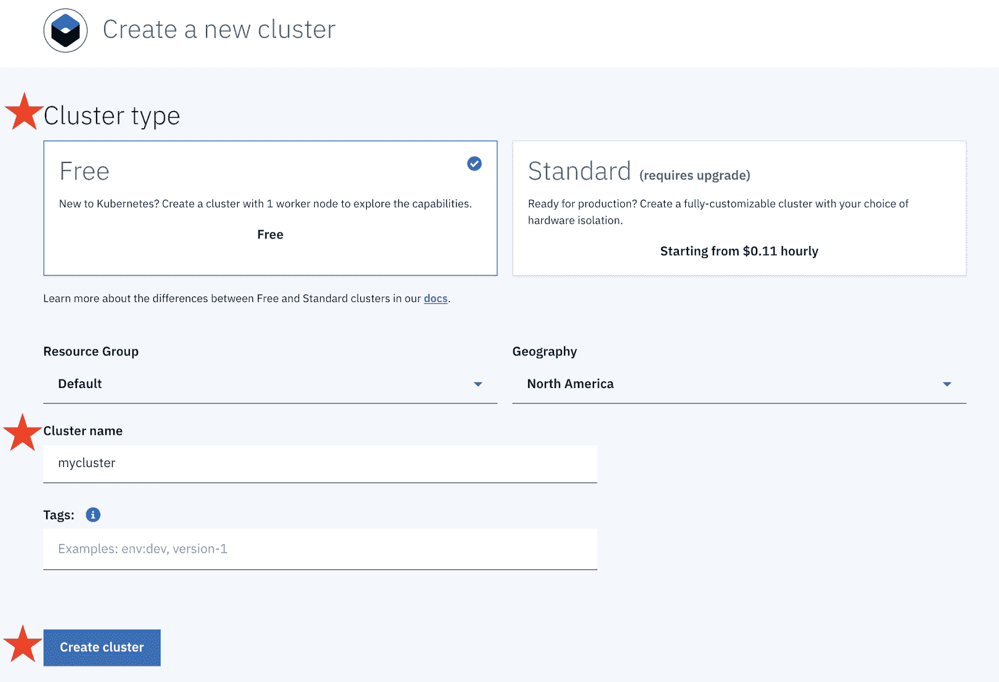
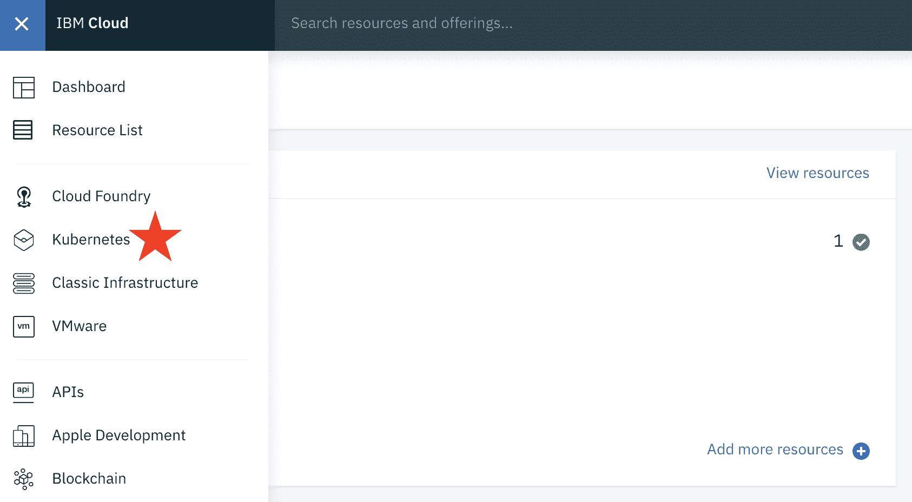
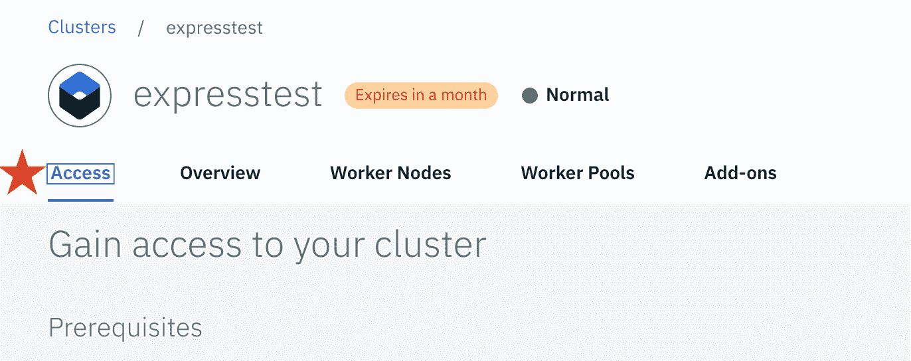
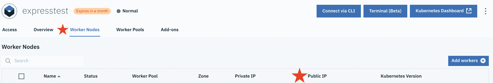

# 在 IBM Cloud 上构建云就绪的 Express.js 应用程序

> 原文：[`developer.ibm.com/zh/tutorials/deploy-cloud-native-expressjs-app-to-a-hosted-kubernetes-cluster/`](https://developer.ibm.com/zh/tutorials/deploy-cloud-native-expressjs-app-to-a-hosted-kubernetes-cluster/)

Web 应用程序功能强大，在企业和个人使用上具有很大的潜力。但在创建、使用和部署 Web 应用程序时，必须确保其可靠性、可扩展性、可用性等。通过将 Web 应用程序容器化并部署到云端，即可对这些重要任务加以妥善处理。

本教程将集中介绍如何在 IBM Cloud 上构建云就绪的 Express.js 应用程序。本教程是在 [Building a Cloud Ready Express.js Application](https://github.com/CloudNativeJS/tutorial/blob/master/README.md#building-a-cloud-ready-expressjs-application) 工作坊基础上的延伸。在本教程中，您将学习如何从原始教程中提取 Node.js 应用程序并将其部署到 IBM Cloud 上的 Kubernetes 集群中。

## 前提条件

**免费试用 IBM Cloud**

利用 [IBM Cloud Lite](https://cocl.us/IBM_CLOUD_GCG) 快速轻松地构建您的下一个应用程序。您的免费帐户从不过期，而且您会获得 256 MB 的 Cloud Foundry 运行时内存和包含 Kubernetes 集群的 2 GB 存储空间。[了解所有细节](https://www.ibm.com/cloud/blog/announcements/introducing-ibm-cloud-lite-account-2)并确定如何开始。

要完成本教程中的步骤，您需要：

*   具备有关容器技术的基本知识，包括 Kubernetes、Docker 和 Helm
*   创建一个 [IBM Cloud 帐户](https://cocl.us/IBM_CLOUD_GCG)
*   根据[原始教程](https://github.com/CloudNativeJS/tutorial/blob/master/README.md#building-a-cloud-ready-expressjs-application)创建应用程序，但可首先从下述第 1 步开始

## 1\. 创建 Kubernetes 集群

1.  从 [IBM Cloud 目录](https://cloud.ibm.com/kubernetes/catalog/cluster/create?cm_sp=ibmdev-_-developer-tutorials-_-cloudreg)创建 Kubernetes 集群

    > 注意：本教程可使用 **Free** 类型集群来完成。与 Kubernetes Ingress 相关的两个可选部分和定制域需要类型为 **Standard** 的付费集群。

2.  选择 **Cluster type**，然后选择 **Cluster name**，接着单击 **Create Cluster** 来配置 Kubernetes 集群。

    

3.  配置集群需耗时约 20 分钟。配置集群时，您可继续执行本教程的第 2 步，稍后再返回此步骤。当状态显示为 ***Normal*** 时，即表示集群已就绪。执行以下操作以检查集群状态：

    

    a. 选择左上角的导航菜单图标以显示导航菜单。然后转至 Kubernetes。

    ```
      
    ```

    b. 从侧边菜单选择 **Clusters**，以显示已配置的集群列表。找到已为此教程配置的集群。如果其状态为 ***Normal***（如上图所示），即表示该集群已准备就绪，可供使用。状态变为 ***Normal*** 后，单击集群名称以启动集群仪表板。

    c. 遵循新创建集群的 **Access** 下的说明来设置集群的访问权。

    

## 2\. 构建云就绪的 Express.js 应用程序

遵循[原始教程](https://github.com/CloudNativeJS/tutorial/blob/master/README.md#building-a-cloud-ready-expressjs-application)中从**设置**到**第 5 步**之间的说明进行操作。在原始教程中，您需要完成以下操作：

*   创建 Express.js 应用程序
*   向应用程序添加运行状况检查和指标
*   利用 Docker 构建应用程序
*   将应用程序与 Helm 打包在一起

完成此步骤后，第 1 步中的 Kubernetes 集群应已配置完成，此时可继续执行第 3 步。

## 3\. 将应用程序部署到 IBM Cloud 上的 Kubernetes 集群

现在您已构建了应用程序的 Helm Chart，应用程序部署流程已大幅简化。

使用以下步骤将 Express.js 应用程序部署到 Kubernetes 中：

1.  通过列出注册表中的所有名称空间来查找您的名称空间：

    ```
     ibmcloud cr namespaces 
    ```

    *   如果您没有名称空间或者要使用新的名称空间，那么可使用以下命令来创建一个：

        ```
        ibmcloud cr namespace-add <NAMESPACE> 
        ```

2.  将 **MYNAMESPACE** 和 **MYPROJECT** 环境变量分别设置为名称空间和项目名称

    ```
     export MYNAMESPACE=<NAMESPACE>
     export MYPROJECT=nodeserver 
    ```

3.  运行 `ibmcloud cr region` 来识别容器注册表。将 **MYREGISTRY** 环境变量设置为您的注册表。

    ```
     export MYREGISTRY=<REGISTRY> 
    ```

4.  运行 `docker tag nodeserver-run:1.0.0 ${MYREGISTRY}/${MYNAMESPACE}/${MYPROJECT}:v1.0.0`，为用于创建容器以本地运行应用的 Docker 镜像添加标记

5.  将该 Docker 镜像推送到 IBM Cloud 上的容器注册表：

    ```
     ibmcloud cr login
     docker push ${MYREGISTRY}/${MYNAMESPACE}/${MYPROJECT}:v1.0.0 
    ```

6.  初始化 Helm

    *   在 `chart/nodeserver` 中创建名为 `rbac.yaml` 的文件。此文件将充当配置文件，用于创建对集群具有 cluster-admin 角色的服务帐户。将以下内容复制到此文件中：

        ```
        apiVersion: v1
        kind: ServiceAccount
        metadata:
          name: tiller
          namespace: kube-system
        ---
        apiVersion: rbac.authorization.k8s.io/v1
        kind: ClusterRoleBinding
        metadata:
          name: tiller
        roleRef:
          apiGroup: rbac.authorization.k8s.io
          kind: ClusterRole
          name: cluster-admin
        subjects:
          - kind: ServiceAccount
            name: tiller
            namespace: kube-system 
        ```

    *   从 `chart/nodeserver` 目录运行以下命令来设置配置：

        ```
        kubectl create -f rbac.yaml
        helm init --service-account tiller 
        ```

    *   要验证 Helm 是否已正确配置并且正在运行，可运行 `helm version`，并验证 ***Client*** 与 ***Server*** 运行的版本是否相同。

7.  在 IBM Cloud 上安装 Helm Chart

    *   将 `chart/nodeserver/values.yaml` 文件修改为使用 IBM Cloud 容器注册表上的镜像。运行 `echo ${MYREGISTRY}/${MYNAMESPACE}/${MYPROJECT}`，并将 `repository` 字段更改为此命令的结果。此外，将 `tag` 字段更改为 `v1.0.0`。

        > 注意：如果容器注册表以 `bluemix.net` 结束，那么转至[此处](https://cloud.ibm.com/docs/services/Registry?topic=registry-registry_overview#registry_regions_local)，查找以 `icr.io` 结尾的已更新注册表区域的域名，并针对 `chart/nodeserver/values.yaml` 中的 `repository` 对其进行更新。

    *   从 `chart/nodeserver` 目录运行以下命令，以在云上安装 Helm Chart：

        ```
        helm install .--name ${MYPROJECT} 
        ```

        如果应用程序部署成功，您将会看到一条确认消息。要访问云上目前正在运行的应用程序，可运行 `kubectl get services` 并找到 `nodeserver-service` 的 `PORT`。接下来，转至 IBM Cloud 上的集群仪表板，找到集群工作节点的 `Public IP`。

        

        在浏览器中打开新选项卡/窗口，并转至<public ip="ip">：</public>

        现在，您应可在浏览器中看到云上正在运行的应用程序。

## 4\. 监视应用程序

IBM Cloud 提供了 Kubernetes 仪表板，用于在云上监视 Kubernetes。可通过 IBM Cloud 仪表板上的集群访问此仪表板。


## 恭喜！🎉

现在，您已在 IBM Cloud 上使用 Docker、Helm 和 Kubernetes 部署了 Express.js 应用程序！

本文翻译自：[Build a cloud-ready Express.js application on IBM Cloud](https://developer.ibm.com/tutorials/deploy-cloud-native-expressjs-app-to-a-hosted-kubernetes-cluster/)（2019-05-17）