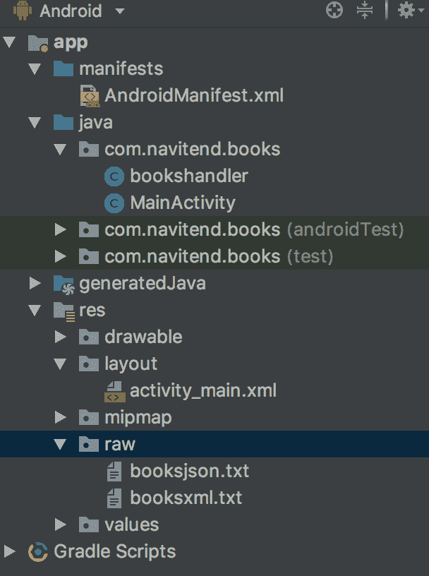
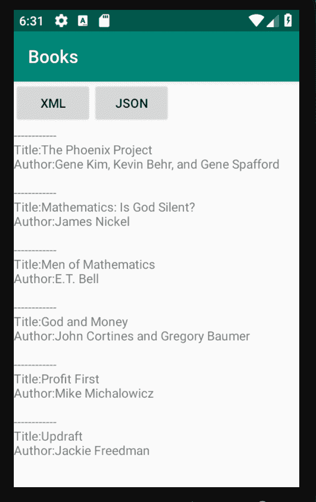

# 在 Android 应用程序上研究 JSON 和 XML 益处

> 原文：[`developer.ibm.com/zh/tutorials/x-andbene1/`](https://developer.ibm.com/zh/tutorials/x-andbene1/)

移动设备和平台吹嘘每个新版本都有更多特性和功能，并且仅仅数月重要通告就从主流移动设备提供商中分离出来了。标题多数是关于 UI 特性（例如先进的多点触摸功能和 Adobe® Flash® 技术）以及硬件提升（例如，处理器速度和存储容量）。但是至关重要的仍然是 “内容为王”。内容 — 或者，一般来说，是数据 — 在应用程序、服务器、移动设备和用户之间不停地被交换。智能手机，如 Apple 的 iPhone 和 Google 的 Android 只是标价过高且表现不佳的移动电话，而且也不能很好的工作 。

考虑到社会网络非比寻常的成功，例如：Facebook、LinkedIn 和 Twitter。单从特征和功能的角度来说，这些平台很大程度上都是单调的，之所以流行是因为会员和网站访问者可以从其公布的内容获益。而且，其内容逐渐可以通过移动设备访问。

本文演示了在 Android 平台上使用 XML 和 JSON 数据交换格式，并对先前一篇与 Twitter 数据交互的文章进行了更新。自第一次发布以来，XML（及其衍生产品）在这段时间内已经失宠，JSON 变得越来越流行。此外，数据交互的市场已经从使用 “feeds” 成熟到使用更复杂的应用程序编程接口或 API。一个“状态” feed 数据过去可以从 Twitter 以 XML 和 JSON 格式获得。XML feed 已被删除，并引入了新的 JSON API。

由于本文的重点是与 XML（仍然是一种可行且正在使用的数据格式）和 JSON 交互的基础知识，因此我们用另一个站点 encouragework.com 的“book list” 替换了 Twitter feed。这个列表以 XML 和 JSON 的形式提供，正如您将看到的，处理数据的编程方法在两种格式之间有很大的不同。

您会希望使用最新版本的 Android Studio 来运行本文附带的[示例代码](https://github.com/fableson/IBMBooks)。Android SDK API 版本对这个应用程序来说并不重要，因为 XML 和 JSON 解析的基础知识在 Android 的早期就已经存在了。要了解有关设置环境的更多信息，请访问 [Android 开发者网站](https://developer.android.com/)。

首先，我将简要介绍这两种数据格式，从 XML 开始。如果您已经熟悉 XML 和 JSON，那么可以安全地跳到应用机会：Book List，开始在 Android 上使用它们。

## XML：一个老朋友

事实上，近几年来为企业、web 或移动市场编程的人都遇到过 XML，几乎您见到的每个地方都有。

一个 XML 文档有一个可辨认的结构：一系列可以随意包含属性和子元素的元素。每个有效的 XML 文件第一行都有这样一个声明： `<?xml version="1.0" encoding="utf-8"?>` 。后面的内容根据应用程序而定。XML 的好处就在于它的自述性。

### XML 模式

尽管 XML 文档是自述的，但也必须遵循一定的规则和指导方针，这就需要 XML 模式，它是一个描述特定 XML 文件结构的文档。此类结构通常是冗长且复杂的。（值得争议的是，XML 对 IT 领域最糟糕的贡献是，当高度描述的数据结构这一理念成为时尚时导致了数据爆炸，且这种情况由于过去十年中磁盘存储技术成本大幅降低而加剧。）

当这些大且复杂的文件变得更规范时，对程序员和分析员来说手工处理通常是不可能完成的。为了解决这个问题，XML 编辑器和验证工具可以在文件和相关的任务管理方面给予帮助。例如，文档和遗留格式转换。

除了一般的文本数据，XML 过去常用于存储二进制数据，通过一个称为 `CDATA` 的特殊标记集合实现。一个 XML 文档中的 `CDATA` 标记可能含有各种数据，包括其他标记文本，假设该文本本身不含有 `CDATA` 。

通过使用 XML 作为一个结构来执行请求/响应查询，这并不是 API 使用该功能的常用方式。响应数据经常包含一个包含在 `CDATA` 标记中的 XML 结构。例如，一个 API 调用可能使用一个姓氏 `Mott` 来请求一个客户记录。数据找到时，封装到一个 XML 结构中并将其置于响应元素中，如清单 1 所示：

#### 清单 1\. 将数据封装到 XML 结构中并将其置于响应元素中

```
<?xml version="1.0" encoding="UTF-8" standalone="yes"?>
<request>
<query>
<lastname>Mott</lastname>
<maxhits>100</maxhits>
</query>
</request>

<?xml version="1.0" encoding="UTF-8" standalone="yes"?>
<response>
<returncode>200</returncode>
<query>
<lastname>Mott</lastname>
<hits>1</hits>
</query>
<data>
<![CDATA[
<contact>
<firstname>Troy</firstname>
<lastname>Mott</lastname>
<age>not telling</age>
</contact>
]]>
</data>
</response> 
```

### 工作空间中的 XML

今天，XML 是默认的、预定数据格式。尽管同一数据的其他格式也可用，但基于 XML 结构的可用性进行计划是一种最安全的方式。

Enterprise Resource Planning (ERP) 包频繁使用 XML 进行数据到任务的导入和导出。Internet 新闻网站经常将数据提供为 Really Simple Syndication (RSS) — 具有新闻阅读软件可以处理的预定义格式的 XML 文档。甚至文字处理应用程序（例如 OpenOffice.org 和 Microsoft® Office）也使用 XML。

现在的 Microsoft Office 文件是 PKZIP 兼容的，含有多个 XML 文档。每个 XML 在第一行都有这个常见声明。正如您在 清单 2 所看到的，阅读这些属性可能有点难：

#### 清单 2\. 每个文件第一行的常见声明

```
<?xml version="1.0" encoding="UTF-8" standalone="yes"?>
 <w:document xmlns:ve="http://schemas.openxmlformats.org/markup-compatibility/2006"
 xmlns:o="urn:schemas-microsoft-com:office:office"
 xmlns:r="http://schemas.openxmlformats.org/officeDocument/2006/relationships"
 xmlns:m="http://schemas.openxmlformats.org/officeDocument/2006/math"
 xmlns:v="urn:schemas-microsoft-com:vml"
 xmlns:wp="http://schemas.openxmlformats.org/drawingml/2006/wordprocessingDrawing"
 xmlns:w10="urn:schemas-microsoft-com:office:word"
 xmlns:w="http://schemas.openxmlformats.org/wordprocessingml/2006/main"
 xmlns:wne="http://schemas.microsoft.com/office/word/2006/wordml">
 <w:body><w:p w:rsidR="00B6337C" w:rsidRDefault="00663F0E"><w:r>
 <w:t xml:space="preserve">This is a sample </w:t></w:r><w:r
 w:rsidRPr="006906EA"><w:rPr><w:i/></w:rPr><w:t>Microsoft
 Word document</w:t></w:r><w:r><w:t xml:space="preserve"> used
 to </w:t></w:r><w:r w:rsidRPr="006906EA"><w:rPr><w:b/>
 <w:u w:val="single"/></w:rPr><w:t>demonstrate</w:t></w:r>
 <w:r><w:t xml:space="preserve"> some XML topics.</w:t></w:r>
 </w:p><w:p w:rsidR="00B14B2A" w:rsidRDefault="00B14B2A"/><w:p
 w:rsidR="00B14B2A"w:rsidRDefault="00B14B2A"><w:r><w:rPr>
 <w:noProof/></w:rPr><w:drawing><wp:inline distT="0" distB="0"
 distL="0" distR="0"><wp:extent cx="3276600" cy="3838575"/><wp:effectExtent
 l="19050" t="0" r="0" b="0"/><wp:docPr id="1" name="Picture 0"
 descr="frankableson.jpg"/><wp:cNvGraphicFramePr><a:graphicFrameLocks
 xmlns:a="http://schemas.openxmlformats.org/drawingml/2006/main"
 noChangeAspect="1"/></wp:cNvGraphicFramePr><a:graphic
 xmlns:a="http://schemas.openxmlformats.org/drawingml/2006/main"><a:graphicData
 uri="http://schemas.openxmlformats.org/drawingml/2006/picture"><pic:pic
 xmlns:pic="http://schemas.openxmlformats.org/drawingml/2006/picture">
 <pic:nvPicPr><pic:cNvPrid="0"name="frankableson.jpg"/><pic:cNvPicPr/>
 </pic:nvPicPr><pic:blipFill><a:blip r:embed="rId4"
 cstate="print"/><a:stretch><a:fillRect/></a:stretch>
 </pic:blipFill><pic:spPr><a:xfrm><a:off x="0" y="0"/>
 <a:ext cx="3276600" cy="3838575"/></a:xfrm><a:prstGeom
 prst="rect"><a:avLst/></a:prstGeom></pic:spPr></pic:pic>
 </a:graphicData></a:graphic></wp:inline></w:drawing>
 </w:r></w:p><w:p w:rsidR="00663F0E" w:rsidRDefault="00663F0E"/>
 <w:p w:rsidR="00CC16CE" w:rsidRDefault="00CC16CE"/><w:sectPr
 w:rsidR="00CC16CE" w:rsidSect="00B6337C"><w:pgSz w:w="12240" w:h="15840"/>
 <w:pgMar w:top="1440" w:right="1440" w:bottom="1440" w:left="1440" w:header="720"
 w:footer="720" w:gutter="0"/><w:cols w:space="720"/><w:docGrid
 w:linePitch="360"/></w:sectPr></w:body></w:document> 
```

XML 是自述的，但是并不意味着标记一定是容易理解的。这个虚构的示例展示了多个名称空间的使用，多个名称使得理解 XML 文件更有挑战性，如果不使用专用工具就很难理解。

XML 随处可见，但是对于 Android 程序员来说并不是一个明智的选择，特别是，如果数据结构成为与 XML 结构伴随着的数据爆炸的牺牲品。像 Android 这样通常在蜂窝数据网络（cellular data network）上工作的资源受限平台不能存储和解析大量 XML 数据。然而，如果特殊编程任务要求文本和二进制数据交换，那么 XML 是一个可靠的选择。

现在，让我们看一看数据交换的另一个格式：JSON。

## JSON：网络的新成员

越来越多的 Internet API 供应商提供 JSON 作为一种数据格式。JSON 在 Ajax (Asynchronous JavaScript and XML) 网页编程社区中享有盛名。Ajax 技术使 web 页面可以动态地更新，只更新所选区域的数据而不用更新整个页面。由于较少数据被传送 — 更重要的是，因为较少的数据被解析且显示在浏览器窗口 — 使用 AJAX 的应用程序比起传统 web 应用程序能够提供一个更好的用户体验。事实上，一个结构良好的 Ajax 应用程序可与智能或富客户端应用程序相抗衡。

当 Ajax 应用程序与 web 服务器交换数据时，经常需要某类数据的刷新，但不需要格式化。通常认为一个 web 服务器提供预格式化（preformatted）HTML 是一个糟糕的实践。相反的，一个格式良好的应用程序应该将数据内容发送到浏览器并应用一个 Cascading Style Sheets (CSS) 文件来产生视觉效果，比如颜色和特殊字体。

假设应用程序想要请求 Mr. Mott.（这是我们虚构的）的联系记录，应用程序返回浏览器的数据元素不止一个。它是如何包装的呢？在 清单 1 示例中，您可以使用一个简单的请求/响应结构。这已经足够了；然而它要求您解析来自服务器的每个响应、以某种结构（DOM）存储数据，然后更新网页内容。

还有一种选择，您可以从服务器上返回一些 JavaScript，并用它来直接处理。以下是一个虚拟应用程序的样例响应，对 Mott 查询（`http://<yourserver/app/searchcontact?Mott`）的响应。这个响应是一个 JavaScript 对象字符串表示 — 即 JSON 字符串（为了适应本文页宽在这分成两行）：

```
[{"firstname":"Troy","lastname":"Mott","age":"don't ask!"},{"firstname":"Apple seed",
   "lastname":"Mott's","age":"99"}] 
```

XML 以其冗长而著名，而 JSON 也因其难度而闻名。JSON 对象其构造是一个 *键*: *值* 对，对象元素之间用逗号隔开，每个对象被包含在一对大括号 `{}` 内。一组对象数组包含在一对方括号中。这是将数据行从一个数据库发送到一个对象数组的一种常见方法。其中每个数组元素对应数据库中的一行，每个对象属性代表数据的一列。如果您有一些 JSON 数据没有被清晰地解析并且难以读取，请浏览到 `jsonlint.com` – 此网站是您处理 JSON 数据的朋友！

清单 3 显示了一个在 HTML 页面中使用这类对象的示例。为简单起见，不包括服务器通信；相反，JSON 数据作为一个字符串变量 `serverresponse` 提供。

#### 清单 3\. 在 HTML 页面中使用一个 JSON 对象

```
<html>
<head>
<script language="JavaScript">
var serverresponse = "[{\"firstname\":\"Troy\",\"lastname\":\"Mott\",\"age\":\"don't
ask!\"},{\"firstname\":\"Apple seed\",\"lastname\":\"Mott's\",\"age\":\"99\"}]";
function updatepage()
{
    var contacts = eval(serverresponse );
    var i;
    var s = "Search Results:<br />";
    for (i=0;i<contacts.length;i++)
    {
        s = s + contacts[i].firstname + " " + contacts[i].lastname + "'s age is ... "
+ contacts[i].age + "<br />";
    }
    document.getElementById("target").innerHTML = s;
}
</script>
</head>
<body>
<button onclick="updatepage();">Search for Mott</button><br />
<span id="target"> </span>
</body>
</html> 
```

注意，这个示例使用 JavaScript 函数 `eval()` 将字符串转换成一个 JavaScript 数组。JSON 库可以为执行该步骤提供更快更安全的方法， 清单 3 中的方法并不是最佳实践。在这只是提供了一个 JSON 对象，如何用于 Ajax 应用程序的背景：JSON 结构可被客户端代码交换、解析和操作。清单 4 提供了一种更典型的获取和使用 JSON 数据的方法。

#### 清单 4\. 使用 JQuery 通过 Ajax 调用下载 JSON 数据

```
$.ajax( {
  "dataType": 'json', 
  "type": 'POST', 
  "url": '/someurl, 
  "data": {"q":"Mott"}, 
  "success": function(result) {
    console.log("result back from server",result);                
  }
} ); 
```

总的来说，JSON 是：

*   一种数据交换格式。
*   JavaScript 对象作为字符串编码的一种方式。
*   仅限于文本和数值。二进制值是明确不允许的。JSON 没有 `CDATA` 对应模式。对于其他类型的对象，一种常见的方法是将它们编码为 Base64，并将它们存储为“字符串”。
*   就数据大小而言比 XML 更经济。
*   已成为一种 Web 事实语言。

在 清单 3 和清单 4 中，客户端是一个运行客户端脚本的 web 浏览器。返回本文主题，接下来将研究在 Android 应用程序中 XML 和 JSON 的使用。

## 应用机会：Favorite book list

本文使用来自网站[`www.encouragework.com`](https://www.encouragework.com)的预取数据，该网站分别在 [`www.encouragework.com/booksxml`](https://www.encouragework.com/booksxml)和 [`www.encouragework.com/booksjson`](https://www.encouragework.com/booksjson) 上发布了一份 XML 和 JSON 格式的热门商业书籍列表。数据来源是 [`www.encouragework.com/books`](https://www.encouragework.com/books)。

图 1 展示了示例数据来源。

#### 图 1\. 示例数据来源


清单 5 包含以下 XML 片段：

#### 清单 5\. XML 片段

```
<?xml version="1.0" encoding="UTF-8"?>
<booksxml><book>
  <title>Every Good Endeavor</title>
  <author>Timothy Keller with Katherine Leary Alsdorf</author>
  <imagelink>https://www.encouragework.com/images/uploads/everygoodendeavor.jpg</imagelink>
  <amazonlink>https://www.amazon.com/dp/1594632820/?tag=navitend-20</amazonlink>
</book><book>
  <title>The 7 Habits of Highly Effective People</title>
  <author>Stephen Covey</author>
  <imagelink>https://www.encouragework.com/images/uploads/7habits.jpg</imagelink>
  <amazonlink>https://www.amazon.com/dp/1451639619/?tag=navitend-20</amazonlink>
</book><book>
  <title>Traction</title>
  <author>Gino Wickman</author>
  <imagelink>https://www.encouragework.com/images/uploads/tractionfront.jpg</imagelink>
  <amazonlink>https://www.amazon.com/dp/1936661837/?tag=navitend-20</amazonlink>
</book><book>
  <title>Get a Grip</title>
  <author>Gino Wickman and Bill Paton</author>
  <imagelink>https://www.encouragework.com/images/uploads/getagripfront.jpg</imagelink>
  <amazonlink>https://www.amazon.com/dp/1939529824/tag=navitend-20</amazonlink>
</book><book>
  <title>Mastering the Rockefeller Habits</title>
  <author>Verne Harnish</author>
  <imagelink>https://www.encouragework.com/images/uploads/rockefellerhabits.jpg</imagelink>
  <amazonlink>https://www.amazon.com/Mastering-Rockefeller-Habits-Increase-Growing/dp/0978774957/?tag=navitend-20</amazonlink>
</book><book>
  <title>Scaling Up</title>
  <author>Verne Harnish</author>
  <imagelink>https://www.encouragework.com/images/uploads/scalingup.jpg</imagelink>
  <amazonlink>https://www.amazon.com/Scaling-Up-Companies-Rockefeller-Habits/dp/0986019526/?tag=navitend-20</amazonlink>
</book><book>
  <title>Good To Great</title>
  <author>Jim Collins and Jerry Porras</author>
  <imagelink>https://www.encouragework.com/images/uploads/goodtogreat.jpg</imagelink>
  <amazonlink>https://www.amazon.com/dp/0066620996/?tag=navitend-20</amazonlink>
</book><book>
  <title>Scrum</title>
  <author>Jeff Southerland</author>
  <imagelink>https://www.encouragework.com/images/uploads/scrum.jpg</imagelink>
  <amazonlink>https://www.amazon.com/Scrum-Doing-Twice-Work-Half/dp/038534645X/?tag=navitend-20</amazonlink>
</book><book>
  <title>The Goal</title>
  <author>Eli Goldratt</author>
  <imagelink>https://www.encouragework.com/images/uploads/thegoal.jpg</imagelink>
  <amazonlink>https://www.amazon.com/Goal-Process-Ongoing-Improvement/dp/0884271951/?tag=navitend-20</amazonlink>
</book><book>
  <title>It’s Not Luck</title>
  <author>Eli Goldratt</author>
  <imagelink>https://www.encouragework.com/images/uploads/itsnotluck.jpg</imagelink>
  <amazonlink>https://www.amazon.com/Its-Not-Luck-Eliyahu-Goldratt/dp/0884271153/?tag=navitend-20</amazonlink>
</book><book>
  <title>Critical Chain</title>
  <author>Eli Goldratt</author>
  <imagelink>https://www.encouragework.com/images/uploads/criticalchain.jpg</imagelink>
  <amazonlink>https://www.amazon.com/Critical-Chain-Eliyahu-M-Goldratt/dp/0884271536/?tag=navitend-20</amazonlink>
</book><book>
  <title>The Phoenix Project</title>
  <author>Gene Kim, Kevin Behr, and Gene Spafford</author>
  <imagelink>https://www.encouragework.com/images/uploads/phoenixproject.jpg</imagelink>
  <amazonlink>https://www.amazon.com/Phoenix-Project-DevOps-Helping-Business/dp/0988262509/?tag=navitend-20</amazonlink>
</book><book>
  <title>Mathematics: Is God Silent?</title>
  <author>James Nickel</author>
  <imagelink>https://www.encouragework.com/images/uploads/mathisgodsilent.jpg</imagelink>
  <amazonlink>https://www.amazon.com/Mathematics-God-Silent-James-Nickel/dp/187999822X/?tag=navitend-20</amazonlink>
</book><book>
  <title>Men of Mathematics</title>
  <author>E.T. Bell</author>
  <imagelink>https://www.encouragework.com/images/uploads/menofmath.jpg</imagelink>
  <amazonlink>https://www.amazon.com/Mathematics-Touchstone-Book-E-T-Bell/dp/0671628186/?tag=navitend-20</amazonlink>
</book><book>
  <title>God and Money</title>
  <author>John Cortines and Gregory Baumer</author>
  <imagelink>https://www.encouragework.com/images/uploads/godandmoney.jpg</imagelink>
  <amazonlink>https://www.amazon.com/God-Money-Discovered-Business-Paperback/dp/1628624736/?tag=navitend-20</amazonlink>
</book><book>
  <title>Profit First</title>
  <author>Mike Michalowicz</author>
  <imagelink>https://www.encouragework.com/images/uploads/profitfirst.jpg</imagelink>
  <amazonlink>https://www.amazon.com/Profit-First-Transform-Cash-Eating-Money-Making/dp/073521414X/?tag=navitend-20</amazonlink>
</book><book>
  <title>Updraft</title>
  <author>Jackie Freedman</author>
  <imagelink>https://www.encouragework.com/images/uploads/updraft.jpg</imagelink>
  <amazonlink>https://www.amazon.com/Updraft-Aerodynamics-Leadership-Jacquelyn-Freedman/dp/0986156035/tag=navitend-20</amazonlink>
</book></booksxml> 
```

清单 6 是同一数据，这次是以 JSON 格式显示：

#### 清单 6\. JSON 格式的 feed 数据

```
{
        "title": "Every Good Endeavor",
        "author": "Timothy Keller with Katherine Leary Alsdorf",
        "imagelink": "https://www.encouragework.com/images/uploads/everygoodendeavor.jpg",
        "amazonlink": "https://www.amazon.com/dp/1594632820/?tag=navitend-20"
    },

    {
        "title": "The 7 Habits of Highly Effective People",
        "author": "Stephen Covey",
        "imagelink": "https://www.encouragework.com/images/uploads/7habits.jpg",
        "amazonlink": "https://www.amazon.com/dp/1451639619/?tag=navitend-20"
    },

    {
        "title": "Traction",
        "author": "Gino Wickman",
        "imagelink": "https://www.encouragework.com/images/uploads/tractionfront.jpg",
        "amazonlink": "https://www.amazon.com/dp/1936661837/?tag=navitend-20"
    },

    {
        "title": "Get a Grip",
        "author": "Gino Wickman and Bill Paton",
        "imagelink": "https://www.encouragework.com/images/uploads/getagripfront.jpg",
        "amazonlink": "https://www.amazon.com/dp/1939529824/tag=navitend-20"
    },

    {
        "title": "Mastering the Rockefeller Habits",
        "author": "Verne Harnish",
        "imagelink": "https://www.encouragework.com/images/uploads/rockefellerhabits.jpg",
        "amazonlink": "https://www.amazon.com/Mastering-Rockefeller-Habits-Increase-Growing/dp/0978774957/?tag=navitend-20"
    },

    {
        "title": "Scaling Up",
        "author": "Verne Harnish",
        "imagelink": "https://www.encouragework.com/images/uploads/scalingup.jpg",
        "amazonlink": "https://www.amazon.com/Scaling-Up-Companies-Rockefeller-Habits/dp/0986019526/?tag=navitend-20"
    },

    {
        "title": "Good To Great",
        "author": "Jim Collins and Jerry Porras",
        "imagelink": "https://www.encouragework.com/images/uploads/goodtogreat.jpg",
        "amazonlink": "https://www.amazon.com/dp/0066620996/?tag=navitend-20"
    },

    {
        "title": "Scrum",
        "author": "Jeff Southerland",
        "imagelink": "https://www.encouragework.com/images/uploads/scrum.jpg",
        "amazonlink": "https://www.amazon.com/Scrum-Doing-Twice-Work-Half/dp/
          038534645X/?tag=navitend-20"
    },

    {
        "title": "The Goal",
        "author": "Eli Goldratt",
        "imagelink": "https://www.encouragework.com/images/uploads/thegoal.jpg",
        "amazonlink": "https://www.amazon.com/Goal-Process-Ongoing-Improvement/dp/0884271951/
           ?tag=navitend-20"
    },

    {
        "title": "It’s Not Luck",
        "author": "Eli Goldratt",
        "imagelink": "https://www.encouragework.com/images/uploads/itsnotluck.jpg",
        "amazonlink": "https://www.amazon.com/Its-Not-Luck-Eliyahu-Goldratt/dp/0884271153/
          ?tag=navitend-20"
    },

    {
        "title": "Critical Chain",
        "author": "Eli Goldratt",
        "imagelink": "https://www.encouragework.com/images/uploads/criticalchain.jpg",
        "amazonlink": "https://www.amazon.com/Critical-Chain-Eliyahu-M-Goldratt/dp/0884271536/
           ?tag=navitend-20"
    },

    {
        "title": "The Phoenix Project",
        "author": "Gene Kim, Kevin Behr, and Gene Spafford",
        "imagelink": "https://www.encouragework.com/images/uploads/phoenixproject.jpg",
        "amazonlink": "https://www.amazon.com/Phoenix-Project-DevOps-Helping-Business/dp/0988262509/?tag=navitend-20"
    },

    {
        "title": "Mathematics: Is God Silent?",
        "author": "James Nickel",
        "imagelink": "https://www.encouragework.com/images/uploads/mathisgodsilent.jpg",
        "amazonlink": "https://www.amazon.com/Mathematics-God-Silent-James-Nickel/dp/187999822X/
           ?tag=navitend-20"
    },

    {
        "title": "Men of Mathematics",
        "author": "E.T. Bell",
        "imagelink": "https://www.encouragework.com/images/uploads/menofmath.jpg",
        "amazonlink": "https://www.amazon.com/Mathematics-Touchstone-Book-E-T-Bell/dp/0671628186/?tag=navitend-20"
    },

    {
        "title": "God and Money",
        "author": "John Cortines and Gregory Baumer",
        "imagelink": "https://www.encouragework.com/images/uploads/godandmoney.jpg",
        "amazonlink": "https://www.amazon.com/God-Money-Discovered-Business-Paperback/dp/1628624736/?tag=navitend-20"
    },

    {
        "title": "Profit First",
        "author": "Mike Michalowicz",
        "imagelink": "https://www.encouragework.com/images/uploads/profitfirst.jpg",
        "amazonlink": "https://www.amazon.com/Profit-First-Transform-Cash-Eating-Money-Making/dp/073521414X/?tag=navitend-20"
    },

    {
        "title": "Updraft",
        "author": "Jackie Freedman",
        "imagelink": "https://www.encouragework.com/images/uploads/updraft.jpg",
        "amazonlink": "https://www.amazon.com/Updraft-Aerodynamics-Leadership-Jacquelyn-Freedman/dp/0986156035/tag=navitend-20"
    } 
```

注意，在两个清单中除了状态更新外还有非常多附加数据。您只需要注意日期/时间，何时发布公告以及公告的内容。接下来，将向您展示解析该数据的 Android 应用程序的相关部分。

在我们的示例应用程序中，我们将解析这些数据结构并提取标题和作者字段。接下来，我将向您展示解析这些数据的 Android 应用程序的相关部分。完整的项目可从我的 [Github repo](https://github.com/fableson/IBMBooks) 下载。

[获得代码](https://github.com/fableson/IBMBooks)

## BOOKS 应用程序

##### 真实的实时更新

需要注意的是，示例应用程序没有实时地从 web 抓取数据，尽管我们期盼一个真实应用程序该如此。由于数据 feeds 取自原始资源文件夹，因此应用程序关注的是解析方面。关使用 Android 进行网络连接的信息，请参阅参考资源。

Android 应用程序很简单。其中包含 XML 和 JSON 数据资料的全部副本。用户可以任选其一进行分析。 图 2 显示 Android Studio 中项目文件的结构。

#### 图 2\. 以 XML 和 JSON 格式列出书籍的文件结构



图 3 显示选择解析选项之前的应用程序 UI：

#### 图 3\. 选择解析选项之前的应用程序 UI


应用程序 UI 有两个按钮，XML 和 JSON，接着是说明文本。 清单 7 包含该 UI 的布局，在项目的 res/layout 文件夹中的 main.xml 中可以找到：

#### 清单 7\. UI 的布局

```
<?xml version="1.0" encoding="utf-8"?>
<LinearLayout xmlns:android="http://schemas.android.com/apk/res/android"
    xmlns:app="http://schemas.android.com/apk/res-auto"
    xmlns:tools="http://schemas.android.com/tools"
    android:layout_width="match_parent"
    android:layout_height="match_parent"
    android:baselineAligned="false"
    android:orientation="vertical"
    tools:context="com.navitend.books.MainActivity">

    <LinearLayout xmlns:android="http://schemas.android.com/apk/res/android"
        xmlns:app="http://schemas.android.com/apk/res-auto"
        xmlns:tools="http://schemas.android.com/tools"
        android:layout_width="match_parent"
        android:layout_height="wrap_content"
        android:layout_gravity="center_horizontal"
        android:orientation="horizontal"
        tools:context="com.navitend.books.MainActivity">

        <Button
            android:id="@+id/parseXML"
            android:layout_width="wrap_content"
            android:layout_height="wrap_content"
            android:text="XML" />

        <Button
            android:id="@+id/parseJSON"
            android:layout_width="wrap_content"
            android:layout_height="wrap_content"
            android:text="JSON" />
    </LinearLayout>

    <TextView
        android:id="@+id/tvData"
        android:layout_width="match_parent"
        android:layout_height="wrap_content"
        android:scrollbars="vertical"
        android:text="Select a Button to Proceed" />

</LinearLayout> 
```

我们定义了 **XML** 和 **JSON** 按钮和一个用于展示结果的 `TextView`。

注意多个 `LinearLayout` 结构的使用。第一个是垂直对齐，其中既含有一个带有水平结构的 `LinearLayout` 和一个 `ScrollView` 。内层 `LinearLayout` 含有两个 `Button` 小部件。这个布局很冗长，一般在 `onCreate()` 方法中调用，见清单 8：

#### 清单 8\. `onCreate()` 方法

```
Button btnXML;
Button btnJSON;
TextView tvData;
String TAG = this.getClass().getSimpleName();
@Override
protected void onCreate(Bundle savedInstanceState) {
    super.onCreate(savedInstanceState);
    setContentView(R.layout.activity_main);

    btnXML = (Button) findViewById(R.id.parseXML);
    btnJSON = (Button) findViewById(R.id.parseJSON);
    tvData = (TextView) findViewById(R.id.tvData);
    tvData.setMovementMethod(new ScrollingMovementMethod());

    btnXML.setOnClickListener(new Button.OnClickListener() {
        public void onClick(View v) {
            Log.i(TAG,"XML Clicked");
            tvData.setText("attempt to parse XML");
            examineXMLFile();
        }
    });

    btnJSON.setOnClickListener(new Button.OnClickListener() {
        public void onClick(View v) {
            Log.i(TAG,"JSON Clicked");
            tvData.setText("attempt to parse JSON");
            examineJSONFile();
        }
    });

} 
```

`examineXMLFile()` 方法控制 XML 解析。

## XML 解析

##### SAX 对 DOM

Android 也支持一个 DOM 解析器，这需要占用较大的内存空间，但是降低在 SAX 解析器中的复杂性。对于示例 BOOKS 这样的应用程序，仅仅对大数据资源很小的一个子集感兴趣，SAX 方法可能是处理作业的最好工具。

XML 数据解析通常是使用一个 SAX 风格的解析器完成的。对于这类解析器，您可以建立一个 `InputSource` 指向源 XML 数据，并在文档 “运行” 时提供一个接收某些事件的处理程序。 清单 9 展示 `examineXMLFile()` 方法，执行以下任务：

*   使用原始资料中的 XML 文件建立 `InputSource`
*   创建一个 `SAXParser` ，关联处理程序 `booksHandler` （见 清单 10 ）
*   调用解析器，在 `TextView` 小部件中显示结果，在布局文件中作为 `R.id.txtData` 识别，在代码中作为 `tvData` 引用
*   如果有错误，也显示在 `LogCat` 窗口中

#### 清单 9\. `examineXMLFIle()` 方法

```
void examineXMLFile() {
    try {
        Log.i(TAG,"Beginning examination of XML data");
        InputSource is = new InputSource(getResources().openRawResource(R.raw.booksxml));

        // create the factory
        SAXParserFactory factory = SAXParserFactory.newInstance();

        // create a parser
        SAXParser parser = factory.newSAXParser();

        // create the reader (scanner)
        XMLReader xmlreader = parser.getXMLReader();

        // instantiate our handler
        bookshandler bh = new bookshandler();

        // assign our handler
        xmlreader.setContentHandler(bh);

        // perform the synchronous parse
        xmlreader.parse(is);

        // should be done... let's display our results
        tvData.setText(Html.fromHtml(bh.getResults()));

    } catch (Exception e) {
        Log.e(TAG, "Error parsing XML data " + e.getMessage());
    }
} 
```

虽然 `examineXMLFile()` 设置好了一切，但应用程序角度来看，真正的解析工作实际是在处理程序中进行的，该处理程序是在 twitterFeedHandler.java 文件中实现的。实现 `DefaultHandler` 接口的类见清单 10 ：

#### 清单 10\. `bookshandler` 类

```
/*
 *
 * fableson@navitend.com
 *
 */

package com.navitend.books;

import android.util.Log;

import org.xml.sax.Attributes;
import org.xml.sax.SAXException;
import org.xml.sax.helpers.DefaultHandler;

import android.content.Context;
import android.os.Handler;
import android.os.Message;
import android.util.Log;

public class bookshandler extends DefaultHandler {

    StringBuilder sb = null;
    String ret = "";
    boolean bStore = false;
    int howMany = 0;

    bookshandler() {
    }

    String getResults()
    {
        return "<p>Books from<br>https://www.encouragework.com/books</p><p>There are [" + howMany + "] books:</p>" + ret;
    }
    @Override

    public void startDocument() throws SAXException {
        // initialize "list"
    }

    @Override
    public void endDocument() throws SAXException {

    }

    @Override
    public void startElement(String namespaceURI, String localName, String qName, Attributes atts) 
            throws SAXException {

        try {
            if (localName.equals("book")) {
                this.sb = new StringBuilder("");
                bStore = false;
            }
            if (localName.equals("title") || localName.equals(("author"))) {
                bStore = true;
            }
        } catch (Exception ee) {

            Log.d("error in startElement", ee.getStackTrace().toString());
        }
    }

    @Override

    public void endElement(String namespaceURI, String localName, String qName) throws SAXException {

        if (bStore) {
            if (localName.equals("title")) {
                ret += "<u>" + sb.toString() + "</u><br>";
                sb = new StringBuilder("");
                return;

            }

            if (localName.equals("author")) {
                ret += "by:" + sb.toString() + "<br/><br/>";
                sb = new StringBuilder("");
                return;

            }

        }
        if (localName.equals("book")) {
            howMany++;
            bStore = false;
        }
    }

    @Override

    public void characters(char ch[], int start, int length) {

        if (bStore) {
            String theString = new String(ch, start, length);

            this.sb.append(theString);
        }
    }

} 
```

清单 10 中有一些值得注意的细节，首先考虑到的是 SAX 解析器是一个基于事件的解析器，这就意味着使用 SAX 进行解析时要建立真实文件。在文档开始和结束、标记开始和结束、发现数据时，事件被触发。这意味着您必须定义一个数据结构来保留感兴趣的数据、抛弃余下的。注意，使用 `StringBuilder` 和附加数据是因为一个特定数据在 `InputSource` 上能通过多个读取来进行处理。千万不要以为所有数据都在给定的调用 `characters()` 方法中提供。

应用程序将数据收集到一个简单的格式化字符串中。而另一个示例中则是把这些实体放在一个集合类或数据库中，特别是如果有大量的操作都发生在解析之后。

`getResults()` 方法是该类特有的，用来收集这类数据的集中表示法，并将其提供给应用程序，这不是 `DefaultHandler` 接口的一部分。XML 解析的结果是用一些最简单的 HTML 格式化的。

图 4 展示了已解析的 XML 数据。

#### 图 4\. 已解析的 XML 数据


尽管从构建、管理和导航结果结构方面来说，使用 SAX 解析器解析 XML 数据并不容易，但其主要优势是快速和极大地减少了解析过程中和解析之后的 RAM 需求数量。

现在看一下 Android 解析 JSON 数据的方法。

## JSON 解析

在用户选择 JSON 按钮时解析 JSON 数据就开始了。调用 `examineJSONFile()` 方法，如 清单 11 所示。不需要额外的处理类。因为所有解析和文档管理都在 Android 提供的库中进行，所有 JSON 相关的代码都包含在这个方法中。

#### 清单 11\. 调用 `examineJSONfile()` 方法

```
void examineJSONFile()
{
    try
    {
        Log.i(TAG,"Beginning examination of JSON data");
        String x = "";
        InputStream is = this.getResources().openRawResource(R.raw.booksjson);
        byte [] buffer = new byte[is.available()];
        while (is.read(buffer) != -1);
        String jsontext = new String(buffer);
        JSONArray entries = new JSONArray(jsontext);

        x = "encouraggework.com book list in JSON parsed.\nThere are [" + entries.length() + "] books\n\n";

        int i;
        for (i=0;i<entries.length();i++)
        {
            JSONObject book = entries.getJSONObject(i);
            x += "------------\n";
            x += "Title:" + book.getString("title") + "\n";
            x += "Author:" + book.getString("author") + "\n\n";
        }
        tvData.setText(x);
    }
    catch (Exception je)
    {
        tvData.setText("Error w/file: " + je.getMessage());
    }
} 
```

像之前显示的 XML 例程一样，代码是从原始资源文件夹的文件中读取的。数据被整体读到内存中，转换成一个 `java.lang.String`，然后解析成 `JSONArray`。要注意的是，正如此例所示，一个特殊的字符串能直接解析成一个数组，或者也可以直接解析成一个 `JSONObject`。因为 Twitter 数据是一个对象数组，整体解析成一个数组然后按顺序逐个访问对象是明智的选择。

该方法的流程简单明了，一旦数据被解析，代码建立一个类似于 XML 解析器处理程序方法的字符串表示。有趣的是数据将由您来管理；您不需要建立额外内存结构来容纳数据，同样地，应用程序预先就知道在 `JSONArray` 中有多少个条目（在这个例子中是 17 个）。

图 5 展示了 JSON 解析的输出。注意，这只是一个简单的文本字符串 &amdash; 这里没有进行 HTML 格式设置，只是为了稍微改变一下。

#### 图 5\. JOSN 输出{: #图-5-JOSN-输出}



尽管 JSON 解析在编程上简单得多，但并不是没有代价的。它要增加内存消耗，在处理之前整体读取数据流并进行存储。相反的，SAX XML 方法仅使用相关数据。另外，如果解析特殊 JSON 对象的内存是足够的，则这个方法将很受应用程序欢迎，特别是，几乎不需要使用 DOM 的应用程序。

## 结束语

本文在 Android 应用程序背景下介绍了 XML 和 JSON 数据交换格式。比起 JSON 方法，XML 方法更快、内存受限更小 — 但是以增加复杂性为代价。在第二部分，我将介绍一些结合使用 JSON 方法的先进技术，例如，基于 WebKit 的 WebView 小部件，并为 Android 应用程序定制动态应用程序逻辑。

本文翻译自：[Explore the benefits of JSON and XML in Android applications](https://developer.ibm.com/tutorials/x-andbene1/)（2010-07-20）