# 使用 Android 和 XML 构建动态用户界面

> 原文：[`developer.ibm.com/zh/tutorials/x-andddyntut/`](https://developer.ibm.com/zh/tutorials/x-andddyntut/)

## 开始之前

为更好地利用本文，您应该使用 Android SDK 来构造 Android 应用程序。完成本文之后，您将了解如何使用 HTTP(S) 执行从应用程序到 web 服务器的通信，以及如何使用 DOM 解析器解析 XML。在此过程中，您将创建自定义和动态的用户界面布局、多线程通信、消息处理程序、以及进程对话框。至少，您将了解 AndroidManifest.xml 和服务器端脚本编写。

### 关于本教程

本教程介绍一个用于在 Android 设备上进行移动数据收集的动态表单的架构。我将首先介绍一个高级架构，讨论这样一个应用程序在数据收集的大环境中的应用。快速浏览这个已完成的项目，包含每个源文件，对本教程将要介绍的内容有一个大概了解。就像 “厨艺展示” 一样，您使用一些 Java 类从头开始构建这个应用程序，每个 Java 类都被小心引入并关联到应用程序的其他方面，其中最显著是一个数据模型，这个表单引擎就是基于它构造的。最后，您将表单数据保存在服务器上并简单地查看应用程序的服务器端。

### 先决条件

表 1 显示了这个项目需要的工具。

#### 表 1\. 这个作业需要的工具

| 工具 | 注释 |
| --- | --- |
| Android Studio | 构建 Android 应用的 集成开发环境（IDE）。 |
| Android SDK | Android Software Developer 工具包。 |
| Web 服务器 | 所有支持 PHP 的。您可以将脚本轻松移植到另一个服务器环境。 |

我使用 Android Studio 3.2.1 和 Android SDK version 27（支持标签为 8.1 (Oreo) 的 Android 发行版）在 MacBook 上创建了本教程的样例代码。本教程代码没有利用这个 SDK 的任何特定特性，这个应用程序应该能够在上溯到 1.5 版的所有 Android 版本上正常运行。参见参考资源中所有这些工具的链接。

## 数据收集

我们首先简要讨论数据收集，以及如何在使用 Android 移动设备时轻松实现数据收集。

### 一个 Android 数据收集框架

收集数据是计算机时代之前的任务。计算机已经变成一个日常 “订书钉”，使我们思考、查找和使用信息的方式发生了革命性的变化。市值数百亿美元的公司要归功于他们在存储、检索和管理海量信息中的高效。今天使用的数据库由各种各样架构的系统供给，包括大型机、客户服务器、web 应用程序、以及现在的移动应用程序。

物理存货和周期计数应用程序是移动计算的早期实用应用程序。这些应用程序通常是 *批量数据收集* ，其中硬件需要一个扩展插口（docking station）来上传收集的信息。

从出现到现在，移动应用程序市场已经走过了很长一段路程，无线连通性和设备几乎遍布各种文化和市场，渗透到日常生活的每个方面。

尽管数据收集方式可能已经变得更具流动性，但数据收集的核心并没有发生太大变化。用户必须看到一些问题，并且要有一种简单的响应方式。本教程演示如何为 Android 驱动的移动电话构造一个简单的数据收集框架，其中要利用一个 XML 支持的动态元数据结构。

## 应用程序架构

在深入代码之前，我们先在一个非常高的层面上检查应用程序设置。

### Forms Engine 一瞥

我们首先浏览一下这个 Forms Engine 应用程序的各个方面。图 1 描绘这个应用程序与提供各种内容的数据录入表单的一个或多个服务器之间的关系。

#### 图 1\. 应用程序架构

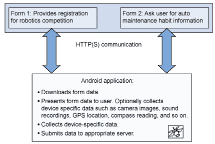

在图 1 中，Form 1 提供 Robotics Competition 的注册，Form 2 要求用户提供关于他们的汽车维修习惯的信息。这些表单和 Android 应用程序通信使用 HTTP(S)来：

*   下载表单数据。
*   向用户显示表单数据并（可选）收集特定于设备的数据，比如相机图像、声音录制、GPS 定位、或者罗盘读数。
*   收集用户提供的数据。
*   将数据提交给适当服务器。

本教程的服务器端实现为一对文件：一个描述表单的 XML 文档和一个负责记录表单提交的 PHP 文档。这个 Android 应用程序是一个用 Java 代码编写的原生应用程序，使用 Android SDK，在 Android Studio 中编码。

表 2 显示完整应用程序的源文件。您可以[下载包含所有这些源文件的压缩文件](http://public.dhe.ibm.com/software/dw/xml/x-andddyntut/formsengine.zip) 。本教程将详细介绍每个源文件。

#### 表 2\. 必要的应用程序源文件

| 文件名 | 注释 |
| --- | --- |
| XmlGui.java | Android Activity 的入口点 |
| XmlGuiForm.java | 一个表单的高级数据模型和方法 |
| XmlGuiFormField.java | 表示一个表单域，持有一个表单的每个字段的元数据 |
| XmlGuiEditBox.java | 实现一个文本框类型用户界面元素 |
| XmlGuiPickOne.java | 实现一个下拉列表类型用户界面元素 |
| RunForm.java | 使用上述类处理一个表单 |
| activity_xml_gui.xml | 应用程序用户界面主页 |
| AndroidManifest.xml | 此 Android 应用程序的部署描述符 |
| xmlgui1.xml | 收集 Robotics 比赛注册信息的样例表单 |
| xmlgui1-post.php | 处理表单提交的 PHP 脚本 |
| xmlgui2.xml | 汽车维修习惯调查的样例表单 |

图 2 展示本教程末尾完成的应用程序在 Android Studio 中的项目结构。

#### 图 2\. Android Studio 中的项目

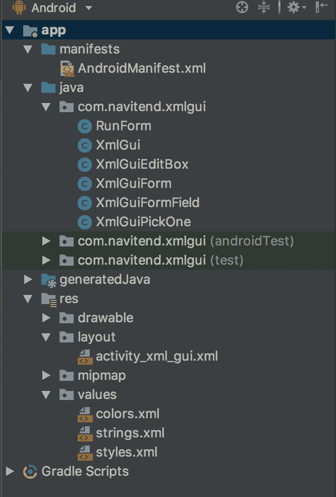

如果您没有一个正在运行的 Android 开发环境，那么现在是安装 Android Studio 的绝好时机。要了解如何设置一个 Android 开发环境，参阅参考资源中必要工具的链接，以及一些关于如何为 Android 开发应用程序的入门文章和教程。熟悉 Android 有助于理解本教程。

您已经对架构和应用程序有一个大致了解，现在就开始吧！

## 项目和数据模型

我们现在已准备好在 Android Studio 中启动这个 Android 项目，创建允许您为这个 Forms Engine 应用程序存储和管理元数据的数据模型和类。

### 创建项目

创建 Android 应用程序从我们熟悉的地方开始：打开 Android Studio 并选择 **File > New** ，如图 3 所示。

#### 图 3\. 新建一个 Android 应用程序


这个步骤将启动 Android Studio New project 向导。选择 **Project** 。确保向项目提供一个有效的标识符（我使用的是 **XMLGUI** ）。在下一个屏幕上选择您的想要的项目目标设备版本，如图 4 所示。

#### 图 4\. 设置一个新项目

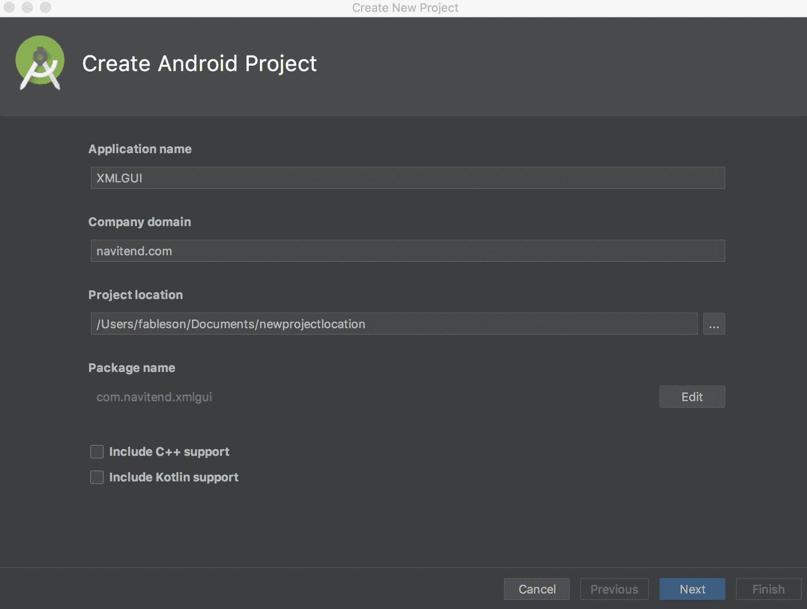

接下来，我们需要确定我们想要的的应用程序对应的目标 Android 版本。如图 5 所示，我选择 Android 8.1 (Oreo)。

#### 图 5\. 目标 Android 设备

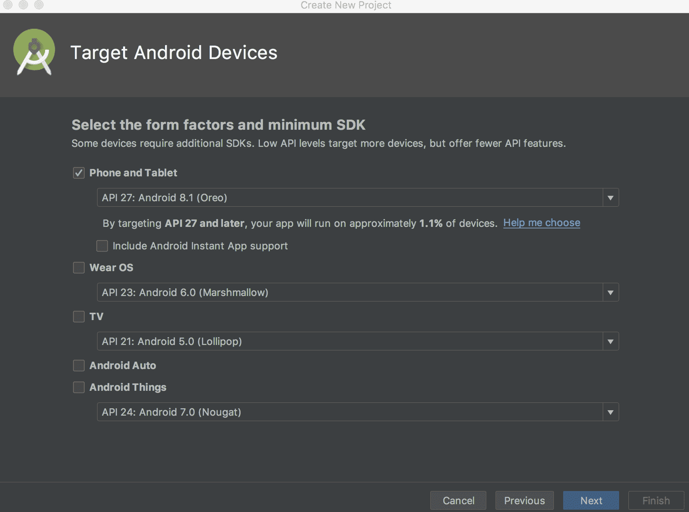

然后，选择 Empty Activity，如图 6 所示。

#### 图 6\. 选择 Empty Activity {: #图-6-选择-empty-activity

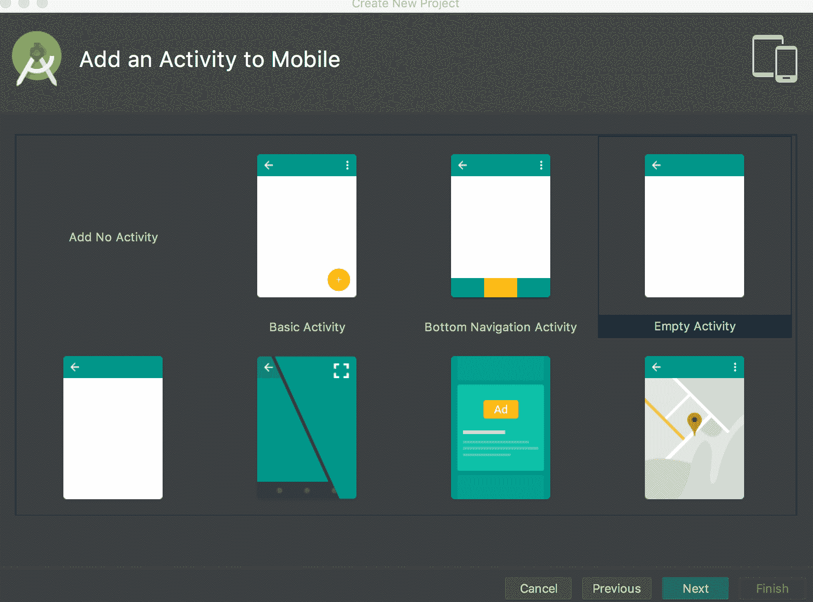

在下一个屏幕上，为您的 Activity 指定一个名字。我命名为 XmlGui。您相关联的布局文件将被命名为 activity_xml_gui.xml，如图 7 所示。

#### 图 7\. 为您的 Activity 命名

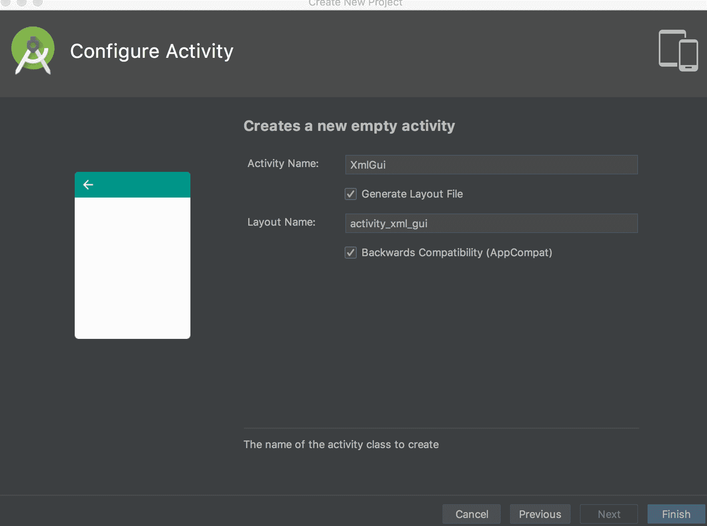

项目创建后其样子应该类似于图 1。

现在，项目已创建，确保应用程序干净地构建并在 Android Emulator 中运行是一个最佳实践。为确保构建，选择 Android. Studio 中的锤子图标，然后运行程序按钮 （VCR play 按钮）。这导致众多构建步骤生成必要的中间文件，为应用在真实的设备或者 Android 模拟器实例总运行做准备。如果需要帮助，参阅参考资源部分查看如何使用 Android Studio 构建并运行 Android 应用的基本步骤。

此项目已在 Android 模拟器中创建、配置并正确启动，现在可以为 Android 创建 XML 驱动的数据收集工具了。

### 数据模型

这个应用程序的具体细节要求它向一个用户显示输入元素，验证数据，然后将数据提交到一个指定服务器。如果这个应用程序只针对新记录设置，那么它什么用处也没有，因为它不支持查询现有记录以便编辑或删除。

要向应用程序提供足够的关于如何显示数据录入表单的指示，需要一个信息集（通常称为 *元数据* ）。元数据是关于数据的数据。简言之，这个应用程序必须理解几个数据元素，包括：

*   **Form Name** — 人们可读的表单名称
*   **Form Identifier** — 这个元数据收集的惟一标识符
*   **Submission URL** — 收集到的数据的发送地址
*   **一个或多个字段** — 这些字段可能是文本、数字，或者 “从列表中选择” 类型的字段

几乎所有种类的问题都映射到这三种类型的用户界面元素中的一种。例如，可以实现一个复选框作为一个 Yes 或 No 选择字段。可以实现多重选择（multi-select）作为多选字段。当然，您可以随意扩展本教程中展示的代码。

对于您的应用程序，使用场景如下：您在参加一个活动，其中您可以注册一个或多个项目。您可以填写一张注册表，也可以等到回家后登录该组织的网站进行注册。在本例中，您将假定一位用户将通过在一个 Android 设备上下载一个动态表单，以便在现场从他的手机填写一张简单表单，提供申请者的姓名、性别和年龄。

清单 1 显示了 xmlgui1.xml 的内容，该文件表示一个 Robotics 俱乐部活动的注册表单。

#### 清单 1\. xmlgui1.xml

```
<?xml version="1.0" encoding="utf-8"?>
<xmlgui>
<form id="1" name="Robotics Club Registration"
   submitTo="http://serverurl/xmlgui1-post.php" >
<field name="fname" label="First Name" type="text" required="Y" options=""/>
<field name="lname" label="Last Name" type="text" required="Y" options=""/>
<field name="gender" label="Gender" type="choice" required="Y" options="Male|Female"/>
<field name="age" label="Age on 15 Oct. 2010" type="numeric" required="N" options=""/>
</form>
</xmlgui> 
```

注意关于这个 XML 文档的以下几点：

*   这个 XML 非常容易解析，这要归功于元素属性的广泛使用。之所以使用这种方法，原因是与多个子元素和标记相比，它使提取数据更容易。以这种方式使用属性还能保持较小的下载大小，并有助于保持较低的解析时间。
*   `submitTo` 属性告知应用程序，数据收集完成后将要发送到的位置。
*   每个 `field` 元素同时提供一个字段名和一个标签的属性。尽管这些值是相关的，但您希望每个 `name` 属性的值都保持惟一，以便接收应用程序能够正确解析并处理它们。您还应该向用户提供一个提示性 `label` 值，提示用户什么种类的数据将进入一个特定字段。
*   您可以轻松扩展这个方法以包含每个字段的默认值，一个用于验证的 `regex` 表达式，或者一个获取关于特殊字段的更多信息的链接。
*   `options` 字段用作 `choice` 字段的一个受限列表。

基本了解数据模型后，现在看看负责将这个 XML 数据转化为一个有用应用程序的代码。

### 表示数据

解析数据是一个非常机械的练习，将在本教程后面展示。在检查解析流程之前，应用程序需要某个位置来在内存中存储和管理这个元数据。出于这个目的，您拥有两个 Java 类，一个用于表单，一个用于表示表单字段。我们首先查看清单 2 中的 `XmlGuiForm.java` 。

#### 清单 2\. XmlGuiForm.java

```
package com.navitend.xmlgui;

import android.util.Log;

import java.util.Vector;
import java.util.ListIterator;
import java.net.URLEncoder;

public class XmlGuiForm {

    private String formNumber;
    private String formName;
    private String submitTo;
    public Vector<XmlGuiFormField> fields;

    public XmlGuiForm()
    {
        this.fields = new Vector<XmlGuiFormField>();
        formNumber = "";
        formName = "";
        submitTo = "loopback"; // ie, do nothing but display the results
    }
    // getters & setters
    public String getFormNumber() {
        return formNumber;
    }

    public void setFormNumber(String formNumber) {
        this.formNumber = formNumber;
    }

    public String getFormName() {
        return formName;
    }
    public void setFormName(String formName) {
        this.formName = formName;
    }

    public String getSubmitTo() {
        return submitTo;
    }

    public void setSubmitTo(String submitTo) {
        this.submitTo = submitTo;
    }

    public Vector<XmlGuiFormField> getFields() {
        return fields;
    }

    public void setFields(Vector<XmlGuiFormField> fields) {
        this.fields = fields;
    }

    public String toString()
    {
        StringBuilder sb = new StringBuilder();
        sb.append("XmlGuiForm:\n");
        sb.append("Form Number: " + this.formNumber + "\n");
        sb.append("Form Name: " + this.formName + "\n");
        sb.append("Submit To: " + this.submitTo + "\n");
        if (this.fields == null) return sb.toString();
        ListIterator<XmlGuiFormField> li = this.fields.listIterator();
        while (li.hasNext()) {
            sb.append(li.next().toString());
        }

        return sb.toString();
    }

    public String getFormattedResults()
    {
        StringBuilder sb = new StringBuilder();
        sb.append("Results:\n");
        if (this.fields == null) return sb.toString();
        ListIterator<XmlGuiFormField> li = this.fields.listIterator();
        while (li.hasNext()) {
            sb.append(li.next().getFormattedResult() + "\n");
        }

        return sb.toString();
    }

    public String getFormEncodedData()
    {
        try {
            int i = 0;
            StringBuilder sb = new StringBuilder();
            if (this.fields == null) return sb.toString();
            ListIterator<XmlGuiFormField> li = this.fields.listIterator();
            while (li.hasNext()) {
                if (i != 0) sb.append("&");
                XmlGuiFormField thisField = li.next();
                sb.append(thisField.name + "=");
                String encstring = new String();
                String rawString = (String) thisField.getData();
                encstring = URLEncoder.encode(rawString);
                sb.append(encstring);
                i++;
            }
            return sb.toString();
        }
        catch (Exception e) {
            e.printStackTrace();
            return "ErrorEncoding " + e.getMessage();
        }
    }

} 
```

关于 `XmlGuiForm` 类，有几个重要项目需要注意：

1.  这里有 4 个成员变量：

    *   `formNumber` ：这是服务器端表单分发机制的惟一标识符。
    *   `formName` ：这是表单标题，向用户提供上下文和确认。
    *   `submitTo` ：这是应用程序提交输入的数据（经过验证）的 URL。这个值也可以是一个 loopback。在 loopback 场景中，数据显示给用户，而不是提交到服务器。这对测试比较有用。
    *   `fields` ：这是被模板化以持有表单的字段数据的 Vector 类。 清单 3 展示了 `XmlGuiFormField.java` 的细节。
2.  一系列针对这些变量的 `getters` 和 `setters` 。
3.  `toString()` 和 `getFormattedResults()` 方法负责生成 `XmlGuiForm` 类的可读摘要。
4.  `getFormEncodedData()` 方法在准备将数据提交到 `submitTo` 属性中指定的 URL 时使用。
5.  这个代码不使用严格连接的 `java.lang.String` 类，而是采用一个 `StringBuilder` 作为构建理想数据字符串的一个更内存高效的方法。
6.  `URLEncoder` 类用于准备将数据提交到服务器。这使得数据实际上看起来就像一个传统 HTML 表单创建的一样。
7.  这个应用程序的一些潜在扩展包括：

    *   元数据本地存储或缓存使重复任务更快运行。
    *   本地存储在提交前一段时间内记录数据。
    *   GPS 记录 — 使用位置数据标记每条记录。

现在看看清单 3 中 `XmlGuiFormField` 类的构造情况。

#### 清单 3\. XmlGuiFormField.java

```
package com.navitend.xmlgui;

import com.navitend.xmlgui.XmlGuiEditBox;

// class to handle each individual form
public class XmlGuiFormField {
    String name;
    String label;
    String type;
    boolean required;
    String options;
    Object obj;      // holds the ui implementation, i.e., the EditText for example

    // getters & setters
    public String getName() {
        return name;
    }
    public void setName(String name) {
        this.name = name;
    }
    public String getLabel() {
        return label;
    }
    public void setLabel(String label) {
        this.label = label;
    }
    public String getType() {
        return type;
    }
    public void setType(String type) {
        this.type = type;
    }
    public boolean isRequired() {
        return required;
    }
    public void setRequired(boolean required) {
        this.required = required;
    }
    public String getOptions() {
        return options;
    }
    public void setOptions(String options) {
        this.options = options;
    }

    public String toString()
    {
        StringBuilder sb = new StringBuilder();
        sb.append("Field Name: " + this.name + "\n");
        sb.append("Field Label: " + this.label + "\n");
        sb.append("Field Type: " + this.type + "\n");
        sb.append("Required? : " + this.required + "\n");
        sb.append("Options : " + this.options + "\n");
        sb.append("Value : " + (String) this.getData() + "\n");

        return sb.toString();
    }
    public String getFormattedResult()
    {
        return this.name + "= [" + (String) this.getData() + "]";

    }

    public Object getData()
    {
        if (type.equals("text") || type.equals("numeric"))
        {
            if (obj != null) {
                XmlGuiEditBox b = (XmlGuiEditBox) obj;
                return b.getValue();
            }
        }
        if (type.equals("choice")) {
            if (obj != null) {
                XmlGuiPickOne po = (XmlGuiPickOne) obj;
                return po.getValue();
            }
        }

        // todo, add other UI elements here
        return null;
    }

} 
```

现在更详细地查看 `XmlGuiFormField` 类。

*   有 6 个类级别成员：

    *   `name` 持有字段名称 — 这是数据值的字段名称，类似于 HTML 值的表单域名称或数据库列名。
    *   `label` 持有字段说明或显示给用户的值。
    *   `type` 表明要创建的用户界面字段的风格。`text` 表明这个字段是用一个 `EditText` 字段实现的，用于输入字母数字字符。这是最常用的值。`numeric` 也是一个 `EditText` ，但它局限于数字值。`choice` 使这个字段成为一个下拉列表。
    *   `required` 是一个 Boolean 值，标志字段是否为必要字段。如果字段必要且没有填充，则当用户试图提交表单时，将向用户显示一条错误消息。
    *   `options` 是一个字符串值，用于为一个选择字段传送一个可用选项列表。这个字段对其他字段可用，可能用作一个 `regex` 表达式以进行验证，也可以被覆盖以指定一个默认值。
    *   `obj` 表示用户界面小部件。例如，这个变量持有一个 `EditText` ，用于文本或数字字段。对于一个选择字段， `obj` 成员包含一个 `spinner` 小部件。这个方法将在本教程后面进一步解释。
*   不出所料，这些变量拥有几个 `getters` 和 `setters` 。
*   `toString()` 和 `getFormattedResult()` 方法都利用 `getData()` 方法，我们将稍后解释。
*   在 `XmlGuiFormField` 类中，您需要管理多种类型数据，因此代码需要明确表示数据如何存储和访问。 `getData()` 方法检查这个类型字段并在 `obj` 字段上执行一个类型设置，以便与存储的对象正确交互。如果您想向这个框架添加新字段类型，可以扩展 `getData()` 方法来支持这种新字段类型（参见 清单 3 末尾附近的注释）。

您现在有一种方法来存储和管理元数据。现在可以检查应用程序的运行情况，然后将各部分组合起来。

## 组装一个用户界面

首先创建一个表单以便移动用户输入数据。

### 从顶端获取

应用程序的入口点驻留在 `XmlGui.java` 中，如清单 4 所示。

#### 清单 4\. 应用程序入口点：XmlGui

```
package com.navitend.xmlgui;

import android.content.Intent;
import android.support.v7.app.AppCompatActivity;
import android.os.Bundle;
import android.util.Log;
import android.view.View;
import android.widget.Button;
import android.widget.EditText;

public class XmlGui extends AppCompatActivity {
    final String tag = XmlGui.class.getName();

    @Override
    protected void onCreate(Bundle savedInstanceState) {
        super.onCreate(savedInstanceState);
        setContentView(R.layout.activity_xml_gui);

        Button btnRunForm = (Button) this.findViewById(R.id.btnRunForm);
        btnRunForm.setOnClickListener(new Button.OnClickListener()
        {
            public void onClick(View v)
            {
                EditText formNumber = (EditText) findViewById(R.id.formNumber);
                Log.i(tag,"Attempting to process Form # [" + formNumber.getText().toString() + "]");
                Intent newFormInfo = new Intent(XmlGui.this,RunForm.class);
                newFormInfo.putExtra("formNumber", formNumber.getText().toString());
                startActivity(newFormInfo);
            }
        });
    } 
```

这个主 `Activity` 的用户界面非常简单，只包括：

*   一个标签（`TextView`）
*   一个输入框（`EditText`）
*   一个按钮（`Button`）

`XmlGui Activity` 的代码本质上非常标准。您扩展了设计时创建的一个 `layout` ，然后定义并创建一个按钮处理程序来实先预期的功能（稍后将进一步解释）。

这个用户界面在文件 main.xml（位于 res 文件夹下的 layout 子文件夹中）中定义。清单 5 展示了 main.xml。

#### 清单 5\. main.xml

```
<?xml version="1.0" encoding="utf-8"?>
<LinearLayout xmlns:android="http://schemas.android.com/apk/res/android"
    android:orientation="vertical"
    android:layout_width="fill_parent"
    android:layout_height="wrap_content"
    >

   <TextView
       android:layout_width="wrap_content"
       android:layout_height="wrap_content"
       android:text="@string/Title"
       />
<LinearLayout xmlns:android="http://schemas.android.com/apk/res/android"
    android:orientation="horizontal"
    android:layout_width="fill_parent"
    android:layout_height="wrap_content"
    >

   <EditText
       android:layout_width="100px"
       android:layout_height="wrap_content"
       android:text="1"
       android:id="@+id/formNumber"
   android:numeric="integer"/>
   <Button android:text="Run Form" android:id="@+id/btnRunForm"
       android:layout_width="wrap_content"
       android:layout_height="wrap_content">
   </Button>
</LinearLayout>

</LinearLayout> 
```

需要提醒的是，要修改布局，可以直接编辑 XML，也可以使用 Android Developer Tools 中包含的 Layout 工具，如图 8 所示。

#### 图 8\. Layout 工具

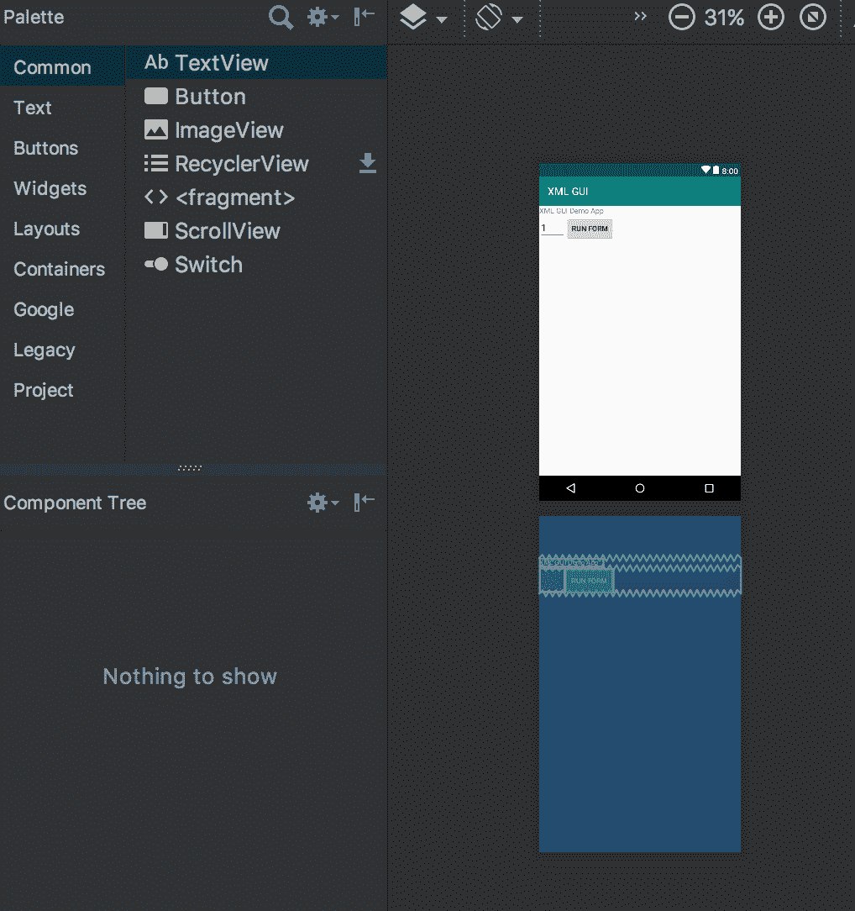

构建并运行这个应用程序，Android Studio 会提示您选择一个联网的设备或者一个配置好的虚拟设备，如图 9 所示。

#### 图 9\. 选择一个设备来测试应用

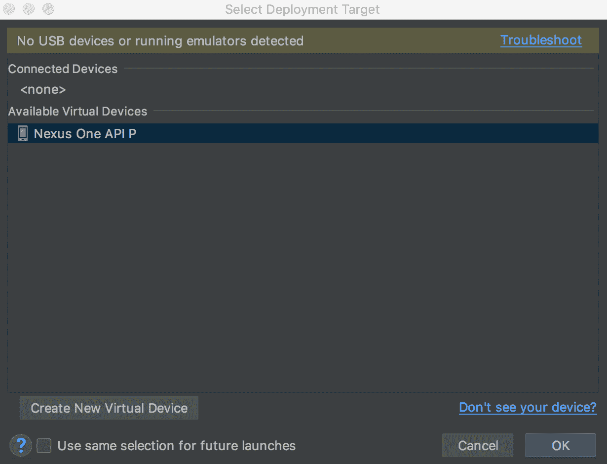

#### 图 10\. 运行中的应用程序

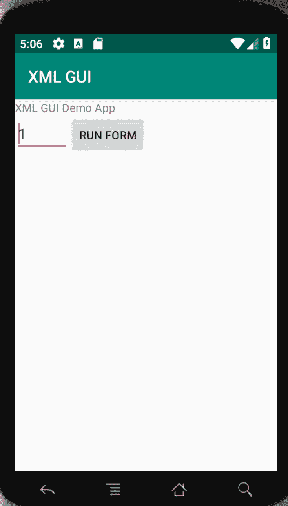

当用户输入一个表单编号并点击 **Run Form** 按钮时，一系列事件将被触发。我们逐行查看一下 `onClick()` 方法。还记得吗， `onClick()` 方法位于 XmlGui 类中（见 清单 4 ）。

您得到了一个名为 `formNumber` 的 `EditText` 字段的引用。只要保存 `activity_xml_gui.xml` 布局文件，Android 构建工具将自动生成 `R.id.formNumber` 清单：

```
EditText formNumber = (EditText) findViewById(R.id.formNumber); 
```

接下来，您将这一行放置到日志中。您可以在 Android Studio 中的 LogCat 窗口中查看该日志的输出：

```
Log.i(tag,"Attempting to process Form # [" + formNumber.getText().toString() + "]"); 
```

Form Engine 的实际实现在 `RunForm` 类中提供，该类扩展 `Activity` 类。要启动这个 `Activity` ，创建一个 `Intent` ，显式制定 `RunForm class` ：

```
Intent newFormInfo = new Intent(XmlGui.this,RunForm.class); 
```

您不仅想启动 `RunForm Activity` ，还想指定显示哪个表单。为此，通过 `putExtra` 方法将表单编号添加到 `Intent` ：

```
newFormInfo.putExtra("formNumber", formNumber.getText().toString()); 
```

这个值通过 `RunForm` 类提取，我们将稍后展示。

您已经设置了 `Intent` ，现在可以通过对 `startActivity` 的一个调用来启动 `Activity` ：

```
startActivity(newFormInfo); 
```

通过您的应用程序，用户输入表单编号并单击 **Run Form** 按钮。这将触发上面描述的事件，导致 `RunForm` 类处理请求。输入一个表单编号仅仅是本教程的一个测试工具，还有其他一些方式可以导致这个触发事件发生。更实用的示例包括来自一个 web 页面的定制链接，通过 Short Message Service (SMS) 推送的短消息，根据相邻性（proximity）的基于位置的触发器，或者甚至是一个经过扫描的 QR（Quick Response）代码。

### 运行表单

`RunForm` 类是这个应用程序的编排器，通过一个要处理的表单编号启动。现在检查清单 6 中的 `onCreate()` 方法。

#### 清单 6\. onCreate() 方法

```
@Override
    public void onCreate(Bundle savedInstanceState) {
        super.onCreate(savedInstanceState);
        String formNumber = "";
        Intent startingIntent = getIntent();
        if(startingIntent == null) {
            Log.e(tag,"No Intent?  We're not supposed to be here...");
            finish();
            return;
        }
        formNumber = startingIntent.getStringExtra("formNumber");
        Log.i(tag,"Running Form [" + formNumber + "]");
        String url = this.getString(R.string.fetchformurl) + formNumber + ".xml";
        new GetFormData().execute(url);
    } 
```

如清单 6 中的代码所示，首先从触发 `Activity` 的 `Intent` 提取 `formNumber` 。由于没有要处理的表单编号，这个 `Activity` 没有可以执行的内容。

提取这个值后，下一个要求是连接到服务器以下载表单规范。（注意，这种方法的一个增强可能是在获取这个数据之前在本地缓存逐行提取这个表单的元数据。） 为了从服务器下载数据，我们需要在“后台线程”上执行网络请求，因为不允许您在主 UI 线程上执行此类操作。我们还需要一个服务器 URL 来访问。注意，这是一种我们希望存储在源代码之外的常量值。对于本应用程序，我们将它存储在 `res/strings.xml` 文件中，引用标识符为 `fetchformaturl`。`getString（）`方法为我们检索这个值。清单 7 展示了 `getformdata（`）类，它扩展了 `asynctask` 类，后者执行表单元数据的实际下载。

#### 清单 7\. GetFormData() 方法

```
private class GetFormData extends AsyncTask<String, Void, Boolean> {

        @Override
        protected Boolean doInBackground(String... strings) {
            String formData = null;
            try {
                String formURL = strings[0];
                URL url = new URL(formURL);
                Log.i(tag,url.toString());
                InputStream is = url.openConnection().getInputStream();
                DocumentBuilderFactory factory = DocumentBuilderFactory.newInstance();
                DocumentBuilder db = factory.newDocumentBuilder();
                Document dom = db.parse(is);
                Element root = dom.getDocumentElement();
                NodeList forms = root.getElementsByTagName("form");
                if (forms.getLength() < 1) {
                    // nothing here??
                    Log.e(tag,"No form, let's bail");
                    return false;
                }
                Node form = forms.item(0);
                theForm = new XmlGuiForm();

                // process form level
                NamedNodeMap map = form.getAttributes();
                theForm.setFormNumber(map.getNamedItem("id").getNodeValue());
                theForm.setFormName(map.getNamedItem("name").getNodeValue());
                if (map.getNamedItem("submitTo") != null)
                    theForm.setSubmitTo(map.getNamedItem("submitTo").getNodeValue());
                else
                    theForm.setSubmitTo("loopback");

                // now process the fields
                NodeList fields = root.getElementsByTagName("field");
                for (int i=0;i<fields.getLength();i++) {
                    Node fieldNode = fields.item(i);
                    NamedNodeMap attr = fieldNode.getAttributes();
                    XmlGuiFormField tempField =  new XmlGuiFormField();
                    tempField.setName(attr.getNamedItem("name").getNodeValue());
                    tempField.setLabel(attr.getNamedItem("label").getNodeValue());
                    tempField.setType(attr.getNamedItem("type").getNodeValue());
                    if (attr.getNamedItem("required").getNodeValue().equals("Y"))
                        tempField.setRequired(true);
                    else
                        tempField.setRequired(false);
                    tempField.setOptions(attr.getNamedItem("options").getNodeValue());
                    theForm.getFields().add(tempField);
                }

                Log.i(tag,theForm.toString());
                return true;

            } catch (IOException e) {
                e.printStackTrace();
                return false;
            } catch (Exception e) {
                e.printStackTrace();
                return false;
            }
        }

        @Override
        protected void onPostExecute(Boolean result) {
            if (result) {
                DisplayForm();
            } else {
                Log.e(tag,"Couldn't parse the Form.");
                finish();
                Toast.makeText(getApplicationContext(), "Form not valid!",
                        Toast.LENGTH_LONG).show();
            }
        }
    } 
```

这段代码负责从一个元数据存储库提取数据，在本例中是从一个 web 服务器下载一个 XML 文件。

在 `doinbackground` 方法中，我们通过引用第一个字符串值并将其传递给 URL 类构造函数来提取传入的 url:

```
String formURL = strings[0];
URL url = new URL(formURL); 
```

通过一个 DOM 解析器操作这个 XML 数据，提取表单和字段元素及属性并将它们分别存储在 `XmlGuiForm` 和 `XmlGuiFormField` 类的实例中。这个方法的主体用于解析和填充任务。

两种主要的 XML 解析方法是 DOM 和 SAX。DOM 解析器的工作原理是将一个文档解析到内存中，然后应用程序遍历一个 Document Object Model 树以访问 XML 中包含的各种数据元素。这里也可以使用 SAX 解析器，原因是您通过填充这两个类来构建您自己的文档表示。

这个应用程序的 DOM 方法的优势在于，它具有某种程度的程序性且比较容易跟随代码，而 SAX 方法则需要一些回调函数，回调函数中只存储想要的数据。在一些实例中，开发人员编写来实现回调函数的代码的复杂程度要比 DOM 方法高得多。由于 XML 数据在 DOM 方法中完全解析，因此更为内存密集。对于这个应用程序的目的，由于元数据表单非常小，DOM 的简单性和容易跟随的本质是比内存管理更大的驱动因素。

参见参考资源获取关于在 Android 中编码 XML 解析器的一个优秀参考资料。

这个 XML 元数据表单已经转换为 Java 类实例，现在可以显示表单，以便从用户收集数据。

假设成功地解析了 XML 表单元数据，我们在 `doinbackground` 方法中返回 true。`onPostExecute` 方法处理下一步，我们可以调用 `DisplayForm` 方法或显示错误消息并关闭此 `Activity`。

## 收集用户数据

您已经创建了 `Activity` 主屏幕布局，现在可以创建用户界面表单来收集数据了。在本例中，您将创建一个 Robotics Club Registration 表单和一个 Auto Maintenance 调查表单。

### 使用元数据

这个应用程序取决于 Android 程序员动态操作用户界面的能力。在本教程前面，您检查了 `main.xml` 文件，该文件定义 `XmlGui` 类（主 `Activity` ）的屏幕布局。如果您总是必须在设计或编译时定义用户界面元素，那么应用程序几乎不可能是它的当前形式。

幸运的是，您并不局限于那种方式。 `DisplayForm()` 方法负责将这个元数据转换为用户界面元素，以便搜集数据。其代码分为两个主要功能区域：用户界面元素的布局和提交按钮的处理。

首先，检查布局逻辑。这段代码负责将 `XmlGuiForm` 对象转换为一个真正的屏幕表单。清单 8 展示了这段代码。

#### 清单 8\. 布局逻辑

```
private boolean DisplayForm()
    {

        try
        {
            ScrollView sv = new ScrollView(this);

        final LinearLayout ll = new LinearLayout(this);
        sv.addView(ll);
        ll.setOrientation(android.widget.LinearLayout.VERTICAL);

        // walk through the form elements and dynamically create them,
        // leveraging the mini library of tools.
        int i;
        for (i=0;i<theForm.fields.size();i++) {
            if (theForm.fields.elementAt(i).getType().equals("text")) {
                    theForm.fields.elementAt(i).obj = new
                    XmlGuiEditBox(this,(theForm.fields.elementAt(i).isRequired()
                    ? "*" : "") + theForm.fields.elementAt(i).getLabel(),"");
                    ll.addView((View) theForm.fields.elementAt(i).obj);
            }
            if (theForm.fields.elementAt(i).getType().equals("numeric")) {
                    theForm.fields.elementAt(i).obj = new
                    XmlGuiEditBox(this,(theForm.fields.elementAt(i).isRequired()
                    ? "*" : "") + theForm.fields.elementAt(i).getLabel(),"");
                    ((XmlGuiEditBox)theForm.fields.elementAt(i).obj).makeNumeric();
                    ll.addView((View) theForm.fields.elementAt(i).obj);
            }
            if (theForm.fields.elementAt(i).getType().equals("choice")) {
                    theForm.fields.elementAt(i).obj = new
                    XmlGuiPickOne(this,(theForm.fields.elementAt(i).isRequired()
                    ? "*" : "") + theForm.fields.elementAt(i).getLabel(),
                    theForm.fields.elementAt(i).getOptions());
                    ll.addView((View) theForm.fields.elementAt(i).obj);
            }
        }

        Button btn = new Button(this);
        btn.setLayoutParams(new LayoutParams
        (ViewGroup.LayoutParams.WRAP_CONTENT,ViewGroup.LayoutParams.
        WRAP_CONTENT));

        ll.addView(btn);

        btn.setText("Submit");
        btn.setOnClickListener(new Button.OnClickListener() {
            public void onClick(View v) {
                // check if this form is Valid
                if (!CheckForm())
                {
                    AlertDialog.Builder bd = new AlertDialog.Builder(ll.getContext());
                AlertDialog ad = bd.create();
                ad.setTitle("Error");
                ad.setMessage("Please enter all required (*) fields");
                ad.show();
                return;

                }
                if (theForm.getSubmitTo().equals("loopback")) {
                    // just display the results to the screen
                    String formResults = theForm.getFormattedResults();
                    Log.i(tag,formResults);
                    AlertDialog.Builder bd = new AlertDialog.Builder(ll.getContext());
                AlertDialog ad = bd.create();
                ad.setTitle("Results");
                ad.setMessage(formResults);
                ad.show();
                return;

                } else {
                    if (!SubmitForm()) {
                        AlertDialog.Builder bd = new AlertDialog.Builder(ll.getContext());
                    AlertDialog ad = bd.create();
                    ad.setTitle("Error");
                    ad.setMessage("Error submitting form");
                    ad.show();
                    return;
                    }
                }

            }
        } );

        setContentView(sv);
        setTitle(theForm.getFormName());

        return true;

        } catch (Exception e) {
            Log.e(tag,"Error Displaying Form");
            return false;
    }
} 
```

您必须预期超出单个屏幕可以容纳的内容的更多字段的可用性，因此，使用一个 `ScrollView` 作为父视图或容器。在该 `ScrollView` 中，您使用一个垂直 `LinearLayout` 来将各种用户界面小部件组织为一个垂直列。

这种方法非常简单：

*   您通过 `XmlGuiForm` 实例的 `fields` 成员中包含的 `XmlGuiFormField` 对象来列举。
*   根据请求的字段的类型，一个不同的用户界面元素被实例化并添加到 `LinearLayout` 。您将快速检查不同的 UI 小部件。

当 UI 元素被创建并添加到这个线性布局中后，您将整个 `ScrollView` 实例添加到这个屏幕的内容并将表单名指定为屏幕标题。图 9 展示了为用户输入准备就绪的一个 Robotics 俱乐部注册屏幕。这个表单是 清单 1 中的 XML 数据的处理结果。

#### 图 11\. 运行中的 Robotics 注册表单

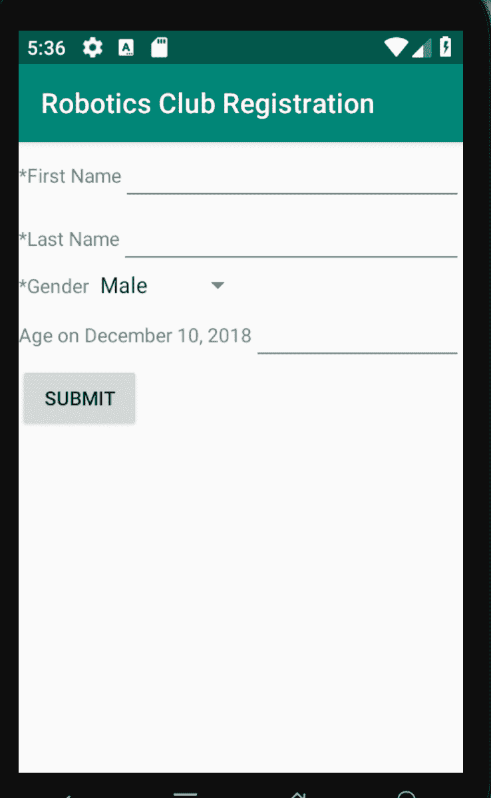

我们来看看为这个应用程序创建的不同的自定义用户界面小部件。

回想一下，我们为这个应用程序定义了三种类型的数据输入字段：文本、数值和选项。这三种类型通过两个不同的自定义小部件实现： `XmlGuiEditBox` 和 `XmlGuiPickOne`。

文本和数值非常相似，因此可以利用相同的 `EditView` 方法，但使用不同的输入过滤器来在字母数字和仅允许数字之间切换。清单 9 展示了 `XmlGuiEditBox` 类的代码。

#### 清单 9.XmlGuiEditBox 类

```
package com.msi.ibm;

import android.content.Context;
import android.util.AttributeSet;
import android.view.ViewGroup;
import android.widget.LinearLayout;
import android.widget.TextView;
import android.widget.EditText;
import android.text.method.DigitsKeyListener;

public class XmlGuiEditBox extends LinearLayout {
   TextView label;
   EditText txtBox;

   public XmlGuiEditBox(Context context,String labelText,String initialText) {
      super(context);
      label = new TextView(context);
      label.setText(labelText);
      txtBox = new EditText(context);
      txtBox.setText(initialText);
      txtBox.setLayoutParams(new LayoutParams(ViewGroup.LayoutParams
                   .FILL_PARENT,ViewGroup.LayoutParams.WRAP_CONTENT));
      this.addView(label);
      this.addView(txtBox);
   }

   public XmlGuiEditBox(Context context, AttributeSet attrs) {
      super(context, attrs);
      // TODO Auto-generated constructor stub
   }

   public void makeNumeric()
   {
      DigitsKeyListener dkl = new DigitsKeyListener(true,true);
      txtBox.setKeyListener(dkl);
   }
   public String getValue()
   {
      return txtBox.getText().toString();
   }
   public void setValue(String v)
   {
      txtBox.setText(v);
   }
} 
```

`XmlGuiEditBox` 类扩展 `LinearLayout` 类并包含一个文本标签来描述要求的输入，以及一个 `EditText` 来实际收集输入的数据。所有对象初始化都在构造函数中完成。这也许被视为糟糕的表单，但如果您对这种方法不满意，那么这只是留给您的一个练习。

我们还将讨论三种方法。 `getValue()` 和 `setValue()` 方法正是您想要的。它们是用于与 `EditText` 字段交互的 `getter` 和 `setter` 。

第三种方法 `makeNumeric()` 仅在设置数值表单类型时才调用。 `DigitsKeyListener` 的实例用于过滤任何非数值键。您免费获取的另一个好处是，适当的键盘将根据正在使用的 `XmlGuiEditBox` 类型而显示 — 带有或没有数值设置。

图 12 展示了运行中的表单，显示了一个字母键盘，原因是 Last Name 字段设置为输入字母，即 `text` 。

#### 图 12\. 字母数值键输入

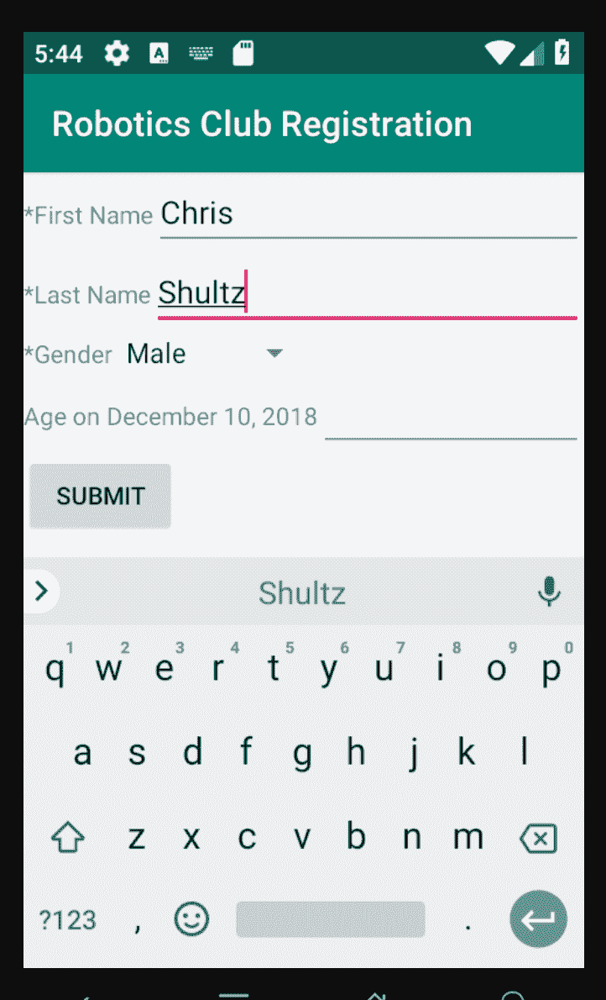

图 13 展示了正在使用数值键盘，原因是 age 字段的数据类型设置为 `numeric` 。

#### 图 13\. 数值键盘

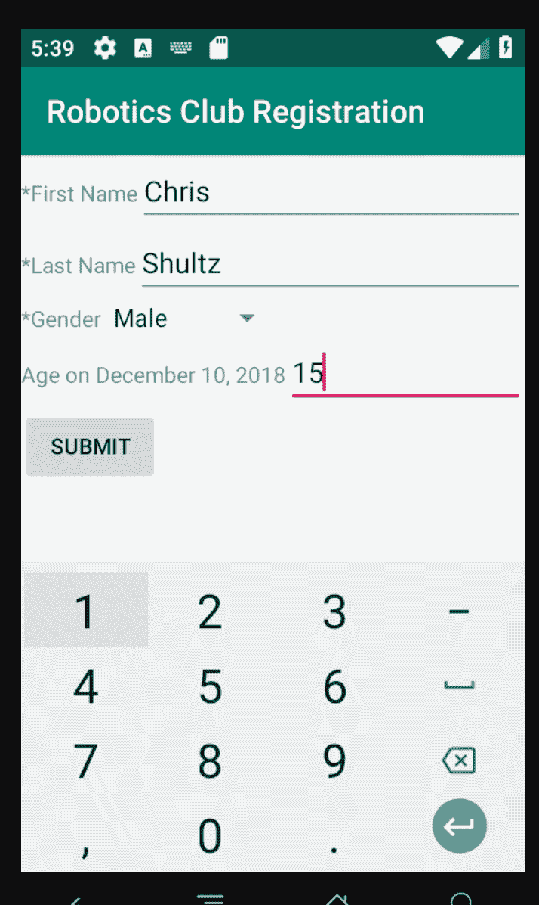

选择字段通过 `XmlGuiPickOne` 类在用户界面中实现，与上述输入字段有点不同。这个选择字段被实现为一个 Android `Spinner` 小部件。这个用户界面元素类似于其他编程环境中的下拉列表框，在那里，用户必须从一些现成选项中选择一个选项。图 14 展示三个实例 `XmlGuiPickOne` 小部件。

#### 图 14\. 带有三个 XmlGuiPickOne 的汽车维修调查表

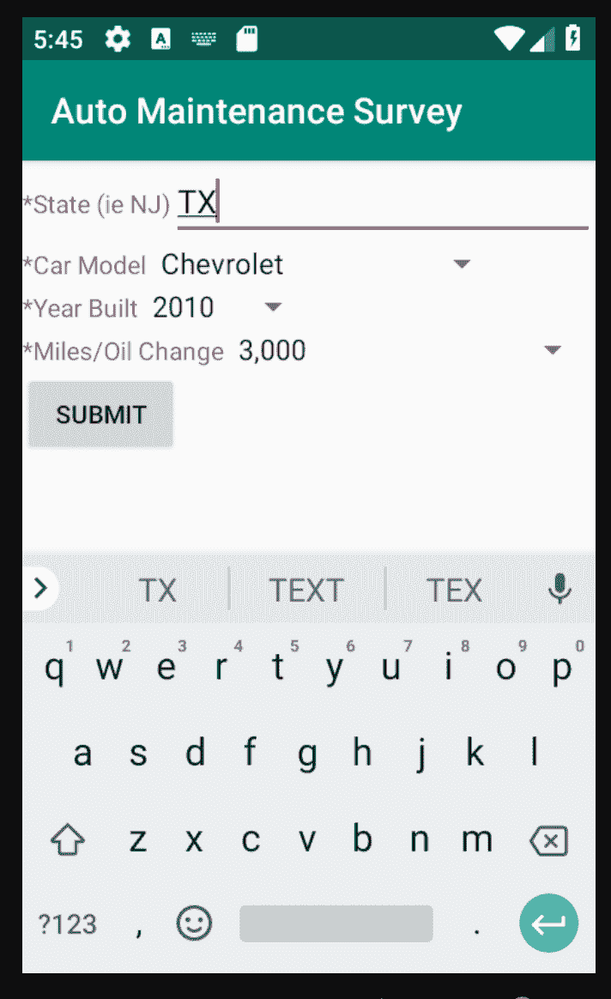

在本例中，正在收集的数据用于统计目的，与处理自由文本输入字段相比，规范化可能的输入使得数据处理更整洁。当然，如果您想将这次调查限制到一个特殊的地理区域的话，可以将 State 字段定义为一个选择字段。

清单 10 展示了 `XmlGuiPickOne` 类的代码。

#### 清单 10\. XmlGuiPickOne 类

```
package com.msi.ibm;

import android.content.Context;
import android.util.AttributeSet;
import android.widget.LinearLayout;
import android.widget.TextView;
import android.widget.Spinner;
import android.widget.ArrayAdapter;

public class XmlGuiPickOne extends LinearLayout {
   String tag = XmlGuiPickOne.class.getName();
   TextView label;
   ArrayAdapter<String> aa;
   Spinner spinner;

   public XmlGuiPickOne(Context context,String labelText,String options) {
      super(context);
      label = new TextView(context);
      label.setText(labelText);
      spinner = new Spinner(context);
      String []opts = options.split("\\|");
      aa = new ArrayAdapter<String>( context,
           android.R.layout.simple_spinner_item,opts);
      spinner.setAdapter(aa);
      this.addView(label);
      this.addView(spinner);
   }

   public XmlGuiPickOne(Context context, AttributeSet attrs) {
      super(context, attrs);
      // TODO Auto-generated constructor stub
   }

   public String getValue()
   {
      return (String) spinner.getSelectedItem().toString();
   }

} 
```

这个类看起来非常类似于 `XmlGuiEditBox` 类，主要区别在于它采用了一个 `Spinner` 控件而不是一个 `EditText` 控件。还要注意，这个类只实现了 `getValue()` 方法。这个类的一个明显增强是允许用户指定一个默认值。

注意，我们使用了 `options` 成员来填充选项列表。在这段代码中，我们使用一个 `regex` 表达式将包含可用选项的 String 分割为一个数组，然后将其传递给 `ArrayAdapter` 的一个实例。常量 `android.R.layout.simple_spinner_item` 被内置到 Android 中，而不是在本教程的应用程序代码中提供。这个适配器设置好后，就被分配给这个 Spinner。图 15 展示了屏幕上显示的选项列表提示用户，典型的是油量变化与英里数。

#### 图 15\. XmlGuiPickOne 询问油量变化

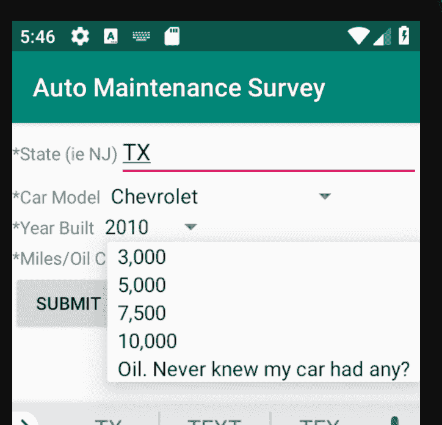

既然用户可以在表单中输入数据了，现在可以验证并提交数据了。

## 保存并提交数据

现在必须创建一种方法，允许用户通过验证数据并将数据提交到一个服务器来保存数据。

### 保存

现在应该回顾一下 `RunForm` 类的 `DisplayForm()` 方法。回想一下，该方法的第一个选项负责绘制表单。接下来，您将检查提交按钮的 `onClick()` 处理程序，如清单 11 所示。

#### 清单 11\. onClick() 处理程序

```
btn.setOnClickListener(new Button.OnClickListener() {
   public void onClick(View v) {
       // check if this form is Valid
       if (!CheckForm())
       {
           AlertDialog.Builder bd = new AlertDialog.Builder(ll.getContext());
               AlertDialog ad = bd.create();
               ad.setTitle("Error");
               ad.setMessage("Please enter all required (*) fields");
               ad.show();
               return;
       }
       if (theForm.getSubmitTo().equals("loopback")) {
           // just display the results to the screen
           String formResults = theForm.getFormattedResults();
           Log.i(tag,formResults);
           AlertDialog.Builder bd = new AlertDialog.Builder(ll.getContext());
           AlertDialog ad = bd.create();
               ad.setTitle("Results");
               ad.setMessage(formResults);
               ad.show();
               return;
       } else {
           if (!SubmitForm()) {
               AlertDialog.Builder bd = new AlertDialog.Builder(ll.getContext());
           AlertDialog ad = bd.create();
           ad.setTitle("Error");
           ad.setMessage("Error submitting form");
           ad.show();
           return;
           }
       }
   }
} ); 
```

当用户选择提交按钮时，表单条目将被检查，以确保所有必要字段都已填充。否则，将显示一个 `AlertDialog` 来提醒用户填充所有字段。假定数据输入令人满意，现在可以提交数据了。.

数据提交过程由这个教程应用程序的两个部分完成。如果表单的 `submitTo` 字段已经设置回送值，则这些值只需回显到屏幕上。这有利于实现测试目的。如果您对表单工具对数据的收集效果感到满意，现在可以将其指向一个服务器页面，该页面负责记录表单条目。

清单 12 展示了 `CheckForm()` 方法。这段代码非常直观。每个字段都被检查，看看它们是否必要。如果字段必要但用户没有提供相应信息，将设置一个标志。您可以增强这种标志，向用户提供更具体的反馈。

#### 清单 12\. CheckForm() 方法

```
private boolean CheckForm()
{
    try {
       int i;
       boolean good = true;

       for (i=0;i<theForm.fields.size();i++) {
                   String fieldValue = (String)
               theForm.fields.elementAt(i).getData();
                   Log.i(tag,theForm.fields.elementAt(i)
               .getName() + " is [" + fieldValue + "]");
                   if (theForm.fields.elementAt(i).isRequired()) {
                       if (fieldValue == null) {
                           good = false;
                       } else {
                           if (fieldValue.trim().length() == 0) {
                               good = false;
                           }
                       }

                   }
       }
       return good;
    } catch(Exception e) {
       Log.e(tag,"Error in CheckForm()::" + e.getMessage());
       e.printStackTrace();
       return false;
    }
} 
```

现在可以将收集的数据提交到服务器了。检查清单 13 中的 `SubmitForm()` 。

#### 清单 13\. SubmitForm() 方法

```
private boolean SubmitForm()
{
       try {
                   boolean ok = true;
       this.progressDialog = ProgressDialog.show(this,
         theForm.getFormName(), "Saving Form Data", true,false);
       this.progressHandler = new Handler() {

               @Override
               public void handleMessage(Message msg) {
                   // process incoming messages here
                   switch (msg.what) {
                       case 0:
                           // update progress bar
                           progressDialog.setMessage("" + (String) msg.obj);
                           break;
                       case 1:
                           progressDialog.cancel();
                           finish();
                           break;
                       case 2:
                               progressDialog.cancel();
                               break;
                   }
                   super.handleMessage(msg);
               }

       };

       Thread workthread = new Thread(new TransmitFormData(theForm));

       workthread.start();

               return ok;
       } catch (Exception e) {
               Log.e(tag,"Error in SubmitForm()::" + e.getMessage());
               e.printStackTrace();
       // tell user that the submission failed....
       Message msg = new Message();
       msg.what = 1;
       this.progressHandler.sendMessage(msg);

               return false;
       }

} 
```

首先，您设置 `android.os.Handler` 类的一个实例。当应用程序需要与不同的线程共享数据时， `Handler` 类可以派上用场。 `SubmitForm()` 方法中需要注意的另一个重要项目是 `ProgressDialog` 。注意， `ProgressDialog` 和 `Handler` 被定义为类级变量，如清单 14 所示。

#### 清单 14\. ProgressDialog 和 Handler

```
public class RunForm extends Activity {
    /** Called when the activity is first created. */
      String tag = RunForm.class.getName();
      XmlGuiForm theForm;
      ProgressDialog progressDialog;
      Handler progressHandler;
     ...
} 
```

您肯定不想在与服务器通信时不必要地阻塞应用程序，因此您部署了一个后台 Thread 来通信，但您依赖这个 Handler 来从通信线程接收通知，以便向用户提供反馈。注意，只有主线程被视为与用户界面交互。这个独立线程方法的一个替代方法是 android.os 包中的 `AsyncTask` 类。

当应用程序连接到服务器以传输数据时，它有机会通知用户操作的状态，这当然是一种好实践。图 14 展示了运行中的 `ProgressDialog` 。

#### 图 16.ProgressDialog


实际服务器通信代码位于清单 15 中的 `TransmitFormData()` 类中，该类实现 Runnable 界面。

#### 清单 15\. TransmitFormData 类

```
private class TransmitFormData implements Runnable
   {
   XmlGuiForm _form;
   Message msg;
   TransmitFormData(XmlGuiForm form) {
       this._form = form;
   }

   public void run() {

       try {
                msg = new Message();
                msg.what = 0;
                msg.obj = ("Connecting to Server");
                progressHandler.sendMessage(msg);

                URL url = new URL(_form.getSubmitTo());
                URLConnection conn = url.openConnection();
                conn.setDoOutput(true);
                BufferedOutputStream wr = new BufferedOutputStream
                       (conn.getOutputStream());
                String data = _form.getFormEncodedData();
                wr.write(data.getBytes());
                wr.flush();
                wr.close();

                msg = new Message();
                msg.what = 0;
                msg.obj = ("Data Sent");
                progressHandler.sendMessage(msg);

                // Get the response
                BufferedReader rd = new BufferedReader(new
                 InputStreamReader(conn.getInputStream()));
                String line = "";
                Boolean bSuccess = false;
                while ((line = rd.readLine()) != null) {
                       if (line.indexOf("SUCCESS") != -1) {
                           bSuccess = true;
                       }
                       // Process line...
                       Log.v(tag, line);
                }
                wr.close();
                rd.close();

                if (bSuccess) {
                       msg = new Message();
                       msg.what = 0;
                       msg.obj = ("Form Submitted Successfully");
                       progressHandler.sendMessage(msg);

                       msg = new Message();
                       msg.what = 1;
                       progressHandler.sendMessage(msg);
                       return;

                }
       } catch (Exception e) {
                Log.d(tag, "Failed to send form data: " + e.getMessage());
                msg = new Message();
                msg.what = 0;
                msg.obj = ("Error Sending Form Data");
                progressHandler.sendMessage(msg);
       }
       msg = new Message();
       msg.what = 2;
       progressHandler.sendMessage(msg);
   }

   } 
```

`TransmitFormData` 类负责连接到 `XmlGuiForm` 实例（来自元数据）的 `submitTo` 成员中列示的服务器。它通过 `sendMessage()` 方法，发送 `Message` 类的一个实例来定期更新主应用程序线程。以下两个成员在 `Message` 类上填充：

*   `what` 值充当一个高级开关，通过消息通知 Handler 应该如何操作。
*   `obj` 值指定一个可选 `java.lang.Object` 。在本例中，一个 `java.lang.String` 实例被传递并用于在 Progress Dialog 中显示。

任意给定应用程序使用的架构是任意的。这个应用程序使用表 3 中的值。

#### 表 3\. `what` 可以使用的应用程序值

| 值 | 注释 |
| --- | --- |
| 0 | Obj 包含一个将向用户显示的文本字符串。 |
| 1 | 成功完成传输。 |
| 2 | 出现一个错误。告知用户出了问题，不要丢弃数据。 |

图 17 展示 Form Data 传输成功时 `ProgressDialog` 中的最终消息。

#### 图 17\. 表单提交


表单成功提交后，应用程序返回主页面。对于生产就绪的应用程序，下一步发生的操作主要取决于数据收集组织的目的。这个屏幕可以只是重置以便接受另一个输入，就像在物理存货应用程序中一样。或者，您也可以将用户引导到其他屏幕。

应用程序要正确运行， `AndroidManifest.xml` 文件必须包含对所有使用的 `Activity` 类的引用，且必须包括用于 Internet 访问的用户权限。清单 16 展示了这个教程应用程序的 `AndroidManifest.xml` 文件。

#### 清单 16\. AndroidManifest.xml 文件

```
<?xml version="1.0" encoding="utf-8"?>
<manifest xmlns:android="http://schemas.android.com/apk/res/android"
      package="com.msi.ibm"
      android:versionCode="1"
      android:versionName="1.0">
      <application android:icon="@drawable/icon" android:label="@string/app_name">
        <activity android:name=".XmlGui"
                  android:label="@string/app_name">
            <intent-filter>
                <action android:name="android.intent.action.MAIN" />
                <category android:name="android.intent.category.LAUNCHER" />
            </intent-filter>
        </activity>
        <activity android:name=".RunForm">
        </activity>
    </application>
<uses-permission android:name="android.permission.INTERNET"></uses-permission>

</manifest> 
```

结束之前，我们简单看看服务器端脚本。

## 提供一个服务器端脚本

基于本教程的目的，您将使用一个 PHP 脚本来收集必要数据，并将数据附加到一个文本文件。

### 服务器上

服务器上发生的事情的确切情况取决于数据收集组织的需求。数据收集的一个常用方法是将表单数据存储在一个关系数据库中，比如 DB2® 、MySQL、SQL Server、Oracle 等。数据存储在数据库中后，就可以被分割和分析。

对于本教程，数据通过一个 PHP 脚本收集并附加到一个文本文件上。 清单 17 展示了与这个 Robotics 注册表单关联的 PHP 表单。

#### 清单 17\. Robotic 的 PHP 表单

```
<?php
// xmlgui form # 1
// this page is expecting
// fname
// lname
// gender
// age

$filename = "/pathtowritablefile/datafile.txt";

$f = fopen($filename,"a");
fprintf($f,"Data received @ ".date(DATE_RFC822));
fprintf($f,"\n");
fprintf($f,'First Name:['.$_POST['fname'].']');
fprintf($f,"\n");
fprintf($f,'Last Name:['.$_POST['lname'].']');
fprintf($f,"\n");
fprintf($f,'Gender:['.$_POST['gender'].']');
fprintf($f,"\n");
fprintf($f,'Age:['.$_POST['age'].']');
fprintf($f,"\n");
fclose($f);
print "SUCCESS";
?> 
```

如果脚本返回字符串 `SUCCESS`，`RunForm` 类将重置。其他任何值将导致向用户显示一条错误消息，并允许他们更正他们的输入，或者获取提交表单方面的帮助。

**重要安全提示**：永远不要允许数据上传到有人随后可以执行的服务器上。在清单 17 中，确保要写入的路径位于一个临时文件夹中，该文件夹不能从公 Internet 访问。

## 结束语

本教程演示了一个框架，它基于一个利用 Android SDK 的原生应用程序服务针对 Android 用户的动态问题。您看到了动态表单呈现、验证和处理技术、以及从应用程序到 web 服务器的通信。

本文翻译自：[Build dynamic user interfaces with Android and XML](https://developer.ibm.com/tutorials/x-andddyntut/)（2019-02-08）