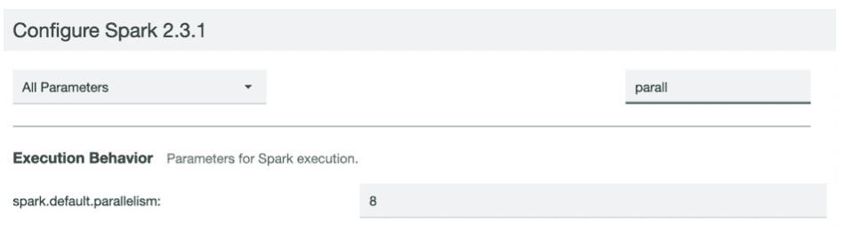

# 使用 Watson Machine Learning Accelerator 和 Snap ML 加速机器模型训练

> 原文：[`developer.ibm.com/zh/tutorials/accelerate-machine-model-training-with-watson-ml-accelerator-snap-ml/`](https://developer.ibm.com/zh/tutorials/accelerate-machine-model-training-with-watson-ml-accelerator-snap-ml/)

IBM Watson™ Machine Learning Accelerator 是捆绑了 IBM PowerAI、IBM Spectrum Conductor® 和 IBM Spectrum Conductor Deep Learning Impact 的软件解决方案，由 IBM 为包括开源深度学习框架在内的整个堆栈提供支持。Watson Machine Learning Accelerator 为数据科学家提供了端到端的深度学习平台。这包含完整的生命周期管理，从安装和配置到数据摄取和准备，再到训练模型的构建、优化和分发，最后到将模型迁移到生产环境。在您要将自己的深度学习环境扩展为包含多个计算节点时，Watson Machine Learning Accelerator 即可大显身手。现在甚至有免费评估版本可供使用。参阅我们入门教程中的前提条件： [使用 Watson Machine Learning Accelerator 对图像进行分类](https://developer.ibm.com/zh/tutorials/use-computer-vision-with-dli-watson-machine-learning-accelerator/)。

## Snap ML

IBM 开发了一个高效、可扩展的机器学习库，支持快速训练各种机器学习模型。通过使用此库，客户可以省去作为机器学习工作负载瓶颈的训练时间，从而为一系列新应用程序铺平道路。Snap Machine Learning (Snap ML) 库结合了机器学习系统和算法的最新进展，并使用 GPU 加速广义线性模型。这可通过算法级别的创新以及 GPU 与 POWER9™ CPU 之间的高速互连链路 NVLink 2.0 来实现。

这个最先进的库的重要性因逻辑回归、决策树和随机森林是数据科学家在工作中使用最多的三种机器学习模型这一事实（[2017 年 Kaggle 数据科学调查](https://www.kaggle.com/surveys/2017)）而放大，而且 Snap ML 目前支持所有这些模型。

Snap ML (PowerAI 1.6.0) 目前支持以下模型。

广义线性模型：

*   逻辑回归
*   线性回归
*   岭回归
*   Lasso 回归
*   支持向量机 (SVM)

基于树的模型：

*   决策树
*   随机森林

### 独特的价值主张

有三个主要功能可以彰显 Snap ML 提供的独特价值主张：

**分布式训练** — IBM 将系统构建为数据并行框架，使客户能够扩展和训练超出单台机器内存容量的海量数据集，这对于大规模应用程序至关重要。

**GPU 加速** — IBM 已实现专门的解算器，这种解算器不仅利用了 GPU 的强大并行架构，同时考虑到 GPU 内存中的数据局部性，从而避免了大型数据传输的开销。为了使此方法可扩展，IBM 利用异构学习领域取得的最新进展来实现 GPU 加速，即使只有一小部分数据存储在加速器内存中也是如此。

**稀疏数据结构** — 许多机器学习数据集都是稀疏数据集。将算法应用于稀疏数据结构时，Snap ML 对算法进行了新的优化。

所有这些都能够显著缩短训练时间，并能够处理 TB 字节级数据集。

## 学习目标

这是 [在 PowerAI 上加速 Snap ML](https://developer.ibm.com/cn/blog/2019/snapml-on-powerai/)的第一个教程。在这个系列中，我们训练了一个逻辑回归分类器，使用包含在线广告点击数据的 20 GB 数据集来预测广告点击次数，其中包含 4500 万个训练示例和 100 万个特征。我们将向您展示如何使用 Snap ML 库加速逻辑回归模型训练，并将性能与开源 Spark ML 进行比较。此系列包含以下三个部分：

*   第 1 部分 — 准备 Criteo Kaggle 数据集

    *   下载和提取数据集
    *   使用 scikit-learn 创建训练/测试分组
*   第 2 部分 — 安装和配置

    *   创建两个 Spark 实例组
    *   在 Watson Machine Learning Accelerator 上安装和配置两个 Livy 服务
*   第 3 部分 — 运行逻辑回归模型

    *   定制 Notebook 包以便包含 sparkmagic
    *   从 Notebook 连接到 Watson Machine Learning Accelerator 集群
    *   使用 Spark ML 和 IBM Watson Machine Learning Accelerator Snap ML 训练逻辑回归模型以预测客户点击率

## 预估时间

本端到端教程需耗时约 2 小时，包括大约 30 分钟的模型训练、安装和配置以及通过 GUI 完成的模型驱动。

## 前提条件

本教程需要访问 GPU 加速的 IBM Power Systems AC922 型或 S822LC 型服务器。除获取服务器外，还有多种方法可访问 PowerAI 开发者门户网站上列出的 Power Systems 服务器。

## 第 1 部分：准备 Criteo Kaggle 数据集

1.  下载 Criteo Kaggle 比赛数据。

    ```
     wget https://s3-us-west-2.amazonaws.com/criteo-public-svm-data/criteo.kaggle2014.svm.tar.gz 
    ```

2.  提取内容。

    ```
     tar xzf criteo.kaggle2014.svm.tar.gz 
    ```

3.  执行以下 Python 脚本来创建训练/测试文件。

    ```
     from sklearn.datasets import load_svmlight_file
     from sklearn.model_selection import train_test_split
     from sklearn.datasets import dump_svmlight_file

     X,y = load_svmlight_file("criteo.kaggle2014.train.svm")

     X_train, X_test, y_train, y_test = train_test_split(X, y, test_size=0.25, random_state=42)

     dump_svmlight_file(X_train, y_train, 'criteo.kaggle2014-train.libsvm', zero_based=False)
     dump_svmlight_file(X_test, y_test, 'criteo.kaggle2014-test.libsvm', zero_based=False) 
    ```

这会生成两个数据集。

*   criteo.kaggle2014-train.libsvm
*   criteo.kaggle2014-test.libsvm

## 第 2 部分：安装和配置

我们将创建两个独立的 Spark 实例组：

1.  Livy-integration-notebook（针对 GPU 工作负载）
2.  Livy-integration-notebook-CPU（针对 CPU 工作负载）

     *创建 Spark 实例组 #1 – Livy-integration-notebook*

3.  输入必填字段，然后单击 **Configuration**。

    

4.  修改以下 Spark 属性。

5.  将 spark.default.parallelism 设置为可用 GPU 的总数。

      

6.  选择 **Additional Parameters**，然后添加以下参数。

    

## 配置资源组和计划

 *创建 Spark 实例组 #2 – Livy-integration-notebook-cpu*

1.  输入必填字段，然后单击 **Configuration**。

    

2.  修改以下 Spark 属性。将 spark.default.parallelism 设置为可用 CPU 核心的总数。

      

3.  选择 **Additional Parameters**，然后添加以下参数。

     

安装并配置两个 Livy 服务：[Watson Machine Learning Accelerator 上的 SnapML-Livy 和 SnapML-Livy-CPU](https://www.ibm.com/developerworks/community/blogs/281605c9-7369-46dc-ad03-70d9ad377480/entry/Running_Apache_Livy_0_5_0_with_IBM_Spectrum_Conductor_2_3_0?lang=en)。

因此，您可以启动并运行两个 Livy 实例，并且其输出值（在集群管理控制台中的 Overview 选项卡上可用）将端点位置显示为 livy_URL。

 

## 第 3 部分：训练逻辑回归模型

1.  下载[样本 Notebook](https://ibm.box.com/s/327uswy06o9fg739av29tssqno1skprd)，并将其加载到您首选的 Notebook 环境中。要使用 Apache Livy 端点访问 Spark 实例组，必须加载客户端库、创建 Livy 会话并将其用于 Spark 作业提交。`sparkmagic` 命令有助于自动完成此过程。

2.  训练逻辑回归模型以预测客户点击率，并使用 Spark ML 在 CPU 中的多个核之间分配训练任务：

    a. 加载 Sparkmagic 扩展：`%load_ext sparkmagic.magics`

    b. 使用应用程序实例中的 livy_URL 值来创建 Livy CPU 会话：%spark add -s cpu_session -l python -u <livy_url>-a u -k config`</livy_url>

     

    c. 创建 Livy CPU 会话后，您可以启动逻辑回归模型训练，以便使用 Spark ML（分布在 33 个 CPU 核心上运行）预测客户点击率。该模型具有 100 万个特征（features），将使用 20 GB Criteo Kaggle 2014 Test 数据集进行训练，并使用 6 GB Criteo Kaggle 2014 Test 数据集运行推理。这次执行在 202.96 秒内完成。

     

    d. 最后，必须清理 Livy 会话以释放相关资源：`%spark delete -s cpu_session`

3.  使用 IBM Watson Machine Learning Accelerator Snap ML 来训练逻辑回归模型以预测客户点击率并在 GPU 中分配作业：

    a. 使用应用程序实例中的 livy_URL 值来创建 Livy GPU 会话： 

    b. 创建 Livy CPU 会话后，您可以使用 Snap ML（分布在 8 个 GPU 上运行）来启动逻辑回归模型训练。这次执行在 18 秒内完成。

 

## 结束语

Snap ML 库提供了 GPU 加速和分布式计算功能，可加速机器学习模型训练并支持处理大型数据集。在我们的教程中，我们训练了一个逻辑回归分类器，使用包含在线广告点击数据的 20 GB 数据集来预测在线广告点击次数，其中包含 4500 万个训练示例和 100 万个特征。对于在其网站中投放广告的公司以及在线竞标公司而言，这是一个高度相关的应用程序，可用于在当今的互联社会中获得数十亿美元的收入。

Snap ML 通过将执行时间从 202 秒（使用 CPU 上运行的 Spark ML）缩短到 18 秒，将此训练工作负载加速十倍。这极大地提高了工作效率，甚至可以使用机器学习模型的在线重新训练等用例来适应快速变化的情况或业务需求。

想要了解更多信息？观看此视频，了解 Snap ML 技术是什么以及如何从中受益。

[https://cdnapisec.kaltura.com/p/1773841/sp/177384100/embedIframeJs/uiconf_id/39954662/partner_id/1773841?iframeembed=true&playerId=kplayer&entry_id=1_zxcid9dz&flashvars[streamerType]=auto](https://cdnapisec.kaltura.com/p/1773841/sp/177384100/embedIframeJs/uiconf_id/39954662/partner_id/1773841?iframeembed=true&playerId=kplayer&entry_id=1_zxcid9dz&flashvars[streamerType]=auto)

本文翻译自：[Accelerate machine model training with Watson Machine Learning Accelerator and Snap ML](https://developer.ibm.com/tutorials/accelerate-machine-model-training-with-watson-ml-accelerator-snap-ml/)（2019-04-03）