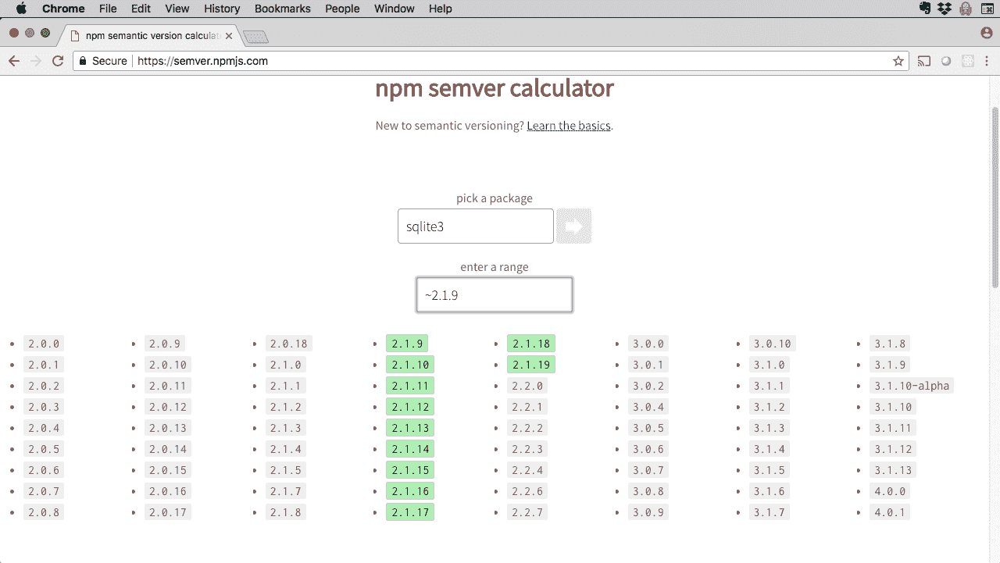
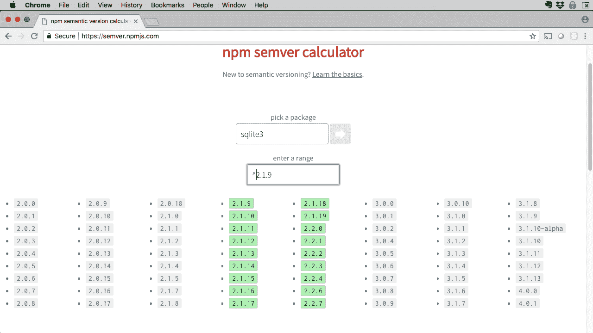

# Node.js 依赖管理

> 原文：[`developer.ibm.com/zh/tutorials/learn-nodejs-manage-packages-in-your-project/`](https://developer.ibm.com/zh/tutorials/learn-nodejs-manage-packages-in-your-project/)

本单元承接[第 7 单元](https://www.ibm.com/developerworks/cn/opensource/os-tutorials-learn-nodejs-node-package-manager/index.html)；在上一单元中，我们介绍了 npm 注册表和 `npm` CLI。在本单元中，我们将学习如何使用 `package.json` 文件管理依赖。您还将了解到 Node 应用程序的演变过程，也就是应用程序的编写、发布以及维护周期。

软件在最初发布后需要长期维护。维护活动包括：

*   修复错误
*   添加新功能
*   对底层系统组合进行升级或其他变更
*   对第三方软件依赖进行升级

**Node.js 学习路径** 本教程已纳入 Node.js 学习路径。各单元之间相辅相成，查看 Node.js 学习路径概述以便从头开始学习。

开发者往往比较熟悉前三个活动，但最后一个活动*或多或少有些失控*。这在 Node 中尤为严重，因为要管理的依赖数量庞大。因此，了解 `package.json` 及其在维护和发展应用程序方面所发挥的作用就十分关键。

## 什么是 package.json

一个 Node 项目通常称为一个*包*。JSON (JavaScript Object Notation) 是用于描述 Node 包的表示法。

`Package.json` 是包含包名和版本号等基本信息以及较为复杂的元数据的文件。

npm 需要 `package.json` 文件来管理项目，提交到 npm 注册表的每个项目都必须有一个 `package.json` 文件。如果要创建成功的 Node 项目，就需要了解如何创建 `package.json` 文件。

接下来我们更详细地介绍一下该文件的元素。

### 项目清单

*清单*文档用于描述特定对象（如容器）的内容。 `package.json` 是每个 Node 项目都需要的清单。一个 `package.json` 文件必须至少包含两个元素：

*   name：包的名称
*   version：包的版本号

除此之外，`package.json` 还可以包含更多字段，但我们首先从必需字段开始。很快我会介绍其他字段。

### 项目元数据

除了 name 和 version 等元素外，`package.json` 还包含更复杂的元数据。这些元数据帮助 `npm` 管理依赖，运行脚本以启动应用程序（参阅第 6 单元），运行单元测试以及执行其他操作。

项目元数据包含如下元素：

*   description：人类可阅读的描述，如果将包发布到 npm 注册表，那么此描述会出现在 `npm search` 中。
*   entry point：包的主 JavaScript 模块。
*   license：包的许可证标识（[软件包数据交换 (SPDX) 格式](https://spdx.org/licenses/)– 可用许可证包括 `Apache2.0`、`MIT` 或 `ISC`（默认值）等。
*   author：开发者（更具体地说，开发者的姓名和电子邮件地址）。
*   scripts：在包生命周期中的各个时间点运行的脚本（例如，`start` 和 `test`）。
*   dependencies：包所依赖的任何其他 Node.js 包（稍后会作更详细的说明）。

这些只是用于 Node 的一部分元数据元素。可在 [Node 文档](https://docs.npmjs.com/files/package.json)中阅读有关 `package.json` 中提供的所有元数据的信息。

### 共享代码

Node 的最大的优势之一就是 npm 生态系统，而共享代码则是 Node 文化的关键。但是，在自己的程序中使用第三方软件也会让项目变得更加复杂。了解如何梳理 `package.json` 文件可以帮助您节省大量精力，不必再花费无数的不眠之夜去管理错误修复、软件更新和其他问题。

## 如何创建 `package.json` 文件

可通过两种方式来从头创建 `package.json`：

### 选项 1：交互式问答

如果从命令行运行 `npm init`，`npm` 将就新包与您进行互动。它会提出一系列问题。每个问题都有一个默认答案，汇总在下表中。

| 问题 | 默认答案 |
| --- | --- |
| `package name` | 当前目录的名称 |
| `version` | 1.0.0 |
| `description` | `''`（空字符串） |
| `entry point` | `index.js` |
| `test command` | `"echo \"Error: no test specified\" && exit 1"` |
| `git repository` | `''` |
| `keywords` | `[]` |
| `author` | `''` |
| `license` | `ISC` |

整个问答如下所示：

```
$ npm init
This utility will walk you through creating a package.json file.
It only covers the most common items, and tries to guess sensible defaults.

See `npm help json` for definitive documentation on these fields
and exactly what they do.

Use `npm install <pkg>` afterwards to install a package and
save it as a dependency in the package.json file.

Press ^C at any time to quit.
package name: (unit-8) 
version: (1.0.0) 
description: 
entry point: (index.js) 
test command: 
git repository: 
keywords: 
author: 
license: (ISC) 
About to write to package.json:

{
  "name": "unit-8",
  "version": "1.0.0",
  "description": "",
  "main": "index.js",
  "scripts": {
    "test": "echo \"Error: no test specified\" && exit 1"
  },
  "author": "",
  "license": "ISC"
}

Is this OK? (yes) yes
$ 
```

### 选项 2：接受默认值

创建 `package.json` 的最快方式就是接受所有默认值，稍后再根据需要进行更改。很幸运，我们可以轻松地使用 `npm init -y` 命令接受默认值：

```
$ npm init -y
Wrote to package.json:

{
  "name": "Unit-8",
  "version": "1.0.0",
  "description": "",
  "main": "index.js",
  "scripts": {
    "test": "echo \"Error: no test specified\" && exit 1"
  },
  "keywords": [],
  "author": "",
  "license": "ISC"
}

$ 
```

如果尚未执行上述操作，可打开终端窗口或命令提示符，然后浏览至一个空目录。[本单元的全部源代码均位于 GitHub 上](https://github.com/jstevenperry/IBM-Developer/tree/master/Node.js/Course/Unit-8)，但我希望大家从头开始构建此示例。这样，全程自己动手，有助于加深理解。

## 管理 Node 中的依赖

基于 Node 的开发依赖于第三方软件，因此大多数 Node 应用程序都有为数众多的依赖。随着软件的发展变化，这些依赖可能导致 Node.js 应用程序有如一团乱麻。安装依赖后，就需要对他们进行有效管理。本节将介绍如何管理所有这些依赖。

开始之前，先修改在上一节中生成的 `package.json`，如下所示（这样我们就同步使用相同的文件了）：

```
{
  "name": "Unit-8",
  "version": "1.0.0",
  "description": "Node.js Course Unit 8 Example Code",
  "main": "unit-8.js",
  "scripts": {
    "test": "echo \"Error: no test specified\" && exit 1"
  },
  "keywords": [],
  "author": "J Steven Perry <jstevenperry@gmail.com>",
  "license": "Apache-2.0"
} 
```

*可随意在您的本地副本中用自己的姓名替换 `author`。*

可通过两种方式将新包作为依赖添加到 Node 项目中。让我们看一下这两个选项。

### 选项 1：使用 npm 安装新包

可使用 `npm` 直接安装新包。在命令行中，输入以下命令：`npm install makoto-logger`

您应看到类似下面这样的信息：

```
$ npm install makoto-logger
npm notice created a lockfile as package-lock.json.You should commit this file.
npm WARN Unit-8@1.0.0 No repository field.

+ makoto-logger@1.0.2
added 1 package and audited 1 package in 3.706s
found 0 vulnerabilities

$ 
```

查看 `package.json`，会发现与之前安装的 `makoto-logger` 有两处不同。

第一处，在 `license` 下有一个新的 dependencies 部分，如下所示：

```
 "dependencies": {
    "makoto-logger": "¹.0.2"
  } 
```

第二处，可以看到 `npm` 创建了 node_modules 目录，并在此目录下放置了新安装的依赖。

### 选项 2：在 package.json 中指定新的依赖

安装新包的另一种方式是将其指定为 `package.json` 中的依赖，然后运行无参数的 `npm install`。这样会安装新的依赖项及其所有依赖。

要查看实际操作，可将以下依赖添加到 `package.json` 中的 `dependencies` 元素（不要忘了在 `makoto-logger` 依赖后添加逗号）：

```
 "sqlite3": "⁴.0.1" 
```

现在，运行无参数的 `npm install` 命令。可以看到类似以下的输出：

```
$ npm install

> sqlite3@4.0.1 install node_modules/sqlite3
> node-pre-gyp install --fallback-to-build

node-pre-gyp WARN Using needle for node-pre-gyp https download
[sqlite3] Success: "node_modules/sqlite3/lib/binding/node-v64-darwin-x64/node_sqlite3.node" is installed via remote
npm WARN Unit-8@1.0.0 No repository field.

added 68 packages from 48 contributors and audited 98 packages in 11.595s
found 0 vulnerabilities

$ 
```

### 安装多个包

在第 7 单元中，我介绍了 [eslint](https://www.npmjs.com/package/eslint)，它用于查找 JavaScript 代码中可能存在的错误。运行以下命令以安装 `eslint` 和几个随附工具（注意 `i` 是 `install` 的缩写）：

```
npm i --save-dev eslint babel-eslint eslint-config-strongloop 
```

这会安装以下包及其依赖（以递归方式安装）：

*   `eslint`
*   `babel-eslint`
*   `eslint-config-strongloop`

`--save-dev` 标志用于将包依赖保存到 `package.json` 中名为 `devDependencies` 的元素内。以下是输出：

```
$ npm i --save-dev eslint babel-eslint eslint-config-strongloop
npm WARN Unit-8@1.0.0 No repository field.

+ eslint-config-strongloop@2.1.0
+ babel-eslint@8.2.6
+ eslint@5.1.0
added 148 packages from 186 contributors and audited 431 packages in 10.889s
found 0 vulnerabilities

$ 
```

刚才我们向项目中添加了几个依赖。`package.json` 现在应如下所示：

```
{
  "name": "Unit-8",
  "version": "1.0.0",
  "description": "Node.js Course Unit 8 Example Code",
  "main": "unit-8.js",
  "scripts": {
    "test": "echo \"Error: no test specified\" && exit 1"
  },
  "keywords": [],
  "author": "J Steven Perry <jstevenperry@gmail.com>",
  "license": "Apache-2.0",
  "dependencies": {
    "makoto-logger": "¹.0.2",
    "sqlite3": "⁴.0.1"
  },
  "devDependencies": {
    "babel-eslint": "⁸.2.6",
    "eslint": "⁵.1.0",
    "eslint-config-strongloop": "².1.0"
  }
} 
```

您可能想知道，每个版本号之前的插入符号 (^) 代表什么。这是语义版本控制 (SemVer) 语法，我们稍后会讨论。

## 指定版本号

语义版本控制（或 SemVer）是指定版本号的正式方式。该方法由 GitHub 的联合创始人之一 [Tom Preston-Warner](https://github.com/mojombo/) 创建。截止撰写本文时，最新的 [SemVer 规范](https://semver.org/spec/v2.0.0.html)为 2.0.0。

SemVer 使用由 3 部分组成的编号方案来指定*发行版标签*，如下所示：

`Major`.`Minor`.`Patch`

下面是每个部分的含义：

*   `Major` 用于新的公共 API，它*取代*（不向后兼容）先前的版本（`Major` > 0，便是如此）。
*   `Minor` 用于新的功能部件，仅向后兼容（并*不取代*）当前的主版本。
*   `Patch` 用于非取代式的错误修复。

SemVer 规范还有一些扩展，用于创建发行前的标签，但此处将不再详述。

### 使用 SemVer 的示例和规则

我们来看几个示例:

*   `1.0.0` 始终是*公共 API* 的第 1 个发行版。

*   `1.1.1` 表示公共 API 的第 1 个发行版的第 1 个功能部件发行版的第 1 次修订。

*   `2.0.4` 表示第 1 个取代性变更（从 `1.x` 更新到 `2.0.0`）发布后的第 4 次修订。

版本号不能跳数（比如，从 `1.2.4` 到 `1.2.6`，跳过 `1.2.5`）；应始终保持递增。

数字始终在任何次级版本组成部分内增加，其上级版本变更时则重置为 0。例如，版本的功能部件发行版 `1.2.3` 变成 `1.3.0`，其中 `Patch` 重置为 0。从 `2.9.11` 到 `3.0.0` 的取代性变更将次级 `Minor` 和 `Patch` 号重置。

## 管理版本的变更容忍度

依赖发生变化后，如果这不是您想要的结果，那么这些变更可能会对代码带来负面影响。

SemVer 的版本号使包作者能够*定性声明*特定变更对于先前版本的相对影响。这还使包使用者能够指定对于特定依赖的*变更容忍程度*。

包生成者可遵循 SemVer 准则，轻松通知包使用者，某个依赖的下一个发行版中到底发生了多大变化。

包使用者则可以遵循 SemVer 准则，使包管理器（`npm`、`yarn`等）能够自动处理这些升级。

如果使用得当，SemVer 可以免去您阅读数百个发行说明的麻烦，只需确定执行升级时代码是否会受到影响即可。

### 自动升级

如果有成百上千个依赖，那么 SemVer 的工具支持就能发挥至关重要的作用。接下来我们了解一下，如何使用 SemVer 告知包管理器，对于每个包，您愿意接受的版本变更容忍程度。

我们使用 package.json 中的以下 `dependencies` 片段作为示例：

```
.
.
  "dependencies": {
    "foo-a": 1.2.3,
    "bar-a": ~2.1.4,
    "baz-a": ¹.2.5
  }
  .
  . 
```

这些语法可能十分复杂，具体取决于您希望 `npm` 执行的操作。本课程的示例仅限于用户最有可能使用的语法。

### 示例 1：仅接受单一版本

假设您不愿意容忍对依赖当前版本的*任何变更* 在这种情况下，只需指定版本号，不含任何特殊字符：

```
 "foo-a": 1.2.3, 
```

这指示 `npm`，“对于包 `foo-a`，无论何种情况仅使用版本 `1.2.3`。”

如果不希望 `npm` 自动升级 `foo-a`，可使用此命令。

### 示例 2：仅接受次级更新的一系列补丁

假设您允许针对特定组件的单一次级版本应用一系列补丁。在这种情况下，应使用波浪号 (`~`) 字符。

```
 "bar-a": ~2.1.4, 
```

这指示 `npm`：“对于包 `bar-a`，从 `2.1.4` 到下一功能部件发行版（可能是 `2.2.0`）之间的任何*近似*发行版均可接受。”换言之，`2.1.5` 可以接受（`2.1.6`、`2.1.7` 等也可接受）但 `2.2.0` 不可接受。

如果您愿意接受错误修订（补丁）但不希望 `npm` 自动升级到新功能部件发行版，可使用此命令。

### 示例 3：接受一系列次级功能部件发行版

如果可以容忍主发行版中的错误修订**和**次级功能部件发行版，可使用插入符号 (`^`) 字符。

```
 "baz-a": ¹.2.5 
```

这指示 `npm`：“对于包 `baz-a`，从 `1.2.5` 到下一主发行版（可能是 `2.0.0`）之间的任何*兼容*发行版均可接受。”

在这种情况下，`npm` 可自动将 `baz-a` 更新到 `1.2.6` 或 `1.3.0`，但不会更新到 `2.0.0`。

**有关 SemVer 的更多信息** SemVer 语法的表达能力很强，可用于指定范围，组合表达式以及执行其他操作。参阅以下参考资料，了解在 Node 项目中使用 SemVer 的更多方式。[如何使用语义版本控制 (npmjs 文档)](https://docs.npmjs.com/getting-started/semantic-versioning)和 [SemVer 2.0.0 规范](https://semver.org)

### SemVer 计算器

可使用 [npm semver 计算器](https://semver.npmjs.com)，了解特定依赖所需的确切规则。您只需选择包，然后输入 SemVer 规则即可。此工具将显示该包的哪些版本与指定的规则匹配。

以下是 sqlite3 模块中 *approximately equal* 规则的输出：

图 1\. npm semver 计算器显示 sqlite3 的 ~2.1.9 规则



以下是 *compatible* 规则的输出：

图 2\. npm semver 计算器显示 sqlite3 的 ².1.9 规则



计算器也是了解 SemVer 语法的好方法。[访问](https://semver.npmjs.com/)并使用该计算器。

## 包锁定：package-lock.json

如果您已在使用 Node，可能会注意到一个名为 `package-lock.json` 的文件。这是个非常重要的文件，用于解决和依赖有关的问题。我们来看一下例子。

### 示例场景

为找到问题，我们回溯到 `npm` 发行版 5 之前的时候。

我们将 sqlite3 用作示例。sqlite3 的当前版本为 `4.0.1`。

假设我编写了一个包，对 sqlite3 指定了类似以下的依赖：

```
 "dependencies": {
    "sqlite3": "⁴.0.1"
  } 
```

我将 sqlite3 的依赖指定为：“向后兼容主发行版 4 的任何变更。”

我将包发布到 npm 注册表，一切正常。

几个月后，sqlite3 团队发布了新的功能部件发行版 (`4.1.0`)，该发行版完全向后兼容 `4.0.1`。几乎同时，您决定使用我的包，因此在 `package.json` 将 sqlite3 指定为依赖。

当运行 `npm install` 时，您获得的是 sqlite3 版本 `4.1.0`。目前为止，效果还不错。

**npm-shrinkwrap.json**

以前都使用 `npm install` 命令执行包锁定。该命令虽然存在[几个缺点](https://snyk.io/blog/npm-shrinkwrap-reloaded/)，但不失为出色的解决方案。

大多数开发者认可使用 `package-lock.json` 执行包锁定，但也应当了解 `npm shrinkwrap`，以备不时之需。可在[此处](https://docs.npmjs.com/files/shrinkwrap.json)了解有关 `npm-shrinkwrap.json` 的更多内容。

### 问题

现在，假设我的包使用 sqlite3 的方式与新功能部件存在冲突，由此产生了一个错误（准确地说，这是*我的*问题，并不是 sqlite3 的问题）。我的代码发生故障，这意味着您的代码也发生问题。这可不是个好现象。

问题在于：由于对 sqlite3 的依赖版本的规定比较松散，在执行 `npm install` 之后，您的 `node_modules` 的目录结构和我创建自己的包时所获得的结构不同。

如果两个人运行 `npm install` 之后得到不同的结果，我们称这样的结果是*非确定性的*，表示始终无法确定特定的 `node_modules` 目录是什么样的。

### 解决方案

此场景中的非确定性是由于依赖版本的规定过于松散所致。因此需要锁定规范，使其*不再松散*。为此，在 npm V5 中引入了 `package-lock.json`。

现在，每当运行 `npm install` 时，都会在 `package-lock.json` 文件中列出每个依赖的确切版本，而且这是自动生成的。该文件用于解析依赖，并在 `node_modules` 中安装正确的依赖树。

在我们的示例中，假设代码中没有 sqlite3 的任何其他依赖；并且在将包发布到 npm 注册表时，说明了在 `package.json` 中指定依赖的方式，那么大家就始终能确定应该为项目安装包的哪个版本。

总而言之：如果要实现确定性安装，将 `package-lock.json` 用于源代码控制。（相信我， 就这样做。）

**了解有关 `package-lock.json` 的更多信息** 确定性安装是个复杂的话题，除了我这里介绍的内容，还需要了解其他更多信息。[查看 [npm 文档](https://docs.npmjs.com/files/package-locks)，获取进一步的说明和示例。

## Node 项目可使用的热门第三方包

我们用 “Vanilla Node” 讲述了本课程的前几个单元，这表示我们自己编写了所有代码。现在，我们准备突破这一限制，开始在项目中纳入第三方代码。

npm 生态系统提供了为数众多的代码，您可以轻松复用这些代码，将其快速添加到 `package.json` 和 `npm install` 中。我将在后续章节中介绍一些第三方包，并在接下来的单元中使用。

### 用于测试的 Mocha 和 Chai

[Mocha](https://www.npmjs.com/package/mocha) 是 JavaScript 应用程序的测试框架，也是 Node.js 应用程序最热门的框架之一。

[Chai](https://www.npmjs.com/package/chai) 是个断言库，用于取代 Node `assert` 模块，为多种风格的断言提供支持：

*   断言风格：例如，`assertEqual(actualValue, expectedValue)`。
*   行为驱动的开发 (BDD) 风格：例如：`expect(expectedValue).to.equal(actualValue)`。

Mocha 和 Chai 的强强结合是 Node 项目开发的必备利器。我们会在第 9 单元中使用 Mocha 和 Chai。

### 用于日志记录的 Winston

[Winston](https://www.npmjs.com/package/winston) 是包含*传输*概念的日志记录框架，是日志的存储设备（如控制台、文件等），并在社区中为其他传输机制（如 MongoDB）做出了一定的贡献。

Winston 宣称自己是“所有内容的日志记录器”。

到时候请大家自己做出判断，因为我们将在第 10 单元中用到 Winston。

### Express Web 框架

[Express](https://www.npmjs.com/package/express) 无疑是最热门的 Node Web 框架，每周下载量达数百万。

它包含了用户希望在 Web 框架中找到的大量功能：运行速度很快，提供广泛的模板支持，拥有强大、易用的路由等。

我们会在第 11 单元中使用 Express。

### 用于 MongoDB 的 Mongoose

[MongoDB](https://www.npmjs.com/package/mongodb) 是全球最流行的 NoSQL 数据库之一。

[Mongoose](https://www.npmjs.com/package/mongoose) 是用于 MongoDB 的对象数据建模 (ODM) 工具。

在第 12 单元中，我们会将[第 6 单元](https://www.ibm.com/developerworks/cn/opensource/os-tutorials-learn-nodejs-your-first-node-application/index.html)中的购物清单应用程序转换为使用 MongoDB 和 Mongoose。

### 更多第三方包

Node 拥有众多热门包，在这里我没法一一列举，更不要说展开详细讨论了。但下面几个是您在运行时可能会用到的包：

*   [lodash](https://www.npmjs.com/package/lodash)
*   [react](https://www.npmjs.com/package/react)
*   [async](https://www.npmjs.com/package/async)
*   [bluebird](https://www.npmjs.com/package/bluebird)

这些只是 Node 最热门的包中的几个。务必访问 [npm 网站](https://www.npmjs.com)或 [npms.io](https://npms.io)，了解更多可能希望在 Node 项目中使用的包。

## 结术语

本单元介绍了 `package.json` 以及如何使用它来管理 Node 中软件发展演变的难题。

大家已经看到了这个极其重要的文件中包含的一些元素，也了解了如何从头创建 `package.json` 文件。

我们还谈到了语义版本控制 (SemVer)，并展示了如何将其用于表示和管理 Node 应用程序中的更新。SemVer 可自动从多个方面管理依赖，但仅当所有人（包生成者和使用者）都遵守规则时，这一点才能实现。

我们还谈到了 `package-lock.json` 如何解决非确定性安装的问题。

最后，大家先睹为快，了解了我们将在后面几个单元中使用的一些 Node 包。这些都是大家要了解的包，而且很快将对它们有更深入的了解。

我们将在第 9 单元中开始集成第三方包，届时大家将会充分了解如何使用 Mocha 和 Chai 进行测试。

## 视频

[https://cdnapisec.kaltura.com/p/1773841/sp/177384100/embedIframeJs/uiconf_id/39954662/partner_id/1773841?iframeembed=true&playerId=kplayer&entry_id=0_ku7x8wdu&flashvars[streamerType]=auto](https://cdnapisec.kaltura.com/p/1773841/sp/177384100/embedIframeJs/uiconf_id/39954662/partner_id/1773841?iframeembed=true&playerId=kplayer&entry_id=0_ku7x8wdu&flashvars[streamerType]=auto)

## 测试您的掌握情况

### 判断题

1.  如果存在成百上千个依赖，则可以创建 SemVer，以自动方式应对解析包依赖方面的复杂性。

2.  如果计划将包发布到 npm 注册表，那么 `package.json` 中必须有 author 和 repository 元素。

检查答案

### 选择题

1.  下列哪些 `package.json` 元素是**必需的**？

    A. author

    B. name

    C. repository

    D. description

    E. B 和 D

    F. A 和 B

2.  下列哪项指示 `npm` 与 `1.2.4` 或更高版本直至 `1.3.0` 之前的任何兼容版本匹配？

    A. `¹.2.4`

    B. `1.2.4`

    C. `~1.2`

    D. `~1.2.4`

    E. `<1.2.5 || <1.3.0`

3.  以下哪项最贴切地描述了针对包 `my-utility` 的 `package-lock.json` 的用途？

    A. 确保确定性安装；即任何 `my-utility` 安装都具有相同的 `node_modules` 树。

    B. 确保单元测试失败时不会删除 `node_modules` 目录。

    C. 确保对 `package-lock.json` 的变更会立即在 `package.json` 中反映出来，以免构建失败。

    D. 确保项目在各种硬件架构中保持一致，包能够根据各种架构自动浮动。

检查您的答案

### 填空题

1.  如果当前发行版为 2.3.0，那么下一个**补丁**发行版号将为 ******_******。

2.  如果当前发行版为 3.10.2，那么下一个**次级**发行版号将为 ******_******。

3.  如果当前发行版为 1.0.0，那么下一个**主**发行版号将为 ******_******。

4.  在假设变更的描述旁的空白处，指出将要触发的 SemVer 发行版类型（主、次级还是补丁），以及版本号应该是什么？假设当前发行版号为 1.2.3：

    A. 错误修订，与前一发行版兼容。发行版类型为 ******_******，版本号为 *******_*******。

    B. 新增功能部件，与前一发行版不兼容。发行版类型为 ******_******，版本号为 *******_*******。

    C. 新增功能部件，与前一发行版兼容。发行版类型为 ******_******，版本号为 *******_*******。

    D. 对公共 API 的破坏性变更。发行版类型为 ******_******，版本号为 *******_*******。

    E. 错误修订，与前一发行版不兼容。发行版类型为 ******_******，版本号为 *******_*******。

    F. 对公共 API 的补充，与前一发行版兼容。发行版类型为 ******_******，版本号为 *******_*******。

5.  如果 `package-a` 的当前发行版为 `1.2.3`，那么指示“可接受从 `1.2.3` 开始的任何补丁和次级发行版，直至发行版 `2.0.0` 的 SemVer 语法为： *******_*******。

6.  如果 `package-a` 的当前发行版为 `1.2.3`，那么指示“可接受任何 `1.2.x` 补丁发行版，直至发行版 `1.3.0` 的 SemVer 语法为： *******_*******。

7.  如果 `package-a` 的当前发行版为 `1.2.3`，那么指示“可接受从 `1.2.3` 开始的任何 `1.2.x` 补丁发行版，直至发行版 `1.3.0`”的 SemVer 语法为： *******_*******。

8.  如果 `package-a` 的当前发行版为 `1.2.3`，那么指示“仅接受发行版 `1.2.3`”的 SemVer 语法为： *******_*******。

9.  如果 `package-a` 的当前发行版为 `1.2.3`，那么指示“可接受发行版 `1.2.3` 及任何更高发行版”的 SemVer 语法为： *******_*******。

检查您的答案

## 查看您的答案

### 判断题的答案

1.  答案： **正确**：包变更时，包作者会根据 SemVer 准则更改版本号。这支持包管理工具（如 `npm`）自动解析产生的依赖树。

2.  答案： **错误**：仅需要 `name` 和 `version` 元素，不论是否将包发布到 npm 注册表。但是，*强烈建议*您为尽可能多的 `package.json` 元素提供值。

### 选择题的答案

1.  答案： **B**：列出的元素中，仅需要 `name`。另一必需元素为 `version`，但未列出。

2.  答案： **D**： `1.2.4` 直至 `1.3.0` 的任何次级发行版都与此 SemVer 规则匹配。

3.  答案： **A**： 在确定性安装中，`node_modules` 树对于安装 `my-utility` 的任何人始终保持一致，与发布 `my-package` 后依赖是否流失无关。

### 填空题的答案

1.  答案： **2.3.4**

2.  答案： **3.11.0**

3.  答案： **2.0.0**

4.  答案：

    A： 补丁 – 1.2.4

    B： 主 – 2.0.0

    C： 次级 – 1.3.0

    D： 主 – 2.0.0

    E： 主 – 2.0.0

    F： 次级 – 1.3.0

5.  答案： `¹.2.3`

6.  答案： `~1.2`，`~1.2.x`

7.  答案： `~1.2.3`

8.  答案： `1.2.3`

9.  答案： `>=1.2.3`

本文翻译自：[Node.js dependency management](https://developer.ibm.com/tutorials/learn-nodejs-manage-packages-in-your-project/)（2019-01-09）