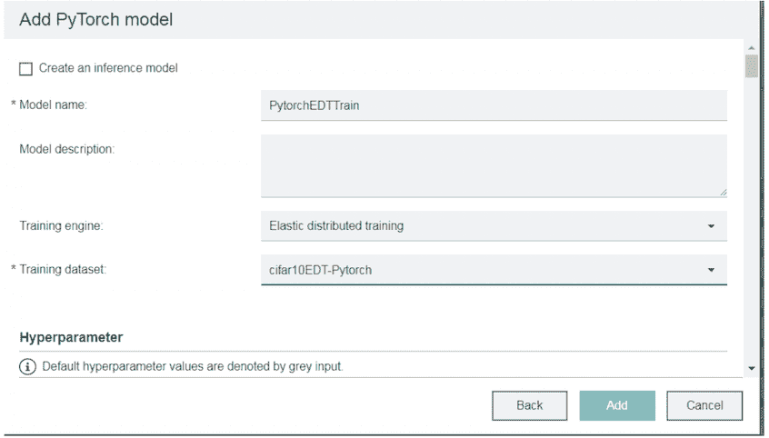

# 实现动态、弹性和细粒度的资源分配和控制，支持同时加速运行多个模型训练

> 原文：[`developer.ibm.com/zh/tutorials/dynamic-resilient-and-elastic-deep-learning-with-watson-machine-learning-accelerator/`](https://developer.ibm.com/zh/tutorials/dynamic-resilient-and-elastic-deep-learning-with-watson-machine-learning-accelerator/)

IBM Watson™ Machine Learning Accelerator 是一个软件解决方案，可以轻松快速地为贵组织构建端到端的深度学习环境。它以前称为 IBM PowerAI Enterprise，捆绑了 [IBM Spectrum Conductor](https://www.ibm.com/us-en/marketplace/spark-workload-management) 和 [IBM Spectrum Conductor Deep Learning Impact](https://www.ibm.com/ca-en/marketplace/spectrum-conductor-deep-learning-impact)，由 IBM 为包括开源深度学习框架在内的整个堆栈提供支持。Watson Machine Learning Accelerator 为数据科学家提供了端到端的深度学习平台。这包含完整的生命周期管理，从安装和配置到数据摄取和准备，再到训练模型的构建、优化和分发，最后到将模型迁移到生产环境。在您要将自己的深度学习环境扩展为包含多个计算节点时，Watson Machine Learning Accelerator 即可大显身手。甚至提供了免费评估版本；可参阅我们的第一个教程中的“前提条件”：“[使用 Watson Machine Learning Accelerator 对图像进行分类](https://developer.ibm.com/zh/tutorials/use-computer-vision-with-dli-watson-machine-learning-accelerator/)。”

在本教程中，您将使用 Watson Machine Learning Accelerator 弹性分布式训练 (EDT) 功能同时运行多个模型训练。 通过 EDT，我们可以在 GPU 和计算节点之间分配模型训练任务。可弹性分配训练作业，这意味着 GPU 是动态分配的：可以在执行时添加或删除 GPU，而不必终止作业。由于调度程序会动态分配 GPU，因此您无需将 GPU 拓扑编码到模型中（例如，节点 1 中的 GPU01 和节点 2 中的 GPU01）。您可以采用基于独立系统构建的模型，由 EDT 执行分配过程，而此过程对于最终用户而言是透明的。

## 学习目标

完成本教程后，您将能够：

*   构建单节点模型，以便使用 EDT 功能运行分布式训练
*   展示如何通过调整优先级在两个并行训练中动态分配 GPU

## 预估时间

本教程需耗时约 3 小时，包括大约 30 分钟的模型训练、安装和配置以及通过 GUI 完成的模型驱动。

## 前提条件

本教程需要访问 GPU 加速的 IBM Power Systems AC922 型或 S822LC 型服务器。除获取服务器外，还有多种方法可访问[开发者门户网站](https://developer.ibm.com/linuxonpower/deep-learning-powerai/try-powerai/)上列出的 Power Systems 服务器。

## 步骤

### 第 1 步. 下载、安装和配置 Watson Machine Learning Accelerator

1.  从 [IBM 软件存储库](https://www-01.ibm.com/marketing/iwm/iwm/web/dispatcher.do?source=swerpsw-watsonml-3)下载 IBM Watson Machine Learning Accelerator Evaluation 软件。下载需占用 4.9 GB 空间，并且需要 IBM ID。
2.  按照 IBM Knowledge Center 或 [POWER-Up User Guide](https://power-up.readthedocs.io/en/latest/Running-paie.html#) 中的说明来安装并配置 Watson Machine Learning Accelerator。

### 第 2 步. 配置操作系统用户

1.  在所有节点上的操作系统级别，以 root 用户身份为操作系统执行用户创建操作系统组和用户：

    1.  `groupadd egoadmin`
    2.  `useradd -g egoadmin -m egoadmin`
2.  在所有节点上创建的用户和组的 GID 和 UID *必须*相同。

### 第 3 步. 配置资源组

1.  以集群管理员用户身份登录。
2.  打开 **Resource Group** 配置。

    

3.  选择 **ComputeHosts** 资源组。

    

4.  正确配置插槽数的值。

    

5.  （可选但建议的步骤）将资源选择方法更改为静态，并仅选择将为集群提供计算能力（处理器能力）的服务器。

    

6.  单击 **Apply** 以提交更改。

7.  创建新资源组。

    

8.  将资源组命名为 ComputeHostsGPU。

    

9.  通过使用 `ngpus`，可利用高级公式来计算插槽数，其等于系统上的 GPU 数量。（可选但建议的步骤）将资源选择方法更改为静态，并选择支持 GPU 的节点。

    

10.  在 **Members Host** 列下，单击 **Preferences**，然后选择显示属性 **ngpus**。

    

11.  单击 **Apply** 并验证 Member Hosts 列现在是否显示 ngpus。

    

12.  通过单击 **Create** 来完成资源组的创建。

### 第 4 步. 创建 Spark 实例组

1.  通过单击 **Create** 来完成资源组的创建。

    

2.  单击 **New**。

    

3.  选择 **Template**。

    

4.  选择 **dli-sig-template-2-2-0**。

    

5.  输入以下三个值：

    *   实例组：sig-elastic
    *   Spark 部署目录：/home/egoadmin/sig-elastic
    *   实例组的执行用户：egoadmin

        

6.  单击 **Configuration**，修改 Spark 参数，然后将 **fairshare** 设置为 SPARK_EGO_APP_SCHEDULE_POLICY 变量的值。

    

    *   将 **true** 设置为 SPARK_EGO_ENABLE_PREEMPTION 变量的值。

        

7.  向下滚动并为您在先前屏幕中创建的 **Spark executors (GPU slots)** 选择 **ComputeHostsGPU** 资源组。请不要更改此处的任何其他配置。

    

    1.  单击 **Create and Deploy Instance group**。
    2.  单击 **Continue to Instance Group**。
    3.  观察您的实例组是否已部署。

### 第 5 步. 从 Model Zoo 下载经过检测的 PyTorch mnist 模型

下载 [dli-1.2.2-pytorch-samples](https://git.ng.bluemix.net/ibmconductor-deep-learning-impact/dli-1.2.2-pytorch-samples) 中的所有文件。


#### 针对高级用户的可选步骤：更新神经网络模型以运行 EDT

1.  导入并加载弹性分布式训练模型库 **fabric.zip**：

    ```
     path=os.path.join(os.getenv("FABRIC_HOME"), "libs", "fabric.zip")
     print('> fabric loaded from %s'%path)
     sys.path.insert(0,path)
     from fabric_model import FabricModel 
    ```

2.  将用户输入（在 Watson Machine Learning Accelerator UI 中输入的内容）加载到模型定义中，包括数据集、优化器和 epoch 的位置：

    ```
     import pth_parameter_mgr
     global train_data_dir, test_data_dir
     train_data_dir = pth_parameter_mgr.getTrainData(False)
     test_data_dir = pth_parameter_mgr.getTestData(False)
     optimizer = pth_parameter_mgr.getOptimizer(model)
     epochs = pth_parameter_mgr.getEpoch()
     train_batch_size = pth_parameter_mgr.getTrainBatchSize() 
    ```

3.  实例化弹性分布式训练模型实例以及以下参数：

    ```
     edt_m = FabricModel(model, getDatasets, F.cross_entropy, optimizer)
     # model = model definition to be trained
     # getDatasets = function name defined in model definition to retrieve dataset at each learner node
     # F.cross_entropy = loss function 
    ```

4.  启动弹性分布式训练，以及在第 2 步中检索的以下参数：

    ```
     edt_m.train(epochs, train_batch_size , engines_number)
     # engines_number = maximum number of GPUs requested by this training 
    ```

### 第 6 步. 下载数据集

对于本教程，我们将使用 cifar-10-batches-py；您可以从 [`www.cs.toronto.edu/~kriz/cifar.html`](https://www.cs.toronto.edu/~kriz/cifar.html) 下载 cifar10 Python 版本。

创建 train_db 和 test_db 目录，然后将 cifar-10-batches-py 文件夹复制到这两个目录中：

```
[root@node1 cifar10]# ls -lrt
total 8
total 8
drwxr-xr-x.3 root root 4096 Apr 26 08:33 train_db
drwxr-xr-x.3 root root 4096 Apr 26 08:59 test_db
[root@node1 train_db]# ls -lrt
total 4
drwxr-xr-x.2 root root 4096 Apr 26 08:57 cifar-10-batches-py
[root@node1 test_db]# ls -lrt
total 4
drwxr-xr-x.2 root root 4096 Apr 26 08:59 cifar-10-batches-py 
```

```
[root@node1 cifar-10-batches-py]# ls -lrt
total 181868
-rwxrwxrwx.1 root root 31035623 Apr  1 10:20 data_batch_5
-rwxrwxrwx.1 root root 31035526 Apr  1 10:20 test_batch
-rwxrwxrwx.1 root root 31035704 Apr  1 10:20 data_batch_1
-rwxrwxrwx.1 root root 31035696 Apr  1 10:20 data_batch_4
-rwxrwxrwx.1 root root 31035999 Apr  1 10:20 data_batch_3
-rwxrwxrwx.1 root root 31035320 Apr  1 10:20 data_batch_2 
```

### 第 7 步. 将数据加载到 Watson Machine Learning Accelerator 中

通过创建新数据集，将图像与 Watson Machine Learning Accelerator 相关联。


1.  在 Datasets 选项卡中，选择 **New**。

    

2.  单击 **Any**。显示对话框后，提供唯一名称（例如，’cifar10EDTpytorch’），并选择包含先前步骤中所获取的二进制文件的文件夹。准备就绪后，单击 **Create**。

    

### 第 8 步. 构建模型

1.  选择 Models 选项卡，然后单击 **New**。

    

2.  选择 **Add Location**。

    

3.  针对 Framework 选择 **PyTorch**，提供唯一名称（例如，PytorchResnet），并选择包含先前步骤中所获取的 ResNet 模型的文件夹。准备就绪后，单击 **Add**。

    

4.  针对新模型选择 **PytorchResnet**，然后单击 **Next**。

    

5.  确保“Training Engine”设置为“Elastic Distributed Training”，并且数据集指向您刚创建的数据集，然后单击 **Add**。

     

### 第 9 步. 运行训练

1.  提交编号为 1 的训练：

    1.  返回到 **Models** 选项卡，选择 **Train** 以查看可训练的模型，然后选择您在上一步中创建的模型。

    2.  提交最多包含 8 个工作者的第一个训练。

        

    3.  该集群包含两个 POWER9™ 服务器，资源网格中总共有 8 个可用的 GPU。调度程序从资源网格中获取所有 8 个 GPU，并将其分配给编号为 1 的训练。

        

2.  提交编号为 2 的训练：

    1.  返回到 **Models** 选项卡，选择 **Train** 以查看可训练的模型，然后选择您在上一步中创建的模型。

        

    2.  提交最多包含 8 个工作者的第二个训练。

        

    3.  Fairshare Policy 支持在具有相同优先级的正在运行的训练之间平等共享可用资源。通过 Fairshare Policy，调度程序将从编号为 1 的训练中预先清空并回收 4 个 GPU。调度程序将等待当前的训练迭代完成，包括跨工作者上传梯度同步情况。之后，调度程序从编号为 1 的训练中回收 4 个 GPU，并将它们分配给编号为 2 的训练。

         

    4.  每个训练都根据优先级获得应得的资源部分。可以调整训练优先级，以便动态重新分配 GPU 资源，而不中断正在运行的训练或失去最新进度。我们将编号为 2 的训练的优先级从 5,000（默认值）调整为 10,000。

        

    5.  通过更新优先级，调度程序会根据优先率重新分配 GPU。编号为 2 的训练的 GPU 分配变为 5 个 (10000/15000 -> 2/3)（总共 8 个 GPU），而编号为 1 的训练的 GPU 分配变为 3 个 (5000/15000 -> 1/3)。调度程序预先清空，从编号为 1 的训练中回收一个 GPU 并将其分配给编号为 2 的训练。

        

    6.  编号为 1 的训练最终在 6:04 完成，并将 3 个 GPU 返还到资源网格。调度程序始终从资源网格中查找可用的 GPU，并将这 3 个 GPU 分配给编号为 2 的训练，动态扩展到 8 个 GPU 并缩短整体迭代运行时间。

        

以下是编号为 1 的训练和编号为 2 的训练的资源使用情况图表。


## 结束语

IBM Watson Machine Learning Accelerator 弹性分布式训练技术提供了动态且细粒度的资源分配和控制，因此支持同时运行训练。调度程序负责分配训练任务（迭代），协调任务之间的同步，并根据最终用户定义的策略来动态分配资源 (GPU)。调度程序在请求最少的资源（1 个 GPU）的情况下启动训练任务，并不断从资源网格中查找可用的 GPU。弹性分布式训练具有容错性和弹性。当主机发生故障或者环境发生变化（例如，丢失云主机）时，调度程序会使用最新的参数和权重在另一台主机上重新排队并重新运行训练作业任务。这个关键功能不仅可缩短执行时间，还可提高数据科学家的工作效率。

本文翻译自：[Get dynamic, elastic, and fine-grained resource allocations and controls for accelerating multiple model trainings simultaneously](https://developer.ibm.com/tutorials/dynamic-resilient-and-elastic-deep-learning-with-watson-machine-learning-accelerator/)（2019-05-01）