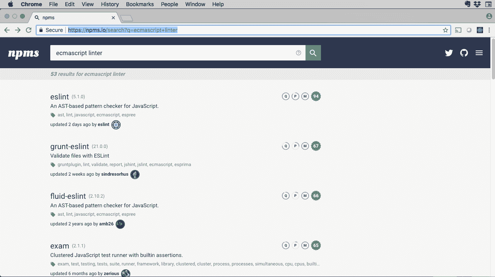
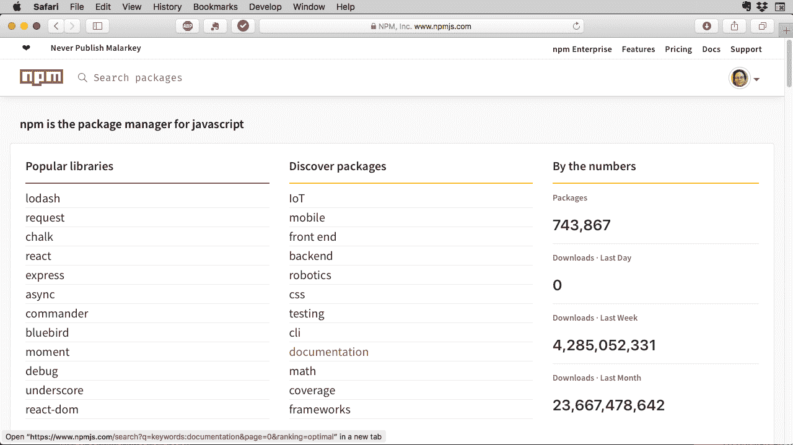

# Node Package Manager 介绍

> 原文：[`developer.ibm.com/zh/tutorials/learn-nodejs-node-package-manager/`](https://developer.ibm.com/zh/tutorials/learn-nodejs-node-package-manager/)

包管理是使用 Node.js 进行编程的一个组成部分。Node Package Manager (npm，Node 包管理器) 不仅仅是一个程序，还是一个完整的生态系统。在 Node.js 学习路径的第七部分中，我们来认识 npm 及其所有组件：

##### Node.js 学习路径

本教程是 Node.js 学习路径的一部分。各单元之间相辅相成，通过查看 Node.js 学习路径概述，可从头开始学习。

*   软件包的 npm 注册表。
*   用于管理这些包的 `npm` 命令行界面 (CLI) 程序。
*   npm 网站，可用于获取帮助并参与其中。

快速说明：在谈论 npm 生态系统时，我会将其称为 npm。在专门提及 npm CLI 时，我将使用 `npm`。

## 获取代码

我的 GitHub 存储库中提供了跟随此学习路径中的示例进行操作所需的代码。

[获取代码](https://github.com/jstevenperry/IBM-Developer/tree/master/Node.js/Course)

## npm 注册表

在第 3 单元中，您了解到 [npm 注册表](https://docs.npmjs.com/misc/registry)包含数十万个开源 Node 包，这些包由大型互动开发者社区提供支持。

在第 4 单元和第 5 单元中，您可能会从 npm 注册表经常出现的情况推断出，该注册表作为*特定*位置，用于寻找要在 Node 应用程序中使用的模块。

在知道包名的情况下找到并安装该包，这是一种情况，而在另一种情况下，假设您正在寻找*一种软件*，而不是特定的包。您将如何在注册表中找到所需内容？

例如，假设您在查找 JavaScript [linter](https://stackoverflow.com/questions/8503559/what-is-linting)。要在 `npm` 注册表中众多的 `linter` 中查找某一项，转到 [npm 网站](https://www.npmjs.com)。在页面顶部的搜索字段中输入“linter”，您将看到以下结果：

图 1\. 在 npmjs.com 中搜索 `linter`


选项太多！这里有超过 3000 个与关键字“linter”匹配的包，您将如何决定要使用哪一个？

首先，您可以缩小一下搜索范围。从[第 3 单元](https://developer.ibm.com/tutorials/learn-nodejs-tour-node/)得知，JavaScript 是一个 ECMAScript 实现，因此让我们来看看在向搜索词中添加 `ecmascript` 后会发生什么。

图 2\. 在 npmjs.com 中搜索 `ecmascript linter`


这样显然更好。筛选 50 个包比 3000 个包更容易。但是，进一步缩小搜索范围会不会有所帮助？

### 包评分

npmjs.com 的搜索功能（由 [npms.io](https://npms.io/) 提供）提供了三个有用的关键指标：

*   流行度
*   质量
*   维护

npm 注册表中的每个包都受制于[计算这些分数的算法](https://github.com/npms-io/npms-analyzer/blob/master/docs/architecture.md)。这些指标大体上意味着您对它们的认识，但如果想要获取更详细的解释，可查看 npms.io 上的 [About 页面](https://npms.io/about) 。

分数以条形图格式显示在每个条目的右上角，`p` 表示流行度，`q` 表示质量，`m` 表示维护。将鼠标悬停在每个链接上，就会弹出相关的数字分数。（我正在使用 Chrome；您看到的情况可能会有所不同。）

您也可以直接在 npms.io 上搜索包，同样搜索 `ecmascript linter` 产生了 53 条结果：

图 3\. 在 npms.io 中搜索 `ecmascript linter`



在该示例中，假设您选择在质量、流行度和维护方面平均值最高的包，最终就得到了 [eslint](https://github.com/eslint/eslint)，分数分别为 97、85 和 100，平均分为 94。

## npm CLI

在选择包后，就需要进行安装，这会将我们带到 `npm` 命令行界面 (CLI)。

该 CLI 是一个程序，充当 Node 程序的包管理器。Node 随附该 CLI。

### 您所知道的 npm

您已经在本课程中多次使用了 `npm`。在第 4 单元中，您使用 `npm` 安装了类似 `nodemon` 这样的包：

```
npm install -g nodemon 
```

您还使用 `npm` 运行了 `server.js`（通过 `npm start`），运行了功能测试（通过 `npm test`），甚至还从 `package.json` 运行了自定义脚本（通过 `npm run load-test` 和 `npm run start-dev`）。

现在，我们将更仔细地看一下 `npm` 的功能及其用途。

## 使用 npm 安装本地包

在第 6 单元中，您使用 `npm` 安装了 sqlite3 模块，该模块在购物清单应用程序的 `package.json` 文件中被指定为依赖项：

### 清单 1\. /Node.js/Course/Unit-6/package.json

```
{
  "name": "shopping-list",
  "version": "1.0.0",
  "description": "Shopping List",
 .
 .
 .
  "homepage": "https://github.com/jstevenperry/IBM-Code#readme",
  "dependencies": {
    "sqlite3": "⁴.0.1"
  }
} 
```

当 `npm` 没有参数时，它会安装 `package.json` 内 `dependencies` 对象中列出的所有模块。 （您将在第 8 单元中了解有关 `package.json` 的更多信息。）

### 安装一组新包

我们将 `npm install` 与不同于第 6 单元中所用的 `package.json` 一起使用。这将安装一组新包和依赖项。

首先，导航到我的 [GitHub 代码库](https://github.com/jstevenperry/IBM-Developer/tree/master/Node.js/Course/)中的 Node.js/Course/Unit-7 目录，在此会看到以下 `package.json`。须注意，该文件包含用于运行 `eslint` JavaScript linter 的 `pretest` 脚本。

#### 清单 2\. 带有 eslint 依赖项的 package.json

```
{
  "name": "Unit-7",
  "version": "1.0.0",
  "description": "Sample code for Unit 7",
  "main": "logger.js",
  "scripts": {
    "test": "echo \"Error: no test specified\" && exit 1",
    "pretest": "eslint --ignore-path ../../.gitignore ."
  },
  "keywords": [],
  "author": "J Steven Perry",
  "license": "Apache-2.0",
  "repository": {
    "type": "git",
    "url": "git+https://github.com/jstevenperry/IBM-Code"
  },
  "devDependencies": {
    "babel-eslint": "⁸.2.5",
    "eslint": "⁵.1.0",
    "eslint-config-strongloop": "².1.0"
  }
} 
```

如果运行 `npm install`，输出将类似如下：

```
$ npm install
added 164 packages from 190 contributors and audited 333 packages in 3.368s
found 0 vulnerabilities

$ 
```

### 获取有关已安装软件的信息

要查看所安装的 `eslint` 的版本，可运行 `npm list eslint` 命令：

```
$ npm list eslint
Unit-7@1.0.0 /Users/sperry/home/development/projects/IBM-Code/Node.js/Course/Unit-7
©¸©¤©¤ eslint@5.1.0

$ 
```

要查看 node_modules 中的*完整依赖项树*，可在不指定任何模块的情况下运行 `npm list`。输出看起来类似如下（由于非常冗长，此处已有所省略）：

```
$ npm list
Unit-7@1.0.0 /Users/sperry/home/development/projects/IBM-Code/Node.js/Course/Unit-7
├─┬ babel-eslint@8.2.5
│ ├─┬ @babel/code-frame@7.0.0-beta.44
│ │ └─┬ @babel/highlight@7.0.0-beta.44
│ │   ├── chalk@2.4.1 deduped
│ │   ├── esutils@2.0.2 deduped
│ │   └── js-tokens@3.0.2 deduped
.
.
│ │ └── estraverse@4.2.0
│ └── eslint-visitor-keys@1.0.0
├─┬ eslint@5.1.0
│ ├─┬ ajv@6.5.2
│ │ ├── fast-deep-equal@2.0.1
│ │ ├── fast-json-stable-stringify@2.0.0
│ │ ├── json-schema-traverse@0.4.1
│ │ └─┬ uri-js@4.2.2
│ │   └── punycode@2.1.1
│ ├─┬ babel-code-frame@6.26.0
.
.
│ │ ├── lodash@4.17.10 deduped
│ │ ├─┬ slice-ansi@1.0.0
│ │ │ └── is-fullwidth-code-point@2.0.0 deduped
│ │ └── string-width@2.1.1 deduped
│ └── text-table@0.2.0
└── eslint-config-strongloop@2.1.0
$ 
```

在安装 `eslint` 后，您可以使用针对 `logger.js` 的 [strongloop](https://strongloop.com/strongblog/loopback-updates-open-source-contributor-documentation/) 编码样式查明所生成的错误消息类型。

要运行 `eslint`，可运行上述清单 2 中的 `pretest` 脚本，这次使用 `npm run pretest` 命令：

```
$ npm run pretest

> Unit-7@1.0.0 pretest /Users/sperry/home/development/projects/IBM-Code/Node.js/Course/Unit-7
> eslint --ignore-path ../../.gitignore .

/Users/sperry/home/development/projects/IBM-Code/Node.js/Course/Unit-7/logger.js
  91:10  error  'setMessageOnlyOutput' is defined but never used  no-unused-vars
  92:3   error  'messageOnlyOutput' is not defined                no-undef

✖ 2 problems (2 errors, 0 warnings)

npm ERR! code ELIFECYCLE
npm ERR! errno 1
npm ERR! Unit-7@1.0.0 pretest: `eslint --ignore-path ../../.gitignore .`
npm ERR! Exit status 1
npm ERR!
npm ERR! Failed at the Unit-7@1.0.0 pretest script.
npm ERR! This is probably not a problem with npm. There is likely additional logging output above.

npm ERR! A complete log of this run can be found in:
npm ERR!     /Users/sperry/.npm/_logs/2018-07-11T21_13_15_041Z-debug.log
$ 
```

第一次运行时，linter 发现多个问题的情况并不少见。我实际上清理了 `logger.js` 来捕获上面的输出。

此外，您还可以配置 [strongloop config](https://github.com/strongloop/eslint-config-strongloop) 和 [eslint 规则](https://eslint.org/docs/rules/)。您可以在 Unit-7 源代码的 `.eslintrc.json` 文件中看到这一点，我在此覆盖了 `max-len` 规则（80 个字符对我来说似乎很保守）。

## 使用 npm 安装全局包

就像本地包一样，您已经有了一些关于全局包的实践。在第 4 单元中，您安装了全局包 `nodemon`。正如我在那里提到的，全局安装会将包添加到 PATH，因此您可以从计算机上的任何位置运行该包，这对于像 `nodemon` 这样的 CLI 包特别有用。

用于安装全局包的命令是 `npm install -g PACKAGE_NAME`，其中 `PACKAGE_NAME` 是包的名称，如 `nodemon`。

### 本地安装与全局安装

npm 的开发者对于[何时全局安装包以及何时不全局安装包有一个经验法则](https://docs.npmjs.com/getting-started/installing-npm-packages-globally)：

*   如果包是您需要从计算机上的任何位置运行的命令行工具，那么全局安装该包。
*   如果包是应用程序依赖项，那么[本地安装该包](https://docs.npmjs.com/getting-started/installing-npm-packages-locally)。

## npm 实用程序

`npm` 不仅仅可用于实现简单安装。 我最喜欢的两个用于 `npm` CLI 的实用程序是 `npm prune` 和 `npm doctor`。

### npm prune

如果您像我一样，在开发过程中进行实验，在落实最终解决方案之前尝试多个选项，那么不幸的是，这可能会导致*无关的依赖项*，这些是您不会使用的安装包。

例如，假设您要尝试 `fluid-eslint`，因而安装此项：

```
$ npm install fluid-eslint
+ fluid-eslint@2.10.2
added 72 packages from 91 contributors and audited 795 packages in 4.877s
found 0 vulnerabilities
$ npm list fluid-eslint
Unit-7@1.0.0 /Users/sperry/home/development/projects/IBM-Code/Node.js/Course/Unit-7
└── fluid-eslint@2.10.2
$ 
```

在某一时刻，您决定不再使用 `fluid-eslint`。将其从 `package.json` 中删除，但从 `package.json` 中删除包并不会更改 node_modules 的内容。`fluid-eslint` 及其依赖项仍位于 node_modules 中。

未在 `package.json` 中列为依赖项并且不是另一个包依赖项的已安装顶级包会被视为无关的包。您需要一种可删除无关依赖项的方法，此时 `npm prune` 即可派上用场。

#### 删除无关依赖项

要识别无关包，可运行 `npm list`。所有无关的包都将列在依赖项树的底部，并附带一条错误消息：

```
$ npm list
Unit-7@1.0.0 /Users/sperry/home/development/projects/IBM-Code/Node.js/Course/Unit-7
├─┬ babel-eslint@8.2.5
│ ├─┬ @babel/code-frame@7.0.0-beta.44
│ │ └─┬ @babel/highlight@7.0.0-beta.44
│ │   ├── chalk@2.4.1 deduped
│ │   ├── esutils@2.0.2 deduped
│ │   └── js-tokens@3.0.2 deduped
│ ├─┬ @babel/traverse@7.0.0-beta.44
.
.
│ │ ├─┬ slice-ansi@1.0.0
│ │ │ └── is-fullwidth-code-point@2.0.0 deduped
│ │ └── string-width@2.1.1 deduped
│ └── text-table@0.2.0
├── eslint-config-strongloop@2.1.0
└── fluid-eslint@2.10.2 extraneous

npm ERR! extraneous: fluid-eslint@2.10.2 /Users/sperry/home/development/projects/IBM-Code/Node.js/Course/Unit-7/node_modules/fluid-eslint
$ 
```

须注意，`fluid-eslint` 被列为 `extraneous`。

现在，您可以使用 `npm prune` CLI 实用程序从 node_modules 中删除 `fluid-eslint` 及其依赖项：

```
$ npm prune
removed 72 packages and audited 333 packages in 1.59s
found 0 vulnerabilities

$ 
```

如果您使用 `npm list fluid-eslint` 运行 `npm install`，那么将会看到所有痕迹都已消失：

```
$ npm install
audited 333 packages in 1.434s
found 0 vulnerabilities

Ix:~/home/development/projects/IBM-Code/Node.js/Course/Unit-7 sperry$ npm list fluid-eslint
Unit-7@1.0.0 /Users/sperry/home/development/projects/IBM-Code/Node.js/Course/Unit-7
└── (empty)
$ 
```

### npm doctor

`npm doctor` 是一个方便的实用工具，可确保您的 npm 环境正常运行。 其输出如下所示：

```
$ npm doctor
Check                               Value                        Recommendation
npm ping                            OK
npm -v                              v6.1.0
node -v                             v10.6.0
npm config get registry             https://registry.npmjs.org/
which git                           /usr/local/bin/git
Perms check on cached files         ok
Perms check on global node_modules  ok
Perms check on local node_modules   ok
Verify cache contents               verified 5660 tarballs
$ 
```

它会运行许多检查，包括通过 `npm ping` 确保您的计算机可以连接到 npm 注册表（位于 registry.npmjs.org），运行 `node` 和 `npm` 的版本检查以及 `git` 程序的路径等等。

有关 `npm doctor` 的更多信息，可查看其[文档页面](https://docs.npmjs.com/cli/doctor)。

##### 有关 npm 的更多信息

`npm` 的完整指南超出了本课程的范围，尤其是因为这些信息已经存在于 [npm 文档](https://docs.npmjs.com)中。如果您要了解更多信息，那么务必查看 npm 文档。在本课程的其余部分中，您将会使用 `npm`，所以我鼓励您熟悉这方面的内容。

## `npm` 的备选项

虽然 `npm` 是最早的 Node.js 包管理器（可以追溯到 2010 年 1 月发行的 [V0.0.1](https://github.com/npm/npm/releases/tag/v0.0.1)），但它不是唯一的包管理器。在本部分中，我将展示一些您应该了解的内容，先从以下可能最受欢迎的 `npm` 替换项开始：Yarn。

### Yarn

[Yarn](https://yarnpkg.com/) 是用于 Node 的包管理器，与 `npm` CLI 一样使用一个 npm 注册表。它[由 Facebook 开发](https://code.fb.com/web/yarn-a-new-package-manager-for-javascript/)，并于 2016 年 10 月发布。

Yarn 在 npm 上提供了许多改进，包括：

##### Yarn 使用一个 npm 注册表？

我认为 Yarn 使用*一个* npm 注册表，是因为在撰写本文时，[`registry.yarnpkg.com`](https://registry.yarnpkg.com) 实际上是 [registry.npmjs.org 的反向代理](https://github.com/yarnpkg/yarn/issues/889)，这多半出于性能原因。虽然存在一个建议弃用 registry.yarnpkg.com 的 [yarnpkg GitHub 问题](https://github.com/yarnpkg/yarn/issues/5891)，但使用中的注册表对大多数 Node 开发者而言都应该是不可见的。

*   **脱机访问**：Yarn 允许您访问已下载的包，而 `npm` CLI 需要 Internet 访问权限才能运行 `npm install`（除非您使用 [`npm pack`](https://docs.npmjs.com/cli/pack）或类似 [`offline-npm`](https://www.npmjs.com/package/offline-npm) 的附加组件）。

*   **许可检查**：Yarn 为依赖项提供内置许可检查，而 `npm` 需要类似 [`license-checker`](https://www.npmjs.com/package/license-checker) 的附加组件。

#### 安装 Yarn

您可以使用以下命令从 npm 注册表将 Yarn 安装为全局包：`npm install -g yarn`。Yarn 就像 `npm` 一样使用 `package.json`。要安装包，只需使用 `yarn install` 而不是 `npm install`。

```
cd IBM-Code/Node.js/Course/Unit-7
rm -Rf node_modules
yarn install 
```

您应该会看到类似如下的输出：

```
Ix:~/src/projects sperry$ cd IBM-Code/Node.js/Course/Unit-7/
Ix:~/src/projects/IBM-Code/Node.js/Course/Unit-7 sperry$ rm -Rf node_modules/
Ix:~/src/projects/IBM-Code/Node.js/Course/Unit-7 sperry$ yarn install
yarn install v1.7.0
[1/4] 🔍  Resolving packages...
[2/4] 🚚  Fetching packages...
[3/4] 🔗  Linking dependencies...
[4/4] 📃  Building fresh packages...
✨  Done in 2.32s.
Ix:~/src/projects/IBM-Code/Node.js/Course/Unit-7 sperry$ 
```

然后，您可以运行 `yarn pretest`，就像运行 `npm run pretest` 一样（Yarn 会判定 `pretest` 是一个脚本，您因而可跳过 `run` 子命令）：

```
Ix:~/src/projects/IBM-Code/Node.js/Course/Unit-7 sperry$ yarn pretest
yarn run v1.7.0
$ eslint --ignore-path ../../.gitignore .

/Users/sperry/home/development/projects/IBM-Code/Node.js/Course/Unit-7/logger.js
  91:10  error  'setMessageOnlyOutput' is defined but never used  no-unused-vars
  92:3   error  'messageOnlyOutput' is not defined                no-undef

✖ 2 problems (2 errors, 0 warnings)

error Command failed with exit code 1.
info Visit https://yarnpkg.com/en/docs/cli/run for documentation about this command. 
```

须注意，您从 `eslint` 获得的输出与从 `npm` 获得的输出相同。

#### Yarn 可为您解开谜团

与 npm 一样，Yarn 提供了许多非常方便的实用程序。 `why` 是我最喜欢的实用程序之一。

在仔细查看 package.json 或 node_modules 目录时，您可能想知道为何要使用给定包。在 Yarn 中，您不必疑惑。例如，假设您在 node_modules 中看到一个名为 `acorn` 的包：

```
Ix:~/src/projects/IBM-Code/Node.js/Course/Unit-7/node_modules sperry$ yarn why acorn
yarn why v1.7.0
[1/4] 🤔  Why do we have the module "acorn"...?
[2/4] 🚚  Initialising dependency graph...
[3/4] 🔍  Finding dependency...
[4/4] 🚡  Calculating file sizes...
=> Found "acorn@5.7.1"
info Reasons this module exists
   - "eslint#espree" depends on it
   - Hoisted from "eslint#espree#acorn"
   - Hoisted from "eslint#espree#acorn-jsx#acorn"
info Disk size without dependencies: "68MB"
info Disk size with unique dependencies: "68MB"
info Disk size with transitive dependencies: "68MB"
info Number of shared dependencies: 0
✨  Done in 0.19s. 
```

看起来 `acorn-jsx` 需要 `acorn` 包，该包由 `espree` 使用，而 `espree` 则由 `eslint` 使用。

完整的依赖路径就是以下行中的 `eslint` > `espree` > `acorn-jsx` > `acorn`：

```
 - Hoisted from "eslint#espree#acorn-jsx#acorn" 
```

它甚至会告诉您占用了多少磁盘空间，简直太酷了！

### 更多适用于 Node 的包管理器

Node 生态系统包含其他包管理器，但大多数都不是 `npm` 的嵌入式替换项，而是提供在 `npm` 之外运行的某些功能。

*   [Webpack](https://webpack.github.io)：一个模块捆绑程序，主要用于浏览器。
*   [Bower](https://bower.io/)：`npm` 的准嵌入式替换项，主要用于浏览器。（可参阅：[How to migrate away from Bower](https://bower.io/blog/2017/how-to-migrate-away-from-bower/)）。
*   [RequireJS](https://requirejs.org/docs/node.html)：主要是 Node 模块的 `require()` 替换项。
*   [pnpm](https://github.com/pnpm)：`npm` 的完全嵌入式替换项（如 Yarn）。

## npm 网站

在需要有关 Node 的帮助或其他信息时，可使用 [npm 网站](https://www.npmjs.com)。您可以通过它来访问 Node 文档，也可以作为开发者参与其中的 Node.js 项目。

### 获取帮助

npm 网站提供：

*   广泛的 [Node.js 文档](https://docs.npmjs.com/)。
*   [支持页面](https://www.npmjs.com/support)，其中包含指向 [Twitter](https://twitter.com/npm_support) 和 [GitHub](https://github.com/npm/npm/issues) 上各种版块的链接。
*   [注册表](https://status.npmjs.org/)、[网站](https://github.com/npm/www/issues) 和 [CLI](https://github.com/npm/npm/issues) 的状态页面。

### 参与其中

假设您创建了一个很棒的包，希望通过 npm 注册表与全世界分享。现在该做什么呢？

要在 registry.npmjs.org 中发布 npm 包，就需要[设置一个帐户](https://www.npmjs.com/signup)。

在验证了您的电子邮件地址后，就可以在 npm 注册表中共享您的新包。您需要遵循特定的[标准和程序](https://docs.npmjs.com/getting-started/publishing-npm-packages)。

登录后，首页会有一些有趣的指标：

图 4\. npm 首页



在撰写本文时，首页列出了超过 80 万个用于 Node 的包！

## 结束语

在本单元中，您了解到 npm 涉及三个方面：

*   Node 的软件包注册表。
*   用于管理软件中 Node 包的命令行界面（CLI）程序（`npm`）。
*   可获取帮助并参与项目的网站。

可查看参考资源，了解有关 npm 生态系统、`npm` CLI 和 [npm 网站](https://www.npmjs.com)的更多信息。

该学习路径将继续进入第 8 单元，您将深入了解如何管理 Node 中的依赖项。

## 测试您的理解情况

### 判断题

1.  `npm` 是用来与 npm 注册表交互的最早的 CLI。

2.  `npm` 的嵌入式替换项表示您只能将它用于 `require()` 和特定的 `npm` 函数。

3.  除非在 `package.json` 的 `dependencies` 部分中指定，否则无法安装本地包。

核对答案

### 选择最佳答案

1.  以下哪一项是 `npm` 的嵌入式替换项？

    A. Zeke

    B. tower

    C. flake

    D. Yarn

    E. 以上皆是

2.  以下哪一个组合命令将会显示 `PACKAGE_NAME` 的当前安装版本（假设在 `package.json` 中指定了 `MODULE_NAME`）？

    A. `npm install && npm --curver MODULE_NAME`

    B. `npm install && npm list MODULE_NAME`

    C. `yarn install && yarn list MODULE_NAME`

    D. `npm install && npm MODULE_NAME --version`

    E. A 和 D

    F. B 和 C

    G. 以上都不是

核对答案

### 填空

1.  npm 生态系统包含三个组件：npm *********_*********、`npm` ********__********和 npm *********_*********。

2.  提供使用 `npm` 全局安装 Yarn 时用到的命令：`npm` **********_**********。

3.  要从 Node 应用程序的 node*modules 目录中删除无关的包，可使用 `npm` *****__****** 命令。

核对答案

## 核对答案

### 判断题的答案

1.  答案：**对**：虽然还有其他 CLI 客户端，但 `npm` 是在 2010 年 1 月发布的。

2.  答案：**错**：`npm` 的嵌入式替换项是一个功能类似于 `npm` CLI 的程序。例如，代替使用 `npm install -g nodemon`，您可以通过 `yarn global add nodemon` 来全局安装 `nodemon`。

3.  答案：**错**：虽然不推荐，但您可以在没有 `package.json` 文件的情况下安装本地依赖项。可使用以下命令：`npm install PACKAGE_NAME`，其中 PACKAGE_NAME 是要安装的包的名称。

### 选择题的答案

1.  答案：**Yarn** 是所列名称中唯一的 `npm` 嵌入式替换项。

2.  答案：**F. B 和 C**：一旦通过 `npm` 或 Yarn 安装了包，`list` 子命令就适用于任何一个 CLI。须注意，不应进行混搭；换句话说，不要使用一种工具进行安装，而使用另一种工具执行 `list`。

### 填空题的答案

1.  答案：registry、CLI、网站

2.  答案：**install -g yarn (or i -g yarn)**，完整命令：`npm install -g yarn`

3.  答案：**prune**

## `npm` 备用项

*   [Yarn](https://yarnpkg.com/)：`npm` 的嵌入式替换项。
*   [pnpm](https://github.com/pnpm)：`npm` 的另一个嵌入式替换项。
*   [Webpack](https://webpack.github.io)：一个模块捆绑程序，主要用于浏览器。
*   [Bower](https://bower.io/)：`npm` 的准嵌入式替换项。
*   [RequireJS](https://requirejs.org/docs/node.html)：主要是 Node 模块的 `require()` 替换项。

本文翻译自：[Introduction to node package manager](https://developer.ibm.com/tutorials/learn-nodejs-node-package-manager/)（2018-12-31）