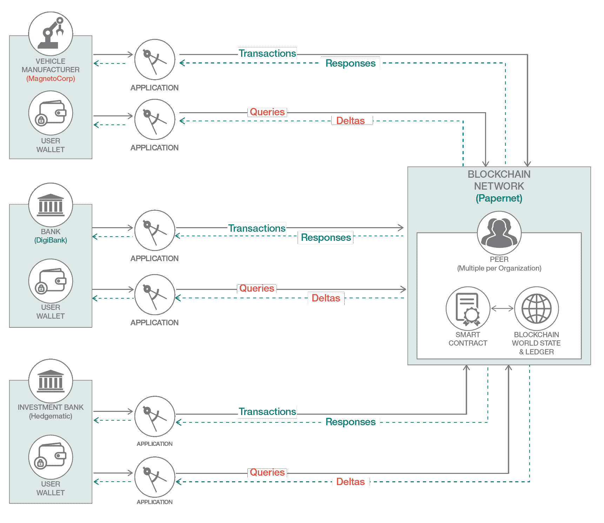
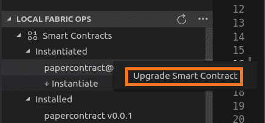
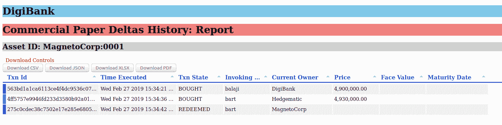

# 通过添加增量内容历史记录查询功能升级商业票据智能合约

> 原文：[`developer.ibm.com/zh/tutorials/add-further-query-functionality-using-the-ibp-vscode-extension/`](https://developer.ibm.com/zh/tutorials/add-further-query-functionality-using-the-ibp-vscode-extension/)

在[使用 IBM Blockchain VSCode 扩展增强商业票据智能合约并添加查询功能](https://www.ibm.com/developerworks/cn/cloud/library/queries-commercial-paper-smart-contract-ibm-blockchain-vscode-extension/index.html)教程中，我为您展示了如何利用 IBM Blockchain VSCode 扩展来添加丰富的查询功能并增强智能合约。通过学习该教程，您学会了如何查询商业票据实例的历史记录和生命周期，并报告这些内容。展示不可变的历史记录固然重要，但假如您只想了解该历史记录中的每个交易提交了哪些更改，该怎么办呢？当您要处理大量交易或者寻找某些模式时，此类用例即可发挥作用。以下示例演示了一个较小规模的例子；尽管如此，其背后的原理以及所提供的代码样本实际上适用于任何分类账和用例。

图 1 显示了此教程的一般流程。须注意，相比于[“使用 IBM Blockchain VSCode 扩展增强商业票据智能合约并添加查询功能”教程](https://developer.ibm.com/tutorials/queries-commercial-paper-smart-contract-ibm-blockchain-vscode-extension/)，主要区别在于查询商业票据生命周期内所发生更改的历史记录时，智能合约只会返回“增量内容”（稍后将详加介绍）。

**图 1\. 概述图**



本教程的目的是添加仅从区块链中提取*增量内容*并进行报告的功能。即：

*   添加仅用于获取现有智能合约逻辑增量内容的必要功能
*   使用 IBM Blockchain Platform VSCode 扩展升级具有丰富查询的现有智能合约（来自上一个教程）。
*   以 DigiBank 员工身份在更新后的 DigiBank 客户端应用程序上试用该功能来提取结果。
*   在客户端浏览器中通过 HTML 表格呈现增量内容，报告相关商业票据生命周期的增量内容 – 在初始创建后发生了哪些更改？

您将使用本教程中包含的代码块，为现有查询类添加功能。您还将提供客户端应用程序更改，以调用 `getDeltas` 查询事务。最后，您将在基于 HTML 的简单表格中显示增量内容历史记录结果。

此处的目标是*仅*显示更改/增量内容历史记录 – 因此在 HTML 表格中不会显示*所有*字段；未更改的内容将显示为空白，但“状态”之类的常量除外。（例如，不同组织的两次连续“BUY”交易将处于相同状态。）

您将使用 IBM Blockchain Platform VSCode 扩展以及全新的 Hyperledger Fabric 编程模型和 SDK 功能部件来完成这些任务。

## 背景

最新的 [Hyperledger Fabric 开发应用程序](https://hyperledger-fabric.readthedocs.io/en/release-2.2/tutorial/commercial_paper.html)文档中出色地描述了商业票据用例场景，这里所描绘的场景着实引人入胜。简而言之，这是大型机构/组织获得资金以偿还短期债务的一种方式，而投资者则可借此机会在投资到期后获取投资收益。

在先前的商业票据场景中，用户以各自组织（MagnetoCorp 和 DigiBank）的参与者身份参与交易。现在，您将通过牵涉到另一家组织 Hedgematic 来延长商业票据的生命周期，该组织主要用于显示生命周期内的更多历史数据。

## 前提条件

1.  您需要完成本系列中的上一个教程[使用 IBM Blockchain VSCode 扩展增强商业票据智能合约并添加查询功能](https://www.ibm.com/developerworks/cn/cloud/library/queries-commercial-paper-smart-contract-ibm-blockchain-vscode-extension/index.html)。
2.  具体来说，就是将商业票据智能合约程序包 V0.0.2 加载到 IBM Blockchain Platform VSCode 扩展（位于“Smart Contracts”窗格下）中。
3.  您应该已创建交易的历史记录，即已通过前述教程创建了交易历史记录或“书面记录”。
4.  您应该已连接到本地 Fabric，并且在 IBM Blockchain Platform VSCode 侧边栏中的 **LOCAL FABRIC Ops** 窗格下，`papercontract@0.0.2` 已显示为实例化的 papercontract 版本。
5.  在 VSCode Explorer 中，选择 **File > Open Folder**，并通过浏览至 `$HOME/fabric-samples/commercial-paper/organization/magnetocorp` 目录选择 `contracts` 文件夹。此文件夹将作为本教程的顶层项目文件夹。

## 预估时间

验证满足所有前提条件后，完成本教程大约需要 45 分钟时间。

## 场景

MagnetoCorp 员工 Isabella 和 DigiBank 投资交易员 Balaji 都应该能够看到商业票据实例的增量内容（反映在分类账中）历史记录，并在客户端浏览器中报告这些内容。DigiBank 开发者 Luke 负责将此增强查询功能添加到智能合约中，然后在区块链上对其进行升级 – 使用 IBM Blockchain Platform VSCode 扩展来完成全部任务。此外，Luke 还必须提供客户端应用程序，以便 Balaji 可通过简单的浏览器应用来运行 `queryDeltas` 查询事务并进行报告。

让我们开始吧！

## 步骤

### 第 1 步. 在主合约源文件中添加 getDeltas 主查询事务

1.  在 VSCode 中，`contracts` 应作为顶层文件夹。

2.  打开 `lib` 文件夹下的主合约脚本文件 `lib/papercontract.js`。按照下面的说明添加以下代码块：

    在*最后一个*函数 `queryOwner` *之前*和函数 `queryHist` *之后*，添加以下行。这位于“主”合约文件中，稍后将从客户端应用程序调用以下 `queryDeltas` 事务。

    ```
    /**
        * queryDeltas commercial paper
        * @param {Context} ctx the transaction context
        * @param {String} issuer commercial paper issuer
        * @param {Integer} paperNumber paper number for this issuer
        */
        async queryDeltas(ctx, issuer, paperNumber) {

        // Get a key to be used for History / Delta query
            let cpKey = CommercialPaper.makeKey([issuer, paperNumber]);
            let myObj = new QueryUtils(ctx, 'org.papernet.commercialpaperlist');
            let results = await myObj.getHistory(cpKey);
            let deltas = await myObj.getDeltas(results);
            let jsonstr = myObj.jsontabulate(deltas);
            return jsonstr;
        } 
    ```

    您将注意到，它会调用查询类 `query.js` 中的现有 `getHistory` 函数。这会使用迭代器来获取票据的完整历史记录。接下来，它会调用 `getDeltas` 函数（同样从 `query.js` 调用，此函数当前尚不存在！），该函数负责在初始发行票据后对增量内容进行解析。您将在下一个步骤中使用此实用程序功能。

3.  须注意，在您将此内容粘贴到 VSCode 中后，`ESLinter` 可能（如果已启用）会在“Problems”窗格中报告一个问题。通过在底部“Problems”窗格中选择 `right-click....`，然后选择 `Fix all auto-fixable issues`，即可轻松纠正任何格式问题。同样，此操作将移除报告的所有尾部空格。

4.  完成这个格式化任务后，保存您的文件（选择菜单中的 **Save**，或者按 **Ctrl+S** 来保存文件）。

### 第 2 步. 将 getDeltas 查询工作程序函数添加到 query.js 中的查询类

1.  单击源文件 `lib/query.js` 将其打开。按照下面的说明添加以下工作程序函数。这样将获取增量内容，并将数据返回至主 `queryDeltas` 函数，采用的格式为适合传递到 `tabulator` HTML 客户端应用的 JSON 格式。

    在现有 `getHistory` 函数*之后*和（紧接在 `module.exports` 行之前的）右括号*之前*，粘贴以下两个函数：

    ```
    // =========================================================================================
       // getDeltas takes getHistory results for an asset and returns the deltas
       // =========================================================================================

       async getDeltas(obj)  {

           let deltaArr = [];
           let counter = 0;
           let xtra_checked;

           Object.getOwnPropertyNames(obj).forEach( function (key, idx) {
               xtra_checked=0;
               let stdfields = 'TxId, Timestamp, IsDelete';

               for (let field of Object.keys(obj[key]) ) {
                   let val = obj[key];
                   counter = idx+1;
                   let val2 = obj[counter];

                   if (counter < obj.length ) {

                       if ( (stdfields.indexOf(field)) > -1 ) {
                           deltaArr.push(field, val[field]);
                       }

                       if (field === 'Value') {

                           for (let element of Object.keys(val[field]) ) { // Value stanza
                               // changes: of value, existing field
                               if ( val2[field].hasOwnProperty(element) && (val[field][element] !==  val2[field][element] )) {
                                   deltaArr.push(element, val2[field][element]);
                               }
                               // deletes: field/val deleted (! item.next))
                               if ( (!val2[field].hasOwnProperty(element)) )  {
                                   deltaArr.push(element, val[field][element]);
                               }
                               // adds: (new in item.next),add once only!
                               if (!xtra_checked) {
                                   for ( let xtra of Object.keys(val2[field]) ) {
                                   //console.log("xtra is " + val2[field][xtra] + "checking field " + xtra + "bool " + val[field].hasOwnProperty(xtra) );
                                       if ( (!val[field].hasOwnProperty(xtra)) ) {
                                           deltaArr.push(xtra, val2[field][xtra]);
                                       }
                                   }
                                   xtra_checked=1;
                               } // if xtra
                           } // for each 'element' loop
                       } // if 'Value' in payload
                   } // if less than obj.length
               } // for each 'field' loop
           }  // 'foreach' loop
           ); //closing Object.keys

           return deltaArr ;
       } // async getDeltas

       // =========================================================================================
       // jsontabulate takes getDelta results array and returns the deltas in tabulator(.info) form
       // rendered as a nicely formatted table in HTML
       // =========================================================================================

       jsontabulate(array)  {
           let i= 1;
           let length = array.length;
           let val = '[{'; // begins with - FYI below, each element is stripped of "" by key/value stepthru
           for (let [key, value] of Object.entries(array)) {
               console.log('key is' + key + 'value is ' + value);
               if ( i > 1 && ( (i % 2) === 0)  ) {

                   if (i < length)  {
                       val = val + '"' + value + '"' + ',';}  // (output 2-tuple)
                   else {
                       val = val + '"' + value + '"}]'; }  // last record
               }
               else {
                   if (value === 'TxId') {val = val.replace(/,$/,'},{');} // delimit each record, just before TxId
                   val = val + '"' + value + '"' + ':';   // key:value
               }
               i++;
           }
           return val;
       } 
    ```

2.  须注意，在您将此内容粘贴到 VSCode 中后，`ESLinter` 可能（如果已启用）会在“Problems”窗格中报告一个问题。通过在底部“Problems”窗格中选择 `right-click....`，然后选择 `Fix all auto-fixable issues`，即可轻松纠正任何格式问题。同样，此操作将移除报告的所有尾部空格。

3.  完成此格式化任务并确保底部不再显示任何问题后，即可使用 **Ctrl+S** 来保存文件。

现在就让我们将此新合约功能放在区块链上并替换旧版本。

### 第 3 步. 使用 VSCode 扩展来升级智能合约版本，并将新版本实例化

1.  首先，需要更新合约的版本号。为此，可更新 `package.json` 文件，并更改版本，为合约升级做准备。单击 Explorer 中的 `package.json` 文件，然后执行以下操作：

    *   将版本更改为 0.0.3。
    *   按“CONTROL + S”进行保存。
2.  接下来，单击源控件侧边栏图标，然后单击 `tick` 图标以提交，出现“adding queries”消息后按 **Enter** 键。

    您现在已准备好使用 VSCode 扩展来升级现有智能合约程序包。

3.  单击 `IBM Blockchain Platform` 侧边栏图标，在“Smart Contract Packages”下选择“Package a smart contract”。应该会看到版本“0.0.3”已变为 `papercontract` 的最新版本。

4.  在 IBM Blockchain Platform 侧边栏中的 **LOCAL FABRIC Ops** 面板下，展开已实例化的合约“papercontract”，使其突出显示。

5.  右键单击 **papercontract@0.0.2 — Upgrade Smart Contract**，并从显示的列表中选择“papercontract@0.0.3”（顶部）。然后，选择顶部提供的对等项。

6.  提示输入要调用的函数名称时，输入 `org.papernet.commercialpaper:instantiate`，然后按两次 ENTER 键（该函数无需任何参数）。

    **图 2\. 在 IBM Blockchain VSCode 扩展中升级 `papercontract` 智能合约**

    

    控制台中应该会显示一条消息，表明正在进行升级。

    执行升级需要大约一分钟时间（因为它必须构建新的智能合约容器），随后在右下角会弹出“successful instantiation”消息。`docker ps` 中显示的容器将以合约版本号 (0.0.3) 为后缀。

### 第 4 步. 升级 DigiBank 查询客户端应用程序以调用 queryDeltas 事务

1.  在 VSCode 中，单击菜单选项 **File > Open Folder**，打开 `organization/digibank/application` 下的文件夹，然后按 **Enter** 键。

2.  打开现有文件 `queryapp.js`（来自上一个教程），然后在以注释 `// query the OWNER of a commercial paper` 开头的行*之前*粘贴以下显示的内容。

    粘贴以下代码：

    ```
    // query the DELTAS of the history for a commercial paper
    console.log('Calling queryDeltas to get the deltas of Commercial Paper instance 00001');
    console.log('========================================================================');

    // QUERY the deltas of a commercial paper providing it the Issuer/paper number combo below
    const deltaResponse = await contract.submitTransaction('queryDeltas', 'MagnetoCorp', '00001');

    console.log('the deltas HISTORY response is ' + JSON.parse(deltaResponse));
    // parse the response sent back from contract -> client app
    let file2 = await fs.writeFileSync('deltas.json', JSON.parse(deltaResponse), 'utf8');
    console.log(' '); 
    ```

3.  接着，可以选择 **View > Problems** 查看格式或缩进错误。在“Problems”窗格中，右键单击 `Fix all auto-fixable errors`，这样应可自动修复所有缩进问题。

4.  按 **Ctrl+S** 保存文件，然后单击 `Source Control` 图标提交文件，这样会显示一条提交消息。`Queryapp.js` 客户端包含三个查询函数（其中两个函数已存在）：

    *   `queryHist` 函数用于获取商业票据实例的历史记录。
    *   `queryDeltas` 函数用于获取此历史记录的增量内容。
    *   `queryOwner` 函数用于获取组织拥有的商业票据的列表（作为参数提供给查询函数）。

接下来，您将通过终端窗口测试新应用程序客户端。

### 第 5 步. 运行更新后的 DigiBank 客户端查询应用程序

此时，您已拥有来自上一个教程的交易历史记录。现在能够以来自 Digibank 的 Balaji 身份运行增量内容查询应用，使用他现有的钱包来运行查询：

1.  在终端窗口中，将目录切换至 `$HOME/fabric-samples/commercial-paper/organization/digibank/application` 文件夹。

2.  使用 `node queryapp.js` 节点运行 queryapp 客户端。

3.  在终端窗口中，应该会依次看到 `queryHist` 函数、`queryDeltas` 函数以及 `queryOwner` 事务的结果。在当前目录中，`queryHist` 查询事务会创建名为 results.json 的文件，`queryDeltas` 查询事务则会创建名为 deltas.json 的文件。

### 第 6 步. 向浏览器应用显示已格式化的增量内容历史记录结果

接下来，您将使用简单的 [Tabulator](http://tabulator.info/examples/4.1) 在良好的 HTML 表格中呈现结果。您本身无需安装任何代码和客户端，只需使用简单的 HTML 文件即可，此文件使用在线 CSS 格式并执行本地 `XMLHttpRequest() GET REST API` 调用，以便从 JSON 文件加载结果（避免 CORS 问题），并在表格中呈现出来。在先前克隆的 `commpaper` GitHub 存储库中也提供了此 index.html 文件；请花些时间来仔细阅读此文件。

***注意：**此 HTML 文件按现状提供，用于在 Firefox 浏览器中呈现。（在撰写本文时，一些 JavaScript 格式在 Chrome 中无效，但在 Firefox 中却正常，例如，`forEach` 循环。）*

1.  启动 Firefox 浏览器会话（如果尚未安装 Firefox，先完成安装），将 index.html 文件与发行者/票据编号一起作为一个参数提供。例如：

    ```
    firefox deltas.html?myParam="MagnetoCorp:0001" 
    ```

2.  在浏览器中应该会看到以表格形式显示的增量内容（按列出的调用 ID 显示该交易中发生的更改）；根据需要增大或减小列宽。须注意，此处的 TxId 是 Fabric 交易 ID。调用 ID 是调用者的公用名称，使用上一个查询教程中的客户端身份库来抽取。

    增量内容表示初始创建资产（“issue”交易）后所发生的更改，主要涉及资产的所有者和支付的价格。（当然，如果其他字段发生更改，报告也会反映这些更改。）

    另外还须注意，在每一行上都会报告状态。例如，在一行中包含两个“buy”交易状态并不一定表示状态发生更改，而是为了清楚起见才报告的。

    **图 3\. 样本商业票据生命周期内的更改历史记录**

    

做得不错！现在，您已知道了如何使用 IBM Blockchain Platform VSCode 扩展向商业票据智能合约添加查询功能。

## 结束语

在这个分为三个部分的系列教程中，您已学会了如何使用 IBM Blockchain Platform 增强现有智能合约，进而在开发环境中编排和部署更改。您还添加了仅用于从完整资产历史记录中捕获增量内容的代码，并在基于 HTML 的客户端应用程序中呈现这些内容。

*   [第 1 部分：使用 IBM Blockchain VSCode 扩展来运行商业票据智能合约](https://www.ibm.com/developerworks/cn/cloud/library/run-commercial-paper-smart-contract-with-ibm-blockchain-vscode-extension/index.html)
*   [第 2 部分：使用 IBM Blockchain VSCode 扩展增强商业票据智能合约并添加查询功能](https://www.ibm.com/developerworks/cn/cloud/library/queries-commercial-paper-smart-contract-ibm-blockchain-vscode-extension/index.html)

要进一步学习，我建议您查看 IBM Developer [Code Pattern](https://developer.ibm.com/cn/patterns/category/blockchain/)，使用 IBM Blockchain Platform VSCode 扩展来试用其他样本用例。例如，[Global Finance 样本用例](https://developer.ibm.com/cn/patterns/global-financing-use-case-for-blockchain/)提供了一份 Global Finance 智能合约，以及使用全新 Fabric 1.4 合约/fabric-network 编程模型增强功能与之交互的样本 Web 应用程序。

本文翻译自：[Upgrade a commercial paper smart contract by adding deltas history query capability](https://developer.ibm.com/tutorials/add-further-query-functionality-using-the-ibp-vscode-extension/)（2019-03-03）