# 通过结合使用 SPSS 与数据库仓库连接开展预测性分析

> 原文：[`developer.ibm.com/zh/tutorials/set-up-spss-modeler-on-watson-studio-with-db2-warehouse-connection/`](https://developer.ibm.com/zh/tutorials/set-up-spss-modeler-on-watson-studio-with-db2-warehouse-connection/)

IBM SPSS Modeler 提供预测性分析，可帮助您发现数据模式，提高预测准确性，并改进决策。本教程演示了在 Watson Studio 上使用 SPSS Modeler 的端到端流程：在 Db2 Warehouse 数据库中摄取数据，执行分析，并将结果作为新表重新存储到数据库中。

## 学习目标

本教程将展示如何：

1.  在 Watson Studio 中添加 Db2 Warehouse 连接。
2.  创建一个新的 SPSS Modeler 流或添加一个现有的 SPSS Modeler。
3.  运行 SPSS Modeler 并将输出存储在 Db2 Warehouse 中。

## 前提条件

*   [IBM Cloud 帐户](https://cocl.us/IBM_CLOUD_GCG)
*   IBM Cloud 目录中的[对象存储服务实例](https://cloud.ibm.com/catalog/services/cloud-object-storage?cm_sp=ibmdev-_-developer-tutorials-_-cloudreg)
*   IBM Cloud 目录中的 [Watson Studio 服务实例](https://cloud.ibm.com/catalog/services/watson-studio?cm_sp=ibmdev-_-developer-tutorials-_-cloudreg)
*   IBM Cloud 目录中的 [Db2 Warehouse 服务实例](https://cloud.ibm.com/catalog/services/db2-warehouse?cm_sp=ibmdev-_-developer-tutorials-_-cloudreg)
*   对于本教程，我们将使用 Kaggle 的 Titanic 数据集，可在[此处找到](https://www.kaggle.com/c/titanic/data)。在您下载了该数据集之后，将文件解压缩到本地文件系统。

## 预估时间

完成本教程大约需要 30 分钟。

## 步骤

### 第 1 步：在 Db2 Warehouse 中加载样本数据

*   打开 [IBM Cloud Dashboard](https://cloud.ibm.com/?cm_sp=ibmdev-_-developer-tutorials-_-cloudreg)，然后在 `Cloud Foundry Services` 下面打开您创建的 `Db2 Warehouse instance`。
*   在打开的页面中单击 `Open Console`，如下所示。

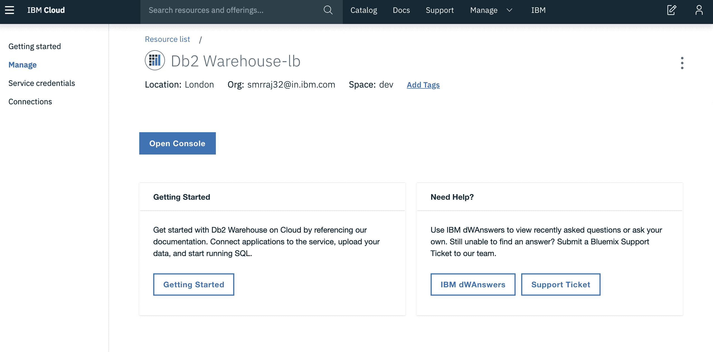

*   在此服务打开之后，从侧边菜单中单击 `load` 选项。

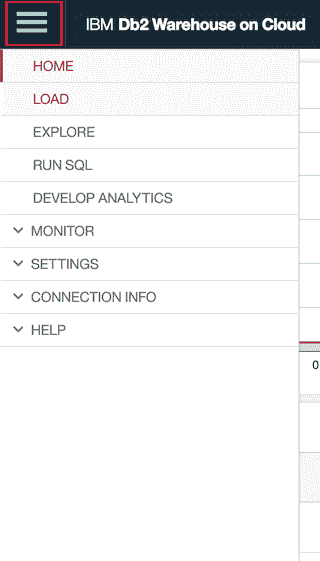

*   从 Kaggle 提供的解压缩数据文件夹中选择 `train.csv` 文件。

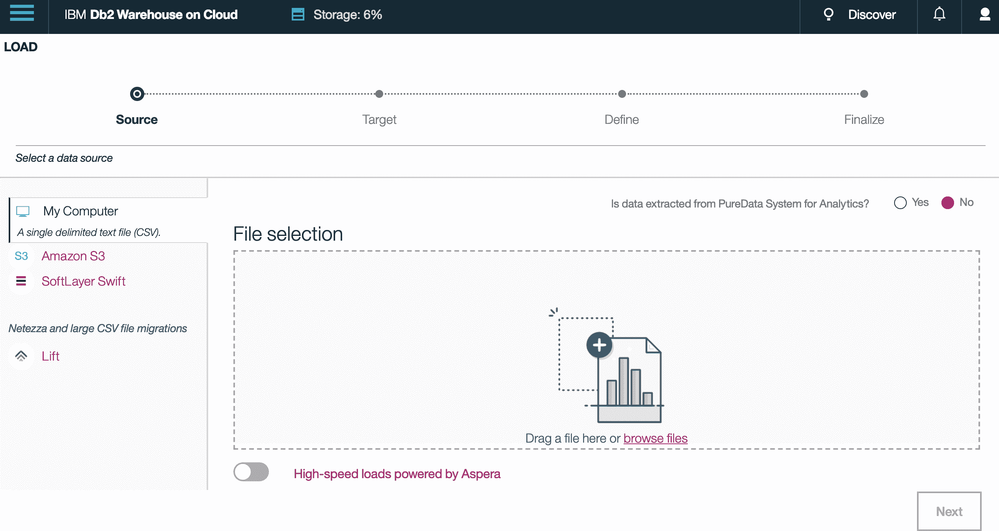

*   在加载后，选择适当的模式，通常指定为 DASH 后跟一系列数字。单击 `New Table` 选项，如下所示。

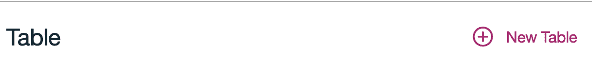

*   将其命名为 `TITANIC_DATA` 或者您选择的任何其他名称。然后单击 `Begin Load`。

### 第 2 步：在 Watson Studio 中添加 Db2 Warehouse 连接

*   从 IBM Cloud Dashboard 中打开 Watson Studio，然后导航到创建的项目，或者创建一个新的 `Modeler` 项目，并确保将您的 Cloud Object Storage 实例链接到该项目。

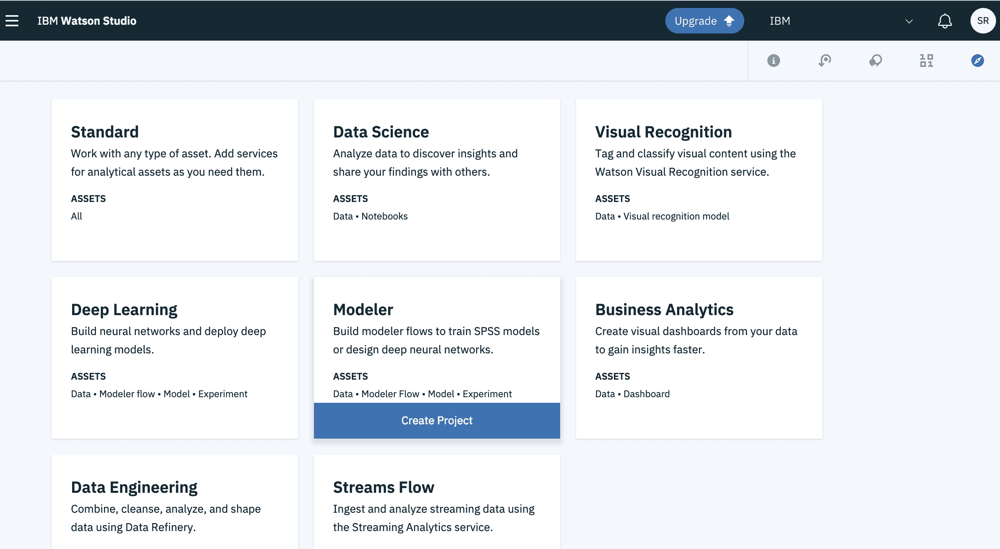

*   单击 `Add to Project` 按钮，然后选择 `Connection`。

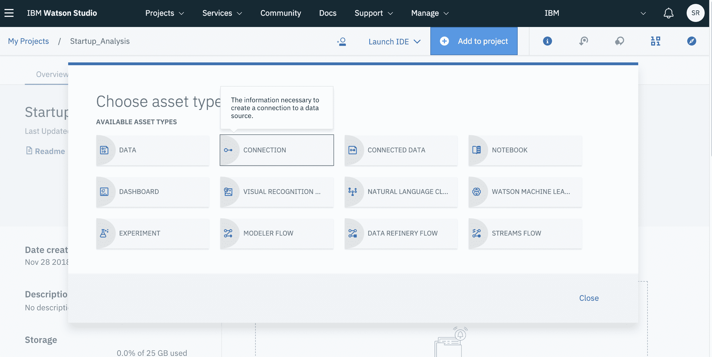

*   选择在 IBM Cloud 中创建的 `Db2 Warehouse` 实例。

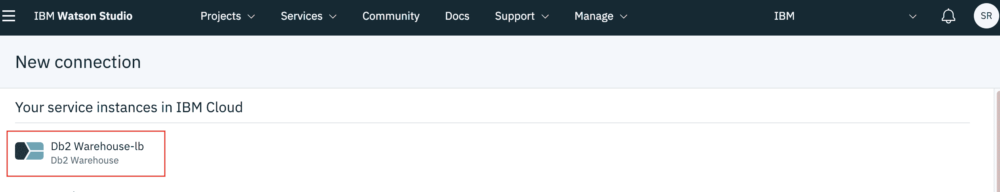

*   详细信息应该已经填写，此时单击 `Create` 按钮。

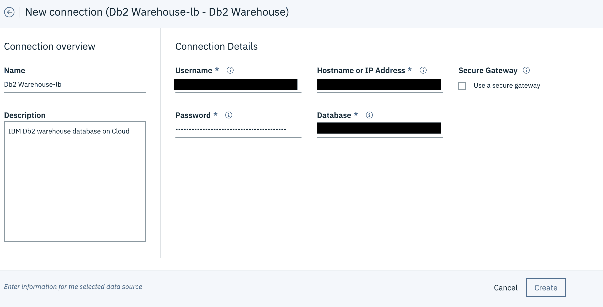

### 第 3 步：创建 SPSS Modeler 并从 Db2 Warehouse 插入数据

*   单击 `Add to Project` 按钮，然后选择 `Modeler`。

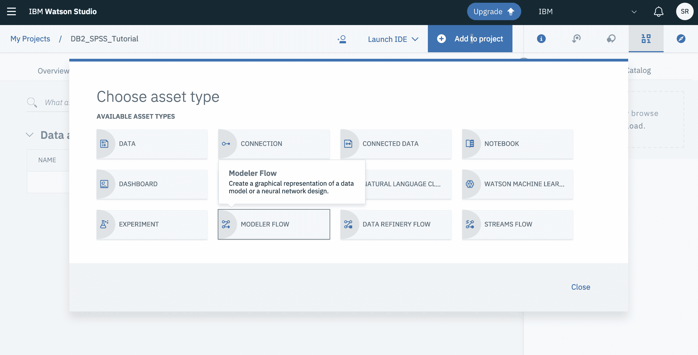

*   输入建模器的名称，并确保选择了以下选项，然后单击 `Create`。

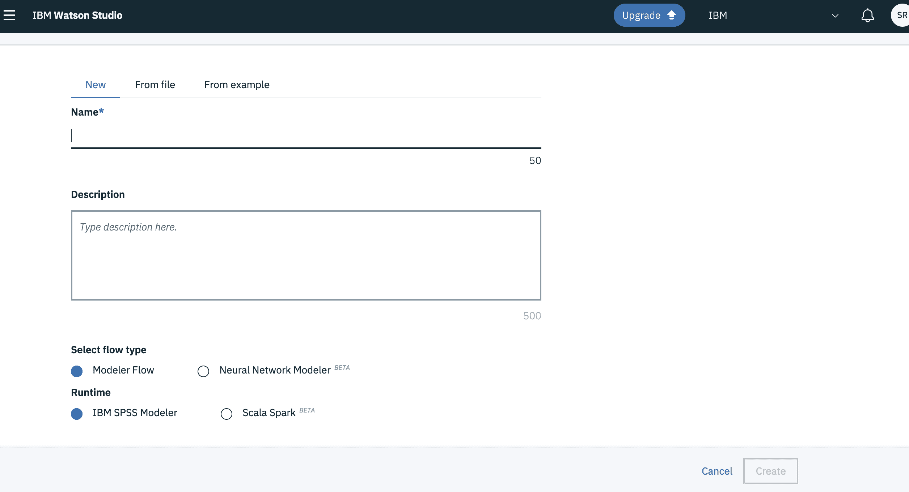

*   在右侧菜单的 `Import` 选项卡下，拖放 `Data Assets` 节点。

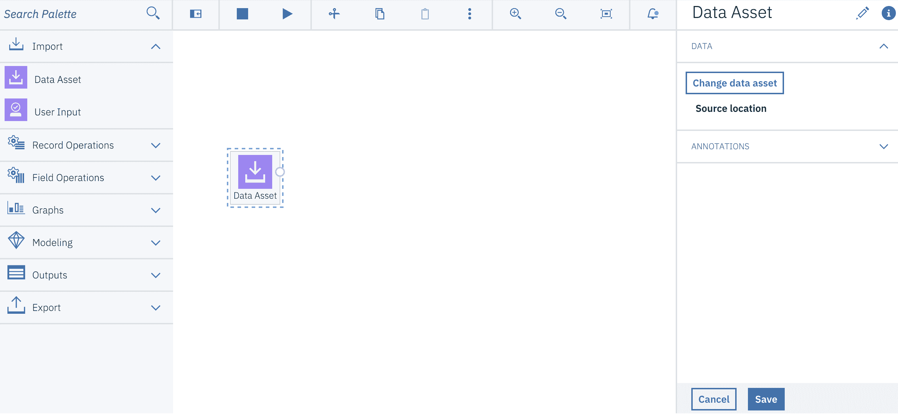

*   单击 `Change Data Asset > Connections > Db2Warehouse`，然后选择您的模式或默认模式（以 DASH 开头）和上载的表。接下来，单击 `Save`。

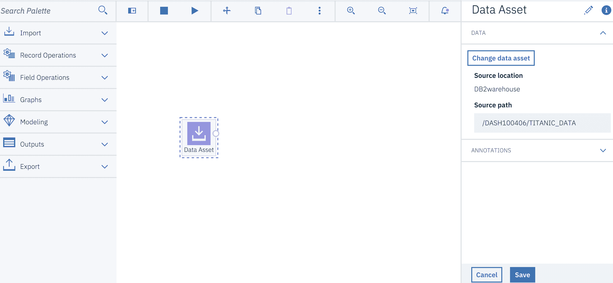

### 第 4 步：使用 SPSS Modeler 实现可视化、开展分析并执行特征选择

*   在给定一个数据集的情况下，SPSS Modeler 提供了许多可视化工具来理解这些数据。在本节中，本教程将展示如何创建这些可视化内容，并根据数据获得洞察。

#### 可视化

*   在 `Data Asset` 节点的选项中，单击 `Preview` 选项，然后转到 `Visualizations` 选项卡。

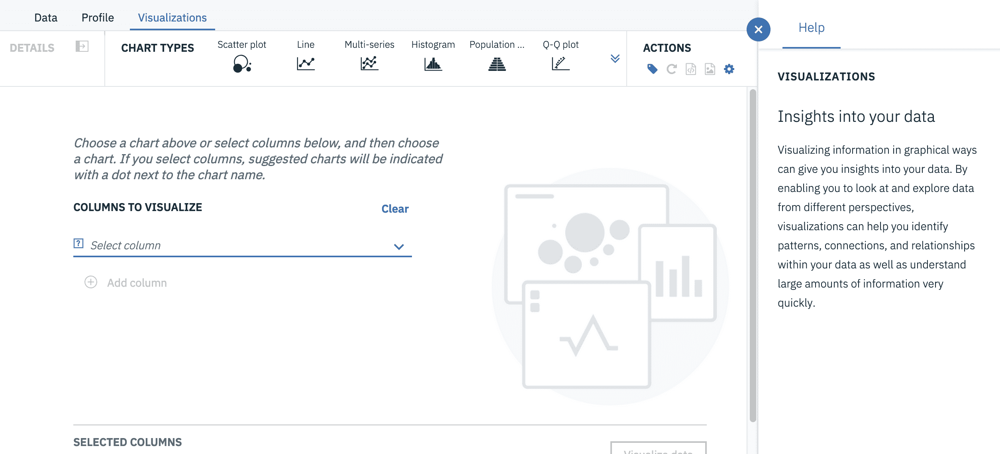

*   直方图用于显示数据的分布情况，在这个例子中，绘制图形时，在 x 轴上绘制 `Age` 并按 `sex` 划分。

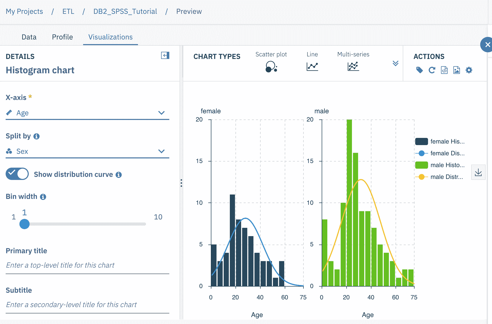

从这张图中，我们可以看到乘客的年龄服从正态分布，即大多数人的年龄范围在 20 到 55 岁之间，而 20 岁以下和 50 岁以上的人较少。我们也可以看到，在某些年龄组中，男性多于女性。

*   条形图便于一目了然地比较不同组之间的数据集。在这里，我们看到的是男性幸存者和女性幸存者人数之间的比较情况。以 `sex` 为类别，汇总值为 `count`，值选项为 `Survived`。

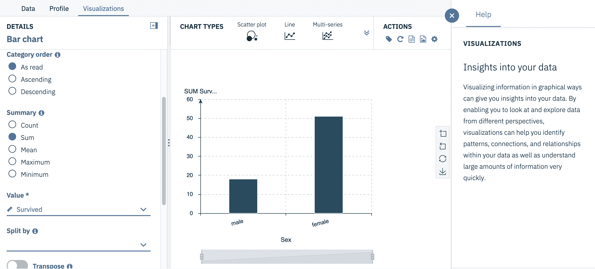

*   当试图计算出某些内容的构成时，最好使用饼图。在这种情况下，我们给出了类别 `Cabin`。

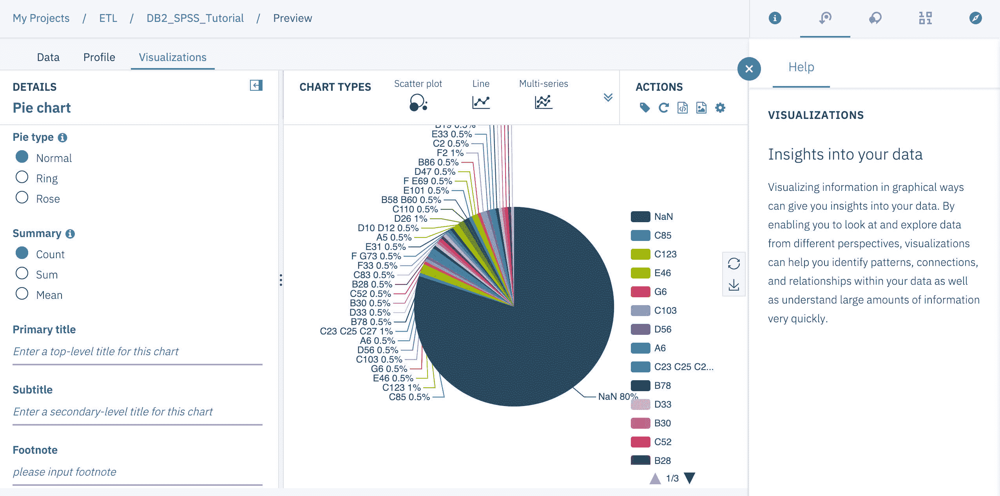

从这个饼图中，我们可以看到 80% 的 `Cabin` 列包含 NaN，也就是缺少值。因此，我们可以得出结论：这一列不会影响目标，在我们的例子中，也就是 Survived 列，因而可以删除这一列。

#### 特征选择

*   在使用特征选择之前，我们需要准备数据集。首先，我们使用 `Filler` 通过空值和 NaN 值来填充所有缺失值。接下来，我们使用 `Filter` 节点通过可视化阶段过滤掉 `Cabin` 列。最后，指定正确的 `Type`。

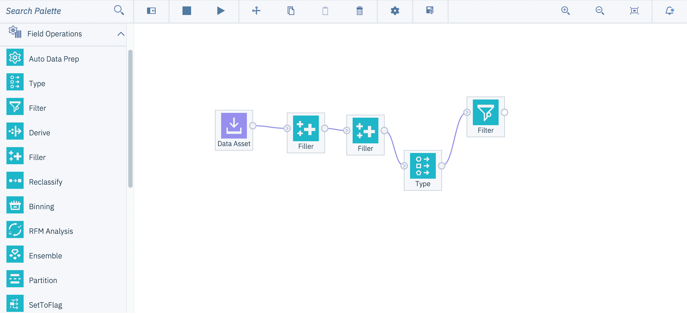

*   在 `Type` 节点中，将 `Survived` 列的 `Role` 属性调整为 `Target`。

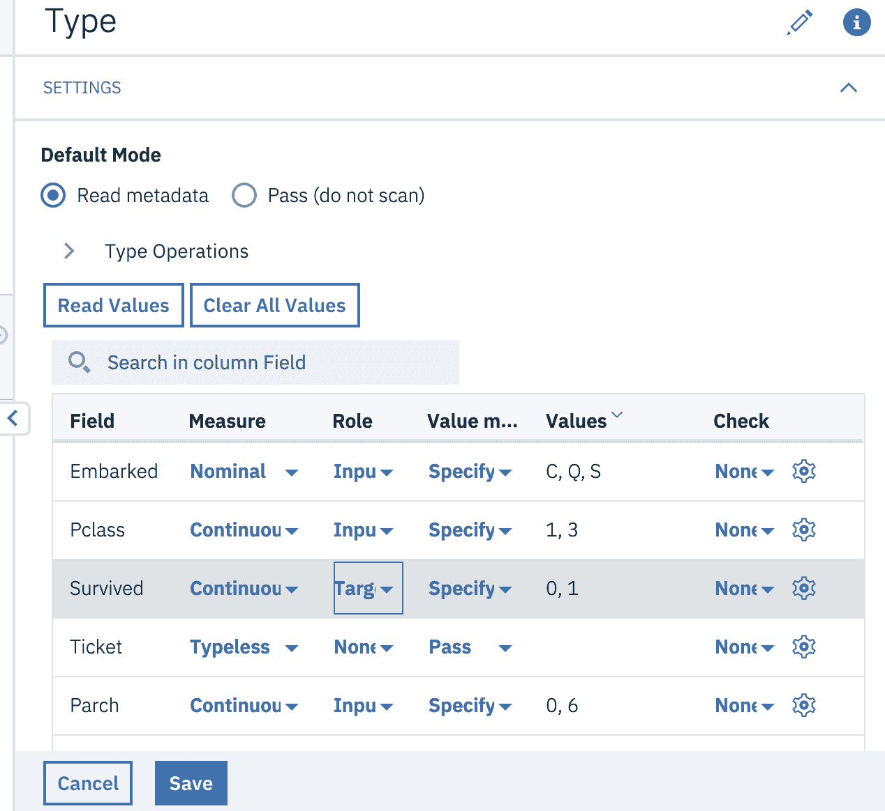

*   使用 `Modeling` 选项卡下的特征选择方法，并运行建模器。

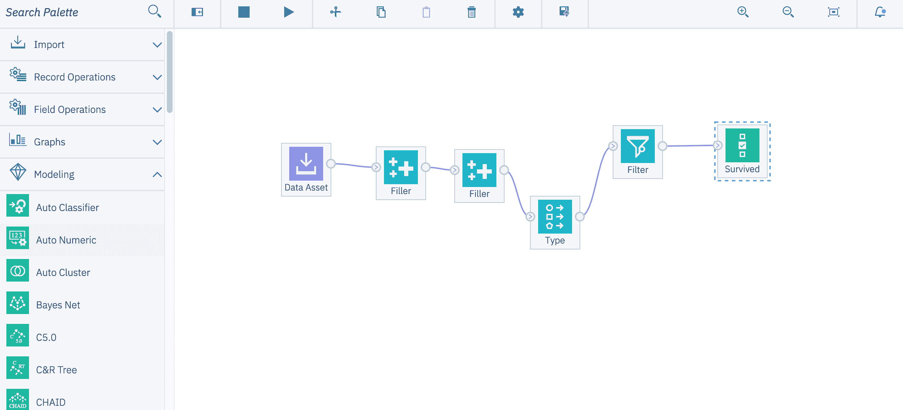

*   将生成一个模型节点，当连接到 `Output` 选项卡中的 `Table` 节点时，您可以看到它过滤掉了不重要的列。

注意：可以使用 Derive 和 Merge 等节点从现有列创建新列，并合并两个数据帧。

### 第 5 步：将数据重新保存到 Db2 Warehouse

*   从 `Export` 选项卡添加 `Data Asset Export` 节点。
*   遵循 在 Db2 Warehouse 中加载样本数据中的步骤连接您的 Db2 Warehouse 实例，并选择任意表。
*   在保存对节点的更改之前，输入输出表的名称，确保该名称对于模式中的表名是唯一的。

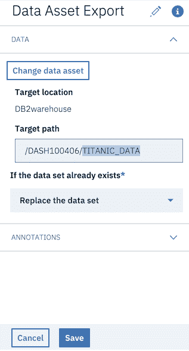

*   运行建模器流程，所需的输出将保存在您的 `Db2 Warehouse` 中。

## 结束语

在本教程中，您学习了如何：

*   将数据从 Db2 Warehouse 加载到 SPSS Modeler 中。
*   使用 SPSS 节点对给定数据集执行初步可视化、预处理和特征工程。
*   将数据直接重新存储到 Db2 Warehouse。

本文翻译自：[Predictive analytics using SPSS with database warehouse connection](https://developer.ibm.com/tutorials/set-up-spss-modeler-on-watson-studio-with-db2-warehouse-connection/)（2019-03-05）