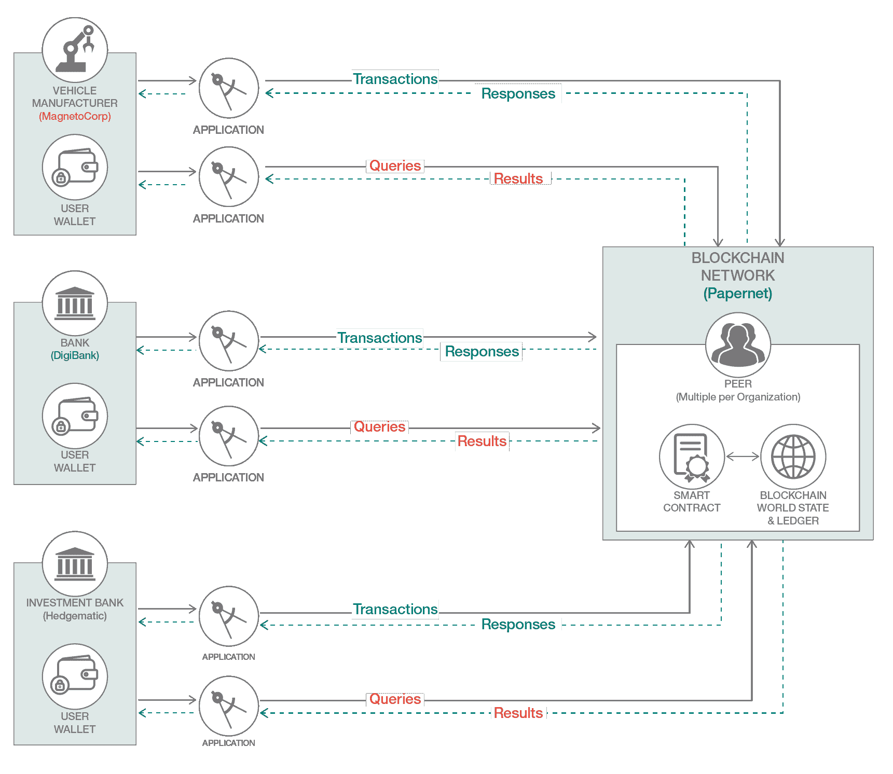
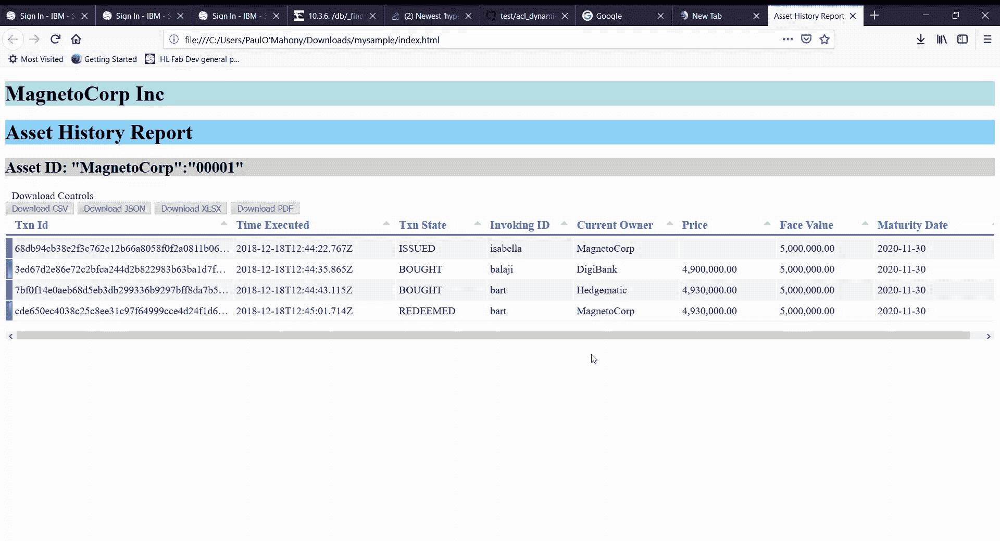
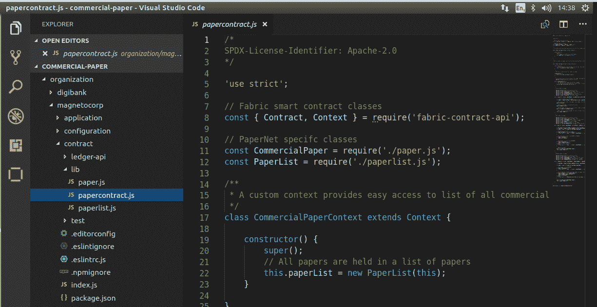
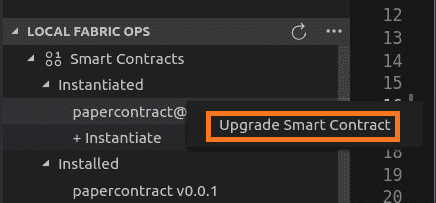
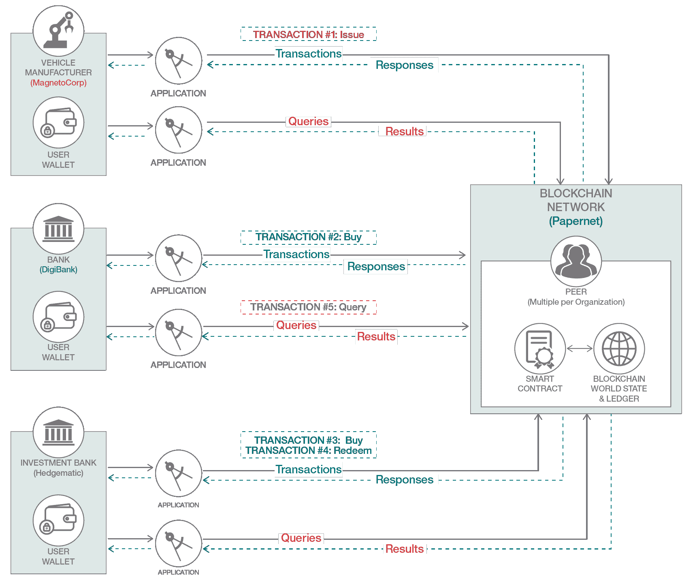
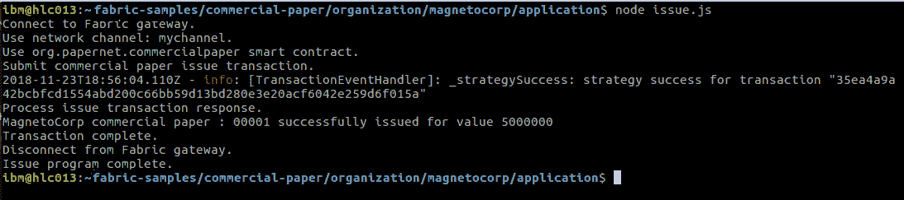
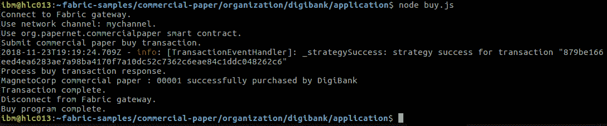
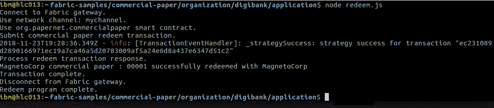
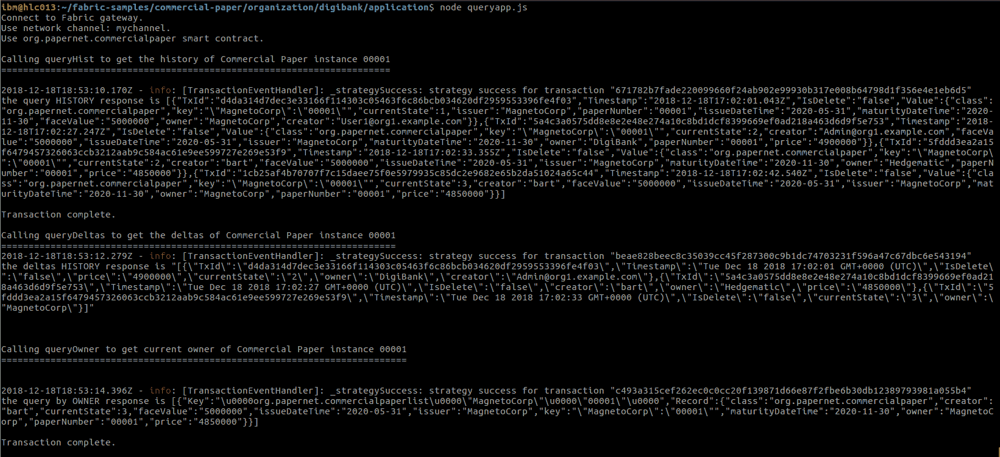
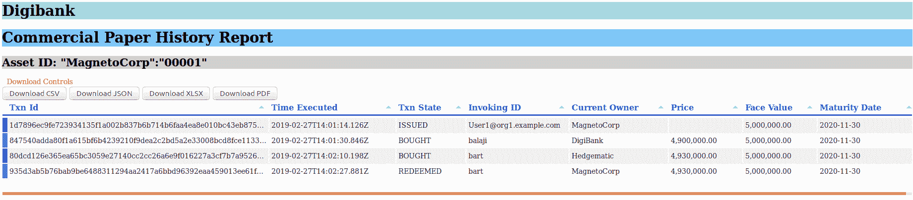

# 使用 IBM Blockchain VS Code 扩展增强商业票据智能合约并添加查询功能

> 原文：[`developer.ibm.com/zh/tutorials/queries-commercial-paper-smart-contract-ibm-blockchain-vscode-extension/`](https://developer.ibm.com/zh/tutorials/queries-commercial-paper-smart-contract-ibm-blockchain-vscode-extension/)

在我的教程[使用 IBM Blockchain VS Code 扩展来运行商业票据智能合约](https://www.ibm.com/developerworks/cn/cloud/library/run-commercial-paper-smart-contract-with-ibm-blockchain-vscode-extension/index.html)中，我向您展示了在跟踪商业票据生命周期的场景中，如何部署商业票据智能合约并与之交互。但是，如果您要查看商业票据生命周期内发生的所有活动的“书面”记录，也就是资产的不可变历史记录（谁执行了哪些操作、操作发生时间等等），该怎么办呢？

**图 1\. “Papernet”- 商业票据查询历史记录教程及所涉组织的概述**



这个系列教程由三个部分组成，本教程作为其中的第二部分，将向您展示如何使用 IBM Blockchain Platform VS Code 扩展向 Fabric 样本商业票据智能合约添加查询事务函数，并在添加查询功能后使用该扩展升级合约。您将通过添加新查询类（包含查询函数）提供代码更改，并由此提供从分类账查询关键信息/摘要信息的方法。随后，我将向您展示如何在 DigiBank 中通过客户端应用程序与智能合约进行交互。目标是获取商业票据实例生命周期内交易的历史记录，并在客户端浏览器中以格式良好的 UI/HTML 表格来显示其历史记录。本教程面向开发者提供具体的操作说明（尤其是编辑源文件以添加提供的代码块）。花点时间来了解发生的操作 – 您不必为此深入理解 JavaScript 细节内容。



为完成这些任务，您将使用 IBM Blockchain Platform VS Code 扩展以及全新的 Hyperledger Fabric 编程模型及其中的 SDK 功能部件。

## 背景

最新的 [Fabric 开发应用程序](https://hyperledger-fabric.readthedocs.io/en/release-2.2/tutorials.html)文档中出色地描述了商业票据用例场景，这里所描绘的场景着实引人入胜。简而言之，这是大型机构/组织获得资金以偿还短期债务的一种方式，而投资者则可借此机会在投资到期后获取投资收益。

在[上一个教程](https://developer.ibm.com/zh/tutorials/run-commercial-paper-smart-contract-with-ibm-blockchain-vscode-extension/)的商业票据场景中，起初是 MagnetoCorp 和 DigiBank 的员工以各自组织的参与者身份开展交易，从而创建了初始历史记录。在本教程中，您将完成整个生命周期，同时还将添加第三方投资者 Hedgematic，以便显示更多历史数据。（创建此历史记录非常便捷。）

## 前提条件

1.  您将需要完成上一个[商业票据教程](https://developer.ibm.com/zh/tutorials/run-commercial-paper-smart-contract-with-ibm-blockchain-vscode-extension/)，具体来说，应该已将 V0.0.1 版本的商业票据智能合约程序包加载到 VS Code 中，并放在“IBM Blockchain Platform”侧边栏中的“Smart Contract Packages”下。

2.  在“IBM Blockchain Platform”侧边栏面板中的 **LOCAL FABRIC OPS** 窗格下，单击省略号（“…”）并选择执行“Teardown Fabric Runtime”。对于 VS Code 面板右下角出现的提示，选择回答“yes”以销毁世界状态和分类账数据，然后等待输出消息确认已成功销毁。

3.  现在，选择侧边栏窗格中“LOCAL FABRIC OPS”下的“Start a Fabric development runtime”。等待输出消息中显示“Successfully submitted proposal to join the channel”，以确认您已成功提交加入通道的提议。

4.  从 IBM Blockchain Platform 侧边栏面板中，使用“**LOCAL FABRIC OPS**”下的“Install”选项安装 papercontract V0.0.1，并根据说明选择提供的对等项以及智能合约 V0.0.1。

5.  接下来，选择“Instantiate”选项，并选择通道“mychannel”和 papercontract V0.0.1。

6.  出现输入函数提示时，粘贴以下文本，并按两次 Enter 键（该函数无需任何参数）：

    ```
    org.papernet.commercialpaper:instantiate 
    ```

7.  在 VS Code Explorer 中，选择 **File > Open Folder**，并通过浏览至 `$HOME/fabric-samples/commercial-paper/organization/magnetocorp` 目录选择 `contracts` 文件夹。`Contracts` 文件夹必须为 VS Code 中的顶层项目文件夹。

完成这些前提条件是继续学习本教程的基础。接下来，您将完成详细的交易商业票据历史记录。

## 预估时间

满足所有前提条件后，完成本教程大约需要 45-60 分钟时间。

## 场景

MagnetoCorp 员工 Isabella 和 DigiBank 投资交易员 Balaji 现在都应该能够看到分类账中已赎回商业票据的历史记录（在初始发行六个月后赎回）。DigiBank 开发者 Luke 需要向智能合约添加查询功能，并为 DigiBank 提供客户端应用程序，以便 Balaji（或 Isabella）能够从该应用程序查询分类账。升级后的智能合约应在通道上处于活动状态，以便客户端应用程序可对分类账历史记录执行查询和报告。

让我们开始吧！

## 步骤

### 第 1 步. 在 papercontract.js 中添加主查询事务函数

1.  在 VS Code 中，打开 `contract` 文件夹（如果此文件夹尚未打开），其中包含您在上一个教程中已完成的智能合约。

    **图 2\. 在 VS Code 中打开商业票据样本项目** 

2.  打开 `lib` 文件夹下的主合约脚本文件 `papercontract.js`，然后添加以下行（放在 PaperNet 特定类的行之后，大约在第 16 行）：

    ```
    const QueryUtils = require('./query.js'); 
    ```

3.  在 papercontract.js 中，查找以 `async issue` 开头的函数（大约在第 70 行）并向下滚动至 `paper.setOwner(issuer);` 行；然后，在此函数中，直接在其下方创建一个空行/新行，应与代码中的正确缩进位置对齐。

4.  现在，粘贴以下代码块，用于报告交易的调用者 CN。`getInvoker` 函数使用 `clientIdentity` 对象，此对象可通过交易上下文 (ctx) 获取。记住突出显示粘贴的代码部分，如果粘贴的代码未正确缩进，右键单击 >“Format Selection”即可。

    ```
    // Add the invoking CN, to the Paper state for reporting purposes later on
    let invokingId = await this.getInvoker(ctx);
    paper.setCreator(invokingId); 
    ```

    **注意：**此代码应位于 `issue` 函数中的 `await ctx.paperList.addPaper(paper);` 行*之前*。

5.  重复上述操作，再次将这三行代码块粘贴到以 `async buy` 和 `async redeem` 开头的函数中。将代码块粘贴到上述*每个*函数末尾附近，并放在每个函数中显示的以下行*之前*：

    ```
    await ctx.paperList.updatePaper(paper); 
    ```

6.  仅在 `async buy` 函数中，大约在代码中的第 120 行（具体来说，在含注释 `// Check paper is not already REDEEMED` 的行），将此单行代码*添加*到 `paper.setOwner(newOwner);` 行*下方*的 `isTrading()` 代码分支*内*：

    ```
    paper.setPrice(price); 
    ```

7.  将以下包含三个函数（其中两个函数为“可调用”查询事务函数）的代码块直接添加到 `redeem` 事务函数的*右*花括号*之后*，并放在 papercontract.js 文件中的最后一个*右*括号（紧接在 `module.exports` 声明前）*之前*。这两个主查询函数会调用 query.js 文件中的“worker”查询函数/迭代器，以下 `idGen` 函数会获取用于报告的身份信息：

    ```
     /**
      * grab the invoking CN from the X509 transactor cert
      * @param {Context} ctx the transaction context
      */

     async getInvoker(ctx) {

         // Use the Client Identity object to get the invoker info.
         let cid = ctx.clientIdentity;
         let id = cid.getID(); // X509 Certificate invoker is in CN form
         let CN = id.substring(id.indexOf("CN=") + 3, id.lastIndexOf("::"));
         return CN;
     }

     /**
     * queryHist commercial paper
     * @param {Context} ctx the transaction context
     * @param {String} issuer commercial paper issuer
     * @param {Integer} paperNumber paper number for this issuer
     */
     async queryHist(ctx, issuer, paperNumber) {

         // Get a key to be used for History query
         let cpKey = CommercialPaper.makeKey([issuer, paperNumber]);
         let myObj = new QueryUtils(ctx, 'org.papernet.commercialpaperlist');
         let results = await myObj.getHistory(cpKey);
         //console.log('main: queryHist was called and returned ' + JSON.stringify(results) );
         return results;

     }

     /**
     * queryOwner commercial paper
     * @param {Context} ctx the transaction context
     * @param {String} issuer commercial paper issuer
     * @param {Integer} paperNumber paper number for this issuer
     */
     async queryOwner(ctx, owner, paperNumber) {

         // Get a key to be used for the paper, and get this from world state
         // let cpKey = CommercialPaper.makeKey([issuer, paperNumber]);
         let myObj = new QueryUtils(ctx, 'org.papernet.commercialpaperlist');
         let owner_results = await myObj.queryKeyByOwner(owner);

         return owner_results;
     } 
    ```

    **注意：**将此代码块粘贴到 VS Code 中后，`ESLinter` 扩展（如果在 VS Code 会话中已启用）可能会在底部的 **Problems** 窗格中报告问题。如果报告了问题，可通过选择 **right-click….**，然后选择 **Fix all auto-fixable issues**，在 **Problems** 窗格中轻松纠正任何格式问题。同样，它将移除 ESLint 报告的所有尾部空格（如果已报告行号）。完成格式化任务后，务必通过菜单来**保存您的文件**。（也可使用 **Ctrl+S** 来保存文件。）此外，ESLint 扩展（也可从 VS Code 扩展市场获取）也很实用，我建议在打包智能合约前，用它来修复任何可检测到的缩进错误、粘贴错误或其他一般错误。

8.  突出显示粘贴的代码，然后右键单击 >“Format selection”，以在 JavaScript 文件中将其正确格式化。

9.  此外，还有两个小函数要添加到源文件 `paper.js` 中。在 VS Code 会话中打开 `lib` 目录下的 `paper.js`。

10.  在现有 `setOwner(newOwner)` 函数（大约第 40 行）*之后*，且在显示为 `//basic setters and getters` 的描述之下，*添加*以下代码块（其中包含两个函数）：

    ```
    setCreator(creator) {
        this.creator = creator;
    }
    setPrice(price) {
        this.price = price;
    } 
    ```

    然后，按 **Ctrl+S** 保存文件。

### 第 2 步. 将必需的“worker”查询类函数添加到 VS Code 项目（新建文件：query.js）

1.  通过 VS Code 菜单在 `contract/lib` 文件夹下使用 VS Code 创建新文件，并将其命名为 `query.js`。

2.  从先前克隆的 GitHub 存储库 `github.com/mahoney1/commpaper` 复制 query.js 文件的内容。

3.  将这些内容粘贴到 query.js VS Code 编辑会话中。新查询 JavaScript“worker”`query.js` 文件中应包含了所有复制的内容。接下来保存该文件。您已完成智能合约编辑操作。

现在就让我们将这一新增的智能合约功能放在区块链上，替换先前的智能合约版本。

### 第 3 步. 使用 IBM Blockchain Platform VS Code 扩展升级智能合约版本

1.  您需要将版本更改添加至项目中的 `package.json` 文件，以便为合约升级做好准备。单击 Explorer 中的 `package.json` 文件，然后执行以下操作：

    *   将版本更改为 0.0.2。
    *   按 **Ctrl+S** 进行保存。
2.  单击源控件侧边栏图标，然后单击 `tick` 图标以提交，出现“adding queries”消息后按 **Enter** 键。

    现在，您已准备好使用 VS Code 扩展来升级智能合约。

3.  将合约打包：单击 `IBM Blockchain Platform` 侧边栏图标，在“Smart Contract Packages”下选择“Package a Smart Contract”图标（“+”）；您应该会看到版本 0.0.2 变为可用 `papercontract` 程序包的最新版本。

4.  在 IBM Blockchain Platform 侧边栏中的 **Local Fabric OPs** 面板下，展开已实例化的合约“papercontract”，使其突出显示。

5.  右键单击 **papercontract@0.0.1** — **Upgrade Smart Contract**，并从显示的列表中选择 **papercontract@0.0.2**（顶部），然后选择顶部提供的对等项。

    *   提示输入要调用的函数名称时，输入或粘贴文本 `org.papernet.commercialpaper:instantiate`，然后按 **Enter** 键。
    *   提示输入任意自变量时，只需按 **Enter** 键即可。

    **图 3\. 使用 VS Code 扩展升级智能合约** 

    控制台中应该会显示一条消息，表明正在进行升级。这个过程需要大约一分钟时间（因为它必须构建新的智能合约容器），完成后应会显示“successful”弹出消息。如果从终端使用 `docker ps` 对其进行检查，应该会在“Names”列下看到以合约版本号为后缀的新 Docker 容器。

### 第 4 步. 创建新的 DigiBank 查询客户端应用来调用查询事务

1.  在 VS Code 中，单击菜单选项 **File** …**open Folder**，打开 `organization/digibank/application` 下的文件夹，然后按 **Enter** 键。

2.  右键单击左侧窗格中的文件夹，并创建名为 `queryapp.js` 的新文件。然后，复制名为 queryapp.js 的*另一个*文件的内容，此文件位于您先前克隆的 `commpaper` 存储库中（参阅[上一个商业票据教程](https://developer.ibm.com/zh/tutorials/run-commercial-paper-smart-contract-with-ibm-blockchain-vscode-extension/#summary)中“结束语”部分的相关步骤）。

3.  如果已启用 ESLint，现在就可以修复所有格式错误（右键单击“Fix all auto-fixable errors”即可自动修复所有缩进问题）。

4.  按 **Ctrl+S** 保存文件，然后单击 **Source Control** 图标提交文件，这样会显示一条提交消息。`Queryapp.js` 客户端包含两个查询函数：

    *   `queryHist` 函数用于获取商业票据实例的历史记录
    *   `queryOwner` 函数用于获取组织拥有的商业票据的列表（作为参数提供给查询函数）

    接下来，您将创建交易历史记录，然后运行新的查询客户端应用来执行一组查询。（您将通过终端窗口在 DigiBank 的应用程序文件夹中执行此操作；在此示例中，从 MagnetoCorp 还是 DigiBank 进行测试都无关紧要，因为从任一应用程序客户端看到的分类账数据都是相同的。）

### 第 5 步. 执行发行、购买和赎回交易以更新分类账

让我们来创建一些交易，并以不同身份进行调用，以在分类账上创建交易历史记录。具体顺序为：

1.  以“MagnetoCorp”身份发行票据。
2.  以新所有者“DigiBank”身份购买票据。
3.  以变更后的所有者“Hedgematic”身份购买票据。
4.  以现有所有者“Hedgematic”身份按票面价值赎回票据，MagnetoCorp 作为原始发行者。

**图 4\. “Papernet”- 交易流程概述** 

#### 为应用程序客户端设置客户端连接

在准备将本地应用程序 JavaScript 客户端连接到本地 Fabric 开发运行时的过程中，您需要执行一些简单操作，以获取在这些 JavaScript 客户端中使用的连接信息。步骤大致如下：

1.从 IBM Blockchain Platform VS Code 扩展面板导出连接详细信息 (connection.json)。

2.将本教程使用的客户端应用程序脚本（先前通过 Fabric 样本存储库克隆的脚本）指向此导出的连接文件，以获取其连接信息。在下一个序列操作中，您将在显示的子目录中更改以下 3 个 Fabric 样本客户端：

```
 'magnetocorp/organization/application/issue.js'
   'digibank/organization/application/buy.js'
   'digibank/organization/application/redeem.js' 
```

（**注意：**第四个客户端脚本 `application/buy2.js` 已包含这些更改，此脚本位于您先前克隆的自定义 `github.com/mahoney1/commpaper` 存储库中，在此教程中将继续使用。）

3.在 IBM Blockchain Platform 扩展侧边栏中，在左侧侧边栏窗格 **LOCAL FABRIC OPs** 中的“Nodes”下找到开发对等项。

4.右键单击该对等项，并选中“Export Connection Details”。导出位置会在智能合约工作空间的 contract 文件夹下创建“local_fabric”子目录，例如，`$HOME/fabric-samples/commercial-paper/organization/magnetocorp/contract/local_fabric/`，其中 `$HOME` 在此示例中为“/home/user1”，但您所使用的应与之不同。

5.在终端窗口中，使用 VS Code 打开 `$HOME/fabric-samples/commercial-paper/organization/magnetocorp/application/issue.js` 文件，并编辑以下部分：

*   注释掉以 `const yaml =` 开头的行（大约第 19 行），使其显示为：

    ```
    //const yaml = require('js-yaml'); 
    ```

*   注释掉以 `let connectionProfile = yaml.safeLoad` 开头的以下行（大约第 41 行），使其显示为：

    ```
    // let connectionProfile = yaml.safeLoad(fs.readFileSync('../gateway/networkConnection.yaml', 'utf8')); 
    ```

*   在该行下，添加以下 2 行代码。

    **注意：**下面的单引号中提供了路径。对于下面的 `readFileSync`，*您必须提供（按需替换以下内容）connection.json 的完整文件导出路径*。从“output”面板复制该路径，并添加以下显示的文件名。（以下文件路径可能与您所使用的并不相同；我在此示例中使用的是“user1”主目录！）

    ```
    let fpath = fs.readFileSync('/home/user1/fabric-samples/commercial-paper/organization/magnetocorp/contract/local_fabric/connection.json', 'utf8');
    let connectionProfile = JSON.parse(fpath); 
    ```

    这就是“issue”客户端的全部更改。

6.接下来，按*完全*相同的方式更改 “buy.js” 和 “redeem.js” 客户端脚本 – 对于 “buy.js” 和 “redeem.js” 脚本分别完成以上第 5 步，使每个脚本都采用以上显示的 `local_fabric` connection.json 文件路径。

**注意：**您将需要为以下现有的 MagnetoCorp 和 DigiBank 客户端应用程序安装 Node.js 应用程序依赖项（对以下交易 1 和交易 2 都使用 `npm install`）。您还要使用 `fabric-samples` 存储库中填充的现有身份钱包。（这些钱包分别与 `organization/magnetocorp` 和 `organization/digibank` 子目录下的应用程序位于相同级别。）

#### 交易 1\. 以 Isabella@MagnetoCorp 身份执行 `issue` 交易

1.  打开终端窗口，将目录切换至 MagnetoCorp 的应用程序目录（假定 `$HOME` 为以下保存位置）：

    ```
    cd $HOME/fabric-samples/commercial-paper/organization/magnetocorp/application 
    ```

2.  现在，从 `application` 目录执行首个商业票据交易：`issue` 交易：

    ```
    node issue.js 
    ```

    您应该会收到确认执行成功的消息：

    **图 5\. `Issue` 交易** 

#### 交易 2\. 以 Balaji@DigiBank 身份执行 `buy` 交易

1.  在同一个终端窗口中，将目录切换至 DigiBank 的应用程序目录：

    ```
    cd ../../digibank/application 
    ```

2.  现在，从 `application` 目录执行首个商业票据 `buy` 交易：

    ```
    node buy.js 
    ```

    您应该会收到确认执行成功的消息：

    **图 6\. `Buy` 交易** 

#### 交易 3\. 以 Bart@Hedgematic 身份执行另一个 `buy` 交易

DigiBank 正在重构其投资组合，决定出售商业票据来获取薄利，从而提前释放资金。购买方 Hedgematic 认为可以借此机会增加自身的商业票据投资组合，并在未来的某个时候按票据的票面价值收回资金。让我们以 Hedgematic 员工身份执行此交易。（为便于演示，您将为 Hedgematic 员工 Bart 提供临时钱包，以便 Hedgematic 能够调用 `buy` 交易。）

1.  暂时将 `buy2.js` 客户端应用程序脚本从 `commpaper` 存储库目录复制到当前 `commercial-paper/organization/digibank/application` 目录中（务必在以下命令中插入点“.”）：

    ```
    cp $HOME/commpaper/buy2.js . 
    ```

2.  将 wallet.zip 文件从 `commpaper` 存储库目录复制到 `/tmp` 目录中，然后将其解压缩，如下所示：

    ```
    cp $HOME/commpaper/wallet.zip /tmp

    cd /tmp

    unzip wallet.zip 
    ```

    这样会将用户 Bart 的钱包解压到 `/tmp/wallet` 下的子目录中。解压后，您将得到名为 `/tmp/wallet/bart@hedgematic` 的目录，其中包含 Bart@Hedgematic 身份钱包。

3.  现在，使用客户端应用程序 `buy2.js` 中的 Bart 身份运行第二个 `buy` 交易，如下所示：

    ```
    node buy2.js 
    ```

    您应该会收到确认执行成功的消息：

    **图 7\. 第二个 `buy` 交易** 

#### 交易 4：六个月后，以 Bart@Hedgematic 身份执行 `redeem` 交易

在这个商业票据的生命周期中，此时由其当前所有者 (Hedgematic) 按票面价值赎回商业票据，以收回其投资支出。名为 redeem.js 的客户端应用程序将执行此任务，它需要使用所有者 Hegematic 的 bart@hedgematic 身份来执行此任务。（当前，redeem.js 样本脚本使用 `balaji` 的身份，但由于 Hedgematic 已从 DigiBank 购买该票据，您需要修改脚本才能以 Hedgematic 的 Bart 身份正常赎回票据。）对于本教程，您只需从 `digibank` 应用程序子目录运行 `redeem` 的客户端应用程序脚本即可。

1.  再次在终端窗口中的相同目录 `$HOME/fabric-samples/commercial-paper/organization/digibank/application` 中，编辑 `redeem.js` 文件。

2.  更改以 `const wallet =` 开头的行（大约第 25 行），使其如下所示（可选择复制该行并使用 `//` 来注释原始行；此钱包指向已下载的钱包目录，如下所示）：

    ```
    const wallet = new FileSystemWallet('/tmp/wallet'); 
    ```

    **注意：**如果您愿意，可使用当前处于活动状态的 CA 服务器、使用 Fabric-CA 实用程序或 API 来发布自己的身份，并对此脚本进行相应的更改。

3.  更改以 `const userName =` 开头的行（大约第 38 行），使其如下所示（可选择复制现有行并使用 `//` 来注释原始行），这样 `userName` 便会指向 Hedgematic 员工 Bart：

    ```
    const userName = 'bart@hedgematic'; 
    ```

    **注意：**如果您愿意，可使用当前处于活动状态的 CA 服务器、使用 Fabric-CA 实用程序或 API 来发布自己的身份，并对此脚本进行相应的更改。

4.  更改以 `const redeemResponse` 开头的行（大约第 67 行），并将*第四个*参数更改为“Hedgematic”：

    ```
    const redeemResponse = await contract.submitTransaction('redeem', 'MagnetoCorp', '00001', 'Hedgematic', '2020-11-30') 
    ```

    然后，保存您的文件并提交所有更改。

5.  现在，运行 redeem.js 脚本：

    ```
    node redeem.js 
    ```

    您应该会收到确认执行成功的消息：

    **图 8\. `Redeem` 交易 – 生命周期内的最后一个交易** 

### 第 6 步. 启动样本 DigiBank 客户端查询应用程序

1.  在终端窗口中，将目录切换至 `$HOME/fabric-samples/commercial-paper/organization/digibank/application` 文件夹。

2.  使用 node 运行 queryapp 客户端：

    ```
    node queryapp.js 
    ```

3.  在终端窗口中，应该会显示 `queryHist` 和 `queryOwner` 函数的 JSON 结果。作为 `queryHist` 查询调用的结果，它还会在当前目录中创建名为 results.json 的文件（资产历史记录）。

    **图 9\. queryapp 客户端结果** 

### 第 7 步. 在基于 HTML 的良好 UI 中显示历史记录

对于此步骤，您将使用简单的 [Tabulator](http://tabulator.info/examples/4.1) 在 HTML 表格中呈现结果。您本身无需安装任何代码和客户端，也不必使用 jQuery，而只需使用简单的 HTML 文件，此文件使用在线 CSS 格式并执行本地 `XMLHttpRequest() GET REST API` 调用，以便从 JSON 文件加载本地结果（避免 CORS 问题），并在表格中呈现出来。该 index.html 文件来自于先前克隆的“commpaper”Github 存储库；请花些时间来仔细阅读此 HTML 文件。

**注意：**此 HTML 文件按现状提供，仅用于在 Firefox 浏览器中呈现。在撰写本文时，一些 JavaScript 格式（不使用 jQuery）在 Chrome 中无效（不同于 `forEach`），但在 Firefox 中已经过测试。

1.  在终端窗口中，再次打开 DigiBank `application` 目录（您应已在此目录中）。

2.  将 index.html 文件从先前克隆的 `commpaper` 存储库复制到该目录中（尾部“.”表示当前目录）：

    ```
    cp $HOME/commpaper/index.html . 
    ```

    如果在 VS Code Explorer 中检查 HTML 文件，就会看到它执行了 `REST /GET API` 调用，加载名为 results.json 的结果文件（由先前调用的查询应用所创建），并在浏览器中以表格形式呈现这些内容。results.json 文件包含查询结果。

3.  启动 Firefox 浏览器会话（参阅以上注意事项），提供 index.html 文件作为参数 – 已通过 Firefox 测试：

    ```
    firefox index.html 
    ```

4.  在浏览器中会以表格式显示这些结果；根据需要增大或减小列宽，例如 `Txn ID` 之类的较长的列。须注意，此处的 `TxId` 是 Fabric 交易 ID。`Invoking ID` 是调用者的公用名称，使用先前提到的客户端身份库来抽取。显然，使用此共享智能合约执行交易的所有组织都必须将此 ID 作为属性来提供。作为替代方法，可使用签署者证书散列值。

    **图 10\. 商业票据：资产历史记录报告** 

做得不错！现在，您已成功使用 IBM Blockchain Platform VS Code 扩展向商业票据样本智能合约添加了查询功能。

## 结束语

本教程展示了如何使用 IBM Blockchain Platform VS Code 扩展添加查询功能，并升级现有商业票据合约，以及如何使用 Hyperledger Fabric 新编程模型中的各种功能部件。花些时间来仔细查看 `lib` 目录下 papercontract.js 和查询类文件 query.js 中的事务（查询）函数。确保仔细查看客户端应用程序 queryapp.js。

您已掌握了如何在基于浏览器的简单 HTML 应用程序中呈现历史记录结果（商业票据资产的历史记录）。本系列中的最后一个教程将只展示生命周期内发生的更改。

最后，最好结束 VS Code 中当前文件夹的处理，以便为下一个教程做好准备。后续[第三个教程](https://developer.ibm.com/zh/tutorials/add-further-query-functionality-using-the-ibp-vscode-extension/)是本系列的收官之作，将会向您展示如何添加智能合约功能，以便仅查询特定资产历史记录中的增量内容。

感谢您加入我的行列，期待与您再会！

本文翻译自：[Enhance and add queries to a commercial paper smart contract with the IBM Blockchain VS Code extension](https://developer.ibm.com/tutorials/queries-commercial-paper-smart-contract-ibm-blockchain-vscode-extension/)（2019-03-03）