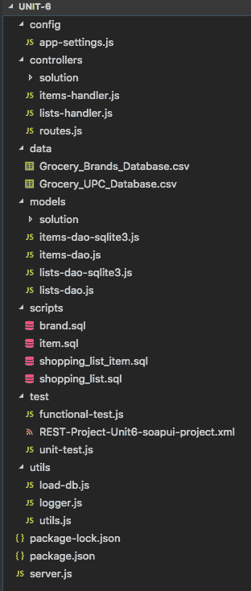
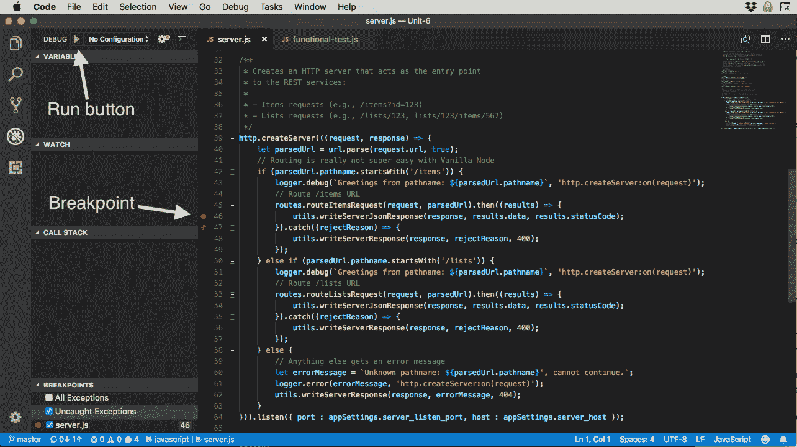

# 创建您的第一个 Node.js 应用程序

> 原文：[`developer.ibm.com/zh/tutorials/learn-nodejs-your-first-node-application/`](https://developer.ibm.com/zh/tutorials/learn-nodejs-your-first-node-application/)

本教程是向您介绍 Node.js 基本概念并展示如何应用这些概念的系列教程的第 6 部分。到目前为止，您已经安装了 Node，学习了基本的 Node.js 概念，并深入研究了 Node 事件循环。现在是时候将这些知识运用于现实世界的项目了。

##### Node.js 学习路径

本教程是 Node.js 学习路径的一部分。各单元之间相辅相成，查看 Node.js 学习路径概述，以便从头开始学习。

## 获取代码

您在此学习路径中要运行的代码及相关示例位于我的 GitHub 存储库中。

[获取代码](https://github.com/jstevenperry/IBM-Developer/tree/master/Node.js/Course)

## 项目

设想一下，您所在公司召开了一场会议，并邀请了您参加。当您到达会场时，项目经理解释说，一家大型零售商聘请贵公司编写应用程序套件。

作为概念证明，零售商要求设计购物清单应用程序。贵公司启动了为购物清单编写最小可行产品 (MVP) 的项目，但负责该项目的 Node 开发者突然离开了公司。该项目必须完成，否则客户就会将其业务转至其他公司。

您的角色是完成由先前 Node 开发者启动的 JavaScript 代码，并确保代码符合功能规范。您能够胜任这项任务吗？

## 用户案例

购物清单 MVP 包含 10 个用户案例。本部分包含在向客户展示 MVP 之前必须完成的案例。由于时间实在太短，这些案例将用作购物清单 MVP 的功能规范。

每个案例都有一个简短的描述，以及在案例被视为*已接受*之前必须满足的高级别需求的列表。

按照下面给定的顺序来实施这些案例。

1.  商品：按 ID 查找

    数据库中的每个商品都有一个唯一的 ID，用户需要能够通过其 ID 在数据库中查找特定商品。

    给定一个 ID，系统将会从数据库返回与指定 ID 匹配的单个商品。

2.  商品：按部分描述搜索

    数据库中的每个商品都有一个描述，用户需要能够使用部分描述（例如“咳嗽药”、“香蕉味”或“自由范围”）在数据库中找到一个或多个商品。

    给定一个文本字符串（部分描述），系统将会返回数据库中*包含*指定文本的零个或零个以上匹配商品。

3.  商品：按 UPC 查找

    数据库中的每个商品都有一个唯一的通用产品代码 (UPC)，用户需要能够通过其 UPC 在数据库中查找特定商品。

    给定一个 UPC，系统将会从数据库返回与该 UPC 匹配的单个商品。

4.  清单：创建购物清单

    用户需要能够创建新的购物清单。系统将提供一种使用以下属性在数据库中创建新购物清单的方法：

    *   描述
5.  清单：按 ID 查找购物清单，仅返回购物清单

    在创建购物清单后，会为其分配唯一 ID。 用户需要能够使用该 ID 在数据库中找到购物清单。

    给定一个 ID，系统将会返回与指定 ID 匹配的单个购物清单。

6.  清单：向购物清单添加商品

    用户需要能够向数据库中的购物清单添加商品。给定一个商品 ID，系统必须能够将该商品以及以下属性添加到购物清单：

    *   数量
7.  清单：按 ID 查找购物清单，返回清单中的所有商品

    在创建购物清单后，会为其分配唯一 ID。用户需要能够使用该 ID 在数据库中找到购物清单。

    给定一个 ID，系统将会返回与指定 ID 匹配的单个购物清单以及该清单中的所有商品。

8.  清单：更新购物清单

    用户需要能够修改购物清单属性：

    *   描述

        给定一个 ID 和已更新属性的值，系统将会提供一种可更新数据库中购物清单的方法。

9.  清单：更新购物清单中的商品

    用户需要能够更新以下有关购物清单中商品的属性：

    *   数量
    *   已选取（该商品是否已被选取）

        给定一个购物清单 ID 和商品 ID，系统将会提供一种更新数据库中商品属性的方法。

10.  清单：从购物清单中删除商品

    用户需要能够从购物清单中删除商品。

    给定一个购物清单 ID 和商品 ID，系统将会提供一种从数据库中删除商品（购物清单属性）的方法。

    这 10 个案例将共同定义系统的行为。

## 功能测试

行为驱动的方法需要一个*测试套件*来反映分配给 MVP 项目的用户案例。为了节省时间，采用与案例相同的顺序来运行功能测试。所有测试都通过后，您就大功告成了。

您将执行以下操作：

1.  运行功能测试套件。
2.  如果案例中的*任何*步骤（即，套件中的任何测试功能）失败：
    *   编写代码以实现相应案例中的功能。
    *   返回至第 1 步。
3.  如果所有步骤都成功：
    *   您就已大功告成。

### 运行功能测试

首先，我要解释一下如何运行功能测试。您不需要立即执行此操作，但我想先解释一下它是如何工作的及其运行情况，这样当您稍后在本单元中运行它时，就会理解它应该如何工作。

要运行功能测试，必须从 [GitHub](https://github.com/jstevenperry/IBM-Developer/tree/master/Node.js/Course) 中提取源代码。

导航至 Unit-6 目录并运行：

```
npm test 
```

当输出看起来类似如下时，即表示大功告成：

```
$ npm test

> shopping-list@1.0.0 test /Users/sperry/home/development/projects/IBM-Code/Node.js/Course/Unit-6
> node ./test/functional-test

1531086599944:INFO: testItemFindById(): TEST PASSED
1531086599982:INFO: testItemFindByDescription(): TEST PASSED
1531086599985:INFO: testListsCreate(): TEST PASSED
1531086599987:INFO: testListsAddItem(): TEST PASSED
1531086599988:INFO: testListsFindByIdWithAllItems(): TEST PASSED
1531086599989:INFO: testListsUpdate(): TEST PASSED
1531086599989:INFO: testListsUpdateItem(): TEST PASSED
1531086599989:INFO: testListsRemoveItem(): TEST PASSED
1531086599990:INFO: testListsFindById(): TEST PASSED
1531086599990:INFO: testItemFindByUpc(): TEST PASSED 
```

如果测试失败，看起来将类似如下：

```
$ npm test

> shopping-list@1.0.0 test /private/tmp/IBM-Code/Node.js/Course/Unit-6
> node ./test/functional-test

1531087259727:ERROR: testItemFindById(): TEST FAILED. Try again.
1531087259728:ERROR: testItemFindById(): ERROR MESSAGE: Unexpected token N in JSON at position 0.
.
. 
```

在此情况下，您需要编写代码来修复失败的测试，然后再次运行功能测试。

当所有功能测试都通过后，您将完成操作。

## 数据

购物清单 MVP 的数据来自 [Open Grocery Database Project](https://www.grocery.com/open-grocery-database-project/)，可以免费使用。

来自 Open Grocery Database Project 的数据采用两个 MS Excel 电子表格形式：

*   Grocery_Brands_Database.xlsx 包含与数据库中的品牌相关的信息。
*   Grocery_UPC_Database.xlsx 包含数据库中每个商品（按 UPC）的信息。

每个商品都具有唯一的 UPC。此外，每个商品仅与一个品牌相关联。

这两个 Excel 电子表格都已转换为 CSV 文件。这些文件已作为 CSV 文件放入 GitHub 存储库中。

现在，数据将被加载到 SQLite 数据库中。用于创建和访问数据库的代码是在您加入项目之前编写的，因此您只需要了解一下，以防遇到问题。

### 数据模型

数据模型包含以下表：

*   item 用于存储商品数据。
*   brand 用于存储品牌数据。
*   shopping_list 用于存储购物清单数据。
*   shopping_list_item 用于存储有关已添加到购物清单的商品的信息。

这些表中的每一个表在 ./scripts 中的相应源文件中都有一个定义，我们稍后将在本单元的代码走查期间进行介绍。

用于访问数据库的代码位于 Unit-6/models 目录中。此代码由先前的 Node 开发者编写，但您应该研究一下，以防遇到问题：

*   `items-dao-sqlite3.js` 是用于访问数据库以支持商品相关案例的代码。
*   `lists-dao-sqlite3.js` 是用于访问数据库以支持清单相关案例的代码。

为将应用程序与底层数据源隔离，已启动数据访问对象 (DAO) 层，但从未完成：

*   `items-dao.js` 是用于支持商品相关案例的隔离层。
*   `lists-dao.js` 是用于支持清单相关案例的隔离层。

为了完成分配给您的案例，您需要完成隔离层。代码中的注释将为您提供指导。

## 应用程序框架

您应该了解应用程序架构中的一些约束：

*   应用程序不得修改 `item` 或 `brand` 数据。
*   您可能只单纯使用 Node.js，这意味着只有 Node.js API，没有任何其他来自 npm 注册表的包。但 `node-sqlite3` 模块是一个例外，在您运行 `npm install` 时，将安装该模块。
*   您必须使用 RESTful 服务实现后端。

### RESTful 服务

每个用户案例都有一个 RESTful 服务，而每个 RESTful 服务都有一个 DAO 函数。总结如下：

| 用户案例 | HTTP 方法 | RESTful 路径 | DAO 函数 |
| --- | --- | --- | --- |
| 商品：按 ID 查找 | `GET` | `/items?id=123` | `itemsDao.findById()` |
| 商品：按部分描述搜索 | `GET` | `/items?description=free range` | `itemsDao.findByDescription()` |
| 商品：按 UPC 查找 | `GET` | `/items?upc=123456789012` | `itemsDao.findByUpc()` |
| 清单：创建购物清单 | `POST` | `/lists` | `listsDao.create()` |
| 清单：按 ID 查找购物清单，仅返回购物清单 | `GET` | `/lists/123` | `listsDao.findById()` |
| 清单：向购物清单添加商品 | `POST` | `/lists/123/items` | `listsDao.addItem()` |
| 清单：按 ID 查找购物清单，返回清单中的所有商品 | `GET` | `/lists/123` | `listsDao.findById()` |
| 清单：更新购物清单 | `PUT` | `/lists/123` | `listsDao.update()` |
| 清单：更新购物清单中的商品 | `PUT` | `/lists/123/items/567` | `listsDao.updateItem()` |
| 清单：从购物清单中删除商品 | `DELETE` | `/lists/123/items/567` | `listsDao.removeItem()` |

每个 RESTful 路径由两个类之一来处理：

*   商品：由 `items-handler.js` 处理
*   清单：由 `lists-handler.js` 处理

## 代码走查

项目源目录中包含以下文件：

图 1\. 项目源目录中的文件



您已经在前面的部分中看到了其中的一些内容，我们将在下面进行介绍。您需要研究其中的每个文件，以便可以编写代码来完成您的案例。

### config

与配置相关的源代码存在于 config 目录中。

*   `app-settings.js` 包含名为 `appSettings` 的对象中的应用程序设置，该对象集中了配置。

### controllers

控制器逻辑（将应用程序逻辑和 Node 粘合在一起）存在于 controller 目录中。

*   `items-handler.js` 代表路由器 (`routes.js`) 为所有商品路由调用 DAO 层。
*   `lists-handler.js` 代表路由器 (`routes.js`) 为所有清单路由调用 DAO 层。
*   `routes.js` 代表 HTTP REST 服务器 (`server.js`) 调用路由处理程序。

您需要为 `items-handler.js` 和 `lists-handler.js` 提供缺失的实现代码。标记 `TODO` 的注释将为您提供指导。

### data

数据文件存在于 data 目录中。

*   Grocery_Brands_Database.csv 包含与品牌相关的信息。
*   Grocery_UPC_Database.csv 包含与商品相关的信息。

### models

DAO 存在于 models 目录中。

*   `items-dao-sqlite3.js` 调用 SQLite 数据库以检索应用程序的数据。
*   `items-dao.js` 是应用程序与 SQLite 数据库之间的隔离层。
*   `lists-dao-sqlite3.js` 调用 SQLite 数据库以检索应用程序的数据。
*   `lists-dao.js` 是应用程序与 SQLite 数据库之间的隔离层。

您需要为 `items-dao.js` 和 `lists-dao.js` 提供缺失的实现代码。标记 `TODO` 的注释将为您提供指导。

### scripts

SQL 脚本存在于 scripts 目录中。

*   `brand.sql` 是用于创建 brand 表的 SQL。
*   `item.sql` 是用于创建 item 表的 SQL。
*   `shopping_list.sql` 是用于创建 shopping_list 表的 SQL。
*   `shopping_list_item.sql` 是用于创建 shopping_list_item 表的 SQL。

### test

与测试相关的源文件和其他工件存在于 test 目录中。

*   `functional-test.js` 是由测试负责人创建的功能测试套件，您应该运行该套件来验证您的代码。
*   `REST-Project-Unit6-soapui-project.xml` 是用于测试项目的 [SoapUI](https://github.com/SmartBear/soapui) 项目（可选，为方便起见而包含此项）。
*   `unit-test.js` 包含项目中代码的所有单元测试。

### utils

实用程序存在于 utils 目录中。实用程序是提供实用程序功能的模块。

*   `load-db.js` 是用于在数据库中加载 Open Grocery Database Project 数据的模块。
*   `logger.js` 是用于在 `console.log` 上放置更好的接口以及日志级别等内容的模块。
*   `utils.js` 包含的实用程序对于自己的模块来说太小了，但在任何特定模块（例如 URL 解析）之外都很有用。

### 根目录

根目录中有三个文件：

*   `package-lock.json` – 现在不要担心这个文件，我们将在第 8 单元中详细介绍。
*   `package.json` 是应用程序的项目文件。
*   `server.js` 是应用程序的 HTTP 服务器前端。

现在您已经进行了代码走查，您自己应该更深入地研究该代码，了解它是如何组合在一起的。

在下一节中，您将行动起来，编写代码以通过所有功能测试。

## 准备、设置和执行

既然已彻底研究了代码，是时候编写代码来通过所有功能测试了。但是，首先需要做一些事情。我们将一起完成以下步骤。

### 第 1 步. 设置您的环境

首先，确保您使用的是正确版本的 Node 和 npm，应该分别为 10 和 6：

```
node -v && npm -v 
```

您应该会看到类似如下的输出（您看到的输出可能不完全像这样，但主要版本应该是匹配的）：

```
$ node -v && npm -v
v10.6.0
6.1.0 
```

导航到 Unit-6 目录并运行以下命令来设置环境：

```
npm install 
```

这将在根目录中创建 node_modules 目录。它包含 `sqlite3` 模块及其所有依赖项。这与所需的“单纯的”Node.js 方法有所偏差。

既然已安装了 `sqlite3` 模块，您就已准备好设置本地数据库。

### 第 2 步. 加载本地 SQLite 数据库

要设置本地数据库以进行测试，需要将 Open Grocery Database Project 数据加载到数据库中。为此编写了一个 Node 模块 (`load-db.js`)。

要运行数据库加载模块，可运行 `npm run load-db`，您将看到类似如下的输出：

```
$ npm run load-db

> shopping-list@1.0.0 load-db /Users/sperry/home/development/projects/IBM-Code/Node.js/Course/Unit-6
> node ./utils/load-db

1531086312416:INFO: mainline(): Script start at: 7/8/2018, 4:45:12 PM
1531086312419:INFO: createDbFixtures(): Dropping all tables...
1531086312422:INFO: createDbFixtures(): Dropping all tables, done.
1531086312424:INFO: createDbFixtures(): Creating item table...
1531086312424:INFO: createDbFixtures(): Creating item table, done.
1531086312424:INFO: createDbFixtures(): Creating brand table...
1531086312424:INFO: createDbFixtures(): Creating brand table, done.
1531086312425:INFO: createDbFixtures(): Creating shopping_list table...
1531086312425:INFO: createDbFixtures(): Creating shopping_list table, done.
1531086312425:INFO: createDbFixtures(): Creating shopping_list_item table...
1531086312425:INFO: createDbFixtures(): Creating shopping_list_item table, done.
1531086312425:INFO: createDbFixtures(): DONE
1531086312425:INFO: mainline:createDbFixtures(resolved Promise): Loading data for brand...
1531086312426:INFO: loadData(): Loading data files...
1531086312427:INFO: loadData():readableStream.on(open): Opened file: ./data/Grocery_Brands_Database.csv
1531086320293:INFO: loadData():readableStream.on(close): Closed file: ./data/Grocery_Brands_Database.csv
1531086320293:INFO: mainline:createDbFixtures(resolved Promise): Loading brand data, done.
1531086320293:INFO: mainline:createDbFixtures(resolved Promise): Loading data for item...
1531086320293:INFO: loadData(): Loading data files...
1531086320293:INFO: loadData():readableStream.on(open): Opened file: ./data/Grocery_UPC_Database.csv
1531086433275:INFO: loadData():readableStream.on(close): Closed file: ./data/Grocery_UPC_Database.csv
1531086433275:INFO: mainline:createDbFixtures(resolved Promise): Loading item data, done.
1531086433275:INFO: mainline:createDbFixtures(resolvedPromise): Script finished at: 7/8/2018, 4:47:13 PM 
```

现在，数据已加载到本地 SQLite 数据库中，您已准备好开始编码和测试！

### 第 3 步. 启动 Node（开发模式）

无论何时需要测试应用程序，都必须启动 HTTP REST 服务器，该服务器位于 `server.js` 中，并与 `npm start` 脚本相关联。

也就是说，您可能会在“代码-测试-冲洗-重复”循环中进行大量代码更改。因此，在开始测试之前，运行 `npm run start-dev` 脚本一次。每次进行代码更改时，它都会使用 `nodemon` 自动重新启动 Node：

```
$ npm run start-dev

> shopping-list@1.0.0 start-dev /Users/sperry/home/development/projects/IBM-Code/Node.js/Course/Unit-6
> nodemon server.js

[nodemon] 1.17.5
[nodemon] to restart at any time, enter `rs`
[nodemon] watching: *.*
[nodemon] starting `node server.js`
1531086509416:INFO: Database ./data/shopping-list.db is open for business! 
```

### 第 4 步. 运行功能测试套件

接下来，使用 `npm test` 命令运行功能测试。

功能测试套件最初会失败。您的任务是编写代码，直至通过所有测试。

### 第 5 步. 编写代码

先前的开发者在完成购物清单 MVP 之前离开了项目，因此您必须通过在以下模块中编写代码来完成该项目：

*   `controllers/items-handler.js`
*   `controllers/lists-handler.js`
*   `models/items-dao.js`
*   `models/lists-dao.js`

您只需要修改上面列出的模块。应用程序中的所有其他代码应该都能正常工作，而无需进行任何更改（但不要让这阻止您研究代码）。

如果遇到问题，可查看以下每个目录中的 solution 目录：controllers/solution 和 models/solution。

对我而言，在*挫折之路*上花费的时间恰恰加深了我对问题的理解。凭借足够的毅力和辛苦的努力，终究会“柳暗花明又一村”。我建议您只将查看 solution 目录作为*最后的手段*。 在您努力自行发现解决方案之前就阅读解决方案，会扼杀您作为一名开发者不断学习并成长的机会。

## 使用 VSCode 调试器

我喜欢 VSCode 的原因之一就是它易于使用。不必担心复杂的配置；我只需加载我的代码并执行即可。

使用 VSCode 进行调试同样也如此。 将第 6 单元项目加载到 VSCode 中后，您可以轻松地对其进行调试：

1.  打开 `server.js`。
2.  单击 Debug 选项卡。
3.  设置断点（两个或三个）。
4.  单击 Run 按钮。

图 2\. 在 VSCode 中启动购物清单 MVP 应用程序



要设置断点，只需在要停止调试器的代码行的左侧单击一次。

测试代码（例如，运行功能测试脚本），当调试器遇到设置了断点的行时，如您所料，它将停止。然后，您可以轻松获得各种信息。

图 3\. VSCode 调试器


您可以单步执行代码，查看变量，研究调用堆栈等等。

##### 忠告

永远不要忘记 Node 是异步的。如果您在单步执行代码时忘记了这一点，那么可能会发现难以理解为什么调试器没有进入下一行代码。如果发生此情况，可能是因为代码是异步执行的，而调试器无法跟进。

有关 VSCode 调试器的更多信息，可查看 [VSCode Debugging 页面](https://code.visualstudio.com/docs/editor/debugging)。

## 结束语

在本单元中，您使用的是真实的 Node.js 应用程序。该单元模拟了我在职业生涯中所做过的许多类型项目的状况，它们是在完成一些工作后、完成规范后，以及在高压情况下（快速交付或客户慢吞吞）发生的。

您了解了：

*   如何设置环境以进行 Node 开发

*   如何加载和使用 SQLite 数据库

*   如何启动 Node 并使用 `nodemon`

*   如何使用 VSCode 调试器。

在接下来的几个单元中，我们将暂时停止 Node 开发，查看一些周围的生态系统：特别是 npm（第 7 单元），以及控制 Node 项目的文件：`package.json`（第 8 单元）。

下一个单元再会！

## 视频

[https://cdnapisec.kaltura.com/p/1773841/sp/177384100/embedIframeJs/uiconf_id/39954662/partner_id/1773841?iframeembed=true&playerId=kplayer&entry_id=1_ixf8hhfz&flashvars[streamerType]=auto](https://cdnapisec.kaltura.com/p/1773841/sp/177384100/embedIframeJs/uiconf_id/39954662/partner_id/1773841?iframeembed=true&playerId=kplayer&entry_id=1_ixf8hhfz&flashvars[streamerType]=auto)

## 测试您的理解情况

### 判断题

1.  HTTP `POST` 方法用于所有查询类型的 REST 服务，因为您为服务器提供了一个更容易解析的对象有效负载。

2.  通过异步方法使用 Promise 有助于确保业务流程中的串行步骤以正确的顺序执行。

3.  用户案例是支持人员用于捕获客户对应用程序体验调查的情绪的术语。

4.  `load-db` 模块（位于 `/utils/load-db.js` 中）的 `mainline()` 函数会向 `process` 对象注册 `exit` 处理程序，以防止垃圾收集器退出时发生内存泄漏。

查看答案

### 选择最佳答案

1.  购物清单应用程序中 DAO 隔离层（例如，`lists-dao.js`）的目的是：

    A. 保护开发者免受底层数据库复杂性的影响

    B. 提供底层数据库的封装，使其在一段时间后更容易切换到另一个数据库

    C. 创建更多代码，从而使应用程序更难以进行逆向工程

    D. A 和 B

    E. B 和 C

    F. 上述选项都不是

2.  `lists-dao` 模块的 `addItem()` 函数使用哪种 HTTP 方法？

    A. `GET`

    B. `POST`

    C. `PUT`

    D. `PATCH`

    E. `FUDGE`

3.  当路由处理程序模块（例如，`lists-handler`）捕获 HTTP 请求主体时，它会这样做：

    A. 将基于流的方法与 `data` 和 `end` 事件一起使用

    B. 直接从 HTTP 请求主体中读取数据作为文件

    C. 使用传递给 `server.js` 中匿名回调的 `request` 对象的 `body` 属性

    D. 上述选项都不是

查看答案

### 填空

1.  为了确保操作以正确的顺序执行，`load-db` 程序（位于 `/util/load-db.js` 中）大量使用 JavaScript ******__******。

2.  要使用 REST 服务更新资源，您应该使用 ******_****** 方法（提示：查看 `routes.js` 模块的 `routeListsWithId()` 函数）。

3.  当针对应该通过 ID 返回单个资源的 RESTful 服务发出 `GET` 请求并且找不到该资源时，应该返回 *****__***** 状态码。

查看答案

### 编程练习

1.  编写 JavaScript 程序以执行以下操作：

2.  读取名为 `foo.txt` 的文件（假定此文件采用 UTF-8 编码格式）

3.  将其内容写入名为 `newfoo.txt` 的新文件
4.  将所有主线逻辑打包到名为 `mainline()` 的 IIFE 中
5.  如果写 I/O 操作成功，那么向控制台写入一条消息。

6.  使用名为 `echo()` 的单一方法编写名为 `echo` 的模块，此方法采用单一参数，并将 `echo` 和此参数写入控制台。编写名为 `echo-requester` 的另一个模块，此模块使用 `echo`，并向其传递您所选的一个文本参数。假定 `echo.js` 和 `echo-requester.js` 存在于同一个目录中。

## 测试答案

### 判断题的答案

1.  答案：**错**。`GET` 方法用于查询（查找）REST 服务。`POST` 用于创建新资源。

2.  答案：**对**。当两个或多个步骤必须串行执行并且底层代码异步工作时，使用 Promise 可以保证步骤串行执行。

3.  答案：**错**。用户案例用于捕获软件的不同需求，作为可从用户角度观察到的系统行为，用于设置发布的范围（冲刺）。

4.  答案：**错**。`process.on('exit')` 处理程序用于确保在 Node 退出之前关闭数据库连接。

### 选择题的答案

1.  答案：**D**（A 和 B）。DAO 隔离层有双重好处：它使开发不必准确地知道如何与数据库通信（只需使用 DAO 接口），并且随着应用程序逐渐成熟，更容易（可能无缝地）切换数据库。在第 12 单元中，会将 MongoDB 与购物清单应用程序一起使用，查看这是否属实。

2.  答案：B – `POST` 用于创建新资源，这就是发生的状况。当目标路径为 `/lists/1/items` 并且调用 `lists.dao` `addItem()` 函数时，在底层，sqlite3 模块会在 `shopping_list_item` 表中创建一个新行来存储新资源。

3.  答案：**A**。执行此操作的代码位于 `utils/utils.js` 中，并通过注册 `data` 和 `end` 处理程序来读取入局请求（这是 `http.IncomingMessage` 的实例，即 `stream.ReadableStream` 实现），用于将完整的请求主体作为字符串来捕获并返回该字符串。

### 填空题的答案

1.  答案：**Promise**。由于底层数据库模块 (`sqlite3`) 异步运行，因此确保正确排序至关重要（例如，您无法将数据加载到尚未创建的表中），Promise 是理想之选。

2.  答案：`PUT` 用于更新 RESTful 应用程序中的资源。

3.  答案：**404**。HTTP 404 表示“未找到”。如果特定路径的 RESTful 服务合同要返回单个对象，但无法找到资源，那么应该返回 404。

本文翻译自：[Create your first Node.js application](https://developer.ibm.com/tutorials/learn-nodejs-your-first-node-application/)（2018-12-07）