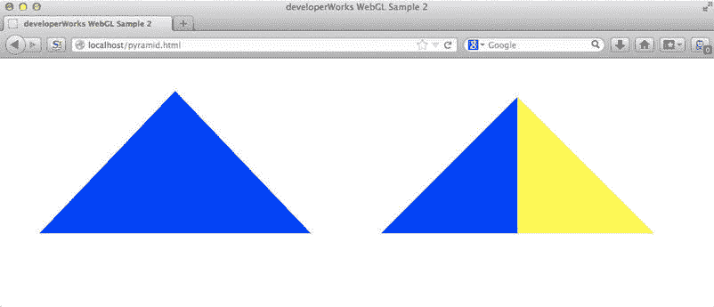

# WebGL 简介

> 原文：[`developer.ibm.com/zh/tutorials/wa-webgl1/`](https://developer.ibm.com/zh/tutorials/wa-webgl1/)

##### 3D 硬件进化：简史

在个人计算的初期（大约 20 世纪 80 年代初），3D 加速图形硬件仅可用于来自 Silicon Graphics Computer Systems（后来称为 SGI）等公司的昂贵的专用工作站。这些机器大多是为了满足学术界、政府和国防工业中的科学家和研究人员，以及娱乐产业的先锋。早期的传统 PC 中的图形硬件拥有非常低分辨率的 2D 功能；任何 3D 计算和绘图必须由应用程序软件离线缓慢地执行。

在 20 世纪 90 年代后期，来自 ATI Technologies Inc.（现在的 AMD）和 Nvidia Corp. 等公司的实惠（但仍然相对昂贵）的 3D 加速图形适配器开始面向 PC 发烧友。这些适配器实现了技术突破，将工作站品质的图形带到了 PC 中。但早期的 3D 图形适配器中的 GPU 受限于低显示分辨率和较低的渲染/处理能力。

在 20 世纪 90 年代和 21 世纪初，面向 PC 的 3D 加速适配器的功能和性能不断提高，并且价格不断下降。GPU 制造商的芯片不仅应用到了 PC，而且应用到了任天堂和索尼等厂商的专用游戏系统和机顶盒。

在前五年的时候，主流 CPU 制造商（如 Intel 和 AMD）已经开始争相将 3D 渲染硬件集成到主 CPU，或在同一芯片上捆绑 GPU 与 CPU。这一趋势极大地提高了 3D 图形对所有用户的可用性。在 PC 历史上首次，在 PC 上应用以前的工作站级 3D 图形的成本仅仅相当于下载一个配套软件驱动程序的成本。

我们生活在一个 3D 世界中，但我们与计算机及计算机化设备的几乎所有交互都发生在 2D 用户界面上。直到最近，高速、流畅、逼真的 3D 应用程序（曾经是计算机动画师、科研用户和游戏爱好者的专属领域）对于主流 PC 用户还是遥不可及的。（见边栏：3D 硬件进化：简史。）

如今，所有主流 PC 的 CPU 都内置了 3D 图形加速，并且游戏 PC 有额外的专用高性能图形处理单元（GPU）来处理 3D 渲染。手机和平 板电脑中基于精简指令集计算（RISC）的 CPU 反映了这一趋势。 目前所有的移动 CPU 都包括支持 3D 的强大图形加速 GPU。配套的软件驱动程序也日渐成熟，并且现在也更加稳定高效。

现代浏览器技术的进步为它们带来了硬件加速的 [WebGL](https://www.khronos.org/webgl/)，这是一个与具有丰富特性的 HTML5 一起运行的 3D JavaScript API。JavaScript 开发人员现在可以创建交互式 3D 游戏、应用程序和 3D 增强的用户界面。由于 WebGL 被集成到主流浏览器中，只配备了浏览器和文本编辑器的大量开发人员终于可以进行 3D 应用程序开发了。

本文是由三部分组成的系列文章中的第 1 部分，主要介绍 WebGL。首先简要概述 3D 软件栈的演变。然后，您将有机会通过涵盖 WebGL 编程关键方面的动手示例来体验 WebGL API。（参见下载部分的示例代码。）该示例既全面又易于理解，并且伴随着解释了一些基本的 3D 图形概念。（假定您熟悉 HTML5 的 canvas 元素。）第 2 部分介绍高级 WebGL 库。在第 3 部分中，您可以将一切都融合在一起，开始创建引人注目的 3D 用户界面和应用程序。

## “3D” 应用程序软件栈

在 PC 早期历史的大部分时间中，3D 硬件驱动程序都与应用程序捆绑，或被编译到应用程序中。该配置可以优化对硬件的硬件加速特性的访问，从而实现最佳性能。基本上，您可以直接编码实现硬件的功能。精心设计的游戏或计算机辅助设计（CAD）应用程序可以充分利用底层硬件。图 1 显示了该软件配置。

图 1\. 使用嵌入式 3D 硬件驱动程序的应用程序


但捆绑的成本很昂贵。应用程序一经发布和安装，硬件驱动程序就如同被冻结一般（包括错误在内的一切）。如果图形卡供应商修复了一个错误或者推出了性能增强的驱动程序，应用程序用户必须安装或升级应用程序才可以利用它。此外，由于图形硬件在迅速发展，使用编译的 3D 驱动程序的应用程序或游戏很容易很快就过时。当新的硬件推出时（包含新的或更新后的驱动程序），软件供应商必须开发并发布新版本。在高速宽带网络普遍可访问之前，这是一个主要的分发问题。

作为驱动程序更新问题的解决方案，操作系统承担了托管 3D 图形驱动程序的角色。应用程序或游戏调用操作系统提供的一个 API，操作系统随后将调用转换为原生 3D 硬件驱动程序可接受的原语。图 2 展示了这一安排。

图 2\. 使用操作系统的 3D API 的应用程序


通过这种方式（至少在理论上），可以针对操作系统的 3D API 对应用程序进行编程。对 3D 硬件驱动程序的修改，甚至 3D 硬件本身的进化对于应用程序都是屏蔽的。对于许多应用程序而言，包括所有主流浏览器，这样的配置足以在很长一段时间内满足需求。操作系统充当中间人，试图大胆地迎合各种类型或样式的应用程序，以及迎合来自竞争厂商的图形硬件。但是，这种一刀切的方法会影响 3D 渲染性能。要求最佳硬件加速性能的应用程序仍然必须发现实际安装的图形硬件，实施调整，为每一组硬件优化代码，并往往根据厂商对操作系统的 API 的特定扩展进行编程，再次使应用程序受制于底层驱动程序或物理硬件。

### WebGL 时代

进入现代社会，高性能的 3D 硬件已内置到每个桌面和移动设备中。人们越来越多地利用 JavaScript 开发应用程序，以利用浏览器功能，Web 设计师和 Web 应用程序开发人员强烈要求获得更快、更好的 2D/3D 浏览器支持。其结果是：主流浏览器厂商广泛支持 WebGL。

WebGL 以 OpenGL Embedded System (ES) 为基础，这是用于访问 3D 硬件的低级过程 API。OpenGL（由 SGI 在 20 世纪 90 年代初创建）现在被视为是一个易于理解且成熟的 API。WebGL 让 JavaScript 开发人员有史以来第一次能够以接近原生的速度访问设备上的 3D 硬件。WebGL 和 OpenGL ES 都在非营利组织 [Khronos Group](https://www.khronos.org/) 的赞助下不断发展。

通过浏览器支持库和操作系统的 3D API 库，WebGL API 几乎可以直接访问底层的 OpenGL 硬件驱动程序，而无需首先转换代码。图 3 展示了这种新的模型。

图 3\. JavaScript 应用程序通过 WebGL 访问 3D 硬件


硬件加速的 WebGL 支持浏览器上的 3D 游戏、实时 3D 数据可视化应用程序，以及未来的交互式 3D 用户界面（仅举几例）。OpenGL ES 的标准化确保可以安装新的厂商驱动程序，而不影响现有的基于 WebGL 的应用程序，并兑现理想化的 “在任何平台上支持任何 3D 硬件” 这一承诺。

## 动手体验 WebGL

现在是时候动手体验 WebGL 了。启动最新版本的 Firefox、Chrome 或 Safari，并从代码中打开 triangles.html（参见下载部分）。理想场景是通过一个 Web 服务器访问 HTML 页面，但在本例中，您也可以从您的文件系统打开它。（如果您直接打开 HTML 文件，本系列中后面的示例可能无法正常工作，因为可能需要通过 Web 服务器加载额外的图形数据。）页面看起来应该类似于图 4 中的屏幕截图，该页面是从运行于 OS X 之上的 Safari 打开的。

图 4\. triangles.html 页面


##### WebGL 3D 轴

WebGL 3D 轴包括：

*   x 轴，从左（负）到右（正）
*   y 轴，从下（负）到上（正）
*   z 轴，从页面后方（负）到页面前方（正）

在您观察下图的 WebGL 3D 轴时，想象自己站在 z 轴的箭头处，并沿 z 轴向下看 x-y 平面：

在您观察下图的 WebGL 3D 轴时，想象自己站在 z 轴的箭头处，并沿 z 轴向下看 x-y 平面：


两个看似完全相同的蓝色三角形出现在页面上。然而，并非所有三角形的创建方式都一样。两个三角形都是使用[HTML5 canvas](https://www.ibm.com/developerworks/cn/web/library/wa-html5canvas/) 绘制的。但是，左边的那个是 2D 图，并且用于绘制它的 JavaScript 代码不到 10 行。右边的那个是一个四面的 3D 金字塔对象，需要超过 100 行 JavaScript WebGL 代码来渲染。

如果查看网页的源代码，就可以确认有大量的 WebGL 代码绘制右边的三角形。然而，该三角形看起来肯定不是 3D 图形。（不是 3D 图形，戴上红蓝色 3D 眼镜也无济于事。）

### WebGL 绘制 2D 视图

您在 triangles.html 的右侧看到一个三角形，这是因为金字塔的方向。您看到的是一个多色金字塔的蓝色的一面，类似于直视建筑物的一面，只看到一个 2D 矩形。（快速看一下 图 5，可以看到 3D 的金字塔。）此实现强调了在浏览器中使用 3D 图形的本质：最终的输出始终是一个 3D 场景的 2D 视图。 因此，通过 WebGL 进行的 3D 场景的任何静态渲染都是一个 2D 图像。

接下来，在您的浏览器中加载 pyramid.html。在此页面上，绘制金字塔所需的代码几乎与 triangles.html 中的代码完全一样。一个区别是，添加了一些代码，用于沿 y 轴连续旋转金字塔。换言之，以一定的时间延迟（使用 WebGL）相继绘制了相同 3D 场景的多个 2D 视图。随着金字塔旋转，可以清楚地看到，之前位于 triangles.html 右侧的蓝色三角形其实是一个多色 3D 金字塔的一面。图 5 显示了运行于 OS X 之上的 Safari 中的 pyramid.html 快照。

图 5\. pyramid.html 页面上旋转的 3D 金字塔


## 编写 WebGL 代码

清单 1 显示了 triangles.html 中的两个 canvas 元素的 HTML 代码。

##### Listing 1\. 包含两个 canvas 元素的 HTML 代码

```
 <html>
<head>
...
</head>
  <body onload="draw2D();draw3D();">
    <canvas id="shapecanvas" class="front" width="500" height="500">
    </canvas>
    <canvas id="shapecanvas2" style="border: none;" width="500" height="500">
    </canvas>
  <br/>
  </body>
</html>
```

`onload` 处理程序调用了两个函数：`draw2D()` 和 `draw3D()`。 `draw2D()` 函数在左侧画布上 (`shapecanvas`) 绘制 2D 图形。`draw3D()` 函数在右侧画布上 (`shapecanvas2`) 绘制 3D 图形。

在左侧画布绘制 2D 三角形的代码如清单 2 所示。

##### 在 HTML5 画布上绘制 2D 三角形

```
 function draw2D()  {

    var canvas = document.getElementById("shapecanvas");
    var c2dCtx = null;
    var exmsg = "Cannot get 2D context from canvas";
    try {
      c2dCtx = canvas.getContext('2d');
    }
    catch (e)
    {
      exmsg = "Exception thrown: " + e.toString();
    }
    if (!c2dCtx) {
      alert(exmsg);
      throw new Error(exmsg);
    }
    c2dCtx.fillStyle = "#0000ff";
    c2dCtx.beginPath();
    c2dCtx.moveTo(250, 40);        // Top Corner
    c2dCtx.lineTo(450, 250);         // Bottom Right
    c2dCtx.lineTo(50, 250);         // Bottom Left
    c2dCtx.closePath();
    c2dCtx.fill();

}
```

在 清单 2 中简单直观的 2D 绘图代码中，绘图上下文 `c2dCtx` 从 canvas 元素获取而来。然后调用上下文的绘图方法，创建一组跟踪三角形的路径。最后，使用 RGB 颜色 `#0000ff`（蓝色）填充封闭路径。

### 获取 3D WebGL 绘图上下文

清单 3 显示，用于从 canvas 元素获取 3D 绘图上下文的代码与 2D 情况下的代码几乎一样。其区别是，要请求的上下文名称是 `experimental-webgl`，而不是 `2d`。

##### 从 canvas 元素获取 WebGL 3D 上下文

```
 function draw3D()  {
      var canvas = document.getElementById("shapecanvas2");

      var glCtx = null;
      var exmsg = "WebGL not supported";
      try
      {
          glCtx = canvas.getContext("experimental‑webgl");
      }
      catch (e)
      {
          exmsg = "Exception thrown: " + e.toString();
      }
      if (!glCtx)
      {
          alert(exmsg);
          throw new Error(exmsg);
      }
 ...
```

在清单 3 中，如果浏览器不支持 WebGL，`draw3D()` 函数会显示一个警报，并引发一个错误。在生产应用程序中，您可能会想使用更加特定于应用程序的代码来处理这种情况。

### 设置视口（viewport）

为了告诉 WebGL 渲染输出应该去哪里，您必须设置视口，方法是在 WebGL 可以绘图的画布内以像素为单位指定区域。在 triangles.html 中，整个画布区域都用于渲染输出：

```
 // set viewport
 glCtx.viewport(0, 0, canvas.width, canvas.height);
```

在接下来的步骤中，您必须开始创建数据，馈送到 WebGL [渲染管道](https://www.khronos.org/opengl/wiki/Rendering_Pipeline_Overview)。该数据必须描述构成场景的 3D 对象。在本例中，场景仅仅是一个四面的多色金字塔。

## 描述 3D 对象

##### 3D 渲染中的网格

若有足够多的三角形放在一起，就可以近似描绘任意形状的对象。 在三维空间中近似描绘对象的三角形集合称为一个*网格*。在现代游戏和 3D 应用程序中，发现由数千个三角形组成的网格是很平常的。

要为 WebGL 渲染描述 3D 对象，您必须使用三角形来表示对象。WebGL 采用的描述可以是一组离散的三角形的形式，或者是有共享顶点的三角形的一个条带。在金字塔的示例中，四面的金字塔用一组四个不同的三角形来描述。每个三角形由它的三个顶点指定。图 6 显示了金字塔其中一面的顶点。

图 6\. 描述金字塔其中一面的顶点


在图 6 中，这一面的三个顶点是 y 轴上的 `(0,1,0)`、z 轴上的 `(0,0,1)` 和 x 轴上的 `(1,0,0)`。在金字塔本身，这一面是黄色的，在可以看见的蓝色一面的右侧。扩展同样的模式，您可以遵循此规则勾画出金字塔的其他三面。清单 4 中的代码在名为 `verts` 的数组中定义了金字塔的四个面。

##### Listing 4\. 描述组成金字塔的一组三角形的顶点数组

```
 // Vertex Data
vertBuffer = glCtx.createBuffer();
glCtx.bindBuffer(glCtx.ARRAY_BUFFER, vertBuffer);
var verts = [
0.0, 1.0, 0.0,
‑1.0, 0.0, 0.0,
0.0, 0.0, 1.0,

0.0, 1.0, 0.0,
0.0, 0.0, 1.0,
1.0, 0.0, 0.0,

0.0, 1.0, 0.0,
1.0, 0.0, 0.0,
0.0, 0.0, ‑1.0,

0.0, 1.0, 0.0,
0.0, 0.0, ‑1.0,
‑1.0, 0.0, 0.0

];
glCtx.bufferData(glCtx.ARRAY_BUFFER, new Float32Array(verts), 
   glCtx.STATIC_DRAW);
```

注意，金字塔的底部（它实际上是 x-z 平面上的一个正方形）没有包含在 `verts` 数组中。因为金字塔绕 y 轴旋转，观看者永远看不到底部。在 3D 作品中不渲染观看者永远看不到的对象表面，这是惯例。保持不渲染它们，可以显著加快复杂对象的渲染。

##### JavaScript — Float32Array 类型化数组

*[类型化数组](http://www.ecma-international.org/ecma-262/6.0/#sec-typedarray-objects),* 比如 `Float32Array`,，是一个相对较新的浏览器支持的 JavaScript 数据类型。类型化数组代表一个连续的内存区域（一个 JavaScript `ArrayBuffer`），其中包含一系列格式相同的二进制数据元素。在通过 JavaScript 以极高的效率操纵原始的低级二进制缓冲数据时类型化数组很有用。它也有助于传递大量数据，比如在 WebGL 编程中，在 JavaScript 应用程序代码与低级 OpenGL 驱动程序之间使用的矩阵。从本质上讲，类型化数组是一个 C 风格的数组，通过 JavaScript API 操纵。引入类型化数组是为了让 JavaScript 能够在媒体处理和图形处理应用程序中直接使用格式化的二进制缓冲数据。

其结果是一个 `vertBuffer` 变量，它引用包含所需顶点信息的硬件缓冲区。该缓冲区中的数据可以由 WebGL 渲染管道中的其他处理器直接高效地访问。

## 指定金字塔各个面的颜色

必须设置的下一个低级缓冲由 `colorBuffer` 引用。此缓冲中包含金字塔的每一面的颜色信息。在该示例中，颜色是蓝、黄、绿和红。清单 5 显示了如何设置 `colorBuffer`。

##### Listing 5\. colorBuffer 设置指定金字塔的每一面的颜色

```
 colorBuffer = glCtx.createBuffer();
glCtx.bindBuffer(glCtx.ARRAY_BUFFER, colorBuffer);
var faceColors = [
            [0.0, 0.0, 1.0, 1.0], // front  (blue)
            [1.0, 1.0, 0.0, 1.0], // right  (yellow)
            [0.0, 1.0, 0.0, 1.0], // back   (green)
            [1.0, 0.0, 0.0, 1.0], // left   (red)
];
var vertColors = [];
faceColors.forEach(function(color) {
    [0,1,2].forEach(function () {
       vertColors = vertColors.concat(color);
     });
    });        
glCtx.bufferData(glCtx.ARRAY_BUFFER,
   new Float32Array(vertColors), glCtx.STATIC_DRAW);
```

在清单 5 中，通过 `createBuffer()`、`bindBuffer()` 和 `bufferData()` 调用来设置低级 `colorBuffer` 缓冲，这些函数与为 `vertBuffer` 所使用的那些函数完全一样。

但 WebGL 没有金字塔 “面” 这一概念。相反，它仅使用三角形和顶点。颜色数据必须与顶点相关联。在 清单 5 中 ，名为 `faceColors` 的一个中间 JavaScript 数组初始化 `vertColors` 数组。 `vertColors` 是在加载低级 `colorBuffer` 时所使用的 JavaScript 数组。`faceColors` 数组包含 4 种颜色（蓝、黄、绿和红），分别对应于四个面。 这些颜色以红、绿、蓝、Alpha (RGBA) 格式指定。

`vertColors` 数组包含每一个三角形的每个顶点的颜色，其顺序对应于它们在 `vertBuffer` 中出现的顺序。因为四个三角形中每一个都有三个顶点，最终的 `vertColors` 数组包含总共 12 个颜色条目（其中每一个条目都是由 4 个 `float` 数字构成的数组）。使用一个嵌套的 `forEach` 循环将相同的颜色分配给代表金字塔一面的每个三角形的三个顶点。

## 了解 OpenGL 着色器（shaders）

可能会自然地浮现在脑海中的一个问题是，指定一个三角形的三个顶点的颜色如何能够用该颜色渲染整个三角形。要回答这个问题，您必须了解 WebGL 渲染管道中两个可编程组件的操作：*顶点着色器* 和*片段*（*像素*）*着色器*。可以将这些着色器编译成能够在 3D 加速硬件 GPU 上执行的代码。一些现代的 3D 硬件可以并行执行数百个着色器操作，实现高性能的渲染。

顶点着色器处理每个指定的顶点。着色器接受的输入包括颜色、位置、纹理以及与顶点相关联的其他信息。然后，着色器计算和转换数据，以确定在应渲染该顶点的视口上的 2D 位置，以及顶点的颜色和其他属性。片段着色器确定在顶点之间组成三角形的每个像素的颜色和其他属性。使用 [OpenGL Shading Language](https://www.opengl.org/documentation/glsl/) (GLSL) 通过 WebGL 对顶点着色器和片段着色器进行编程。

### GLSL

GLSL 是一种编程语言，其语法类似于 ANSI C（有一些 C++ 的概念）。它是特定于域的，支持从可用的对象形状、位置、角度、颜色、照明、纹理，以及其他相关信息映射到将要渲染 3D 对象的每个 2D 画布像素所显示的实际颜色。

关于使用 GLSL 编写自己的着色器程序的细节已超出本文的范围。但您需要对 GLSL 代码有最基本的认识才可以理解该示例程序的其余部分。我将指导您完成本例中使用的这两个普通 GLSL 着色器的操作，以帮助您理解有关它们的所有代码。

在本系列的下一篇文章中，您将学习如何使用更高级别的 3D 库和框架来与 WebGL 配合。这些库和框架透明地融入了 GLSL 代码，所以您可能永远都不需要自己编写一个着色器。

### 在 WebGL 中处理着色器程序

着色器程序是相关着色器（在 WebGL 中通常是顶点着色器和片段着色器）的一个链接的二进制文件，随时可供硬件 GPU 执行。每个着色器可以有几乎微不足道的一行代码，也可以有数百行高度复杂且多特性的并行代码。

在通过 WebGL 执行着色器之前，必须将程序的 GLSL 源代码编译成二进制代码，然后链接在一起。厂商提供的 3D 驱动程序嵌入了编译器和链接器。 您必须通过 JavaScript 提交 GLSL 代码，检查编译错误，然后链接准备作为参数的矩阵。WebGL 有一个 API 可用于所有这些操作。图 7 展示了通过 WebGL 提交 GLSL 代码的序列。

图 7\. 通过 WebGL 提交 GLSL 代码的序列图示


用于获取、编译和链接该示例的 GLSL 着色器的代码如清单 6 所示。

##### Listing 6\. 在 WebGL 中编译和链接 GLSL 着色器代码

```
 var vertShaderCode = document.getElementById("vertshader").textContent;
var fragShaderCode = document.getElementById("fragshader").textContent;

var fragShader = glCtx.createShader(glCtx.FRAGMENT_SHADER);

glCtx.shaderSource(fragShader, fragShaderCode);
glCtx.compileShader(fragShader);

if (!glCtx.getShaderParameter(fragShader, glCtx.COMPILE_STATUS)) {
   var errmsg = "fragment shader compile failed: "
    + glCtx.getShaderInfoLog(fragShader);
   alert(errmsg);
   throw new Error()
  }

var vertShader = glCtx.createShader(glCtx.VERTEX_SHADER);

glCtx.shaderSource(vertShader, vertShaderCode);
glCtx.compileShader(vertShader);

if (!glCtx.getShaderParameter(vertShader, glCtx.COMPILE_STATUS)) {
   var errmsg = "vertex shader compile failed : "
       + glCtx.getShaderInfoLog(vertShader);
   alert(errmsg);
   throw new Error(errmsg)
  }

// link the compiled vertex and fragment shaders 
shaderProg = glCtx.createProgram();
glCtx.attachShader(shaderProg, vertShader);
glCtx.attachShader(shaderProg, fragShader);
glCtx.linkProgram(shaderProg);
```

在清单 6 中，顶点着色器的源代码被存储为 `vertexShaderCode` 中的一个字符串，而片段着色器的源代码存储在 `fragmentShaderCode` 中。借助 `document.getElementById().textContent` 属性，从 DOM 中的 `<script>` 元素提取这两组源代码。

通过 `glCtx.createShader(glCtx.VERTEX_SHADER)` 创建顶点着色器。通过 `glCtx.createShader(glCtx.FRAGMENT_SHADER)` 创建片段着色器。

使用 `glCtx.shaderSource()` 将源代码加载到着色器中，然后通过 `glCtx.compileShader()` 编译源代码。

编译后，调用 `glC`顶点着色器和片段着色器均编译成功后，它们被链接在一起，形成一个可执行的着色器程序。首先，调用 `glCtx.createProgram()` 来创建低级程序对象。然后，使用 `glCtx.attachShader()` 调用将编译好的二进制文件与该程序关联起来。 最后，通过调用 `glCtx.linkProgram()` 将二进制文件链接在一起。

### 顶点着色器和片段着色器的 GLSL 代码

顶点着色器在先前在 JavaScript `vertBuffer` 和 `colorBuffer` 变量中编写的输入数据缓冲区上运行。清单 7 显示了顶点着色器的 GLSL 源代码。

##### Listing 7\. 顶点着色器的 GLSL 源代码

```
 attribute vec3 vertPos;
attribute vec4 vertColor;
uniform mat4 mvMatrix;
uniform mat4 pjMatrix;
varying lowp vec4 vColor;
void main(void) {
  gl_Position = pjMatrix  mvMatrix  vec4(vertPos, 1.0);
  vColor = vertColor;
}
```

在清单 7 中，`attribute` 关键字是存储限定符，用于指定 WebGL 与每个顶点数据的顶点着色器之间的联系。在本例中，`vertPos` 包含每次执行着色器时来自 `vertBuffer` 的一个顶点位置。`vertColor` 包含在您之前设置的 `colorBuffer` 中所指定的顶点颜色。

`uniform` 存储限定符指定在 JavaScript 中设置并且在着色器代码中用作只读参数的值。JavaScript 代码可以修改这些缓冲区中的值（特别是在动画过程中），但着色器代码永远都不能修改它们。换言之：它们只能由 CPU 修改，永远不能被渲染 GPU 修改。设置好它们之后，由顶点着色器代码处理的每个顶点的 `uniform` 值都是相同的。在本例中，`mvMatrix` 包含通过 JavaScript 设置的 *模型视图矩阵* ，`pjMatrix` 包含 *投影矩阵* 。（我将在 下一节 介绍模型视图矩阵和投影矩阵。）

##### 3D 开发中的插值模式

*插值* 是一种概念性模式，在 3D 图形作品和动画中会经常看到它。其思路是，在固定的时间点或空间指定属性或行为，然 后让一些数学计算负责填充所有中间点。然后，开发人员或动画师就可以通过极少的数据点来控制属性和行为的连续变化。否则，这通常需要指定大量的数据点。

`lowp` 关键字是一个精度限定符。它指定，`vColor` 变量是一个低精度 `float` 数字，这在 WebGL 的颜色空间中已足以描述一个颜色。 `gl_position` 是着色器的转换输出值，由 3D 渲染管道在内部使用，作进一步的处理。

`vcolor` 变量有一个 `varying` 存储限定符。`varying` 表示该变量用作顶点着色器与片段着色器之间的接口。虽然每个顶点都有惟一的 `vcolor` 值，但在片段着色器中，要在顶点之间插入该值。（记得我讲过，片段着色器是为顶点之间的那些像素执行的。）在本文的 GLSL 示例中，`vColor` 变量被设置为 `colorBuffer` 中为顶点着色器中的每个顶点所指定的颜色。清单 8 显示了片段着色器的代码。

##### Listing 8\. GLSL 片段着色器的源代码

```
 varying lowp vec4 vColor;
 void main(void) {
   gl_FragColor = vColor;
 }
```

片段着色器很平凡。它接受来自顶点着色器的 `vColor` 内插值，并使用它作为输出。因为金字塔的每一面的三个顶点设置了相同的 `vColor` 值，该片段所使用的内插颜色仍然是相同的颜色。

让每个三角形至少有一个顶点的颜色不同，就可以看见插值的效果。尝试用清单 9 中以粗体显示的代码修改 pyramid.html。

##### Listing 9\. 修改 pyramid.html 以显示片段着色器插值

```
 var vertColors = [];
faceColors.forEach(function(color) {
  [0,1].forEach(function () {
      vertColors = vertColors.concat(color);
   });
   vertColors = vertColors.concat(faceColors[0]);
     });
glCtx.bufferData(glCtx.ARRAY_BUFFER, 
  new Float32Array(vertColors), glCtx.STATIC_DRAW);
```

此修改确保每个三角形都有一个顶点是蓝色的。在浏览器中加载修改后的 pyramid.html。现在，可以看到金字塔的各个面都有颜色渐变（插值颜色），但蓝色的一面除外（因为其顶点仍然全部是蓝色的）。图 8 显示了运行于 OS X 之上的 Chrome 中有内插颜色渐变的金字塔面。

图 8\. pyramid.html，用内插颜色渐变修改了金字塔的各个面


## 模型视图和投影矩阵

##### 快速的 JavaScript 矩阵操作

使用 3D 转换通常需要 4×4 矩阵的乘法运算，如果要在 JavaScript 中高效地完成它，就需要熟练的编码和调试。所幸，现在我们有了面向 WebGL 编写的优化的 JavaScript 矩阵库。该示例使用 [`glMatrix`](http://glmatrix.net/) 库进行矩阵操作。

为了控制在画布上渲染的 3D 场景的转换，您要指定两个矩阵：模型视图和投影矩阵。此前，您看到过顶点着色器使用它们来确定如何转换每个 3D 顶点。

模型视图矩阵结合了模型（在本例中是金字塔）和视图（赖以查看场景的 “摄像头”）的转换。基本上，模型视图矩阵控制在场景中的哪里放置对象，以及在哪里放置观察用的摄像头。此代码设置本例中的模型视图矩阵，将金字塔放在距离摄像头三个单位的位置：

```
 modelViewMatrix = mat4.create();
mat4.translate(modelViewMatrix, modelViewMatrix, [0, 0, ‑3]);
```

根据 `vertBuffer` 设置您就会知道，金字塔的宽度是两个单位，所以前面的代码使金字塔可以 “填满视口的框架”。

投影矩阵通过摄像头的视图控制 3D 场景到 2D 视口的转换。本例中的投影矩阵设置代码为：

```
 projectionMatrix = mat4.create();
mat4.perspective(projectionMatrix, Math.PI / 4, canvas.width / canvas.height, 1, 100);
```

将摄像头设置为 `Math.PI / 4`（pi 弧度除以 4，或 180 度/4 = 45 度）的视场。摄像头能看到的距离范围是，最近 1 个单位，最远 100 个单位，同时保持一个透视（无失真）图。

## 在视口中渲染 3D 场景

所有的设置完成后，清单 10 中的代码在视口中将 3D 场景渲染为 2D 视图。此代码包含在由 `update()` 包装程序调用的 `draw()` 函数中。 `update()` 包装程序使得稍后在 pyramid.html 中转换金字塔旋转代码更容易。

##### Listing 10\. 用于渲染场景的 draw() 函数

```
 function draw(ctx) {
  ctx.clearColor(1.0, 1.0, 1.0, 1.0);
  ctx.enable(ctx.DEPTH_TEST);
  ctx.clear(ctx.COLOR_BUFFER_BIT  | ctx.DEPTH_BUFFER_BIT);
  ctx.useProgram(shaderProg);
  ctx.bindBuffer(ctx.ARRAY_BUFFER, vertBuffer);
  ctx.vertexAttribPointer(shaderVertexPositionAttribute, 3 ,
     ctx.FLOAT, false, 0, 0);
  ctx.bindBuffer(ctx.ARRAY_BUFFER, colorBuffer);
  ctx.vertexAttribPointer(shaderVertexColorAttribute, 4 ,
     ctx.FLOAT, false, 0, 0);
  ctx.uniformMatrix4fv(shaderProjectionMatrixUniform, 
      false, projectionMatrix);
  mat4.rotate(modelViewMatrix, modelViewMatrix, 
      Math.PI/4, rotationAxis);
  ctx.uniformMatrix4fv(shaderModelViewMatrixUniform, false, 
      modelViewMatrix);
  ctx.drawArrays(ctx.TRIANGLES, 0, 12 / num of vertex /);
}
```

##### 3D 空间中的对象放置

要精通 3D 开发，您需要习惯于通过指定 x-y-z 坐标来将对象放置在三维空间中。在本文的简单示例中，您只需要放置摄像头和金字塔（网格）。在更复杂的 3D 项目中，您需要放置多个 3D 对象（网格）来创建一个*场景*。您可能还要在场景中放置一个或多个*灯光*，以增加戏剧性的效果。（为了保持计算和代码简单易懂，本文使用默认值。）对于动画，您可能需要在场景中放入一条或多条*路径*，以控制 3D 网格的运动。

在 清单 10 中，`ctx.clearColor()` 调用将视口清空为白色，而 `ctx.enable(ctx.DEPTH_TEST)` 确保启用了深度缓冲 (*z-buffer*)。调用 `ctx.clear(ctx.COLOR_BUFFER_BIT | ctx.DEPTH_BUFFER_BIT)` 可清除颜色和深度缓冲。

`shaderProg`（由您之前编译和链接的 `vertShader` 和 `fragShader` 组成）被加载，以供 `ctx.useProgram()` 调用执行 GPU。接下来，先前在 JavaScript 中设置的低级数据缓冲区（`vertBuffer` 和 `colorBuffer`）现在通过一系列 `ctx.bindBuffer()` 和 `ctx.vertexAttribPointer()` 调用被绑定到 GLSL 着色器程序的属性。（此工作流在概念上类似于 SQL 编程中的存储过程，其中的参数在运行时绑定，并且准备好的语句可以重新执行。）`ctx.uniformMatrix4fv()` 调用设置模型视图和投影矩阵，以供顶点着色器进行只读访问。

最后但同样重要的是，`ctx.drawArrays()` 调用将四个为一组的三角形（一共有 12 个顶点）渲染到视口。

您可能注意到在用于顶点着色器访问的模型视图矩阵之前出现的 `mat4.rotate(modelViewMatrix, modelViewMatrix, Math.PI/4, rotationAxis)` 调用已建立。该调用在渲染之前将金字塔绕 y 轴旋转 `Math.PI/4` 或 45 度。如果回头看看 图 6，原因显而易见。请注意，该金字塔各面的设置将金字塔的一条边缘放在 z 轴上。想象在 z 轴上的摄像头指向屏幕；在不旋转金字塔的情况下，它将看到的是蓝色面的一半和黄色面的一半。将金字塔旋转 45 度可以确保只看见蓝色的一面。您可以注释掉 `mat4.rotate()` 调用，并再次加载页面，就能方便地查看这种效果。 图 9 显示了运行于 OS X 之上的 Firefox 中的结果（注意，在这个版本中已撤销顶点颜色插值代码更改）。

图 9\. pyramid.html，在旋转前显示金字塔的两个面



## 创建金字塔旋转动画

##### 跨浏览器的 rAF 支持

最新版本的 Chrome 和 Firefox 都现成支持 rAF。Safari 只在使用特殊厂商前缀时才支持 rAF。可以创建一个 shim，为不支持 rAF 的浏览器版本恢复为 `setTimeout`。本文的示例使用 [polyfill 脚本解决方案](http://my.opera.com/emoller/blog/2011/12/20/requestanimationframe-for-smart-er-animating)，跨支持浏览器实现一致的 rAF 调用语法。

作为一个低级别的 API，WebGL 不包含对动画的内在支持。

为了显示旋转动画，本例依赖于浏览器通过 `requestAnimationFrame()` 函数 (rAF) 实现的动画支持。`requestAnimationFrame()` 接受一个回调函数作为参数。浏览器在下一次屏幕更新之前回调该函数，通常频率高达每秒 60 次。在回调中，必须再次调用 `requestAnimationFrame()`，以便在下一次屏幕更新之前调用它。

在 pyramid.html 中调用 `requestAnimationFrame()` 的代码如清单 11 所示。

##### Listing 11\. 调用 requestAnimationFrame 进行屏幕更新

```
 function update(gl) {
        requestAnimationFrame(function() { update(gl); });
        draw(gl);
}
```

在清单 11 中，`update()` 函数被作为回调加以提供，`update()` 也必须为下一帧调用 `requestAnimationFrame()`。 每次调用 `update()` 时，`draw()` 函数也会被调用。

清单 12 显示了如何修改 triangles.html 中的 `draw()` 函数，以绕 y 轴增量旋转金字塔。补充或修改的代码以粗体显示。

##### Listing 12\. 金字塔旋转动画

```
var onerev = 10000; // ms
var exTime = Date.now();

  function draw(ctx) {
        ctx.clearColor(1.0, 1.0, 1.0, 1.0);
        ctx.enable(ctx.DEPTH_TEST);
        ...
        ctx.uniformMatrix4fv(shaderProjectionMatrixUniform, false, projectionMatrix);
        var now = Date.now();
        var elapsed = now ‑ exTime;
        exTime = now;
        var angle = Math.PI  2  elapsed/onerev;
        mat4.rotate(modelViewMatrix, modelViewMatrix, angle, rotationAxis);
        ctx.uniformMatrix4fv(shaderModelViewMatrixUniform, false, modelViewMatrix);
        ctx.drawArrays(ctx.TRIANGLES, 0, 12 / num of vertex /);
  }
```

在清单 12 中，每帧的旋转角度的计算是用经过的时间 `elapsed` 除以旋转完整的一圈所需的时间（在本例中，`onerev` = 10 秒）。

您会在本系列的后续文章中看到 rAF 的更多用法。

## 突破 WebGL 的极限

金字塔示例探讨了 WebGL 编程中的重要基本概念，这只是触及皮毛而已。

如果想看到一些叹为观止的范例（将目前的 WebGL 发挥至极限的应用程序），将在一台比较现代化的机器上运行的最新 Firefox 浏览器指向 Epic Games 的 [Unreal Engine 3 WebGL 演示 – Epic Citadel](https://www.unrealengine.com/html5/)。图 10 显示了运行中的 Epic Citadel（在 Windows 上的 Firefox 中运行）。

图 10\. Epic Citadel — 来自 Epic Games 的 Unreal Engine 3 WebGL 演示


Epic Citadel 是将著名的游戏引擎产品（最初用 C/C++ 编写）编译到 JavaScript 和 WebGL 的产物。（所使用的编译器技术是 [emscripten](https://github.com/emscripten-core/emscripten)，输出 JavaScript 子集称为 [asm.js](http://asmjs.org/)。）您可以与这个 WebGL 渲染的中世纪小镇互动，并在里面逛一下，其中有鹅卵石街道、城堡和动画的瀑布。

另一个有趣的例子是来自 Google 的、由 Greggman and Human Engines 开发的 WebGL 水族馆。图 11 显示了在 Windows 上的 Chrome 中运行的水族馆。

图 11\. 来自 Google 的一个未来玻璃圆顶水族馆 WebGL 示例


使用这个水族馆应用程序中，您可以选择在球形全玻璃水族箱中游来游去的鱼的数量。您也可以使用一个选项来尝试一些渲染效果，比如反射、雾和光线。

## 结束语

WebGL 开放了原始 3D 硬件供 JavaScript API 访问，但该 API 仍然是低级别的：

*   WebGL 不了解 3D 场景内显示的是什么，也不关心这一点。WebGL API 层不知道本文示例中那个简单的 3D 金字塔对象。您必须千辛万苦地跟踪构成该对象的顶点数据。
*   为绘制 WebGL 场景而进行的每次调用仅渲染 2D 画面。动画本身不是 WebGL 的一部分，必须通过额外的代码来实现。
*   对象与环境之间的运动和交互（比如光反射和对象的物理效果）必须用额外的代码来实现。
*   事件（比如用户输入、对象选择或对象的碰撞）的处理必须通过更高级别的代码来实现。

写 100 多行代码只是为了旋转一个金字塔，这令人望而生畏。应该显而易见的是，创建任何复杂的 WebGL 应用程序都需要使用较高级别的库或框架。值得庆幸的是，我们不缺 WebGL 库/框架，其中许多都是在开源代码社区中免费提供的。第 2 部分将探讨 WebGL 库的使用。

本文翻译自：[Introducing WebGL](https://developer.ibm.com/tutorials/wa-webgl3/)（2013-12-10）