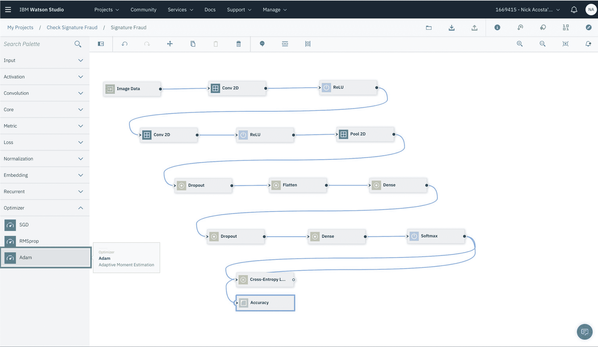
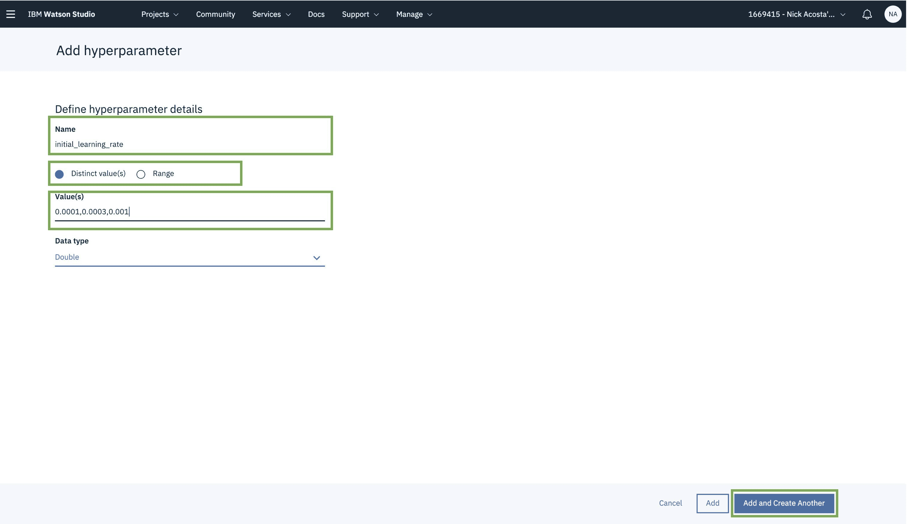

# 使用 Watson Studio Neural Network Modeler 和 Experiments 构建深度学习模型

> 原文：[`developer.ibm.com/zh/tutorials/create-and-experiment-with-dl-models-using-nn-modeler/`](https://developer.ibm.com/zh/tutorials/create-and-experiment-with-dl-models-using-nn-modeler/)

## 学习目标

深度学习是解决复杂问题的有效技术，数据科学中的“科学”部分就是指试验不同的设置并比较结果。利用 Watson Studio，您可以使用友好的 GUI 轻松构建神经网络，按照您喜爱的框架设置下载代码形式的模型，并创建实验以比较不同的超参数优化设置。

在本教程中，我们将通过构建深度神经网络来构建一个用于检测伪造签名的模型。您将学习如何使用 Watson Studio 的 Neural Network Modeler 快速构建神经网络架构原型并进行测试。您还将学习如何下载通过 Neural Network Modeler 生成的代码并进行修改，以将其插入 Watson Studio 的 Experiments Hyperparameter Optimization 并与其配合使用。”

数据集包含签名图像，一些是真实的，一些则是模仿的（伪造）。此数据集的原始来源是 [ICFHR 2010 年签名验证竞赛](http://www.iapr-tc11.org/mediawiki/index.php/ICFHR_2010_Signature_Verification_Competition_(4NSigComp2010)) [1]。图像大小调整为 32×32 像素，并以 pickle 格式存储为 Numpy 数组。

## 前提条件

*   一个 IBM [Cloud 帐户](https://cloud.ibm.com/registration?cm_sp=ibmdev-_-developer-tutorials-_-cloudreg)

*   IBM Cloud 目录中运行的 [Cloud Object Storage 服务实例](https://cloud.ibm.com/catalog/services/cloud-object-storage?cm_sp=ibmdev-_-developer-tutorials-_-cloudreg)

*   IBM Cloud 目录中运行的 [Machine Learning 服务实例](https://cloud.ibm.com/catalog/services/machine-learning?cm_sp=ibmdev-_-developer-tutorials-_-cloudreg)

*   IBM Cloud 目录中的 [Watson Studio 服务实例](https://cloud.ibm.com/catalog/services/watson-studio?cm_sp=ibmdev-_-developer-tutorials-_-cloudreg)

*   下载[包含资产的 zip 文件夹](https://s3.us.cloud-object-storage.appdomain.cloud/developer/tutorials/create-and-experiment-with-dl-models-using-nn-modeler/static/assets.zip)

## 预计花费时间

阅读并完成本教程中的步骤大约需要 1 小时时间。

## 步骤

### 1\. 将数据集上传到 IBM Cloud Object Storage

在开始构建神经网络之前，我们需要将包含数据的文件上传到云端的 Object Storage 实例。为此，前提条件是解压下载的 assets 文件夹，并确保可以找到 3 个不同的数据文件：`training_data.pickle`、`validation_data.pickle` 和 `test_data.pickle`。

转到 [IBM Cloud 上的仪表板](https://cloud.ibm.com/resources?cm_sp=ibmdev-_-developer-tutorials-_-cloudreg)，然后单击 Services 下的 Cloud Object Storage 实例。


选择 **Create Bucket** 以存储数据。此步骤的目的是在使用 Watson Studio 的 Neural Network Modeler 时便于查找数据。


存储桶的名称**对于 IBM Cloud Object Storage 而言必须是全局唯一的**。建议使用您的名称和项目的某种标识符。此外，确保在 Resiliency 下选中了 **Cross Region**，然后单击 **Create bucket**。


开始将文件添加到新创建的存储桶中。可以通过单击页面右上角的 **Upload** 按钮，并从下拉菜单中选择 **Files** 选项来实现。


选择 **Standard Upload** 选项，然后单击 **Select Files** 按钮。


从本地磁盘上的解压缩 assets 文件夹中选择名为 `training_data.pickle`、`validation_data.pickle` 和 `test_data.pickle` 的三个文件。您应该会看到一个对话框，要求您确认文件选择。单击 **Upload** 继续上传过程。


上传过程完成后，您应该会看到页面已更新，并显示刚刚上传的文件。


### 2\. 使用 Watson Studio Neural Network Modeler 来构建神经网络

在 Watson Studio 中选择 **Create a project**。


在下一页上选择 **Standard** 选项。


为您的项目命名，并关联 **Cloud Object Storage** 实例。如果您执行了上一步，系统应会检测到您的 Object Storage 实例，并且可从下拉列表中选择此实例。


您现在已准备好使用 Watson Studio。


创建 **Modeler Flow**。您可以在项目页面右上角的 **Add to project** 下找到此选项。


输入模型的名称，选择 **Neural Network Modeler**，然后单击 **Create**。


上一步成功后，您将会看到 Modeler 画布。您将在此处构建神经网络，它将以图形表示，而不是代码形式。您将在屏幕左侧找到一个名为 **Palette** 的侧边栏，其中包含神经网络的所有可能组件。整体理念是拖放表示神经网络不同层的节点，并连接它们以创建一个流程。


首先，我们需要为神经网络提供数据。为此，从 Neural Network Modeler Palette 的 Input 部分中选择 **Image Data**。


将 **Image Data** 节点拖放到画布上，然后双击修改其属性。注意，这将触发右侧的另一个侧边栏。


要定义数据源，可通过单击 Data 部分下的 **Create a New Connection** 创建与 Object Storage 实例（COS) 的新连接，或者选择一个连接（如果已存在）。选择包含数据资产的存储桶（参阅步骤 1）。选择 `training_data.pickle` 作为 Training（训练）数据文件），选择 `test_data.pickle` 作为 Test（测试）数据文件，选择 `validation_data.pickle` 作为 Validation（验证）数据文件。


现在关闭 Data 部分，并切换到同一右侧面板中的 Settings 部分。按照此处所述调整所有设置，如下面的截屏所示：

*   将 **Image height** 设置为 `32`
*   将 **Image width** 设置为 `32`
*   将 **Channels** 设置为 `1`，因为图像为灰阶
*   将 **Tensor dimensionality** 设置为 `channels_last`
*   将 **Classes** 设置为 `2`，因为我们试图将签名图像分为两类：真实和伪造
*   将 **Data format** 设置为 `Python Pickle`
*   将 **Epochs** 设置为 `100`，这是神经网络为了解详情并调整权重以达到更高准确度而迭代数据的次数
*   将 **Batch size** 设置为 `16`，这是一次输入并通过神经网络的图像数量

完成所有这些设置后，单击 **Close** 保存设置，然后关闭右侧边栏。


现在让我们开始构建神经网络。我们将添加的第一层是 2D 卷积层。从左侧边栏的 Convolution 部分选择 **Conv 2D** 节点，然后将其拖放到画布上。

> 注意：这是一个样本架构，请随意尝试不同或更高级架构


连接两个节点，双击 **Conv 2D** 节点编辑其属性。在右侧边栏中，将设置更改为以下内容：

*   将 **Number of filters** 设置为 `32`，这是我们要在给定图像中检测的特征图的数量
*   将 **Kernel row** 设置为 `3`，这是将在图像上滑动并执行特征检测的滤波器宽度（想象成一个窗口）
*   将 **Kernel col** 设置为 `3`，这是滤波器的高度
*   将 **Stride row** 设置为 `1`，这是滤波器水平滑动的量
*   将 **Stride col** 设置为 `1`，这是滤波器垂直滑动的量


继续编辑 Conv2D 节点属性：

*   将 **Weight LR multiplier** 设置为 `10`，这是一个乘以学习速率的值（稍后将在神经网络超参数中定义）。引入此项是为了分别修改每层的学习速率值
*   将 **Weight decay multiplier** 设置为 `1`，这是一个乘以衰减率的值（稍后将在神经网络超参数中定义）。引入此项是为了分别修改每层的权重衰减率
*   将 **Bias LR multiplier** 设置为 `10`
*   将 **Bias decay multiplier** 设置为 `1`

我们这里只编辑了所需的参数。此外，还有其他可选参数具有默认设置，例如 Initialization，这是初始权重值。您可以设置初始 Bias 值，并设置它是否可训练。您可以选择正则化方法，最大程度减少过度拟合并增强模型泛化。这是一种惩罚大权重并专注于学习小权重的方法，因为它们的复杂性较低，并为数据提供了更准确的解释；由此也提高了模型的泛化能力。

完成所有这些设置后，单击 **Close** 保存设置，然后关闭右侧边栏。


接下来，我们将添加第三个节点，这是一个激活层。我们将选择 ReLU (Rectified Linear Unit) 作为架构中的激活函数。ReLU 通常可以得出良好的结果，并广泛用于卷积神经网络。

拖放 **ReLU** 节点，您可以在左侧边栏中的 Activation 部分下找到它。


然后，我们将添加另一个卷积层，拖放左侧边栏中 Convolution 部分下的 **Conv2D** 节点。确保在将节点放到画布上后连接节点。


双击第二个 **Conv2D** 节点以触发右侧边栏，以便我们可以编辑其属性。将设置更改为以下内容：

*   将 **Number of filters** 设置为 `64`
*   将 **Kernel row** 设置为 `3`
*   将 **Kernel col** 设置为 `3`
*   将 **Stride row** 设置为 `1`
*   将 **Stride col** 设置为 `1`


继续编辑 Conv2D 节点属性：

*   将 **Weight LR multiplier** 设置为 `1`
*   将 **Weight decay multiplier** 设置为 `1`
*   将 **Bias LR multiplier** 设置为 `1`
*   将 **Bias decay multiplier** 设置为 `1`

完成所有这些设置后，单击 **Close** 保存设置，然后关闭右侧边栏。


添加另一个激活层，从左侧边栏的 Activation 部分拖放 **ReLU** 节点。


现在，我们将添加一个 Max Pooling 层，目的是对从先前的卷积层中提取的特征进行降采样或降维。这是通过获取将在前一层的输出上滑动的特定区域（窗口）内的最大值实现的。此步骤有助于聚合许多低级特征，仅提取最主要的特征，从而减少要处理的数据量。

从左侧边栏的 Convolutional 部分拖放 **Pool 2D** 节点。


双击 **Pool 2D** 节点编辑其属性。将设置更改为以下内容：

*   将 **Kernel row** 设置为 `2`
*   将 **Kernel col** 设置为 `2`
*   将 **Stride row** 设置为 `1`
*   将 **Stride col** 设置为 `1`

完成所有这些设置后，单击 **Close** 保存设置，然后关闭右侧边栏。


接下来，我们将添加 Dropout 层。该层的目的是帮助减少过度拟合，主要是通过随机丢弃或忽略网络中的某些神经元来实现。

从左侧边栏的 Core 部分拖放 **Dropout** 节点。


双击 **Dropout** 节点，将其 Probability 更改为 `0.25`，然后单击 **Close**。


现在，让我们转到完全连接的层。为此，我们需要将我们目前的输出展平为 1D 矩阵。

从 Core 部分中拖放 **Flatten** 节点。


从左侧边栏的 Core 部分拖放 **Dense** 节点。


双击 **Dense** 节点，将设置中的节点数更改为 `128`，然后单击 **Close**。


添加另一个 **Dropout** 节点。将此层的 Probability 更改为 `0.5` 并单击 **Close**。


添加最后一个 **Dense** 节点。这将代表输出类，在此情况下有两个。双击节点，将设置中的节点数更改为 `2`，然后单击 **Close**。


现在，让我们在架构的最后添加一个激活层。我们在这里使用 Softmax，它通常用于神经网络的最后一层。它返回 [0,1] 范围内的输出，表示最终层中每个节点的 true 和 false 值。

将 **Softmax** 节点拖放到画布上，并将其连接到以前的节点。


接下来，我们需要添加一种方法来计算模型的性能。这以成本函数的形式来表示，该函数通过与数据集中的实际标签相比较，计算模型预测输出的误差。我们的目标是尽可能减少损失。可用于计算分类模型损失的函数之一是 Cross-Entropy。

从左侧边栏的 Loss 部分拖放 **Cross-Entropy** 节点。


我们将添加另一个节点来计算模型预测结果的准确性。从左侧边栏的 Metrics 部分拖放 **Accuracy** 节点。


将 **Cross-Entropy** 和 **Accuracy** 节点都连接到 **Softmax** 节点。两者都将对模型的输出执行计算。


最后，我们将添加一个优化算法，该算法定义模型如何微调其参数以最小化损失。优化算法有很多，在这个例子中，我们将使用 Adam 优化器。这是一种通常运行良好的优化算法，可在更短的时间内取得最佳效果。

从左侧边栏的 Optimizer 部分拖放 **Adam** 节点。



双击 **Adam** 节点，将其设置更改为以下内容：

*   将 Learning rate 设置为 `0.001`。
*   将 Decay 设置为 `0`。Decay 可在训练迭代期间改变学习速率，使其随着模型接近收敛或真实值而变小。在 Adam 优化器中，我们不需要设置此值，因为 Adam 已经在训练期间改变了学习速率，即，它不像其他优化算法（如 SGD）那样采用固定值。

使用其他参数（Beta_1 和 Beta_2）背后的原因是，Adam 算法更新了梯度及其平方的指数移动平均值，其中这些参数控制这些移动平均值的指数衰减率。移动平均值本身是梯度的第一个时刻（平均值）和第二个原始时刻（偏心方差）的估计值 [2]。

参数 Beta_1 和 Beta_2 已经设置为默认值 `0.9` 和 `0.999`，这些都有利于解决计算机视觉问题。


### 3\. 从 Neural Network Modeler 发布模型，并使用 Experiments 对其进行训练

既然已有了神经网络的完整架构，现在就让我们开始训练它，看看它在数据集上的表现如何。您可以直接从 Watson Studio 的 Neural Network Modeler 界面进行操作。

在顶部工具栏中，选择 **Publish training definition** 选项卡，然后单击它。


为您的模型命名，以便日后识别。您需要将 Watson Machine Learning Service（来自 IBM Cloud 目录）与您的项目相关联。如果尚未关联，系统会提示您立即执行此操作。在给定的提示中，单击 **Settings** 链接。


您将被重定向到项目设置页面。在这里，您可以管理与当前项目相关的所有服务和设置。向下滚动到 Associated Services 部分，单击 **Add service**，并从下拉列表中选择 **Watson**。


然后，将会向您显示所有可用的 Watson 服务。选择 **Machine Learning**，然后单击 **Add**。


如果您还没有正在运行的 Machine Learning 服务实例，选择 **New** 选项以即时创建一个。


如果您满足了前提条件并且已有一个 Machine Learning 服务实例，则选择 **Existing** 选项。从下拉列表中选择您的服务。


现在，您将被重定向回项目设置页面。单击顶部栏上的 **Assets**，返回 Watson Studio 上的主仪表板。向下滚动到 Modeler flows 部分，然后根据您给出的名称选择我们正在处理的流程。


加载流程后，再次单击顶部工具栏中的 **Publish training definition** 选项卡。


确保为您的模型命名，检测到 Machine Learning 服务并将其选中，然后单击 **Publish**。


完成训练定义的发布后，您将在屏幕顶部找到一条通知，显示在 Experiments 中训练模型的链接，单击此链接。


现在，我们将开始创建一个新的实验。首先为其命名，然后选择 Machine Learning 服务。最后，我们需要定义数据来源以及训练结果的位置。

单击 **Select**，选择包含数据集的存储桶。


由于您一直在跟进，您应该已经与 Object Storage 建立连接，从下拉列表中选择该连接。


通过选择 **Existing** 单选按钮，然后选择存储数据的存储桶名称，如本指南中的**步骤 1** 所示，选择包含数据集的存储桶。然后，单击页面底部的 **Select**。


您将被重定向回新的实验详细信息页面，以选择训练结果的存储位置，单击 **Select**。


与上一步一样，选择 **Existing connection**，从下拉列表中选择 Object Storage 连接，并通过选择 **New** 存储桶（名称对于 IBM Cloud Object Storage 而言是全局唯一的），选择用于存储结果的存储桶。最后，单击页面底部的 **Select**。

> 注意：建议使用两个不同的存储桶，以分别存储数据集和训练结果


现在回到新的实验详细信息页面，让我们点击页面右侧的 **Add training definition** 链接。


由于我们已经从 Neural Network Modeler 发布了一个训练定义，我们将选择 **Existing training definition** 选项。


根据您之前提供的名称，从下拉列表中选择训练定义。然后，单击页面底部的 **Select**。


让我们选择将用于训练模型的硬件选项。如果您是免费套餐 (Lite) 帐户，则可以访问 **Compute Plan** 下拉列表中的第一个选项。


对于 **Hyperparameter Optimization Method**，我们暂时选择 `None`，在使用 Keras 代码（而不是 Neural Network Modeler）创建训练定义时，我们将在下一步回到此处。最后，单击页面底部的 **Select**。


最终，您将被重定向到新的实验详细信息页面，查看所有选项并确保一切都已设置，然后单击页面底部的 **Create and run**。


现在开始训练您的模型，您将看到一个视图，其中显示有关训练过程的详细信息以及模型监控方式。


对模型进行训练后，它将列在页面底部的 Completed 部分中，并详细说明其执行情况。


如果您对自己的模型感到满意，就可以将其投入生产，并开始实际使用它对新图像进行评分！要执行此操作，第一步是单击 Actions 选项卡下的三个垂直点，然后选择 **Save Model**。稍后可以在 Watson Studio 项目主仪表板的 Models 部分中找到已保存的模型。您可以在此将其部署为 REST API。


### 4\. 对于专家：编写您自己的模型，在 Experiments 中训练并利用 Hyperparameter Optimization

如果您希望最大程度控制架构、模型和超参数，可以选择将自己的代码文件导入到 Experiments 中，并对其进行训练。

Watson Studio Experiments 具备以下优势：

*   利用云端功能强大的硬件，无需任何软硬件配置设置。Watson Studio 为您提供深度学习即服务 (DLaaS)。

*   并行运行多个实验

*   通过为 Watson Studio 提供不同超参数的一系列值，使用超参数优化。Watson Studio 将使用不同的超参数设置创建模型的多个变体，它会将模型的每个变体都打包到容器中，并将其部署在 Kubernetes 集群上。所有模型变体都将并行运行，Kuberenetes 将实时监控每个模型的性能。训练过程结束时，您可以阅读有关所有不同运行性能的详细信息，以及分别使用的超参数的详细信息。

*   通过 Distributed Deep Learning 针对计算密集型工作负载进行训练，并通过在多台服务器上分配工作负载，让训练速度呈指数增长。

> 注意：本指南中并未介绍此功能，但您可以在 [Watson Studio 文档](https://dataplatform.cloud.ibm.com/docs/content/analyze-data/ml_dlaas_ibm_ddl.html?audience=wdp&context=analytics&cm_sp=ibmdev-_-developer-tutorials-_-cloudreg)中了解更多相关信息

让我们开始处理代码。

您可以使用支持的深度学习框架从头开始编写模型，例如 *TensorFlow*、*Keras*、*PyTorch* 和 *Caffe*。我们在这里选择了另外一种方案，即，让 Watson Studio 的 Neural Network Modeler 以您青睐的框架代码自动为您生成代码，然后在此基础上进一步修改。

打开之前创建的神经网络流程，在顶部工具栏中，单击 **Download** 选项卡，从下拉列表中选择一个框架，在本指南中，我们将使用 **Keras Code**。


代码将下载到本地计算机上的 zip 文件夹中。您将找到两个文件：`keras_helper.py` 和 `keras_driver.py`。

> 注意：zip 文件夹的名称和内部包含的文件可能有所不同


负责该模型的代码可以在 `keras_driver.py` 文件中找到，在您喜欢的代码编辑器中打开它。

我们将对代码进行一些修改，以便为插入 Watson Studio 的 Experiments HPO 做好准备。

首先，我们将导入一些库。在代码的 imports 部分中，添加以下行：

```
import json
from os import environ
from emetrics import EMetrics 
```

`emetrics` 导入引用具有相同名称的 python 脚本，它在本指南随附的 assets 文件夹中提供，并根据前提条件中的要求进行下载。Emetrics 负责将模型的结果写入日志，并按照 Watson Studio 界面预期的方式对其进行格式化。

接下来，在 imports 部分下面添加以下代码块：

```
###############################################################################
# Set up working directories for data, model and logs.
###############################################################################
model_filename = "SignatureFraud.h5"

# writing the train model and getting input data
if environ.get('RESULT_DIR') is not None:
    output_model_folder = os.path.join(os.environ["RESULT_DIR"], "model")
    output_model_path = os.path.join(output_model_folder, model_filename)
else:
    output_model_folder = "model"
    output_model_path = os.path.join("model", model_filename)

os.makedirs(output_model_folder, exist_ok=True)

###############################################################################
# Set up HPO.
###############################################################################

config_file = "config.json"

if os.path.exists(config_file):
    with open(config_file, 'r') as f:
        json_obj = json.load(f)
    if "initial_learning_rate" in json_obj:
        learning_rate = json_obj["initial_learning_rate"]
    else:
        learning_rate = 0.001000
    if "batch_size" in json_obj:
        batch_size = json_obj["batch_size"]
    else:
        batch_size = 16
    if "num_epochs" in json_obj:
        num_epochs = json_obj["num_epochs"]
    else:
        num_epochs = 100
    if "decay" in json_obj:
        decay = json_obj["decay"]
    else:
        decay = 0.100000
    if "beta_1" in json_obj:
        beta_1 = json_obj["beta_1"]
    else:
        beta_1 = 0.900000
    if "beta_2" in json_obj:
        beta_2 = json_obj["beta_2"]
    else:
        beta_2 = 0.999000  
else:
    learning_rate = 0.001000
    batch_size = 16
    num_epochs = 100
    decay = 0.100000
    beta_1 = 0.900000
    beta_2 = 0.999000

def getCurrentSubID():
    if "SUBID" in os.environ:
        return os.environ["SUBID"]
    else:
        return None

class HPOMetrics(keras.callbacks.Callback):
    def __init__(self):
        self.emetrics = EMetrics.open(getCurrentSubID())

    def on_epoch_end(self, epoch, logs={}):
        train_results = {}
        test_results = {}

        for key, value in logs.items():
            if 'val_' in key:
                test_results.update({key: value})
            else:
                train_results.update({key: value})

        #print('EPOCH ' + str(epoch))
        self.emetrics.record("train", epoch, train_results)
        self.emetrics.record(EMetrics.TEST_GROUP, epoch, test_results)

    def close(self):
        self.emetrics.close()

# Perform data pre-processing
defined_metrics = []
defined_loss = [] 
```

此代码块的主要功能是定义一个目标文件夹来存储模型的结果，保存训练好的模型并写入日志。它还负责抓取 Watson Studio 的 Experiment HPO 界面提供的数据。界面中提供的超参数存储在 `config_file` 中，我们用它来提取超参数值，并将它们存储在稍后将由模型访问的变量中。

> 重要注意事项：在重新定义超参数变量或将其分配给新值之后，请确保您没有冲突的代码行，否则会导致 HPO 无法正常工作

找到下面这个代码块：

```
model_inputs = [ImageData_1]
model_outputs = [Softmax_12]
model = Model(inputs=model_inputs, outputs=model_outputs) 
```

将所有以下代码替换为这个代码块：

```
# Starting Hyperparameter Optimization
hpo = HPOMetrics()

# Define optimizer
optim = Adam(lr=learning_rate, beta_1=beta_1, beta_2=beta_2, decay=decay)

# Perform training and other misc. final steps
model.compile(loss=defined_loss, optimizer=optim, metrics=defined_metrics)
if len(model_outputs) > 1:
    train_y = [train_y] * len(model_outputs)
    if len(val_x) > 0: val_y = [val_y] * len(model_outputs)
    if len(test_x) > 0: test_y = [test_y] * len(model_outputs)

# Writing metrics
log_dir = os.environ.get("LOG_DIR")
sub_id_dir = os.environ.get("SUBID")
static_path_train = os.path.join("logs", "tb", "train")
static_path_test = os.path.join("logs", "tb", "test")
if log_dir is not None and sub_id_dir is not None:
    tb_directory_train = os.path.join(log_dir, sub_id_dir, static_path_train)
    tb_directory_test = os.path.join(log_dir, sub_id_dir, static_path_test)

    tensorboard_train = TensorBoard(log_dir=tb_directory_train)
    tensorboard_test = TensorBoard(log_dir=tb_directory_test)
else:
    tb_directory_train = static_path_train
    tb_directory_test = static_path_test

    tensorboard_train = TensorBoard(log_dir=tb_directory_train)
    tensorboard_test = TensorBoard(log_dir=tb_directory_test)

if (len(val_x) > 0):
    history = model.fit(
        train_x,
        train_y,
        batch_size=batch_size,
        epochs=num_epochs,
        verbose=1,
        validation_data=(val_x, val_y),
        shuffle=True,
        callbacks=[tensorboard_train, tensorboard_test, hpo])
else:
    history = model.fit(
        train_x,
        train_y,
        batch_size=batch_size,
        epochs=num_epochs,
        verbose=1,
        shuffle=True,
        callbacks=[tensorboard_train, tensorboard_test, hpo])

hpo.close()

#print("Training history:"+ str(history.history))

if (len(test_x) > 0):
    test_scores = model.evaluate(test_x, test_y, verbose=1)
    #print(test_scores)
    print('Test loss:', test_scores[0])
    print('Test accuracy:', test_scores[1])

model.save(output_model_path)
print("Model saved in file: %s" % output_model_path) 
```

这应该是代码的结尾。

我们刚刚介绍的是将 `emetrics` helper 模块插入到模型中的方法，因此它可以读取模型的训练历史记录，将其写入日志并存储。此模块还将写入一个 `val_dict.json` 文件，该文件将包含模型训练每一步的准确性，作为衡量其性能的方式。Watson Studio 的界面将使用这个 `val_dict.json` 文件来显示具有不同超参数的不同训练运行的性能，以便您可以加以比较。

如果您想查看 `keras_driver.py` 中的完整代码以供参考，可以在下面的位置中找到此代码：[keras_driver.py](https://s3.us.cloud-object-storage.appdomain.cloud/developer/tutorials/create-and-experiment-with-dl-models-using-nn-modeler/static/keras_driver.py)

现在，要开始将代码上传到 Watson Studio Experiments，就需要将其压缩到 zip 文件夹中。您需要在文件夹中包含以下文件：

*   最近修改的 `keras_driver.py`
*   `keras_helper.py`
*   本指南的资产中提供的 `emetrics.py`
*   `training_data.pickle` – 已提供
*   `validation_data.pickle` – 已提供
*   `test_data.pickle` – 已提供

一旦将所有文件都放在压缩文件夹中，我们就可以继续使用 Watson Studio 来开始训练过程。

在 Watson Studio 的主仪表板中，向下滚动到 Experiments 部分，然后单击 **New experiment**。


为实验命名，确保选择了 Machine Learning 服务，并按照先前在**步骤 3** 中的操作，为数据集和训练结果选择存储桶。


单击屏幕右侧的 **Add training definition**。


选择 **New training definition** 选项，为其命名，然后拖放先前准备的 zip 文件夹（包含代码文件和数据集）。


选择用于训练的框架，在本例中，我们编写了在 Tensorflow 上运行的 Keras 代码，因此我们将从下拉列表中选择 **TensorFlow** 选项。

将以下代码行写为执行命令，它与您在本地从终端执行代码的方式类似： `python3 keras-code/keras_driver.py`

选择 **Compute plan**，然后为 **Hyperparameter optimization method** 选择 `RBFOpt`，为 **Number of optimizer steps** 选择 `100`，为 **Objective** 选择 `accuracy`，并在 **Maximize or minimze** 字段中选择 `maximize`。最后，单击 **Add hyperparameter**。


让我们添加第一个超参数，并指定其名称。**注意：确保名称与 `config.json` 中定义的名称完全匹配，您可以参考 `keras_driver.py` 中的代码块，我们在此提取了超参数值。** 输入 `initial_learning_rate` 作为超参数的名称。选择 **Distinct value(s)** 单选按钮，因为我们将在此处添加不同的值。最后，输入您希望模型在训练期间选择的值。这里我使用了以下值：`0.0001,0.0003,0.001`。完成后，单击屏幕底部的 **Add and Create another**。



对于下一个超参数，在 **Name** 字段中输入 `batch_size`。这次我们将使用预定义步骤添加一系列值，因此选择 **Range** 单选按钮。为 **Lower bound** 输入 `8`，并为 **Upper bound** 输入 `32`。为 **Traverse** 方法选择 `Step`，并为 **Step** 值选择 `8`。最后，单击 **Add and Create another**。


让我们添加最后一个超参数，在 **Name** 字段中输入 `num_epochs`，选择 **Distinct value(s)** 单选按钮，然后在 **Value(s)** 字段中输入 `100,200`。最后，单击页面底部的 **Add**。如果您想添加其他超参数（例如 decay、beta_1、beta_2、dropout_1 或 dropout_2），可以像之前一样单击 Add and Create another。


返回训练定义详细信息屏幕，查看所有设置，并确保提供了所有必需的详细信息，然后单击页面底部的 **Create**。

您始终可以添加更多训练定义，所有这些定义都将并行运行。


您将被重定向回新的实验详细信息页面，确认所有设置都已就位，然后单击页面底部的 **Create and run**。


Watson Studio 将使用您为每次训练运行的超参数提供的不同值，创建不同的训练运行。它们将并行运行，并将实时显示进度。训练完成后，将列出所有运行情况及其执行详情。通过浏览顶部栏中的 **Compare Runs**，您可以大致了解每个模型的执行情况以及该模型使用的超参数。


您还可以查看所有训练迭代期间模型的历史记录和性能图表。


如果您对某个模型的性能感到满意，可以像我们之前看到的那样保存模型，以便为部署和评分做好准备。

## 结束语

在本教程中，您了解了 Watson Studio 上提供的强大深度学习工具；学习了如何使用 Neural Network Modeler 快速构建神经网络架构原型，如何发布神经网络流程并使用 Experiments 对其进行训练；还学习了如何使用 Experiments 和 HPO 导入自己的代码，对其进行训练和优化，并监控其性能。

## 参考资料

1.  Marcus Liwicki、Muhammad Imran Malik、Linda Alewijnse、Elisa van den Heuvel 和 Bryan Found，“ICFHR2012 Competition on Automatic Forensic Signature Verification (4NsigComp 2012)”，2012 年第 13 届国际手写识别前沿会议记录。

2.  Diederik P. Kingma 和 Jimmy Ba，“Adam：A Method for Stochastic Optimization”，2015 年圣地亚哥第三届国际学术代表会议。

3.  关于深度学习的 IBM Watson Studio 文档 [`dataplatform.cloud.ibm.com/docs/content/analyze-data/ml_dlaas.html?context=analytics`](https://dataplatform.cloud.ibm.com/docs/content/analyze-data/ml_dlaas.html?context=analytics&cm_sp=ibmdev-_-developer-tutorials-_-cloudreg)

4.  IBM Watson Studio：深度学习程序编码指南 [`dataplatform.cloud.ibm.com/docs/content/analyze-data/ml_dlaas_code_guidelines.html`](https://dataplatform.cloud.ibm.com/docs/content/analyze-data/ml_dlaas_code_guidelines.html?cm_sp=ibmdev-_-developer-tutorials-_-cloudreg)

本文翻译自：[Deep learning models using Watson Studio Neural Network Modeler and Experiments](https://developer.ibm.com/tutorials/create-and-experiment-with-dl-models-using-nn-modeler/)（2018-12-14）