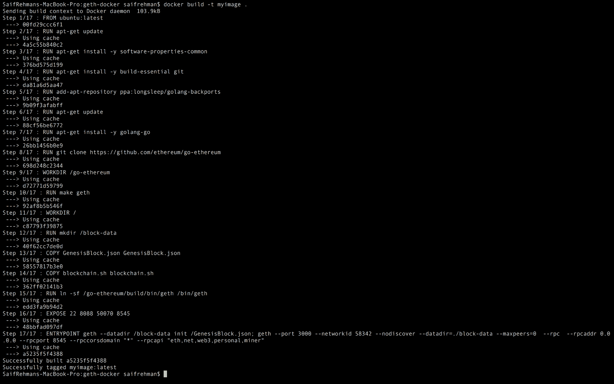
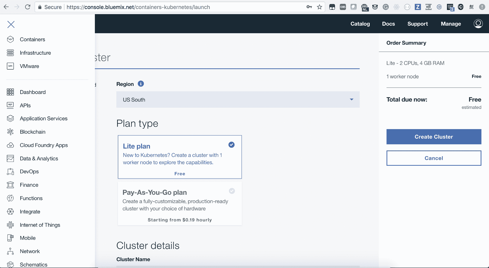
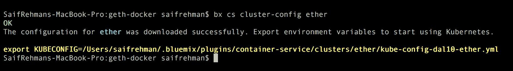
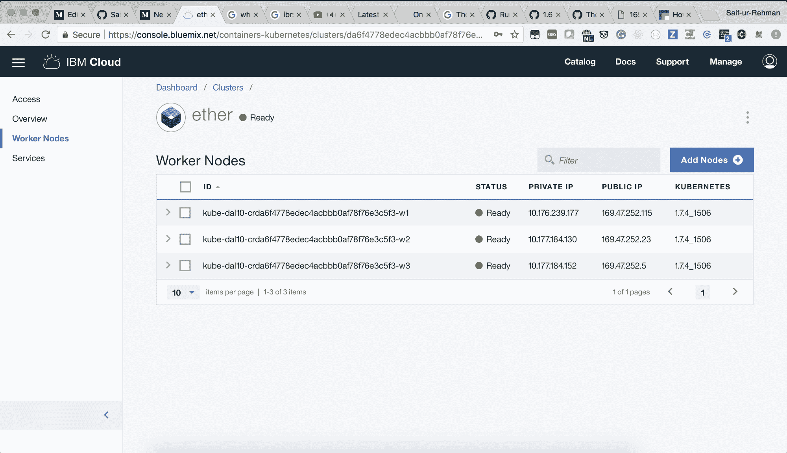
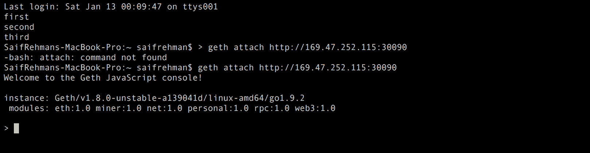
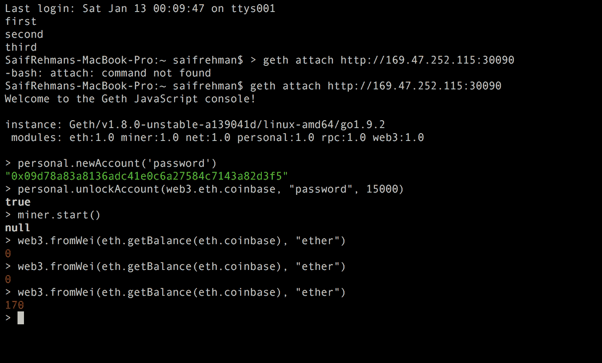

# 将专用 Ethereum 区块链部署到 IBM Cloud Kubernetes Service

> 原文：[`developer.ibm.com/zh/tutorials/deploying-ethereum-blockchain-to-ibm-container/`](https://developer.ibm.com/zh/tutorials/deploying-ethereum-blockchain-to-ibm-container/)

Ethereum 是一个开源区块链平台，允许任何人构建在区块链上运行的分散式应用程序。Ethereum 提供分散式图灵完备虚拟机，称为 Ethereum 虚拟机 (EVM)，它可使用公共节点的国际网络来执行脚本。Ethereuem 适应性强且使用灵活，并且还具有使用 Solidity 编程语言在区块链上部署智能合约的功能。

与 Docker 类似，IBM Cloud Kubernetes Service 是一种开源开发工具，可用于打包应用程序，并使用准系统 Linux 机器和运行应用程序所需的所有依赖项在任意位置运行。容器化意味着您的应用程序在隔离的容器中运行，这是一种明确定义、可重现且可移植的环境。类似于货物运输，您通过集装箱运送货物。应用的容器是该应用在计算场景中的运行环境。通过 Docker，您可运送运行环境以及您的应用程序。通过 IBM Cloud Kubernetes Service，您可利用 Docker 容器将应用程序容器化，并在 IBM Cloud 上运行。

## 学习目标

了解如何在 IBM Cloud 上轻松部署专用 Ethereum 区块链。

## 前提条件

**免费试用 IBM Cloud**

利用 [IBM Cloud Lite](https://cocl.us/IBM_CLOUD_GCG) 快速轻松地构建您的下一个应用程序。您的免费帐户从不过期，而且您会获得 256 MB 的 Cloud Foundry 运行时内存和包含 Kubernetes 集群的 2 GB 存储空间。[了解所有细节](https://www.ibm.com/cloud/blog/announcements/introducing-ibm-cloud-lite-account-2)并确定如何开始。

*   安装 IBM Cloud CLI，如 [IBM Cloud 文档](https://cloud.ibm.com/docs/cli?topic=cloud-cli-ibmcloud-cli#overview)中所述。
*   安装 Docker，如 [Docker 文档](https://docs.docker.com/engine/installation/)中所述。
*   安装并设置 Kubectl，如 [Kubernetes 文档](https://kubernetes.io/docs/tasks/tools/install-kubectl/)中所述。
*   安装 Geth（Go-Ethereum 客户端），如 [Geth 文档](https://github.com/ethereum/go-ethereum/wiki/Installing-Geth)中所述。

## 预估时间

将区块链网络部署到 IBM Cloud 大约需要一小时。

## 步骤

### 构建 Docker 镜像

1.  创建新目录并浏览至此目录。

    ```
     mkdir blockchain
     cd blockchain 
    ```

2.  使用 `touch Dockerfile` 创建空 Docker 文件，然后将以下内容粘贴在该 Docker 文件中：

    ```
     FROM ubuntu:latest
     # Get the Ethereum Stuffs
     RUN apt-get update
     RUN apt-get install -y software-properties-common
     RUN apt-get install -y build-essential git
     RUN add-apt-repository ppa:longsleep/golang-backports
     RUN apt-get update
     RUN apt-get install -y golang-go
     RUN git clone https://github.com/ethereum/go-ethereum
     WORKDIR /go-ethereum
     RUN make geth
     WORKDIR /
     # House the data here
     RUN mkdir /block-data
     # Pass in the genesis block.
     COPY GenesisBlock.json GenesisBlock.json
     RUN ln -sf /go-ethereum/build/bin/geth /bin/geth
     EXPOSE 22 8088 50070 8545
     ENTRYPOINT geth --datadir /block-data init /GenesisBlock.json; geth --port 3000 --networkid 58342 --nodiscover --datadir=./block-data --maxpeers=0  --rpc  --rpcaddr 0.0.0.0 --rpcport 8545 --rpccorsdomain "*" --rpcapi "eth,net,web3,personal,miner" 
    ```

3.  使用 `touch GenesisBlock.json` 创建可帮助配置区块链网络的空文件，然后将以下内容粘贴到新配置文件中：

    ```
     {
         "config": {
           "chainId": 456719,
           "homesteadBlock": 0,
           "eip155Block": 0,
           "eip158Block": 0
         },
         "nonce": "0x0000000000000042",
         "mixhash": "0x0000000000000000000000000000000000000000000000000000000000000000",
         "difficulty": "0x000",
         "coinbase": "0x3333333333333333333333333333333333333333",
         "timestamp": "0x0",
         "parentHash": "0x0000000000000000000000000000000000000000000000000000000000000000",
         "extraData": "0x",
         "gasLimit": "0x8888000",
         "alloc": {
         }
       } 
    ```

4.  构建 Docker 镜像：

    ```
     docker build -t myimage . 
    ```

    

5.  确保通过运行 `docker images` 命令来构建镜像：

### 将 Docker 镜像部署到 IBM Cloud Kubernetes Service

#### 在 IBM Cloud 上创建容器服务

1.  转至 IBM Cloud 的 [基于 Kubernetes 的容器服务](https://console.bluemix.net/containers-kubernetes/catalog/cluster)，并创建新集群。为集群提供唯一名称；暂时将其称为 `ether`。

    

2.  等到完全部署该服务后再使用。

    

#### 设置您的容器

1.  通过运行以下命令为容器服务安装 IBM Cloud CLI 插件：

    ```
     bx plugin install container-service -r Bluemix 
    ```

2.  使用 IBM Cloud CLI 登录到您的 IBM Cloud 帐户：

    ```
     bx login -a https://api.ng.bluemix.net 
    ```

3.  设置集群的终端上下文：

    ```
     bx cs cluster-config <cluster_name_or_id> 
    ```

    

4.  下载配置文件后，将会显示可用于将本地 Kubernetes 配置文件的路径设置为环境变量的命令。例如：

    ```
     export KUBECONFIG=/Users/saifrehman/.bluemix/plugins/container-service/clusters/ether/kube-config-dal10-ether.yml 
    ```

#### 将镜像从您的机器推送到 IBM Cloud Private 注册表

现在，将您的镜像推送到 IBM Cloud 上的 Container Registry。为此，您将需要标记镜像以指向此注册表，选择本地镜像，设置目标名称空间以及目标存储库。

1.  选择首个名称空间的名称，并创建该名称空间。例如：

    ```
     bx cr namespace-add etherprivate 
    ```

2.  将本地 Docker 守护程序登录到 IBM Cloud Container Registry 中：

    ```
     bx cr login 
    ```

3.  标记您的 Docker 镜像。例如：

    ```
     docker tag myimage registry.ng.bluemix.net/etherprivate/myimage 
    ```

4.  将镜像推送到 IBM 专用注册表。例如：

    ```
     docker push registry.ng.bluemix.net/etherprivate/myimage 
    ```

#### 将您的镜像部署到 IBM Cloud 上的 Kubernetes 集群

1.  创建一个空文件，通过使用 `touch service.deployment.yml` 来配置 Kubernetes 部署，然后将以下内容粘贴到新配置文件中：

    ```
     apiVersion: extensions/v1beta1
     kind: Deployment
     metadata:
      name: blockchain-server-test # give any name
     spec:
      replicas: 3
      template:
        metadata:
          name: blockchain-server-test
          labels:
            run: etherprivate
        spec:
          containers:
            - name: ether
              image: "registry.ng.bluemix.net/etherprivate/myimage" # your registery name
              imagePullPolicy: Always
     --
     apiVersion: v1
     kind: Service
     metadata:
      name: my-service-test-11 # give a service name
      labels:
        run: etherprivate
     spec:
      type: NodePort
      selector:
        run: etherprivate
      ports:
       - protocol: TCP
         port: 8545 # it shall be 8545 and no other port !!!!!
         nodePort: 30090 # Give a port to access the application publically 
    ```

考虑更改以下几项内容：

*   向应用程序提供元数据名称
*   已创建的容器名称
*   已在 IBM 专用注册表中创建的镜像名称
*   端口（在本例中，使用的是端口 8545）
*   节点端口（可以是从 30000 到 60000 的任何端口）

*   保存集群的 Kubernetes 配置并运行以下命令：

    ```
     kubectl create -f service-deployment.yml 
    ```

*   一旦部署，即可使用工作节点的公共 IP 来访问应用程序：

    

### 测试您的专用 Ethereum 区块链

1.  要确保您的应用程序正在运行，请发出 `curl` 命令。（如果您看不到任何输出，请勿担心；它暂时还不会向您返回任何内容。）

    ```
     curl http://169.47.252.115:30090 
    ```

2.  通过使用 `geth` 来访问在 IBM Cloud Kubernetes Service 上运行的专用 Ethereum 区块链：

    ```
     geth attach http://169.47.252.115:30090 
    ```

    

现在，您已具有在 IBM Cloud 上运行的 Ethereum 区块链！

#### 用于开始挖掘的常见命令

*   **创建新帐户**：`personal.newAccount('password')`
*   **解锁帐户**：`personal.unlockAccount(web3.eth.coinbase, "password", 15000)`
*   **开始挖掘**：`miner.start()`
*   **停止挖掘**：`miner.stop()`



## 结束语

恭喜！您已成功在 IBM Cloud 上设置了专用 Ethereum 区块链。现在，您可以访问该区块链并部署 Solidity 智能合约，以在 IBM Cloud 上创建分布式应用程序。

本文翻译自：[Deploying a private Ethereum blockchain to IBM Cloud Kubernetes Service](https://developer.ibm.com/tutorials/deploying-ethereum-blockchain-to-IBM-Container/)（2018-03-23）